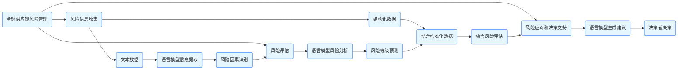

# 语言模型在全球供应链风险管理中的应用

> 关键词：语言模型、全球供应链风险管理、自然语言处理、风险评估、决策支持

> 摘要：本文深入探讨了语言模型在全球供应链风险管理中的应用。首先介绍了研究的背景、目的、预期读者和文档结构，明确了相关术语。接着阐述了语言模型和全球供应链风险管理的核心概念及其联系，通过文本示意图和 Mermaid 流程图进行直观展示。详细讲解了核心算法原理，并用 Python 代码进行了具体实现。给出了相关的数学模型和公式，并举例说明。通过项目实战，介绍了开发环境搭建、源代码实现和代码解读。分析了语言模型在全球供应链风险管理中的实际应用场景。推荐了学习资源、开发工具框架和相关论文著作。最后总结了未来发展趋势与挑战，提供了常见问题解答和扩展阅读参考资料，旨在为相关领域的研究和实践提供全面且深入的指导。

## 1. 背景介绍 
### 1.1 目的和范围
随着全球化的不断推进，全球供应链变得日益复杂和庞大。供应链中的各个环节相互关联，一个环节出现问题可能会对整个供应链产生连锁反应，导致严重的经济损失。全球供应链风险管理的重要性日益凸显，它旨在识别、评估和应对供应链中可能出现的各种风险，以确保供应链的稳定运行。

语言模型作为自然语言处理领域的重要技术，近年来取得了显著的进展。它能够理解和生成自然语言文本，具有强大的语义分析和信息提取能力。本研究的目的是探讨如何将语言模型应用于全球供应链风险管理中，利用其技术优势解决供应链风险管理中的实际问题，如风险识别、评估和预警等。

本研究的范围涵盖了语言模型在全球供应链风险管理各个环节的应用，包括但不限于风险信息收集、风险因素分析、风险等级评估和决策支持等。同时，还将探讨应用过程中可能面临的挑战和解决方案。

### 1.2 预期读者
本文的预期读者主要包括以下几类人群：
1. **供应链管理人员**：负责全球供应链的规划、运营和管理，希望了解如何利用语言模型提升供应链风险管理的效率和效果。
2. **数据科学家和人工智能工程师**：对自然语言处理技术和供应链风险管理有兴趣，希望探索语言模型在该领域的应用潜力和技术实现方法。
3. **研究人员**：从事供应链管理、人工智能等相关领域的研究工作，希望获取关于语言模型在全球供应链风险管理中应用的最新研究成果和实践经验。
4. **企业决策者**：关注企业供应链的稳定性和竞争力，希望了解语言模型在供应链风险管理中的战略价值和投资回报。

### 1.3 文档结构概述
本文将按照以下结构进行组织：
1. **背景介绍**：阐述研究的目的、范围、预期读者和文档结构，明确相关术语。
2. **核心概念与联系**：介绍语言模型和全球供应链风险管理的核心概念，通过文本示意图和 Mermaid 流程图展示它们之间的联系。
3. **核心算法原理 & 具体操作步骤**：详细讲解语言模型的核心算法原理，并用 Python 代码进行具体实现。
4. **数学模型和公式 & 详细讲解 & 举例说明**：给出语言模型在全球供应链风险管理中应用的数学模型和公式，并举例说明。
5. **项目实战：代码实际案例和详细解释说明**：通过一个具体的项目实战，介绍开发环境搭建、源代码实现和代码解读。
6. **实际应用场景**：分析语言模型在全球供应链风险管理中的实际应用场景。
7. **工具和资源推荐**：推荐学习资源、开发工具框架和相关论文著作。
8. **总结：未来发展趋势与挑战**：总结语言模型在全球供应链风险管理中的应用现状，展望未来发展趋势，分析可能面临的挑战。
9. **附录：常见问题与解答**：提供常见问题的解答，帮助读者更好地理解和应用相关技术。
10. **扩展阅读 & 参考资料**：提供扩展阅读的建议和参考资料，方便读者深入学习和研究。

### 1.4 术语表
#### 1.4.1 核心术语定义
- **语言模型**：一种基于统计学和机器学习的模型，用于预测给定上下文下下一个单词或字符的概率分布。它能够理解和生成自然语言文本，在自然语言处理领域有广泛的应用。
- **全球供应链风险管理**：指对全球范围内供应链中可能出现的各种风险进行识别、评估、应对和监控的过程，旨在确保供应链的稳定运行和企业的可持续发展。
- **自然语言处理（NLP）**：研究如何让计算机理解、处理和生成自然语言的技术领域，包括文本分类、情感分析、信息提取等任务。
- **风险评估**：对供应链中可能出现的风险进行量化分析，评估其发生的可能性和影响程度，为风险管理决策提供依据。
- **决策支持**：利用数据分析和模型技术，为决策者提供有关供应链风险管理的建议和方案，帮助其做出更明智的决策。

#### 1.4.2 相关概念解释
- **深度学习**：一种基于人工神经网络的机器学习方法，通过多层神经网络自动学习数据中的特征和模式，在自然语言处理、图像识别等领域取得了显著的成果。
- **预训练模型**：在大规模无监督数据上进行预训练的语言模型，具有强大的语言理解能力。可以通过微调在特定任务上进行优化，提高模型的性能。
- **文本嵌入**：将文本转换为向量表示的过程，使得文本可以在向量空间中进行计算和分析。常见的文本嵌入方法包括词向量和句向量。

#### 1.4.3 缩略词列表
- **NLP**：自然语言处理（Natural Language Processing）
- **AI**：人工智能（Artificial Intelligence）
- **ML**：机器学习（Machine Learning）
- **DL**：深度学习（Deep Learning）
- **RNN**：循环神经网络（Recurrent Neural Network）
- **LSTM**：长短期记忆网络（Long Short-Term Memory）
- **GRU**：门控循环单元（Gated Recurrent Unit）
- **BERT**：双向编码器表示来自变换器（Bidirectional Encoder Representations from Transformers）

## 2. 核心概念与联系 
### 2.1 语言模型核心概念
语言模型是自然语言处理领域的重要技术，其主要目标是预测给定上下文下下一个单词或字符的概率分布。例如，在句子“我喜欢吃[水果]”中，语言模型可以预测出“水果”这个词出现的概率较高。

语言模型的发展经历了多个阶段，早期的基于统计的语言模型，如 n - 元语法模型，通过统计语料库中单词序列的出现频率来计算概率。但这种模型存在数据稀疏和长距离依赖等问题。

随着深度学习的发展，基于神经网络的语言模型逐渐成为主流。常见的有循环神经网络（RNN）及其变体长短期记忆网络（LSTM）和门控循环单元（GRU），它们能够处理序列数据，捕捉文本中的上下文信息。近年来，Transformer 架构的出现，如 BERT 模型，进一步提升了语言模型的性能。Transformer 采用了自注意力机制，能够并行处理输入序列，更好地捕捉长距离依赖关系。

### 2.2 全球供应链风险管理核心概念
全球供应链风险管理是对全球范围内供应链中可能出现的各种风险进行全面管理的过程。供应链风险可以分为内部风险和外部风险。内部风险包括生产故障、库存管理不善、物流配送问题等；外部风险包括自然灾害、政治不稳定、贸易政策变化、供应商违约等。

风险管理的主要步骤包括风险识别、风险评估、风险应对和风险监控。风险识别是通过各种方法找出供应链中可能存在的风险因素；风险评估是对识别出的风险进行量化分析，评估其发生的可能性和影响程度；风险应对是根据风险评估的结果，采取相应的措施来降低风险，如风险规避、风险转移、风险减轻等；风险监控是对供应链风险的状态进行实时监测，及时发现新的风险和风险变化情况。

### 2.3 核心概念联系的文本示意图
```plaintext
全球供应链风险管理
|
|-- 风险信息收集
|   |
|   |-- 新闻报道、社交媒体、行业报告等文本数据
|   |       |
|   |       |-- 语言模型进行信息提取
|   |       |       |
|   |       |       |-- 风险因素识别
|   |       |
|   |-- 供应商反馈、物流数据等结构化数据
|
|-- 风险评估
|   |
|   |-- 语言模型分析风险文本
|   |       |
|   |       |-- 风险等级预测
|   |
|   |-- 结合结构化数据和风险等级预测
|           |
|           |-- 综合风险评估
|
|-- 风险应对和决策支持
|   |
|   |-- 语言模型生成应对建议
|   |       |
|   |       |-- 决策者参考建议做出决策
```

### 2.4 核心概念联系的 Mermaid 流程图


从以上的文本示意图和 Mermaid 流程图可以看出，语言模型在全球供应链风险管理的各个环节都发挥着重要作用。在风险信息收集中，语言模型可以从大量的文本数据中提取有价值的风险信息；在风险评估中，语言模型可以分析风险文本，预测风险等级；在风险应对和决策支持中，语言模型可以生成应对建议，为决策者提供参考。

## 3. 核心算法原理 & 具体操作步骤 
### 3.1 语言模型核心算法原理
#### 3.1.1 基于统计的语言模型（n - 元语法模型）
n - 元语法模型是一种基于统计的语言模型，它假设一个单词的出现只与前面的 n - 1 个单词有关。对于一个长度为 m 的句子 $w_1, w_2, \cdots, w_m$，其概率可以表示为：

$$P(w_1, w_2, \cdots, w_m) = \prod_{i = 1}^{m} P(w_i | w_{i - n + 1}, \cdots, w_{i - 1})$$

其中，$P(w_i | w_{i - n + 1}, \cdots, w_{i - 1})$ 表示在给定前 n - 1 个单词 $w_{i - n + 1}, \cdots, w_{i - 1}$ 的条件下，单词 $w_i$ 出现的概率。这个概率可以通过统计语料库中单词序列的出现频率来估计：

$$P(w_i | w_{i - n + 1}, \cdots, w_{i - 1}) = \frac{C(w_{i - n + 1}, \cdots, w_{i - 1}, w_i)}{C(w_{i - n + 1}, \cdots, w_{i - 1})}$$

其中，$C(w_{i - n + 1}, \cdots, w_{i - 1}, w_i)$ 表示单词序列 $w_{i - n + 1}, \cdots, w_{i - 1}, w_i$ 在语料库中出现的次数，$C(w_{i - n + 1}, \cdots, w_{i - 1})$ 表示单词序列 $w_{i - n + 1}, \cdots, w_{i - 1}$ 在语料库中出现的次数。

#### 3.1.2 基于神经网络的语言模型（RNN、LSTM、GRU）
- **循环神经网络（RNN）**：RNN 是一种能够处理序列数据的神经网络，它通过在每个时间步传递隐藏状态来捕捉序列中的上下文信息。RNN 的更新公式如下：

$$h_t = \tanh(W_{hh}h_{t - 1} + W_{xh}x_t + b_h)$$
$$y_t = W_{hy}h_t + b_y$$

其中，$x_t$ 是第 t 个时间步的输入，$h_t$ 是第 t 个时间步的隐藏状态，$y_t$ 是第 t 个时间步的输出，$W_{hh}$、$W_{xh}$ 和 $W_{hy}$ 是权重矩阵，$b_h$ 和 $b_y$ 是偏置向量，$\tanh$ 是激活函数。

- **长短期记忆网络（LSTM）**：LSTM 是 RNN 的一种变体，它通过引入门控机制来解决 RNN 中的梯度消失和梯度爆炸问题，能够更好地捕捉长距离依赖关系。LSTM 的主要门控包括输入门 $i_t$、遗忘门 $f_t$、输出门 $o_t$ 和细胞状态 $C_t$，其更新公式如下：

$$i_t = \sigma(W_{ii}x_t + W_{hi}h_{t - 1} + b_i)$$
$$f_t = \sigma(W_{if}x_t + W_{hf}h_{t - 1} + b_f)$$
$$o_t = \sigma(W_{io}x_t + W_{ho}h_{t - 1} + b_o)$$
$$\tilde{C}_t = \tanh(W_{ic}x_t + W_{hc}h_{t - 1} + b_c)$$
$$C_t = f_t \odot C_{t - 1} + i_t \odot \tilde{C}_t$$
$$h_t = o_t \odot \tanh(C_t)$$

其中，$\sigma$ 是 sigmoid 激活函数，$\odot$ 表示逐元素相乘。

- **门控循环单元（GRU）**：GRU 也是 RNN 的一种变体，它简化了 LSTM 的结构，只有更新门 $z_t$ 和重置门 $r_t$ 两个门控。GRU 的更新公式如下：

$$z_t = \sigma(W_{iz}x_t + W_{hz}h_{t - 1} + b_z)$$
$$r_t = \sigma(W_{ir}x_t + W_{hr}h_{t - 1} + b_r)$$
$$\tilde{h}_t = \tanh(W_{ih}x_t + r_t \odot W_{hh}h_{t - 1} + b_h)$$
$$h_t = (1 - z_t) \odot h_{t - 1} + z_t \odot \tilde{h}_t$$

#### 3.1.3 Transformer 架构（以 BERT 为例）
Transformer 架构采用了自注意力机制，能够并行处理输入序列，避免了 RNN 系列模型在处理长序列时的效率问题。BERT 是基于 Transformer 架构的预训练语言模型，它通过在大规模无监督数据上进行预训练，学习到了丰富的语言知识。

BERT 的主要结构包括输入层、多层 Transformer 编码器和输出层。输入层将输入的文本转换为词嵌入、位置嵌入和段嵌入的和；Transformer 编码器由多个相同的层组成，每层包含多头自注意力机制和前馈神经网络；输出层可以根据具体任务进行调整。

多头自注意力机制的计算公式如下：

$$\text{MultiHead}(Q, K, V) = \text{Concat}(\text{head}_1, \cdots, \text{head}_h)W^O$$
$$\text{head}_i = \text{Attention}(QW_i^Q, KW_i^K, VW_i^V)$$
$$\text{Attention}(Q, K, V) = \text{softmax}(\frac{QK^T}{\sqrt{d_k}})V$$

其中，$Q$、$K$ 和 $V$ 分别是查询、键和值矩阵，$W_i^Q$、$W_i^K$、$W_i^V$ 和 $W^O$ 是权重矩阵，$d_k$ 是键向量的维度。

### 3.2 具体操作步骤
#### 3.2.1 数据准备
首先，需要收集与全球供应链风险管理相关的文本数据，如新闻报道、行业报告、社交媒体评论等。对这些数据进行预处理，包括清洗、分词、去除停用词等操作。同时，还需要准备相应的标签数据，用于训练监督学习模型。

#### 3.2.2 模型选择和训练
根据具体的任务和数据特点，选择合适的语言模型。如果数据量较小，可以选择基于统计的语言模型或简单的神经网络模型；如果数据量较大，可以选择预训练的语言模型，如 BERT，并进行微调。

在训练模型时，需要将预处理后的数据划分为训练集、验证集和测试集。使用训练集对模型进行训练，通过验证集调整模型的超参数，最后使用测试集评估模型的性能。

#### 3.2.3 模型应用
训练好的模型可以应用于全球供应链风险管理的各个环节。例如，在风险信息收集中，使用模型从文本数据中提取风险因素；在风险评估中，使用模型预测风险等级；在风险应对和决策支持中，使用模型生成应对建议。

### 3.3 Python 代码实现
以下是一个使用 PyTorch 实现简单 RNN 语言模型的示例代码：

```python
import torch
import torch.nn as nn
import torch.optim as optim
import numpy as np

# 定义 RNN 语言模型
class RNNLanguageModel(nn.Module):
    def __init__(self, vocab_size, embedding_dim, hidden_dim):
        super(RNNLanguageModel, self).__init__()
        self.embedding = nn.Embedding(vocab_size, embedding_dim)
        self.rnn = nn.RNN(embedding_dim, hidden_dim, batch_first=True)
        self.fc = nn.Linear(hidden_dim, vocab_size)

    def forward(self, x):
        embedded = self.embedding(x)
        output, _ = self.rnn(embedded)
        output = self.fc(output)
        return output

# 数据准备
vocab_size = 100
embedding_dim = 10
hidden_dim = 20
batch_size = 32
seq_length = 5

# 生成随机数据
input_data = torch.randint(0, vocab_size, (batch_size, seq_length))
target_data = torch.randint(0, vocab_size, (batch_size, seq_length))

# 初始化模型、损失函数和优化器
model = RNNLanguageModel(vocab_size, embedding_dim, hidden_dim)
criterion = nn.CrossEntropyLoss()
optimizer = optim.Adam(model.parameters(), lr=0.001)

# 训练模型
num_epochs = 10
for epoch in range(num_epochs):
    optimizer.zero_grad()
    output = model(input_data)
    output = output.view(-1, vocab_size)
    target = target_data.view(-1)
    loss = criterion(output, target)
    loss.backward()
    optimizer.step()
    print(f'Epoch {epoch + 1}/{num_epochs}, Loss: {loss.item()}')
```

在这个示例代码中，我们首先定义了一个简单的 RNN 语言模型 `RNNLanguageModel`，它包含一个嵌入层、一个 RNN 层和一个全连接层。然后，我们生成了随机的输入数据和目标数据，并初始化了模型、损失函数和优化器。最后，我们对模型进行了 10 个 epoch 的训练，并打印出每个 epoch 的损失值。

## 4. 数学模型和公式 & 详细讲解 & 举例说明 
### 4.1 语言模型的概率模型
#### 4.1.1 联合概率模型
语言模型的目标是计算一个句子 $w_1, w_2, \cdots, w_m$ 的概率 $P(w_1, w_2, \cdots, w_m)$。根据链式法则，这个概率可以表示为：

$$P(w_1, w_2, \cdots, w_m) = P(w_1)P(w_2 | w_1)P(w_3 | w_1, w_2) \cdots P(w_m | w_1, w_2, \cdots, w_{m - 1})$$

例如，对于句子“我喜欢吃苹果”，其概率可以表示为：

$$P(\text{我}, \text{喜欢}, \text{吃}, \text{苹果}) = P(\text{我})P(\text{喜欢} | \text{我})P(\text{吃} | \text{我}, \text{喜欢})P(\text{苹果} | \text{我}, \text{喜欢}, \text{吃})$$

#### 4.1.2 n - 元语法模型的概率计算
n - 元语法模型假设一个单词的出现只与前面的 n - 1 个单词有关，因此句子的概率可以简化为：

$$P(w_1, w_2, \cdots, w_m) = \prod_{i = 1}^{m} P(w_i | w_{i - n + 1}, \cdots, w_{i - 1})$$

例如，对于二元语法模型（n = 2），句子“我喜欢吃苹果”的概率可以表示为：

$$P(\text{我}, \text{喜欢}, \text{吃}, \text{苹果}) = P(\text{我})P(\text{喜欢} | \text{我})P(\text{吃} | \text{喜欢})P(\text{苹果} | \text{吃})$$

这些概率可以通过统计语料库中单词序列的出现频率来估计，如前面所述的公式：

$$P(w_i | w_{i - n + 1}, \cdots, w_{i - 1}) = \frac{C(w_{i - n + 1}, \cdots, w_{i - 1}, w_i)}{C(w_{i - n + 1}, \cdots, w_{i - 1})}$$

假设语料库中“我”出现了 100 次，“我 喜欢”出现了 20 次，那么 $P(\text{喜欢} | \text{我}) = \frac{20}{100} = 0.2$。

### 4.2 语言模型的评估指标
#### 4.2.1 困惑度（Perplexity）
困惑度是衡量语言模型性能的常用指标，它表示模型对测试数据的平均不确定性。对于一个测试集 $S = \{w_1, w_2, \cdots, w_N\}$，语言模型的困惑度定义为：

$$PP(S) = 2^{-\frac{1}{N} \sum_{i = 1}^{N} \log_2 P(w_i | w_1, w_2, \cdots, w_{i - 1})}$$

困惑度越低，说明模型对测试数据的预测能力越强。例如，一个完美的语言模型对测试数据的困惑度为 1。

#### 4.2.2 准确率（Accuracy）
在分类任务中，准确率是指模型预测正确的样本数占总样本数的比例。对于一个包含 $N$ 个样本的测试集，其中预测正确的样本数为 $M$，则准确率为：

$$\text{Accuracy} = \frac{M}{N}$$

例如，在风险等级预测任务中，如果模型对 100 个样本进行预测，其中 80 个样本预测正确，则准确率为 0.8。

### 4.3 语言模型在全球供应链风险管理中的应用数学模型
#### 4.3.1 风险因素识别模型
假设我们有一个文本数据集 $D = \{d_1, d_2, \cdots, d_N\}$，每个文本 $d_i$ 包含多个单词 $w_{i1}, w_{i2}, \cdots, w_{im}$。我们可以使用一个二分类模型来识别文本中是否包含风险因素。设 $y_i$ 为文本 $d_i$ 的标签，$y_i = 1$ 表示包含风险因素，$y_i = 0$ 表示不包含风险因素。

我们可以使用逻辑回归模型来进行风险因素识别，其模型公式为：

$$P(y_i = 1 | d_i) = \frac{1}{1 + e^{-(w^T x_i + b)}}$$

其中，$x_i$ 是文本 $d_i$ 的特征向量，$w$ 是权重向量，$b$ 是偏置项。

#### 4.3.2 风险等级评估模型
假设我们要评估供应链中某个环节的风险等级，风险等级可以分为高、中、低三个等级。我们可以使用一个多分类模型来进行风险等级评估。设 $y_j$ 为某个环节的风险等级标签，$j = 1, 2, 3$ 分别表示高、中、低风险等级。

我们可以使用 softmax 回归模型来进行风险等级评估，其模型公式为：

$$P(y_j = k | x) = \frac{e^{w_k^T x + b_k}}{\sum_{l = 1}^{3} e^{w_l^T x + b_l}}$$

其中，$x$ 是该环节的特征向量，$w_k$ 和 $b_k$ 分别是第 $k$ 个风险等级的权重向量和偏置项。

### 4.4 举例说明
#### 4.4.1 风险因素识别示例
假设我们有以下文本数据：
- 文本 1：“某供应商因原材料短缺可能无法按时交货”（标签：1，包含风险因素）
- 文本 2：“本次物流配送正常进行”（标签：0，不包含风险因素）

我们可以使用 TF - IDF 方法将文本转换为特征向量，然后使用逻辑回归模型进行训练。训练完成后，对于一个新的文本“某工厂发生火灾，生产受到影响”，模型可以预测其标签为 1，表示包含风险因素。

#### 4.4.2 风险等级评估示例
假设我们要评估某个供应商的风险等级，我们可以收集该供应商的相关信息，如交货准时率、产品质量合格率、财务状况等，将这些信息转换为特征向量。然后使用 softmax 回归模型进行训练。训练完成后，对于一个新的供应商，根据其特征向量，模型可以预测其风险等级为高、中或低。

## 5. 项目实战：代码实际案例和详细解释说明 
### 5.1  开发环境搭建
#### 5.1.1 安装 Python
首先，需要安装 Python 环境，建议使用 Python 3.7 及以上版本。可以从 Python 官方网站（https://www.python.org/downloads/）下载并安装适合自己操作系统的 Python 版本。

#### 5.1.2 安装必要的库
在本项目中，我们需要使用一些常用的 Python 库，如 PyTorch、transformers、pandas、numpy 等。可以使用以下命令来安装这些库：

```bash
pip install torch transformers pandas numpy
```

#### 5.1.3 下载预训练模型
如果使用预训练的语言模型，如 BERT，需要下载相应的预训练模型。可以使用 `transformers` 库来下载和加载预训练模型，示例代码如下：

```python
from transformers import BertTokenizer, BertModel

tokenizer = BertTokenizer.from_pretrained('bert-base-uncased')
model = BertModel.from_pretrained('bert-base-uncased')
```

### 5.2  源代码详细实现和代码解读
#### 5.2.1 数据准备
假设我们有一个包含供应链风险信息的 CSV 文件 `risk_data.csv`，文件包含两列：`text` 表示风险相关的文本，`label` 表示风险等级（0 表示低风险，1 表示中风险，2 表示高风险）。以下是数据准备的代码：

```python
import pandas as pd
from sklearn.model_selection import train_test_split
from transformers import BertTokenizer

# 读取数据
data = pd.read_csv('risk_data.csv')
texts = data['text'].tolist()
labels = data['label'].tolist()

# 划分训练集和测试集
train_texts, test_texts, train_labels, test_labels = train_test_split(texts, labels, test_size=0.2, random_state=42)

# 加载 BERT 分词器
tokenizer = BertTokenizer.from_pretrained('bert-base-uncased')

# 对文本进行分词和编码
train_encodings = tokenizer(train_texts, truncation=True, padding=True)
test_encodings = tokenizer(test_texts, truncation=True, padding=True)

import torch

class RiskDataset(torch.utils.data.Dataset):
    def __init__(self, encodings, labels):
        self.encodings = encodings
        self.labels = labels

    def __getitem__(self, idx):
        item = {key: torch.tensor(val[idx]) for key, val in self.encodings.items()}
        item['labels'] = torch.tensor(self.labels[idx])
        return item

    def __len__(self):
        return len(self.labels)

train_dataset = RiskDataset(train_encodings, train_labels)
test_dataset = RiskDataset(test_encodings, test_labels)
```

代码解读：
- 首先，使用 `pandas` 库读取 CSV 文件，并将文本和标签分别存储在 `texts` 和 `labels` 列表中。
- 然后，使用 `sklearn` 库的 `train_test_split` 函数将数据划分为训练集和测试集。
- 接着，加载 BERT 分词器，并对训练集和测试集的文本进行分词和编码。
- 最后，定义一个自定义的数据集类 `RiskDataset`，用于封装编码后的文本和标签，并创建训练集和测试集的数据集对象。

#### 5.2.2 模型训练
以下是使用 PyTorch 和 `transformers` 库进行模型训练的代码：

```python
from transformers import BertForSequenceClassification, Trainer, TrainingArguments

# 加载预训练的 BERT 模型并添加分类头
model = BertForSequenceClassification.from_pretrained('bert-base-uncased', num_labels=3)

# 定义训练参数
training_args = TrainingArguments(
    output_dir='./results',          # 输出目录
    num_train_epochs=3,              # 训练轮数
    per_device_train_batch_size=16,  # 每个设备的训练批次大小
    per_device_eval_batch_size=64,   # 每个设备的评估批次大小
    warmup_steps=500,                # 热身步数
    weight_decay=0.01,               # 权重衰减率
    logging_dir='./logs',            # 日志目录
    logging_steps=10
)

# 创建 Trainer 对象
trainer = Trainer(
    model=model,                         # 模型
    args=training_args,                  # 训练参数
    train_dataset=train_dataset,         # 训练集
    eval_dataset=test_dataset            # 测试集
)

# 开始训练
trainer.train()
```

代码解读：
- 首先，使用 `BertForSequenceClassification` 类加载预训练的 BERT 模型，并添加一个分类头，用于进行风险等级分类。
- 然后，定义训练参数，如输出目录、训练轮数、批次大小等。
- 接着，创建 `Trainer` 对象，将模型、训练参数、训练集和测试集传入。
- 最后，调用 `trainer.train()` 方法开始训练模型。

#### 5.2.3 模型评估
以下是对训练好的模型进行评估的代码：

```python
# 评估模型
results = trainer.evaluate()
print(results)
```

代码解读：
调用 `trainer.evaluate()` 方法对模型在测试集上进行评估，并打印评估结果。

### 5.3  代码解读与分析
#### 5.3.1 数据准备阶段
在数据准备阶段，我们使用 BERT 分词器对文本进行分词和编码，将文本转换为模型可以接受的输入格式。`truncation=True` 表示如果文本长度超过模型的最大输入长度，则进行截断；`padding=True` 表示如果文本长度小于最大输入长度，则进行填充。自定义的 `RiskDataset` 类用于封装编码后的文本和标签，方便后续的训练和评估。

#### 5.3.2 模型训练阶段
在模型训练阶段，我们使用 `BertForSequenceClassification` 类加载预训练的 BERT 模型，并添加一个分类头。`TrainingArguments` 类用于定义训练参数，如训练轮数、批次大小、热身步数等。`Trainer` 类是 `transformers` 库提供的一个高级训练接口，它封装了训练过程的细节，方便我们进行模型训练。

#### 5.3.3 模型评估阶段
在模型评估阶段，我们调用 `trainer.evaluate()` 方法对模型在测试集上进行评估，得到模型的评估指标，如损失值、准确率等。

通过以上的代码实现和分析，我们可以看到如何使用预训练的语言模型进行全球供应链风险管理中的风险等级分类任务。

## 6. 实际应用场景 
### 6.1 风险信息收集与监测
#### 6.1.1 新闻和社交媒体监测
语言模型可以实时监测新闻报道、社交媒体帖子等文本信息，从中提取与全球供应链相关的风险信息。例如，关注原材料价格波动、自然灾害、政治事件等可能影响供应链的因素。当出现相关信息时，语言模型可以快速识别并进行分类，如将其标记为供应中断风险、成本上升风险等。

#### 6.1.2 供应商和合作伙伴反馈
通过分析供应商和合作伙伴提供的文本反馈，如质量报告、交货延迟通知等，语言模型可以帮助企业及时发现潜在的风险。例如，当供应商频繁提到原材料短缺问题时，语言模型可以预测可能会出现供应中断的风险。

### 6.2 风险因素分析
#### 6.2.1 文本挖掘和主题分析
语言模型可以对大量的供应链相关文本进行挖掘和主题分析，找出潜在的风险因素。例如，通过分析行业报告和市场研究，发现某些地区的政治不稳定可能会影响当地供应商的生产和物流，从而导致供应链风险。

#### 6.2.2 关联分析
语言模型可以分析不同风险因素之间的关联关系。例如，原材料价格上涨可能会导致生产成本上升，进而影响产品价格和市场需求。通过关联分析，企业可以更好地理解风险的传播机制，提前采取应对措施。

### 6.3 风险等级评估
#### 6.3.1 基于文本的风险量化
语言模型可以根据文本信息对风险进行量化评估，确定风险的等级。例如，对于一篇关于供应商财务困境的报道，语言模型可以分析文本中的关键词和情感倾向，结合历史数据和专家知识，评估该供应商的违约风险等级。

#### 6.3.2 综合评估
将语言模型的评估结果与其他数据源（如物流数据、库存数据等）相结合，进行综合风险评估。例如，在评估某个地区的供应中断风险时，除了考虑新闻报道中的信息，还可以结合该地区的物流运输情况和库存水平，得出更准确的风险评估结果。

### 6.4 决策支持
#### 6.4.1 应对策略生成
语言模型可以根据风险评估结果生成相应的应对策略。例如，当评估出某个供应商的违约风险较高时，语言模型可以建议企业寻找替代供应商、增加库存或签订更严格的合同条款等。

#### 6.4.2 情景分析
通过模拟不同的风险情景，语言模型可以帮助企业评估各种应对策略的效果。例如，模拟原材料价格大幅上涨的情景，分析企业采取不同的成本控制措施（如降低生产成本、提高产品价格等）对利润和市场份额的影响，为企业的决策提供参考。

### 6.5 供应链优化
#### 6.5.1 供应商选择和管理
语言模型可以分析供应商的相关文本信息，如信誉评价、质量报告等，帮助企业选择合适的供应商。同时，在供应商合作过程中，通过实时监测供应商的动态信息，及时发现潜在的风险，调整供应商管理策略。

#### 6.5.2 物流路径规划
结合地理信息和物流相关的文本信息，语言模型可以帮助企业优化物流路径。例如，考虑到某些地区的政治不稳定或天气状况，选择更安全、更高效的物流路线，降低物流风险。

## 7. 工具和资源推荐
### 7.1 学习资源推荐
#### 7.1.1 书籍推荐
- 《自然语言处理入门》：这本书适合初学者，系统地介绍了自然语言处理的基本概念、算法和应用，包括语言模型、文本分类、信息提取等内容。
- 《深度学习》：由 Ian Goodfellow、Yoshua Bengio 和 Aaron Courville 所著，是深度学习领域的经典教材，详细介绍了深度学习的理论和实践，包括神经网络、卷积神经网络、循环神经网络等内容。
- 《供应链风险管理：概念、方法与应用》：全面介绍了供应链风险管理的理论和方法，结合实际案例分析，帮助读者深入理解供应链风险管理的重要性和实践应用。

#### 7.1.2 在线课程
- Coursera 上的“Natural Language Processing Specialization”：由斯坦福大学的教授授课，系统地介绍了自然语言处理的各个方面，包括语言模型、情感分析、机器翻译等内容。
- edX 上的“Deep Learning Specialization”：由 Andrew Ng 教授授课，是深度学习领域的经典课程，涵盖了深度学习的基本概念、算法和应用，包括神经网络、卷积神经网络、循环神经网络等内容。
- LinkedIn Learning 上的“Supply Chain Risk Management”：介绍了供应链风险管理的基本概念、方法和工具，结合实际案例分析，帮助学员掌握供应链风险管理的实践技能。

#### 7.1.3 技术博客和网站
- Medium 上的“Towards Data Science”：汇集了大量的数据科学和人工智能相关的文章，包括自然语言处理、深度学习等领域的最新研究成果和实践经验。
- arXiv.org：是一个预印本平台，提供了大量的学术论文，涵盖了自然语言处理、供应链管理等领域的最新研究成果。
- KDnuggets：是一个数据科学和机器学习领域的知名网站，提供了丰富的技术文章、案例分析和工具资源。

### 7.2 开发工具框架推荐
#### 7.2.1 IDE和编辑器
- PyCharm：是一款专业的 Python 集成开发环境，提供了丰富的代码编辑、调试和分析功能，适合 Python 开发人员使用。
- Jupyter Notebook：是一个交互式的开发环境，支持多种编程语言，特别适合数据科学和机器学习的开发和实验。
- Visual Studio Code：是一款轻量级的代码编辑器，支持多种编程语言和插件扩展，具有强大的代码编辑和调试功能。

#### 7.2.2 调试和性能分析工具
- PyTorch Profiler：是 PyTorch 提供的一个性能分析工具，可以帮助开发人员分析模型的训练和推理过程中的性能瓶颈，优化代码性能。
- TensorBoard：是 TensorFlow 提供的一个可视化工具，也可以与 PyTorch 结合使用，用于可视化模型的训练过程、损失曲线、准确率等指标。
- cProfile：是 Python 标准库中的一个性能分析工具，可以帮助开发人员分析 Python 代码的性能瓶颈，找出耗时较长的函数和代码段。

#### 7.2.3 相关框架和库
- PyTorch：是一个开源的深度学习框架，提供了丰富的神经网络模块和工具，支持 GPU 加速，广泛应用于自然语言处理、计算机视觉等领域。
- TensorFlow：是另一个开源的深度学习框架，由 Google 开发，具有强大的分布式训练和部署能力，也广泛应用于自然语言处理和其他领域。
- Transformers：是 Hugging Face 开发的一个自然语言处理库，提供了大量的预训练语言模型和工具，方便开发人员进行自然语言处理任务的开发。

### 7.3 相关论文著作推荐
#### 7.3.1 经典论文
- “Attention Is All You Need”：介绍了 Transformer 架构，提出了自注意力机制，是自然语言处理领域的经典论文，为后续的预训练语言模型发展奠定了基础。
- “BERT: Pre-training of Deep Bidirectional Transformers for Language Understanding”：提出了 BERT 模型，通过在大规模无监督数据上进行预训练，取得了当时自然语言处理多个任务的最优性能。
- “Supply Chain Risk Management: A Review of Research”：对供应链风险管理的研究进行了全面的综述，分析了供应链风险的分类、评估方法和应对策略。

#### 7.3.2 最新研究成果
- 在 arXiv.org 上可以搜索到关于语言模型在供应链风险管理中的最新研究成果，如利用预训练语言模型进行供应链风险预测、基于图神经网络的供应链风险分析等。
- 国际知名学术期刊如“Management Science”、“Operations Research”等也经常发表供应链管理和人工智能交叉领域的最新研究成果。

#### 7.3.3 应用案例分析
- 一些咨询公司和行业研究机构会发布关于语言模型在供应链风险管理中的应用案例分析报告，如麦肯锡、波士顿咨询集团等。这些报告可以帮助读者了解实际应用中的经验和挑战。

## 8. 总结：未来发展趋势与挑战
### 8.1 未来发展趋势
#### 8.1.1 多模态融合
未来，语言模型将与其他模态的数据（如图像、视频、传感器数据等）进行融合，实现更全面、更准确的供应链风险监测和管理。例如，结合卫星图像和物流数据，实时监测运输路线上的交通状况和自然灾害情况，提前预警供应链风险。

#### 8.1.2 强化学习与决策优化
将强化学习技术与语言模型相结合，实现供应链风险管理的决策优化。通过不断与环境进行交互，学习最优的应对策略，提高供应链的韧性和效率。例如，在面对原材料价格波动时，自动调整采购策略，降低成本和风险。

#### 8.1.3 知识图谱与语义理解
构建供应链知识图谱，将语言模型与知识图谱相结合，提高对供应链信息的语义理解能力。知识图谱可以提供丰富的领域知识和语义关系，帮助语言模型更好地理解和分析供应链中的复杂信息，如供应商的关联关系、产品的生产流程等。

#### 8.1.4 边缘计算与实时处理
随着物联网技术的发展，大量的供应链数据将在边缘设备上产生。未来，语言模型将向边缘计算方向发展，实现实时的数据处理和风险预警。例如，在物流车辆上部署语言模型，实时分析传感器数据和交通信息，优化运输路线和调度。

### 8.2 挑战
#### 8.2.1 数据质量和隐私问题
语言模型的性能高度依赖于数据的质量。在全球供应链风险管理中，数据来源广泛，数据质量参差不齐，存在数据缺失、错误和不一致等问题。同时，供应链数据涉及企业的商业机密和客户隐私，如何在保证数据安全和隐私的前提下，充分利用数据进行风险分析是一个挑战。

#### 8.2.2 模型可解释性
大多数语言模型是基于深度学习的黑盒模型，其决策过程难以解释。在供应链风险管理中，决策者需要了解模型的决策依据，以便做出合理的决策。因此，提高语言模型的可解释性是一个重要的挑战。

#### 8.2.3 跨语言和跨文化问题
全球供应链涉及不同国家和地区，存在多种语言和文化差异。语言模型需要具备跨语言和跨文化的处理能力，才能准确理解和分析不同来源的供应链信息。例如，不同语言中的词汇和表达方式可能存在差异，需要进行有效的翻译和处理。

#### 8.2.4 技术集成和应用成本
将语言模型应用于全球供应链风险管理需要集成多种技术，如自然语言处理、机器学习、数据库管理等。技术集成的复杂性和应用成本是企业面临的挑战之一。此外，语言模型的训练和推理需要大量的计算资源，如何降低计算成本也是一个需要解决的问题。

## 9. 附录：常见问题与解答
### 9.1 语言模型在全球供应链风险管理中的应用效果如何？
语言模型在全球供应链风险管理中具有很大的