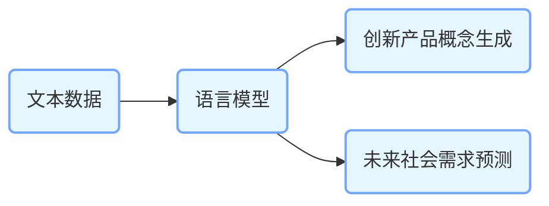

# 语言模型在创新产品概念生成与未来社会需求预测中的研究

> 关键词：语言模型、创新产品概念生成、未来社会需求预测、自然语言处理、人工智能

> 摘要：本文深入探讨了语言模型在创新产品概念生成与未来社会需求预测领域的应用。首先介绍了研究的背景、目的、预期读者等内容。接着阐述了语言模型、创新产品概念生成和未来社会需求预测的核心概念及其联系，并给出了相应的文本示意图和 Mermaid 流程图。详细讲解了核心算法原理，包括使用 Python 代码进行示例。同时，引入数学模型和公式来更精确地描述相关过程，并举例说明。通过项目实战，展示了如何搭建开发环境、实现源代码以及对代码进行解读分析。探讨了语言模型在实际中的应用场景，推荐了学习资源、开发工具框架和相关论文著作。最后总结了未来发展趋势与挑战，解答了常见问题，并提供了扩展阅读和参考资料，旨在为该领域的研究和实践提供全面且深入的指导。

## 1. 背景介绍 
### 1.1 目的和范围
在当今快速发展的科技时代，创新产品的推出对于企业的竞争力和社会的进步至关重要。同时，准确预测未来社会需求能够帮助企业提前布局，开发出更符合市场的产品。语言模型作为人工智能领域的重要成果，具有强大的语言理解和生成能力。本研究的目的在于探索如何利用语言模型来辅助创新产品概念的生成，以及对未来社会需求进行准确预测。研究范围涵盖了语言模型的基本原理、相关算法、实际应用案例，以及在不同行业中的应用效果和潜力。

### 1.2 预期读者
本文预期读者包括人工智能领域的研究人员、产品经理、市场营销人员、企业战略规划者以及对科技创新和未来趋势感兴趣的人士。对于研究人员，本文提供了深入的技术分析和研究思路；对于产品经理和市场营销人员，有助于他们利用语言模型开发创新产品和制定营销策略；对于企业战略规划者，能为其制定长远发展战略提供参考；对于普通读者，能让他们了解语言模型在现实中的应用和价值。

### 1.3 文档结构概述
本文首先介绍了研究的背景信息，包括目的、预期读者和文档结构。接着阐述了核心概念及其联系，让读者对语言模型、创新产品概念生成和未来社会需求预测有清晰的认识。然后详细讲解了核心算法原理和具体操作步骤，通过 Python 代码进行说明。引入数学模型和公式进一步解释相关过程，并举例说明。通过项目实战展示了如何将理论应用到实际中，包括开发环境搭建、源代码实现和代码解读。探讨了语言模型在不同场景下的实际应用。推荐了学习资源、开发工具框架和相关论文著作。最后总结了未来发展趋势与挑战，解答常见问题，并提供扩展阅读和参考资料。

### 1.4 术语表
#### 1.4.1 核心术语定义
- **语言模型**：是一种基于统计学或深度学习的模型，用于对自然语言进行建模，预测下一个可能出现的词或句子。常见的语言模型有基于规则的模型、统计语言模型和神经网络语言模型。
- **创新产品概念生成**：指通过创造性的思维和方法，产生新的产品概念的过程。这些概念可以是全新的产品，也可以是对现有产品的改进和升级。
- **未来社会需求预测**：是根据当前的社会、经济、技术等发展趋势，对未来一段时间内社会对各种产品和服务的需求进行预测的过程。

#### 1.4.2 相关概念解释
- **自然语言处理（NLP）**：是人工智能的一个重要分支，主要研究如何让计算机理解和处理人类语言。语言模型是自然语言处理中的关键技术之一。
- **深度学习**：是一种基于人工神经网络的机器学习方法，通过多层神经网络对数据进行学习和表示。许多现代语言模型都是基于深度学习技术构建的。

#### 1.4.3 缩略词列表
- **NLP**：Natural Language Processing（自然语言处理）
- **RNN**：Recurrent Neural Network（循环神经网络）
- **LSTM**：Long Short-Term Memory（长短期记忆网络）
- **GRU**：Gated Recurrent Unit（门控循环单元）
- **Transformer**：一种用于自然语言处理的深度学习架构

## 2. 核心概念与联系 
### 核心概念原理
#### 语言模型
语言模型的核心目标是对自然语言的概率分布进行建模。给定一个词序列 $w_1, w_2, \cdots, w_n$，语言模型可以计算出这个序列出现的概率 $P(w_1, w_2, \cdots, w_n)$。在实际应用中，通常使用条件概率来表示，即 $P(w_n|w_1, w_2, \cdots, w_{n - 1})$，表示在已知前面 $n - 1$ 个词的情况下，第 $n$ 个词出现的概率。

早期的语言模型基于统计方法，如 $n$ - 元语法模型（$n$ - gram model）。$n$ - 元语法模型假设一个词的出现只与它前面的 $n - 1$ 个词有关，即 $P(w_n|w_1, w_2, \cdots, w_{n - 1}) \approx P(w_n|w_{n - k + 1}, \cdots, w_{n - 1})$，其中 $k \leq n$。例如，二元语法模型（bigram model）假设 $P(w_n|w_1, w_2, \cdots, w_{n - 1}) \approx P(w_n|w_{n - 1})$。

随着深度学习的发展，基于神经网络的语言模型逐渐成为主流。如 RNN、LSTM、GRU 和 Transformer 等。这些模型能够处理更长的上下文信息，从而更准确地预测下一个词。

#### 创新产品概念生成
创新产品概念生成是一个创造性的过程，需要综合考虑市场需求、技术可行性、用户体验等多个因素。语言模型可以通过分析大量的文本数据，如市场调研报告、用户反馈、行业新闻等，挖掘潜在的产品需求和创新点。例如，语言模型可以对用户在社交媒体上的评论进行分析，找出用户对现有产品的不满和期望，从而生成新的产品概念。

#### 未来社会需求预测
未来社会需求预测需要考虑社会、经济、技术、环境等多个方面的因素。语言模型可以通过对新闻报道、学术论文、政策文件等文本数据的分析，捕捉社会发展的趋势和热点。例如，通过分析关于环保、健康等领域的文本数据，预测未来社会对环保产品、健康服务等的需求。

### 架构的文本示意图
```plaintext
                          +----------------------+
                          |      语言模型        |
                          +----------------------+
                                 |
                                 |  输入：文本数据（市场报告、新闻等）
                                 |
                                 v
 +----------------------+     +----------------------+
 | 创新产品概念生成    |     | 未来社会需求预测    |
 +----------------------+     +----------------------+
```

### Mermaid 流程图


## 3. 核心算法原理 & 具体操作步骤 
### 核心算法原理
#### 基于 Transformer 的语言模型
Transformer 是一种基于注意力机制的深度学习架构，在自然语言处理领域取得了巨大的成功。其核心组件包括多头注意力机制（Multi-Head Attention）和前馈神经网络（Feed-Forward Network）。

多头注意力机制允许模型在不同的表示子空间中并行地关注输入序列的不同部分。对于输入序列 $X = [x_1, x_2, \cdots, x_n]$，多头注意力机制的计算过程如下：

首先，将输入序列通过线性变换得到查询（Query）矩阵 $Q$、键（Key）矩阵 $K$ 和值（Value）矩阵 $V$：

$Q = XW^Q$

$K = XW^K$

$V = XW^V$

其中 $W^Q$、$W^K$ 和 $W^V$ 是可学习的权重矩阵。

然后，计算注意力分数：

$Attention(Q, K, V) = softmax(\frac{QK^T}{\sqrt{d_k}})V$

其中 $d_k$ 是查询和键向量的维度。

多头注意力机制将多个注意力头的输出拼接起来，并通过另一个线性变换得到最终的输出：

$MultiHead(Q, K, V) = Concat(head_1, head_2, \cdots, head_h)W^O$

其中 $h$ 是注意力头的数量，$W^O$ 是可学习的权重矩阵。

前馈神经网络由两个线性层和一个激活函数组成：

$FFN(x) = max(0, xW_1 + b_1)W_2 + b_2$

### Python 代码示例
```python
import torch
import torch.nn as nn
import torch.nn.functional as F

class MultiHeadAttention(nn.Module):
    def __init__(self, d_model, num_heads):
        super(MultiHeadAttention, self).__init__()
        self.d_model = d_model
        self.num_heads = num_heads
        self.d_k = d_model // num_heads

        self.W_q = nn.Linear(d_model, d_model)
        self.W_k = nn.Linear(d_model, d_model)
        self.W_v = nn.Linear(d_model, d_model)
        self.W_o = nn.Linear(d_model, d_model)

    def scaled_dot_product_attention(self, Q, K, V, mask=None):
        attn_scores = torch.matmul(Q, K.transpose(-2, -1)) / torch.sqrt(torch.tensor(self.d_k, dtype=torch.float32))
        if mask is not None:
            attn_scores = attn_scores.masked_fill(mask == 0, -1e9)
        attn_probs = F.softmax(attn_scores, dim=-1)
        output = torch.matmul(attn_probs, V)
        return output

    def split_heads(self, x):
        batch_size, seq_length, d_model = x.size()
        return x.view(batch_size, seq_length, self.num_heads, self.d_k).transpose(1, 2)

    def combine_heads(self, x):
        batch_size, num_heads, seq_length, d_k = x.size()
        return x.transpose(1, 2).contiguous().view(batch_size, seq_length, self.d_model)

    def forward(self, Q, K, V, mask=None):
        Q = self.split_heads(self.W_q(Q))
        K = self.split_heads(self.W_k(K))
        V = self.split_heads(self.W_v(V))

        attn_output = self.scaled_dot_product_attention(Q, K, V, mask)
        output = self.W_o(self.combine_heads(attn_output))
        return output

class PositionwiseFeedForward(nn.Module):
    def __init__(self, d_model, d_ff):
        super(PositionwiseFeedForward, self).__init__()
        self.fc1 = nn.Linear(d_model, d_ff)
        self.fc2 = nn.Linear(d_ff, d_model)
        self.relu = nn.ReLU()

    def forward(self, x):
        return self.fc2(self.relu(self.fc1(x)))

class TransformerLayer(nn.Module):
    def __init__(self, d_model, num_heads, d_ff, dropout):
        super(TransformerLayer, self).__init__()
        self.self_attn = MultiHeadAttention(d_model, num_heads)
        self.feed_forward = PositionwiseFeedForward(d_model, d_ff)
        self.norm1 = nn.LayerNorm(d_model)
        self.norm2 = nn.LayerNorm(d_model)
        self.dropout = nn.Dropout(dropout)

    def forward(self, x, mask=None):
        attn_output = self.self_attn(x, x, x, mask)
        x = self.norm1(x + self.dropout(attn_output))
        ff_output = self.feed_forward(x)
        x = self.norm2(x + self.dropout(ff_output))
        return x
```

### 具体操作步骤
1. **数据预处理**：收集相关的文本数据，如市场调研报告、新闻文章等。对数据进行清洗，去除噪声和无用信息。将文本数据转换为模型可以处理的格式，如分词、编码等。
2. **模型训练**：使用预处理后的数据对基于 Transformer 的语言模型进行训练。设置合适的超参数，如学习率、批次大小、训练轮数等。在训练过程中，使用损失函数（如交叉熵损失）来评估模型的性能，并通过优化器（如 Adam 优化器）更新模型的参数。
3. **创新产品概念生成**：将训练好的语言模型应用于创新产品概念生成任务。输入相关的文本信息，如市场需求描述、技术趋势等，模型生成可能的产品概念。对生成的概念进行筛选和评估，选择具有潜力的产品概念。
4. **未来社会需求预测**：同样使用训练好的语言模型，输入与社会发展相关的文本数据，如政策文件、学术研究等。模型根据输入数据预测未来社会的需求趋势。对预测结果进行分析和验证，结合其他信息源进行综合判断。

## 4. 数学模型和公式 & 详细讲解 & 举例说明 
### 语言模型的数学模型
#### 统计语言模型
统计语言模型的基本思想是通过统计语料库中词序列的出现频率来估计语言的概率分布。对于 $n$ - 元语法模型，其概率计算公式为：

$P(w_1, w_2, \cdots, w_m) = \prod_{i = 1}^{m} P(w_i|w_{i - n + 1}, \cdots, w_{i - 1})$

例如，对于二元语法模型（$n = 2$），有：

$P(w_1, w_2, \cdots, w_m) = P(w_1) \prod_{i = 2}^{m} P(w_i|w_{i - 1})$

其中 $P(w_i|w_{i - 1})$ 可以通过语料库中 $w_{i - 1}w_i$ 的出现频率除以 $w_{i - 1}$ 的出现频率来估计：

$P(w_i|w_{i - 1}) = \frac{C(w_{i - 1}w_i)}{C(w_{i - 1})}$

其中 $C(w)$ 表示词 $w$ 在语料库中出现的次数。

#### 神经网络语言模型
神经网络语言模型通过神经网络来学习语言的概率分布。以简单的前馈神经网络语言模型为例，假设输入是前面 $n - 1$ 个词的词向量表示 $x_1, x_2, \cdots, x_{n - 1}$，输出是下一个词的概率分布 $P(w|x_1, x_2, \cdots, x_{n - 1})$。

网络的输入层将词向量拼接起来：

$x = [x_1; x_2; \cdots; x_{n - 1}]$

然后通过一个隐藏层进行非线性变换：

$h = \tanh(W_1x + b_1)$

最后通过输出层得到下一个词的概率分布：

$P(w|x_1, x_2, \cdots, x_{n - 1}) = softmax(W_2h + b_2)$

其中 $W_1$、$W_2$ 是权重矩阵，$b_1$、$b_2$ 是偏置向量。

### 创新产品概念生成的数学模型
创新产品概念生成可以看作是一个优化问题。假设我们有一个目标函数 $f(c)$，表示产品概念 $c$ 的得分，得分越高表示该概念越有潜力。目标是找到得分最高的产品概念：

$\max_{c \in C} f(c)$

其中 $C$ 是所有可能的产品概念集合。

目标函数 $f(c)$ 可以综合考虑多个因素，如市场需求、技术可行性、用户体验等。例如：

$f(c) = \alpha_1 \cdot D(c) + \alpha_2 \cdot T(c) + \alpha_3 \cdot U(c)$

其中 $D(c)$ 表示产品概念 $c$ 满足市场需求的程度，$T(c)$ 表示技术可行性，$U(c)$ 表示用户体验，$\alpha_1$、$\alpha_2$、$\alpha_3$ 是权重系数，且 $\alpha_1 + \alpha_2 + \alpha_3 = 1$。

### 未来社会需求预测的数学模型
未来社会需求预测可以使用时间序列分析方法。假设我们有一个时间序列 $y_1, y_2, \cdots, y_t$，表示不同时间点的社会需求值。可以使用自回归积分滑动平均模型（ARIMA）来对未来的需求进行预测。

ARIMA 模型的一般形式为：

$\phi(B)(1 - B)^d y_t = \theta(B)\epsilon_t$

其中 $\phi(B) = 1 - \phi_1B - \phi_2B^2 - \cdots - \phi_pB^p$ 是自回归多项式，$\theta(B) = 1 + \theta_1B + \theta_2B^2 + \cdots + \theta_qB^q$ 是滑动平均多项式，$B$ 是滞后算子，$d$ 是差分阶数，$\epsilon_t$ 是白噪声序列。

### 举例说明
#### 统计语言模型示例
假设我们有一个简单的语料库：“我爱自然语言处理”，“自然语言处理很有趣”。对于二元语法模型，计算 $P(处理|语言)$。

在语料库中，“语言” 出现了 2 次，“语言处理” 出现了 2 次。所以：

$P(处理|语言) = \frac{C(语言处理)}{C(语言)} = \frac{2}{2} = 1$

#### 创新产品概念生成示例
假设我们有两个产品概念 $c_1$ 和 $c_2$，市场需求得分 $D(c_1) = 0.8$，$D(c_2) = 0.6$；技术可行性得分 $T(c_1) = 0.7$，$T(c_2) = 0.9$；用户体验得分 $U(c_1) = 0.9$，$U(c_2) = 0.8$。权重系数 $\alpha_1 = 0.4$，$\alpha_2 = 0.3$，$\alpha_3 = 0.3$。

则 $f(c_1) = 0.4 \times 0.8 + 0.3 \times 0.7 + 0.3 \times 0.9 = 0.8$

$f(c_2) = 0.4 \times 0.6 + 0.3 \times 0.9 + 0.3 \times 0.8 = 0.75$

因为 $f(c_1) > f(c_2)$，所以产品概念 $c_1$ 更有潜力。

#### 未来社会需求预测示例
假设我们有过去 10 个月的某产品需求数据：$y = [10, 12, 15, 13, 16, 18, 20, 22, 25, 23]$。使用 ARIMA 模型进行预测。

首先，对数据进行差分处理，使其平稳。然后确定自回归阶数 $p$、差分阶数 $d$ 和滑动平均阶数 $q$。假设经过分析，得到 $p = 1$，$d = 1$，$q = 1$。使用 Python 的 `statsmodels` 库进行模型拟合和预测：

```python
import pandas as pd
from statsmodels.tsa.arima.model import ARIMA

data = pd.Series([10, 12, 15, 13, 16, 18, 20, 22, 25, 23])
model = ARIMA(data, order=(1, 1, 1))
model_fit = model.fit()
forecast = model_fit.forecast(steps=1)
print(forecast)
```

## 5. 项目实战：代码实际案例和详细解释说明 
### 5.1  开发环境搭建
#### 操作系统
建议使用 Linux 系统，如 Ubuntu 18.04 或更高版本。也可以使用 Windows 10 或 macOS。

#### Python 环境
安装 Python 3.7 或更高版本。可以使用 Anaconda 来管理 Python 环境。创建一个新的虚拟环境：

```bash
conda create -n language_model_project python=3.8
conda activate language_model_project
```

#### 安装依赖库
安装必要的 Python 库，如 PyTorch、transformers、numpy 等：

```bash
pip install torch transformers numpy pandas
```

### 5.2  源代码详细实现和代码解读
#### 数据加载和预处理
```python
import pandas as pd
from transformers import AutoTokenizer

# 加载数据
data = pd.read_csv('market_reports.csv')
texts = data['text'].tolist()

# 加载预训练的分词器
tokenizer = AutoTokenizer.from_pretrained('bert-base-uncased')

# 对文本进行分词和编码
encoded_texts = tokenizer(texts, padding=True, truncation=True, return_tensors='pt')
```
代码解读：首先使用 `pandas` 库加载包含市场报告的 CSV 文件，提取文本列并转换为列表。然后使用 `transformers` 库中的 `AutoTokenizer` 加载预训练的分词器，这里选择了 `bert-base-uncased`。最后对文本进行分词和编码，使用 `padding` 和 `truncation` 参数确保所有输入序列长度一致，并返回 PyTorch 张量。

#### 模型加载和训练
```python
from transformers import AutoModelForMaskedLM, AdamW

# 加载预训练的语言模型
model = AutoModelForMaskedLM.from_pretrained('bert-base-uncased')

# 定义优化器
optimizer = AdamW(model.parameters(), lr=1e-5)

# 训练模型
for epoch in range(3):
    model.train()
    outputs = model(**encoded_texts, labels=encoded_texts['input_ids'])
    loss = outputs.loss
    loss.backward()
    optimizer.step()
    optimizer.zero_grad()
    print(f'Epoch {epoch + 1}, Loss: {loss.item()}')
```
代码解读：使用 `AutoModelForMaskedLM` 加载预训练的语言模型，这里选择了 `bert-base-uncased`。定义 AdamW 优化器，设置学习率为 $1e - 5$。在训练循环中，将模型设置为训练模式，输入编码后的文本数据并计算损失。使用反向传播更新模型参数，并将梯度清零。最后打印每个 epoch 的损失值。

#### 创新产品概念生成
```python
from transformers import pipeline

# 创建文本生成管道
generator = pipeline('text-generation', model=model, tokenizer=tokenizer)

# 输入相关文本信息
input_text = "未来智能家居市场需求"
generated_texts = generator(input_text, max_length=100, num_return_sequences=3)

for text in generated_texts:
    print(text['generated_text'])
```
代码解读：使用 `pipeline` 函数创建文本生成管道，指定任务为 `text-generation`，并使用训练好的模型和分词器。输入与创新产品概念相关的文本信息，设置生成文本的最大长度和返回序列的数量。最后打印生成的文本。

### 5.3  代码解读与分析
#### 数据加载和预处理部分
数据加载和预处理是整个项目的基础。通过 `pandas` 库可以方便地加载和处理 CSV 文件。使用预训练的分词器可以将文本转换为模型可以处理的编码格式，`padding` 和 `truncation` 参数确保输入序列长度一致，便于批量处理。

#### 模型加载和训练部分
使用预训练的语言模型可以利用大规模语料库的先验知识，加快模型的训练速度和提高性能。在训练过程中，使用 `AdamW` 优化器可以自适应地调整学习率，避免梯度消失或爆炸问题。通过多个 epoch 的训练，模型逐渐学习到文本数据的特征。

#### 创新产品概念生成部分
`pipeline` 函数提供了一种简单的方式来使用训练好的模型进行文本生成任务。通过设置 `max_length` 和 `num_return_sequences` 参数，可以控制生成文本的长度和数量。生成的文本可以作为创新产品概念的参考。

## 6. 实际应用场景 
### 消费电子行业
在消费电子行业，语言模型可以分析消费者的反馈和市场趋势，生成新的产品概念。例如，通过分析社交媒体上用户对智能手机的评论，发现用户对电池续航、拍照效果等方面的需求，从而生成具有长续航、高像素相机的智能手机概念。同时，预测未来消费者对可折叠屏幕、5G 技术等的需求，帮助企业提前布局研发。

### 医疗保健行业
在医疗保健行业，语言模型可以分析医学文献、临床数据和患者反馈，生成创新的医疗产品和服务概念。例如，通过分析大量的癌症研究论文，发现新的治疗靶点和药物研发方向。预测未来社会对远程医疗、个性化医疗等服务的需求，推动医疗行业的创新发展。

### 金融行业
在金融行业，语言模型可以分析市场新闻、政策文件和客户需求，生成新的金融产品和服务概念。例如，通过分析宏观经济数据和市场趋势，预测未来投资者对绿色金融、数字货币等产品的需求。同时，根据客户的风险偏好和投资目标，生成个性化的投资组合建议。

### 教育行业
在教育行业，语言模型可以分析教育政策、教学资源和学生反馈，生成创新的教育产品和服务概念。例如，通过分析在线教育平台上学生的学习数据，发现学生的学习痛点和需求，生成个性化的学习方案和智能辅导工具。预测未来社会对终身学习、职业技能培训等教育服务的需求，推动教育行业的变革。

## 7. 工具和资源推荐
### 7.1 学习资源推荐
#### 7.1.1 书籍推荐
- 《深度学习》（Deep Learning）：由 Ian Goodfellow、Yoshua Bengio 和 Aaron Courville 所著，是深度学习领域的经典教材，涵盖了神经网络、卷积神经网络、循环神经网络等内容。
- 《自然语言处理入门》（Natural Language Processing with Python）：由 Steven Bird、Ewan Klein 和 Edward Loper 所著，介绍了使用 Python 进行自然语言处理的基本方法和技术。
- 《人工智能：一种现代的方法》（Artificial Intelligence: A Modern Approach）：由 Stuart Russell 和 Peter Norvig 所著，是人工智能领域的权威教材，涵盖了搜索算法、机器学习、自然语言处理等多个方面。

#### 7.1.2 在线课程
- Coursera 上的“深度学习专项课程”（Deep Learning Specialization）：由 Andrew Ng 教授授课，包括神经网络和深度学习、改善深层神经网络、结构化机器学习项目等多个课程。
- edX 上的“自然语言处理基础”（Foundations of Natural Language Processing）：介绍了自然语言处理的基本概念和技术，如分词、词性标注、命名实体识别等。
- Udemy 上的“Python 自然语言处理实战”（Natural Language Processing with Python）：通过实际项目讲解如何使用 Python 进行自然语言处理。

#### 7.1.3 技术博客和网站
- Medium 上的 Towards Data Science：有很多关于人工智能、机器学习和自然语言处理的优质文章。
- arXiv：提供了大量的学术论文，包括自然语言处理领域的最新研究成果。
- Hugging Face：专注于自然语言处理，提供了丰富的预训练模型、工具和文档。

### 7.2 开发工具框架推荐
#### 7.2.1 IDE和编辑器
- PyCharm：是一款专门为 Python 开发设计的集成开发环境，提供了代码编辑、调试、版本控制等功能。
- Jupyter Notebook：是一个交互式的开发环境，适合进行数据探索、模型实验和代码演示。
- Visual Studio Code：是一款轻量级的代码编辑器，支持多种编程语言和插件扩展。

#### 7.2.2 调试和性能分析工具
- PyTorch Profiler：可以帮助分析 PyTorch 模型的性能瓶颈，如计算时间、内存使用等。
- TensorBoard：是 TensorFlow 提供的可视化工具，也可以用于 PyTorch 模型的训练过程可视化和性能分析。
- cProfile：是 Python 内置的性能分析工具，可以分析代码的运行时间和函数调用情况。

#### 7.2.3 相关框架和库
- PyTorch：是一个开源的深度学习框架，提供了丰富的神经网络层和优化算法，易于使用和扩展。
- TensorFlow：是另一个广泛使用的深度学习框架，具有强大的分布式训练和生产部署能力。
- transformers：是 Hugging Face 开发的自然语言处理库，提供了大量的预训练模型和工具，方便进行文本分类、生成等任务。

### 7.3 相关论文著作推荐
#### 7.3.1 经典论文
- “Attention Is All You Need”：提出了 Transformer 架构，是自然语言处理领域的里程碑式论文。
- “Efficient Estimation of Word Representations in Vector Space”：介绍了 Word2Vec 模型，是词向量表示的经典方法。
- “Long Short-Term Memory”：提出了长短期记忆网络（LSTM），解决了传统循环神经网络的梯度消失问题。

#### 7.3.2 最新研究成果
- 在 arXiv 上搜索“Language models for product concept generation” 和 “Future social demand prediction using language models” 可以找到最新的相关研究论文。
- 关注自然语言处理领域的顶级会议，如 ACL（Association for Computational Linguistics）、EMNLP（Conference on Empirical Methods in Natural Language Processing）等，这些会议上会发表很多最新的研究成果。

#### 7.3.3 应用案例分析
- 可以在学术数据库（如 IEEE Xplore、ACM Digital Library 等）中搜索关于语言模型在不同行业应用的案例分析论文，了解实际应用中的经验和挑战。

## 8. 总结：未来发展趋势与挑战
### 未来发展趋势
#### 模型能力提升
随着计算资源的不断增加和算法的不断改进，语言模型的能力将不断提升。未来的语言模型将能够处理更复杂的语言任务，如多模态信息处理、常识推理等，从而更准确地生成创新产品概念和预测未来社会需求。

#### 行业融合应用
语言模型将与更多的行业进行深度融合，为不同行业带来创新和变革。例如，在制造业中，结合工业物联网数据和语言模型，实现智能生产和质量控制；在农业中，利用语言模型分析气象数据和农业文献，提供精准的农业生产建议。

#### 个性化服务
未来的语言模型将能够根据用户的个性化需求提供更精准的服务。在创新产品概念生成方面，能够根据不同企业的战略目标、市场定位和用户群体，生成符合其需求的产品概念；在未来社会需求预测方面，能够为不同地区、不同行业的用户提供个性化的预测结果。

### 挑战
#### 数据质量和隐私问题
语言模型的性能很大程度上依赖于数据的质量。然而，现实中的数据往往存在噪声、偏差和不完整性等问题，这会影响模型的准确性和可靠性。同时，数据隐私问题也是一个重要的挑战，如何在保护用户隐私的前提下利用数据进行模型训练是一个亟待解决的问题。

#### 可解释性和可信度
语言模型通常是基于深度学习的黑盒模型，其决策过程难以解释。在创新产品概念生成和未来社会需求预测中，模型的可解释性和可信度至关重要。用户需要了解模型是如何生成产品概念和预测需求的，以便做出合理的决策。

#### 伦理和法律问题
随着语言模型的广泛应用，伦理和法律问题也日益凸显。例如，模型生成的内容可能存在虚假信息、偏见和歧视等问题，这会对社会造成负面影响。如何制定相应的伦理准则和法律法规，规范语言模型的使用，是一个需要关注的问题。

## 9. 附录：常见问题与解答
### 语言模型生成的产品概念一定可行吗？
不一定。语言模型生成的产品概念是基于其学习到的文本数据和模式，可能存在一些不切实际或不可行的概念。生成的概念需要经过专业人员的筛选和评估，结合市场需求、技术可行性、成本等因素进行综合判断。

### 如何提高未来社会需求预测的准确性？
可以从以下几个方面提高预测的准确性：
- 增加数据的多样性和质量，包括不同来源、不同类型的数据。
- 结合多种预测方法，如时间序列分析、机器学习模型等。
- 不断更新和优化模型，根据实际情况调整模型的参数和结构。
- 引入专家知识和领域经验，对预测结果进行修正和验证。

### 语言模型在实际应用中会遇到哪些技术难题？
语言模型在实际应用中可能会遇到以下技术难题：
- 计算资源需求大，训练和推理过程需要大量的计算资源和时间。
- 数据稀疏问题，特别是在某些特定领域，数据量可能较少，导致模型性能下降。
- 上下文理解能力有限，对于长文本和复杂语境的理解可能存在困难。
- 模型的泛化能力不足，在新的数据集和任务上表现不佳。

## 10. 扩展阅读 & 参考资料
### 扩展阅读
- 《生成式人工智能：原理、算法与应用》：深入介绍了生成式人工智能的原理和算法，包括语言模型的生成机制。
- 《科技想要什么》：探讨了科技发展的趋势和规律，对于理解未来社会需求有一定的启示。
- 《创新者的窘境》：分析了企业在创新过程中面临的挑战和机遇，与创新产品概念生成相关。

### 参考资料
- Goodfellow, I., Bengio, Y., & Courville, A. (2016). Deep Learning. MIT Press.
- Bird, S., Klein, E., & Loper, E. (2009). Natural Language Processing with Python. O'Reilly Media.
- Russell, S. J., & Norvig, P. (2020). Artificial Intelligence: A Modern Approach. Pearson.
- Vaswani, A., Shazeer, N., Parmar, N., Uszkoreit, J., Jones, L., Gomez, A. N.,... & Polosukhin, I. (2017). Attention is all you need. Advances in neural information processing systems, 30.
- Mikolov, T., Chen, K., Corrado, G., & Dean, J. (2013). Efficient estimation of word representations in vector space. arXiv preprint arXiv:1301.3781.
- Hochreiter, S., & Schmidhuber, J. (1997). Long short-term memory. Neural computation, 9(8), 1735-1780.

作者：AI天才研究院/AI Genius Institute & 禅与计算机程序设计艺术 /Zen And The Art of Computer Programming