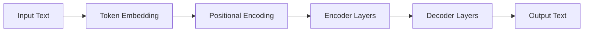

# 语言模型在创新商业战略生成与竞争优势分析中的多维度应用

> 关键词：语言模型、创新商业战略、竞争优势分析、多维度应用、商业智能

> 摘要：本文深入探讨了语言模型在创新商业战略生成与竞争优势分析中的多维度应用。通过对语言模型核心概念和原理的阐述，详细介绍了其在商业领域的具体算法实现、数学模型及公式。结合实际项目案例，展示了语言模型如何助力企业制定创新战略和分析竞争优势。同时，列举了相关的工具和资源，分析了未来发展趋势与挑战，并对常见问题进行了解答。旨在为企业管理者和相关技术人员提供全面且深入的参考，推动语言模型在商业领域的广泛应用。

## 1. 背景介绍 
### 1.1 目的和范围
在当今竞争激烈的商业环境中，企业需要不断创新商业战略以获取竞争优势。语言模型作为人工智能领域的重要技术，具有强大的自然语言处理能力，能够处理和分析大量的文本数据。本文的目的在于探讨语言模型在创新商业战略生成与竞争优势分析中的具体应用方式和价值，范围涵盖语言模型的核心原理、算法实现、实际案例以及未来发展趋势等方面。

### 1.2 预期读者
本文预期读者包括企业管理者、市场营销人员、战略规划师、数据分析师以及对人工智能在商业领域应用感兴趣的技术人员。通过阅读本文，读者能够了解语言模型在商业战略制定和竞争分析中的作用，掌握相关的技术方法和应用案例，为实际工作提供参考。

### 1.3 文档结构概述
本文将按照以下结构进行阐述：首先介绍语言模型的核心概念与联系，包括其原理和架构；接着详细讲解核心算法原理和具体操作步骤，并给出Python源代码示例；然后介绍相关的数学模型和公式，并进行详细讲解和举例说明；之后通过实际项目案例展示语言模型在商业战略生成和竞争优势分析中的应用；再介绍语言模型在实际商业场景中的应用；推荐相关的工具和资源；最后总结未来发展趋势与挑战，解答常见问题，并提供扩展阅读和参考资料。

### 1.4 术语表
#### 1.4.1 核心术语定义
- **语言模型**：是一种基于概率统计的模型，用于预测给定上下文下下一个词出现的概率。它可以学习语言的模式和规律，生成自然流畅的文本。
- **创新商业战略**：指企业为了适应市场变化、满足客户需求、提高竞争力而制定的具有创新性的商业计划和策略。
- **竞争优势分析**：对企业在市场中的竞争地位、优势和劣势进行评估和分析的过程，旨在找出企业相对于竞争对手的独特优势。
- **商业智能**：利用数据挖掘、数据分析等技术，从企业的各种数据中提取有价值的信息，为企业决策提供支持。

#### 1.4.2 相关概念解释
- **自然语言处理（NLP）**：是人工智能的一个分支，研究如何让计算机理解、处理和生成自然语言。语言模型是自然语言处理中的重要技术之一。
- **深度学习**：是一种基于神经网络的机器学习方法，通过多层神经网络自动学习数据的特征和模式。许多先进的语言模型都采用了深度学习技术。
- **大数据**：指海量、高增长率和多样化的信息资产，企业在商业活动中会产生大量的文本数据，如客户反馈、市场报告等，这些数据是语言模型应用的重要基础。

#### 1.4.3 缩略词列表
- **NLP**：Natural Language Processing（自然语言处理）
- **GPT**：Generative Pretrained Transformer（生成式预训练变换器）
- **BERT**：Bidirectional Encoder Representations from Transformers（基于变换器的双向编码器表示）

## 2. 核心概念与联系 

### 2.1 语言模型原理
语言模型的核心目标是计算一个句子或文本序列的概率。给定一个文本序列 $w_1, w_2, \cdots, w_n$，语言模型要计算 $P(w_1, w_2, \cdots, w_n)$ 的值。根据链式法则，$P(w_1, w_2, \cdots, w_n)$ 可以分解为：

$$P(w_1, w_2, \cdots, w_n) = \prod_{i=1}^{n} P(w_i | w_1, w_2, \cdots, w_{i-1})$$

传统的语言模型如n-gram模型，假设当前词 $w_i$ 只依赖于前面的 $n-1$ 个词，即：

$$P(w_i | w_1, w_2, \cdots, w_{i-1}) \approx P(w_i | w_{i-(n-1)}, \cdots, w_{i-1})$$

而现代的深度学习语言模型，如GPT和BERT，采用了更强大的神经网络架构，能够学习到更复杂的语言模式和语义信息。

### 2.2 语言模型架构
以Transformer架构为例，它是许多现代语言模型的基础。Transformer架构主要由编码器和解码器组成，编码器负责对输入的文本进行编码，解码器负责根据编码结果生成输出文本。

Transformer架构的核心是多头自注意力机制（Multi-Head Self-Attention），它允许模型在处理每个位置的输入时，关注输入序列中的其他位置，从而捕捉到长距离的依赖关系。

### 2.3 文本示意图
```plaintext
+----------------------+
|      Input Text      |
+----------------------+
           |
           v
+----------------------+
|     Token Embedding  |
+----------------------+
           |
           v
+----------------------+
|   Positional Encoding|
+----------------------+
           |
           v
+----------------------+
|    Encoder Layers    |
| (Multi-Head Attention)|
|    & Feed-Forward    |
+----------------------+
           |
           v
+----------------------+
|    Decoder Layers    |
| (Multi-Head Attention)|
|    & Feed-Forward    |
+----------------------+
           |
           v
+----------------------+
|    Output Text       |
+----------------------+
```

### 2.4 Mermaid流程图


## 3. 核心算法原理 & 具体操作步骤 

### 3.1 算法原理
以简单的n-gram语言模型为例，其核心思想是统计语料库中每个n-gram出现的频率，然后根据这些频率来估计概率。

假设我们有一个语料库 $C$，要计算 $P(w_i | w_{i-(n-1)}, \cdots, w_{i-1})$，可以通过以下公式：

$$P(w_i | w_{i-(n-1)}, \cdots, w_{i-1}) = \frac{Count(w_{i-(n-1)}, \cdots, w_{i-1}, w_i)}{Count(w_{i-(n-1)}, \cdots, w_{i-1})}$$

其中 $Count(w_{i-(n-1)}, \cdots, w_{i-1}, w_i)$ 表示n-gram $(w_{i-(n-1)}, \cdots, w_{i-1}, w_i)$ 在语料库中出现的次数，$Count(w_{i-(n-1)}, \cdots, w_{i-1})$ 表示 $(n-1)$-gram $(w_{i-(n-1)}, \cdots, w_{i-1})$ 在语料库中出现的次数。

### 3.2 具体操作步骤
1. **数据预处理**：将语料库中的文本进行分词，去除停用词和标点符号等。
2. **统计n-gram频率**：遍历语料库，统计每个n-gram出现的次数。
3. **计算概率**：根据上述公式计算每个n-gram的概率。
4. **生成文本**：根据计算得到的概率，随机选择下一个词，生成新的文本。

### 3.3 Python源代码示例
```python
import collections

def preprocess_text(text):
    # 简单的分词处理
    return text.lower().split()

def count_ngrams(tokens, n):
    ngrams = []
    for i in range(len(tokens) - n + 1):
        ngram = tuple(tokens[i:i+n])
        ngrams.append(ngram)
    return collections.Counter(ngrams)

def calculate_probabilities(ngram_counts, n):
    probabilities = {}
    for ngram, count in ngram_counts.items():
        prefix = ngram[:-1]
        if prefix not in probabilities:
            probabilities[prefix] = {}
        total_count = sum([c for ng, c in ngram_counts.items() if ng[:-1] == prefix])
        probabilities[prefix][ngram[-1]] = count / total_count
    return probabilities

def generate_text(probabilities, start_prefix, max_length=10):
    current_prefix = tuple(start_prefix)
    text = list(current_prefix)
    for _ in range(max_length):
        if current_prefix in probabilities:
            next_word_options = probabilities[current_prefix]
            next_word = max(next_word_options, key=next_word_options.get)
            text.append(next_word)
            current_prefix = current_prefix[1:] + (next_word,)
        else:
            break
    return " ".join(text)

# 示例语料库
corpus = "This is a sample text. This text is for demonstration purposes."
tokens = preprocess_text(corpus)
n = 2  # 2-gram模型
ngram_counts = count_ngrams(tokens, n)
probabilities = calculate_probabilities(ngram_counts, n)
start_prefix = ["this", "is"]
generated_text = generate_text(probabilities, start_prefix)
print(generated_text)
```

## 4. 数学模型和公式 & 详细讲解 & 举例说明 

### 4.1 熵和困惑度
熵（Entropy）是衡量语言模型不确定性的指标，对于一个语言模型，其熵定义为：

$$H(p) = -\sum_{w_1, w_2, \cdots, w_n} p(w_1, w_2, \cdots, w_n) \log p(w_1, w_2, \cdots, w_n)$$

困惑度（Perplexity）是熵的指数形式，用于评估语言模型的性能，困惑度越低，说明语言模型的性能越好。困惑度的计算公式为：

$$PP(p) = 2^{H(p)}$$

### 4.2 交叉熵损失函数
在训练语言模型时，通常使用交叉熵损失函数来衡量模型预测的概率分布与真实概率分布之间的差异。假设真实的概率分布为 $q$，模型预测的概率分布为 $p$，则交叉熵损失函数定义为：

$$H(p, q) = -\sum_{w} q(w) \log p(w)$$

### 4.3 举例说明
假设我们有一个简单的语料库，包含两个句子："The dog runs" 和 "The cat sleeps"。我们要训练一个2-gram语言模型。

首先，对语料库进行分词：["the", "dog", "runs", "the", "cat", "sleeps"]

统计2-gram的频率：
- ("the", "dog"): 1
- ("dog", "runs"): 1
- ("the", "cat"): 1
- ("cat", "sleeps"): 1

计算概率：
- $P(dog | the) = 0.5$
- $P(runs | dog) = 1$
- $P(cat | the) = 0.5$
- $P(sleeps | cat) = 1$

假设真实的概率分布 $q$ 就是语料库中2-gram的分布，模型预测的概率分布 $p$ 就是我们计算得到的概率分布。计算交叉熵损失函数：

$$H(p, q) = - (0.5 \log 0.5 + 1 \log 1 + 0.5 \log 0.5 + 1 \log 1) = 1$$

## 5. 项目实战：代码实际案例和详细解释说明 

### 5.1  开发环境搭建
- **Python环境**：建议使用Python 3.7及以上版本。
- **必要的库**：安装`transformers`库，用于使用预训练的语言模型；安装`torch`库，用于深度学习计算。可以使用以下命令进行安装：
```sh
pip install transformers torch
```

### 5.2  源代码详细实现和代码解读
```python
from transformers import GPT2LMHeadModel, GPT2Tokenizer

# 加载预训练的GPT-2模型和分词器
model_name = "gpt2"
tokenizer = GPT2Tokenizer.from_pretrained(model_name)
model = GPT2LMHeadModel.from_pretrained(model_name)

# 输入文本
input_text = "Innovative business strategies are"
input_ids = tokenizer.encode(input_text, return_tensors="pt")

# 生成文本
output = model.generate(input_ids, max_length=100, num_beams=5, no_repeat_ngram_size=2, early_stopping=True)
generated_text = tokenizer.decode(output[0], skip_special_tokens=True)

print(generated_text)
```

### 5.3  代码解读与分析
1. **加载模型和分词器**：使用`transformers`库加载预训练的GPT-2模型和对应的分词器。
2. **输入文本编码**：将输入的文本使用分词器进行编码，转换为模型可以接受的输入格式。
3. **文本生成**：调用模型的`generate`方法生成文本，设置了最大长度、束搜索的束数、避免重复的n-gram大小等参数。
4. **解码输出**：将模型生成的输出使用分词器进行解码，得到最终的文本。

## 6. 实际应用场景 
### 6.1 创新商业战略生成
- **市场趋势分析**：语言模型可以分析大量的市场报告、新闻文章等文本数据，提取市场趋势信息，为企业制定创新商业战略提供参考。例如，通过分析行业动态和消费者需求的变化，企业可以发现新的市场机会，调整产品策略。
- **创意生成**：语言模型可以根据企业的目标和需求，生成各种创新的商业策略和创意。例如，为新产品的推广活动提供创意方案，或者为企业的业务拓展提出新的思路。

### 6.2 竞争优势分析
- **竞争对手分析**：语言模型可以分析竞争对手的官方网站、社交媒体言论、新闻报道等文本数据，了解竞争对手的优势和劣势。例如，分析竞争对手的产品特点、市场定位、营销策略等，找出企业相对于竞争对手的差异化优势。
- **客户反馈分析**：通过分析客户对企业和竞争对手产品的反馈，语言模型可以发现企业的优势和改进方向。例如，了解客户对产品质量、服务水平、价格等方面的满意度，为企业提升竞争力提供依据。

## 7. 工具和资源推荐
### 7.1 学习资源推荐
#### 7.1.1 书籍推荐
- 《自然语言处理入门》：介绍了自然语言处理的基础知识和常用算法，适合初学者。
- 《深度学习》：全面介绍了深度学习的理论和实践，对于理解语言模型的原理有很大帮助。
- 《Python自然语言处理实战》：通过实际案例介绍了如何使用Python进行自然语言处理，包括语言模型的应用。

#### 7.1.2 在线课程
- Coursera上的“Natural Language Processing Specialization”：由顶尖高校的教授授课，系统介绍了自然语言处理的各个方面。
- edX上的“Deep Learning for Natural Language Processing”：专注于深度学习在自然语言处理中的应用，包括语言模型的训练和使用。

#### 7.1.3 技术博客和网站
- Hugging Face博客：提供了关于语言模型的最新研究成果和应用案例，是了解语言模型技术发展的重要渠道。
- Towards Data Science：有许多关于自然语言处理和语言模型的高质量文章，适合技术人员学习和交流。

### 7.2 开发工具框架推荐
#### 7.2.1 IDE和编辑器
- PyCharm：功能强大的Python集成开发环境，提供了代码编辑、调试、版本控制等功能。
- Jupyter Notebook：交互式的开发环境，适合进行数据探索和模型实验。

#### 7.2.2 调试和性能分析工具
- TensorBoard：用于可视化深度学习模型的训练过程和性能指标，帮助开发者调试和优化模型。
- PyTorch Profiler：可以分析PyTorch模型的性能瓶颈，找出需要优化的部分。

#### 7.2.3 相关框架和库
- Transformers：由Hugging Face开发的库，提供了各种预训练的语言模型和工具，方便开发者使用和微调语言模型。
- NLTK：自然语言处理工具包，包含了许多常用的自然语言处理算法和数据集。

### 7.3 相关论文著作推荐
#### 7.3.1 经典论文
- “Attention Is All You Need”：介绍了Transformer架构，是现代语言模型的基础。
- “BERT: Pre-training of Deep Bidirectional Transformers for Language Understanding”：提出了BERT模型，在自然语言处理任务中取得了显著的效果。

#### 7.3.2 最新研究成果
- 关注ACL（Association for Computational Linguistics）、EMNLP（Conference on Empirical Methods in Natural Language Processing）等自然语言处理领域的顶级会议，获取最新的研究成果。

#### 7.3.3 应用案例分析
- 可以参考一些知名企业的技术博客，了解他们在实际项目中如何应用语言模型进行商业战略制定和竞争优势分析。

## 8. 总结：未来发展趋势与挑战
### 8.1 未来发展趋势
- **更强大的语言模型**：随着技术的不断进步，未来的语言模型将具有更强的语言理解和生成能力，能够处理更复杂的商业问题。
- **多模态融合**：语言模型将与图像、音频等其他模态的信息进行融合，为企业提供更全面的商业洞察。
- **个性化应用**：根据企业的特定需求和数据，定制个性化的语言模型，提高商业战略生成和竞争优势分析的准确性。

### 8.2 挑战
- **数据隐私和安全**：语言模型的训练需要大量的数据，如何保护企业和客户的数据隐私和安全是一个重要的挑战。
- **模型可解释性**：许多深度学习语言模型是黑盒模型，难以解释其决策过程，这在商业应用中可能会带来一些问题。
- **计算资源需求**：训练和使用大规模的语言模型需要大量的计算资源，如何降低计算成本也是一个需要解决的问题。

## 9. 附录：常见问题与解答
### 9.1 语言模型的训练数据从哪里获取？
语言模型的训练数据可以从多个渠道获取，包括公开的语料库、企业内部的文本数据、互联网上的新闻文章、社交媒体数据等。在使用数据时，需要注意数据的质量和合法性。

### 9.2 如何评估语言模型在商业战略生成和竞争优势分析中的效果？
可以通过多种指标来评估语言模型的效果，如生成文本的合理性、准确性、创新性等。还可以通过实际应用中的效果来评估，如企业的市场份额增长、销售额提升等。

### 9.3 语言模型是否可以完全替代人类进行商业战略制定和竞争优势分析？
语言模型可以为企业提供有价值的信息和建议，但不能完全替代人类的决策。人类具有丰富的经验、判断力和创造力，在商业战略制定和竞争优势分析中仍然起着关键作用。

## 10. 扩展阅读 & 参考资料
- 《人工智能时代的商业变革》
- 《数据驱动的商业决策》
- Hugging Face官方文档：https://huggingface.co/docs
- ACL Anthology：https://aclanthology.org/

作者：AI天才研究院/AI Genius Institute & 禅与计算机程序设计艺术 /Zen And The Art of Computer Programming