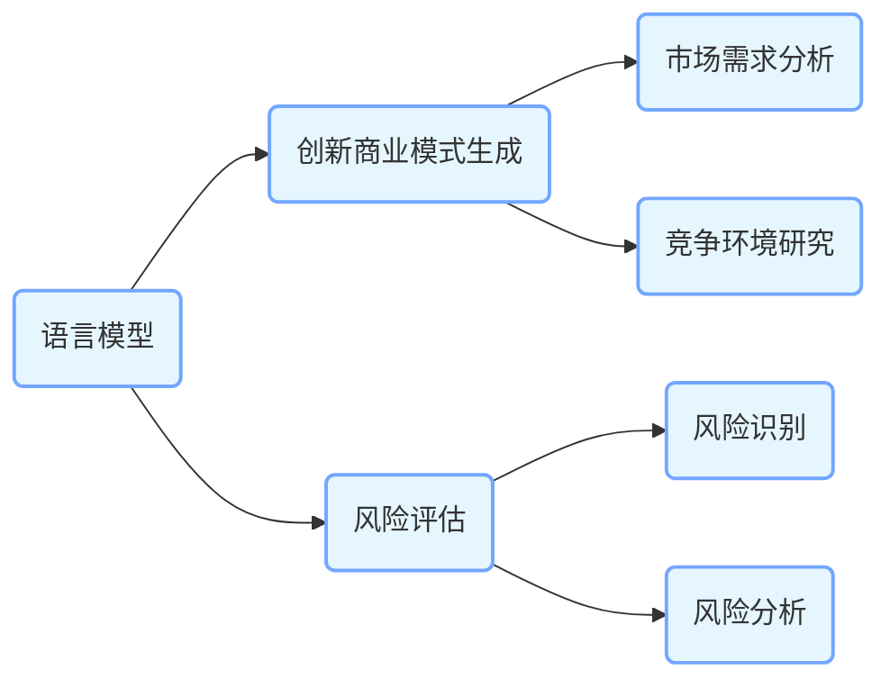

# 语言模型在创新商业模式生成与风险评估中的研究

> 关键词：语言模型、创新商业模式生成、风险评估、自然语言处理、机器学习

> 摘要：本文深入探讨了语言模型在创新商业模式生成与风险评估中的应用。首先介绍了研究的背景、目的、预期读者等内容，接着阐述了核心概念及其联系，包括语言模型、商业模式生成和风险评估的原理和架构。详细讲解了相关核心算法原理，并给出Python源代码示例。同时，运用数学模型和公式对语言模型在这两个领域的应用进行了分析和举例说明。通过项目实战，展示了代码的实际案例并进行解读。探讨了语言模型在不同场景下的实际应用，推荐了学习资源、开发工具框架和相关论文著作。最后总结了未来发展趋势与挑战，还提供了常见问题解答和扩展阅读参考资料。旨在为相关领域的研究和实践提供全面而深入的指导。

## 1. 背景介绍 
### 1.1 目的和范围
在当今快速发展的商业环境中，创新商业模式的生成对于企业的生存和发展至关重要。同时，准确的风险评估能够帮助企业提前识别和应对潜在的风险，保障商业模式的顺利实施。语言模型作为自然语言处理领域的重要技术，具有强大的文本理解和生成能力。本研究的目的是探索如何利用语言模型来辅助创新商业模式的生成，并进行有效的风险评估。研究范围涵盖了语言模型的基本原理、相关算法、在商业模式生成和风险评估中的具体应用，以及实际案例分析等方面。

### 1.2 预期读者
本文的预期读者包括计算机科学领域的研究人员、人工智能开发者、商业分析师、企业管理人员等。对于希望了解语言模型在商业领域应用的技术人员，本文提供了详细的技术原理和代码实现；对于关注商业模式创新和风险评估的商业人士，本文介绍了如何利用语言模型来推动业务发展和降低风险。

### 1.3 文档结构概述
本文共分为十个部分。第一部分是背景介绍，阐述了研究的目的、范围、预期读者和文档结构概述。第二部分介绍了核心概念与联系，包括语言模型、商业模式生成和风险评估的原理和架构。第三部分讲解了核心算法原理，并给出Python源代码示例。第四部分运用数学模型和公式对语言模型在这两个领域的应用进行了分析和举例说明。第五部分通过项目实战，展示了代码的实际案例并进行解读。第六部分探讨了语言模型在不同场景下的实际应用。第七部分推荐了学习资源、开发工具框架和相关论文著作。第八部分总结了未来发展趋势与挑战。第九部分提供了常见问题解答。第十部分给出了扩展阅读和参考资料。

### 1.4 术语表
#### 1.4.1 核心术语定义
- **语言模型**：是一种基于概率统计的模型，用于预测一个句子或一段文本的概率分布。它可以根据给定的上下文信息，预测下一个可能出现的单词或字符。
- **创新商业模式生成**：指的是通过创造性的思维和方法，设计出全新的或改进的商业模式，以满足市场需求和创造价值。
- **风险评估**：是对可能影响商业模式实施的各种风险因素进行识别、分析和评估的过程，旨在确定风险的可能性和影响程度，并制定相应的应对策略。

#### 1.4.2 相关概念解释
- **自然语言处理（NLP）**：是计算机科学与语言学的交叉领域，旨在让计算机能够理解、处理和生成人类语言。语言模型是自然语言处理中的重要技术之一。
- **机器学习**：是一门多领域交叉学科，涉及概率论、统计学、逼近论、凸分析、算法复杂度理论等多门学科。它专门研究计算机怎样模拟或实现人类的学习行为，以获取新的知识或技能，重新组织已有的知识结构使之不断改善自身的性能。

#### 1.4.3 缩略词列表
- **NLP**：Natural Language Processing（自然语言处理）
- **AI**：Artificial Intelligence（人工智能）
- **ML**：Machine Learning（机器学习）

## 2. 核心概念与联系 

### 语言模型原理
语言模型的核心目标是计算一个句子或一段文本的概率。常见的语言模型包括基于统计的语言模型和基于神经网络的语言模型。

基于统计的语言模型，如n-gram模型，通过统计语料库中n个连续单词出现的频率来计算句子的概率。例如，对于一个句子 $S = w_1, w_2, \cdots, w_m$，其概率可以表示为：

$P(S) = P(w_1)P(w_2|w_1)P(w_3|w_1, w_2) \cdots P(w_m|w_1, w_2, \cdots, w_{m - 1})$

在n-gram模型中，通常采用近似的方法，假设一个单词的出现只依赖于其前n - 1个单词，即：

$P(w_i|w_1, w_2, \cdots, w_{i - 1}) \approx P(w_i|w_{i - n + 1}, w_{i - n + 2}, \cdots, w_{i - 1})$

基于神经网络的语言模型，如循环神经网络（RNN）、长短期记忆网络（LSTM）和Transformer等，通过学习语料库中的语言模式来预测下一个单词。这些模型能够处理长距离依赖关系，具有更好的性能。

### 商业模式生成原理
创新商业模式生成是一个创造性的过程，需要考虑市场需求、竞争环境、技术趋势等多个因素。语言模型可以通过以下方式辅助商业模式生成：
- **创意启发**：通过生成与商业模式相关的文本，如市场趋势分析、竞争对手研究等，为企业提供创意和灵感。
- **方案评估**：对生成的商业模式方案进行评估和优化，例如分析方案的可行性、盈利能力等。

### 风险评估原理
风险评估的主要步骤包括风险识别、风险分析和风险评价。语言模型可以帮助企业进行风险识别和分析，例如：
- **风险识别**：通过分析大量的文本数据，如新闻报道、行业研究等，识别可能影响商业模式实施的风险因素。
- **风险分析**：对识别出的风险因素进行分析，评估其可能性和影响程度。

### 核心概念架构示意图


从架构图可以看出，语言模型是整个系统的核心，它为创新商业模式生成和风险评估提供支持。创新商业模式生成包括市场需求分析和竞争环境研究等环节，而风险评估则包括风险识别和风险分析等步骤。

## 3. 核心算法原理 & 具体操作步骤 

### 基于Transformer的语言模型原理
Transformer是一种基于注意力机制的神经网络架构，它在自然语言处理领域取得了巨大的成功。Transformer的核心是多头注意力机制，它可以让模型在处理序列数据时，关注到序列中不同位置的信息。

多头注意力机制的计算公式如下：

$Attention(Q, K, V) = softmax(\frac{QK^T}{\sqrt{d_k}})V$

其中，$Q$、$K$ 和 $V$ 分别是查询矩阵、键矩阵和值矩阵，$d_k$ 是键向量的维度。

多头注意力机制将多个注意力头的输出拼接起来，然后通过一个线性变换得到最终的输出：

$MultiHead(Q, K, V) = Concat(head_1, head_2, \cdots, head_h)W^O$

其中，$head_i = Attention(QW_i^Q, KW_i^K, VW_i^V)$，$W_i^Q$、$W_i^K$、$W_i^V$ 和 $W^O$ 是可学习的参数。

### Python代码实现
以下是一个使用PyTorch实现的简单的Transformer语言模型示例：

```python
import torch
import torch.nn as nn

class TransformerLanguageModel(nn.Module):
    def __init__(self, vocab_size, d_model, nhead, num_layers):
        super(TransformerLanguageModel, self).__init__()
        self.embedding = nn.Embedding(vocab_size, d_model)
        self.transformer_encoder = nn.TransformerEncoder(
            nn.TransformerEncoderLayer(d_model, nhead),
            num_layers
        )
        self.decoder = nn.Linear(d_model, vocab_size)

    def forward(self, src):
        src = self.embedding(src)
        src = src.permute(1, 0, 2)  # [seq_len, batch_size, d_model]
        output = self.transformer_encoder(src)
        output = output.permute(1, 0, 2)  # [batch_size, seq_len, d_model]
        output = self.decoder(output)
        return output

# 示例使用
vocab_size = 1000
d_model = 128
nhead = 4
num_layers = 2
model = TransformerLanguageModel(vocab_size, d_model, nhead, num_layers)
input_tensor = torch.randint(0, vocab_size, (32, 10))  # [batch_size, seq_len]
output = model(input_tensor)
print(output.shape)  # 输出形状：[batch_size, seq_len, vocab_size]
```

### 具体操作步骤
1. **数据预处理**：将文本数据转换为适合模型输入的格式，例如将文本分词并转换为词索引序列。
2. **模型训练**：使用训练数据对语言模型进行训练，优化模型的参数。
3. **商业模式生成**：使用训练好的语言模型生成与商业模式相关的文本，例如市场趋势分析、商业模式方案等。
4. **风险评估**：将相关文本输入到语言模型中，分析其中的风险因素，并进行风险评估。

## 4. 数学模型和公式 & 详细讲解 & 举例说明 

### 语言模型的概率计算
如前面所述，语言模型的核心是计算一个句子或一段文本的概率。对于一个句子 $S = w_1, w_2, \cdots, w_m$，其概率可以表示为：

$P(S) = \prod_{i = 1}^{m} P(w_i|w_1, w_2, \cdots, w_{i - 1})$

在实际应用中，通常采用对数概率来避免数值下溢的问题，即：

$\log P(S) = \sum_{i = 1}^{m} \log P(w_i|w_1, w_2, \cdots, w_{i - 1})$

例如，对于一个简单的句子 “I love programming”，假设我们使用bigram模型（n = 2），则其概率可以计算为：

$P(“I love programming”) = P(“I”)P(“love”|“I”)P(“programming”|“love”)$

### 风险评估的数学模型
在风险评估中，可以使用贝叶斯定理来计算风险发生的概率。假设 $R$ 表示风险事件，$E$ 表示相关的证据（如新闻报道、行业数据等），则根据贝叶斯定理：

$P(R|E) = \frac{P(E|R)P(R)}{P(E)}$

其中，$P(R)$ 是风险事件 $R$ 发生的先验概率，$P(E|R)$ 是在风险事件 $R$ 发生的条件下，证据 $E$ 出现的概率，$P(E)$ 是证据 $E$ 出现的概率。

例如，假设我们要评估一家企业的市场风险，已知该企业所在行业的市场风险先验概率 $P(R) = 0.2$，在市场风险发生的情况下，出现负面新闻报道的概率 $P(E|R) = 0.8$，而负面新闻报道出现的总概率 $P(E) = 0.3$，则可以计算出在出现负面新闻报道的情况下，该企业发生市场风险的概率：

$P(R|E) = \frac{0.8 \times 0.2}{0.3} \approx 0.533$

### 商业模式生成的优化目标
在商业模式生成中，可以将生成的商业模式方案的质量作为优化目标。例如，可以定义一个目标函数 $f(x)$，其中 $x$ 表示商业模式方案，$f(x)$ 表示方案的质量得分。目标是找到一个最优的商业模式方案 $x^*$，使得 $f(x^*)$ 最大：

$x^* = \arg\max_{x} f(x)$

目标函数 $f(x)$ 可以考虑多个因素，如市场需求满足程度、盈利能力、创新性等。

## 5. 项目实战：代码实际案例和详细解释说明 

### 5.1  开发环境搭建
1. **安装Python**：建议使用Python 3.7及以上版本。可以从Python官方网站（https://www.python.org/downloads/）下载并安装。
2. **安装PyTorch**：PyTorch是一个开源的深度学习框架，用于构建和训练神经网络。可以根据自己的需求选择合适的版本进行安装，安装命令如下：

```sh
pip install torch torchvision
```

3. **安装其他依赖库**：还需要安装一些其他的依赖库，如numpy、pandas等，安装命令如下：

```sh
pip install numpy pandas
```

### 5.2  源代码详细实现和代码解读
以下是一个使用语言模型进行商业模式生成和风险评估的完整代码示例：

```python
import torch
import torch.nn as nn
import torch.optim as optim
from torch.utils.data import Dataset, DataLoader
import numpy as np
import pandas as pd

# 定义数据集类
class BusinessDataset(Dataset):
    def __init__(self, data):
        self.data = data

    def __len__(self):
        return len(self.data)

    def __getitem__(self, idx):
        return torch.tensor(self.data[idx], dtype=torch.long)

# 定义Transformer语言模型
class TransformerLanguageModel(nn.Module):
    def __init__(self, vocab_size, d_model, nhead, num_layers):
        super(TransformerLanguageModel, self).__init__()
        self.embedding = nn.Embedding(vocab_size, d_model)
        self.transformer_encoder = nn.TransformerEncoder(
            nn.TransformerEncoderLayer(d_model, nhead),
            num_layers
        )
        self.decoder = nn.Linear(d_model, vocab_size)

    def forward(self, src):
        src = self.embedding(src)
        src = src.permute(1, 0, 2)  # [seq_len, batch_size, d_model]
        output = self.transformer_encoder(src)
        output = output.permute(1, 0, 2)  # [batch_size, seq_len, d_model]
        output = self.decoder(output)
        return output

# 训练模型
def train_model(model, dataloader, criterion, optimizer, epochs):
    model.train()
    for epoch in range(epochs):
        total_loss = 0
        for batch in dataloader:
            optimizer.zero_grad()
            output = model(batch)
            loss = criterion(output.view(-1, output.size(-1)), batch.view(-1))
            loss.backward()
            optimizer.step()
            total_loss += loss.item()
        print(f'Epoch {epoch + 1}/{epochs}, Loss: {total_loss / len(dataloader)}')

# 生成商业模式文本
def generate_business_model(model, start_text, vocab, max_length=100):
    model.eval()
    start_tokens = [vocab[word] for word in start_text.split()]
    input_tensor = torch.tensor(start_tokens, dtype=torch.long).unsqueeze(0)
    with torch.no_grad():
        for _ in range(max_length):
            output = model(input_tensor)
            next_token = torch.argmax(output[:, -1, :], dim=1).item()
            input_tensor = torch.cat([input_tensor, torch.tensor([[next_token]], dtype=torch.long)], dim=1)
    generated_text = ' '.join([list(vocab.keys())[list(vocab.values()).index(token)] for token in input_tensor.squeeze().tolist()])
    return generated_text

# 风险评估
def risk_assessment(text, risk_keywords):
    risk_score = 0
    for keyword in risk_keywords:
        if keyword in text:
            risk_score += 1
    return risk_score

# 主函数
def main():
    # 示例数据
    data = [
        [1, 2, 3, 4, 5],
        [2, 3, 4, 5, 6],
        [3, 4, 5, 6, 7]
    ]
    vocab = {'<PAD>': 0, 'I': 1, 'love': 2, 'programming': 3, 'business': 4, 'model': 5, 'risk': 6, 'assessment': 7}
    dataset = BusinessDataset(data)
    dataloader = DataLoader(dataset, batch_size=2, shuffle=True)

    # 初始化模型
    vocab_size = len(vocab)
    d_model = 128
    nhead = 4
    num_layers = 2
    model = TransformerLanguageModel(vocab_size, d_model, nhead, num_layers)

    # 定义损失函数和优化器
    criterion = nn.CrossEntropyLoss()
    optimizer = optim.Adam(model.parameters(), lr=0.001)

    # 训练模型
    epochs = 10
    train_model(model, dataloader, criterion, optimizer, epochs)

    # 生成商业模式文本
    start_text = 'I love'
    generated_text = generate_business_model(model, start_text, vocab)
    print('Generated Business Model:', generated_text)

    # 风险评估
    risk_keywords = ['risk', 'uncertainty']
    risk_score = risk_assessment(generated_text, risk_keywords)
    print('Risk Score:', risk_score)

if __name__ == '__main__':
    main()
```

### 5.3  代码解读与分析
1. **数据集类 `BusinessDataset`**：用于加载和处理训练数据。通过继承 `torch.utils.data.Dataset` 类，实现了 `__len__` 和 `__getitem__` 方法。
2. **Transformer语言模型 `TransformerLanguageModel`**：定义了一个基于Transformer的语言模型，包括嵌入层、Transformer编码器和解码器。
3. **训练函数 `train_model`**：用于训练语言模型。使用交叉熵损失函数和Adam优化器进行训练。
4. **生成函数 `generate_business_model`**：根据给定的起始文本，使用训练好的语言模型生成商业模式文本。
5. **风险评估函数 `risk_assessment`**：根据文本中是否包含风险关键词，计算风险得分。
6. **主函数 `main`**：包含了整个项目的主要流程，包括数据加载、模型初始化、训练、文本生成和风险评估。

## 6. 实际应用场景 
### 创业公司商业模式创新
对于创业公司来说，创新商业模式的生成是至关重要的。语言模型可以帮助创业公司分析市场趋势、竞争对手和用户需求，从而生成具有创新性的商业模式方案。例如，通过分析大量的行业报告和新闻文章，语言模型可以提供关于新兴市场机会和商业模式创新点的建议。

### 企业战略规划
在企业战略规划过程中，需要对市场环境、竞争态势和自身资源进行全面的分析。语言模型可以辅助企业进行信息收集和分析，帮助企业制定更加科学合理的战略规划。例如，通过分析竞争对手的商业模式和市场表现，语言模型可以为企业提供差异化竞争的策略建议。

### 投资决策风险评估
在投资决策过程中，准确的风险评估是关键。语言模型可以帮助投资者分析目标企业的商业模式、市场前景和潜在风险。例如，通过分析企业的财务报表、新闻报道和行业研究，语言模型可以识别出可能影响企业未来发展的风险因素，并给出相应的风险评估报告。

### 金融机构风险管理
金融机构在开展业务过程中面临着各种风险，如信用风险、市场风险等。语言模型可以帮助金融机构进行风险识别和评估，提高风险管理的效率和准确性。例如，通过分析客户的信用报告、交易记录和社交媒体数据，语言模型可以预测客户的违约概率，为金融机构的信贷决策提供参考。

## 7. 工具和资源推荐
### 7.1 学习资源推荐
#### 7.1.1 书籍推荐
- 《自然语言处理入门》：作者何晗，本书系统地介绍了自然语言处理的基本概念、算法和应用，适合初学者入门。
- 《深度学习》：作者Ian Goodfellow、Yoshua Bengio和Aaron Courville，本书是深度学习领域的经典教材，详细介绍了深度学习的理论和实践。
- 《Python自然语言处理》：作者Steven Bird、Ewan Klein和Edward Loper，本书结合Python编程语言，介绍了自然语言处理的各种技术和应用。

#### 7.1.2 在线课程
- Coursera上的“Natural Language Processing Specialization”：由深度学习领域的知名学者授课，系统地介绍了自然语言处理的各个方面。
- edX上的“Introduction to Artificial Intelligence”：涵盖了人工智能的基本概念、算法和应用，包括自然语言处理部分。
- 哔哩哔哩上的“李宏毅机器学习课程”：课程内容生动有趣，适合初学者学习机器学习和自然语言处理的基础知识。

#### 7.1.3 技术博客和网站
- Medium：上面有很多关于自然语言处理和语言模型的技术文章和研究成果分享。
- arXiv：是一个开放获取的预印本平台，提供了大量的学术论文，包括自然语言处理领域的最新研究成果。
- Hugging Face：是一个专注于自然语言处理的开源社区，提供了丰富的预训练模型和工具。

### 7.2 开发工具框架推荐
#### 7.2.1 IDE和编辑器
- PyCharm：是一款专门为Python开发设计的集成开发环境，具有强大的代码编辑、调试和自动补全功能。
- Jupyter Notebook：是一个交互式的开发环境，适合进行数据分析和模型实验。
- Visual Studio Code：是一款轻量级的代码编辑器，支持多种编程语言，并且有丰富的扩展插件。

#### 7.2.2 调试和性能分析工具
- TensorBoard：是TensorFlow提供的一个可视化工具，可以用于查看模型的训练过程、性能指标等。
- PyTorch Profiler：是PyTorch提供的一个性能分析工具，可以帮助开发者找出代码中的性能瓶颈。
- cProfile：是Python标准库中的一个性能分析工具，可以分析代码的运行时间和函数调用次数。

#### 7.2.3 相关框架和库
- PyTorch：是一个开源的深度学习框架，具有动态图和丰富的模型库，适合进行自然语言处理模型的开发和训练。
- TensorFlow：是另一个广泛使用的深度学习框架，具有强大的分布式训练和部署能力。
- Transformers：是Hugging Face开发的一个自然语言处理库，提供了大量的预训练模型和工具，方便开发者进行语言模型的使用和微调。

### 7.3 相关论文著作推荐
#### 7.3.1 经典论文
- “Attention Is All You Need”：提出了Transformer架构，是自然语言处理领域的经典论文。
- “BERT: Pre-training of Deep Bidirectional Transformers for Language Understanding”：介绍了BERT模型，开启了预训练语言模型的新时代。
- “Generative Adversarial Nets”：提出了生成对抗网络（GAN），在自然语言生成等领域有广泛的应用。

#### 7.3.2 最新研究成果
- “GPT-3: Language Models are Few-Shot Learners”：介绍了GPT-3模型，展示了语言模型在少样本学习方面的强大能力。
- “RoBERTa: A Robustly Optimized BERT Pretraining Approach”：对BERT模型进行了优化，提高了模型的性能。
- “XLNet: Generalized Autoregressive Pretraining for Language Understanding”：提出了XLNet模型，结合了自回归和自编码的优点。

#### 7.3.3 应用案例分析
- “Using Language Models for Business Model Innovation”：探讨了语言模型在商业模式创新中的应用。
- “Risk Assessment in Financial Markets Using Natural Language Processing”：介绍了自然语言处理在金融市场风险评估中的应用。
- “Leveraging Language Models for Competitive Intelligence”：分析了语言模型在竞争情报分析中的应用。

## 8. 总结：未来发展趋势与挑战
### 未来发展趋势
- **模型性能提升**：随着计算能力的不断提高和算法的不断优化，语言模型的性能将不断提升，能够处理更加复杂和长序列的文本。
- **多模态融合**：语言模型将与图像、音频等多模态数据进行融合，实现更加丰富和全面的信息处理和理解。
- **行业应用拓展**：语言模型将在更多的行业得到应用，如医疗、教育、法律等，为各行业的发展带来新的机遇。
- **个性化服务**：根据用户的个性化需求，语言模型将提供更加精准和个性化的服务，如个性化的商业模式推荐和风险评估报告。

### 挑战
- **数据隐私和安全**：语言模型的训练需要大量的数据，如何保护数据的隐私和安全是一个重要的挑战。
- **模型可解释性**：语言模型通常是黑盒模型，难以解释其决策过程和结果，这在一些对可解释性要求较高的领域（如金融、医疗）是一个问题。
- **对抗攻击**：语言模型容易受到对抗攻击，即通过输入特定的文本数据来误导模型的输出，如何提高模型的鲁棒性是一个挑战。
- **伦理和社会影响**：语言模型的广泛应用可能会带来一些伦理和社会问题，如虚假信息传播、就业结构变化等，需要进行深入的研究和探讨。

## 9. 附录：常见问题与解答
### 语言模型在商业模式生成中的准确性如何保证？
可以通过以下方法保证语言模型在商业模式生成中的准确性：
- **高质量数据**：使用高质量的商业数据进行训练，包括市场报告、行业研究、成功商业模式案例等。
- **模型评估和优化**：使用合适的评估指标对生成的商业模式进行评估，并对模型进行优化。
- **人工干预和验证**：在生成商业模式后，进行人工干预和验证，确保方案的可行性和创新性。

### 如何选择适合的语言模型进行风险评估？
选择适合的语言模型进行风险评估需要考虑以下因素：
- **数据规模和类型**：根据可用的数据规模和类型选择合适的模型，如数据量较小可以选择预训练模型进行微调。
- **任务复杂度**：如果风险评估任务较为复杂，需要选择具有较强表达能力的模型。
- **计算资源**：考虑自身的计算资源，选择能够在现有资源上运行的模型。

### 语言模型在实际应用中可能会遇到哪些问题？
语言模型在实际应用中可能会遇到以下问题：
- **语言歧义**：自然语言存在歧义，语言模型可能会对歧义文本产生误解。
- **数据偏差**：训练数据可能存在偏差，导致模型在某些情况下表现不佳。
- **泛化能力不足**：模型可能在训练数据上表现良好，但在新的数据上泛化能力不足。

### 如何提高语言模型的可解释性？
可以通过以下方法提高语言模型的可解释性：
- **特征重要性分析**：分析模型输入特征的重要性，了解哪些特征对模型的输出影响较大。
- **决策树和规则提取**：将模型转换为决策树或提取规则，使模型的决策过程更加透明。
- **可视化技术**：使用可视化技术展示模型的决策过程和结果，帮助用户理解。

## 10. 扩展阅读 & 参考资料
### 扩展阅读
- 《人工智能时代的商业模式创新》
- 《自然语言处理技术与应用》
- 《金融风险管理》

### 参考资料
- 《自然语言处理入门》何晗
- “Attention Is All You Need” Vaswani et al.
- “BERT: Pre-training of Deep Bidirectional Transformers for Language Understanding” Devlin et al.
- Hugging Face官方文档（https://huggingface.co/docs）
- PyTorch官方文档（https://pytorch.org/docs/stable/index.html）

作者：AI天才研究院/AI Genius Institute & 禅与计算机程序设计艺术 /Zen And The Art of Computer Programming