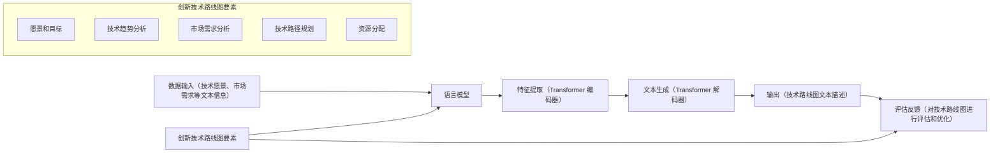

# 语言模型在创新技术路线图生成与评估中的应用

> 关键词：语言模型、创新技术路线图、生成、评估、自然语言处理、人工智能、技术规划

> 摘要：本文聚焦于语言模型在创新技术路线图生成与评估中的应用。首先介绍相关背景知识，包括目的、预期读者、文档结构和术语表等。接着阐述语言模型、创新技术路线图的核心概念及它们之间的联系，并给出相应的文本示意图和 Mermaid 流程图。详细讲解核心算法原理，通过 Python 源代码进行阐述，同时介绍相关数学模型和公式。通过项目实战，展示代码实际案例并进行详细解释。探讨语言模型在创新技术路线图中的实际应用场景，推荐相关的学习资源、开发工具框架和论文著作。最后总结未来发展趋势与挑战，解答常见问题，并提供扩展阅读和参考资料，旨在全面深入地探讨语言模型在创新技术路线图领域的应用。

## 1. 背景介绍 
### 1.1 目的和范围
在当今快速发展的科技时代，创新技术的发展日新月异，企业和组织需要制定有效的技术路线图来规划和引导技术创新。创新技术路线图是一种战略性工具，它能够帮助企业明确技术发展的方向、目标和步骤，合理分配资源，提高创新效率。然而，传统的技术路线图生成和评估方法往往依赖于人工经验和定性分析，存在主观性强、效率低等问题。

语言模型作为自然语言处理领域的重要成果，具有强大的文本理解、生成和推理能力。本研究的目的在于探索如何利用语言模型的优势，改进创新技术路线图的生成与评估过程，提高其科学性、客观性和效率。

本研究的范围涵盖了语言模型的基本原理、创新技术路线图的生成与评估方法，以及两者结合的具体应用。将通过理论分析、算法实现、项目实战等方式，全面深入地探讨语言模型在该领域的应用。

### 1.2 预期读者
本文预期读者包括从事技术创新管理、技术规划的企业管理人员、科研人员，以及对自然语言处理、人工智能技术应用感兴趣的技术爱好者和学者。对于企业管理人员，本文提供了一种新的技术路线图规划和评估思路，有助于提高企业的创新决策能力；对于科研人员，本文为相关领域的研究提供了理论和实践参考；对于技术爱好者和学者，本文可以帮助他们了解语言模型在实际应用中的具体场景和方法。

### 1.3 文档结构概述
本文将按照以下结构展开：首先介绍相关背景知识，包括目的、预期读者、文档结构和术语表等；接着阐述语言模型、创新技术路线图的核心概念及它们之间的联系，并给出相应的文本示意图和 Mermaid 流程图；详细讲解核心算法原理，通过 Python 源代码进行阐述，同时介绍相关数学模型和公式；通过项目实战，展示代码实际案例并进行详细解释；探讨语言模型在创新技术路线图中的实际应用场景，推荐相关的学习资源、开发工具框架和论文著作；最后总结未来发展趋势与挑战，解答常见问题，并提供扩展阅读和参考资料。

### 1.4 术语表
#### 1.4.1 核心术语定义
- **语言模型**：是一种对自然语言进行建模的统计模型，用于计算一个句子或文本序列的概率分布，预测下一个可能出现的词或字符。
- **创新技术路线图**：是一种战略性规划工具，它描述了技术从当前状态到未来目标状态的发展路径，包括技术发展的方向、目标、里程碑、关键技术和资源需求等。
- **自然语言处理（NLP）**：是人工智能的一个重要分支，研究如何让计算机理解、处理和生成自然语言。

#### 1.4.2 相关概念解释
- **预训练语言模型**：是在大规模无监督文本数据上进行预训练的语言模型，通过学习文本的语言模式和语义信息，获得通用的语言表示能力。
- **微调**：是在预训练语言模型的基础上，使用特定任务的有监督数据对模型进行进一步训练，使其适应特定任务的需求。
- **技术评估**：是对技术的性能、可行性、经济性、社会影响等方面进行综合评价的过程。

#### 1.4.3 缩略词列表
- **NLP**：自然语言处理（Natural Language Processing）
- **LM**：语言模型（Language Model）
- **GPT**：生成式预训练变换器（Generative Pretrained Transformer）
- **BERT**：双向编码器表示来自变换器（Bidirectional Encoder Representations from Transformers）

## 2. 核心概念与联系 
### 语言模型原理
语言模型的基本任务是计算一个文本序列 $w_1, w_2, \cdots, w_n$ 的概率 $P(w_1, w_2, \cdots, w_n)$。根据链式法则，该概率可以分解为：

$P(w_1, w_2, \cdots, w_n) = P(w_1)P(w_2|w_1)P(w_3|w_1, w_2) \cdots P(w_n|w_1, w_2, \cdots, w_{n-1})$

传统的语言模型，如 $n$-gram 模型，通过统计语料库中 $n$ 个连续词出现的频率来估计条件概率。然而，$n$-gram 模型存在数据稀疏和计算复杂度高的问题。

现代的语言模型，如基于深度学习的 Transformer 架构的模型（如 GPT、BERT 等），通过自注意力机制能够更好地捕捉文本中的长距离依赖关系。Transformer 模型由编码器和解码器组成，编码器用于对输入文本进行特征提取，解码器用于生成输出文本。

### 创新技术路线图原理
创新技术路线图是一种可视化的工具，它将技术发展的过程分解为多个阶段和里程碑，明确每个阶段的目标、关键技术和资源需求。创新技术路线图通常包括以下几个部分：
- **愿景和目标**：明确技术发展的长期愿景和短期目标。
- **技术趋势分析**：研究相关技术领域的发展趋势，预测未来可能出现的技术突破。
- **市场需求分析**：了解市场对技术的需求，确定技术的应用场景和市场定位。
- **技术路径规划**：制定技术从当前状态到未来目标状态的发展路径，包括关键技术的研发、集成和应用。
- **资源分配**：合理分配人力、物力和财力资源，确保技术路线图的顺利实施。

### 核心概念联系
语言模型在创新技术路线图生成与评估中具有重要作用。在生成阶段，语言模型可以根据输入的技术愿景、市场需求等信息，自动生成技术路线图的文本描述。通过对大量技术文献、市场报告等文本数据的学习，语言模型能够理解技术领域的专业知识和发展趋势，生成合理的技术路径和里程碑。

在评估阶段，语言模型可以对生成的技术路线图进行评估和优化。通过对技术路线图文本的语义理解和推理，语言模型可以检查技术路线图的逻辑性、可行性和完整性，发现潜在的问题和风险，并提出改进建议。

### 文本示意图
```plaintext
语言模型
|
|-- 数据输入（技术愿景、市场需求等文本信息）
|
|-- 特征提取（Transformer 编码器）
|
|-- 文本生成（Transformer 解码器）
|
|-- 输出（技术路线图文本描述）
|
|-- 评估反馈（对技术路线图进行评估和优化）
|
创新技术路线图
|
|-- 愿景和目标
|
|-- 技术趋势分析
|
|-- 市场需求分析
|
|-- 技术路径规划
|
|-- 资源分配
```

### Mermaid 流程图


## 3. 核心算法原理 & 具体操作步骤 
### 基于 GPT 的技术路线图生成算法原理
GPT（Generative Pretrained Transformer）是一种基于 Transformer 架构的生成式语言模型。GPT 模型通过在大规模无监督文本数据上进行预训练，学习到了丰富的语言知识和语义信息。在技术路线图生成任务中，我们可以使用微调后的 GPT 模型，根据输入的技术愿景、市场需求等信息，生成相应的技术路线图文本。

以下是基于 GPT 的技术路线图生成算法的 Python 代码示例：
```python
import torch
from transformers import GPT2LMHeadModel, GPT2Tokenizer

# 加载预训练的 GPT2 模型和分词器
tokenizer = GPT2Tokenizer.from_pretrained('gpt2')
model = GPT2LMHeadModel.from_pretrained('gpt2')

# 输入技术愿景和市场需求信息
input_text = "我们的愿景是开发一种高效的人工智能算法，以满足市场对智能决策系统的需求。"

# 对输入文本进行分词
input_ids = tokenizer.encode(input_text, return_tensors='pt')

# 生成技术路线图文本
output = model.generate(input_ids, max_length=500, num_beams=5, no_repeat_ngram_size=2, early_stopping=True)

# 解码生成的文本
generated_text = tokenizer.decode(output[0], skip_special_tokens=True)

print(generated_text)
```
### 具体操作步骤
1. **数据准备**：收集和整理与技术领域相关的文本数据，包括技术文献、市场报告、技术路线图案例等。对数据进行清洗、标注和预处理，以便模型训练使用。
2. **模型选择和加载**：选择合适的预训练语言模型，如 GPT2、BERT 等，并使用相应的库加载模型和分词器。
3. **微调模型**：使用准备好的技术路线图数据对预训练模型进行微调，使其适应技术路线图生成任务的需求。
4. **输入信息处理**：将技术愿景、市场需求等信息转换为模型可以接受的输入格式，如使用分词器对文本进行分词。
5. **文本生成**：使用微调后的模型根据输入信息生成技术路线图文本。
6. **后处理**：对生成的文本进行后处理，如去除特殊字符、调整格式等，使其更加易读和规范。

### 技术路线图评估算法原理
技术路线图评估主要包括逻辑性评估、可行性评估和完整性评估等方面。我们可以使用自然语言处理技术，如文本相似度计算、语义理解和推理等，对技术路线图文本进行评估。

以下是一个简单的技术路线图逻辑性评估的 Python 代码示例：
```python
from sklearn.feature_extraction.text import TfidfVectorizer
from sklearn.metrics.pairwise import cosine_similarity

# 技术路线图文本
roadmap_text = "我们将首先开展基础研究，然后进行技术开发，最后进行产品推广。"

# 参考文本（逻辑合理的技术路线图示例）
reference_text = "技术研发通常包括基础研究、技术开发和产品推广三个阶段。"

# 使用 TF-IDF 向量化文本
vectorizer = TfidfVectorizer()
vectors = vectorizer.fit_transform([roadmap_text, reference_text])

# 计算文本相似度
similarity = cosine_similarity(vectors[0], vectors[1])

print("技术路线图的逻辑性相似度：", similarity[0][0])
```

## 4. 数学模型和公式 & 详细讲解 & 举例说明 
### 语言模型概率计算
如前面所述，语言模型的基本任务是计算一个文本序列 $w_1, w_2, \cdots, w_n$ 的概率 $P(w_1, w_2, \cdots, w_n)$，根据链式法则：

$P(w_1, w_2, \cdots, w_n) = P(w_1)P(w_2|w_1)P(w_3|w_1, w_2) \cdots P(w_n|w_1, w_2, \cdots, w_{n-1})$

在 $n$-gram 模型中，为了简化计算，通常假设当前词的概率只依赖于前面的 $n - 1$ 个词，即：

$P(w_i|w_1, w_2, \cdots, w_{i-1}) \approx P(w_i|w_{i - n + 1}, w_{i - n + 2}, \cdots, w_{i-1})$

例如，在一个 2-gram（bigram）模型中，计算句子 “The cat is on the mat” 的概率：

$P(\text{The cat is on the mat}) = P(\text{The})P(\text{cat}|\text{The})P(\text{is}|\text{cat})P(\text{on}|\text{is})P(\text{the}|\text{on})P(\text{mat}|\text{the})$

### 文本相似度计算
在技术路线图评估中，我们常常需要计算文本之间的相似度。常用的文本相似度计算方法有余弦相似度、欧几里得距离等。

#### 余弦相似度
余弦相似度是通过计算两个向量之间的夹角余弦值来衡量它们的相似度。对于两个向量 $\vec{A}$ 和 $\vec{B}$，余弦相似度的计算公式为：

$\text{cosine similarity}(\vec{A}, \vec{B}) = \frac{\vec{A} \cdot \vec{B}}{\|\vec{A}\| \|\vec{B}\|}$

其中，$\vec{A} \cdot \vec{B}$ 是向量 $\vec{A}$ 和 $\vec{B}$ 的点积，$\|\vec{A}\|$ 和 $\|\vec{B}\|$ 分别是向量 $\vec{A}$ 和 $\vec{B}$ 的模。

例如，假设有两个文本向量 $\vec{A} = [1, 2, 3]$ 和 $\vec{B} = [2, 4, 6]$，则它们的余弦相似度为：

$\vec{A} \cdot \vec{B} = 1 \times 2 + 2 \times 4 + 3 \times 6 = 2 + 8 + 18 = 28$

$\|\vec{A}\| = \sqrt{1^2 + 2^2 + 3^2} = \sqrt{1 + 4 + 9} = \sqrt{14}$

$\|\vec{B}\| = \sqrt{2^2 + 4^2 + 6^2} = \sqrt{4 + 16 + 36} = \sqrt{56} = 2\sqrt{14}$

$\text{cosine similarity}(\vec{A}, \vec{B}) = \frac{28}{\sqrt{14} \times 2\sqrt{14}} = 1$

#### 欧几里得距离
欧几里得距离是指在 $n$ 维空间中两个点之间的直线距离。对于两个向量 $\vec{A}$ 和 $\vec{B}$，欧几里得距离的计算公式为：

$d(\vec{A}, \vec{B}) = \sqrt{\sum_{i = 1}^{n} (A_i - B_i)^2}$

例如，对于上述向量 $\vec{A} = [1, 2, 3]$ 和 $\vec{B} = [2, 4, 6]$，它们的欧几里得距离为：

$d(\vec{A}, \vec{B}) = \sqrt{(1 - 2)^2 + (2 - 4)^2 + (3 - 6)^2} = \sqrt{(-1)^2 + (-2)^2 + (-3)^2} = \sqrt{1 + 4 + 9} = \sqrt{14}$

### 应用举例
在技术路线图生成中，我们可以使用语言模型的概率计算来选择最可能的文本序列。例如，在生成技术路线图的某个步骤时，模型会计算不同候选词的概率，选择概率最大的词作为输出。

在技术路线图评估中，我们可以使用文本相似度计算来评估技术路线图的逻辑性和合理性。例如，将生成的技术路线图文本与参考的合理技术路线图文本进行相似度计算，如果相似度较高，则说明生成的技术路线图逻辑性较好。

## 5. 项目实战：代码实际案例和详细解释说明 
### 5.1  开发环境搭建
#### 安装 Python
首先，确保你已经安装了 Python 3.x 版本。可以从 Python 官方网站（https://www.python.org/downloads/） 下载并安装适合你操作系统的 Python 版本。

#### 安装必要的库
使用 pip 命令安装所需的库，包括 `transformers`、`torch`、`sklearn` 等。

```bash
pip install transformers torch scikit-learn
```

### 5.2  源代码详细实现和代码解读
#### 技术路线图生成代码
```python
import torch
from transformers import GPT2LMHeadModel, GPT2Tokenizer

# 加载预训练的 GPT2 模型和分词器
tokenizer = GPT2Tokenizer.from_pretrained('gpt2')
model = GPT2LMHeadModel.from_pretrained('gpt2')

# 输入技术愿景和市场需求信息
input_text = "我们的愿景是开发一种高效的人工智能算法，以满足市场对智能决策系统的需求。"

# 对输入文本进行分词
input_ids = tokenizer.encode(input_text, return_tensors='pt')

# 生成技术路线图文本
output = model.generate(input_ids, max_length=500, num_beams=5, no_repeat_ngram_size=2, early_stopping=True)