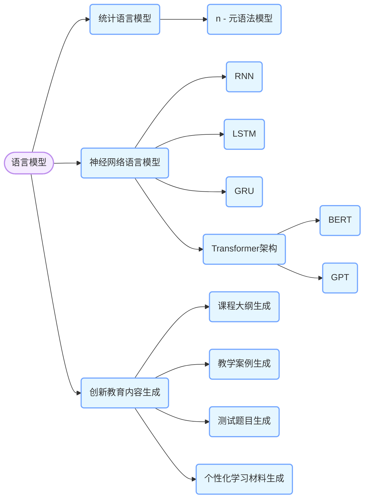

# 语言模型在创新教育内容生成中的应用探索

> 关键词：语言模型、创新教育内容生成、教育应用、自然语言处理、人工智能教育

> 摘要：本文深入探讨了语言模型在创新教育内容生成中的应用。随着人工智能技术的飞速发展，语言模型展现出强大的文本生成能力。在教育领域，利用语言模型进行创新教育内容的生成具有巨大潜力，能够为教育工作者提供多样化的教学资源，提升学生的学习体验。文章介绍了语言模型的背景知识，阐述了其核心概念与架构，详细讲解了相关算法原理和操作步骤，给出了数学模型和公式，通过实际案例展示了如何利用语言模型进行教育内容的生成，分析了其在不同教育场景中的应用，推荐了相关的学习资源、开发工具和论文著作，最后对语言模型在创新教育内容生成中的未来发展趋势与挑战进行了总结。

## 1. 背景介绍 
### 1.1 目的和范围
随着人工智能技术的不断发展，语言模型已经成为自然语言处理领域的核心技术之一。其强大的文本生成能力为各个领域带来了新的机遇和挑战。在教育领域，传统的教育内容生成方式往往耗时费力，难以满足个性化、多样化的教学需求。本文章旨在探索语言模型在创新教育内容生成中的应用，通过深入研究语言模型的原理和技术，结合教育领域的特点，探讨如何利用语言模型生成高质量、创新性的教育内容，包括但不限于课程大纲、教学案例、测试题目等。同时，文章还将分析语言模型在教育应用中可能面临的问题和挑战，并提出相应的解决方案。

### 1.2 预期读者
本文的预期读者主要包括教育工作者、教育技术研究者、人工智能开发者以及对教育与人工智能融合感兴趣的人士。教育工作者可以从本文中了解如何利用语言模型来改进教学方法、丰富教学资源；教育技术研究者可以获得关于语言模型在教育领域应用的研究思路和方法；人工智能开发者可以借鉴本文中的技术和案例，开发更适合教育场景的语言模型应用；而对教育与人工智能融合感兴趣的人士可以通过本文了解这一领域的最新动态和发展趋势。

### 1.3 文档结构概述
本文将按照以下结构进行组织：
- 核心概念与联系：介绍语言模型和创新教育内容生成的核心概念，以及它们之间的联系，并给出相应的文本示意图和 Mermaid 流程图。
- 核心算法原理 & 具体操作步骤：详细讲解语言模型的核心算法原理，并使用 Python 源代码进行阐述，同时给出具体的操作步骤。
- 数学模型和公式 & 详细讲解 & 举例说明：介绍语言模型的数学模型和公式，并进行详细讲解，通过具体的例子说明其应用。
- 项目实战：代码实际案例和详细解释说明：通过一个实际的项目案例，展示如何利用语言模型进行创新教育内容的生成，包括开发环境搭建、源代码实现和代码解读。
- 实际应用场景：分析语言模型在不同教育场景中的应用，如课堂教学、在线学习、个性化学习等。
- 工具和资源推荐：推荐相关的学习资源、开发工具和论文著作，帮助读者进一步深入学习和研究。
- 总结：未来发展趋势与挑战：总结语言模型在创新教育内容生成中的应用现状，分析其未来发展趋势和可能面临的挑战。
- 附录：常见问题与解答：解答读者在阅读本文过程中可能遇到的常见问题。
- 扩展阅读 & 参考资料：提供相关的扩展阅读材料和参考资料，方便读者进一步深入研究。

### 1.4 术语表
#### 1.4.1 核心术语定义
- **语言模型（Language Model）**：是一种基于概率统计的模型，用于预测一个词序列出现的概率。在自然语言处理中，语言模型可以用于文本生成、机器翻译、语音识别等任务。
- **创新教育内容生成（Innovative Education Content Generation）**：指利用先进的技术和方法，生成具有创新性、个性化、多样化的教育内容，以满足不同学生的学习需求和教学目标。
- **自然语言处理（Natural Language Processing, NLP）**：是人工智能领域的一个重要分支，主要研究如何让计算机理解和处理人类语言，包括文本分类、情感分析、信息抽取等任务。
- **深度学习（Deep Learning）**：是一种基于人工神经网络的机器学习方法，通过构建多层神经网络来学习数据的特征和模式，在图像识别、语音识别、自然语言处理等领域取得了显著的成果。

#### 1.4.2 相关概念解释
- **Transformer 架构**：是一种基于注意力机制的神经网络架构，在自然语言处理领域取得了巨大的成功。Transformer 架构通过多头注意力机制能够有效地捕捉序列中不同位置之间的依赖关系，从而提高模型的性能。
- **预训练模型（Pretrained Model）**：是指在大规模语料库上进行无监督学习训练得到的模型。预训练模型可以学习到丰富的语言知识和语义信息，在具体的任务上进行微调后可以取得更好的性能。
- **微调（Fine-tuning）**：是指在预训练模型的基础上，在特定的任务数据集上进行有监督学习训练，以适应具体的任务需求。微调可以使预训练模型更好地应用于特定的任务，提高模型的性能。

#### 1.4.3 缩略词列表
- **NLP**：Natural Language Processing（自然语言处理）
- **RNN**：Recurrent Neural Network（循环神经网络）
- **LSTM**：Long Short-Term Memory（长短期记忆网络）
- **GRU**：Gated Recurrent Unit（门控循环单元）
- **Transformer**：Transformer 架构
- **BERT**：Bidirectional Encoder Representations from Transformers（基于 Transformer 的双向编码器表示）
- **GPT**：Generative Pretrained Transformer（生成式预训练 Transformer）

## 2. 核心概念与联系 

### 语言模型核心概念
语言模型的核心目标是对自然语言文本的概率分布进行建模，也就是预测给定一个词序列后下一个词出现的概率。从早期的统计语言模型，如 n - 元语法模型（n - gram），到如今基于深度学习的神经网络语言模型，如基于 RNN、LSTM、GRU 以及 Transformer 架构的模型，其发展经历了巨大的变革。

n - 元语法模型是一种简单的统计语言模型，它基于马尔可夫假设，即一个词出现的概率只与其前 n - 1 个词有关。例如，在二元语法模型（bigram）中，一个词 $w_i$ 出现的概率只取决于它的前一个词 $w_{i - 1}$，可以表示为 $P(w_i|w_{i - 1})$。

基于深度学习的语言模型则能够学习到更复杂的语言模式和语义信息。以 Transformer 架构为基础的语言模型，如 BERT 和 GPT，通过自注意力机制能够捕捉序列中不同位置之间的长距离依赖关系，从而在各种自然语言处理任务中取得了优异的性能。

### 创新教育内容生成核心概念
创新教育内容生成旨在利用先进的技术和方法，为教育领域生成具有创新性、个性化和多样化的教学资源。创新教育内容不仅包括传统的文字教材、课件等，还可以包括交互式的学习材料、虚拟现实（VR）/增强现实（AR）教学内容等。其核心在于满足不同学生的学习需求和教学目标，提高教学效果和学生的学习体验。

### 两者的联系
语言模型为创新教育内容生成提供了强大的技术支持。通过语言模型，教育工作者可以快速生成丰富多样的教育内容，如课程大纲、教学案例、测试题目等。同时，语言模型可以根据学生的学习情况和需求，生成个性化的学习材料，实现个性化教育。例如，利用语言模型可以为不同学习水平的学生生成难度不同的测试题目，或者为学生提供针对性的学习建议。

### 文本示意图
```plaintext
语言模型
    |
    |-- 统计语言模型（n - 元语法模型）
    |-- 神经网络语言模型
        |-- RNN
        |-- LSTM
        |-- GRU
        |-- Transformer 架构（BERT、GPT 等）
    |
    |-- 应用于创新教育内容生成
        |-- 课程大纲生成
        |-- 教学案例生成
        |-- 测试题目生成
        |-- 个性化学习材料生成
```

### Mermaid 流程图


## 3. 核心算法原理 & 具体操作步骤 

### 核心算法原理：以 GPT 为例
GPT（Generative Pretrained Transformer）是一种基于 Transformer 架构的生成式预训练语言模型。其核心思想是通过在大规模无监督文本数据上进行预训练，学习到丰富的语言知识和语义信息，然后在具体的任务上进行微调。

#### Transformer 架构
Transformer 架构主要由编码器和解码器组成，在 GPT 中只使用了解码器部分。解码器由多个相同的层堆叠而成，每层包含多头自注意力机制和前馈神经网络。

##### 多头自注意力机制
多头自注意力机制是 Transformer 架构的核心组件之一，它允许模型在不同的表示子空间中并行地关注输入序列的不同部分。给定输入序列 $X = [x_1, x_2,..., x_n]$，首先将输入序列通过线性变换得到查询（Query）、键（Key）和值（Value）矩阵 $Q$、$K$ 和 $V$。然后，计算注意力分数：

$$Attention(Q, K, V) = softmax(\frac{QK^T}{\sqrt{d_k}})V$$

其中，$d_k$ 是查询和键向量的维度。多头自注意力机制将输入序列分别投影到多个不同的子空间中，计算每个子空间的注意力分数，最后将这些分数拼接起来并通过线性变换得到最终的输出。

##### 前馈神经网络
前馈神经网络由两个线性层和一个非线性激活函数（通常是 ReLU）组成。其作用是对多头自注意力机制的输出进行进一步的变换和特征提取。

#### 预训练过程
GPT 的预训练过程是在大规模无监督文本数据上进行的，采用自回归语言模型的训练方式，即预测下一个词。给定输入序列 $x_1, x_2,..., x_t$，模型的目标是最大化预测下一个词 $x_{t + 1}$ 的概率：

$$P(x_{t + 1}|x_1, x_2,..., x_t)$$

通过在大规模文本数据上进行训练，模型可以学习到丰富的语言知识和语义信息。

#### 微调过程
在预训练完成后，模型可以在具体的任务上进行微调。微调的过程是在特定的任务数据集上进行有监督学习训练，通过调整模型的参数来适应具体的任务需求。

### 具体操作步骤
#### 步骤 1：安装必要的库
在使用 GPT 进行教育内容生成之前，需要安装必要的库，如 `transformers` 和 `torch`。可以使用以下命令进行安装：
```bash
pip install transformers torch
```

#### 步骤 2：加载预训练模型
使用 `transformers` 库加载预训练的 GPT 模型和对应的分词器：
```python
from transformers import GPT2LMHeadModel, GPT2Tokenizer

# 加载预训练的 GPT 模型和分词器
model = GPT2LMHeadModel.from_pretrained('gpt2')
tokenizer = GPT2Tokenizer.from_pretrained('gpt2')
```

#### 步骤 3：准备输入文本
准备需要生成教育内容的输入文本，例如生成课程大纲时，可以输入课程的主题：
```python
input_text = "高中数学函数课程大纲"
```

#### 步骤 4：对输入文本进行编码
使用分词器对输入文本进行编码，将其转换为模型可以接受的输入格式：
```python
input_ids = tokenizer.encode(input_text, return_tensors='pt')
```

#### 步骤 5：生成教育内容
使用模型对输入文本进行处理，生成教育内容：
```python
output = model.generate(input_ids, max_length=200, num_beams=5, no_repeat_ngram_size=2, early_stopping=True)
```

#### 步骤 6：解码输出结果
使用分词器对模型的输出结果进行解码，将其转换为自然语言文本：
```python
generated_text = tokenizer.decode(output[0], skip_special_tokens=True)
print(generated_text)
```

### 完整的 Python 代码示例
```python
from transformers import GPT2LMHeadModel, GPT2Tokenizer

# 加载预训练的 GPT 模型和分词器
model = GPT2LMHeadModel.from_pretrained('gpt2')
tokenizer = GPT2Tokenizer.from_pretrained('gpt2')

# 准备输入文本
input_text = "高中数学函数课程大纲"

# 对输入文本进行编码
input_ids = tokenizer.encode(input_text, return_tensors='pt')

# 生成教育内容
output = model.generate(input_ids, max_length=200, num_beams=5, no_repeat_ngram_size=2, early_stopping=True)

# 解码输出结果
generated_text = tokenizer.decode(output[0], skip_special_tokens=True)
print(generated_text)
```

## 4. 数学模型和公式 & 详细讲解 & 举例说明 

### 语言模型的数学基础
语言模型的核心目标是对自然语言文本的概率分布进行建模，即计算一个词序列 $w_1, w_2,..., w_n$ 出现的概率 $P(w_1, w_2,..., w_n)$。根据链式法则，这个概率可以分解为：

$$P(w_1, w_2,..., w_n) = \prod_{i = 1}^{n} P(w_i|w_1, w_2,..., w_{i - 1})$$

### n - 元语法模型
n - 元语法模型基于马尔可夫假设，即一个词出现的概率只与其前 n - 1 个词有关。因此，在 n - 元语法模型中，上述概率可以近似为：

$$P(w_1, w_2,..., w_n) \approx \prod_{i = 1}^{n} P(w_i|w_{i - n + 1}, w_{i - n + 2},..., w_{i - 1})$$

例如，在二元语法模型（bigram）中，$n = 2$，则：

$$P(w_1, w_2,..., w_n) \approx \prod_{i = 1}^{n} P(w_i|w_{i - 1})$$

#### 举例说明
假设我们有一个简单的语料库：“I love natural language processing”。在二元语法模型中，计算句子 “I love NLP” 的概率。

首先，计算每个二元组的概率：
- $P(I|\text{<START>}) = \frac{1}{1}$
- $P(love|I) = \frac{1}{1}$
- $P(NLP|love)$：由于在语料库中没有 “love NLP” 这个二元组，我们可以使用平滑技术（如拉普拉斯平滑）来避免概率为 0 的情况。

假设使用拉普拉斯平滑，$P(NLP|love) = \frac{0 + 1}{1 + V}$，其中 $V$ 是语料库中不同词的数量。

则句子 “I love NLP” 的概率为：

$$P(\text{I love NLP}) = P(I|\text{<START>}) \times P(love|I) \times P(NLP|love)$$

### 基于 Transformer 的语言模型
基于 Transformer 的语言模型，如 GPT，通过自注意力机制来捕捉序列中不同位置之间的依赖关系。自注意力机制的核心公式为：

$$Attention(Q, K, V) = softmax(\frac{QK^T}{\sqrt{d_k}})V$$

其中，$Q$、$K$ 和 $V$ 分别是查询、键和值矩阵，$d_k$ 是查询和键向量的维度。

#### 详细讲解
- **查询（Query）、键（Key）和值（Value）矩阵**：给定输入序列 $X = [x_1, x_2,..., x_n]$，通过线性变换将输入序列转换为查询、键和值矩阵 $Q$、$K$ 和 $V$。这些矩阵的作用是在计算注意力分数时，分别表示查询的信息、被查询的信息和要聚合的信息。
- **注意力分数计算**：通过计算查询矩阵 $Q$ 和键矩阵 $K$ 的转置的乘积，得到注意力分数。除以 $\sqrt{d_k}$ 是为了防止点积结果过大，导致 softmax 函数的梯度消失。
- **softmax 函数**：对注意力分数进行 softmax 操作，将其转换为概率分布。这样可以使得每个位置的注意力分数都在 0 到 1 之间，且所有位置的注意力分数之和为 1。
- **加权求和**：将 softmax 函数的输出与值矩阵 $V$ 相乘，得到最终的注意力输出。这个输出是对输入序列中不同位置信息的加权聚合。

#### 举例说明
假设我们有一个输入序列 $X = [x_1, x_2, x_3]$，每个输入向量的维度为 $d = 4$。查询、键和值矩阵的维度分别为 $d_q = d_k = d_v = 3$。

首先，通过线性变换得到查询、键和值矩阵：

$$Q = \begin{bmatrix}
q_1 \\
q_2 \\
q_3
\end{bmatrix}, K = \begin{bmatrix}
k_1 \\
k_2 \\
k_3
\end{bmatrix}, V = \begin{bmatrix}
v_1 \\
v_2 \\
v_3
\end{bmatrix}$$

其中，$q_i$、$k_i$ 和 $v_i$ 分别是查询、键和值向量。

然后，计算注意力分数：

$$Attention(Q, K, V) = softmax(\frac{QK^T}{\sqrt{d_k}})V$$

假设 $QK^T = \begin{bmatrix}
1 & 2 & 3 \\
4 & 5 & 6 \\
7 & 8 & 9
\end{bmatrix}$，$d_k = 3$，则：

$$\frac{QK^T}{\sqrt{d_k}} = \begin{bmatrix}
\frac{1}{\sqrt{3}} & \frac{2}{\sqrt{3}} & \frac{3}{\sqrt{3}} \\
\frac{4}{\sqrt{3}} & \frac{5}{\sqrt{3}} & \frac{6}{\sqrt{3}} \\
\frac{7}{\sqrt{3}} & \frac{8}{\sqrt{3}} & \frac{9}{\sqrt{3}}
\end{bmatrix}$$

对其进行 softmax 操作：

$$softmax(\frac{QK^T}{\sqrt{d_k}}) = \begin{bmatrix}
s_{11} & s_{12} & s_{13} \\
s_{21} & s_{22} & s_{23} \\
s_{31} & s_{32} & s_{33}
\end{bmatrix}$$

最后，将 softmax 函数的输出与值矩阵 $V$ 相乘，得到最终的注意力输出。

## 5. 项目实战：代码实际案例和详细解释说明 

### 5.1  开发环境搭建
#### 安装 Python
首先，确保你已经安装了 Python 3.6 或更高版本。可以从 Python 官方网站（https://www.python.org/downloads/）下载并安装 Python。

#### 创建虚拟环境
为了避免不同项目之间的依赖冲突，建议使用虚拟环境。可以使用 `venv` 模块来创建虚拟环境：
```bash
python -m venv myenv
```

激活虚拟环境：
- 在 Windows 上：
```bash
myenv\Scripts\activate
```
- 在 Linux 或 macOS 上：
```bash
source myenv/bin/activate
```

#### 安装必要的库
在虚拟环境中安装 `transformers` 和 `torch` 库：
```bash
pip install transformers torch
```

### 5.2  源代码详细实现和代码解读
```python
from transformers import GPT2LMHeadModel, GPT2Tokenizer

# 加载预训练的 GPT 模型和分词器
model = GPT2LMHeadModel.from_pretrained('gpt2')
tokenizer = GPT2Tokenizer.from_pretrained('gpt2')

# 准备输入文本
input_text = "初中英语语法课程大纲"

# 对输入文本进行编码
input_ids = tokenizer.encode(input_text, return_tensors='pt')

# 生成教育内容
output = model.generate(input_ids, max_length=300, num_beams=5, no_repeat_ngram_size=2, early_stopping=True)

# 解码输出结果
generated_text = tokenizer.decode(output[0], skip_special_tokens=True)

# 打印生成的教育内容
print(generated_text)
```

#### 代码解读
1. **导入必要的库**：
```python
from transformers import GPT2LMHeadModel, GPT2Tokenizer
```
这行代码导入了 `transformers` 库中的 `GPT2LMHeadModel` 和 `GPT2Tokenizer` 类。`GPT2LMHeadModel` 是用于文本生成的 GPT - 2 模型，`GPT2Tokenizer` 是用于对输入文本进行编码和解码的分词器。

2. **加载预训练的模型和分词器**：
```python
model = GPT2LMHeadModel.from_pretrained('gpt2')
tokenizer = GPT2Tokenizer.from_pretrained('gpt2')
```
这两行代码分别加载了预训练的 GPT - 2 模型和对应的分词器。`from_pretrained` 方法会自动从 Hugging Face 的模型库中下载并加载预训练的模型和分词器。

3. **准备输入文本**：
```python
input_text = "初中英语语法课程大纲"
```
这行代码定义了需要生成教育内容的输入文本。

4. **对输入文本进行编码**：
```python
input_ids = tokenizer.encode(input_text, return_tensors='pt')
```
这行代码使用分词器对输入文本进行编码，将其转换为模型可以接受的输入格式。`return_tensors='pt'` 表示返回 PyTorch 张量。

5. **生成教育内容**：
```python
output = model.generate(input_ids, max_length=300, num_beams=5, no_repeat_ngram_size=2, early_stopping=True)
```
这行代码使用模型对输入文本进行处理，生成教育内容。`max_length` 表示生成文本的最大长度，`num_beams` 表示束搜索的束宽，`no_repeat_ngram_size` 表示避免生成重复的 n - 元组，`early_stopping` 表示在生成过程中达到最大长度或生成结束标记时停止生成。

6. **解码输出结果**：
```python
generated_text = tokenizer.decode(output[0], skip_special_tokens=True)
```
这行代码使用分词器对模型的输出结果进行解码，将其转换为自然语言文本。`skip_special_tokens=True` 表示跳过特殊标记。

7. **打印生成的教育内容**：
```python
print(generated_text)
```
这行代码打印生成的教育内容。

### 5.3  代码解读与分析
#### 模型选择
在这个项目中，我们选择了 GPT - 2 模型。GPT - 2 是一个强大的生成式预训练语言模型，具有良好的文本生成能力。在实际应用中，可以根据具体的需求选择不同的模型，如 GPT - 3、BERT 等。

#### 输入文本的选择
输入文本的选择对生成的教育内容有很大的影响。输入文本应该明确表达需要生成的教育内容的主题和要求，这样模型才能生成更符合需求的内容。

#### 生成参数的调整
`max_length`、`num_beams`、`no_repeat_ngram_size` 等生成参数可以根据具体的需求进行调整。例如，如果需要生成更长的文本，可以增加 `max_length` 的值；如果需要提高生成文本的质量，可以增加 `num_beams` 的值。

#### 模型的局限性
虽然语言模型在教育内容生成中具有很大的潜力，但也存在一些局限性。例如，模型生成的内容可能存在语法错误、逻辑不连贯等问题，需要人工进行审核和修改。此外，模型可能会生成一些不准确或不恰当的内容，需要对模型进行适当的引导和约束。

## 6. 实际应用场景 
### 课堂教学
在课堂教学中，语言模型可以为教师提供丰富的教学资源。例如，教师可以使用语言模型生成课程大纲、教学案例、讲解示例等。课程大纲可以帮助教师更好地组织教学内容，确保教学的系统性和完整性；教学案例可以为学生提供实际应用的场景，帮助学生更好地理解和掌握知识；讲解示例可以为教师提供多样化的讲解方式，提高教学效果。

此外，语言模型还可以生成测试题目，用于课堂小测或课后作业。教师可以根据教学内容和学生的学习情况，使用语言模型生成不同难度级别的测试题目，实现个性化的教学评估。

### 在线学习
在在线学习平台中，语言模型可以为学生提供个性化的学习支持。例如，学生在学习过程中遇到问题时，可以使用语言模型生成相关的解释和解答。语言模型可以根据学生的问题，提供详细的解释和示例，帮助学生更好地理解和掌握知识。

此外，语言模型还可以生成学习计划和学习建议。根据学生的学习目标、学习进度和学习习惯，语言模型可以为学生制定个性化的学习计划，并提供相应的学习建议，帮助学生提高学习效率。

### 个性化学习
语言模型可以根据学生的学习情况和需求，生成个性化的学习材料。例如，对于学习困难的学生，语言模型可以生成更详细、更基础的学习材料；对于学习能力较强的学生，语言模型可以生成更具挑战性的学习材料。

此外，语言模型还可以根据学生的兴趣爱好，生成相关的学习内容。例如，对于喜欢科学的学生，语言模型可以生成科学实验、科普文章等学习内容，激发学生的学习兴趣。

### 教育研究
在教育研究中，语言模型可以为研究者提供数据支持和分析工具。例如，研究者可以使用语言模型对教育文本进行分析，如课程标准、教材内容等，挖掘其中的知识结构和语义信息。此外，语言模型还可以用于教育数据的生成和模拟，帮助研究者进行实验和验证。

## 7. 工具和资源推荐
### 7.1 学习资源推荐
#### 7.1.1 书籍推荐
- 《深度学习》（Deep Learning）：由 Ian Goodfellow、Yoshua Bengio 和 Aaron Courville 合著，是深度学习领域的经典教材，全面介绍了深度学习的基本概念、算法和应用。
- 《自然语言处理入门》（Natural Language Processing with Python）：由 Steven Bird、Ewan Klein 和 Edward Loper 合著，介绍了使用 Python 进行自然语言处理的基本方法和技术。
- 《Transformer 模型实战：基于 PyTorch 和 TensorFlow》：详细介绍了 Transformer 架构的原理和实现，以及如何使用 PyTorch 和 TensorFlow 进行模型的训练和应用。

#### 7.1.2 在线课程
- Coursera 上的 “Natural Language Processing Specialization”：由斯坦福大学的教授授课，系统介绍了自然语言处理的基本概念、算法和应用。
- edX 上的 “Deep Learning for Natural Language Processing”：介绍了深度学习在自然语言处理中的应用，包括语言模型、机器翻译、文本分类等任务。
- 吴恩达的 “DeepLearning.AI” 系列课程：涵盖了深度学习的各个方面，包括自然语言处理、计算机视觉等。

#### 7.1.3 技术博客和网站
- Hugging Face Blog：Hugging Face 是自然语言处理领域的领先公司，其博客提供了关于语言模型、自然语言处理技术的最新研究成果和应用案例。
- Towards Data Science：是一个数据科学和人工智能领域的技术博客，提供了大量关于自然语言处理、深度学习等方面的文章和教程。
- ArXiv.org：是一个预印本服务器，提供了计算机科学、数学、物理学等领域的最新研究论文。

### 7.2 开发工具框架推荐
#### 7.2.1 IDE和编辑器
- PyCharm：是一款专业的 Python 集成开发环境，提供了丰富的代码编辑、调试和项目管理功能。
- Visual Studio Code：是一款轻量级的代码编辑器，支持多种编程语言，具有丰富的插件生态系统，可以方便地进行 Python 开发。

#### 7.2.2 调试和性能分析工具
- PyTorch Profiler：是 PyTorch 提供的性能分析工具，可以帮助开发者分析模型的性能瓶颈，优化代码。
- TensorBoard：是 TensorFlow 提供的可视化工具，可以帮助开发者可视化模型的训练过程和性能指标。

#### 7.2.3 相关框架和库
- Transformers：是 Hugging Face 开发的一个自然语言处理库，提供了多种预训练模型和工具，方便开发者进行自然语言处理任务的开发。
- PyTorch：是一个开源的深度学习框架，具有良好的灵活性和可扩展性，广泛应用于自然语言处理、计算机视觉等领域。
- TensorFlow：是 Google 开发的一个开源的深度学习框架，提供了丰富的工具和库，方便开发者进行模型的训练和部署。

### 7.3 相关论文著作推荐
#### 7.3.1 经典论文
- “Attention Is All You Need”：介绍了 Transformer 架构，是自然语言处理领域的经典论文，为后续的语言模型发展奠定了基础。
- “BERT: Pre-training of Deep Bidirectional Transformers for Language Understanding”：介绍了 BERT 模型，提出了基于双向编码器的预训练方法，在自然语言处理任务中取得了优异的性能。
- “Generative Pretrained Transformer 3 (GPT - 3): Language Models Are Few - Shot Learners”：介绍了 GPT - 3 模型，展示了其强大的语言生成能力和少样本学习能力。

#### 7.3.2 最新研究成果
- 在 ACL（Association for Computational Linguistics）、EMNLP（Conference on Empirical Methods in Natural Language Processing）等自然语言处理领域的顶级会议上，可以找到关于语言模型和教育应用的最新研究成果。
- 在 ArXiv.org 上，可以关注自然语言处理和教育技术领域的最新预印本论文。

#### 7.3.3 应用案例分析
- 可以关注一些教育科技公司的官方博客和研究报告，了解语言模型在教育领域的实际应用案例和效果评估。
- 在一些教育研究期刊上，也可以找到关于语言模型在教育应用的案例分析和实证研究。

## 8. 总结：未来发展趋势与挑战
### 未来发展趋势
#### 更强大的语言模型
随着计算能力的不断提升和算法的不断改进，未来的语言模型将变得更加强大。模型的规模将不断增大，能够学习到更丰富的语言知识和语义信息，从而生成更加高质量、创新性的教育内容。

#### 个性化教育的深入发展
语言模型将能够更好地根据学生的学习情况、兴趣爱好和学习目标，生成更加个性化的教育内容。例如，为每个学生定制专属的学习计划、提供个性化的学习建议和辅导等，实现真正意义上的个性化教育。

#### 与其他技术的融合
语言模型将与虚拟现实（VR）、增强现实（AR）、物联网（IoT）等技术进行深度融合，创造更加丰富、生动的教育场景。例如，利用 VR/AR 技术将语言模型生成的教育内容以更加直观、沉浸式的方式呈现给学生，提高学生的学习体验。

#### 教育数据的智能分析
语言模型将能够对大量的教育数据进行智能分析，挖掘其中的潜在信息和规律。例如，分析学生的学习行为、学习成绩等数据，为教师提供教学决策支持，为学校提供教育质量评估依据。

### 挑战
#### 数据质量和隐私问题
语言模型的训练需要大量的高质量数据，但教育数据往往存在质量参差不齐、标注困难等问题。此外，教育数据涉及学生的个人隐私和敏感信息，如何在保证数据安全和隐私的前提下，充分利用教育数据进行模型训练，是一个亟待解决的问题。

#### 模型的可解释性和可靠性
语言模型通常是基于深度学习的黑盒模型，其决策过程和输出结果难以解释和理解。在教育领域，模型的可解释性和可靠性尤为重要，因为教师和学生需要了解模型生成的教育内容的依据和可靠性。如何提高语言模型的可解释性和可靠性，是当前面临的一个挑战。

#### 教育伦理和价值观问题
语言模型生成的教育内容可能会受到训练数据和算法的影响，存在一些不准确、不恰当或不符合教育伦理和价值观的内容。如何确保语言模型生成的教育内容符合教育伦理和价值观，引导学生树立正确的世界观、人生观和价值观，是一个需要关注的问题。

#### 技术应用的适应性问题
虽然语言模型在教育内容生成中具有很大的潜力，但将其应用到实际的教育场景中还存在一些适应性问题。例如，教师和学生对新技术的接受程度和使用能力不同，如何提高教师和学生对语言模型的应用能力，使其更好地服务于教育教学，是一个需要解决的问题。

## 9. 附录：常见问题与解答
### 问题 1：语言模型生成的教育内容质量如何保证？
答：语言模型生成的教育内容质量可能存在一定的差异，需要人工进行审核和修改。此外，可以通过以下方法提高生成内容的质量：
- 选择合适的模型：不同的模型在不同的任务上表现不同，可以根据具体的需求选择合适的模型。
- 调整生成参数：如 `max_length`、`num_beams`、`no_repeat_ngram_size` 等参数可以影响生成内容的质量，可以根据实际情况进行调整。
- 进行数据增强和微调：在特定的教育数据集上对模型进行微调，可以提高模型对教育领域的适应性，从而提高生成内容的质量。

### 问题 2：语言模型是否可以完全替代教师进行教学？
答：语言模型虽然可以为教学提供丰富的资源和支持，但目前还不能完全替代教师进行教学。教师在教学过程中不仅要传授知识，还要关注学生的情感、态度和价值观的培养，与学生进行互动和交流。语言模型可以作为教师的辅助工具，帮助教师更好地组织教学内容、提高教学效率，但不能替代教师的主导作用。

### 问题 3：使用语言模型生成教育内容是否存在版权问题？
答：使用语言模型生成的教育内容的版权问题比较复杂。一般来说，模型生成的内容可能受到训练数据的版权影响。如果训练数据包含受版权保护的内容，那么生成的内容可能也会涉及版权问题。此外，不同的模型提供商对模型生成内容的版权规定也可能不同。在使用语言模型生成教育内容时，建议了解相关的版权规定，并遵守法律法规。

### 问题 4：如何提高语言模型在教育领域的应用效果？
答：可以从以下几个方面提高语言模型在教育领域的应用效果：
- 结合教育需求进行定制：根据教育领域的特点和需求，对语言模型进行定制和优化，使其更好地服务于教育教学。
- 加强教师培训：提高教师对语言模型的认识和应用能力，使其能够更好地利用语言模型生成的教育内容进行教学。
- 开展实践研究：通过实践研究，探索语言模型在教育领域的最佳应用方式和策略，不断优化应用效果。
- 与其他教育技术相结合：将语言模型与其他教育技术，如虚拟现实、增强现实等相结合，创造更加丰富、生动的教育场景，提高学生的学习体验。

## 10. 扩展阅读 & 参考资料
### 扩展阅读
- 《人工智能教育：从理论到实践》：探讨了人工智能技术在教育领域的应用和发展趋势，包括语言模型、机器学习等技术在教育中的应用案例和实践经验。
- 《教育技术前沿研究》：关注教育技术领域的最新研究成果和发展动态，其中包括语言模型在教育内容生成、个性化学习等方面的研究。
- 《自然语言处理进展》：介绍了自然语言处理领域的最新技术和研究成果，对于深入了解语言模型的原理和应用有很大的帮助。

### 参考资料
- Hugging Face 官方文档：https://huggingface.co/docs
- PyTorch 官方文档：https://pytorch.org/docs/stable/index.html
- TensorFlow 官方文档：https://www.tensorflow.org/api_docs
- ACL Anthology：https://aclanthology.org/

作者：AI天才研究院/AI Genius Institute & 禅与计算机程序设计艺术 /Zen And The Art of Computer Programming