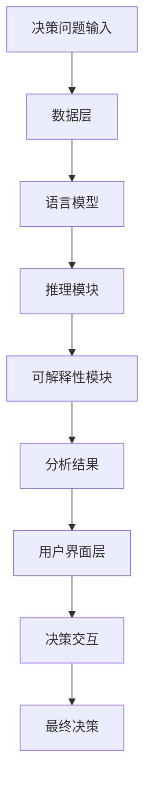

# 语言模型在复杂决策支持系统中的推理能力与可解释性研究

> 关键词：语言模型、复杂决策支持系统、推理能力、可解释性、自然语言处理

> 摘要：本文聚焦于语言模型在复杂决策支持系统中的应用，深入探讨了语言模型的推理能力以及可解释性。首先介绍了研究的背景，包括目的、范围、预期读者和文档结构等内容。接着阐述了核心概念及其联系，通过文本示意图和Mermaid流程图展示了相关架构。详细讲解了核心算法原理，并使用Python源代码进行了说明。同时给出了相关的数学模型和公式，并举例解释。通过项目实战展示了代码的实际案例和详细解读。分析了语言模型在复杂决策支持系统中的实际应用场景。推荐了相关的学习资源、开发工具框架和论文著作。最后总结了未来发展趋势与挑战，并对常见问题进行了解答。

## 1. 背景介绍 
### 1.1 目的和范围
在当今复杂多变的社会和商业环境中，决策的难度和复杂性不断增加。复杂决策支持系统旨在为决策者提供有效的信息和分析，以帮助他们做出更明智的决策。语言模型作为自然语言处理领域的重要成果，具有强大的语言理解和生成能力，为复杂决策支持系统带来了新的机遇和挑战。

本研究的目的在于深入探究语言模型在复杂决策支持系统中的推理能力和可解释性。具体范围包括：分析语言模型在处理复杂决策问题时的推理机制，评估其推理能力的有效性；研究如何提高语言模型在决策过程中的可解释性，以便决策者更好地理解模型的决策依据；探讨语言模型与复杂决策支持系统的集成方法和应用场景。

### 1.2 预期读者
本文的预期读者包括从事自然语言处理、人工智能、决策科学等领域的研究人员和学者，他们可以从本文中获取关于语言模型在复杂决策支持系统中应用的最新研究成果和技术方法。同时，对于开发复杂决策支持系统的工程师和技术人员，本文提供了具体的算法实现和代码示例，有助于他们将语言模型集成到实际系统中。此外，企业的决策者和管理人员也可以通过本文了解语言模型在决策支持方面的潜力和应用价值，为企业的决策提供参考。

### 1.3 文档结构概述
本文将按照以下结构进行组织：
- 核心概念与联系：介绍语言模型、复杂决策支持系统、推理能力和可解释性等核心概念，并阐述它们之间的联系，通过文本示意图和Mermaid流程图展示相关架构。
- 核心算法原理 & 具体操作步骤：详细讲解语言模型在复杂决策支持系统中应用的核心算法原理，使用Python源代码进行说明，并给出具体的操作步骤。
- 数学模型和公式 & 详细讲解 & 举例说明：给出与语言模型推理能力和可解释性相关的数学模型和公式，并进行详细讲解，通过具体例子加深理解。
- 项目实战：代码实际案例和详细解释说明：通过一个实际的项目案例，展示如何将语言模型应用于复杂决策支持系统中，包括开发环境搭建、源代码详细实现和代码解读。
- 实际应用场景：分析语言模型在复杂决策支持系统中的实际应用场景，如医疗决策、金融投资决策、企业战略决策等。
- 工具和资源推荐：推荐相关的学习资源、开发工具框架和论文著作，帮助读者进一步深入学习和研究。
- 总结：未来发展趋势与挑战：总结语言模型在复杂决策支持系统中应用的未来发展趋势，并分析可能面临的挑战。
- 附录：常见问题与解答：对读者可能关心的常见问题进行解答。
- 扩展阅读 & 参考资料：提供相关的扩展阅读材料和参考资料，方便读者进一步探索。

### 1.4 术语表
#### 1.4.1 核心术语定义
- **语言模型**：是一种对自然语言文本进行建模的统计模型，它可以根据输入的文本预测下一个可能出现的单词或字符的概率分布。常见的语言模型包括基于规则的语言模型、统计语言模型和深度学习语言模型（如Transformer架构的语言模型）。
- **复杂决策支持系统**：是一种基于计算机技术和信息技术的系统，旨在帮助决策者处理复杂的决策问题。它通常集成了数据管理、模型分析、知识推理等功能，为决策者提供决策所需的信息和分析结果。
- **推理能力**：指语言模型在处理复杂决策问题时，能够根据已知信息进行逻辑推理和判断，得出合理的结论或建议的能力。
- **可解释性**：是指能够清晰地解释语言模型的决策过程和结果，使决策者能够理解模型是如何得出结论的，以及决策的依据是什么。

#### 1.4.2 相关概念解释
- **自然语言处理（NLP）**：是人工智能的一个重要分支，主要研究如何让计算机理解和处理自然语言。语言模型是自然语言处理中的核心技术之一，用于实现文本生成、机器翻译、问答系统等多种任务。
- **决策科学**：是一门研究决策过程和方法的学科，涉及数学、统计学、运筹学、心理学等多个领域。复杂决策支持系统是决策科学在实际应用中的体现，借助计算机技术和人工智能算法提高决策的效率和质量。

#### 1.4.3 缩略词列表
- **NLP**：Natural Language Processing（自然语言处理）
- **GPT**：Generative Pretrained Transformer（生成式预训练Transformer）
- **BERT**：Bidirectional Encoder Representations from Transformers（基于Transformer的双向编码器表示）

## 2. 核心概念与联系 
### 核心概念原理
#### 语言模型
语言模型的基本原理是基于概率统计，通过学习大量的文本数据，建立单词或字符之间的概率关系。以深度学习语言模型为例，如Transformer架构的语言模型，它通过多层的自注意力机制和前馈神经网络，能够捕捉文本中的长距离依赖关系，从而更准确地预测下一个单词的概率。

例如，对于输入的文本序列 $x_1, x_2, \cdots, x_n$，语言模型的目标是计算下一个单词 $x_{n+1}$ 的概率分布 $P(x_{n+1}|x_1, x_2, \cdots, x_n)$。

#### 复杂决策支持系统
复杂决策支持系统通常由数据层、模型层和用户界面层组成。数据层负责收集和管理与决策相关的数据，包括历史数据、实时数据等。模型层包含各种分析模型和算法，用于对数据进行处理和分析，为决策提供依据。用户界面层则为决策者提供交互界面，方便他们输入决策问题、查看分析结果和做出决策。

#### 推理能力
语言模型的推理能力是指它能够根据已知信息进行逻辑推理和判断的能力。在复杂决策支持系统中，语言模型可以根据决策问题的描述和相关数据，运用逻辑规则和知识进行推理，得出决策建议。例如，在医疗决策中，语言模型可以根据患者的症状、检查结果和医学知识，推理出可能的疾病诊断和治疗方案。

#### 可解释性
可解释性是指能够清晰地解释语言模型的决策过程和结果。在复杂决策支持系统中，可解释性非常重要，因为决策者需要了解模型是如何得出结论的，以及决策的依据是什么。提高语言模型的可解释性可以通过多种方法实现，如特征重要性分析、决策树可视化等。

### 架构的文本示意图
```plaintext
复杂决策支持系统
├── 数据层
│   ├── 历史数据
│   ├── 实时数据
├── 模型层
│   ├── 语言模型
│   │   ├── 推理模块
│   │   ├── 可解释性模块
│   ├── 其他分析模型
├── 用户界面层
│   ├── 决策问题输入
│   ├── 分析结果展示
│   ├── 决策交互
```

### Mermaid流程图


## 3. 核心算法原理 & 具体操作步骤 
### 核心算法原理
在复杂决策支持系统中，语言模型的核心算法主要涉及到文本表示和推理机制。

#### 文本表示
语言模型通常使用词嵌入（Word Embedding）技术将文本中的单词转换为向量表示。常见的词嵌入方法有Word2Vec、GloVe和基于Transformer的预训练模型（如BERT）。以BERT为例，它通过在大规模文本数据上进行无监督学习，学习到单词的上下文相关的向量表示。

以下是使用Python和Hugging Face的`transformers`库实现BERT词嵌入的示例代码：
```python
from transformers import AutoTokenizer, AutoModel
import torch

# 加载预训练的BERT模型和分词器
tokenizer = AutoTokenizer.from_pretrained('bert-base-uncased')
model = AutoModel.from_pretrained('bert-base-uncased')

# 输入文本
text = "This is an example sentence."

# 对文本进行分词
inputs = tokenizer(text, return_tensors='pt')

# 通过BERT模型获取词嵌入
with torch.no_grad():
    outputs = model(**inputs)

# 提取词嵌入
word_embeddings = outputs.last_hidden_state
print(word_embeddings.shape)
```

#### 推理机制
语言模型的推理机制通常基于注意力机制和前馈神经网络。以Transformer架构为例，它通过多头自注意力机制（Multi-Head Self-Attention）捕捉文本中的长距离依赖关系，并通过前馈神经网络进行特征变换和预测。

以下是一个简化的Transformer推理过程的Python代码示例：
```python
import torch
import torch.nn as nn

class MultiHeadSelfAttention(nn.Module):
    def __init__(self, embed_size, num_heads):
        super(MultiHeadSelfAttention, self).__init__()
        self.embed_size = embed_size
        self.num_heads = num_heads
        self.head_dim = embed_size // num_heads

        assert (
            self.head_dim * num_heads == embed_size
        ), "Embedding size needs to be divisible by num_heads"

        self.values = nn.Linear(self.head_dim, self.head_dim, bias=False)
        self.keys = nn.Linear(self.head_dim, self.head_dim, bias=False)
        self.queries = nn.Linear(self.head_dim, self.head_dim, bias=False)
        self.fc_out = nn.Linear(num_heads * self.head_dim, embed_size)

    def forward(self, values, keys, query, mask):
        N = query.shape[0]
        value_len, key_len, query_len = values.shape[1], keys.shape[1], query.shape[1]

        # Split the embedding into self.num_heads different pieces
        values = values.reshape(N, value_len, self.num_heads, self.head_dim)
        keys = keys.reshape(N, key_len, self.num_heads, self.head_dim)
        queries = query.reshape(N, query_len, self.num_heads, self.head_dim)

        values = self.values(values)
        keys = self.keys(keys)
        queries = self.queries(queries)

        # Scaled dot-product attention
        energy = torch.einsum("nqhd,nkhd->nhqk", [queries, keys])
        if mask is not None:
            energy = energy.masked_fill(mask == 0, float("-1e20"))

        attention = torch.softmax(energy / (self.embed_size ** (1 / 2)), dim=3)

        out = torch.einsum("nhql,nlhd->nqhd", [attention, values]).reshape(
            N, query_len, self.num_heads * self.head_dim
        )

        out = self.fc_out(out)
        return out

class TransformerBlock(nn.Module):
    def __init__(self, embed_size, num_heads, dropout, forward_expansion):
        super(TransformerBlock, self).__init__()
        self.attention = MultiHeadSelfAttention(embed_size, num_heads)
        self.norm1 = nn.LayerNorm(embed_size)
        self.norm2 = nn.LayerNorm(embed_size)

        self.feed_forward = nn.Sequential(
            nn.Linear(embed_size, forward_expansion * embed_size),
            nn.ReLU(),
            nn.Linear(forward_expansion * embed_size, embed_size),
        )

        self.dropout = nn.Dropout(dropout)

    def forward(self, value, key, query, mask):
        attention = self.attention(value, key, query, mask)

        # Add skip connection, run through normalization and dropout
        x = self.dropout(self.norm1(attention + query))
        forward = self.feed_forward(x)
        out = self.dropout(self.norm2(forward + x))
        return out

# 示例输入
embed_size = 256
num_heads = 8
dropout = 0.1
forward_expansion = 4
N = 1  # 批量大小
seq_length = 10
input_tensor = torch.randn(N, seq_length, embed_size)
mask = None

# 创建Transformer块
transformer_block = TransformerBlock(embed_size, num_heads, dropout, forward_expansion)

# 进行推理
output = transformer_block(input_tensor, input_tensor, input_tensor, mask)
print(output.shape)
```

### 具体操作步骤
1. **数据准备**：收集与决策问题相关的数据，并进行预处理，包括数据清洗、分词、标注等。
2. **模型选择和加载**：选择合适的语言模型，如BERT、GPT等，并使用相应的库加载预训练模型。
3. **文本表示**：使用词嵌入技术将输入的文本转换为向量表示。
4. **推理过程**：将文本向量输入到语言模型中，通过推理机制进行逻辑推理和判断，得出决策建议。
5. **可解释性分析**：使用特征重要性分析、决策树可视化等方法对模型的决策过程和结果进行解释。

## 4. 数学模型和公式 & 详细讲解 & 举例说明 
### 词嵌入
#### 数学模型和公式
词嵌入的目标是将单词映射到一个低维的向量空间中，使得语义相似的单词在向量空间中距离较近。以Word2Vec的Skip-gram模型为例，它的目标是最大化给定中心词预测上下文词的概率。

设中心词为 $w_c$，上下文词为 $w_o$，则Skip-gram模型的目标函数为：
$$
\max_{\theta} \prod_{t=1}^{T} \prod_{-m \leq j \leq m, j \neq 0} P(w_{t+j}|w_t; \theta)
$$
其中，$T$ 是文本的长度，$m$ 是上下文窗口的大小，$\theta$ 是模型的参数。

$P(w_{o}|w_{c}; \theta)$ 可以通过softmax函数计算：
$$
P(w_{o}|w_{c}; \theta) = \frac{\exp(u_{o}^T v_{c})}{\sum_{w=1}^{V} \exp(u_{w}^T v_{c})}
$$
其中，$u_{o}$ 是上下文词 $w_{o}$ 的向量表示，$v_{c}$ 是中心词 $w_{c}$ 的向量表示，$V$ 是词汇表的大小。

#### 详细讲解
Skip-gram模型通过最大化目标函数来学习单词的向量表示。具体来说，它通过不断调整模型的参数 $\theta$，使得给定中心词预测上下文词的概率最大。在训练过程中，模型会随机选择中心词和上下文词，并计算它们的概率，然后通过反向传播算法更新模型的参数。

#### 举例说明
假设我们有一个简单的文本 “I love natural language processing”，词汇表为 $\{I, love, natural, language, processing\}$，上下文窗口大小 $m = 1$。如果中心词是 “love”，则上下文词可能是 “I” 和 “natural”。模型的目标是最大化 $P(I|love)$ 和 $P(natural|love)$ 的概率。

### 注意力机制
#### 数学模型和公式
注意力机制的核心思想是根据输入的查询向量（query）计算与键向量（key）的相似度，然后根据相似度对值向量（value）进行加权求和。

设查询向量为 $q$，键向量为 $k_i$，值向量为 $v_i$，则注意力分数为：
$$
\text{Attention}(Q, K, V) = \text{softmax}\left(\frac{QK^T}{\sqrt{d_k}}\right)V
$$
其中，$Q$ 是查询矩阵，$K$ 是键矩阵，$V$ 是值矩阵，$d_k$ 是键向量的维度。

#### 详细讲解
注意力机制通过计算查询向量和键向量的相似度，得到每个值向量的权重。然后，根据这些权重对值向量进行加权求和，得到最终的输出。$\frac{1}{\sqrt{d_k}}$ 是为了防止点积结果过大，导致softmax函数的梯度消失。

#### 举例说明
假设我们有一个查询向量 $q = [1, 2]$，键向量 $k_1 = [3, 4]$，$k_2 = [5, 6]$，值向量 $v_1 = [7, 8]$，$v_2 = [9, 10]$。首先计算注意力分数：
$$
\text{Attention}(q, [k_1, k_2], [v_1, v_2]) = \text{softmax}\left(\frac{q[k_1^T, k_2^T]}{\sqrt{2}}\right)[v_1^T, v_2^T]
$$
具体计算过程如下：
$$
q[k_1^T, k_2^T] = [1, 2]\begin{bmatrix}3 & 5\\4 & 6\end{bmatrix} = [11, 17]
$$
$$
\frac{q[k_1^T, k_2^T]}{\sqrt{2}} = \left[\frac{11}{\sqrt{2}}, \frac{17}{\sqrt{2}}\right]
$$
$$
\text{softmax}\left(\frac{q[k_1^T, k_2^T]}{\sqrt{2}}\right) = \left[\frac{\exp(\frac{11}{\sqrt{2}})}{\exp(\frac{11}{\sqrt{2}}) + \exp(\frac{17}{\sqrt{2}})}, \frac{\exp(\frac{17}{\sqrt{2}})}{\exp(\frac{11}{\sqrt{2}}) + \exp(\frac{17}{\sqrt{2}})}\right]
$$
最后根据softmax结果对值向量进行加权求和得到最终输出。

## 5. 项目实战：代码实际案例和详细解释说明 
### 5.1  开发环境搭建
#### 操作系统
建议使用Linux或macOS系统，因为它们对Python和深度学习框架的支持更好。Windows系统也可以使用，但可能会遇到一些兼容性问题。

#### Python环境
安装Python 3.7或更高版本。可以使用Anaconda或Miniconda来管理Python环境，以下是创建和激活虚拟环境的命令：
```bash
conda create -n decision_support python=3.8
conda activate decision_support
```

#### 深度学习框架
安装PyTorch和Hugging Face的`transformers`库，用于加载和使用预训练的语言模型：
```bash
pip install torch
pip install transformers
```

### 5.2  源代码详细实现和代码解读
以下是一个简单的基于BERT的复杂决策支持系统的示例代码，用于对医疗决策问题进行推理和解释：
```python
from transformers import AutoTokenizer, AutoModelForSequenceClassification
import torch

# 加载预训练的BERT模型和分词器
tokenizer = AutoTokenizer.from_pretrained('bert-base-uncased')
model = AutoModelForSequenceClassification.from_pretrained('bert-base-uncased', num_labels=3)

# 定义决策问题和选项
decision_problem = "患者出现发热、咳嗽症状，可能的疾病是什么？"
options = ["感冒", "流感", "肺炎"]

# 对每个选项进行编码
inputs = []
for option in options:
    input_text = f"{decision_problem} {option}"
    input_encoding = tokenizer(input_text, return_tensors='pt')
    inputs.append(input_encoding)

# 进行推理
outputs = []
for input_encoding in inputs:
    with torch.no_grad():
        output = model(**input_encoding)
        logits = output.logits
        probabilities = torch.softmax(logits, dim=1)
        outputs.append(probabilities)

# 选择概率最大的选项作为决策结果
max_prob_index = torch.argmax(torch.cat(outputs), dim=0).item()
decision_result = options[max_prob_index]

# 可解释性分析：简单的特征重要性分析
# 这里我们可以使用梯度计算特征重要性，但为了简化，我们只打印输入文本
print("决策问题：", decision_problem)
print("选项：", options)
print("决策结果：", decision_result)
print("输入文本：")
for option in options:
    input_text = f"{decision_problem} {option}"
    print(input_text)
```

### 5.3  代码解读与分析
1. **模型加载**：使用`AutoTokenizer`和`AutoModelForSequenceClassification`加载预训练的BERT模型和分词器。`num_labels=3`表示有3个分类选项。
2. **数据编码**：将决策问题和每个选项组合成一个输入文本，然后使用分词器对输入文本进行编码。
3. **推理过程**：将编码后的输入文本输入到模型中，通过`model(**input_encoding)`进行推理，得到logits。然后使用`torch.softmax`函数将logits转换为概率分布。
4. **决策结果选择**：选择概率最大的选项作为决策结果。
5. **可解释性分析**：这里我们只是简单地打印输入文本，实际应用中可以使用梯度计算特征重要性，如通过计算输入文本中每个单词的梯度来确定哪些单词对决策结果影响最大。

## 6. 实际应用场景 
### 医疗决策
在医疗领域，语言模型可以帮助医生进行疾病诊断和治疗方案选择。例如，根据患者的症状、检查结果和医学知识，语言模型可以推理出可能的疾病诊断，并提供相应的治疗建议。同时，可解释性可以帮助医生理解模型的决策依据，提高诊断的准确性和可靠性。

### 金融投资决策
在金融投资领域，语言模型可以分析市场动态、公司财务报表和新闻资讯等信息，为投资者提供投资建议。通过推理能力，语言模型可以预测股票价格走势、评估投资风险等。可解释性可以让投资者了解模型是如何得出投资建议的，从而做出更明智的投资决策。

### 企业战略决策
在企业战略决策中，语言模型可以分析市场趋势、竞争对手信息和企业内部数据等，为企业管理层提供战略建议。例如，帮助企业确定市场定位、产品研发方向和营销策略等。可解释性可以让管理层理解模型的决策逻辑，增强决策的信心。

## 7. 工具和资源推荐
### 7.1 学习资源推荐
#### 7.1.1 书籍推荐
- 《深度学习》（Deep Learning）：由Ian Goodfellow、Yoshua Bengio和Aaron Courville撰写，是深度学习领域的经典教材，涵盖了神经网络、卷积神经网络、循环神经网络等内容。
- 《自然语言处理入门》（Natural Language Processing with Python）：由Steven Bird、Ewan Klein和Edward Loper撰写，介绍了使用Python进行自然语言处理的基础知识和方法。
- 《决策科学》（Decision Science）：介绍了决策过程、决策模型和决策方法等内容，对于理解复杂决策支持系统有很大帮助。

#### 7.1.2 在线课程
- Coursera上的“深度学习专项课程”（Deep Learning Specialization）：由Andrew Ng教授授课，涵盖了深度学习的各个方面，包括神经网络、卷积神经网络、循环神经网络等。
- edX上的“自然语言处理基础”（Foundations of Natural Language Processing）：介绍了自然语言处理的基本概念和方法，包括词法分析、句法分析、语义分析等。
- Udemy上的“复杂决策支持系统实战”（Practical Complex Decision Support Systems）：通过实际案例介绍了如何开发和应用复杂决策支持系统。

#### 7.1.3 技术博客和网站
- Hugging Face博客（https://huggingface.co/blog）：提供了关于自然语言处理和深度学习的最新研究成果和技术应用。
- Towards Data Science（https://towardsdatascience.com）：有很多关于数据科学、机器学习和自然语言处理的高质量文章。
- arXiv（https://arxiv.org）：是一个预印本平台，提供了大量的学术论文，包括自然语言处理和决策科学领域的最新研究成果。

### 7.2 开发工具框架推荐
#### 7.2.1 IDE和编辑器
- PyCharm：是一款专门为Python开发设计的集成开发环境（IDE），具有代码编辑、调试、代码分析等功能。
- Jupyter Notebook：是一个交互式的开发环境，适合进行数据探索、模型实验和代码演示。
- Visual Studio Code：是一款轻量级的代码编辑器，支持多种编程语言和插件，具有丰富的扩展功能。

#### 7.2.2 调试和性能分析工具
- PyTorch Profiler：是PyTorch提供的性能分析工具，可以帮助开发者分析模型的性能瓶颈，优化代码。
- TensorBoard：是TensorFlow提供的可视化工具，也可以用于PyTorch模型的可视化和性能分析。
- cProfile：是Python标准库中的性能分析工具，可以分析Python代码的执行时间和函数调用次数。

#### 7.2.3 相关框架和库
- PyTorch：是一个开源的深度学习框架，提供了丰富的神经网络层和优化算法，支持GPU加速。
- Hugging Face的`transformers`库：提供了预训练的语言模型和相关工具，方便开发者使用和微调语言模型。
- Scikit-learn：是一个开源的机器学习库，提供了各种机器学习算法和工具，如分类、回归、聚类等。

### 7.3 相关论文著作推荐
#### 7.3.1 经典论文
- “Attention Is All You Need”：介绍了Transformer架构，是自然语言处理领域的重要论文，为后续的语言模型发展奠定了基础。
- “BERT: Pre-training of Deep Bidirectional Transformers for Language Understanding”：提出了BERT模型，通过双向预训练的方式提高了语言模型的性能。
- “Generative Pretrained Transformer 3 (GPT-3): Language Models are Few-Shot Learners”：介绍了GPT-3模型，展示了大规模语言模型在少样本学习方面的强大能力。

#### 7.3.2 最新研究成果
- 关注arXiv上关于自然语言处理和决策科学的最新论文，了解领域内的最新研究动态。
- 参加相关的学术会议，如ACL（Association for Computational Linguistics）、NeurIPS（Neural Information Processing Systems）等，获取最新的研究成果和技术应用。

#### 7.3.3 应用案例分析
- 一些知名企业和研究机构会发布语言模型在实际应用中的案例分析，如谷歌、微软、OpenAI等。可以通过他们的官方网站和博客获取相关信息。

## 8. 总结：未来发展趋势与挑战
### 未来发展趋势
- **更强的推理能力**：未来的语言模型将不断提高推理能力，能够处理更加复杂的决策问题。例如，结合知识图谱和逻辑推理技术，实现更精确的推理和判断。
- **更高的可解释性**：可解释性将成为语言模型发展的重要方向。通过开发新的可解释性方法和技术，让决策者更好地理解模型的决策过程和结果。
- **多模态融合**：语言模型将与图像、音频等多模态数据进行融合，提供更全面的决策支持。例如，在医疗决策中，结合患者的影像数据和病历文本进行综合分析。
- **个性化决策支持**：根据决策者的个人偏好和历史决策数据，提供个性化的决策建议，提高决策的满意度和效果。

### 挑战
- **数据质量和隐私问题**：语言模型的训练需要大量高质量的数据，但数据的收集和标注存在一定的困难，同时还涉及到数据隐私和安全问题。
- **计算资源和效率**：大规模语言模型的训练和推理需要大量的计算资源，如何提高计算效率和降低成本是一个挑战。
- **可解释性与性能的平衡**：提高语言模型的可解释性可能会牺牲一定的性能，如何在可解释性和性能之间找到平衡是一个需要解决的问题。
- **伦理和法律问题**：语言模型在决策支持中的应用可能会带来一些伦理和法律问题，如偏见、歧视等，需要建立相应的伦理和法律规范。

## 9. 附录：常见问题与解答
### 语言模型在复杂决策支持系统中的推理能力与传统决策模型有什么区别？
传统决策模型通常基于数学模型和算法，如线性规划、决策树等，需要明确的规则和假设。而语言模型的推理能力基于自然语言理解和生成，能够处理非结构化的文本数据，并且可以从大量的文本中学习知识和模式。语言模型的推理更加灵活和自适应，但也可能存在一定的不确定性。

### 如何提高语言模型在复杂决策支持系统中的可解释性？
可以通过以下方法提高语言模型的可解释性：
- **特征重要性分析**：计算输入文本中每个单词或特征对决策结果的重要性，如使用梯度计算或注意力分数。
- **决策树可视化**：将语言模型的决策过程转换为决策树的形式，直观地展示决策逻辑。
- **规则提取**：从语言模型中提取规则，解释模型的决策依据。
- **示例解释**：提供一些具体的示例来解释模型的决策结果。

### 语言模型在复杂决策支持系统中的应用有哪些局限性？
语言模型在复杂决策支持系统中的应用存在以下局限性：
- **数据依赖**：语言模型的性能高度依赖于训练数据的质量和数量，如果数据存在偏差或不足，可能会导致模型的决策结果不准确。
- **语义理解的局限性**：虽然语言模型在自然语言处理方面取得了很大进展，但对于一些复杂的语义理解和推理任务，仍然存在一定的局限性。
- **缺乏领域知识**：语言模型通常是在大规模的通用文本数据上进行训练的，对于特定领域的知识可能了解不足，需要结合领域知识进行补充和改进。
- **可解释性的挑战**：如前所述，提高语言模型的可解释性是一个挑战，目前的方法还不够完善。

## 10. 扩展阅读 & 参考资料
- 《自然语言处理：理论与实践》
- 《人工智能：一种现代的方法》
- https://www.nature.com/
- https://science.sciencemag.org/

作者：AI天才研究院/AI Genius Institute & 禅与计算机程序设计艺术 /Zen And The Art of Computer Programming