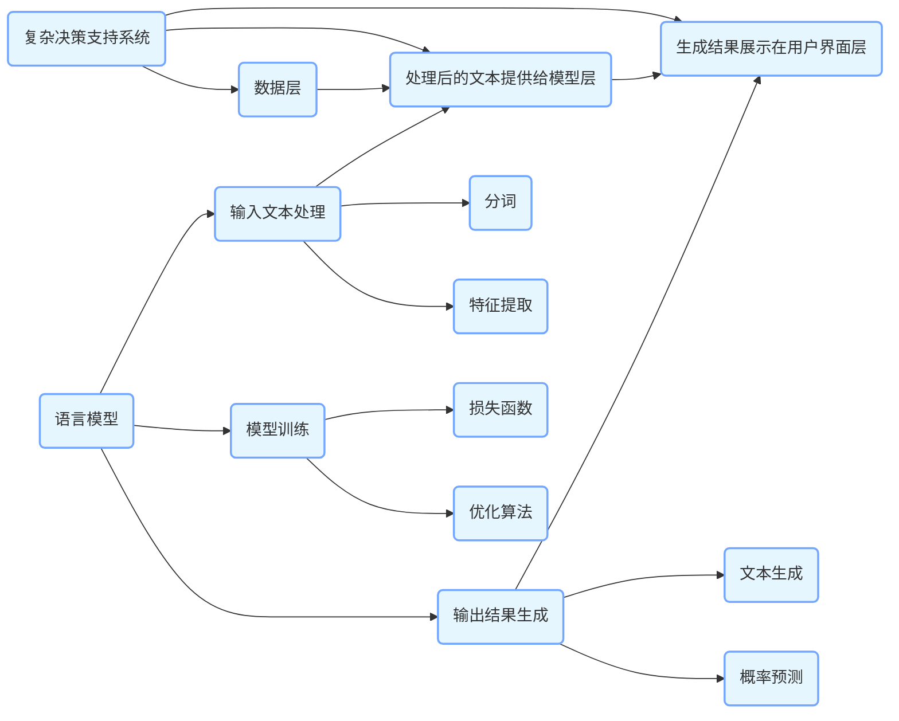

# 语言模型在复杂决策支持系统中的能力提升

> 关键词：语言模型、复杂决策支持系统、能力提升、自然语言处理、机器学习

> 摘要：本文围绕语言模型在复杂决策支持系统中的能力提升展开深入探讨。首先介绍了相关背景，包括研究目的、预期读者、文档结构和术语定义。接着阐述了核心概念及其联系，通过文本示意图和 Mermaid 流程图清晰展示。详细讲解了核心算法原理和具体操作步骤，结合 Python 源代码进行说明。深入分析了数学模型和公式，并举例说明。通过项目实战给出代码实际案例及详细解释。探讨了语言模型在复杂决策支持系统中的实际应用场景，推荐了相关的学习资源、开发工具框架和论文著作。最后总结了未来发展趋势与挑战，还提供了常见问题解答和扩展阅读参考资料，旨在为提升语言模型在复杂决策支持系统中的应用能力提供全面且深入的指导。

## 1. 背景介绍 
### 1.1 目的和范围
在当今复杂多变的社会和经济环境中，决策过程面临着海量的数据、多元的信息和高度的不确定性。复杂决策支持系统旨在为决策者提供有效的工具和方法，辅助其做出科学、合理的决策。而语言模型作为自然语言处理领域的重要技术，具有强大的语言理解和生成能力。本研究的目的在于探讨如何提升语言模型在复杂决策支持系统中的能力，以更好地处理决策过程中的自然语言信息，为决策者提供更准确、全面的支持。

研究范围涵盖了语言模型的基本原理、复杂决策支持系统的特点和需求，以及两者相结合的技术和方法。同时，通过实际案例分析和实验验证，评估语言模型在复杂决策支持系统中的应用效果，并提出进一步提升其能力的策略和建议。

### 1.2 预期读者
本文预期读者包括自然语言处理领域的研究人员、复杂决策支持系统的开发者、相关行业的决策者以及对人工智能技术在决策领域应用感兴趣的爱好者。对于研究人员，本文提供了语言模型在复杂决策支持系统中应用的前沿研究思路和方法；对于开发者，可从中获取实际开发过程中的技术指导和代码示例；对于决策者，有助于理解语言模型如何辅助决策过程，提高决策的科学性和效率；对于爱好者，能帮助其了解这一领域的基本概念和发展趋势。

### 1.3 文档结构概述
本文共分为十个部分。第一部分为背景介绍，阐述了研究的目的、范围、预期读者和文档结构。第二部分介绍核心概念与联系，包括语言模型和复杂决策支持系统的基本原理，以及它们之间的关系，并通过文本示意图和 Mermaid 流程图进行展示。第三部分详细讲解核心算法原理和具体操作步骤，结合 Python 源代码进行说明。第四部分分析数学模型和公式，并举例说明其在语言模型和决策支持中的应用。第五部分通过项目实战，给出代码实际案例和详细解释。第六部分探讨语言模型在复杂决策支持系统中的实际应用场景。第七部分推荐相关的学习资源、开发工具框架和论文著作。第八部分总结未来发展趋势与挑战。第九部分为附录，提供常见问题与解答。第十部分列出扩展阅读和参考资料。

### 1.4 术语表
#### 1.4.1 核心术语定义
- **语言模型（Language Model）**：是一种对自然语言文本进行概率建模的模型，用于预测文本中下一个词或字符的概率分布。常见的语言模型包括基于统计的语言模型和基于深度学习的语言模型，如循环神经网络（RNN）、长短期记忆网络（LSTM）和 Transformer 架构的模型。
- **复杂决策支持系统（Complex Decision Support System）**：是一种基于计算机技术的系统，旨在帮助决策者处理复杂的决策问题。它集成了多种数据、模型和方法，能够对决策问题进行分析、评估和预测，为决策者提供决策建议和支持。
- **自然语言处理（Natural Language Processing, NLP）**：是人工智能领域的一个重要分支，主要研究如何让计算机理解、处理和生成自然语言。自然语言处理技术包括文本分类、情感分析、机器翻译、信息抽取等。

#### 1.4.2 相关概念解释
- **概率建模**：在语言模型中，概率建模是指通过对大量文本数据的学习，估计文本中不同词或字符出现的概率。这种概率估计可以用于预测下一个词的可能性，从而实现文本生成和语言理解等任务。
- **决策分析**：在复杂决策支持系统中，决策分析是指对决策问题进行系统的分析和评估，包括确定决策目标、收集和分析相关信息、评估不同决策方案的优劣等。决策分析的目的是为决策者提供科学的决策依据。
- **深度学习**：是一种基于人工神经网络的机器学习方法，具有强大的特征学习和模式识别能力。深度学习在自然语言处理领域取得了显著的成果，许多先进的语言模型都是基于深度学习技术构建的。

#### 1.4.3 缩略词列表
- **RNN**：Recurrent Neural Network，循环神经网络
- **LSTM**：Long Short-Term Memory，长短期记忆网络
- **NLP**：Natural Language Processing，自然语言处理
- **DSS**：Decision Support System，决策支持系统

## 2. 核心概念与联系 
### 核心概念原理
#### 语言模型原理
语言模型的核心目标是对自然语言文本的概率分布进行建模。给定一个文本序列 $w_1, w_2, \cdots, w_n$，语言模型的任务是计算该序列出现的概率 $P(w_1, w_2, \cdots, w_n)$。根据链式法则，这个概率可以分解为：

$$P(w_1, w_2, \cdots, w_n) = P(w_1)P(w_2|w_1)P(w_3|w_1, w_2) \cdots P(w_n|w_1, w_2, \cdots, w_{n-1})$$

在实际应用中，为了简化计算，通常采用 $n$-gram 模型或基于神经网络的语言模型。$n$-gram 模型假设当前词的出现只与前 $n-1$ 个词有关，即：

$$P(w_i|w_1, w_2, \cdots, w_{i-1}) \approx P(w_i|w_{i-n+1}, w_{i-n+2}, \cdots, w_{i-1})$$

基于神经网络的语言模型，如 Transformer 架构的模型，通过多层的注意力机制和前馈神经网络，能够更好地捕捉文本中的长距离依赖关系，从而提高语言建模的性能。

#### 复杂决策支持系统原理
复杂决策支持系统通常由数据层、模型层和用户界面层组成。数据层负责收集、存储和管理与决策相关的数据，包括历史数据、实时数据和外部数据等。模型层包含各种决策模型和算法，如预测模型、优化模型、评价模型等，用于对数据进行分析和处理，生成决策建议。用户界面层则为决策者提供友好的交互界面，方便其输入决策问题、查看分析结果和选择决策方案。

### 架构的文本示意图
```plaintext
+---------------------+
| 复杂决策支持系统    |
| +-----------------+ |
| | 数据层          | |
| |  - 数据收集     | |
| |  - 数据存储     | |
| |  - 数据管理     | |
| +-----------------+ |
| +-----------------+ |
| | 模型层          | |
| |  - 预测模型     | |
| |  - 优化模型     | |
| |  - 评价模型     | |
| +-----------------+ |
| +-----------------+ |
| | 用户界面层      | |
| |  - 交互界面     | |
| |  - 结果展示     | |
| +-----------------+ |
+---------------------+
| 语言模型            |
| +-----------------+ |
| | 输入文本处理    | |
| |  - 分词         | |
| |  - 特征提取     | |
| +-----------------+ |
| +-----------------+ |
| | 模型训练        | |
| |  - 损失函数     | |
| |  - 优化算法     | |
| +-----------------+ |
| +-----------------+ |
| | 输出结果生成    | |
| |  - 文本生成     | |
| |  - 概率预测     | |
| +-----------------+ |
+---------------------+
```

### Mermaid 流程图


## 3. 核心算法原理 & 具体操作步骤 
### 核心算法原理
在语言模型中，Transformer 架构是目前最先进的算法之一。Transformer 架构主要由编码器（Encoder）和解码器（Decoder）组成，其中编码器用于对输入的文本进行特征提取，解码器用于生成输出文本。

#### 编码器
编码器由多个相同的编码层堆叠而成，每个编码层包含多头自注意力机制（Multi-Head Self-Attention）和前馈神经网络（Feed-Forward Neural Network）。多头自注意力机制允许模型在不同的表示子空间中并行地关注输入序列的不同部分，从而捕捉文本中的长距离依赖关系。前馈神经网络则对多头自注意力机制的输出进行非线性变换，增强模型的表达能力。

#### 解码器
解码器也由多个相同的解码层堆叠而成，每个解码层包含多头自注意力机制、编码器 - 解码器注意力机制（Encoder-Decoder Attention）和前馈神经网络。编码器 - 解码器注意力机制允许解码器在生成输出序列时，关注编码器的输出，从而利用输入序列的信息。

### 具体操作步骤
#### 步骤 1：数据预处理
首先，需要对输入的文本数据进行预处理，包括分词、构建词汇表和将文本转换为数字序列。以下是使用 Python 和 `torchtext` 库进行数据预处理的示例代码：

```python
import torch
from torchtext.data.utils import get_tokenizer
from torchtext.vocab import build_vocab_from_iterator

# 定义分词器
tokenizer = get_tokenizer('basic_english')

# 示例文本数据
train_texts = ['This is a sample sentence.', 'Another sample sentence here.']

# 分词并构建词汇表
def yield_tokens(texts):
    for text in texts:
        yield tokenizer(text)

vocab = build_vocab_from_iterator(yield_tokens(train_texts), specials=['<unk>'])
vocab.set_default_index(vocab['<unk>'])

# 将文本转换为数字序列
def text_pipeline(x):
    return vocab(tokenizer(x))

# 测试文本转换
sample_text = 'This is a test.'
input_ids = text_pipeline(sample_text)
print(input_ids)
```

#### 步骤 2：模型构建
接下来，使用 PyTorch 构建 Transformer 模型。以下是一个简化的 Transformer 模型实现：

```python
import torch
import torch.nn as nn

class TransformerModel(nn.Module):
    def __init__(self, ntoken, ninp, nhead, nhid, nlayers, dropout=0.5):
        super(TransformerModel, self).__init__()
        self.model_type = 'Transformer'
        self.src_mask = None
        self.pos_encoder = PositionalEncoding(ninp, dropout)
        encoder_layers = nn.TransformerEncoderLayer(ninp, nhead, nhid, dropout)
        self.transformer_encoder = nn.TransformerEncoder(encoder_layers, nlayers)
        self.encoder = nn.Embedding(ntoken, ninp)
        self.ninp = ninp
        self.decoder = nn.Linear(ninp, ntoken)

        self.init_weights()

    def _generate_square_subsequent_mask(self, sz):
        mask = (torch.triu(torch.ones(sz, sz)) == 1).transpose(0, 1)
        mask = mask.float().masked_fill(mask == 0, float('-inf')).masked_fill(mask == 1, float(0.0))
        return mask

    def init_weights(self):
        initrange = 0.1
        self.encoder.weight.data.uniform_(-initrange, initrange)
        self.decoder.bias.data.zero_()
        self.decoder.weight.data.uniform_(-initrange, initrange)

    def forward(self, src):
        if self.src_mask is None or self.src_mask.size(0)!= len(src):
            device = src.device
            mask = self._generate_square_subsequent_mask(len(src)).to(device)
            self.src_mask = mask

        src = self.encoder(src) * math.sqrt(self.ninp)
        src = self.pos_encoder(src)
        output = self.transformer_encoder(src, self.src_mask)
        output = self.decoder(output)
        return output

class PositionalEncoding(nn.Module):
    def __init__(self, d_model, dropout=0.1, max_len=5000):
        super(PositionalEncoding, self).__init__()
        self.dropout = nn.Dropout(p=dropout)

        pe = torch.zeros(max_len, d_model)
        position = torch.arange(0, max_len, dtype=torch.float).unsqueeze(1)
        div_term = torch.exp(torch.arange(0, d_model, 2).float() * (-math.log(10000.0) / d_model))
        pe[:, 0::2] = torch.sin(position * div_term)
        pe[:, 1::2] = torch.cos(position * div_term)
        pe = pe.unsqueeze(0).transpose(0, 1)
        self.register_buffer('pe', pe)

    def forward(self, x):
        x = x + self.pe[:x.size(0), :]
        return self.dropout(x)
```

#### 步骤 3：模型训练
使用训练数据对构建好的模型进行训练。以下是一个简单的训练循环示例：

```python
import torch.optim as optim
import math

# 定义模型参数
ntokens = len(vocab)
emsize = 200
nhid = 200
nlayers = 2
nhead = 2
dropout = 0.2
model = TransformerModel(ntokens, emsize, nhead, nhid, nlayers, dropout)

# 定义损失函数和优化器
criterion = nn.CrossEntropyLoss()
lr = 5.0
optimizer = optim.SGD(model.parameters(), lr=lr)
scheduler = optim.lr_scheduler.StepLR(optimizer, 1.0, gamma=0.95)

# 训练循环
epochs = 10
for epoch in range(epochs):
    model.train()
    total_loss = 0
    for input_ids in [input_ids]:
        input_ids = torch.tensor(input_ids).unsqueeze(1)
        optimizer.zero_grad()
        output = model(input_ids)
        loss = criterion(output.view(-1, ntokens), input_ids.view(-1))
        loss.backward()
        torch.nn.utils.clip_grad_norm_(model.parameters(), 0.5)
        optimizer.step()
        total_loss += loss.item()
    print(f'Epoch {epoch+1}/{epochs}, Loss: {total_loss}')
    scheduler.step()
```

#### 步骤 4：模型推理
训练完成后，可以使用模型进行推理，生成文本或预测概率。以下是一个简单的推理示例：

```python
model.eval()
with torch.no_grad():
    input_ids = text_pipeline('This is')
    input_ids = torch.tensor(input_ids).unsqueeze(1)
    output = model(input_ids)
    predicted_token_id = torch.argmax(output[-1]).item()
    predicted_token = vocab.lookup_token(predicted_token_id)
    print(f'Predicted token: {predicted_token}')
```

## 4. 数学模型和公式 & 详细讲解 & 举例说明 
### 自注意力机制数学模型
自注意力机制是 Transformer 架构的核心组件之一，其数学模型可以用以下公式表示：

#### 计算查询（Query）、键（Key）和值（Value）
给定输入序列 $X = [x_1, x_2, \cdots, x_n]$，其中 $x_i \in \mathbb{R}^d$ 表示第 $i$ 个输入向量，$d$ 是向量的维度。通过三个线性变换矩阵 $W^Q \in \mathbb{R}^{d \times d_k}$、$W^K \in \mathbb{R}^{d \times d_k}$ 和 $W^V \in \mathbb{R}^{d \times d_v}$，分别计算查询、键和值：

$$Q = XW^Q \in \mathbb{R}^{n \times d_k}$$
$$K = XW^K \in \mathbb{R}^{n \times d_k}$$
$$V = XW^V \in \mathbb{R}^{n \times d_v}$$

其中，$d_k$ 和 $d_v$ 分别是查询、键和值的维度。

#### 计算注意力分数
计算查询和键之间的点积，得到注意力分数：

$$AttentionScore = QK^T \in \mathbb{R}^{n \times n}$$

为了防止点积结果过大，通常会对注意力分数进行缩放：

$$ScaledAttentionScore = \frac{AttentionScore}{\sqrt{d_k}}$$

#### 应用掩码（可选）
在某些情况下，需要对注意力分数应用掩码，以防止模型关注到未来的信息。掩码通常是一个上三角矩阵，将掩码位置的值设置为负无穷大：

$$MaskedAttentionScore = ScaledAttentionScore + Mask$$

#### 计算注意力权重
对掩码后的注意力分数应用 softmax 函数，得到注意力权重：

$$AttentionWeights = softmax(MaskedAttentionScore) \in \mathbb{R}^{n \times n}$$

#### 计算输出
将注意力权重与值相乘，得到自注意力机制的输出：

$$Output = AttentionWeightsV \in \mathbb{R}^{n \times d_v}$$

### 详细讲解
自注意力机制的核心思想是通过计算输入序列中不同位置之间的相关性，为每个位置分配不同的权重，从而让模型能够更好地捕捉文本中的长距离依赖关系。具体来说，查询表示当前位置需要关注的信息，键表示其他位置的信息，值表示其他位置的特征。通过计算查询和键之间的相似度（点积），可以得到每个位置对当前位置的重要性，即注意力权重。最后，将注意力权重与值相乘，得到当前位置的输出。

### 举例说明
假设输入序列 $X = [x_1, x_2, x_3]$，其中 $x_i \in \mathbb{R}^4$，$d_k = d_v = 2$。线性变换矩阵 $W^Q$、$W^K$ 和 $W^V$ 分别为：

$$W^Q = \begin{bmatrix}
1 & 0 \\
0 & 1 \\
0 & 0 \\
0 & 0
\end{bmatrix},
W^K = \begin{bmatrix}
1 & 0 \\
0 & 1 \\
0 & 0 \\
0 & 0
\end{bmatrix},
W^V = \begin{bmatrix}
1 & 0 \\
0 & 1 \\
0 & 0 \\
0 & 0
\end{bmatrix}$$

计算查询、键和值：

$$Q = XW^Q = \begin{bmatrix}
x_{11} & x_{12} \\
x_{21} & x_{22} \\
x_{31} & x_{32}
\end{bmatrix},
K = XW^K = \begin{bmatrix}
x_{11} & x_{12} \\
x_{21} & x_{22} \\
x_{31} & x_{32}
\end{bmatrix},
V = XW^V = \begin{bmatrix}
x_{11} & x_{12} \\
x_{21} & x_{22} \\
x_{31} & x_{32}
\end{bmatrix}$$

计算注意力分数：

$$AttentionScore = QK^T = \begin{bmatrix}
x_{11}^2 + x_{12}^2 & x_{11}x_{21} + x_{12}x_{22} & x_{11}x_{31} + x_{12}x_{32} \\
x_{21}x_{11} + x_{22}x_{12} & x_{21}^2 + x_{22}^2 & x_{21}x_{31} + x_{22}x_{32} \\
x_{31}x_{11} + x_{32}x_{12} & x_{31}x_{21} + x_{32}x_{22} & x_{31}^2 + x_{32}^2
\end{bmatrix}$$

假设 $d_k = 2$，则缩放后的注意力分数为：

$$ScaledAttentionScore = \frac{AttentionScore}{\sqrt{2}}$$

应用 softmax 函数得到注意力权重：

$$AttentionWeights = softmax(ScaledAttentionScore)$$

最后，计算输出：

$$Output = AttentionWeightsV$$

## 5. 项目实战：代码实际案例和详细解释说明 
### 5.1  开发环境搭建
#### 安装 Python
首先，确保你已经安装了 Python 3.6 或更高版本。可以从 Python 官方网站（https://www.python.org/downloads/）下载并安装适合你操作系统的 Python 版本。

#### 创建虚拟环境
为了避免不同项目之间的依赖冲突，建议使用虚拟环境。可以使用 `venv` 模块创建虚拟环境：

```bash
python -m venv myenv
```

激活虚拟环境：

- 在 Windows 上：
```bash
myenv\Scripts\activate
```

- 在 Linux 或 macOS 上：
```bash
source myenv/bin/activate
```

#### 安装必要的库
在虚拟环境中，使用 `pip` 安装必要的库，包括 PyTorch、torchtext 等：

```bash
pip install torch torchtext
```

### 5.2  源代码详细实现和代码解读
以下是一个完整的项目实战代码示例，用于训练一个简单的 Transformer 语言模型，并进行文本生成：

```python
import torch
import torch.nn as nn
import torch.optim as optim
import math
from torchtext.data.utils import get_tokenizer
from torchtext.vocab import build_vocab_from_iterator

# 定义分词器
tokenizer = get_tokenizer('basic_english')

# 示例文本数据
train_texts = ['This is a sample sentence.', 'Another sample sentence here.']

# 分词并构建词汇表
def yield_tokens(texts):
    for text in texts:
        yield tokenizer(text)

vocab = build_vocab_from_iterator(yield_tokens(train_texts), specials=['<unk>'])
vocab.set_default_index(vocab['<unk>'])

# 将文本转换为数字序列
def text_pipeline(x):
    return vocab(tokenizer(x))

# 定义 PositionalEncoding 类
class PositionalEncoding(nn.Module):
    def __init__(self, d_model, dropout=0.1, max_len=5000):
        super(PositionalEncoding, self).__init__()
        self.dropout = nn.Dropout(p=dropout)

        pe = torch.zeros(max_len, d_model)
        position = torch.arange(0, max_len, dtype=torch.float).unsqueeze(1)
        div_term = torch.exp(torch.arange(0, d_model, 2).float() * (-math.log(10000.0) / d_model))
        pe[:, 0::2] = torch.sin(position * div_term)
        pe[:, 1::2] = torch.cos(position * div_term)
        pe = pe.unsqueeze(0).transpose(0, 1)
        self.register_buffer('pe', pe)

    def forward(self, x):
        x = x + self.pe[:x.size(0), :]
        return self.dropout(x)

# 定义 Transformer 模型
class TransformerModel(nn.Module):
    def __init__(self, ntoken, ninp, nhead, nhid, nlayers, dropout=0.5):
        super(TransformerModel, self).__init__()
        self.model_type = 'Transformer'
        self.src_mask = None
        self.pos_encoder = PositionalEncoding(ninp, dropout)
        encoder_layers = nn.TransformerEncoderLayer(ninp, nhead, nhid, dropout)
        self.transformer_encoder = nn.TransformerEncoder(encoder_layers, nlayers)
        self.encoder = nn.Embedding(ntoken, ninp)
        self.ninp = ninp
        self.decoder = nn.Linear(ninp, ntoken)

        self.init_weights()

    def _generate_square_subsequent_mask(self, sz):
        mask = (torch.triu(torch.ones(sz, sz)) == 1).transpose(0, 1)
        mask = mask.float().masked_fill(mask == 0, float('-inf')).masked_fill(mask == 1, float(0.0))
        return mask

    def init_weights(self):
        initrange = 0.1
        self.encoder.weight.data.uniform_(-initrange, initrange)
        self.decoder.bias.data.zero_()
        self.decoder.weight.data.uniform_(-initrange, initrange)

    def forward(self, src):
        if self.src_mask is None or self.src_mask.size(0)!= len(src):
            device = src.device
            mask = self._generate_square_subsequent_mask(len(src)).to(device)
            self.src_mask = mask

        src = self.encoder(src) * math.sqrt(self.ninp)
        src = self.pos_encoder(src)
        output = self.transformer_encoder(src, self.src_mask)
        output = self.decoder(output)
        return output

# 定义模型参数
ntokens = len(vocab)
emsize = 200
nhid = 200
nlayers = 2
nhead = 2
dropout = 0.2
model = TransformerModel(ntokens, emsize, nhead, nhid, nlayers, dropout)

# 定义损失函数和优化器
criterion = nn.CrossEntropyLoss()
lr = 5.0
optimizer = optim.SGD(model.parameters(), lr=lr)
scheduler = optim.lr_scheduler.StepLR(optimizer, 1.0, gamma=0.95)

# 训练循环
epochs = 10
for epoch in range(epochs):
    model.train()
    total_loss = 0
    for input_text in train_texts:
        input_ids = text_pipeline(input_text)
        input_ids = torch.tensor(input_ids).unsqueeze(1)
        optimizer.zero_grad()
        output = model(input_ids)
        loss = criterion(output.view(-1, ntokens), input_ids.view(-1))
        loss.backward()
        torch.nn.utils.clip_grad_norm_(model.parameters(), 0.5)
        optimizer.step()
        total_loss += loss.item()
    print(f'Epoch {epoch+1}/{epochs}, Loss: {total_loss}')
    scheduler.step()

# 模型推理
model.eval()
with torch.no_grad():
    input_text = 'This is'
    input_ids = text_pipeline(input_text)
    input_ids = torch.tensor(input_ids).unsqueeze(1)
    output = model(input_ids)
    predicted_token_id = torch.argmax(output[-1]).item()
    predicted_token = vocab.lookup_token(predicted_token_id)
    print(f'Predicted token: {predicted_token}')
```

### 5.3  代码解读与分析
#### 数据预处理部分
- `tokenizer`：使用 `torchtext` 提供的 `basic_english` 分词器对文本进行分词。
- `yield_tokens`：生成器函数，用于将文本数据分词后逐个返回。
- `vocab`：使用 `build_vocab_from_iterator` 函数根据分词后的文本数据构建词汇表，并添加特殊标记 `<unk>` 表示未知词。
- `text_pipeline`：将输入的文本转换为数字序列，方便模型处理。

#### 模型定义部分
- `PositionalEncoding`：用于为输入序列添加位置编码，以帮助模型捕捉序列中的位置信息。
- `TransformerModel`：定义了一个简单的 Transformer 语言模型，包括编码器和线性解码器。`_generate_square_subsequent_mask` 函数用于生成掩码，防止模型关注到未来的信息。

#### 训练部分
- `criterion`：使用交叉熵损失函数计算模型的损失。
- `optimizer`：使用随机梯度下降（SGD）优化器更新模型的参数。
- `scheduler`：使用学习率调度器，在每个 epoch 后调整学习率。
- 训练循环：遍历训练数据，计算损失，反向传播并更新模型参数。

#### 推理部分
- 将输入文本转换为数字序列，输入到模型中进行推理。
- 使用 `torch.argmax` 函数选择概率最大的词作为预测结果，并将其转换为对应的文本。

## 6. 实际应用场景 
### 金融决策支持
在金融领域，语言模型可以用于分析新闻、报告和社交媒体等文本数据，帮助投资者做出决策。例如，通过对公司财报和新闻报道的分析，预测股票价格的走势；对宏观经济数据和政策文件的解读，为投资组合的调整提供建议。

### 医疗决策支持
在医疗领域，语言模型可以辅助医生进行诊断和治疗决策。例如，分析患者的病历、检查报告和医学文献，提供可能的疾病诊断和治疗方案；对药物说明书和临床试验数据的理解，帮助医生选择最合适的药物。

### 企业战略决策
在企业管理中，语言模型可以用于市场趋势分析、竞争对手研究和战略规划。例如，分析市场调研报告、行业新闻和社交媒体数据，了解市场需求和竞争态势；对企业内部文档和员工反馈的分析，为企业战略的制定和调整提供支持。

### 交通规划决策
在交通领域，语言模型可以用于交通流量预测、交通事故分析和交通规划决策。例如，分析交通监控数据、天气预报和社交媒体信息，预测交通流量的变化；对交通事故报告和相关法律法规的理解，为交通管理和规划提供建议。

## 7. 工具和资源推荐
### 7.1 学习资源推荐
#### 7.1.1 书籍推荐
- 《自然语言处理入门》：作者何晗，本书系统地介绍了自然语言处理的基本概念、方法和技术，适合初学者入门。
- 《深度学习》：作者 Ian Goodfellow、Yoshua Bengio 和 Aaron Courville，本书是深度学习领域的经典教材，涵盖了深度学习的理论、算法和应用。
- 《Attention Is All You Need》论文解读相关书籍：深入理解 Transformer 架构的原理和应用。

#### 7.1.2 在线课程
- Coursera 上的 “Natural Language Processing Specialization”：由顶尖大学的教授授课，涵盖了自然语言处理的多个方面，包括语言模型、机器翻译和情感分析等。
- edX 上的 “Deep Learning for Natural Language Processing”：介绍了深度学习在自然语言处理中的应用，包括 RNN、LSTM 和 Transformer 等模型。
- 哔哩哔哩（B 站）上有许多关于自然语言处理和语言模型的免费教程，适合自学。

#### 7.1.3 技术博客和网站
- Hugging Face Blog：提供了关于语言模型和自然语言处理的最新研究成果和应用案例。
- Medium 上的自然语言处理相关专栏：有许多行业专家分享的技术文章和经验。
- 机器之心、新智元等科技媒体网站：关注人工智能领域的最新动态和研究进展。

### 7.2 开发工具框架推荐
#### 7.2.1 IDE和编辑器
- PyCharm：一款专业的 Python 集成开发环境，提供了丰富的代码编辑、调试和项目管理功能。
- Visual Studio Code：一款轻量级的代码编辑器，支持多种编程语言和插件扩展，适合快速开发和调试。
- Jupyter Notebook：一种交互式的开发环境，适合进行数据探索、模型实验和结果展示。

#### 7.2.2 调试和性能分析工具
- PyTorch Profiler：用于分析 PyTorch 模型的性能瓶颈，帮助优化代码。
- TensorBoard：用于可视化深度学习模型的训练过程和性能指标。
- cProfile：Python 内置的性能分析工具，用于分析 Python 代码的执行时间和函数调用情况。

#### 7.2.3 相关框架和库
- PyTorch：一个开源的深度学习框架，提供了丰富的神经网络层和优化算法，广泛应用于自然语言处理领域。
- Hugging Face Transformers：一个用于自然语言处理的开源库，提供了多种预训练的语言模型，如 BERT、GPT-2 等，方便快速开发和实验。
- NLTK（Natural Language Toolkit）：一个用于自然语言处理的 Python 库，提供了多种文本处理工具和数据集。

### 7.3 相关论文著作推荐
#### 7.3.1 经典论文
- “Attention Is All You Need”：提出了 Transformer 架构，为现代语言模型的发展奠定了基础。
- “BERT: Pre-training of Deep Bidirectional Transformers for Language Understanding”：介绍了 BERT 模型，在自然语言处理任务中取得了显著的成果。
- “Generative Pretrained Transformer 3 (GPT-3): Language Models are Few-Shot Learners”：介绍了 GPT-3 模型，展示了大规模预训练语言模型的强大能力。

#### 7.3.2 最新研究成果
- 关注 ACL（Association for Computational Linguistics）、EMNLP（Conference on Empirical Methods in Natural Language Processing）等自然语言处理领域的顶级会议，获取最新的研究成果和技术趋势。
- arXiv 预印本平台上有许多关于语言模型和决策支持系统的最新研究论文。

#### 7.3.3 应用案例分析
- 一些科技公司的技术博客和研究报告中会分享语言模型在实际应用中的案例和经验，如 Google、Microsoft、OpenAI 等。

## 8. 总结：未来发展趋势与挑战
### 未来发展趋势
#### 多模态融合
未来的语言模型将不仅仅局限于处理文本数据，还将与图像、音频、视频等多模态数据进行融合。通过多模态融合，语言模型可以更好地理解和处理复杂的现实世界信息，为决策支持系统提供更全面的信息。

#### 强化学习与语言模型的结合
强化学习可以让语言模型在与环境的交互中不断学习和优化，从而提高其在决策支持系统中的性能。例如，在金融决策中，语言模型可以通过强化学习学习如何根据市场变化做出最优的投资决策。

#### 个性化决策支持
随着数据的不断积累和技术的发展，未来的语言模型将能够为不同的用户提供个性化的决策支持。通过对用户的历史数据和偏好进行分析，语言模型可以生成更符合用户需求的决策建议。

### 挑战
#### 数据质量和隐私问题
语言模型的训练需要大量的数据，但数据的质量和隐私问题是一个挑战。低质量的数据可能会导致模型的性能下降，而隐私问题则需要在数据收集、存储和使用过程中进行严格的保护。

#### 模型可解释性
目前的语言模型大多是基于深度学习的黑盒模型，其决策过程难以解释。在复杂决策支持系统中，决策者需要了解模型的决策依据，因此提高模型的可解释性是一个重要的挑战。

#### 计算资源需求
大规模的语言模型训练需要大量的计算资源，这对于一些小型企业和研究机构来说是一个挑战。如何在有限的计算资源下提高模型的性能，是未来需要解决的问题之一。

## 9. 附录：常见问题与解答
### 问题 1：语言模型在复杂决策支持系统中的作用是什么？
语言模型在复杂决策支持系统中可以用于处理和分析自然语言信息，为决策者提供决策建议。例如，对新闻、报告和文档的分析，帮助决策者了解市场动态和行业趋势；对用户问题的理解和回答，提供相关的决策信息。

### 问题 2：如何选择合适的语言模型用于复杂决策支持系统？
选择合适的语言模型需要考虑多个因素，如任务需求、数据规模、计算资源等。如果任务对语言理解和生成能力要求较高，可以选择基于 Transformer 架构的预训练模型，如 BERT、GPT-2 等；如果数据规模较小，可以选择轻量级的语言模型进行微调。

### 问题 3：语言模型的训练需要多长时间？
语言模型的训练时间取决于多个因素，如模型的规模、数据的大小、计算资源的配置等。大规模的语言模型训练可能需要数天甚至数周的时间，而小型模型的训练时间则相对较短。

### 问题 4：如何评估语言模型在复杂决策支持系统中的性能？
可以使用多种指标来评估语言模型在复杂决策支持系统中的性能，如准确率、召回率、F1 值等。此外，还可以通过用户反馈和实际应用效果来评估模型的性能。

## 10. 扩展阅读 & 参考资料
### 扩展阅读
- 《人工智能：现代方法》：全面介绍了人工智能的理论、算法和应用，是人工智能领域的经典教材。
- 《智能时代》：探讨了人工智能对社会和经济的影响，以及未来的发展趋势。
- 《深度学习实战》：通过实际案例介绍了深度学习的应用和开发过程。

### 参考资料
- 《Attention Is All You Need》，Ashish Vaswani 等人，https://arxiv.org/abs/1706.03762
- 《BERT: Pre-training of Deep Bidirectional Transformers for Language Understanding》，Jacob Devlin 等人，https://arxiv.org/abs/1810.04805
- 《Generative Pretrained Transformer 3 (GPT-3): Language Models are Few-Shot Learners》，Tom B. Brown 等人，https://arxiv.org/abs/2005.14165

作者：AI天才研究院/AI Genius Institute & 禅与计算机程序设计艺术 /Zen And The Art of Computer Programming