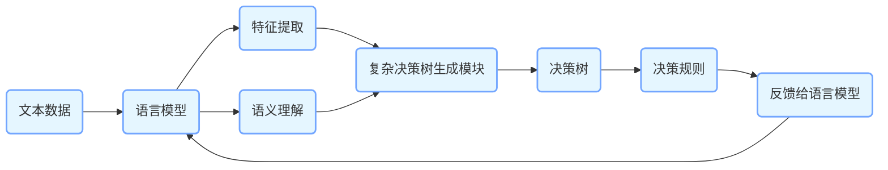

# 语言模型在复杂决策树生成中的能力研究

> 关键词：语言模型、复杂决策树、生成能力、自然语言处理、机器学习、决策树算法、人工智能

> 摘要：本文聚焦于语言模型在复杂决策树生成中的能力研究。随着人工智能和自然语言处理技术的不断发展，语言模型展现出了强大的文本理解和生成能力。复杂决策树作为一种重要的数据分析和决策工具，在众多领域有着广泛应用。研究语言模型在复杂决策树生成中的能力，有助于探索新的决策树构建方法，提高决策树的生成效率和质量。文章深入探讨了语言模型和复杂决策树的核心概念与联系，详细阐述了相关算法原理、数学模型，通过项目实战展示了语言模型在复杂决策树生成中的具体应用，分析了实际应用场景，推荐了相关的工具和资源，最后总结了未来发展趋势与挑战，并对常见问题进行了解答。

## 1. 背景介绍 
### 1.1 目的和范围
本研究的目的在于全面评估语言模型在复杂决策树生成中的能力。随着业务场景的日益复杂，传统的决策树生成方法在处理大规模、高维度且具有复杂语义信息的数据时面临挑战。语言模型凭借其对自然语言的理解和生成能力，为复杂决策树的生成提供了新的思路和方法。本研究的范围涵盖了语言模型的基本原理、复杂决策树的构建过程、语言模型在复杂决策树生成中的具体应用以及相关的评估指标和方法。

### 1.2 预期读者
本文预期读者包括从事人工智能、自然语言处理、机器学习等领域的研究人员和开发者，对数据分析、决策支持系统感兴趣的专业人士，以及相关专业的学生。对于希望了解语言模型在复杂决策树生成中应用的读者，本文将提供系统的知识和实践指导。

### 1.3 文档结构概述
本文首先介绍了语言模型和复杂决策树的背景知识，包括目的、预期读者和文档结构。接着详细阐述了核心概念与联系，通过文本示意图和 Mermaid 流程图展示其架构。然后深入讲解了核心算法原理和具体操作步骤，并结合 Python 源代码进行说明。随后介绍了数学模型和公式，通过举例加深理解。项目实战部分展示了代码实际案例和详细解释。实际应用场景分析了语言模型在复杂决策树生成中的具体应用。工具和资源推荐部分为读者提供了学习和开发的相关资源。最后总结了未来发展趋势与挑战，解答了常见问题，并提供了扩展阅读和参考资料。

### 1.4 术语表
#### 1.4.1 核心术语定义
- **语言模型**：是一种对自然语言进行建模的统计模型，用于预测给定上下文下下一个词出现的概率。它可以学习语言的模式和规律，从而生成自然流畅的文本。
- **复杂决策树**：是一种基于树结构进行决策的模型，节点表示属性或特征，分支表示属性的取值，叶子节点表示决策结果。复杂决策树通常处理大规模、高维度且具有复杂语义信息的数据。
- **决策树生成**：是指根据给定的数据和决策目标，构建决策树模型的过程。该过程包括特征选择、节点划分和树的剪枝等步骤。

#### 1.4.2 相关概念解释
- **自然语言处理（NLP）**：是人工智能的一个重要领域，致力于让计算机理解、处理和生成自然语言。语言模型是自然语言处理的核心技术之一。
- **机器学习**：是一门多领域交叉学科，涉及概率论、统计学、逼近论、凸分析、算法复杂度理论等多门学科。它专门研究计算机怎样模拟或实现人类的学习行为，以获取新的知识或技能，重新组织已有的知识结构使之不断改善自身的性能。决策树是机器学习中的一种常用算法。

#### 1.4.3 缩略词列表
- **NLP**：Natural Language Processing（自然语言处理）
- **ML**：Machine Learning（机器学习）
- **GPT**：Generative Pretrained Transformer（生成式预训练变换器）

## 2. 核心概念与联系 

### 语言模型原理
语言模型的核心目标是对自然语言文本的概率分布进行建模。常见的语言模型包括基于统计的 n - 元语法模型和基于深度学习的神经网络语言模型，如循环神经网络（RNN）、长短期记忆网络（LSTM）、门控循环单元（GRU）以及基于 Transformer 架构的语言模型（如 GPT、BERT 等）。

基于深度学习的语言模型通过学习大量的文本数据，捕捉语言中的语义、语法和上下文信息。以 Transformer 架构为例，它采用了自注意力机制，能够有效地处理长序列文本，并在多个自然语言处理任务中取得了优异的成绩。

### 复杂决策树原理
复杂决策树是一种分层结构的模型，用于解决分类和回归问题。决策树的构建过程通常基于贪心算法，通过递归地选择最优的特征和划分点，将数据集划分为不同的子集，直到满足停止条件。常见的决策树算法包括 ID3、C4.5、CART 等。

复杂决策树在处理大规模、高维度且具有复杂语义信息的数据时，需要考虑更多的因素，如特征的相关性、数据的噪声和缺失值等。

### 语言模型与复杂决策树的联系
语言模型可以为复杂决策树的生成提供以下支持：
- **特征提取**：语言模型可以对文本数据进行处理，提取有用的特征，如词向量、句向量等，为决策树的构建提供更丰富的信息。
- **语义理解**：语言模型能够理解文本的语义信息，帮助决策树更好地处理具有复杂语义的数据集。
- **规则生成**：语言模型可以生成自然语言规则，用于决策树的节点划分和决策规则的制定。

### 文本示意图
语言模型与复杂决策树的联系可以用以下文本示意图表示：

语言模型接收文本数据，通过特征提取和语义理解，将处理后的信息传递给复杂决策树生成模块。复杂决策树生成模块根据这些信息构建决策树，并生成决策规则。决策规则可以反馈给语言模型，用于进一步的优化和调整。

### Mermaid 流程图


## 3. 核心算法原理 & 具体操作步骤 

### 语言模型的特征提取算法
以基于 Transformer 架构的语言模型为例，其特征提取过程主要包括以下步骤：
1. **分词**：将输入的文本数据分割成一个个的词或子词。
2. **词嵌入**：将每个词或子词转换为对应的词向量。
3. **Transformer 编码**：通过 Transformer 网络对词向量进行编码，提取文本的语义特征。

以下是使用 Python 和 Hugging Face 的 Transformers 库进行特征提取的示例代码：
```python
from transformers import AutoTokenizer, AutoModel
import torch

# 加载预训练的语言模型和分词器
tokenizer = AutoTokenizer.from_pretrained('bert-base-uncased')
model = AutoModel.from_pretrained('bert-base-uncased')

# 输入文本
text = "This is an example sentence."

# 分词
inputs = tokenizer(text, return_tensors='pt')

# 编码
with torch.no_grad():
    outputs = model(**inputs)

# 获取特征
last_hidden_states = outputs.last_hidden_state
print(last_hidden_states.shape)
```

### 复杂决策树的生成算法
以 CART（分类与回归树）算法为例，其生成过程主要包括以下步骤：
1. **特征选择**：选择最优的特征和划分点，使得划分后的子集的纯度最高。
2. **节点划分**：根据选择的特征和划分点，将数据集划分为不同的子集。
3. **递归构建**：对每个子集递归地进行特征选择和节点划分，直到满足停止条件。
4. **剪枝**：对生成的决策树进行剪枝，避免过拟合。

以下是使用 Python 和 Scikit-learn 库实现 CART 算法的示例代码：
```python
from sklearn.datasets import load_iris
from sklearn.model_selection import train_test_split
from sklearn.tree import DecisionTreeClassifier
from sklearn.metrics import accuracy_score

# 加载数据集
iris = load_iris()
X = iris.data
y = iris.target

# 划分训练集和测试集
X_train, X_test, y_train, y_test = train_test_split(X, y, test_size=0.2, random_state=42)

# 创建决策树分类器
clf = DecisionTreeClassifier()

# 训练模型
clf.fit(X_train, y_train)

# 预测
y_pred = clf.predict(X_test)

# 计算准确率
accuracy = accuracy_score(y_test, y_pred)
print(f"Accuracy: {accuracy}")
```

### 语言模型与复杂决策树结合的算法步骤
1. **数据预处理**：对输入的文本数据进行清洗、分词等预处理操作。
2. **特征提取**：使用语言模型对预处理后的文本数据进行特征提取。
3. **决策树生成**：将提取的特征作为输入，使用复杂决策树生成算法构建决策树。
4. **评估和优化**：对生成的决策树进行评估，并根据评估结果进行优化。

## 4. 数学模型和公式 & 详细讲解 & 举例说明 

### 语言模型的数学模型
语言模型的核心任务是计算给定上下文 $C$ 下下一个词 $w$ 出现的概率 $P(w|C)$。基于 n - 元语法模型的语言模型可以表示为：

$$P(w_n|w_1, w_2, \cdots, w_{n - 1}) \approx P(w_n|w_{n - k + 1}, w_{n - k + 2}, \cdots, w_{n - 1})$$

其中，$k$ 是 n - 元语法的阶数。

基于神经网络的语言模型通过学习一个函数 $f$ 来估计概率 $P(w|C)$：

$$P(w|C) = f(C; \theta)$$

其中，$\theta$ 是模型的参数。

### 复杂决策树的数学模型
决策树的生成过程基于信息论中的信息增益、信息增益率、基尼指数等指标。以信息增益为例，设数据集 $D$ 有 $|D|$ 个样本，属于 $K$ 个类别，第 $k$ 个类别的样本数为 $|D_k|$，则数据集 $D$ 的信息熵为：

$$Ent(D) = -\sum_{k = 1}^{K} \frac{|D_k|}{|D|} \log_2 \frac{|D_k|}{|D|}$$

设特征 $a$ 有 $V$ 个可能的取值 $\{a^1, a^2, \cdots, a^V\}$，根据特征 $a$ 的取值将数据集 $D$ 划分为 $V$ 个子集 $\{D^1, D^2, \cdots, D^V\}$，则特征 $a$ 对数据集 $D$ 的信息增益为：

$$Gain(D, a) = Ent(D) - \sum_{v = 1}^{V} \frac{|D^v|}{|D|} Ent(D^v)$$

决策树在选择特征时，会选择信息增益最大的特征作为划分特征。

### 举例说明
假设有一个数据集 $D$ 包含 10 个样本，分为 2 个类别，其中类别 1 有 6 个样本，类别 2 有 4 个样本。则数据集 $D$ 的信息熵为：

$$Ent(D) = -\frac{6}{10} \log_2 \frac{6}{10} - \frac{4}{10} \log_2 \frac{4}{10} \approx 0.971$$

假设有一个特征 $a$，将数据集 $D$ 划分为 2 个子集 $D^1$ 和 $D^2$，其中 $D^1$ 包含 4 个样本，类别 1 有 3 个样本，类别 2 有 1 个样本；$D^2$ 包含 6 个样本，类别 1 有 3 个样本，类别 2 有 3 个样本。则子集 $D^1$ 和 $D^2$ 的信息熵分别为：

$$Ent(D^1) = -\frac{3}{4} \log_2 \frac{3}{4} - \frac{1}{4} \log_2 \frac{1}{4} \approx 0.811$$

$$Ent(D^2) = -\frac{3}{6} \log_2 \frac{3}{6} - \frac{3}{6} \log_2 \frac{3}{6} = 1$$

特征 $a$ 对数据集 $D$ 的信息增益为：

$$Gain(D, a) = 0.971 - (\frac{4}{10} \times 0.811 + \frac{6}{10} \times 1) \approx 0.136$$

## 5. 项目实战：代码实际案例和详细解释说明 

### 5.1  开发环境搭建
1. **安装 Python**：建议使用 Python 3.7 及以上版本。
2. **安装必要的库**：使用以下命令安装所需的库：
```sh
pip install transformers scikit-learn torch numpy pandas
```

### 5.2  源代码详细实现和代码解读
以下是一个结合语言模型和复杂决策树进行文本分类的示例代码：
```python
import pandas as pd
from sklearn.model_selection import train_test_split
from sklearn.tree import DecisionTreeClassifier
from sklearn.metrics import accuracy_score
from transformers import AutoTokenizer, AutoModel
import torch
import numpy as np

# 加载预训练的语言模型和分词器
tokenizer = AutoTokenizer.from_pretrained('bert-base-uncased')
model = AutoModel.from_pretrained('bert-base-uncased')

# 加载数据集
data = pd.read_csv('text_data.csv')
texts = data['text'].tolist()
labels = data['label'].tolist()

# 特征提取
features = []
for text in texts:
    inputs = tokenizer(text, return_tensors='pt')
    with torch.no_grad():
        outputs = model(**inputs)
    last_hidden_states = outputs.last_hidden_state
    # 取 [CLS] 标记的特征向量作为文本的特征表示
    feature = last_hidden_states[:, 0, :].numpy()
    features.append(feature.flatten())

features = np.array(features)

# 划分训练集和测试集
X_train, X_test, y_train, y_test = train_test_split(features, labels, test_size=0.2, random_state=42)

# 创建决策树分类器
clf = DecisionTreeClassifier()

# 训练模型
clf.fit(X_train, y_train)

# 预测
y_pred = clf.predict(X_test)

# 计算准确率
accuracy = accuracy_score(y_test, y_pred)
print(f"Accuracy: {accuracy}")
```

### 5.3  代码解读与分析
1. **数据加载**：使用 Pandas 库加载包含文本数据和标签的 CSV 文件。
2. **特征提取**：使用预训练的 BERT 语言模型对文本数据进行特征提取，取 [CLS] 标记的特征向量作为文本的特征表示。
3. **数据集划分**：使用 Scikit-learn 库的 `train_test_split` 函数将数据集划分为训练集和测试集。
4. **决策树训练**：使用 Scikit-learn 库的 `DecisionTreeClassifier` 类创建决策树分类器，并使用训练集进行训练。
5. **预测和评估**：使用训练好的决策树分类器对测试集进行预测，并计算准确率。

## 6. 实际应用场景 
### 医疗领域
在医疗领域，语言模型可以对病历、诊断报告等文本数据进行处理，提取关键信息，如症状、疾病名称、治疗方案等。复杂决策树可以根据这些信息进行疾病诊断、治疗方案推荐等决策。例如，根据患者的症状和病史，使用决策树模型判断患者可能患有的疾病，并推荐相应的检查和治疗方案。

### 金融领域
在金融领域，语言模型可以对新闻、公告、研报等文本数据进行分析，提取市场趋势、公司财务状况等信息。复杂决策树可以根据这些信息进行投资决策、风险评估等。例如，根据公司的财务报表和新闻报道，使用决策树模型评估公司的信用风险，为投资决策提供参考。

### 客服领域
在客服领域，语言模型可以对用户的咨询和反馈进行理解和分类。复杂决策树可以根据用户的问题类型和历史记录，提供相应的解决方案和建议。例如，根据用户的问题描述，使用决策树模型判断问题的严重程度，并分配给相应的客服人员进行处理。

## 7. 工具和资源推荐
### 7.1 学习资源推荐
#### 7.1.1 书籍推荐
- 《深度学习》（Deep Learning）：由 Ian Goodfellow、Yoshua Bengio 和 Aaron Courville 所著，是深度学习领域的经典教材，涵盖了神经网络、深度学习模型、优化算法等方面的内容。
- 《自然语言处理入门》：由何晗所著，系统地介绍了自然语言处理的基本概念、方法和技术，包括分词、词性标注、命名实体识别、文本分类等。
- 《机器学习》（Machine Learning）：由 Tom M. Mitchell 所著，是机器学习领域的经典教材，介绍了机器学习的基本概念、算法和应用。

#### 7.1.2 在线课程
- Coursera 上的“深度学习专项课程”（Deep Learning Specialization）：由 Andrew Ng 教授授课，包括神经网络和深度学习、改善深层神经网络、结构化机器学习项目、卷积神经网络、序列模型等课程。
- edX 上的“自然语言处理基础”（Foundations of Natural Language Processing）：介绍了自然语言处理的基本概念、方法和技术，包括词法分析、句法分析、语义分析等。
- 网易云课堂上的“机器学习实战”：通过实际案例介绍了机器学习的基本算法和应用，包括决策树、支持向量机、神经网络等。

#### 7.1.3 技术博客和网站
- Hugging Face 博客（https://huggingface.co/blog）：提供了关于自然语言处理、深度学习等领域的最新研究成果和技术分享。
- Towards Data Science（https://towardsdatascience.com/）：是一个专注于数据科学、机器学习、人工智能等领域的技术博客平台，有许多优秀的技术文章和案例分享。
- arXiv（https://arxiv.org/）：是一个收集物理学、数学、计算机科学、生物学与统计学论文预印本的网站，提供了大量的学术论文和研究成果。

### 7.2 开发工具框架推荐
#### 7.2.1 IDE和编辑器
- PyCharm：是一款专为 Python 开发设计的集成开发环境（IDE），提供了代码编辑、调试、版本控制等功能，支持多种 Python 框架和库。
- Visual Studio Code：是一款轻量级的代码编辑器，支持多种编程语言和插件，具有丰富的扩展功能，可用于 Python 开发。
- Jupyter Notebook：是一个基于 Web 的交互式计算环境，支持 Python、R、Julia 等多种编程语言，可用于数据分析、机器学习等领域的开发和实验。

#### 7.2.2 调试和性能分析工具
- PDB：是 Python 内置的调试器，可用于调试 Python 代码，查看变量的值、执行流程等。
- Py-Spy：是一个轻量级的 Python 性能分析工具，可用于分析 Python 程序的 CPU 使用率、函数调用时间等。
- TensorBoard：是 TensorFlow 提供的可视化工具，可用于可视化训练过程、模型结构、指标变化等。

#### 7.2.3 相关框架和库
- Transformers：是 Hugging Face 开发的一个用于自然语言处理的开源库，提供了多种预训练的语言模型，如 BERT、GPT、XLNet 等，支持文本分类、命名实体识别、问答系统等任务。
- Scikit-learn：是一个用于机器学习的开源库，提供了多种机器学习算法和工具，如分类、回归、聚类、降维等，支持数据预处理、模型选择、评估等功能。
- PyTorch：是一个开源的深度学习框架，提供了张量计算、自动求导、神经网络等功能，支持 CPU 和 GPU 计算，可用于自然语言处理、计算机视觉等领域的开发。

### 7.3 相关论文著作推荐
#### 7.3.1 经典论文
- “Attention Is All You Need”：介绍了 Transformer 架构，提出了自注意力机制，是自然语言处理领域的重要突破。
- “A Decision-Theoretic Generalization of On-Line Learning and an Application to Boosting”：提出了 AdaBoost 算法，是一种强大的集成学习算法。
- “Induction of Decision Trees”：介绍了 ID3 决策树算法，是决策树领域的经典论文。

#### 7.3.2 最新研究成果
- 关注 arXiv、ACL、NeurIPS 等学术平台和会议，获取关于语言模型、复杂决策树等领域的最新研究成果。

#### 7.3.3 应用案例分析
- 研究一些实际应用案例，如医疗、金融、客服等领域中语言模型和复杂决策树的应用，了解其具体实现和效果。

## 8. 总结：未来发展趋势与挑战
### 未来发展趋势
- **多模态融合**：将语言模型与图像、音频等多模态数据进行融合，生成更加复杂和全面的决策树，提高决策的准确性和可靠性。
- **强化学习与决策树结合**：将强化学习算法与复杂决策树相结合，通过智能体的交互和学习，不断优化决策树的结构和策略，提高决策的效率和适应性。
- **大规模预训练模型的应用**：随着大规模预训练语言模型的不断发展，将其应用于复杂决策树生成中，利用其强大的语义理解和生成能力，提高决策树的性能和泛化能力。

### 挑战
- **数据质量和标注**：语言模型和复杂决策树的训练需要大量高质量的数据和标注，数据的质量和标注的准确性直接影响模型的性能。
- **计算资源和效率**：大规模预训练语言模型的训练和推理需要大量的计算资源和时间，如何提高计算效率和降低成本是一个挑战。
- **可解释性和安全性**：语言模型和复杂决策树的决策过程往往比较复杂，如何提高其可解释性和安全性，确保决策的可靠性和公正性，是一个重要的问题。

## 9. 附录：常见问题与解答
### 语言模型在复杂决策树生成中一定能提高性能吗？
不一定。语言模型在复杂决策树生成中可以提供更多的信息和语义理解能力，但具体效果取决于数据的质量、语言模型的选择和训练、决策树算法的优化等因素。在某些情况下，语言模型可能会引入噪声或过拟合问题，导致性能下降。

### 如何选择合适的语言模型和决策树算法？
选择合适的语言模型和决策树算法需要考虑数据的特点、任务的需求和计算资源等因素。对于文本数据，可以选择基于 Transformer 架构的预训练语言模型，如 BERT、GPT 等。对于决策树算法，可以根据数据的类型（分类或回归）和复杂度选择合适的算法，如 ID3、C4.5、CART 等。

### 如何处理语言模型和决策树的可解释性问题？
可以采用以下方法处理可解释性问题：
- **特征重要性分析**：分析语言模型提取的特征对决策树决策的重要性，了解哪些特征对决策结果影响较大。
- **规则提取**：从决策树中提取决策规则，将其转换为自然语言，便于理解和解释。
- **可视化**：使用可视化工具展示语言模型和决策树的结构和决策过程，直观地呈现决策的依据和逻辑。

## 10. 扩展阅读 & 参考资料
- 《人工智能：现代方法》（Artificial Intelligence: A Modern Approach）
- 《统计学习方法》（The Elements of Statistical Learning）
- “BERT: Pre-training of Deep Bidirectional Transformers for Language Understanding”
- “Gradient-Based Learning Applied to Document Recognition”
- Hugging Face 官方文档（https://huggingface.co/docs）
- Scikit-learn 官方文档（https://scikit-learn.org/stable/documentation.html）
- PyTorch 官方文档（https://pytorch.org/docs/stable/index.html）

作者：AI天才研究院/AI Genius Institute & 禅与计算机程序设计艺术 /Zen And The Art of Computer Programming