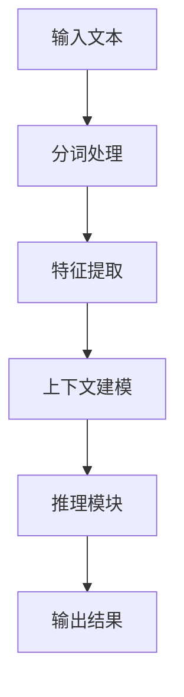

# 语言模型在复杂场景理解与推理中的应用

> 关键词：语言模型、复杂场景理解、推理、自然语言处理、深度学习

> 摘要：本文深入探讨了语言模型在复杂场景理解与推理中的应用。首先介绍了相关背景，包括目的范围、预期读者等内容。接着阐述了核心概念及联系，通过文本示意图和Mermaid流程图进行展示。详细讲解了核心算法原理，并用Python代码进行说明，同时给出了相关数学模型和公式及举例。在项目实战部分，展示了开发环境搭建、源代码实现与解读。还探讨了实际应用场景，推荐了学习资源、开发工具框架以及相关论文著作。最后总结了未来发展趋势与挑战，并提供了常见问题解答和扩展阅读参考资料，旨在为读者全面呈现语言模型在复杂场景理解与推理领域的应用全貌。

## 1. 背景介绍 
### 1.1 目的和范围
语言模型在自然语言处理领域中占据着核心地位，随着技术的不断发展，其应用场景也越来越广泛。本文章的目的在于深入探讨语言模型在复杂场景理解与推理中的具体应用，详细分析其原理、实现方法以及实际应用案例。范围涵盖了从基础的语言模型概念到高级的复杂场景处理技术，涉及到深度学习、机器学习等多个领域的知识。

### 1.2 预期读者
本文预期读者主要包括自然语言处理领域的研究人员、开发者、对人工智能技术有深入兴趣的学生以及相关行业的从业者。对于那些希望了解语言模型如何处理复杂场景并进行推理的人群来说，本文将提供有价值的参考。

### 1.3 文档结构概述
本文将按照以下结构进行组织：首先介绍核心概念与联系，通过文本示意图和Mermaid流程图展示语言模型在复杂场景理解与推理中的架构；接着详细阐述核心算法原理，并使用Python代码进行具体实现；然后给出相关的数学模型和公式，并举例说明其应用；在项目实战部分，将介绍开发环境搭建、源代码详细实现和代码解读；之后探讨实际应用场景；再推荐相关的工具和资源，包括学习资源、开发工具框架和论文著作；最后总结未来发展趋势与挑战，提供常见问题解答和扩展阅读参考资料。

### 1.4 术语表
#### 1.4.1 核心术语定义
- **语言模型**：是一种对自然语言文本进行概率建模的模型，它可以预测一个词序列出现的概率。
- **复杂场景理解**：指的是模型能够理解包含多种元素、复杂语义和上下文信息的场景。
- **推理**：在给定信息的基础上，通过逻辑或其他方法得出新的结论或信息的过程。
- **自然语言处理（NLP）**：是人工智能领域中处理人类语言的技术，包括文本分类、情感分析、机器翻译等任务。
- **深度学习**：是一类基于人工神经网络的机器学习技术，在自然语言处理中取得了显著的成果。

#### 1.4.2 相关概念解释
- **预训练语言模型**：通过在大规模无监督文本数据上进行训练得到的语言模型，具有强大的语言理解能力。
- **微调**：在预训练语言模型的基础上，针对特定任务在小规模有监督数据上进行进一步训练的过程。
- **上下文信息**：文本中某个词或句子周围的其他词和句子所提供的信息，对于理解语义非常重要。

#### 1.4.3 缩略词列表
- **NLP**：自然语言处理（Natural Language Processing）
- **GPT**：生成式预训练转换器（Generative Pretrained Transformer）
- **BERT**：双向编码器表示来自变换器（Bidirectional Encoder Representations from Transformers）

## 2. 核心概念与联系 
### 核心概念原理
语言模型在复杂场景理解与推理中的核心原理是基于对自然语言的理解和生成能力。语言模型通过学习大量的文本数据，掌握语言的语法、语义和上下文信息，从而能够对输入的文本进行理解和分析。在复杂场景中，语言模型需要处理包含多种元素、复杂语义和上下文信息的文本，通过对这些信息的综合分析，进行推理并得出结论。

例如，在一个智能客服场景中，用户提出一个复杂的问题，如“我上个月购买的产品出现了质量问题，已经申请了退货，但到现在还没有处理，我该怎么办？”语言模型需要理解用户的问题，分析其中的关键信息，如购买时间、问题类型、处理状态等，并根据这些信息进行推理，给出合适的解决方案。

### 架构的文本示意图
```
输入文本 -> 分词处理 -> 特征提取 -> 上下文建模 -> 推理模块 -> 输出结果
```
- **输入文本**：用户输入的包含复杂场景信息的自然语言文本。
- **分词处理**：将输入文本分割成一个个单词或词块，便于后续处理。
- **特征提取**：将分词后的文本转换为计算机能够处理的特征向量。
- **上下文建模**：考虑文本的上下文信息，对特征向量进行进一步处理，以更好地理解语义。
- **推理模块**：根据上下文信息和特征向量进行推理，得出结论或解决方案。
- **输出结果**：将推理结果以自然语言的形式输出给用户。

### Mermaid流程图


## 3. 核心算法原理 & 具体操作步骤 
### 核心算法原理
在语言模型中，Transformer架构是目前应用最广泛的一种架构，它具有强大的并行计算能力和长序列处理能力。Transformer架构主要由编码器和解码器组成，其中编码器用于对输入文本进行特征提取和上下文建模，解码器用于生成输出文本。

Transformer架构的核心是自注意力机制（Self-Attention Mechanism），它可以让模型在处理每个词时，考虑到输入序列中其他词的信息，从而更好地捕捉上下文信息。自注意力机制的计算公式如下：
$$
\text{Attention}(Q, K, V) = \text{softmax}(\frac{QK^T}{\sqrt{d_k}})V
$$
其中，$Q$ 是查询矩阵，$K$ 是键矩阵，$V$ 是值矩阵，$d_k$ 是键向量的维度。

### 具体操作步骤
以下是使用Python和PyTorch实现一个简单的Transformer编码器的代码示例：
```python
import torch
import torch.nn as nn
import torch.nn.functional as F

# 定义自注意力机制
class SelfAttention(nn.Module):
    def __init__(self, embed_size, heads):
        super(SelfAttention, self).__init__()
        self.embed_size = embed_size
        self.heads = heads
        self.head_dim = embed_size // heads

        assert (
            self.head_dim * heads == embed_size
        ), "Embedding size needs to be divisible by heads"

        self.values = nn.Linear(self.head_dim, self.head_dim, bias=False)
        self.keys = nn.Linear(self.head_dim, self.head_dim, bias=False)
        self.queries = nn.Linear(self.head_dim, self.head_dim, bias=False)
        self.fc_out = nn.Linear(heads * self.head_dim, embed_size)

    def forward(self, values, keys, query, mask):
        N = query.shape[0]
        value_len, key_len, query_len = values.shape[1], keys.shape[1], query.shape[1]

        # Split the embedding into self.heads different pieces
        values = values.reshape(N, value_len, self.heads, self.head_dim)
        keys = keys.reshape(N, key_len, self.heads, self.head_dim)
        queries = query.reshape(N, query_len, self.heads, self.head_dim)

        values = self.values(values)
        keys = self.keys(keys)
        queries = self.queries(queries)

        # Scaled dot-product attention
        energy = torch.einsum("nqhd,nkhd->nhqk", [queries, keys])
        if mask is not None:
            energy = energy.masked_fill(mask == 0, float("-1e20"))

        attention = torch.softmax(energy / (self.embed_size ** (1 / 2)), dim=3)

        out = torch.einsum("nhql,nlhd->nqhd", [attention, values]).reshape(
            N, query_len, self.heads * self.head_dim
        )

        out = self.fc_out(out)
        return out

# 定义Transformer编码器层
class TransformerBlock(nn.Module):
    def __init__(self, embed_size, heads, dropout, forward_expansion):
        super(TransformerBlock, self).__init__()
        self.attention = SelfAttention(embed_size, heads)
        self.norm1 = nn.LayerNorm(embed_size)
        self.norm2 = nn.LayerNorm(embed_size)

        self.feed_forward = nn.Sequential(
            nn.Linear(embed_size, forward_expansion * embed_size),
            nn.ReLU(),
            nn.Linear(forward_expansion * embed_size, embed_size),
        )

        self.dropout = nn.Dropout(dropout)

    def forward(self, value, key, query, mask):
        attention = self.attention(value, key, query, mask)

        # Add skip connection, then norm
        x = self.dropout(self.norm1(attention + query))
        forward = self.feed_forward(x)
        out = self.dropout(self.norm2(forward + x))
        return out

# 定义Transformer编码器
class TransformerEncoder(nn.Module):
    def __init__(
        self,
        src_vocab_size,
        embed_size,
        num_layers,
        heads,
        device,
        forward_expansion,
        dropout,
        max_length,
    ):
        super(TransformerEncoder, self).__init__()
        self.embed_size = embed_size
        self.device = device
        self.word_embedding = nn.Embedding(src_vocab_size, embed_size)
        self.position_embedding = nn.Embedding(max_length, embed_size)

        self.layers = nn.ModuleList(
            [
                TransformerBlock(
                    embed_size,
                    heads,
                    dropout=dropout,
                    forward_expansion=forward_expansion,
                )
                for _ in range(num_layers)
            ]
        )

        self.dropout = nn.Dropout(dropout)

    def forward(self, src, src_mask):
        N, seq_length = src.shape
        positions = torch.arange(0, seq_length).expand(N, seq_length).to(self.device)
        out = self.dropout(
            (self.word_embedding(src) + self.position_embedding(positions))
        )

        for layer in self.layers:
            out = layer(out, out, out, src_mask)

        return out
```
### 代码解释
1. **SelfAttention类**：实现了自注意力机制，通过线性变换将输入的查询、键和值矩阵进行处理，然后计算注意力分数并进行加权求和。
2. **TransformerBlock类**：实现了一个Transformer编码器层，包括自注意力机制和前馈神经网络，使用残差连接和层归一化来提高模型的训练稳定性。
3. **TransformerEncoder类**：实现了整个Transformer编码器，包括词嵌入和位置嵌入，以及多个Transformer编码器层。

## 4. 数学模型和公式 & 详细讲解 & 举例说明 
### 自注意力机制公式
$$
\text{Attention}(Q, K, V) = \text{softmax}(\frac{QK^T}{\sqrt{d_k}})V
$$
- **详细讲解**：
  - $Q$、$K$、$V$ 分别是查询矩阵、键矩阵和值矩阵，它们是通过对输入的词向量进行线性变换得到的。
  - $QK^T$ 计算了查询和键之间的相似度得分，$\sqrt{d_k}$ 是为了防止相似度得分过大，导致softmax函数的梯度消失。
  - $\text{softmax}$ 函数将相似度得分转换为概率分布，用于对值矩阵进行加权求和。

### 举例说明
假设我们有一个输入序列 $[x_1, x_2, x_3]$，每个词的嵌入维度为 $d = 4$，我们设置头数 $h = 2$，则每个头的维度 $d_k = d / h = 2$。

```python
import torch

# 输入序列的嵌入表示
x = torch.tensor([[1, 2, 3, 4], [5, 6, 7, 8], [9, 10, 11, 12]], dtype=torch.float32)

# 定义线性变换矩阵
W_q = torch.randn(4, 2)
W_k = torch.randn(4, 2)
W_v = torch.randn(4, 2)

# 计算查询、键和值矩阵
Q = torch.matmul(x, W_q)
K = torch.matmul(x, W_k)
V = torch.matmul(x, W_v)

# 计算相似度得分
energy = torch.matmul(Q, K.T) / torch.sqrt(torch.tensor(2, dtype=torch.float32))

# 计算注意力分数
attention_scores = torch.softmax(energy, dim=1)

# 计算输出
out = torch.matmul(attention_scores, V)

print("输出结果:", out)
```
在这个例子中，我们通过线性变换得到了查询、键和值矩阵，然后计算了相似度得分和注意力分数，最后对值矩阵进行加权求和得到了输出结果。

## 5. 项目实战：代码实际案例和详细解释说明 
### 5.1  开发环境搭建
#### 安装Python和PyTorch
首先，确保你已经安装了Python 3.7或更高版本。可以从Python官方网站（https://www.python.org/downloads/）下载并安装。

然后，安装PyTorch。根据你的CUDA版本和操作系统，选择合适的安装命令。例如，如果你使用的是CPU版本的PyTorch，可以使用以下命令进行安装：
```bash
pip install torch torchvision
```
#### 安装其他依赖库
还需要安装一些其他的依赖库，如`transformers`、`numpy`、`pandas`等。可以使用以下命令进行安装：
```bash
pip install transformers numpy pandas
```

### 5.2  源代码详细实现和代码解读
以下是一个使用Hugging Face的`transformers`库进行文本分类的代码示例：
```python
import torch
from transformers import AutoTokenizer, AutoModelForSequenceClassification

# 加载预训练的语言模型和分词器
model_name = "bert-base-uncased"
tokenizer = AutoTokenizer.from_pretrained(model_name)
model = AutoModelForSequenceClassification.from_pretrained(model_name, num_labels=2)

# 定义输入文本
text = "This is a great movie!"

# 对输入文本进行分词处理
inputs = tokenizer(text, return_tensors="pt")

# 进行推理
with torch.no_grad():
    outputs = model(**inputs)

# 获取预测结果
logits = outputs.logits
predicted_class_id = logits.argmax().item()

print("预测类别:", predicted_class_id)
```
### 代码解读
1. **加载预训练的语言模型和分词器**：使用`AutoTokenizer`和`AutoModelForSequenceClassification`从Hugging Face的模型库中加载预训练的BERT模型和对应的分词器。
2. **定义输入文本**：定义一个待分类的文本。
3. **对输入文本进行分词处理**：使用分词器将输入文本转换为模型可以接受的输入格式。
4. **进行推理**：使用`torch.no_grad()`上下文管理器禁用梯度计算，提高推理速度。
5. **获取预测结果**：从模型的输出中获取logits，然后使用`argmax`函数获取预测的类别ID。

### 5.3  代码解读与分析
这个代码示例展示了如何使用预训练的语言模型进行文本分类任务。通过使用Hugging Face的`transformers`库，我们可以很方便地加载和使用各种预训练的语言模型。在实际应用中，我们可以根据具体的任务需求对模型进行微调，以提高模型的性能。

## 6. 实际应用场景 
### 智能客服
在智能客服场景中，语言模型可以理解用户的复杂问题，分析问题的关键信息，并根据知识库或历史数据进行推理，给出合适的解决方案。例如，用户提出一个关于产品使用方法和故障排除的问题，语言模型可以通过分析问题的语义和上下文信息，快速定位问题的原因，并提供相应的解决方案。

### 金融风险评估
在金融领域，语言模型可以用于分析新闻文章、财报等文本信息，评估企业的信用风险和市场风险。通过对大量文本数据的理解和推理，语言模型可以发现潜在的风险因素，为金融机构提供决策支持。

### 医疗诊断辅助
在医疗领域，语言模型可以帮助医生理解患者的病历、症状描述等信息，进行初步的诊断和推理。例如，语言模型可以分析患者的症状文本，结合医学知识库，给出可能的疾病诊断和治疗建议。

### 自动驾驶场景理解
在自动驾驶领域，语言模型可以与视觉、雷达等传感器数据相结合，理解复杂的交通场景和指令。例如，语言模型可以处理交通标志、语音指令等文本信息，帮助自动驾驶系统做出正确的决策。

## 7. 工具和资源推荐
### 7.1 学习资源推荐
#### 7.1.1 书籍推荐
- 《深度学习》（Deep Learning）：由Ian Goodfellow、Yoshua Bengio和Aaron Courville所著，是深度学习领域的经典教材。
- 《自然语言处理入门》：何晗著，适合初学者了解自然语言处理的基本概念和方法。
- 《动手学深度学习》（Dive into Deep Learning）：由 Aston Zhang、Zack C. Lipton、Mu Li和Alexander J. Smola所著，提供了丰富的代码示例和实践项目。

#### 7.1.2 在线课程
- Coursera上的“深度学习专项课程”（Deep Learning Specialization）：由Andrew Ng教授授课，涵盖了深度学习的各个方面。
- edX上的“自然语言处理基础”（Foundations of Natural Language Processing）：介绍了自然语言处理的基本概念和技术。
- 哔哩哔哩上的“李沐老师的深度学习课程”：以通俗易懂的方式讲解深度学习的原理和实践。

#### 7.1.3 技术博客和网站
- Hugging Face博客（https://huggingface.co/blog）：提供了关于语言模型和自然语言处理的最新研究成果和技术文章。
- Medium上的Towards Data Science：有许多关于机器学习和自然语言处理的高质量文章。
- arXiv（https://arxiv.org/）：是一个预印本平台，包含了大量的学术论文，特别是在人工智能领域。

### 7.2 开发工具框架推荐
#### 7.2.1 IDE和编辑器
- PyCharm：是一款功能强大的Python集成开发环境，提供了代码编辑、调试、版本控制等功能。
- Jupyter Notebook：是一个交互式的开发环境，适合进行数据分析和模型实验。
- Visual Studio Code：是一款轻量级的代码编辑器，支持多种编程语言和插件扩展。

#### 7.2.2 调试和性能分析工具
- PyTorch Profiler：是PyTorch自带的性能分析工具，可以帮助开发者分析模型的运行时间和内存使用情况。
- TensorBoard：是TensorFlow的可视化工具，也可以用于PyTorch模型的可视化和调试。
- PDB：是Python的标准调试器，可以帮助开发者定位代码中的错误。

#### 7.2.3 相关框架和库
- Hugging Face Transformers：提供了丰富的预训练语言模型和工具，方便开发者进行自然语言处理任务。
- AllenNLP：是一个用于自然语言处理的深度学习框架，提供了许多预定义的模型和工具。
- spaCy：是一个快速、高效的自然语言处理库，提供了分词、词性标注、命名实体识别等功能。

### 7.3 相关论文著作推荐
#### 7.3.1 经典论文
- 《Attention Is All You Need》：提出了Transformer架构，是自然语言处理领域的里程碑式论文。
- 《BERT: Pre-training of Deep Bidirectional Transformers for Language Understanding》：介绍了BERT模型，开创了预训练语言模型的先河。
- 《Generative Pretrained Transformer 3》：介绍了GPT-3模型，展示了大规模语言模型的强大能力。

#### 7.3.2 最新研究成果
- 在各大人工智能会议（如ACL、EMNLP、NeurIPS等）上发表的关于语言模型和自然语言处理的最新研究论文。
- 顶级学术期刊（如Journal of Artificial Intelligence Research、Artificial Intelligence等）上的相关研究成果。

#### 7.3.3 应用案例分析
- 一些实际应用场景中的案例分析论文，如智能客服、金融风险评估等领域的应用案例，这些论文可以帮助我们了解语言模型在实际应用中的具体实现和效果。

## 8. 总结：未来发展趋势与挑战
### 未来发展趋势
- **多模态融合**：将语言模型与视觉、音频等模态的信息进行融合，实现更加全面和深入的场景理解与推理。例如，在自动驾驶场景中，结合图像和文本信息，提高对复杂交通场景的理解能力。
- **知识增强**：将外部知识库与语言模型相结合，使模型能够利用更多的领域知识进行推理。例如，在医疗诊断中，引入医学知识库，提高诊断的准确性。
- **个性化服务**：根据用户的个性化需求和偏好，提供更加精准的服务。例如，在智能客服中，根据用户的历史记录和偏好，提供个性化的解决方案。

### 挑战
- **数据质量和隐私问题**：语言模型的训练需要大量的数据，但数据的质量和隐私问题是一个挑战。如何获取高质量、标注准确的数据，同时保护用户的隐私，是需要解决的问题。
- **计算资源需求**：大规模语言模型的训练和推理需要大量的计算资源，这对于硬件设备和能源消耗都是一个挑战。如何提高模型的效率，降低计算成本，是未来的研究方向。
- **可解释性和可靠性**：语言模型的决策过程往往是黑盒的，缺乏可解释性和可靠性。在一些关键领域（如医疗、金融等），如何提高模型的可解释性和可靠性，是一个亟待解决的问题。

## 9. 附录：常见问题与解答
### 问题1：语言模型在复杂场景理解与推理中的准确性如何提高？
解答：可以通过以下几种方法提高语言模型的准确性：
- 使用更多的训练数据，特别是包含复杂场景信息的数据。
- 对模型进行微调，使其适应特定的任务和场景。
- 引入外部知识库，增强模型的知识推理能力。
- 采用集成学习的方法，结合多个模型的预测结果。

### 问题2：如何选择适合的预训练语言模型？
解答：选择适合的预训练语言模型需要考虑以下因素：
- 任务类型：不同的任务可能适合不同的模型，例如文本分类任务可以选择BERT、RoBERTa等模型，生成任务可以选择GPT系列模型。
- 数据规模：如果数据规模较小，可以选择较小的预训练模型；如果数据规模较大，可以选择较大的模型。
- 计算资源：较大的模型需要更多的计算资源，需要根据自己的硬件条件选择合适的模型。

### 问题3：语言模型在实际应用中可能会遇到哪些问题？
解答：语言模型在实际应用中可能会遇到以下问题：
- 语义理解不准确：对于一些复杂的语义和上下文信息，模型可能无法准确理解。
- 推理能力有限：在一些需要复杂推理的场景中，模型的推理能力可能不足。
- 数据偏差：训练数据中的偏差可能会导致模型的预测结果出现偏差。
- 可解释性差：模型的决策过程往往是黑盒的，缺乏可解释性，这在一些关键领域可能会带来问题。

## 10. 扩展阅读 & 参考资料
### 扩展阅读
- 《自然语言处理：理论与实践》：进一步深入学习自然语言处理的理论和技术。
- 《人工智能：一种现代的方法》：全面了解人工智能的各个领域，包括自然语言处理。

### 参考资料
- Hugging Face官方文档（https://huggingface.co/docs/transformers/index）
- PyTorch官方文档（https://pytorch.org/docs/stable/index.html）
- 《Attention Is All You Need》论文原文（https://arxiv.org/abs/1706.03762）

作者：AI天才研究院/AI Genius Institute & 禅与计算机程序设计艺术 /Zen And The Art of Computer Programming