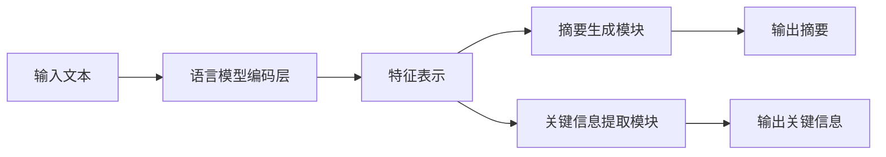

# 语言模型在复杂文本摘要与关键信息提取中的创新

> 关键词：语言模型、复杂文本摘要、关键信息提取、创新技术、自然语言处理

> 摘要：本文聚焦于语言模型在复杂文本摘要与关键信息提取领域的创新应用。首先介绍了该研究的背景，包括目的、预期读者等。详细阐述了核心概念与联系，给出了相关原理和架构的文本示意图及 Mermaid 流程图。深入分析了核心算法原理，并通过 Python 源代码进行详细说明。探讨了相关数学模型和公式，辅以举例加深理解。进行了项目实战，包括开发环境搭建、源代码实现与解读。列举了实际应用场景，推荐了学习资源、开发工具框架以及相关论文著作。最后总结了未来发展趋势与挑战，并对常见问题进行解答，为该领域的研究和实践提供了全面且深入的参考。

## 1. 背景介绍 
### 1.1 目的和范围
在当今信息爆炸的时代，大量的文本数据不断涌现，如新闻报道、学术论文、企业文档等。复杂文本摘要与关键信息提取的目的在于从这些海量的、复杂的文本中快速准确地提炼出核心内容和关键信息，以提高信息获取的效率。本研究的范围涵盖了各种类型的复杂文本，包括长文本、多领域文本、包含多种语言和专业术语的文本等。通过运用先进的语言模型，旨在探索更高效、更准确的文本摘要和关键信息提取方法，以满足不同领域对信息处理的需求。

### 1.2 预期读者
本文的预期读者包括自然语言处理领域的研究人员、从事文本处理相关工作的程序员和软件开发者、对信息提取和文本分析感兴趣的学者，以及希望利用语言模型技术优化自身业务流程的企业管理人员和技术决策者。

### 1.3 文档结构概述
本文首先介绍了研究的背景信息，为后续内容奠定基础。接着阐述了语言模型在复杂文本摘要与关键信息提取中的核心概念与联系，包括相关原理和架构。然后详细讲解了核心算法原理，并通过 Python 代码进行示例。之后探讨了数学模型和公式，通过具体例子加深理解。项目实战部分展示了如何在实际中应用这些技术，包括开发环境搭建、代码实现和解读。接着列举了实际应用场景，为读者提供实践参考。推荐了学习资源、开发工具框架和相关论文著作，方便读者进一步深入学习。最后总结了未来发展趋势与挑战，解答了常见问题，并提供了扩展阅读和参考资料。

### 1.4 术语表
#### 1.4.1 核心术语定义
- **语言模型**：是一种对语言进行建模的概率模型，用于预测给定上下文下下一个词出现的概率。它可以学习语言的语法、语义和统计规律，从而生成自然流畅的文本。
- **复杂文本摘要**：从复杂的文本中提取出能够概括原文主要内容的简短文本，要求保留关键信息，同时保证摘要的连贯性和可读性。
- **关键信息提取**：从文本中识别和抽取具有重要意义的信息，如实体、事件、观点等。

#### 1.4.2 相关概念解释
- **预训练语言模型**：在大规模无监督文本数据上进行预训练的语言模型，通过学习文本的通用特征和模式，能够在多种自然语言处理任务中取得较好的效果。
- **注意力机制**：一种在神经网络中用于动态调整输入信息权重的机制，能够让模型更加关注重要的部分，提高模型的性能。

#### 1.4.3 缩略词列表
- **NLP**：Natural Language Processing，自然语言处理
- **BERT**：Bidirectional Encoder Representations from Transformers，基于变换器的双向编码器表示
- **GPT**：Generative Pretrained Transformer，生成式预训练变换器

## 2. 核心概念与联系 

### 核心概念原理
语言模型在复杂文本摘要与关键信息提取中起着核心作用。语言模型通过学习大量的文本数据，掌握语言的结构、语义和统计规律。在文本摘要任务中，语言模型可以根据输入的文本生成一个简洁的摘要，其原理是基于对文本内容的理解和概括能力。例如，预训练语言模型可以将文本编码为向量表示，然后通过解码过程生成摘要。

在关键信息提取方面，语言模型可以通过识别文本中的实体、关系和事件等关键元素，将其提取出来。这通常涉及到命名实体识别、关系抽取等任务。语言模型可以利用其强大的语义理解能力，准确地定位和分类关键信息。

### 架构的文本示意图
```plaintext
输入文本 -> 语言模型编码层 -> 特征表示 -> 摘要生成模块/关键信息提取模块 -> 输出摘要/关键信息
```
该示意图展示了整个流程。输入的复杂文本首先经过语言模型的编码层，将文本转换为特征表示。然后，这些特征可以分别输入到摘要生成模块或关键信息提取模块中，最终得到摘要或关键信息。

### Mermaid 流程图

这个流程图清晰地展示了从输入文本到输出摘要和关键信息的整个过程。输入文本经过编码得到特征表示，然后分别进入不同的模块进行处理，最终输出所需的结果。

## 3. 核心算法原理 & 具体操作步骤 

### 核心算法原理
以基于 Transformer 架构的语言模型为例，其核心是多头注意力机制和前馈神经网络。多头注意力机制允许模型在不同的表示子空间中关注输入序列的不同部分，从而捕捉更丰富的信息。前馈神经网络则对注意力机制的输出进行非线性变换。

在文本摘要任务中，通常采用序列到序列（Seq2Seq）的模型结构。编码器将输入文本编码为一个固定长度的向量表示，解码器根据这个向量表示生成摘要。在训练过程中，使用损失函数来衡量生成的摘要与真实摘要之间的差异，通过反向传播算法更新模型的参数。

在关键信息提取任务中，可以使用命名实体识别（NER）和关系抽取的算法。NER 可以通过标记文本中的实体类型，如人名、地名、组织机构名等，来识别关键实体。关系抽取则用于确定实体之间的关系。

### 具体操作步骤及 Python 代码示例
以下是一个使用 Hugging Face 的 Transformers 库进行文本摘要的示例代码：
```python
from transformers import pipeline

# 加载摘要模型
summarizer = pipeline("summarization", model="t5-base")

# 输入复杂文本
text = """
This is a long and complex text. It contains multiple sentences and paragraphs. 
The goal is to extract the key information and generate a concise summary. 
This text can be from various sources such as news articles, research papers, or business reports.
"""

# 生成摘要
summary = summarizer(text, max_length=30, min_length=10, do_sample=False)

# 输出摘要
print(summary[0]['summary_text'])
```
代码解释：
1. 首先，使用 `pipeline` 函数加载一个预训练的摘要模型 `t5-base`。
2. 定义输入的复杂文本。
3. 调用 `summarizer` 函数生成摘要，通过设置 `max_length` 和 `min_length` 来控制摘要的长度。
4. 最后，打印生成的摘要。

对于关键信息提取，可以使用以下示例代码：
```python
from transformers import AutoTokenizer, AutoModelForTokenClassification
import torch

# 加载命名实体识别模型
tokenizer = AutoTokenizer.from_pretrained("dbmdz/bert-large-cased-finetuned-conll03-english")
model = AutoModelForTokenClassification.from_pretrained("dbmdz/bert-large-cased-finetuned-conll03-english")

# 输入文本
text = "Apple is a technology company based in California."

# 对文本进行分词
inputs = tokenizer(text, return_tensors="pt")

# 进行预测
with torch.no_grad():
    outputs = model(**inputs)

# 获取预测结果
logits = outputs.logits
predictions = torch.argmax(logits, dim=2)

# 解码预测结果
tokens = tokenizer.convert_ids_to_tokens(inputs["input_ids"][0])
labels = model.config.id2label
for token, prediction in zip(tokens, predictions[0].tolist()):
    print(f"{token}: {labels[prediction]}")
```
代码解释：
1. 加载预训练的命名实体识别模型和分词器。
2. 定义输入文本并进行分词。
3. 使用模型进行预测，得到预测的标签。
4. 解码预测结果，将每个词与其对应的实体标签打印出来。

## 4. 数学模型和公式 & 详细讲解 & 举例说明 

### 多头注意力机制的数学模型
多头注意力机制可以表示为：
$$
\text{MultiHead}(Q, K, V) = \text{Concat}(\text{head}_1, \cdots, \text{head}_h)W^O
$$
其中，
$$
\text{head}_i = \text{Attention}(QW_i^Q, KW_i^K, VW_i^V)
$$
$$
\text{Attention}(Q, K, V) = \text{softmax}\left(\frac{QK^T}{\sqrt{d_k}}\right)V
$$
这里，$Q$ 是查询矩阵，$K$ 是键矩阵，$V$ 是值矩阵，$W_i^Q$、$W_i^K$、$W_i^V$ 是可学习的权重矩阵，$d_k$ 是键向量的维度，$W^O$ 是输出的权重矩阵。

详细讲解：多头注意力机制通过将输入的查询、键和值分别投影到多个低维子空间中，然后在每个子空间中计算注意力分数，最后将所有子空间的结果拼接起来并进行线性变换。这样可以让模型在不同的表示子空间中关注输入序列的不同部分，从而捕捉更丰富的信息。

举例说明：假设输入的文本序列长度为 $n$，每个词的嵌入维度为 $d$。查询矩阵 $Q$、键矩阵 $K$ 和值矩阵 $V$ 的形状分别为 $(n, d)$。将它们投影到 $h$ 个低维子空间中，每个子空间的维度为 $d/h$。在每个子空间中，计算注意力分数并进行加权求和，得到每个子空间的输出。最后将所有子空间的输出拼接起来，得到多头注意力机制的最终输出。

### 损失函数
在文本摘要任务中，常用的损失函数是交叉熵损失函数：
$$
L = -\sum_{i=1}^{N} y_i \log(p_i)
$$
其中，$N$ 是词汇表的大小，$y_i$ 是真实标签的概率分布，$p_i$ 是模型预测的概率分布。

详细讲解：交叉熵损失函数衡量了模型预测的概率分布与真实标签的概率分布之间的差异。在训练过程中，通过最小化交叉熵损失函数来更新模型的参数，使得模型的预测结果尽可能接近真实标签。

举例说明：假设词汇表中有 10 个词，真实标签是第 3 个词，其概率分布为 $y = [0, 0, 1, 0, 0, 0, 0, 0, 0, 0]$。模型预测的概率分布为 $p = [0.1, 0.1, 0.6, 0.1, 0.1, 0, 0, 0, 0, 0]$。则交叉熵损失为：
$$
L = -(0 \times \log(0.1) + 0 \times \log(0.1) + 1 \times \log(0.6) + 0 \times \log(0.1) + \cdots + 0 \times \log(0)) \approx 0.51
$$

## 5. 项目实战：代码实际案例和详细解释说明 

### 5.1  开发环境搭建
1. **安装 Python**：确保你的系统中安装了 Python 3.6 或更高版本。可以从 Python 官方网站（https://www.python.org/downloads/）下载并安装。
2. **创建虚拟环境**：使用 `venv` 或 `conda` 创建一个虚拟环境，以隔离项目的依赖。例如，使用 `venv` 创建虚拟环境的命令如下：
```bash
python -m venv myenv
source myenv/bin/activate  # 在 Linux/Mac 上
myenv\Scripts\activate  # 在 Windows 上
```
3. **安装依赖库**：安装 Hugging Face 的 Transformers 库、PyTorch 等必要的库。可以使用以下命令进行安装：
```bash
pip install transformers torch
```

### 5.2  源代码详细实现和代码解读
以下是一个完整的项目示例，实现了复杂文本摘要和关键信息提取的功能：
```python
from transformers import pipeline, AutoTokenizer, AutoModelForTokenClassification
import torch

# 文本摘要功能
def text_summarization(text):
    summarizer = pipeline("summarization", model="t5-base")
    summary = summarizer(text, max_length=50, min_length=10, do_sample=False)
    return summary[0]['summary_text']

# 关键信息提取功能
def key_information_extraction(text):
    tokenizer = AutoTokenizer.from_pretrained("dbmdz/bert-large-cased-finetuned-conll03-english")
    model = AutoModelForTokenClassification.from_pretrained("dbmdz/bert-large-cased-finetuned-conll03-english")
    inputs = tokenizer(text, return_tensors="pt")
    with torch.no_grad():
        outputs = model(**inputs)
    logits = outputs.logits
    predictions = torch.argmax(logits, dim=2)
    tokens = tokenizer.convert_ids_to_tokens(inputs["input_ids"][0])
    labels = model.config.id2label
    entities = []
    current_entity = []
    current_label = None
    for token, prediction in zip(tokens, predictions[0].tolist()):
        label = labels[prediction]
        if label.startswith("B-"):
            if current_entity:
                entities.append((" ".join(current_entity), current_label))
            current_entity = [token]
            current_label = label[2:]
        elif label.startswith("I-"):
            if current_label == label[2:]:
                current_entity.append(token)
            else:
                if current_entity:
                    entities.append((" ".join(current_entity), current_label))
                current_entity = [token]
                current_label = label[2:]
        else:
            if current_entity:
                entities.append((" ".join(current_entity), current_label))
            current_entity = []
            current_label = None
    if current_entity:
        entities.append((" ".join(current_entity), current_label))
    return entities

# 主函数
if __name__ == "__main__":
    text = """
    Google is an American multinational technology company that specializes in Internet-related services and products. 
    These include online advertising technologies, search engine, cloud computing, software, and hardware. 
    Google was founded in 1998 by Larry Page and Sergey Brin while they were Ph.D. students at Stanford University.
    """
    summary = text_summarization(text)
    print("摘要:", summary)
    entities = key_information_extraction(text)
    print("关键信息:")
    for entity, label in entities:
        print(f"{entity}: {label}")
```
代码解读：
1. **`text_summarization` 函数**：使用 `pipeline` 加载预训练的摘要模型 `t5-base`，并对输入的文本进行摘要生成。通过设置 `max_length` 和 `min_length` 来控制摘要的长度。
2. **`key_information_extraction` 函数**：加载预训练的命名实体识别模型和分词器，对输入的文本进行分词和预测。将预测结果解码为实体和标签，并进行实体合并，最终返回提取的关键信息。
3. **主函数**：定义输入文本，调用 `text_summarization` 函数生成摘要，调用 `key_information_extraction` 函数提取关键信息，并打印结果。

### 5.3  代码解读与分析
这个项目通过调用 Hugging Face 的 Transformers 库，实现了复杂文本摘要和关键信息提取的功能。使用预训练的模型可以大大减少训练时间和成本，同时提高模型的性能。

在文本摘要方面，`t5-base` 模型能够根据输入的文本生成简洁的摘要，保留关键信息。在关键信息提取方面，`dbmdz/bert-large-cased-finetuned-conll03-english` 模型可以准确地识别文本中的实体和标签。

代码的可扩展性较强，可以根据需要更换不同的预训练模型，或者对模型进行微调以适应特定的任务。同时，代码的结构清晰，易于理解和维护。

## 6. 实际应用场景 
### 新闻媒体
在新闻媒体领域，每天都会产生大量的新闻报道。语言模型的复杂文本摘要和关键信息提取技术可以帮助记者快速了解其他相关报道的核心内容，提高新闻采编的效率。同时，也可以为读者提供新闻摘要，方便他们快速获取新闻要点。例如，在突发新闻事件中，通过提取关键信息，能够及时为公众提供准确的信息。

### 学术研究
学术论文通常篇幅较长，包含大量的专业知识和实验数据。使用语言模型进行文本摘要和关键信息提取，可以帮助研究人员快速筛选和评估相关的研究成果。例如，在文献综述过程中，通过提取关键信息，可以快速了解多篇论文的核心观点和研究方法，节省时间和精力。

### 企业情报分析
企业需要处理大量的市场报告、竞争对手信息、行业动态等文本数据。语言模型的技术可以帮助企业快速提取关键信息，如市场趋势、竞争对手的产品特点和战略等，为企业的决策提供支持。例如，通过分析行业新闻和报告，企业可以及时调整自己的市场策略。

### 法律行业
法律文档通常非常复杂，包含大量的条款和法律术语。使用语言模型进行文本摘要和关键信息提取，可以帮助律师快速理解案件相关的法律文件，提取关键的法律条款和证据。例如，在处理合同纠纷时，通过提取合同中的关键条款和约定，可以更准确地评估案件的情况。

## 7. 工具和资源推荐
### 7.1 学习资源推荐
#### 7.1.1 书籍推荐
- 《自然语言处理入门》：这本书适合初学者，系统地介绍了自然语言处理的基本概念、算法和应用。
- 《深度学习》：深度学习是语言模型的重要基础，这本书详细介绍了深度学习的理论和实践。
- 《Python 自然语言处理实战》：通过实际案例介绍了如何使用 Python 进行自然语言处理任务，包括文本摘要和关键信息提取。

#### 7.1.2 在线课程
- Coursera 上的“自然语言处理专项课程”：由顶尖大学的教授授课，涵盖了自然语言处理的各个方面，包括语言模型的应用。
- edX 上的“深度学习基础”：介绍了深度学习的基本原理和方法，为学习语言模型打下基础。
- 哔哩哔哩上的一些自然语言处理相关的视频教程，有很多博主分享了自己的学习经验和代码实现。

#### 7.1.3 技术博客和网站
- Hugging Face 官方博客：提供了关于语言模型的最新研究成果、技术应用和工具使用的详细介绍。
- Medium 上的自然语言处理相关专栏：有很多专业人士分享自己的研究和实践经验。
- 机器之心、新智元等科技媒体网站：经常报道自然语言处理领域的最新动态和技术进展。

### 7.2 开发工具框架推荐
#### 7.2.1 IDE和编辑器
- PyCharm：功能强大的 Python 集成开发环境，提供了代码编辑、调试、版本控制等功能。
- Visual Studio Code：轻量级的代码编辑器，支持多种编程语言，有丰富的插件可以扩展功能。
- Jupyter Notebook：交互式的编程环境，适合进行数据探索和模型实验。

#### 7.2.2 调试和性能分析工具
- TensorBoard：用于可视化深度学习模型的训练过程和性能指标，帮助用户监控模型的训练情况。
- Py-Spy：用于分析 Python 代码的性能瓶颈，找出耗时较长的代码段。
- cProfile：Python 内置的性能分析工具，可以统计函数的调用次数和执行时间。

#### 7.2.3 相关框架和库
- Hugging Face Transformers：提供了大量预训练的语言模型和工具，方便用户进行自然语言处理任务的开发。
- PyTorch：深度学习框架，具有动态图的优势，易于使用和调试。
- NLTK：自然语言处理工具包，提供了丰富的语料库和处理工具，如分词、词性标注等。

### 7.3 相关论文著作推荐
#### 7.3.1 经典论文
- “Attention Is All You Need”：介绍了 Transformer 架构，是现代语言模型的基础。
- “BERT: Pre-training of Deep Bidirectional Transformers for Language Understanding”：提出了 BERT 模型，在自然语言处理任务中取得了显著的成果。
- “Generative Pretrained Transformer 3 (GPT-3): Language Models Are Few-Shot Learners”：介绍了 GPT-3 模型，展示了强大的语言生成能力。

#### 7.3.2 最新研究成果
可以关注 ACL（Association for Computational Linguistics）、EMNLP（Conference on Empirical Methods in Natural Language Processing）等自然语言处理领域的顶级会议，获取最新的研究成果。

#### 7.3.3 应用案例分析
可以在 ACM Digital Library、IEEE Xplore 等数据库中搜索关于语言模型在复杂文本摘要与关键信息提取方面的应用案例分析，了解实际应用中的经验和挑战。

## 8. 总结：未来发展趋势与挑战
### 未来发展趋势
- **多模态融合**：未来的语言模型将不仅仅局限于文本处理，还会与图像、音频等多模态信息进行融合。例如，在新闻报道中，结合图像和视频信息进行更全面的摘要和关键信息提取。
- **个性化定制**：根据用户的需求和偏好，提供个性化的文本摘要和关键信息提取服务。例如，为不同行业的用户提供定制化的信息提取方案。
- **知识增强**：将外部知识融入语言模型中，提高模型对复杂文本的理解和处理能力。例如，利用知识图谱为模型提供额外的语义信息。

### 挑战
- **数据质量和隐私问题**：高质量的数据是训练语言模型的关键，但数据的收集和标注存在质量参差不齐和隐私保护的问题。如何在保证数据质量的同时保护用户的隐私是一个挑战。
- **计算资源需求**：训练和运行大规模的语言模型需要大量的计算资源，这对于许多企业和研究机构来说是一个巨大的成本。如何优化模型的架构和算法，减少计算资源的需求是一个亟待解决的问题。
- **语义理解的局限性**：尽管语言模型在许多任务中取得了很好的效果，但在语义理解方面仍然存在一定的局限性。例如，对于一些隐喻、双关语等复杂的语义表达，模型的理解能力还不够强。

## 9. 附录：常见问题与解答
### 问题 1：如何选择合适的预训练模型进行文本摘要和关键信息提取？
解答：选择合适的预训练模型需要考虑多个因素，如任务的具体需求、数据的特点、计算资源等。如果是处理英文文本，可以考虑使用 BERT、GPT、T5 等模型；如果是处理中文文本，可以选择中文预训练模型，如 RoBERTa-wwm-ext 等。同时，可以参考模型在相关任务上的评估指标和公开的实验结果。

### 问题 2：如何对预训练模型进行微调以适应特定的任务？
解答：对预训练模型进行微调通常需要以下步骤：
1. 准备数据集：将数据集按照任务的要求进行标注和划分。
2. 加载预训练模型：使用相应的库加载预训练模型。
3. 定义损失函数和优化器：根据任务的类型选择合适的损失函数和优化器。
4. 进行训练：在数据集上对模型进行训练，更新模型的参数。
5. 评估和调整：在验证集上评估模型的性能，根据评估结果调整模型的参数。

### 问题 3：语言模型在处理长文本时效果不佳怎么办？
解答：可以采取以下方法来提高语言模型处理长文本的效果：
1. 分段处理：将长文本分成多个段落，分别进行处理，然后将结果合并。
2. 选择适合长文本的模型：有些模型专门针对长文本处理进行了优化，如 Longformer、BigBird 等。
3. 提取关键句子：先从长文本中提取关键句子，然后对关键句子进行处理。

## 10. 扩展阅读 & 参考资料
### 扩展阅读
- 《人工智能：现代方法》：全面介绍了人工智能的各个领域，包括自然语言处理。
- 《统计自然语言处理基础》：深入讲解了自然语言处理的统计方法和模型。

### 参考资料
- Hugging Face 官方文档：https://huggingface.co/docs
- PyTorch 官方文档：https://pytorch.org/docs/stable/index.html
- NLTK 官方文档：https://www.nltk.org/

作者：AI天才研究院/AI Genius Institute & 禅与计算机程序设计艺术 /Zen And The Art of Computer Programming