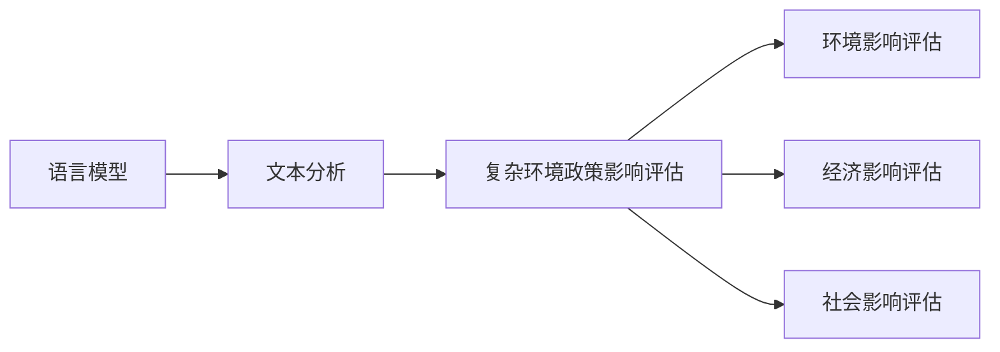

# 语言模型在复杂环境政策影响评估中的应用

> 关键词：语言模型、复杂环境政策、影响评估、自然语言处理、数据分析

> 摘要：本文聚焦于语言模型在复杂环境政策影响评估中的应用。首先介绍了研究的背景、目的、预期读者等内容，阐述了相关核心概念及联系。接着深入探讨了核心算法原理和具体操作步骤，通过Python代码进行详细说明，同时给出了数学模型和公式并举例解释。在项目实战部分，展示了开发环境搭建、源代码实现及解读。分析了语言模型在实际应用场景中的表现，推荐了相关学习资源、开发工具框架和论文著作。最后总结了未来发展趋势与挑战，并给出常见问题解答和参考资料，旨在全面展现语言模型在复杂环境政策影响评估领域的应用价值和潜力。

## 1. 背景介绍 
### 1.1 目的和范围
随着全球对环境保护和可持续发展的关注度不断提高，各种复杂的环境政策不断出台。准确评估这些政策的影响对于政策的制定、调整和优化至关重要。传统的政策影响评估方法往往面临数据获取困难、分析效率低下等问题。语言模型作为自然语言处理领域的重要技术，具有强大的文本理解和分析能力，能够从大量的文本数据中提取有价值的信息，为复杂环境政策影响评估提供新的思路和方法。

本研究的范围主要包括语言模型在环境政策文本分析、政策影响因素挖掘、政策效果预测等方面的应用，旨在探索如何利用语言模型提高复杂环境政策影响评估的准确性和效率。

### 1.2 预期读者
本文的预期读者包括环境政策研究人员、政策制定者、自然语言处理领域的技术人员、数据分析人员以及对环境政策和语言模型应用感兴趣的学者和爱好者。

### 1.3 文档结构概述
本文将按照以下结构展开：首先介绍相关的核心概念和联系，包括语言模型和复杂环境政策影响评估的基本原理和相互关系；接着详细阐述核心算法原理和具体操作步骤，并给出Python代码示例；然后介绍相关的数学模型和公式，并通过实际例子进行说明；在项目实战部分，将展示如何搭建开发环境、实现源代码并进行代码解读；之后分析语言模型在实际应用场景中的表现；推荐相关的学习资源、开发工具框架和论文著作；最后总结未来发展趋势与挑战，给出常见问题解答和参考资料。

### 1.4 术语表
#### 1.4.1 核心术语定义
- **语言模型**：是一种对自然语言文本进行建模的统计模型，用于预测文本中下一个词或字符出现的概率。常见的语言模型包括基于规则的语言模型、统计语言模型和深度学习语言模型。
- **复杂环境政策**：指涉及多个环境因素、多个利益相关者且具有复杂相互关系的环境政策。这些政策通常具有不确定性、动态性和多目标性等特点。
- **政策影响评估**：是指对政策实施后所产生的效果、效益和影响进行全面、系统的评价和分析，以确定政策的合理性、有效性和可持续性。

#### 1.4.2 相关概念解释
- **自然语言处理**：是计算机科学与人工智能领域中的一个重要方向，主要研究如何让计算机理解和处理人类语言。自然语言处理技术包括文本分类、信息抽取、机器翻译、情感分析等。
- **文本挖掘**：是指从大量的文本数据中提取有价值的信息和知识的过程。文本挖掘技术包括文本聚类、文本摘要、关联规则挖掘等。

#### 1.4.3 缩略词列表
- **NLP**：Natural Language Processing，自然语言处理
- **LM**：Language Model，语言模型
- **AI**：Artificial Intelligence，人工智能

## 2. 核心概念与联系 
### 2.1 语言模型原理
语言模型的基本任务是对自然语言文本的概率分布进行建模，即预测给定上下文下下一个词出现的概率。常见的语言模型包括n-gram模型、基于神经网络的语言模型（如循环神经网络RNN、长短期记忆网络LSTM、门控循环单元GRU等）和Transformer架构的语言模型（如BERT、GPT等）。

以n-gram模型为例，它基于马尔可夫假设，即一个词的出现只与它前面的n-1个词有关。n-gram模型的概率计算公式为：

$$P(w_i|w_{i - 1}, w_{i - 2}, \cdots, w_1) \approx P(w_i|w_{i - 1}, w_{i - 2}, \cdots, w_{i - n + 1})$$

其中，$w_i$ 表示第 $i$ 个词，$P(w_i|w_{i - 1}, w_{i - 2}, \cdots, w_{i - n + 1})$ 表示在给定前 $n - 1$ 个词的条件下，第 $i$ 个词出现的概率。

### 2.2 复杂环境政策影响评估原理
复杂环境政策影响评估的目的是全面、客观地评价政策实施后对环境、经济、社会等方面产生的影响。评估过程通常包括确定评估目标、收集相关数据、选择评估方法、进行数据分析和结果评价等步骤。

评估方法可以分为定性评估和定量评估两种。定性评估主要基于专家意见和主观判断，如德尔菲法、头脑风暴法等；定量评估则主要基于数学模型和统计分析，如成本效益分析、投入产出分析等。

### 2.3 语言模型与复杂环境政策影响评估的联系
语言模型可以为复杂环境政策影响评估提供强大的文本分析能力。通过对环境政策文本、相关新闻报道、公众反馈等文本数据进行分析，语言模型可以帮助评估人员提取政策的关键信息、挖掘政策影响因素、分析公众对政策的态度和意见等。

例如，利用语言模型进行文本分类，可以将政策文本分为不同的类别，如环境目标类、政策措施类、监管要求类等；利用信息抽取技术，可以从文本中提取政策的实施主体、实施时间、实施范围等关键信息；利用情感分析技术，可以分析公众对政策的支持或反对态度。

### 2.4 文本示意图
```plaintext
            语言模型
              |
              | 文本分析
              |
  复杂环境政策影响评估
  |----------------------|
  | 环境影响评估         |
  | 经济影响评估         |
  | 社会影响评估         |
  |----------------------|
```

### 2.5 Mermaid流程图


## 3. 核心算法原理 & 具体操作步骤 
### 3.1 基于BERT的文本分类算法原理
BERT（Bidirectional Encoder Representations from Transformers）是一种基于Transformer架构的预训练语言模型，它通过双向的注意力机制学习文本的上下文表示。在文本分类任务中，我们可以在BERT模型的基础上添加一个分类层，将BERT输出的文本表示映射到不同的类别上。

### 3.2 具体操作步骤
1. **数据预处理**：收集环境政策文本数据，并进行清洗、分词等预处理操作。
2. **模型加载**：加载预训练的BERT模型。
3. **数据编码**：将预处理后的文本数据编码为BERT模型可以接受的输入格式。
4. **模型训练**：在编码后的数据上训练BERT分类模型。
5. **模型评估**：使用测试数据对训练好的模型进行评估。
6. **模型预测**：使用训练好的模型对新的环境政策文本进行分类预测。

### 3.3 Python源代码实现
```python
import torch
from torch.utils.data import Dataset, DataLoader
from transformers import BertTokenizer, BertForSequenceClassification, AdamW
from sklearn.model_selection import train_test_split
import pandas as pd

# 定义数据集类
class PolicyDataset(Dataset):
    def __init__(self, texts, labels, tokenizer, max_length):
        self.texts = texts
        self.labels = labels
        self.tokenizer = tokenizer
        self.max_length = max_length

    def __len__(self):
        return len(self.texts)

    def __getitem__(self, idx):
        text = self.texts[idx]
        label = self.labels[idx]
        encoding = self.tokenizer.encode_plus(
            text,
            add_special_tokens=True,
            max_length=self.max_length,
            padding='max_length',
            truncation=True,
            return_tensors='pt'
        )
        return {
            'input_ids': encoding['input_ids'].flatten(),
            'attention_mask': encoding['attention_mask'].flatten(),
            'labels': torch.tensor(label, dtype=torch.long)
        }

# 加载数据
data = pd.read_csv('policy_data.csv')
texts = data['text'].tolist()
labels = data['label'].tolist()

# 划分训练集和测试集
train_texts, test_texts, train_labels, test_labels = train_test_split(texts, labels, test_size=0.2, random_state=42)

# 加载tokenizer和模型
tokenizer = BertTokenizer.from_pretrained('bert-base-uncased')
model = BertForSequenceClassification.from_pretrained('bert-base-uncased', num_labels=len(set(labels)))

# 创建数据集和数据加载器
train_dataset = PolicyDataset(train_texts, train_labels, tokenizer, max_length=128)
test_dataset = PolicyDataset(test_texts, test_labels, tokenizer, max_length=128)
train_dataloader = DataLoader(train_dataset, batch_size=16, shuffle=True)
test_dataloader = DataLoader(test_dataset, batch_size=16, shuffle=False)

# 定义优化器和训练参数
optimizer = AdamW(model.parameters(), lr=2e-5)
device = torch.device('cuda' if torch.cuda.is_available() else 'cpu')
model.to(device)

# 训练模型
num_epochs = 3
for epoch in range(num_epochs):
    model.train()
    total_loss = 0
    for batch in train_dataloader:
        input_ids = batch['input_ids'].to(device)
        attention_mask = batch['attention_mask'].to(device)
        labels = batch['labels'].to(device)

        optimizer.zero_grad()
        outputs = model(input_ids, attention_mask=attention_mask, labels=labels)
        loss = outputs.loss
        loss.backward()
        optimizer.step()
        total_loss += loss.item()
    print(f'Epoch {epoch + 1}, Loss: {total_loss / len(train_dataloader)}')

# 评估模型
model.eval()
correct_predictions = 0
total_predictions = 0
with torch.no_grad():
    for batch in test_dataloader:
        input_ids = batch['input_ids'].to(device)
        attention_mask = batch['attention_mask'].to(device)
        labels = batch['labels'].to(device)

        outputs = model(input_ids, attention_mask=attention_mask)
        logits = outputs.logits
        predictions = torch.argmax(logits, dim=1)
        correct_predictions += (predictions == labels).sum().item()
        total_predictions += labels.size(0)
print(f'Accuracy: {correct_predictions / total_predictions}')
```

## 4. 数学模型和公式 & 详细讲解 & 举例说明 
### 4.1 交叉熵损失函数
在文本分类任务中，常用的损失函数是交叉熵损失函数。交叉熵损失函数用于衡量模型预测的概率分布与真实标签的概率分布之间的差异。

对于一个多分类问题，假设有 $C$ 个类别，模型的预测概率分布为 $\hat{y} = (\hat{y}_1, \hat{y}_2, \cdots, \hat{y}_C)$，真实标签的概率分布为 $y = (y_1, y_2, \cdots, y_C)$，其中 $y_i$ 是一个one-hot向量，只有一个元素为1，其余元素为0。交叉熵损失函数的计算公式为：

$$H(y, \hat{y}) = -\sum_{i = 1}^{C} y_i \log(\hat{y}_i)$$

在实际计算中，我们通常使用softmax函数将模型的输出转换为概率分布。softmax函数的计算公式为：

$$\text{softmax}(z_j) = \frac{e^{z_j}}{\sum_{k = 1}^{C} e^{z_k}}$$

其中，$z_j$ 是模型的第 $j$ 个输出。

### 4.2 举例说明
假设我们有一个三分类问题，模型的输出为 $z = [2, 1, 3]$，真实标签为 $y = [0, 0, 1]$。首先，我们使用softmax函数将模型的输出转换为概率分布：

$$\text{softmax}(z_1) = \frac{e^{2}}{e^{2} + e^{1} + e^{3}} \approx 0.24$$
$$\text{softmax}(z_2) = \frac{e^{1}}{e^{2} + e^{1} + e^{3}} \approx 0.09$$
$$\text{softmax}(z_3) = \frac{e^{3}}{e^{2} + e^{1} + e^{3}} \approx 0.67$$

则预测概率分布为 $\hat{y} = [0.24, 0.09, 0.67]$。然后，我们使用交叉熵损失函数计算损失：

$$H(y, \hat{y}) = - (0 \times \log(0.24) + 0 \times \log(0.09) + 1 \times \log(0.67)) \approx 0.40$$

## 5. 项目实战：代码实际案例和详细解释说明 
### 5.1  开发环境搭建
1. **安装Python**：建议使用Python 3.7及以上版本。可以从Python官方网站（https://www.python.org/downloads/）下载并安装。
2. **安装依赖库**：使用pip命令安装所需的依赖库，包括torch、transformers、pandas、sklearn等。
```sh
pip install torch transformers pandas scikit-learn
```
3. **准备数据**：将环境政策文本数据保存为CSV文件，文件中包含两列：`text` 列存储文本内容，`label` 列存储文本的类别标签。

### 5.2  源代码详细实现和代码解读
```python
import torch
from torch.utils.data import Dataset, DataLoader
from transformers import BertTokenizer, BertForSequenceClassification, AdamW
from sklearn.model_selection import train_test_split
import pandas as pd

# 定义数据集类
class PolicyDataset(Dataset):
    def __init__(self, texts, labels, tokenizer, max_length):
        self.texts = texts
        self.labels = labels
        self.tokenizer = tokenizer
        self.max_length = max_length

    def __len__(self):
        return len(self.texts)

    def __getitem__(self, idx):
        text = self.texts[idx]
        label = self.labels[idx]
        encoding = self.tokenizer.encode_plus(
            text,
            add_special_tokens=True,
            max_length=self.max_length,
            padding='max_length',
            truncation=True,
            return_tensors='pt'
        )
        return {
            'input_ids': encoding['input_ids'].flatten(),
            'attention_mask': encoding['attention_mask'].flatten(),
            'labels': torch.tensor(label, dtype=torch.long)
        }

# 加载数据
data = pd.read_csv('policy_data.csv')
texts = data['text'].tolist()
labels = data['label'].tolist()

# 划分训练集和测试集
train_texts, test_texts, train_labels, test_labels = train_test_split(texts, labels, test_size=0.2, random_state=42)

# 加载tokenizer和模型
tokenizer = BertTokenizer.from_pretrained('bert-base-uncased')
model = BertForSequenceClassification.from_pretrained('bert-base-uncased', num_labels=len(set(labels)))

# 创建数据集和数据加载器
train_dataset = PolicyDataset(train_texts, train_labels, tokenizer, max_length=128)
test_dataset = PolicyDataset(test_texts, test_labels, tokenizer, max_length=128)
train_dataloader = DataLoader(train_dataset, batch_size=16, shuffle=True)
test_dataloader = DataLoader(test_dataset, batch_size=16, shuffle=False)

# 定义优化器和训练参数
optimizer = AdamW(model.parameters(), lr=2e-5)
device = torch.device('cuda' if torch.cuda.is_available() else 'cpu')
model.to(device)

# 训练模型
num_epochs = 3
for epoch in range(num_epochs):
    model.train()
    total_loss = 0
    for batch in train_dataloader:
        input_ids = batch['input_ids'].to(device)
        attention_mask = batch['attention_mask'].to(device)
        labels = batch['labels'].to(device)

        optimizer.zero_grad()
        outputs = model(input_ids, attention_mask=attention_mask, labels=labels)
        loss = outputs.loss
        loss.backward()
        optimizer.step()
        total_loss += loss.item()
    print(f'Epoch {epoch + 1}, Loss: {total_loss / len(train_dataloader)}')

# 评估模型
model.eval()
correct_predictions = 0
total_predictions = 0
with torch.no_grad():
    for batch