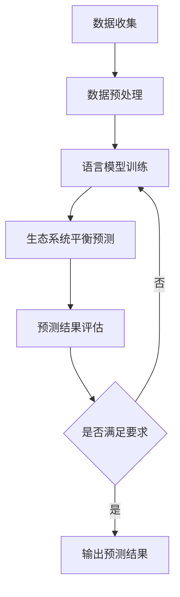

# 语言模型在复杂生态系统平衡预测中的应用

> 关键词：语言模型、复杂生态系统、平衡预测、生态建模、数据驱动预测

> 摘要：本文深入探讨了语言模型在复杂生态系统平衡预测中的应用。首先介绍了相关背景，包括研究目的、预期读者和文档结构等。接着阐述了语言模型和复杂生态系统平衡预测的核心概念及它们之间的联系，并给出了相应的文本示意图和 Mermaid 流程图。详细讲解了核心算法原理，用 Python 代码进行了说明，同时给出了相关数学模型和公式，并举例分析。通过项目实战展示了代码的实际案例及详细解释。还探讨了语言模型在复杂生态系统平衡预测中的实际应用场景，推荐了学习资源、开发工具框架和相关论文著作。最后总结了未来发展趋势与挑战，提供了常见问题解答和扩展阅读参考资料，旨在为相关领域的研究和实践提供全面的技术指导。

## 1. 背景介绍 
### 1.1 目的和范围
随着人类活动对生态系统的影响日益加剧，准确预测复杂生态系统的平衡状态变得至关重要。传统的生态系统预测方法往往依赖于复杂的物理模型和大量的专业知识，这些方法在处理复杂的生态系统时存在一定的局限性。语言模型作为一种强大的人工智能技术，具有强大的文本理解和生成能力。本研究的目的是探索语言模型在复杂生态系统平衡预测中的应用潜力，评估其在该领域的有效性和实用性。

本研究的范围涵盖了常见的复杂生态系统，如森林生态系统、海洋生态系统和草原生态系统等。研究将关注语言模型如何处理生态系统中的各种数据，包括生物多样性数据、环境数据和人类活动数据等，以及如何利用这些数据进行生态系统平衡的预测。

### 1.2 预期读者
本文的预期读者包括生态学家、环境科学家、人工智能研究人员、计算机科学家以及对生态系统预测和人工智能应用感兴趣的专业人士。对于生态学家和环境科学家来说，本文可以为他们提供一种新的研究工具和方法，帮助他们更准确地预测生态系统的变化。对于人工智能研究人员和计算机科学家来说，本文可以为他们开拓新的应用领域，探索语言模型在生态科学中的应用潜力。

### 1.3 文档结构概述
本文将按照以下结构进行组织：
- 核心概念与联系：介绍语言模型和复杂生态系统平衡预测的核心概念，以及它们之间的联系，并给出相应的文本示意图和 Mermaid 流程图。
- 核心算法原理 & 具体操作步骤：详细讲解语言模型在复杂生态系统平衡预测中使用的核心算法原理，并使用 Python 源代码进行说明。
- 数学模型和公式 & 详细讲解 & 举例说明：给出语言模型在复杂生态系统平衡预测中的数学模型和公式，并进行详细讲解和举例分析。
- 项目实战：代码实际案例和详细解释说明：通过一个实际项目案例，展示语言模型在复杂生态系统平衡预测中的代码实现和详细解释。
- 实际应用场景：探讨语言模型在复杂生态系统平衡预测中的实际应用场景。
- 工具和资源推荐：推荐相关的学习资源、开发工具框架和论文著作。
- 总结：未来发展趋势与挑战：总结语言模型在复杂生态系统平衡预测中的未来发展趋势和面临的挑战。
- 附录：常见问题与解答：提供常见问题的解答。
- 扩展阅读 & 参考资料：提供扩展阅读的建议和参考资料。

### 1.4 术语表
#### 1.4.1 核心术语定义
- **语言模型**：一种基于概率统计的模型，用于预测文本序列中下一个可能出现的单词或字符。它通过学习大量的文本数据，捕捉语言的模式和规律。
- **复杂生态系统**：由生物群落及其生存环境共同组成的动态平衡系统，其中包含多个相互作用的生物和非生物成分，具有高度的复杂性和不确定性。
- **生态系统平衡预测**：对生态系统的结构和功能在未来一段时间内的稳定性和变化趋势进行预测的过程。

#### 1.4.2 相关概念解释
- **数据驱动预测**：基于大量的数据和统计分析方法，通过挖掘数据中的模式和规律来进行预测的方法。
- **生态建模**：使用数学模型和计算机模拟技术来描述和分析生态系统的结构和功能的过程。

#### 1.4.3 缩略词列表
- **NLP**：Natural Language Processing，自然语言处理
- **ML**：Machine Learning，机器学习
- **DL**：Deep Learning，深度学习

## 2. 核心概念与联系 
### 核心概念原理
#### 语言模型
语言模型是自然语言处理中的核心技术之一。其基本原理是基于概率论，通过对大量文本数据的学习，估计一个文本序列出现的概率。例如，对于一个文本序列 $w_1, w_2, \cdots, w_n$，语言模型可以计算出 $P(w_1, w_2, \cdots, w_n)$ 的值。常见的语言模型包括 n-gram 模型、神经网络语言模型等。

在神经网络语言模型中，通常使用循环神经网络（RNN）及其变体（如 LSTM、GRU）或Transformer 架构。以 Transformer 为例，它通过多头自注意力机制（Multi-Head Self-Attention）来捕捉文本中不同位置之间的依赖关系。多头自注意力机制可以表示为：

$$
\text{MultiHead}(Q, K, V) = \text{Concat}(\text{head}_1, \cdots, \text{head}_h)W^O
$$

其中，$\text{head}_i = \text{Attention}(QW_i^Q, KW_i^K, VW_i^V)$，$W_i^Q, W_i^K, W_i^V$ 是可学习的权重矩阵，$W^O$ 是输出权重矩阵。

#### 复杂生态系统平衡预测
复杂生态系统平衡预测的核心是理解生态系统中各种生物和非生物因素之间的相互作用关系，并根据这些关系预测生态系统的未来状态。生态系统中的因素包括生物多样性、物种数量、环境因素（如温度、湿度、光照等）和人类活动等。预测的方法通常包括传统的物理模型和数据驱动的方法。

### 架构的文本示意图
语言模型在复杂生态系统平衡预测中的应用架构可以描述如下：

首先，收集生态系统的各种数据，包括生物数据、环境数据和人类活动数据等。这些数据可以以文本、数值等形式存在。然后，对数据进行预处理，包括数据清洗、特征提取等操作。接着，将预处理后的数据输入到语言模型中进行训练。训练好的语言模型可以根据输入的当前生态系统状态数据，预测未来的生态系统平衡状态。最后，对预测结果进行评估和分析，根据评估结果对模型进行调整和优化。

### Mermaid 流程图


## 3. 核心算法原理 & 具体操作步骤 
### 核心算法原理
在复杂生态系统平衡预测中，我们可以使用预训练的语言模型（如 BERT）进行特征提取，然后结合机器学习算法进行预测。具体来说，将生态系统的数据转换为文本序列，输入到 BERT 模型中，获取文本的特征表示。然后，将这些特征输入到分类器（如逻辑回归、支持向量机等）或回归器（如线性回归、随机森林回归等）中进行预测。

### 具体操作步骤
#### 步骤 1：数据收集
收集生态系统的相关数据，包括生物多样性数据（如物种数量、物种分布等）、环境数据（如温度、湿度、光照等）和人类活动数据（如土地利用变化、污染排放等）。

#### 步骤 2：数据预处理
- **数据清洗**：去除数据中的噪声、缺失值和异常值。
- **特征提取**：将数据转换为文本序列。例如，将生物多样性数据表示为“物种 A 数量：x，物种 B 数量：y，...”的形式。
- **文本编码**：使用 BERT 的分词器将文本序列转换为词元（tokens），并将词元转换为对应的索引。

#### 步骤 3：语言模型训练
- **加载预训练的 BERT 模型**：使用 Hugging Face 的 Transformers 库加载预训练的 BERT 模型。
- **微调 BERT 模型**：在生态系统数据上微调 BERT 模型，使其适应生态系统平衡预测的任务。

#### 步骤 4：预测模型训练
- **提取特征**：使用微调后的 BERT 模型对输入的文本序列进行特征提取。
- **训练预测模型**：将提取的特征输入到分类器或回归器中进行训练。

#### 步骤 5：预测和评估
- **预测**：使用训练好的预测模型对新的生态系统数据进行预测。
- **评估**：使用评估指标（如准确率、召回率、均方误差等）对预测结果进行评估。

### Python 源代码
```python
import torch
from transformers import BertTokenizer, BertModel
from sklearn.linear_model import LogisticRegression
from sklearn.model_selection import train_test_split
from sklearn.metrics import accuracy_score

# 步骤 1：数据收集（假设已经收集好数据）
data = [
    "物种 A 数量：10，物种 B 数量：20，温度：25，湿度：60",
    "物种 A 数量：15，物种 B 数量：25，温度：28，湿度：55",
    # 更多数据...
]
labels = [0, 1]  # 假设 0 表示平衡，1 表示不平衡

# 步骤 2：数据预处理
tokenizer = BertTokenizer.from_pretrained('bert-base-uncased')
input_ids = []
attention_masks = []

for text in data:
    encoded_dict = tokenizer.encode_plus(
                        text,                      # 输入文本
                        add_special_tokens = True, # 添加特殊标记 [CLS] 和 [SEP]
                        max_length = 128,           # 最大序列长度
                        pad_to_max_length = True,
                        return_attention_mask = True,   # 返回注意力掩码
                        return_tensors = 'pt',     # 返回 PyTorch 张量
                   )
    
    input_ids.append(encoded_dict['input_ids'])
    attention_masks.append(encoded_dict['attention_mask'])

input_ids = torch.cat(input_ids, dim=0)
attention_masks = torch.cat(attention_masks, dim=0)
labels = torch.tensor(labels)

# 步骤 3：语言模型训练（微调 BERT 模型）
model = BertModel.from_pretrained('bert-base-uncased')
# 这里省略微调过程，实际应用中需要进行微调

# 步骤 4：预测模型训练
# 提取特征
with torch.no_grad():
    outputs = model(input_ids, attention_mask=attention_masks)
    features = outputs[1].numpy()  # 使用 [CLS] 标记的输出作为特征

# 划分训练集和测试集
X_train, X_test, y_train, y_test = train_test_split(features, labels.numpy(), test_size=0.2, random_state=42)

# 训练逻辑回归模型
clf = LogisticRegression()
clf.fit(X_train, y_train)

# 步骤 5：预测和评估
y_pred = clf.predict(X_test)
accuracy = accuracy_score(y_test, y_pred)
print(f"Accuracy: {accuracy}")
```

## 4. 数学模型和公式 & 详细讲解 & 举例说明 
### 数学模型和公式
#### 语言模型的概率模型
对于一个文本序列 $w_1, w_2, \cdots, w_n$，语言模型的概率可以表示为：

$$
P(w_1, w_2, \cdots, w_n) = \prod_{i=1}^{n} P(w_i | w_1, w_2, \cdots, w_{i-1})
$$

在 n-gram 模型中，假设每个单词只依赖于前面的 $n-1$ 个单词，则：

$$
P(w_i | w_1, w_2, \cdots, w_{i-1}) \approx P(w_i | w_{i-(n-1)}, \cdots, w_{i-1})
$$

#### 预测模型的损失函数
在分类问题中，常用的损失函数是交叉熵损失函数。对于二分类问题，交叉熵损失函数可以表示为：

$$
L(y, \hat{y}) = -y \log(\hat{y}) - (1 - y) \log(1 - \hat{y})
$$

其中，$y$ 是真实标签，$\hat{y}$ 是预测的概率。

在回归问题中，常用的损失函数是均方误差（MSE）：

$$
L(y, \hat{y}) = \frac{1}{n} \sum_{i=1}^{n} (y_i - \hat{y}_i)^2
$$

其中，$y_i$ 是真实值，$\hat{y}_i$ 是预测值。

### 详细讲解
#### 语言模型的概率模型
语言模型的概率模型的核心思想是通过估计每个单词在给定前面单词的条件下出现的概率，来计算整个文本序列出现的概率。在 n-gram 模型中，通过简化条件概率的计算，只考虑前面的 $n-1$ 个单词，降低了计算复杂度。

#### 预测模型的损失函数
交叉熵损失函数用于衡量分类模型的预测结果与真实标签之间的差异。当预测结果与真实标签越接近时，交叉熵损失函数的值越小。均方误差损失函数用于衡量回归模型的预测结果与真实值之间的差异，通过计算预测值与真实值的平方差的平均值来评估模型的性能。

### 举例说明
#### 语言模型的概率模型
假设我们有一个简单的文本序列“the dog runs”，在一个三元语法（n=3）模型中，我们可以计算其概率为：

$$
P(\text{the dog runs}) = P(\text{the}) \times P(\text{dog} | \text{the}) \times P(\text{runs} | \text{the dog})
$$

#### 预测模型的损失函数
假设我们有一个二分类问题，真实标签 $y = [1, 0, 1]$，预测的概率 $\hat{y} = [0.8, 0.2, 0.9]$。则交叉熵损失函数的值为：

$$
L(y, \hat{y}) = -\frac{1}{3} \left[ 1 \times \log(0.8) + (1 - 0) \times \log(1 - 0.2) + 1 \times \log(0.9) + (1 - 1) \times \log(1 - 0.9) \right]
$$

假设我们有一个回归问题，真实值 $y = [2, 4, 6]$，预测值 $\hat{y} = [2.1, 3.9, 6.2]$。则均方误差损失函数的值为：

$$
L(y, \hat{y}) = \frac{1}{3} \left[ (2 - 2.1)^2 + (4 - 3.9)^2 + (6 - 6.2)^2 \right]
$$

## 5. 项目实战：代码实际案例和详细解释说明 
### 5.1  开发环境搭建
#### 安装 Python
首先，确保你已经安装了 Python 3.6 或更高版本。你可以从 Python 官方网站（https://www.python.org/downloads/）下载并安装 Python。

#### 安装必要的库
使用以下命令安装必要的库：
```sh
pip install torch transformers scikit-learn
```

### 5.2  源代码详细实现和代码解读
```python
import torch
from transformers import BertTokenizer, BertModel
from sklearn.linear_model import LogisticRegression
from sklearn.model_selection import train_test_split
from sklearn.metrics import accuracy_score

# 步骤 1：数据收集（假设已经收集好数据）
data = [
    "物种 A 数量：10，物种 B 数量：20，温度：25，湿度：60",
    "物种 A 数量：15，物种 B 数量：25，温度：28，湿度：55",
    # 更多数据...
]
labels = [0, 1]  # 假设 0 表示平衡，1 表示不平衡

# 步骤 2：数据预处理
tokenizer = BertTokenizer.from_pretrained('bert-base-uncased')
input_ids = []
attention_masks = []

for text in data:
    encoded_dict = tokenizer.encode_plus(
                        text,                      # 输入文本
                        add_special_tokens = True, # 添加特殊标记 [CLS] 和 [SEP]
                        max_length = 128,           # 最大序列长度
                        pad_to_max_length = True,
                        return_attention_mask = True,   # 返回注意力掩码
                        return_tensors = 'pt',     # 返回 PyTorch 张量
                   )
    
    input_ids.append(encoded_dict['input_ids'])
    attention_masks.append(encoded_dict['attention_mask'])

input_ids = torch.cat(input_ids, dim=0)
attention_masks = torch.cat(attention_masks, dim=0)
labels = torch.tensor(labels)

# 步骤 3：语言模型训练（微调 BERT 模型）
model = BertModel.from_pretrained('bert-base-uncased')
# 这里省略微调过程，实际应用中需要进行微调

# 步骤 4：预测模型训练
# 提取特征
with torch.no_grad():
    outputs = model(input_ids, attention_mask=attention_masks)
    features = outputs[1].numpy()  # 使用 [CLS] 标记的输出作为特征

# 划分训练集和测试集
X_train, X_test, y_train, y_test = train_test_split(features, labels.numpy(), test_size=0.2, random_state=42)

# 训练逻辑回归模型
clf = LogisticRegression()
clf.fit(X_train, y_train)

# 步骤 5：预测和评估
y_pred = clf.predict(X_test)
accuracy = accuracy_score(y_test, y_pred)
print(f"Accuracy: {accuracy}")
```

### 代码解读与分析
#### 数据收集
代码中使用了一个简单的示例数据列表 `data` 和对应的标签列表 `labels`。在实际应用中，需要收集更大量和更全面的生态系统数据。

#### 数据预处理
- 使用 `BertTokenizer` 对文本数据进行分词和编码，将文本转换为词元索引和注意力掩码。
- `add_special_tokens = True` 表示在文本序列的开头和结尾添加特殊标记 `[CLS]` 和 `[SEP]`。
- `pad_to_max_length = True` 表示对序列进行填充，使其长度达到指定的最大长度。

#### 语言模型训练
加载预训练的 BERT 模型，但省略了微调过程。在实际应用中，需要使用生态系统数据对 BERT 模型进行微调，以使其更好地适应任务。

#### 预测模型训练
- 使用 `torch.no_grad()` 上下文管理器来避免在特征提取过程中计算梯度，减少内存消耗。
- 使用 `outputs[1]` 作为特征，即 `[CLS]` 标记的输出。
- 使用 `train_test_split` 函数将数据划分为训练集和测试集。
- 使用 `LogisticRegression` 训练分类模型。

#### 预测和评估
- 使用训练好的逻辑回归模型对测试集进行预测。
- 使用 `accuracy_score` 函数计算预测的准确率。

## 6. 实际应用场景 
### 森林生态系统平衡预测
在森林生态系统中，语言模型可以用于预测森林的健康状况和生物多样性的变化。通过收集森林中的物种数量、树木生长情况、土壤质量、气象数据等信息，并将其转换为文本数据，输入到语言模型中进行训练和预测。例如，预测森林是否会受到病虫害的侵袭、森林的碳汇能力是否会发生变化等。

### 海洋生态系统平衡预测
对于海洋生态系统，语言模型可以帮助预测海洋生物的分布和数量变化、海洋污染的影响等。收集海洋中的水温、盐度、浮游生物数量、渔业捕捞数据等信息，利用语言模型进行分析和预测。例如，预测某一海域是否会出现赤潮现象、某种海洋鱼类的种群数量是否会减少等。

### 草原生态系统平衡预测
在草原生态系统中，语言模型可以用于预测草原的退化情况和载畜量的变化。收集草原的植被覆盖度、土壤肥力、牲畜数量、气候变化等信息，通过语言模型进行平衡预测。例如，预测草原是否会出现沙化现象、草原能够承载的牲畜数量是否需要调整等。

## 7. 工具和资源推荐
### 7.1 学习资源推荐
#### 7.1.1 书籍推荐
- 《自然语言处理入门》：介绍了自然语言处理的基本概念、算法和技术，适合初学者。
- 《深度学习》：全面介绍了深度学习的理论和应用，包括语言模型的相关内容。
- 《生态系统建模与分析》：讲解了生态系统建模的方法和技术，有助于理解复杂生态系统的建模原理。

#### 7.1.2 在线课程
- Coursera 上的“Natural Language Processing Specialization”：提供了自然语言处理的专业课程，包括语言模型的深入学习。
- edX 上的“Deep Learning for Everyone”：适合初学者学习深度学习的基础知识，包括语言模型的应用。
- 中国大学 MOOC 上的“生态系统生态学”：介绍了生态系统的基本概念、结构和功能，以及生态系统平衡预测的相关方法。

#### 7.1.3 技术博客和网站
- Hugging Face 博客：提供了关于自然语言处理和语言模型的最新技术和应用案例。
- Towards Data Science：发布了大量关于数据科学和人工智能的技术文章，包括语言模型在各个领域的应用。
- 生态学报官网：提供了生态科学领域的最新研究成果和学术论文，有助于了解复杂生态系统平衡预测的研究动态。

### 7.2 开发工具框架推荐
#### 7.2.1 IDE和编辑器
- PyCharm：一款专业的 Python 集成开发环境，提供了丰富的代码编辑、调试和分析功能。
- Jupyter Notebook：一种交互式的开发环境，适合进行数据探索、模型训练和可视化分析。
- Visual Studio Code：一款轻量级的代码编辑器，支持多种编程语言和插件扩展，方便进行项目开发。

#### 7.2.2 调试和性能分析工具
- PyTorch Profiler：用于分析 PyTorch 模型的性能，找出性能瓶颈。
- TensorBoard：可以可视化模型的训练过程和性能指标，帮助调试和优化模型。
- Scikit-learn 的 `cross_val_score` 函数：用于进行交叉验证，评估模型的性能和稳定性。

#### 7.2.3 相关框架和库
- Transformers：Hugging Face 开发的自然语言处理框架，提供了多种预训练的语言模型和工具。
- Scikit-learn：一个强大的机器学习库，包含了各种分类、回归和聚类算法，方便进行模型训练和评估。
- PyTorch：一个开源的深度学习框架，支持动态图计算，适合进行语言模型的开发和训练。

### 7.3 相关论文著作推荐
#### 7.3.1 经典论文
- “Attention Is All You Need”：介绍了 Transformer 架构，是现代语言模型的基础。
- “BERT: Pre-training of Deep Bidirectional Transformers for Language Understanding”：提出了 BERT 模型，开创了预训练语言模型的新时代。
- “The Mathematical Theory of Communication”：奠定了信息论的基础，对语言模型的发展产生了深远影响。

#### 7.3.2 最新研究成果
- 关注顶级学术会议（如 ACL、NeurIPS、ICML 等）上发表的关于语言模型和生态系统预测的最新研究论文。
- 关注知名学术期刊（如 Nature、Science、Journal of Artificial Intelligence Research 等）上的相关研究成果。

#### 7.3.3 应用案例分析
- 搜索相关的研究报告和案例分析，了解语言模型在复杂生态系统平衡预测中的实际应用效果和经验教训。

## 8. 总结：未来发展趋势与挑战
### 未来发展趋势
#### 多模态数据融合
未来，语言模型在复杂生态系统平衡预测中将更多地融合多模态数据，如图像、视频、音频等。例如，结合卫星图像和文本数据，更全面地了解生态系统的状况，提高预测的准确性。

#### 强化学习与语言模型的结合
将强化学习与语言模型相结合，可以使模型能够根据生态系统的实时变化动态调整预测策略，提高模型的适应性和灵活性。

#### 跨领域合作
语言模型在复杂生态系统平衡预测中的应用需要跨领域的合作，包括生态学家、环境科学家、计算机科学家等。未来，跨领域的研究团队将更加紧密地合作，共同推动该领域的发展。

### 挑战
#### 数据质量和数量
生态系统数据往往具有噪声大、缺失值多、数据量不足等问题，这会影响语言模型的训练和预测效果。如何提高数据的质量和数量是一个重要的挑战。

#### 模型解释性
语言模型通常是黑盒模型，其预测结果难以解释。在生态系统平衡预测中，需要模型具有良好的解释性，以便生态学家和决策者能够理解模型的预测结果和依据。

#### 计算资源需求
训练和运行大规模的语言模型需要大量的计算资源，这对于一些研究机构和企业来说可能是一个挑战。如何降低计算资源的需求，提高模型的效率是一个亟待解决的问题。

## 9. 附录：常见问题与解答
### 问题 1：语言模型在复杂生态系统平衡预测中的准确性如何？
语言模型的准确性受到多种因素的影响，包括数据质量、模型架构、训练方法等。在实际应用中，需要通过大量的实验和评估来优化模型，提高预测的准确性。一般来说，结合多种数据和模型可以提高预测的准确性。

### 问题 2：如何选择合适的语言模型？
选择合适的语言模型需要考虑多个因素，如数据规模、任务复杂度、计算资源等。对于小规模数据和简单任务，可以选择较小的预训练模型，如 DistilBERT。对于大规模数据和复杂任务，可以选择较大的预训练模型，如 GPT-3。同时，还可以根据任务的特点对预训练模型进行微调。

### 问题 3：语言模型在复杂生态系统平衡预测中的应用是否会受到生态系统的不确定性影响？
生态系统具有高度的不确定性，这会对语言模型的预测结果产生一定的影响。为了应对这种不确定性，可以采用集成学习的方法，结合多个模型的预测结果，提高预测的稳定性。同时，也可以引入概率模型，对预测结果进行不确定性分析。

## 10. 扩展阅读 & 参考资料
### 扩展阅读
- 《人工智能与生态保护》：探讨了人工智能技术在生态保护中的应用和挑战。
- 《复杂系统科学》：介绍了复杂系统的基本概念、理论和方法，有助于深入理解复杂生态系统的本质。
- 《数据驱动的生态系统建模》：详细讲解了数据驱动方法在生态系统建模中的应用。

### 参考资料
- Hugging Face 官方文档：https://huggingface.co/docs
- Scikit-learn 官方文档：https://scikit-learn.org/stable/documentation.html
- PyTorch 官方文档：https://pytorch.org/docs/stable/index.html

作者：AI天才研究院/AI Genius Institute & 禅与计算机程序设计艺术 /Zen And The Art of Computer Programming