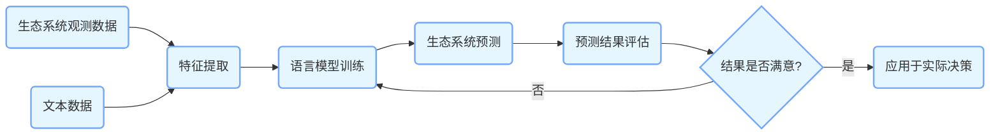

# 语言模型在复杂生态系统预测中的应用分析

> 关键词：语言模型、复杂生态系统预测、应用分析、生态建模、机器学习

> 摘要：本文旨在深入探讨语言模型在复杂生态系统预测中的应用。首先介绍了相关背景知识，包括研究目的、预期读者和文档结构等。接着阐述了语言模型和复杂生态系统的核心概念及它们之间的联系，并给出了相应的文本示意图和 Mermaid 流程图。详细讲解了语言模型用于生态系统预测的核心算法原理，结合 Python 代码进行说明。分析了其中涉及的数学模型和公式，并举例说明。通过项目实战展示了如何使用语言模型进行生态系统预测，包括开发环境搭建、源代码实现及解读。探讨了语言模型在复杂生态系统预测中的实际应用场景，推荐了相关的学习资源、开发工具框架和论文著作。最后总结了未来发展趋势与挑战，解答了常见问题，并提供了扩展阅读和参考资料。

## 1. 背景介绍 
### 1.1 目的和范围
随着生态环境问题的日益严峻，准确预测复杂生态系统的变化对于生态保护、资源管理和可持续发展至关重要。传统的生态系统预测方法往往面临数据处理能力有限、难以捕捉复杂关系等挑战。语言模型作为一种强大的人工智能技术，具有处理自然语言和挖掘数据模式的能力，为复杂生态系统预测提供了新的思路和方法。本文的目的是全面分析语言模型在复杂生态系统预测中的应用，探讨其优势、局限性和应用前景。研究范围涵盖了常见的语言模型类型，如基于规则的语言模型、统计语言模型和深度学习语言模型，以及多种复杂生态系统，包括森林生态系统、海洋生态系统和城市生态系统等。

### 1.2 预期读者
本文的预期读者包括生态学家、环境科学家、人工智能研究者、数据分析师以及对生态系统预测和语言模型应用感兴趣的相关专业人士。生态学家和环境科学家可以从中了解如何利用语言模型来提高生态系统预测的准确性和效率；人工智能研究者可以关注语言模型在生态领域的应用拓展和技术创新；数据分析师可以学习如何处理和分析生态系统相关的数据；而对该领域感兴趣的读者可以获得全面的知识和深入的理解。

### 1.3 文档结构概述
本文共分为十个部分。第一部分为背景介绍，阐述了研究的目的、预期读者和文档结构。第二部分介绍了语言模型和复杂生态系统的核心概念及其联系，并给出了相应的示意图和流程图。第三部分详细讲解了语言模型用于生态系统预测的核心算法原理，结合 Python 代码进行说明。第四部分分析了其中涉及的数学模型和公式，并举例说明。第五部分通过项目实战展示了如何使用语言模型进行生态系统预测，包括开发环境搭建、源代码实现及解读。第六部分探讨了语言模型在复杂生态系统预测中的实际应用场景。第七部分推荐了相关的学习资源、开发工具框架和论文著作。第八部分总结了未来发展趋势与挑战。第九部分解答了常见问题。第十部分提供了扩展阅读和参考资料。

### 1.4 术语表
#### 1.4.1 核心术语定义
- **语言模型**：是一种对语言进行建模的概率模型，用于预测一个词序列出现的概率。它可以根据已有的文本数据学习语言的模式和规律，从而对未知的文本进行预测和生成。
- **复杂生态系统**：是由生物群落及其生存环境共同组成的动态平衡系统，具有高度的复杂性、多样性和非线性特征。生态系统中的生物和非生物因素之间相互作用、相互影响，形成了复杂的生态网络。
- **生态系统预测**：是指根据生态系统的历史数据和当前状态，运用一定的方法和模型，对生态系统未来的发展趋势和变化进行预测和评估。

#### 1.4.2 相关概念解释
- **深度学习**：是一种基于人工神经网络的机器学习方法，通过构建多层神经网络来自动学习数据的特征和模式。深度学习在自然语言处理、图像识别等领域取得了显著的成果。
- **自然语言处理**：是人工智能的一个重要分支，主要研究如何让计算机理解和处理人类语言。自然语言处理技术包括文本分类、情感分析、机器翻译等。
- **生态建模**：是指运用数学模型和计算机模拟技术，对生态系统的结构、功能和动态进行描述和分析的过程。生态建模可以帮助我们更好地理解生态系统的运行机制，预测生态系统的变化。

#### 1.4.3 缩略词列表
- **NLP**：Natural Language Processing，自然语言处理
- **DNN**：Deep Neural Network，深度神经网络
- **RNN**：Recurrent Neural Network，循环神经网络
- **LSTM**：Long Short-Term Memory，长短期记忆网络
- **GRU**：Gated Recurrent Unit，门控循环单元

## 2. 核心概念与联系 
### 核心概念原理
#### 语言模型原理
语言模型的核心目标是计算一个词序列 $w_1, w_2, \cdots, w_n$ 出现的概率 $P(w_1, w_2, \cdots, w_n)$。根据链式法则，这个概率可以表示为：

$$P(w_1, w_2, \cdots, w_n) = P(w_1)P(w_2|w_1)P(w_3|w_1, w_2) \cdots P(w_n|w_1, w_2, \cdots, w_{n-1})$$

在实际应用中，为了简化计算，通常采用 n-gram 模型，即假设一个词的出现只与它前面的 $n-1$ 个词有关。例如，二元语法（bigram）模型假设 $P(w_i|w_1, w_2, \cdots, w_{i-1}) \approx P(w_i|w_{i-1})$，则词序列的概率可以近似表示为：

$$P(w_1, w_2, \cdots, w_n) \approx \prod_{i=1}^{n} P(w_i|w_{i-1})$$

深度学习语言模型，如基于循环神经网络（RNN）及其变体（LSTM、GRU）和Transformer架构的模型，通过学习大量的文本数据，自动提取语言的特征和模式，从而能够更准确地预测词序列的概率。

#### 复杂生态系统原理
复杂生态系统是一个由生物群落和非生物环境相互作用形成的复杂网络。生态系统中的生物包括植物、动物和微生物，它们通过食物链、竞争、共生等关系相互联系。非生物环境包括气候、土壤、水分等因素，这些因素影响着生物的生存和繁衍。生态系统具有自我调节和自我修复的能力，但当受到外界干扰时，可能会发生失衡和崩溃。

生态系统的动态变化可以用状态变量和状态转移方程来描述。状态变量表示生态系统在某一时刻的状态，如物种数量、生物量等；状态转移方程描述了状态变量随时间的变化规律。由于生态系统的复杂性和非线性特征，准确描述和预测生态系统的动态变化是一个具有挑战性的问题。

### 架构的文本示意图
```plaintext
语言模型与复杂生态系统预测架构

数据层：
- 生态系统观测数据（如物种数量、环境参数等）
- 文本数据（如生态研究报告、文献等）

特征提取层：
- 对生态数据进行预处理和特征提取
- 对文本数据进行分词、词性标注等处理

语言模型层：
- 选择合适的语言模型（如 LSTM、Transformer 等）
- 训练语言模型，学习生态数据和文本数据的模式

预测层：
- 根据训练好的语言模型，对生态系统的未来状态进行预测
- 评估预测结果的准确性和可靠性

应用层：
- 将预测结果应用于生态保护、资源管理等领域
```

### Mermaid 流程图


## 3. 核心算法原理 & 具体操作步骤 
### 核心算法原理
在复杂生态系统预测中，我们可以使用基于 LSTM 的语言模型。LSTM 是一种特殊的循环神经网络，能够有效地处理序列数据中的长距离依赖关系。LSTM 单元包含输入门、遗忘门和输出门，通过这些门控机制，LSTM 可以选择性地记忆和遗忘历史信息。

LSTM 单元的输入包括当前时刻的输入 $x_t$ 和上一时刻的隐藏状态 $h_{t-1}$，输出为当前时刻的隐藏状态 $h_t$。具体的计算过程如下：

1. 遗忘门 $f_t$：决定上一时刻的细胞状态 $C_{t-1}$ 中哪些信息需要被遗忘。

$$f_t = \sigma(W_f [h_{t-1}, x_t] + b_f)$$

其中，$W_f$ 是遗忘门的权重矩阵，$b_f$ 是遗忘门的偏置向量，$\sigma$ 是 sigmoid 函数。

2. 输入门 $i_t$：决定当前时刻的输入 $x_t$ 中哪些信息需要被更新到细胞状态 $C_t$ 中。

$$i_t = \sigma(W_i [h_{t-1}, x_t] + b_i)$$

$$\tilde{C}_t = \tanh(W_C [h_{t-1}, x_t] + b_C)$$

其中，$W_i$ 和 $W_C$ 分别是输入门和候选细胞状态的权重矩阵，$b_i$ 和 $b_C$ 分别是输入门和候选细胞状态的偏置向量，$\tanh$ 是双曲正切函数。

3. 更新细胞状态 $C_t$：根据遗忘门和输入门的输出，更新细胞状态。

$$C_t = f_t \odot C_{t-1} + i_t \odot \tilde{C}_t$$

其中，$\odot$ 表示逐元素相乘。

4. 输出门 $o_t$：决定当前时刻的细胞状态 $C_t$ 中哪些信息需要被输出到隐藏状态 $h_t$ 中。

$$o_t = \sigma(W_o [h_{t-1}, x_t] + b_o)$$

$$h_t = o_t \odot \tanh(C_t)$$

其中，$W_o$ 是输出门的权重矩阵，$b_o$ 是输出门的偏置向量。

### 具体操作步骤
以下是使用 Python 和 PyTorch 实现基于 LSTM 的复杂生态系统预测的具体操作步骤：

```python
import torch
import torch.nn as nn
import numpy as np

# 1. 数据准备
# 假设我们有生态系统的时间序列数据，这里简单生成一些示例数据
data = np.random.randn(100, 5)  # 100 个时间步，每个时间步有 5 个特征
train_size = int(0.8 * len(data))
train_data = data[:train_size]
test_data = data[train_size:]

# 将数据转换为 PyTorch 张量
train_data = torch.tensor(train_data, dtype=torch.float32)
test_data = torch.tensor(test_data, dtype=torch.float32)

# 2. 定义 LSTM 模型
class LSTMModel(nn.Module):
    def __init__(self, input_size, hidden_size, output_size):
        super(LSTMModel, self).__init__()
        self.lstm = nn.LSTM(input_size, hidden_size, batch_first=True)
        self.fc = nn.Linear(hidden_size, output_size)

    def forward(self, x):
        out, _ = self.lstm(x)
        out = self.fc(out[:, -1, :])
        return out

# 初始化模型
input_size = 5
hidden_size = 32
output_size = 5
model = LSTMModel(input_size, hidden_size, output_size)

# 3. 定义损失函数和优化器
criterion = nn.MSELoss()
optimizer = torch.optim.Adam(model.parameters(), lr=0.001)

# 4. 训练模型
num_epochs = 100
for epoch in range(num_epochs):
    optimizer.zero_grad()
    outputs = model(train_data.unsqueeze(0))
    loss = criterion(outputs, train_data[-1].unsqueeze(0))
    loss.backward()
    optimizer.step()

    if (epoch + 1) % 10 == 0:
        print(f'Epoch [{epoch+1}/{num_epochs}], Loss: {loss.item():.4f}')

# 5. 模型评估
with torch.no_grad():
    test_outputs = model(test_data.unsqueeze(0))
    test_loss = criterion(test_outputs, test_data[-1].unsqueeze(0))
    print(f'Test Loss: {test_loss.item():.4f}')
```

### 代码解释
1. **数据准备**：首先生成了一些示例的生态系统时间序列数据，并将其划分为训练集和测试集。然后将数据转换为 PyTorch 张量。
2. **定义 LSTM 模型**：定义了一个简单的 LSTM 模型，包含一个 LSTM 层和一个全连接层。
3. **定义损失函数和优化器**：使用均方误差损失函数（MSE）和 Adam 优化器。
4. **训练模型**：在训练过程中，通过前向传播计算模型的输出，然后计算损失并进行反向传播更新模型参数。
5. **模型评估**：在测试集上评估模型的性能，计算测试损失。

## 4. 数学模型和公式 & 详细讲解 & 举例说明 
### 数学模型和公式
在复杂生态系统预测中，我们可以使用时间序列模型来描述生态系统的动态变化。假设生态系统的状态变量为 $x_t$，它是一个 $d$ 维向量，表示生态系统在时刻 $t$ 的状态。我们可以使用自回归积分滑动平均模型（ARIMA）来预测生态系统的未来状态。

ARIMA(p, d, q) 模型的一般形式为：

$$\phi(B)(1 - B)^d x_t = \theta(B) \epsilon_t$$

其中，$\phi(B) = 1 - \phi_1 B - \phi_2 B^2 - \cdots - \phi_p B^p$ 是自回归多项式，$\theta(B) = 1 + \theta_1 B + \theta_2 B^2 + \cdots + \theta_q B^q$ 是滑动平均多项式，$B$ 是后移算子，即 $B x_t = x_{t-1}$，$(1 - B)^d$ 表示对 $x_t$ 进行 $d$ 阶差分，$\epsilon_t$ 是白噪声序列。

### 详细讲解
- **自回归部分（AR）**：自回归部分表示当前时刻的状态 $x_t$ 与过去 $p$ 个时刻的状态 $x_{t-1}, x_{t-2}, \cdots, x_{t-p}$ 之间的线性关系。系数 $\phi_1, \phi_2, \cdots, \phi_p$ 表示这些过去状态对当前状态的影响程度。
- **差分部分（I）**：差分部分用于处理非平稳时间序列。通过对时间序列进行 $d$ 阶差分，可以将非平稳时间序列转换为平稳时间序列。
- **滑动平均部分（MA）**：滑动平均部分表示当前时刻的状态 $x_t$ 与过去 $q$ 个时刻的白噪声 $\epsilon_{t-1}, \epsilon_{t-2}, \cdots, \epsilon_{t-q}$ 之间的线性关系。系数 $\theta_1, \theta_2, \cdots, \theta_q$ 表示这些白噪声对当前状态的影响程度。

### 举例说明
假设我们有一个简单的生态系统，其状态变量 $x_t$ 表示某一物种的数量。我们收集了该物种在过去 10 个时间步的数量数据：$x_1 = 10, x_2 = 12, x_3 = 15, x_4 = 18, x_5 = 20, x_6 = 22, x_7 = 25, x_8 = 28, x_9 = 30, x_{10} = 32$。

我们可以使用 ARIMA(1, 1, 1) 模型来预测该物种在未来一个时间步的数量。首先，对数据进行一阶差分：

$$\Delta x_t = x_t - x_{t-1}$$

得到差分后的数据：$\Delta x_2 = 2, \Delta x_3 = 3, \Delta x_4 = 3, \Delta x_5 = 2, \Delta x_6 = 2, \Delta x_7 = 3, \Delta x_8 = 3, \Delta x_9 = 2, \Delta x_{10} = 2$。

然后，使用差分后的数据拟合 ARIMA(1, 1, 1) 模型，得到自回归系数 $\phi_1$ 和滑动平均系数 $\theta_1$。假设拟合得到 $\phi_1 = 0.5$，$\theta_1 = 0.3$。

最后，根据 ARIMA 模型的公式预测未来一个时间步的差分 $\Delta x_{11}$：

$$\Delta x_{11} = \phi_1 \Delta x_{10} + \theta_1 \epsilon_{10}$$

假设 $\epsilon_{10} = 0$，则 $\Delta x_{11} = 0.5 \times 2 = 1$。

再根据差分的定义，预测未来一个时间步的物种数量 $x_{11}$：

$$x_{11} = x_{10} + \Delta x_{11} = 32 + 1 = 33$$

## 5. 项目实战：代码实际案例和详细解释说明 
### 5.1  开发环境搭建
#### 安装 Python
首先，需要安装 Python 3.x 版本。可以从 Python 官方网站（https://www.python.org/downloads/）下载适合自己操作系统的安装包，并按照安装向导进行安装。

#### 安装必要的库
使用以下命令安装项目所需的库：

```bash
pip install torch numpy pandas matplotlib scikit-learn
```

- **torch**：用于构建和训练深度学习模型。
- **numpy**：用于处理数值计算。
- **pandas**：用于数据处理和分析。
- **matplotlib**：用于数据可视化。
- **scikit-learn**：用于数据预处理和模型评估。

### 5.2  源代码详细实现和代码解读
```python
import torch
import torch.nn as nn
import numpy as np
import pandas as pd
import matplotlib.pyplot as plt
from sklearn.preprocessing import MinMaxScaler

# 1. 数据加载和预处理
data = pd.read_csv('ecosystem_data.csv')  # 假设数据存储在 CSV 文件中
target_variable = data['target_variable'].values.reshape(-1, 1)

# 数据归一化
scaler = MinMaxScaler()
target_variable = scaler.fit_transform(target_variable)

# 划分训练集和测试集
train_size = int(0.8 * len(target_variable))
train_data = target_variable[:train_size]
test_data = target_variable[train_size:]

# 创建时间序列数据集
def create_sequences(data, seq_length):
    xs = []
    ys = []
    for i in range(len(data) - seq_length):
        x = data[i:i+seq_length]
        y = data[i+seq_length]
        xs.append(x)
        ys.append(y)
    return np.array(xs), np.array(ys)

seq_length = 10
X_train, y_train = create_sequences(train_data, seq_length)
X_test, y_test = create_sequences(test_data, seq_length)

# 将数据转换为 PyTorch 张量
X_train = torch.tensor(X_train, dtype=torch.float32)
y_train = torch.tensor(y_train, dtype=torch.float32)
X_test = torch.tensor(X_test, dtype=torch.float32)
y_test = torch.tensor(y_test, dtype=torch.float32)

# 2. 定义 LSTM 模型
class LSTMModel(nn.Module):
    def __init__(self, input_size, hidden_size, output_size):
        super(LSTMModel, self).__init__()
        self.lstm = nn.LSTM(input_size, hidden_size, batch_first=True)
        self.fc = nn.Linear(hidden_size, output_size)

    def forward(self, x):
        out, _ = self.lstm(x)
        out = self.fc(out[:, -1, :])
        return out

# 初始化模型
input_size = 1
hidden_size = 32
output_size = 1
model = LSTMModel(input_size, hidden_size, output_size)

# 3. 定义损失函数和优化器
criterion = nn.MSELoss()
optimizer = torch.optim.Adam(model.parameters(), lr=0.001)

# 4. 训练模型
num_epochs = 100
train_losses = []
for epoch in range(num_epochs):
    optimizer.zero_grad()
    outputs = model(X_train)
    loss = criterion(outputs, y_train)
    loss.backward()
    optimizer.step()

    train_losses.append(loss.item())
    if (epoch + 1) % 10 == 0:
        print(f'Epoch [{epoch+1}/{num_epochs}], Loss: {loss.item():.4f}')

# 5. 模型评估
with torch.no_grad():
    test_outputs = model(X_test)
    test_loss = criterion(test_outputs, y_test)
    print(f'Test Loss: {test_loss.item():.4f}')

# 6. 可视化结果
train_predictions = model(X_train).detach().numpy()
test_predictions = model(X_test).detach().numpy()

train_predictions = scaler.inverse_transform(train_predictions)
test_predictions = scaler.inverse_transform(test_predictions)
train_data = scaler.inverse_transform(train_data)
test_data = scaler.inverse_transform(test_data)

plt.figure(figsize=(12, 6))
plt.plot(np.arange(seq_length, len(train_data)), train_predictions, label='Train Predictions')
plt.plot(np.arange(len(train_data), len(train_data) + len(test_data) - seq_length), test_predictions, label='Test Predictions')
plt.plot(np.arange(len(target_variable)), scaler.inverse_transform(target_variable), label='Actual Data')
plt.xlabel('Time Step')
plt.ylabel('Target Variable')
plt.title('Ecosystem Prediction using LSTM')
plt.legend()
plt.show()
```

### 5.3  代码解读与分析
1. **数据加载和预处理**：
    - 使用 `pandas` 库读取存储在 CSV 文件中的生态系统数据。
    - 使用 `MinMaxScaler` 对目标变量进行归一化处理，将数据缩放到 [0, 1] 区间。
    - 划分训练集和测试集，比例为 8:2。
    - 使用 `create_sequences` 函数将时间序列数据转换为适合 LSTM 模型输入的格式，每个样本包含 `seq_length` 个时间步的历史数据和一个目标值。

2. **定义 LSTM 模型**：
    - 定义一个简单的 LSTM 模型，包含一个 LSTM 层和一个全连接层。
    - `input_size` 表示输入特征的维度，`hidden_size` 表示 LSTM 隐藏层的维度，`output_size` 表示输出特征的维度。

3. **定义损失函数和优化器**：
    - 使用均方误差损失函数（MSE）来衡量模型的预测结果与真实值之间的误差。
    - 使用 Adam 优化器来更新模型的参数。

4. **训练模型**：
    - 在每个 epoch 中，通过前向传播计算模型的输出，然后计算损失并进行反向传播更新模型参数。
    - 记录每个 epoch 的训练损失，并每 10 个 epoch 打印一次损失值。

5. **模型评估**：
    - 在测试集上评估模型的性能，计算测试损失。

6. **可视化结果**：
    - 将模型的预测结果和真实值进行反归一化处理，恢复到原始数据的尺度。
    - 使用 `matplotlib` 库绘制训练预测结果、测试预测结果和真实数据的曲线，直观展示模型的性能。

## 6. 实际应用场景 
### 森林生态系统预测
在森林生态系统中，语言模型可以用于预测森林火灾的发生概率、森林病虫害的传播趋势和森林植被的生长变化等。例如，通过分析历史的气象数据、森林植被数据和火灾记录等文本信息，语言模型可以学习到火灾发生的模式和规律，从而对未来的火灾风险进行预测。同时，语言模型还可以分析森林病虫害的相关文献和监测数据，预测病虫害的传播路径和影响范围，为森林保护和管理提供决策支持。

### 海洋生态系统预测
在海洋生态系统中，语言模型可以用于预测海洋温度的变化、海洋生物的迁徙规律和海洋污染的扩散趋势等。例如，通过分析海洋气象数据、海洋生物监测数据和海洋污染报告等文本信息，语言模型可以学习到海洋生态系统的动态变化规律，从而对未来的海洋环境变化进行预测。此外，语言模型还可以帮助研究人员分析海洋生物的行为模式和生态需求，为海洋生物保护和可持续利用提供科学依据。

### 城市生态系统预测
在城市生态系统中，语言模型可以用于预测城市空气质量的变化、城市绿地的生态效益和城市热岛效应的强度等。例如，通过分析城市气象数据、空气质量监测数据和城市规划文献等文本信息，语言模型可以学习到城市生态系统的运行机制，从而对未来的城市环境质量进行预测。同时，语言模型还可以帮助城市规划者评估城市绿地的布局和设计方案，优化城市生态环境，提高居民的生活质量。

## 7. 工具和资源推荐
### 7.1 学习资源推荐
#### 7.1.1 书籍推荐
- 《深度学习》（Deep Learning）：由 Ian Goodfellow、Yoshua Bengio 和 Aaron Courville 所著，是深度学习领域的经典教材，涵盖了深度学习的基本概念、算法和应用。
- 《自然语言处理入门》（Natural Language Processing with Python）：由 Steven Bird、Ewan Klein 和 Edward Loper 所著，介绍了使用 Python 进行自然语言处理的基本方法和技术。
- 《生态建模与预测》（Ecological Modeling and Prediction）：由 Marc Mangel 和 Colin W. Clark 所著，系统介绍了生态建模的基本原理和方法，以及如何使用模型进行生态系统预测。

#### 7.1.2 在线课程
- Coursera 上的“深度学习专项课程”（Deep Learning Specialization）：由 Andrew Ng 教授授课，全面介绍了深度学习的理论和实践。
- edX 上的“自然语言处理基础”（Foundations of Natural Language Processing）：由 Carnegie Mellon University 提供，深入讲解了自然语言处理的核心概念和技术。
- Udemy 上的“生态系统建模与模拟”（Ecosystem Modeling and Simulation）：介绍了生态系统建模的基本方法和工具，以及如何使用模型进行生态系统预测和管理。

#### 7.1.3 技术博客和网站
- Medium 上的“Towards Data Science”：是一个专注于数据科学和人工智能的技术博客平台，提供了大量关于语言模型、生态建模等方面的优质文章。
- arXiv.org：是一个预印本论文库，包含了最新的学术研究成果，特别是在人工智能和生态学领域。
- Kaggle：是一个数据科学竞赛平台，提供了丰富的数据集和开源代码，可用于学习和实践语言模型在生态系统预测中的应用。

### 7.2 开发工具框架推荐
#### 7.2.1 IDE和编辑器
- PyCharm：是一款专门为 Python 开发设计的集成开发环境（IDE），具有代码编辑、调试、版本控制等功能，适合开发大型的 Python 项目。
- Jupyter Notebook：是一个交互式的开发环境，支持代码、文本、图像等多种形式的展示，非常适合进行数据探索和模型实验。
- Visual Studio Code：是一款轻量级的代码编辑器，支持多种编程语言和插件扩展，可用于快速开发和调试 Python 代码。

#### 7.2.2 调试和性能分析工具
- PyTorch Profiler：是 PyTorch 提供的性能分析工具，可以帮助开发者分析模型的训练和推理过程中的性能瓶颈，优化代码性能。
- TensorBoard：是 TensorFlow 提供的可视化工具，也可以与 PyTorch 集成使用，用于可视化模型的训练过程、损失曲线等信息。
- cProfile：是 Python 标准库中的性能分析模块，可以帮助开发者分析代码的运行时间和函数调用次数，找出性能瓶颈。

#### 7.2.3 相关框架和库
- PyTorch：是一个开源的深度学习框架，提供了丰富的神经网络层和优化算法，支持 GPU 加速，适合开发和训练语言模型。
- TensorFlow：是另一个广泛使用的深度学习框架，具有强大的分布式训练和部署能力，也提供了丰富的工具和库用于自然语言处理。
- NLTK（Natural Language Toolkit）：是一个用于自然语言处理的 Python 库，提供了丰富的语料库和工具，可用于文本预处理、词性标注、命名实体识别等任务。

### 7.3 相关论文著作推荐
#### 7.3.1 经典论文
- “Attention Is All You Need”：提出了 Transformer 架构，是自然语言处理领域的重要突破，为后续的语言模型发展奠定了基础。
- “Long Short-Term Memory”：介绍了 LSTM 模型的原理和应用，解决了传统循环神经网络中的梯度消失和梯度爆炸问题。
- “An Introduction to Hidden Markov Models”：介绍了隐马尔可夫模型的基本概念和算法，是自然语言处理和语音识别领域的经典论文。

#### 7.3.2 最新研究成果
- 关注 arXiv.org 上的最新论文，特别是关于语言模型在生态系统预测中的应用、生态建模的新方法和技术等方面的研究。
- 参加相关的学术会议，如 NeurIPS（神经信息处理系统大会）、ICML（国际机器学习会议）和 ESA（生态学会年会）等，了解最新的研究动态和成果。

#### 7.3.3 应用案例分析
- 查阅相关的学术期刊和报告，如《Ecology》、《Journal of Applied Ecology》和《Nature Communications》等，了解语言模型在实际生态系统预测中的应用案例和效果评估。
- 参考政府和科研机构发布的生态保护和管理报告，了解语言模型在生态决策中的应用实践和经验教训。

## 8. 总结：未来发展趋势与挑战
### 未来发展趋势
- **多模态融合**：未来的语言模型将不仅仅依赖于文本数据，还将融合图像、音频、视频等多模态数据，以更全面地描述和理解复杂生态系统。例如，结合卫星图像和气象数据，语言模型可以更准确地预测森林火灾的发生和蔓延。
- **强化学习与语言模型的结合**：强化学习可以让语言模型在与环境的交互中不断学习和优化，从而更好地应对复杂生态系统中的不确定性和动态变化。例如，使用强化学习训练语言模型来优化生态系统的管理策略。
- **跨学科合作**：语言模型在复杂生态系统预测中的应用需要生态学家、计算机科学家、数学家等多学科的合作。未来，跨学科的研究团队将不断涌现，推动语言模型在生态领域的应用和发展。

### 挑战
- **数据质量和数量**：复杂生态系统的数据往往具有高维度、非线性、噪声大等特点，且数据的收集和标注成本较高。因此，如何提高数据的质量和数量，以及如何处理和分析这些复杂的数据，是语言模型在生态系统预测中面临的重要挑战。
- **模型可解释性**：深度学习语言模型通常是黑盒模型，难以解释其决策过程和结果。在生态系统预测中，模型的可解释性非常重要，因为决策者需要了解模型的预测依据和可靠性。因此，如何提高语言模型的可解释性，是当前研究的热点和难点。
- **模型泛化能力**：复杂生态系统具有高度的复杂性和多样性，不同的生态系统可能具有不同的特征和规律。因此，如何提高语言模型的泛化能力，使其能够在不同的生态系统中都能取得良好的预测效果，是需要解决的问题。

## 9. 附录：常见问题与解答
### 问题 1：语言模型在复杂生态系统预测中的准确性如何？
语言模型在复杂生态系统预测中的准确性受到多种因素的影响，如数据质量、模型结构、训练方法等。在实际应用中，需要通过大量的实验和验证来评估模型的准确性，并不断优化模型和数据处理方法，以提高预测的准确性。

### 问题 2：如何选择适合的语言模型用于复杂生态系统预测？
选择适合的语言模型需要考虑多个因素，如数据类型、数据规模、预测任务的复杂度等。一般来说，对于小规模的数据和简单的预测任务，可以选择基于规则或统计的语言模型；对于大规模的数据和复杂的预测任务，深度学习语言模型如 LSTM、Transformer 等可能更合适。

### 问题 3：语言模型在复杂生态系统预测中的应用是否会取代传统的生态建模方法？
语言模型在复杂生态系统预测中具有一定的优势，但不会完全取代传统的生态建模方法。传统的生态建模方法基于生态学原理和理论，具有较强的可解释性和生物学意义；而语言模型则更擅长处理大规模的数据和挖掘数据中的模式和规律。在实际应用中，可以将两者结合起来，发挥各自的优势，提高生态系统预测的准确性和可靠性。

### 问题 4：如何处理复杂生态系统数据中的噪声和缺失值？
处理复杂生态系统数据中的噪声和缺失值可以采用多种方法。对于噪声数据，可以使用滤波、平滑等方法进行处理；对于缺失值，可以使用插值、填充等方法进行处理。此外，还可以使用机器学习算法来预测缺失值，如基于决策树、神经网络等方法。

## 10. 扩展阅读 & 参考资料
### 扩展阅读
- 《人工智能时代的生态保护》：探讨了人工智能技术在生态保护中的应用和发展前景。
- 《复杂系统科学与生态建模》：介绍了复杂系统科学的基本概念和方法，以及如何应用于生态建模和预测。
- 《自然语言处理前沿技术》：介绍了自然语言处理领域的最新研究成果和技术趋势。

### 参考资料
- Goodfellow, I., Bengio, Y., & Courville, A. (2016). Deep Learning. MIT Press.
- Bird, S., Klein, E., & Loper, E. (2009). Natural Language Processing with Python. O'Reilly Media.
- Mangel, M., & Clark, C. W. (1988). Dynamic Modeling in Behavioral Ecology. Princeton University Press.

作者：AI天才研究院/AI Genius Institute & 禅与计算机程序设计艺术 /Zen And The Art of Computer Programming