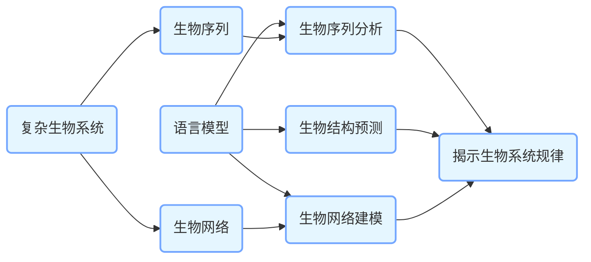

# 语言模型在复杂生物系统分析中的应用

> 关键词：语言模型、复杂生物系统分析、生物信息学、深度学习、序列分析、结构预测、生物网络建模

> 摘要：本文深入探讨了语言模型在复杂生物系统分析中的应用。随着生物学数据的爆炸式增长，传统的数据分析方法面临挑战，而语言模型凭借其强大的序列处理和模式识别能力为生物系统研究带来了新的机遇。文章首先介绍了研究的背景、目的和范围，接着阐述了语言模型和复杂生物系统的核心概念及联系，详细讲解了相关核心算法原理和操作步骤，通过数学模型和公式进一步剖析其理论基础，并结合实际案例展示了语言模型在生物系统分析中的具体应用。此外，还介绍了相关的工具和资源，最后对语言模型在该领域的未来发展趋势与挑战进行了总结。

## 1. 背景介绍 
### 1.1 目的和范围
随着高通量测序技术、成像技术等的飞速发展，生物学领域积累了海量的数据，包括基因序列、蛋白质结构、生物网络等。这些数据蕴含着关于生物系统的复杂信息，但如何从这些数据中提取有价值的知识成为了当前生物信息学面临的重大挑战。语言模型作为自然语言处理领域的重要成果，具有强大的序列处理和模式学习能力，其在生物序列分析、生物结构预测、生物网络建模等复杂生物系统分析中展现出了巨大的应用潜力。本文的目的在于系统地介绍语言模型在复杂生物系统分析中的应用原理、方法和实践案例，探讨其优势和局限性，并对未来的发展方向进行展望。研究范围涵盖了从基因序列到生物网络的多个层次的生物系统分析，以及多种类型的语言模型在其中的应用。

### 1.2 预期读者
本文的预期读者包括生物信息学、计算生物学、人工智能等领域的研究人员、工程师和学生。对于生物领域的专业人士，本文将帮助他们了解语言模型在生物系统分析中的应用方法和技术，为其研究提供新的思路和工具；对于人工智能领域的研究者和开发者，本文将介绍生物系统分析的问题背景和数据特点，促进跨领域的研究和合作。同时，本文也适合对生物信息学和人工智能交叉领域感兴趣的初学者，帮助他们快速了解该领域的基本概念和研究进展。

### 1.3 文档结构概述
本文共分为十个部分。第一部分为背景介绍，阐述了研究的目的、范围、预期读者和文档结构。第二部分介绍语言模型和复杂生物系统的核心概念及它们之间的联系，并给出相应的文本示意图和 Mermaid 流程图。第三部分详细讲解语言模型在生物系统分析中的核心算法原理，并通过 Python 源代码进行说明。第四部分介绍相关的数学模型和公式，并举例说明其应用。第五部分通过实际项目案例，展示语言模型在生物系统分析中的代码实现和详细解释。第六部分介绍语言模型在生物系统分析中的实际应用场景。第七部分推荐相关的学习资源、开发工具框架和论文著作。第八部分对语言模型在复杂生物系统分析中的未来发展趋势与挑战进行总结。第九部分为附录，解答常见问题。第十部分提供扩展阅读和参考资料。

### 1.4 术语表
#### 1.4.1 核心术语定义
- **语言模型**：是一种对序列数据进行概率建模的模型，用于预测序列中下一个元素的概率分布。在自然语言处理中，通常用于处理文本序列；在生物信息学中，可用于处理生物序列，如 DNA、RNA 和蛋白质序列。
- **复杂生物系统**：指由大量相互作用的生物分子、细胞、组织和器官组成的系统，具有高度的复杂性和动态性。例如，基因调控网络、代谢网络、蛋白质相互作用网络等。
- **生物序列分析**：对生物分子（如 DNA、RNA 和蛋白质）的序列进行分析，包括序列比对、序列分类、序列预测等任务。
- **生物结构预测**：根据生物分子的序列信息预测其三维结构，如蛋白质的二级结构和三级结构预测。
- **生物网络建模**：构建和分析生物分子之间的相互作用网络，如基因调控网络、蛋白质相互作用网络等，以揭示生物系统的功能和调控机制。

#### 1.4.2 相关概念解释
- **深度学习**：是一类基于人工神经网络的机器学习方法，具有强大的特征学习和模式识别能力。语言模型通常基于深度学习架构，如循环神经网络（RNN）、长短期记忆网络（LSTM）、门控循环单元（GRU）和变压器（Transformer）等。
- **自然语言处理**：是人工智能的一个重要领域，研究如何让计算机理解、处理和生成自然语言。语言模型是自然语言处理中的核心技术之一。
- **生物信息学**：是一门交叉学科，结合了生物学、计算机科学和数学的方法，用于存储、分析和解释生物数据。语言模型在生物信息学中的应用为生物系统分析提供了新的工具和方法。

#### 1.4.3 缩略词列表
- **RNN**：Recurrent Neural Network，循环神经网络
- **LSTM**：Long Short-Term Memory，长短期记忆网络
- **GRU**：Gated Recurrent Unit，门控循环单元
- **Transformer**：一种基于注意力机制的深度学习架构
- **BERT**：Bidirectional Encoder Representations from Transformers，双向编码器表示来自变压器
- **DNA**：Deoxyribonucleic Acid，脱氧核糖核酸
- **RNA**：Ribonucleic Acid，核糖核酸

## 2. 核心概念与联系 

### 2.1 语言模型核心概念
语言模型的核心目标是对序列数据进行概率建模，即计算给定序列中下一个元素出现的概率。在自然语言处理中，语言模型可以根据前面的文本预测下一个单词的可能性。例如，对于句子 “The cat is on the”，语言模型可以预测下一个单词可能是 “mat”、“table” 等。在生物信息学中，生物序列（如 DNA、RNA 和蛋白质序列）也可以看作是一种特殊的 “语言”，语言模型可以用于分析这些序列的模式和规律。

常见的语言模型架构包括循环神经网络（RNN）及其变体（如 LSTM 和 GRU）和变压器（Transformer）。RNN 是一种能够处理序列数据的神经网络，它通过在每个时间步传递隐藏状态来捕捉序列中的上下文信息。然而，RNN 存在梯度消失和梯度爆炸的问题，导致其难以处理长序列。LSTM 和 GRU 是为了解决 RNN 的这些问题而提出的改进架构，它们通过引入门控机制来控制信息的流动，从而更好地处理长序列。Transformer 是一种基于注意力机制的深度学习架构，它摒弃了传统的循环结构，能够并行处理序列数据，在处理长序列时具有更好的性能。

### 2.2 复杂生物系统核心概念
复杂生物系统是由大量相互作用的生物分子、细胞、组织和器官组成的系统，具有高度的复杂性和动态性。生物系统的复杂性体现在多个层次上，包括分子水平（如基因、蛋白质）、细胞水平（如细胞信号传导）、组织水平（如组织发育）和个体水平（如生物体的生理功能）。例如，基因调控网络是一个复杂的生物系统，其中基因之间通过转录因子等相互作用来调控基因的表达，从而影响细胞的功能和生物体的表型。

生物系统的动态性表现在其随时间和环境的变化而变化。例如，细胞在不同的生长阶段和环境条件下会表达不同的基因，从而导致细胞功能的改变。此外，生物系统还具有自组织、自适应和容错等特性，这些特性使得生物系统能够在复杂的环境中维持稳定的功能。

### 2.3 语言模型与复杂生物系统的联系
语言模型与复杂生物系统之间存在着紧密的联系。生物序列（如 DNA、RNA 和蛋白质序列）可以看作是一种特殊的 “语言”，其中的碱基或氨基酸可以看作是 “单词”，而序列的排列组合则构成了 “句子”。语言模型可以用于分析这些生物序列的模式和规律，例如预测基因的功能、识别蛋白质的结构域等。

此外，生物系统中的相互作用网络（如基因调控网络、蛋白质相互作用网络）也可以看作是一种图结构，语言模型可以与图神经网络相结合，用于分析这些网络的拓扑结构和功能。例如，通过对基因调控网络的分析，可以揭示基因之间的调控关系，从而深入理解生物系统的调控机制。

### 2.4 文本示意图
```plaintext
语言模型
|-- 传统语言模型（RNN、LSTM、GRU）
|-- 基于Transformer的语言模型（BERT等）
|
|-- 应用于生物序列分析
|   |-- 序列比对
|   |-- 序列分类
|   |-- 序列预测
|
|-- 应用于生物结构预测
|   |-- 蛋白质二级结构预测
|   |-- 蛋白质三级结构预测
|
|-- 应用于生物网络建模
|   |-- 基因调控网络建模
|   |-- 蛋白质相互作用网络建模

复杂生物系统
|-- 分子水平
|   |-- 基因
|   |-- 蛋白质
|   |-- RNA
|
|-- 细胞水平
|   |-- 细胞信号传导
|   |-- 细胞周期调控
|
|-- 组织水平
|   |-- 组织发育
|   |-- 组织修复
|
|-- 个体水平
|   |-- 生物体生理功能
|   |-- 疾病发生发展

语言模型与复杂生物系统的联系
|-- 生物序列作为“语言”输入语言模型
|-- 语言模型分析生物序列模式和规律
|-- 语言模型与图神经网络结合分析生物网络
```

### 2.5 Mermaid 流程图


## 3. 核心算法原理 & 具体操作步骤 

### 3.1 基于 RNN 的语言模型原理
循环神经网络（RNN）是一种能够处理序列数据的神经网络，其核心思想是在每个时间步传递隐藏状态，从而捕捉序列中的上下文信息。给定一个输入序列 $\mathbf{x} = [\mathbf{x}_1, \mathbf{x}_2, \cdots, \mathbf{x}_T]$，其中 $\mathbf{x}_t$ 是第 $t$ 个时间步的输入向量，RNN 在每个时间步 $t$ 的隐藏状态 $\mathbf{h}_t$ 可以通过以下公式计算：

$$\mathbf{h}_t = \tanh(\mathbf{W}_{hh} \mathbf{h}_{t-1} + \mathbf{W}_{xh} \mathbf{x}_t + \mathbf{b}_h)$$

其中，$\mathbf{W}_{hh}$ 是隐藏状态到隐藏状态的权重矩阵，$\mathbf{W}_{xh}$ 是输入到隐藏状态的权重矩阵，$\mathbf{b}_h$ 是隐藏状态的偏置向量，$\tanh$ 是激活函数。

在语言模型中，我们通常需要预测序列中下一个元素的概率分布。给定隐藏状态 $\mathbf{h}_t$，输出向量 $\mathbf{y}_t$ 可以通过以下公式计算：

$$\mathbf{y}_t = \mathbf{W}_{hy} \mathbf{h}_t + \mathbf{b}_y$$

其中，$\mathbf{W}_{hy}$ 是隐藏状态到输出的权重矩阵，$\mathbf{b}_y$ 是输出的偏置向量。最后，通过 softmax 函数将输出向量 $\mathbf{y}_t$ 转换为概率分布：

$$\mathbf{p}_t = \text{softmax}(\mathbf{y}_t)$$

其中，$\mathbf{p}_t$ 是第 $t$ 个时间步的输出概率分布。

### 3.2 基于 RNN 的语言模型 Python 代码实现
```python
import torch
import torch.nn as nn

class RNNLanguageModel(nn.Module):
    def __init__(self, input_size, hidden_size, output_size):
        super(RNNLanguageModel, self).__init__()
        self.hidden_size = hidden_size
        self.rnn = nn.RNN(input_size, hidden_size, batch_first=True)
        self.fc = nn.Linear(hidden_size, output_size)

    def forward(self, x):
        # 初始化隐藏状态
        h0 = torch.zeros(1, x.size(0), self.hidden_size).to(x.device)
        # 前向传播 RNN
        out, _ = self.rnn(x, h0)
        # 全连接层
        out = self.fc(out)
        return out

# 示例使用
input_size = 10
hidden_size = 20
output_size = 5
model = RNNLanguageModel(input_size, hidden_size, output_size)
input_seq = torch.randn(3, 5, input_size)  # 批量大小为 3，序列长度为 5
output = model(input_seq)
print(output.shape)
```

### 3.3 基于 Transformer 的语言模型原理
变压器（Transformer）是一种基于注意力机制的深度学习架构，它摒弃了传统的循环结构，能够并行处理序列数据。Transformer 主要由编码器和解码器两部分组成，编码器用于对输入序列进行编码，解码器用于根据编码器的输出生成输出序列。

编码器由多个相同的编码层组成，每个编码层包含多头注意力机制和前馈神经网络。多头注意力机制允许模型在不同的表示子空间中关注输入序列的不同部分，从而更好地捕捉序列中的上下文信息。前馈神经网络则对多头注意力机制的输出进行非线性变换。

解码器也由多个相同的解码层组成，每个解码层包含多头注意力机制、编码器 - 解码器注意力机制和前馈神经网络。编码器 - 解码器注意力机制允许解码器关注编码器的输出，从而生成与输入序列相关的输出序列。

### 3.4 基于 Transformer 的语言模型 Python 代码实现
```python
import torch
import torch.nn as nn

class TransformerLanguageModel(nn.Module):
    def __init__(self, input_size, d_model, nhead, num_layers, output_size):
        super(TransformerLanguageModel, self).__init__()
        self.embedding = nn.Linear(input_size, d_model)
        self.transformer_encoder = nn.TransformerEncoder(
            nn.TransformerEncoderLayer(d_model, nhead),
            num_layers
        )
        self.fc = nn.Linear(d_model, output_size)

    def forward(self, x):
        # 嵌入层
        x = self.embedding(x)
        # 变压器编码器
        x = self.transformer_encoder(x)
        # 全连接层
        x = self.fc(x)
        return x

# 示例使用
input_size = 10
d_model = 20
nhead = 2
num_layers = 2
output_size = 5
model = TransformerLanguageModel(input_size, d_model, nhead, num_layers, output_size)
input_seq = torch.randn(5, 3, input_size)  # 序列长度为 5，批量大小为 3
output = model(input_seq)
print(output.shape)
```

### 3.5 具体操作步骤
1. **数据预处理**：将生物序列数据转换为适合语言模型输入的格式，例如将 DNA 序列转换为数字向量表示。
2. **模型选择和初始化**：根据具体的任务和数据特点选择合适的语言模型架构（如 RNN、Transformer 等），并初始化模型的参数。
3. **模型训练**：使用训练数据对语言模型进行训练，通过优化损失函数（如交叉熵损失）来调整模型的参数。
4. **模型评估**：使用测试数据对训练好的模型进行评估，计算模型的性能指标（如准确率、召回率等）。
5. **模型应用**：将训练好的模型应用于实际的生物系统分析任务，如序列预测、结构预测等。

## 4. 数学模型和公式 & 详细讲解 & 举例说明 

### 4.1 语言模型的概率基础
语言模型的核心是对序列数据进行概率建模，即计算给定序列中下一个元素出现的概率。对于一个长度为 $T$ 的序列 $\mathbf{x} = [\mathbf{x}_1, \mathbf{x}_2, \cdots, \mathbf{x}_T]$，语言模型可以计算其联合概率分布 $P(\mathbf{x}_1, \mathbf{x}_2, \cdots, \mathbf{x}_T)$。根据链式法则，联合概率分布可以分解为条件概率的乘积：

$$P(\mathbf{x}_1, \mathbf{x}_2, \cdots, \mathbf{x}_T) = \prod_{t=1}^{T} P(\mathbf{x}_t | \mathbf{x}_1, \mathbf{x}_2, \cdots, \mathbf{x}_{t-1})$$

在实际应用中，由于计算所有历史信息的条件概率是非常困难的，因此通常采用马尔可夫假设，即假设当前元素的概率只依赖于前面的 $n$ 个元素。这种模型称为 $n$-gram 语言模型，其条件概率可以表示为：

$$P(\mathbf{x}_t | \mathbf{x}_1, \mathbf{x}_2, \cdots, \mathbf{x}_{t-1}) \approx P(\mathbf{x}_t | \mathbf{x}_{t-n+1}, \mathbf{x}_{t-n+2}, \cdots, \mathbf{x}_{t-1})$$

### 4.2 损失函数
在训练语言模型时，通常使用交叉熵损失函数来衡量模型预测的概率分布与真实概率分布之间的差异。给定一个训练样本序列 $\mathbf{x} = [\mathbf{x}_1, \mathbf{x}_2, \cdots, \mathbf{x}_T]$，其真实标签序列为 $\mathbf{y} = [\mathbf{y}_1, \mathbf{y}_2, \cdots, \mathbf{y}_T]$，模型预测的概率分布为 $\mathbf{p} = [\mathbf{p}_1, \mathbf{p}_2, \cdots, \mathbf{p}_T]$，则交叉熵损失函数可以定义为：

$$L = -\frac{1}{T} \sum_{t=1}^{T} \log P(\mathbf{y}_t | \mathbf{x}_1, \mathbf{x}_2, \cdots, \mathbf{x}_{t-1})$$

### 4.3 注意力机制
注意力机制是 Transformer 架构的核心，它允许模型在处理序列数据时动态地关注不同位置的信息。给定查询向量 $\mathbf{q}$、键向量 $\mathbf{k}$ 和值向量 $\mathbf{v}$，注意力分数可以通过以下公式计算：

$$\text{Attention}(\mathbf{q}, \mathbf{k}, \mathbf{v}) = \text{softmax}\left(\frac{\mathbf{q} \mathbf{k}^T}{\sqrt{d_k}}\right) \mathbf{v}$$

其中，$d_k$ 是键向量的维度。在多头注意力机制中，通过多个不同的查询、键和值投影矩阵，模型可以在不同的表示子空间中关注输入序列的不同部分。

### 4.4 举例说明
假设我们有一个简单的 DNA 序列数据集，包含以下序列：

```plaintext
['ATGC', 'AGTC', 'CTGA']
```

我们可以将每个碱基（A、T、C、G）转换为一个独热编码向量，例如：

```plaintext
A: [1, 0, 0, 0]
T: [0, 1, 0, 0]
C: [0, 0, 1, 0]
G: [0, 0, 0, 1]
```

则序列 'ATGC' 可以表示为：

```plaintext
[[1, 0, 0, 0], [0, 1, 0, 0], [0, 0, 0, 1], [0, 0, 1, 0]]
```

我们可以使用基于 RNN 的语言模型对这个数据集进行训练，预测序列中下一个碱基的概率分布。在训练过程中，我们可以使用交叉熵损失函数来优化模型的参数。训练完成后，我们可以使用模型对新的 DNA 序列进行预测。

## 5. 项目实战：代码实际案例和详细解释说明 

### 5.1  开发环境搭建
为了实现语言模型在复杂生物系统分析中的应用，我们需要搭建一个合适的开发环境。以下是搭建开发环境的步骤：

1. **安装 Python**：建议使用 Python 3.7 及以上版本。可以从 Python 官方网站（https://www.python.org/downloads/）下载并安装。
2. **安装深度学习框架**：我们使用 PyTorch 作为深度学习框架，可以通过以下命令安装：
```sh
pip install torch torchvision
```
3. **安装其他必要的库**：还需要安装一些其他的库，如 NumPy、Pandas 等，可以通过以下命令安装：
```sh
pip install numpy pandas
```

### 5.2  源代码详细实现和代码解读
以下是一个使用基于 Transformer 的语言模型进行 DNA 序列分类的实际案例：

```python
import torch
import torch.nn as nn
import torch.optim as optim
from torch.utils.data import Dataset, DataLoader
import numpy as np

# 定义 DNA 序列数据集类
class DNADataset(Dataset):
    def __init__(self, sequences, labels):
        self.sequences = sequences
        self.labels = labels

    def __len__(self):
        return len(self.sequences)

    def __getitem__(self, idx):
        sequence = self.sequences[idx]
        label = self.labels[idx]
        return torch.tensor(sequence, dtype=torch.float32), torch.tensor(label, dtype=torch.long)

# 定义基于 Transformer 的分类模型
class TransformerClassifier(nn.Module):
    def __init__(self, input_size, d_model, nhead, num_layers, num_classes):
        super(TransformerClassifier, self).__init__()
        self.embedding = nn.Linear(input_size, d_model)
        self.transformer_encoder = nn.TransformerEncoder(
            nn.TransformerEncoderLayer(d_model, nhead),
            num_layers
        )
        self.fc = nn.Linear(d_model, num_classes)

    def forward(self, x):
        # 嵌入层
        x = self.embedding(x)
        # 变压器编码器
        x = self.transformer_encoder(x)
        # 取序列的最后一个时间步的输出
        x = x[:, -1, :]
        # 全连接层
        x = self.fc(x)
        return x

# 生成示例数据
sequences = [
    [[1, 0, 0, 0], [0, 1, 0, 0], [0, 0, 0, 1], [0, 0, 1, 0]],
    [[0, 1, 0, 0], [1, 0, 0, 0], [0, 0, 1, 0], [0, 0, 0, 1]],
    [[0, 0, 1, 0], [0, 0, 0, 1], [1, 0, 0, 0], [0, 1, 0, 0]]
]
labels = [0, 1, 0]

# 创建数据集和数据加载器
dataset = DNADataset(sequences, labels)
dataloader = DataLoader(dataset, batch_size=1, shuffle=True)

# 初始化模型、损失函数和优化器
input_size = 4
d_model = 16
nhead = 2
num_layers = 2
num_classes = 2
model = TransformerClassifier(input_size, d_model, nhead, num_layers, num_classes)
criterion = nn.CrossEntropyLoss()
optimizer = optim.Adam(model.parameters(), lr=0.001)

# 训练模型
num_epochs = 10
for epoch in range(num_epochs):
    running_loss = 0.0
    for inputs, labels in dataloader:
        optimizer.zero_grad()
        outputs = model(inputs)
        loss = criterion(outputs, labels)
        loss.backward()
        optimizer.step()
        running_loss += loss.item()
    print(f'Epoch {epoch+1}, Loss: {running_loss/len(dataloader)}')

# 测试模型
test_sequences = [
    [[1, 0, 0, 0], [0, 1, 0, 0], [0, 0, 0, 1], [0, 0, 1, 0]]
]
test_labels = [0]
test_dataset = DNADataset(test_sequences, test_labels)
test_dataloader = DataLoader(test_dataset, batch_size=1, shuffle=False)
with torch.no_grad():
    for inputs, labels in test_dataloader:
        outputs = model(inputs)
        _, predicted = torch.max(outputs.data, 1)
        print(f'Predicted: {predicted.item()}, Actual: {labels.item()}')
```

### 5.3  代码解读与分析
1. **数据集类 `DNADataset`**：用于封装 DNA 序列数据和对应的标签，实现了 `__len__` 和 `__getitem__` 方法，方便数据加载器进行数据加载。
2. **分类模型 `TransformerClassifier`**：基于 Transformer 架构实现了一个 DNA 序列分类模型。模型包括嵌入层、变压器编码器和全连接层。嵌入层将输入的 DNA 序列转换为高维向量表示，变压器编码器对序列进行编码，全连接层将编码后的序列映射到类别空间。
3. **数据生成和加载**：生成了一些示例 DNA 序列数据和对应的标签，并创建了数据集和数据加载器。
4. **模型训练**：使用交叉熵损失函数和 Adam 优化器对模型进行训练，训练过程中不断更新模型的参数，以最小化损失函数。
5. **模型测试**：使用测试数据对训练好的模型进行测试，输出预测结果和实际标签。

通过这个实际案例，我们可以看到如何使用基于 Transformer 的语言模型进行 DNA 序列分类任务。在实际应用中，我们可以根据具体的任务和数据特点对模型进行调整和优化。

## 6. 实际应用场景 
### 6.1 生物序列分析
- **序列比对**：语言模型可以学习生物序列的模式和规律，从而在序列比对任务中提高比对的准确性和效率。例如，传统的序列比对算法（如 BLAST）在处理大规模序列数据时可能会遇到计算复杂度高的问题，而基于语言模型的方法可以通过学习序列的上下文信息，更准确地找到序列之间的相似性。
- **序列分类**：可以将生物序列分为不同的类别，如基因家族分类、病毒分类等。语言模型可以从序列数据中提取特征，构建分类模型，从而实现对未知序列的分类。例如，在病毒分类中，语言模型可以根据病毒的基因组序列特征，将其分类为不同的病毒类型。
- **序列预测**：预测生物序列的后续部分，如预测基因的转录起始位点、蛋白质的氨基酸序列等。语言模型可以根据前面的序列信息，预测下一个碱基或氨基酸的可能性，从而实现序列的预测。

### 6.2 生物结构预测
- **蛋白质二级结构预测**：蛋白质的二级结构（如 $\alpha$-螺旋、$\beta$-折叠）对其功能起着重要作用。语言模型可以通过学习蛋白质序列的特征，预测蛋白质的二级结构。例如，基于深度学习的语言模型可以从蛋白质序列中提取上下文信息，从而更准确地预测蛋白质的二级结构。
- **蛋白质三级结构预测**：蛋白质的三级结构决定了其生物学功能。语言模型可以结合蛋白质序列和其他相关信息，如进化信息、物理化学性质等，预测蛋白质的三级结构。例如，AlphaFold 就是一个基于深度学习的蛋白质结构预测模型，它在蛋白质结构预测领域取得了重大突破。

### 6.3 生物网络建模
- **基因调控网络建模**：基因调控网络描述了基因之间的相互作用关系，对于理解生物系统的调控机制至关重要。语言模型可以与图神经网络相结合，分析基因调控网络的拓扑结构和功能。例如，通过对基因表达数据的分析，语言模型可以学习基因之间的调控关系，从而构建基因调控网络模型。
- **蛋白质相互作用网络建模**：蛋白质相互作用网络描述了蛋白质之间的相互作用关系，对于理解蛋白质的功能和生物过程的机制具有重要意义。语言模型可以用于分析蛋白质序列的特征，预测蛋白质之间的相互作用。例如，通过学习蛋白质序列的模式和规律，语言模型可以预测哪些蛋白质可能会相互作用，从而构建蛋白质相互作用网络模型。

### 6.4 疾病诊断和治疗
- **疾病诊断**：语言模型可以分析生物样本（如血液、组织等）中的基因表达数据、蛋白质序列数据等，发现与疾病相关的生物标志物，从而实现疾病的早期诊断。例如，通过对癌症患者的基因表达数据进行分析，语言模型可以识别出与癌症发生发展相关的基因，为癌症的诊断提供依据。
- **药物研发**：语言模型可以用于分析药物分子的结构和生物活性，预测药物的疗效和副作用。例如，通过学习药物分子的化学结构和生物活性数据，语言模型可以预测哪些药物分子可能对特定疾病具有治疗效果，从而加速药物研发的过程。

## 7. 工具和资源推荐
### 7.1 学习资源推荐
#### 7.1.1 书籍推荐
- 《深度学习》（Deep Learning）：由 Ian Goodfellow、Yoshua Bengio 和 Aaron Courville 所著，是深度学习领域的经典教材，涵盖了深度学习的基本原理、算法和应用。
- 《生物信息学》（Bioinformatics）：由 Jonathan Pevsner 所著，介绍了生物信息学的基本概念、方法和技术，包括序列分析、结构预测、基因调控网络分析等。
- 《Python 深度学习》（Deep Learning with Python）：由 Francois Chollet 所著，通过 Python 和 Keras 框架介绍了深度学习的实践方法，适合初学者入门。

#### 7.1.2 在线课程
- Coursera 上的 “深度学习专项课程”（Deep Learning Specialization）：由 Andrew Ng 教授授课，包括深度学习的基础知识、卷积神经网络、循环神经网络等内容。
- edX 上的 “生物信息学：从基因组到药物”（Bioinformatics: From Genomes to Drugs）：介绍了生物信息学的基本概念和方法，以及如何应用生物信息学技术进行药物研发。
- Kaggle 上的 “生物信息学微课程”（Bioinformatics Micro-Course）：提供了生物信息学的实践教程，包括序列分析、结构预测等内容。

#### 7.1.3 技术博客和网站
- Towards Data Science：是一个专注于数据科学和机器学习的博客平台，上面有很多关于语言模型和生物信息学的文章。
- Bioinformatics Stack Exchange：是一个生物信息学领域的问答社区，用户可以在这里提问、分享经验和获取相关资源。
- DeepMind Blog：DeepMind 公司的官方博客，会发布一些关于人工智能和生物科学交叉领域的研究成果和技术文章。

### 7.2 开发工具框架推荐
#### 7.2.1 IDE和编辑器
- PyCharm：是一个专门为 Python 开发设计的集成开发环境，提供了代码编辑、调试、版本控制等功能，适合开发大型的 Python 项目。
- Jupyter Notebook：是一个交互式的笔记本环境，支持多种编程语言，适合进行数据分析、模型训练和结果展示。
- Visual Studio Code：是一个轻量级的代码编辑器，支持多种编程语言和插件，具有丰富的扩展功能，适合快速开发和调试代码。

#### 7.2.2 调试和性能分析工具
- PyTorch Profiler：是 PyTorch 提供的性能分析工具，可以帮助开发者分析模型的训练和推理性能，找出性能瓶颈。
- TensorBoard：是 TensorFlow 提供的可视化工具，也可以与 PyTorch 结合使用，用于可视化模型的训练过程、损失函数曲线等。
- cProfile：是 Python 标准库中的性能分析工具，可以帮助开发者分析代码的执行时间和调用关系。

#### 7.2.3 相关框架和库
- PyTorch：是一个开源的深度学习框架，具有动态图机制，易于使用和调试，广泛应用于自然语言处理、计算机视觉等领域。
- TensorFlow：是另一个开源的深度学习框架，具有强大的分布式训练和部署能力，被广泛应用于工业界和学术界。
- BioPython：是一个用于生物信息学的 Python 库，提供了丰富的生物序列分析、结构预测等功能。

### 7.3 相关论文著作推荐
#### 7.3.1 经典论文
- “Attention Is All You Need”：介绍了 Transformer 架构，是自然语言处理领域的经典论文，为后续的语言模型发展奠定了基础。
- “Deep Residual Learning for Image Recognition”：提出了残差网络（ResNet），解决了深度神经网络训练过程中的梯度消失和梯度爆炸问题，在计算机视觉领域取得了巨大成功。
- “Protein Structure Prediction Using AlphaFold”：介绍了 AlphaFold 模型，在蛋白质结构预测领域取得了重大突破，为生物科学研究提供了重要工具。

#### 7.3.2 最新研究成果
- 在生物信息学和人工智能领域的顶级会议（如 ISMB、RECOMB、NeurIPS、ICML 等）上发表的最新研究论文，关注语言模型在生物系统分析中的最新应用和技术进展。
- 知名学术期刊（如 Nature、Science、Cell 等）上发表的关于生物信息学和人工智能交叉领域的研究成果。

#### 7.3.3 应用案例分析
- 一些实际应用案例的论文和报告，介绍了语言模型在生物序列分析、生物结构预测、生物网络建模等方面的具体应用和效果评估。这些案例可以帮助我们更好地理解语言模型在复杂生物系统分析中的实际应用场景和优势。

## 8. 总结：未来发展趋势与挑战
### 8.1 未来发展趋势
- **多模态数据融合**：未来的语言模型将不仅仅局限于处理生物序列数据，还将融合多种模态的数据，如基因表达数据、蛋白质结构数据、生物影像数据等，以更全面地理解复杂生物系统。例如，将基因序列数据与蛋白质三维结构数据相结合，可以更深入地研究基因与蛋白质之间的相互作用机制。
- **可解释性增强**：随着语言模型在生物系统分析中的应用越来越广泛，其可解释性问题也越来越受到关注。未来的研究将致力于提高语言模型的可解释性，使得模型的预测结果能够被生物学家更好地理解和应用。例如，通过可视化技术和特征重要性分析，揭示模型在做出预测时所依据的关键信息。
- **跨物种分析**：语言模型将被应用于跨物种的生物系统分析，以发现不同物种之间的共性和差异，揭示生物进化的规律。例如，通过比较不同物种的基因序列和生物网络，研究生物进化过程中基因和网络的演变。
- **实时监测和动态建模**：结合传感器技术和实时数据分析，语言模型将能够对生物系统进行实时监测和动态建模，以更好地理解生物系统的动态变化和响应机制。例如，在细胞水平上实时监测基因表达的变化，构建动态的基因调控网络模型。

### 8.2 挑战
- **数据质量和标注问题**：生物数据的质量和标注准确性对语言模型的性能有着重要影响。生物数据往往存在噪声、缺失值等问题，而且标注工作需要专业的生物知识和大量的人力物力。因此，如何提高生物数据的质量和标注效率是一个亟待解决的问题。
- **计算资源需求**：语言模型通常需要大量的计算资源进行训练和推理，尤其是处理大规模的生物数据时。如何在有限的计算资源下提高模型的训练和推理效率，是一个挑战。
- **模型泛化能力**：生物系统具有高度的复杂性和多样性，不同的生物样本和实验条件可能会导致数据分布的差异。因此，如何提高语言模型的泛化能力，使其在不同的数据集和应用场景下都能取得良好的性能，是一个需要解决的问题。
- **伦理和法律问题**：语言模型在生物系统分析中的应用可能会涉及到伦理和法律问题，如数据隐私保护、生物样本的使用和共享等。如何在技术发展的同时，保障数据的安全和合法使用，是一个需要关注的问题。

## 9. 附录：常见问题与解答
### 9.1 语言模型在生物系统分析中的准确性如何保证？
语言模型的准确性可以通过以下几个方面来保证：
- **高质量的数据**：使用高质量的生物数据进行训练，包括数据的准确性、完整性和代表性。可以通过数据清洗、预处理等方法提高数据的质量。
- **合适的模型架构**：根据具体的任务和数据特点选择合适的语言模型架构，如 RNN、Transformer 等。不同的模型架构在处理不同类型的生物数据时可能具有不同的优势。
- **模型调优**：通过调整模型的超参数（如学习率、批次大小等）和优化算法，对模型进行调优，以提高模型的性能。
- **模型评估**：使用合适的评估指标（如准确率、召回率等）对模型进行评估，确保模型在测试数据上具有良好的性能。

### 9.2 语言模型在生物系统分析中的计算复杂度如何？
语言模型的计算复杂度主要取决于模型的架构和数据的规模。一般来说，基于 Transformer 的语言模型具有较高的计算复杂度，尤其是在处理长序列数据时。为了降低计算复杂度，可以采用以下方法：
- **模型压缩**：通过剪枝、量化等方法对模型进行压缩，减少模型的参数数量，从而降低计算复杂度。
- **并行计算**：利用 GPU 等并行计算设备对模型进行加速训练和推理，提高计算效率。
- **分块处理**：将长序列数据分块处理，减少每次处理的数据量，降低计算复杂度。

### 9.3 语言模型可以应用于哪些类型的生物数据？
语言模型可以应用于多种类型的生物数据，包括：
- **生物序列数据**：如 DNA、RNA 和蛋白质序列，语言模型可以用于序列分析、序列分类、序列预测等任务。
- **基因表达数据**：可以分析基因表达数据，发现基因之间的调控关系，构建基因调控网络模型。
- **生物网络数据**：如基因调控网络、蛋白质相互作用网络等，语言模型可以与图神经网络相结合，分析网络的拓扑结构和功能。
- **生物影像数据**：如细胞图像、组织图像等，语言模型可以与计算机视觉技术相结合，对生物影像数据进行分析和理解。

### 9.4 如何选择适合生物系统分析的语言模型？
选择适合生物系统分析的语言模型需要考虑以下几个因素：
- **任务类型**：根据具体的任务类型（如序列分析、结构预测、网络建模等）选择合适的语言模型架构。例如，对于序列分析任务，RNN 和 Transformer 都可以使用；对于结构预测任务，可能需要结合其他领域知识和技术。
- **数据特点**：考虑数据的规模、长度、分布等特点。如果数据规模较小，可以选择相对简单的模型；如果数据长度较长，Transformer 可能更适合。
- **计算资源**：根据可用的计算资源选择合适的模型。如果计算资源有限，需要选择计算复杂度较低的模型。
- **可解释性需求**：如果对模型的可解释性有较高的要求，需要选择具有较好可解释性的模型，或者采用可解释性增强的方法。

## 10. 扩展阅读 & 参考资料
### 10.1 扩展阅读
- 《人工智能：现代方法》（Artificial Intelligence: A Modern Approach）：全面介绍了人工智能的基本概念、方法和技术，包括搜索算法、机器学习、自然语言处理等内容，对于深入理解语言模型的原理和应用有很大帮助。
- 《蛋白质组学：概念、技术与应用》（Proteomics: Concepts, Technologies, and Applications）：详细介绍了蛋白质组学的基本概念、技术和应用，对于了解语言模型在蛋白质结构预测和蛋白质相互作用网络建模中的应用有重要参考价值。
- 《生物信息学算法导论》（An Introduction to Bioinformatics Algorithms）：介绍了生物信息学中常用的算法和数据结构，包括序列比对算法、基因预测算法等，有助于理解语言模型在生物序列分析中的应用原理。

### 10.2 参考资料
- Goodfellow, I., Bengio, Y., & Courville, A. (2016). Deep Learning. MIT Press.
- Pevsner, J. (2015). Bioinformatics. Jones & Bartlett Learning.
- Chollet, F. (2017). Deep Learning with Python. Manning Publications.
- Vaswani, A., Shazeer, N., Parmar, N., Uszkoreit, J., Jones, L., Gomez, A. N.,... & Polosukhin, I. (2017). Attention is all you need. Advances in neural information processing systems, 5998-6008.
- He, K., Zhang, X., Ren, S., & Sun, J. (2016). Deep residual learning for image recognition. In Proceedings of the IEEE conference on computer vision and pattern recognition (pp. 770-778).
- Jumper, J., Evans, R., Pritzel, A., Green, T., Figurnov, M., Ronneberger, O.,... & Hassabis, D. (2021). Highly accurate protein structure prediction with AlphaFold. Nature, 596(7873), 583-589.

作者：AI天才研究院/AI Genius Institute & 禅与计算机程序设计艺术 /Zen And The Art of Computer Programming