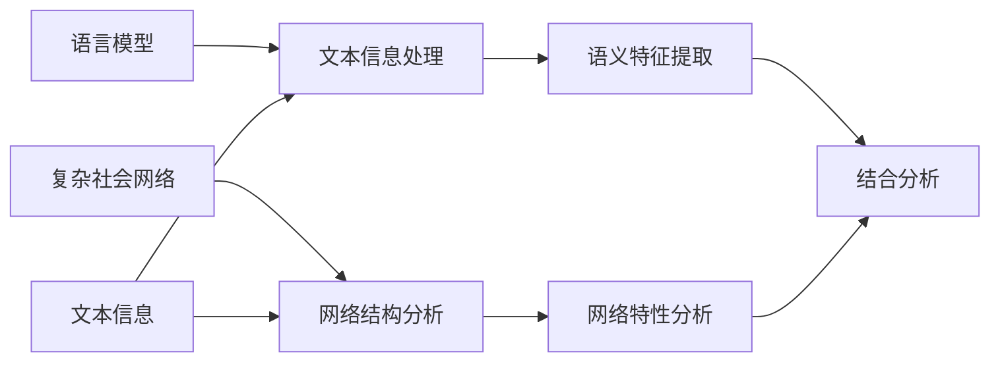

# 语言模型在复杂社会网络分析中的应用

> 关键词：语言模型、复杂社会网络分析、文本挖掘、网络结构、信息传播

> 摘要：本文深入探讨了语言模型在复杂社会网络分析中的应用。首先介绍了相关背景，包括目的、预期读者等内容。接着阐述了核心概念与联系，分析了语言模型和复杂社会网络的原理及架构。详细讲解了核心算法原理和具体操作步骤，并给出了Python代码示例。同时介绍了相关的数学模型和公式，结合实际案例进行说明。通过项目实战展示了如何在实际中运用语言模型进行复杂社会网络分析。探讨了其实际应用场景，推荐了相关的工具和资源。最后总结了未来发展趋势与挑战，解答了常见问题，并提供了扩展阅读和参考资料，旨在为研究和应用语言模型进行复杂社会网络分析提供全面的指导。

## 1. 背景介绍 
### 1.1 目的和范围
随着互联网的飞速发展，社会网络变得日益复杂，包含了大量的人际关系、信息传播等数据。复杂社会网络分析旨在揭示这些网络的结构、动态和演化规律，以更好地理解社会现象、预测社会行为等。语言模型作为一种强大的自然语言处理工具，能够对网络中的文本信息进行有效处理和分析。本文章的目的在于探讨语言模型在复杂社会网络分析中的具体应用，包括如何利用语言模型挖掘网络中的文本信息、分析网络节点的语义特征、预测信息传播等。范围涵盖了从语言模型的基本原理到实际应用案例，以及相关的工具和资源推荐。

### 1.2 预期读者
本文预期读者包括计算机科学、社会学、信息科学等领域的研究人员和学生，以及对自然语言处理和社会网络分析感兴趣的技术爱好者和从业者。对于想要了解如何将语言模型应用于复杂社会网络分析的读者，本文将提供详细的技术指导和实践案例。

### 1.3 文档结构概述
本文将按照以下结构进行组织：首先介绍相关背景信息，包括目的、预期读者和文档结构概述等；接着阐述语言模型和复杂社会网络的核心概念与联系，给出原理和架构的示意图及流程图；然后详细讲解核心算法原理和具体操作步骤，并使用Python代码进行说明；介绍相关的数学模型和公式，并结合实际案例进行详细讲解；通过项目实战展示如何在实际中运用语言模型进行复杂社会网络分析；探讨其实际应用场景；推荐相关的工具和资源；总结未来发展趋势与挑战；解答常见问题；最后提供扩展阅读和参考资料。

### 1.4 术语表
#### 1.4.1 核心术语定义
- **语言模型**：是一种对自然语言进行建模的统计模型，用于预测文本序列中下一个词的概率分布。常见的语言模型包括基于统计的n-gram模型和基于深度学习的神经网络语言模型，如Transformer架构的模型。
- **复杂社会网络**：是由大量的社会个体（节点）以及个体之间的关系（边）构成的复杂网络结构。这些网络具有复杂的拓扑结构和动态行为，如小世界效应、无标度特性等。
- **文本挖掘**：是指从大量的文本数据中提取有价值的信息和知识的过程，包括文本分类、情感分析、主题建模等任务。
- **信息传播**：是指信息在社会网络中从一个节点传递到其他节点的过程，研究信息传播可以帮助我们理解信息的扩散规律和影响范围。

#### 1.4.2 相关概念解释
- **网络结构**：复杂社会网络的结构包括节点的分布、边的连接方式等，常见的网络结构指标有度分布、聚类系数、平均路径长度等。
- **语义特征**：文本的语义特征是指文本所表达的含义和主题信息，语言模型可以通过对文本的学习和表示来提取语义特征。
- **图嵌入**：是将图结构数据（如社会网络）中的节点和边映射到低维向量空间的技术，以便于进行机器学习和数据分析。

#### 1.4.3 缩略词列表
- **NLP**：Natural Language Processing，自然语言处理
- **RNN**：Recurrent Neural Network，循环神经网络
- **LSTM**：Long Short-Term Memory，长短期记忆网络
- **GRU**：Gated Recurrent Unit，门控循环单元
- **Transformer**：一种基于注意力机制的深度学习架构

## 2. 核心概念与联系 
### 语言模型原理
语言模型的目标是对自然语言文本的概率分布进行建模。传统的统计语言模型，如n-gram模型，基于马尔可夫假设，即当前词的出现只与前n-1个词有关。例如，在一个三元语法（trigram）模型中，计算 $P(w_i|w_{i-1}, w_{i-2})$，其中 $w_i$ 是当前词，$w_{i-1}$ 和 $w_{i-2}$ 是前两个词。

基于深度学习的语言模型，如RNN、LSTM、GRU和Transformer等，能够更好地处理长序列依赖问题。以Transformer为例，它采用了多头注意力机制（Multi-Head Attention）来捕捉文本中不同位置之间的依赖关系。多头注意力机制的计算公式如下：

$$\text{MultiHead}(Q, K, V) = \text{Concat}(\text{head}_1, \cdots, \text{head}_h)W^O$$

其中，$\text{head}_i = \text{Attention}(QW_i^Q, KW_i^K, VW_i^V)$，$W_i^Q$、$W_i^K$、$W_i^V$ 和 $W^O$ 是可学习的参数矩阵，$Q$、$K$、$V$ 分别是查询（Query）、键（Key）和值（Value）矩阵。

### 复杂社会网络原理
复杂社会网络可以用图 $G=(V, E)$ 来表示，其中 $V$ 是节点集合，代表社会个体；$E$ 是边集合，代表个体之间的关系。社会网络具有一些重要的特性，如小世界效应，即网络中任意两个节点之间的平均路径长度相对较短；无标度特性，即节点的度分布服从幂律分布。

社会网络分析的主要任务包括网络结构分析、节点重要性评估、社区发现等。网络结构分析可以通过计算网络的度分布、聚类系数、平均路径长度等指标来进行。节点重要性评估可以采用度中心性、介数中心性、特征向量中心性等方法。社区发现则是将网络划分为不同的社区，使得社区内部节点之间的连接较为紧密，而社区之间的连接较为稀疏。

### 语言模型与复杂社会网络的联系
语言模型可以为复杂社会网络分析提供丰富的文本信息处理能力。在社会网络中，节点之间的交互往往伴随着大量的文本信息，如社交媒体上的帖子、评论等。语言模型可以对这些文本信息进行挖掘和分析，从而为社会网络分析提供更多的维度。例如，通过对节点发布的文本进行情感分析，可以了解节点的情绪状态；通过主题建模，可以发现节点关注的主题领域。

同时，复杂社会网络的结构信息也可以为语言模型的训练和应用提供帮助。例如，在文本生成任务中，可以结合社会网络的结构信息，生成更符合社交场景的文本。

### 文本示意图
```plaintext
语言模型  <------ 文本信息 ------>  复杂社会网络
    |                              |
    |  文本挖掘、情感分析等      |  网络结构分析、节点重要性评估等
    v                              v
  语义特征提取                   网络特性分析
```

### Mermaid 流程图


## 3. 核心算法原理 & 具体操作步骤 
### 核心算法原理
#### 文本分类算法
文本分类是将文本划分到不同类别的任务。一种常见的文本分类算法是基于机器学习的朴素贝叶斯分类器。朴素贝叶斯分类器基于贝叶斯定理和特征条件独立假设，通过计算文本属于各个类别的概率，选择概率最大的类别作为分类结果。

贝叶斯定理的公式为：

$$P(C|x) = \frac{P(x|C)P(C)}{P(x)}$$

其中，$C$ 是类别，$x$ 是文本特征向量。在朴素贝叶斯分类器中，假设特征之间相互独立，则有：

$$P(x|C) = \prod_{i=1}^{n} P(x_i|C)$$

其中，$x_i$ 是特征向量 $x$ 的第 $i$ 个特征。

#### 主题建模算法
主题建模是发现文本中隐藏主题的任务。常用的主题建模算法是潜在狄利克雷分配（Latent Dirichlet Allocation，LDA）。LDA假设每个文档是由多个主题混合而成，每个主题是一个词的概率分布。

LDA的生成过程如下：
1. 对于每个文档 $d$，从狄利克雷分布 $\text{Dir}(\alpha)$ 中采样一个主题分布 $\theta_d$。
2. 对于文档 $d$ 中的每个词 $w$：
    - 从主题分布 $\theta_d$ 中采样一个主题 $z$。
    - 从主题 $z$ 的词分布 $\beta_z$ 中采样一个词 $w$。

### 具体操作步骤
#### 数据预处理
1. 收集社会网络中的文本数据，如社交媒体上的帖子、评论等。
2. 对文本数据进行清洗，包括去除噪声字符、停用词等。
3. 对文本进行分词处理，将文本拆分为单个的词语。

#### 特征提取
1. 对于文本分类任务，可以使用词袋模型（Bag of Words）或TF-IDF（Term Frequency-Inverse Document Frequency）方法提取文本的特征向量。
2. 对于主题建模任务，可以使用词频统计作为特征。

#### 模型训练
1. 对于文本分类任务，使用训练数据训练朴素贝叶斯分类器。
2. 对于主题建模任务，使用训练数据训练LDA模型。

#### 模型评估
1. 使用测试数据对训练好的模型进行评估，计算分类准确率、召回率、F1值等指标。
2. 对于主题建模任务，可以使用困惑度（Perplexity）等指标评估模型的性能。

### Python源代码实现
```python
import numpy as np
from sklearn.feature_extraction.text import CountVectorizer, TfidfVectorizer
from sklearn.naive_bayes import MultinomialNB
from sklearn.model_selection import train_test_split
from sklearn.metrics import accuracy_score
from gensim.models import LdaModel
from gensim.corpora import Dictionary

# 示例数据
documents = [
    "This is a sample document about sports.",
    "Another document related to technology.",
    "A document discussing politics.",
    "Sports news and updates."
]
labels = [0, 1, 2, 0]

# 数据预处理
# 这里简单示例，实际中可能需要更复杂的清洗和分词操作
tokenized_docs = [doc.split() for doc in documents]

# 特征提取 - 词袋模型
vectorizer = CountVectorizer()
X = vectorizer.fit_transform(documents)

# 划分训练集和测试集
X_train, X_test, y_train, y_test = train_test_split(X, labels, test_size=0.2, random_state=42)

# 模型训练 - 朴素贝叶斯分类器
clf = MultinomialNB()
clf.fit(X_train, y_train)

# 模型评估
y_pred = clf.predict(X_test)
accuracy = accuracy_score(y_test, y_pred)
print(f"Text Classification Accuracy: {accuracy}")

# 主题建模 - LDA
dictionary = Dictionary(tokenized_docs)
corpus = [dictionary.doc2bow(doc) for doc in tokenized_docs]
lda_model = LdaModel(corpus=corpus, id2word=dictionary, num_topics=3)

# 打印主题
for idx, topic in lda_model.print_topics(-1):
    print(f"Topic: {idx} \nWords: {topic}")
```

## 4. 数学模型和公式 & 详细讲解 & 举例说明 
### 文本分类的数学模型和公式
#### 贝叶斯定理
贝叶斯定理是文本分类的核心数学模型，其公式为：

$$P(C|x) = \frac{P(x|C)P(C)}{P(x)}$$

其中，$P(C|x)$ 是给定文本特征向量 $x$ 时，文本属于类别 $C$ 的后验概率；$P(x|C)$ 是在类别 $C$ 下，特征向量 $x$ 出现的条件概率；$P(C)$ 是类别 $C$ 的先验概率；$P(x)$ 是特征向量 $x$ 出现的概率。

在实际应用中，由于 $P(x)$ 对于所有类别都是相同的，因此可以忽略分母，只比较分子 $P(x|C)P(C)$ 的大小。

#### 朴素贝叶斯假设
朴素贝叶斯分类器假设特征之间相互独立，即：

$$P(x|C) = \prod_{i=1}^{n} P(x_i|C)$$

其中，$x_i$ 是特征向量 $x$ 的第 $i$ 个特征。

#### 举例说明
假设有一个文本分类任务，要将文本分为体育、科技、政治三类。我们有以下训练数据：

| 文本 | 类别 |
| --- | --- |
| "This is a sample document about sports." | 体育 |
| "Another document related to technology." | 科技 |
| "A document discussing politics." | 政治 |

首先，计算各类别的先验概率：

- $P(\text{体育}) = \frac{1}{3}$
- $P(\text{科技}) = \frac{1}{3}$
- $P(\text{政治}) = \frac{1}{3}$

然后，计算每个特征（词语）在各类别下的条件概率。例如，对于词语 "sports"，在体育类别下的条件概率为：

$$P(\text{sports}|\text{体育}) = \frac{\text{体育类别中 "sports" 出现的次数}}{\text{体育类别中所有词语的总数}}$$

假设我们有一个新的文本 "Sports news and updates."，我们可以计算该文本属于每个类别的后验概率，选择概率最大的类别作为分类结果。

### 主题建模的数学模型和公式
#### 潜在狄利克雷分配（LDA）
LDA的数学模型基于贝叶斯概率理论，假设文档和主题之间存在两层概率分布。

文档的主题分布 $\theta_d$ 服从狄利克雷分布 $\text{Dir}(\alpha)$，主题的词分布 $\beta_z$ 服从狄利克雷分布 $\text{Dir}(\eta)$。

LDA的生成过程可以用以下公式表示：

1. 对于每个文档 $d$：
    - $\theta_d \sim \text{Dir}(\alpha)$
2. 对于文档 $d$ 中的每个词 $w$：
    - $z \sim \text{Multinomial}(\theta_d)$
    - $w \sim \text{Multinomial}(\beta_z)$

其中，$\text{Multinomial}$ 表示多项分布。

#### 举例说明
假设有一个包含三个文档的语料库：

- 文档1: "This is a sample document about sports."
- 文档2: "Another document related to technology."
- 文档3: "A document discussing politics."

使用LDA进行主题建模，假设我们设定主题数为3。LDA会学习到每个文档的主题分布和每个主题的词分布。例如，可能会得到以下结果：

- 主题1: 体育，词分布为 {"sports": 0.8, "news": 0.1, "updates": 0.1}
- 主题2: 科技，词分布为 {"technology": 0.9, "related": 0.1}
- 主题3: 政治，词分布为 {"politics": 0.9, "discussing": 0.1}

文档1的主题分布可能为 [0.8, 0.1, 0.1]，表示文档1主要属于体育主题。

## 5. 项目实战：代码实际案例和详细解释说明 
### 5.1  开发环境搭建
#### 操作系统
可以选择Windows、Linux或macOS操作系统，建议使用Linux系统，因为它在开发和部署方面具有更好的稳定性和兼容性。

#### Python环境
安装Python 3.7及以上版本，可以使用Anaconda或Miniconda来管理Python环境。创建一个新的虚拟环境：

```bash
conda create -n social_network_analysis python=3.8
conda activate social_network_analysis
```

#### 安装依赖库
安装所需的Python库，包括`numpy`、`pandas`、`scikit-learn`、`gensim`等：

```bash
pip install numpy pandas scikit-learn gensim
```

### 5.2  源代码详细实现和代码解读
```python
import numpy as np
import pandas as pd
from sklearn.feature_extraction.text import TfidfVectorizer
from sklearn.naive_bayes import MultinomialNB
from sklearn.model_selection import train_test_split
from sklearn.metrics import accuracy_score
from gensim.models import LdaModel
from gensim.corpora import Dictionary

# 读取数据
data = pd.read_csv('social_network_text_data.csv')
documents = data['text'].tolist()
labels = data['label'].tolist()

# 数据预处理
# 去除停用词
stopwords = set(['the', 'is', 'a', 'an', 'and', 'about'])
tokenized_docs = []
for doc in documents:
    tokens = doc.lower().split()
    filtered_tokens = [token for token in tokens if token not in stopwords]
    tokenized_docs.append(filtered_tokens)

# 特征提取 - TF-IDF
vectorizer = TfidfVectorizer()
X = vectorizer.fit_transform([' '.join(doc) for doc in tokenized_docs])

# 划分训练集和测试集
X_train, X_test, y_train, y_test = train_test_split(X, labels, test_size=0.2, random_state=42)

# 模型训练 - 朴素贝叶斯分类器
clf = MultinomialNB()
clf.fit(X_train, y_train)

# 模型评估
y_pred = clf.predict(X_test)
accuracy = accuracy_score(y_test, y_pred)
print(f"Text Classification Accuracy: {accuracy}")

# 主题建模 - LDA
dictionary = Dictionary(tokenized_docs)
corpus = [dictionary.doc2bow(doc) for doc in tokenized_docs]
lda_model = LdaModel(corpus=corpus, id2word=dictionary, num_topics=5)

# 打印主题
for idx, topic in lda_model.print_topics(-1):
    print(f"Topic: {idx} \nWords: {topic}")
```

### 代码解读与分析
#### 数据读取
使用`pandas`库读取包含文本数据和标签的CSV文件，将文本数据存储在`documents`列表中，标签存储在`labels`列表中。

#### 数据预处理
去除停用词，将文本转换为小写并分词，过滤掉停用词，将处理后的文本存储在`tokenized_docs`列表中。

#### 特征提取
使用`TfidfVectorizer`将文本数据转换为TF-IDF特征向量，TF-IDF可以衡量一个词在文档中的重要性。

#### 划分训练集和测试集
使用`train_test_split`函数将数据划分为训练集和测试集，测试集占总数据的20%。

#### 模型训练
使用`MultinomialNB`训练朴素贝叶斯分类器，该分类器适用于文本分类任务。

#### 模型评估
使用`accuracy_score`函数计算分类准确率，评估模型的性能。

#### 主题建模
使用`gensim`库的`LdaModel`进行主题建模，设定主题数为5，打印每个主题的关键词。

## 6. 实际应用场景 
### 社交媒体分析
在社交媒体平台上，用户之间的交互产生了大量的文本信息。语言模型可以用于分析用户的情感倾向、兴趣爱好和社交行为。例如，通过对用户发布的帖子进行情感分析，可以了解用户对某个话题的态度；通过主题建模，可以发现用户关注的热门话题和趋势。同时，结合社交网络的结构信息，可以分析信息在社交网络中的传播路径和影响力。

### 舆情监测
政府和企业需要及时了解公众对特定事件或政策的看法和态度。语言模型可以对新闻报道、社交媒体评论等文本数据进行分析，识别出舆情的热点和趋势。通过对舆情的实时监测和分析，可以及时采取措施应对负面舆情，引导公众舆论。

### 社交推荐系统
社交推荐系统的目标是为用户推荐感兴趣的内容和好友。语言模型可以对用户的历史行为和文本信息进行分析，挖掘用户的兴趣偏好和社交关系。例如，通过分析用户的朋友圈动态和评论，可以了解用户的兴趣领域，为用户推荐相关的文章、商品或好友。

### 犯罪网络分析
在打击犯罪活动中，警方需要分析犯罪网络的结构和成员之间的关系。语言模型可以对犯罪嫌疑人之间的通信记录、社交媒体聊天记录等文本数据进行分析，挖掘犯罪活动的线索和模式。例如，通过对文本中的关键词和语义信息进行分析，可以识别出犯罪组织的头目、成员角色和犯罪计划。

## 7. 工具和资源推荐
### 7.1 学习资源推荐
#### 7.1.1 书籍推荐
- 《自然语言处理入门》：这本书适合初学者，系统地介绍了自然语言处理的基本概念、算法和技术。
- 《深度学习》：由Ian Goodfellow、Yoshua Bengio和Aaron Courville撰写，是深度学习领域的经典教材，涵盖了神经网络、卷积神经网络、循环神经网络等内容。
- 《社会网络分析：方法与应用》：详细介绍了社会网络分析的理论、方法和应用，包括网络结构分析、节点重要性评估、社区发现等。

#### 7.1.2 在线课程
- Coursera上的“Natural Language Processing Specialization”：由斯坦福大学的教授授课，提供了全面的自然语言处理课程，包括语言模型、文本分类、情感分析等内容。
- edX上的“Social Network Analysis”：介绍了社会网络分析的基本概念和方法，通过实际案例进行讲解。

#### 7.1.3 技术博客和网站
- Medium：上面有很多关于自然语言处理和社会网络分析的技术博客文章，作者来自不同的领域和背景。
- arXiv：是一个预印本数据库，提供了最新的学术研究成果，包括语言模型和复杂社会网络分析方面的论文。

### 7.2 开发工具框架推荐
#### 7.2.1 IDE和编辑器
- PyCharm：是一款专业的Python集成开发环境，提供了丰富的代码编辑、调试和项目管理功能。
- Jupyter Notebook：是一个交互式的开发环境，适合进行数据分析和模型实验，支持多种编程语言。

#### 7.2.2 调试和性能分析工具
- TensorBoard：是TensorFlow的可视化工具，可以用于监控模型的训练过程、查看模型的结构和性能指标。
- Py-Spy：是一个Python性能分析工具，可以实时监控Python程序的CPU使用情况和函数调用时间。

#### 7.2.3 相关框架和库
- TensorFlow：是一个开源的深度学习框架，提供了丰富的神经网络模型和工具，支持分布式训练和部署。
- PyTorch：是另一个流行的深度学习框架，具有动态图的特点，易于使用和调试。
- NetworkX：是一个用于复杂网络分析的Python库，提供了各种网络算法和工具，如网络结构分析、节点重要性评估等。

### 7.3 相关论文著作推荐
#### 7.3.1 经典论文
- “Attention Is All You Need”：介绍了Transformer架构，是现代语言模型的基础。
- “Finding and Evaluating Community Structure in Networks”：提出了社区发现的经典算法，如Girvan-Newman算法。

#### 7.3.2 最新研究成果
- 在ACL（Association for Computational Linguistics）、KDD（Knowledge Discovery and Data Mining）等会议上发表的关于语言模型和复杂社会网络分析的最新研究论文。

#### 7.3.3 应用案例分析
- 一些知名企业和研究机构发表的关于语言模型在社交媒体分析、舆情监测等领域的应用案例分析报告。

## 8. 总结：未来发展趋势与挑战
### 未来发展趋势
#### 多模态融合
未来的复杂社会网络分析将不仅仅局限于文本信息，还会融合图像、音频、视频等多模态数据。语言模型可以与计算机视觉、语音识别等技术相结合，提供更全面的社会网络分析。

#### 个性化分析
随着数据的不断增长和技术的不断进步，未来的社会网络分析将更加注重个性化。语言模型可以根据用户的特征和需求，提供个性化的分析结果和建议。

#### 实时分析
在信息快速传播的时代，实时分析变得越来越重要。未来的语言模型将具备更高的实时处理能力，能够及时分析社会网络中的信息动态。

### 挑战
#### 数据隐私和安全
社会网络中的数据包含了大量的个人隐私信息，如何在分析过程中保护数据隐私和安全是一个重要的挑战。需要研究和应用更加安全的数据处理技术，如差分隐私、同态加密等。

#### 模型可解释性
深度学习模型通常是黑盒模型，难以解释其决策过程。在复杂社会网络分析中，模型的可解释性至关重要，需要研究和开发可解释的语言模型和分析方法。

#### 大规模数据处理
社会网络中的数据规模通常非常大，如何高效地处理和存储这些数据是一个挑战。需要研究和应用分布式计算、云计算等技术，提高数据处理的效率。

## 9. 附录：常见问题与解答
### 问题1：语言模型在复杂社会网络分析中的主要作用是什么？
语言模型在复杂社会网络分析中的主要作用是处理和分析网络中的文本信息。它可以用于文本分类、情感分析、主题建模等任务，为社会网络分析提供更多的维度和信息。例如，通过对节点发布的文本进行情感分析，可以了解节点的情绪状态；通过主题建模，可以发现节点关注的主题领域。

### 问题2：如何选择合适的语言模型进行复杂社会网络分析？
选择合适的语言模型需要考虑多个因素，如数据规模、任务类型、计算资源等。如果数据规模较小，可以选择基于统计的语言模型，如n-gram模型；如果数据规模较大，可以选择基于深度学习的语言模型，如Transformer架构的模型。同时，还需要根据具体的任务类型选择合适的模型，如文本分类任务可以选择朴素贝叶斯分类器、支持向量机等；主题建模任务可以选择LDA模型。

### 问题3：在实际应用中，如何处理社会网络中的噪声数据？
在实际应用中，社会网络中的数据可能包含噪声，如拼写错误、乱码、广告等。可以采用以下方法处理噪声数据：
1. 数据清洗：去除噪声字符、停用词等。
2. 正则表达式：使用正则表达式匹配和替换特定的噪声模式。
3. 机器学习方法：训练分类器识别和过滤噪声数据。

### 问题4：如何评估语言模型在复杂社会网络分析中的性能？
评估语言模型在复杂社会网络分析中的性能可以采用以下指标：
1. 分类准确率：对于文本分类任务，计算分类正确的样本数占总样本数的比例。
2. 召回率：对于文本分类任务，计算实际为正类的样本中被正确分类为正类的比例。
3. F1值：综合考虑准确率和召回率，是准确率和召回率的调和平均数。
4. 困惑度：对于主题建模任务，困惑度可以衡量模型对测试数据的拟合程度，困惑度越低，模型性能越好。

## 10. 扩展阅读 & 参考资料
### 扩展阅读
- 《人工智能时代的社会网络分析》：探讨了人工智能技术在社会网络分析中的应用和挑战。
- 《自然语言处理实战》：提供了自然语言处理的实际案例和代码实现，有助于加深对语言模型的理解和应用。

### 参考资料
- Goodfellow, I., Bengio, Y., & Courville, A. (2016). Deep Learning. MIT Press.
- Newman, M. E. J. (2010). Networks: An Introduction. Oxford University Press.
- Mikolov, T., Sutskever, I., Chen, K., Corrado, G. S., & Dean, J. (2013). Distributed representations of words and phrases and their compositionality. In Advances in neural information processing systems (pp. 3111-3119).

作者：AI天才研究院/AI Genius Institute & 禅与计算机程序设计艺术 /Zen And The Art of Computer Programming