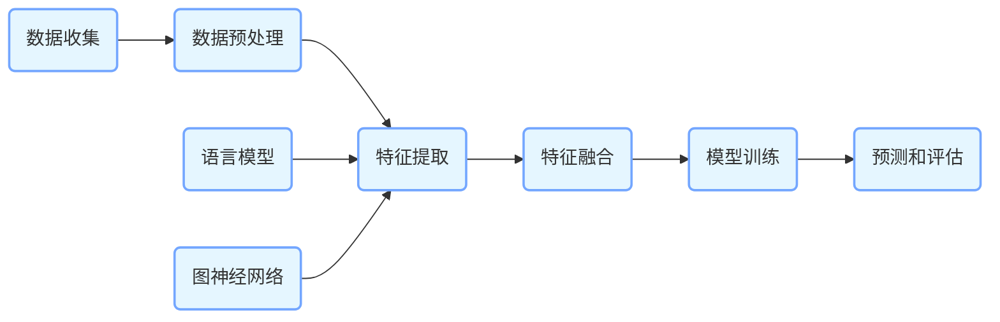

# 语言模型在复杂社会网络演化预测中的应用

> 关键词：语言模型、复杂社会网络、演化预测、自然语言处理、图神经网络

> 摘要：本文聚焦于语言模型在复杂社会网络演化预测中的应用。首先介绍了研究的背景、目的、预期读者和文档结构，对相关术语进行了详细解释。接着阐述了语言模型和复杂社会网络的核心概念及其联系，给出了原理和架构的文本示意图与 Mermaid 流程图。深入探讨了核心算法原理，并用 Python 代码详细阐述。同时给出了相关的数学模型和公式，并举例说明。通过项目实战，展示了代码的实际案例并进行详细解释。分析了语言模型在复杂社会网络演化预测中的实际应用场景，推荐了学习资源、开发工具框架和相关论文著作。最后总结了未来发展趋势与挑战，解答了常见问题并提供了扩展阅读和参考资料。

## 1. 背景介绍 
### 1.1 目的和范围
复杂社会网络是由大量个体通过各种关系相互连接而形成的网络结构，如社交网络、信息传播网络等。这些网络的演化规律对于理解社会现象、预测社会事件的发展具有重要意义。语言模型作为自然语言处理领域的重要技术，能够对文本数据进行理解和生成。本研究的目的是探索如何将语言模型应用于复杂社会网络的演化预测中，以提高预测的准确性和可靠性。研究范围涵盖了语言模型的基本原理、复杂社会网络的特征分析、两者的结合方法以及实际应用案例等方面。

### 1.2 预期读者
本文预期读者包括计算机科学、社会学、统计学等领域的研究人员和学生，以及对自然语言处理和社会网络分析感兴趣的技术爱好者。对于从事相关领域研究和开发的专业人士，本文可以提供新的研究思路和方法；对于初学者，本文可以帮助他们了解语言模型和复杂社会网络演化预测的基本概念和技术。

### 1.3 文档结构概述
本文共分为十个部分。第一部分为背景介绍，阐述了研究的目的、范围、预期读者和文档结构。第二部分介绍了语言模型和复杂社会网络的核心概念及其联系，并给出了相应的示意图和流程图。第三部分详细讲解了核心算法原理，并使用 Python 代码进行了说明。第四部分给出了相关的数学模型和公式，并通过具体例子进行了解释。第五部分通过项目实战，展示了代码的实际应用和详细解读。第六部分分析了语言模型在复杂社会网络演化预测中的实际应用场景。第七部分推荐了学习资源、开发工具框架和相关论文著作。第八部分总结了未来发展趋势与挑战。第九部分解答了常见问题。第十部分提供了扩展阅读和参考资料。

### 1.4 术语表
#### 1.4.1 核心术语定义
- **语言模型**：是一种对自然语言文本进行建模的统计模型，它能够根据输入的文本序列预测下一个可能出现的词或字符。常见的语言模型包括基于规则的语言模型、统计语言模型和神经网络语言模型。
- **复杂社会网络**：是由大量个体（节点）通过各种关系（边）相互连接而形成的网络结构。这些个体可以是人类、组织或其他实体，关系可以是社交关系、信息传播关系等。复杂社会网络具有复杂的拓扑结构和动态演化特性。
- **演化预测**：是指根据复杂社会网络的历史数据和当前状态，预测其未来的演化趋势和发展方向。演化预测可以帮助我们理解社会现象的发展规律，提前采取相应的措施。

#### 1.4.2 相关概念解释
- **自然语言处理**：是计算机科学和人工智能领域的一个重要分支，主要研究如何让计算机理解和处理人类语言。自然语言处理技术包括文本分类、信息检索、机器翻译、情感分析等。
- **图神经网络**：是一种专门用于处理图结构数据的神经网络模型。它能够自动学习图中节点和边的特征表示，从而对图进行分类、聚类、预测等任务。在复杂社会网络分析中，图神经网络可以用于挖掘网络的拓扑结构和节点之间的关系。

#### 1.4.3 缩略词列表
- **NLP**：Natural Language Processing，自然语言处理
- **GNN**：Graph Neural Network，图神经网络
- **RNN**：Recurrent Neural Network，循环神经网络
- **LSTM**：Long Short-Term Memory，长短期记忆网络
- **GRU**：Gated Recurrent Unit，门控循环单元

## 2. 核心概念与联系 

### 语言模型核心概念
语言模型的主要目标是学习语言的概率分布，即给定一个文本序列，预测下一个词出现的概率。传统的统计语言模型基于 n-gram 方法，它假设一个词的出现只与前面的 n-1 个词有关。例如，在一个 2-gram（bigram）模型中，$P(w_i|w_1,w_2,\cdots,w_{i - 1}) \approx P(w_i|w_{i - 1})$。

随着深度学习的发展，神经网络语言模型逐渐成为主流。其中，循环神经网络（RNN）及其变体，如长短期记忆网络（LSTM）和门控循环单元（GRU），能够处理变长的文本序列。RNN 的结构可以表示为：

$$h_t = \sigma(W_{hh}h_{t - 1}+W_{xh}x_t + b_h)$$

$$y_t = W_{hy}h_t + b_y$$

其中，$x_t$ 是输入序列在时间步 $t$ 的输入向量，$h_t$ 是隐藏状态向量，$y_t$ 是输出向量，$W_{hh}$、$W_{xh}$、$W_{hy}$ 是权重矩阵，$b_h$、$b_y$ 是偏置向量，$\sigma$ 是激活函数。

Transformer 模型是近年来在自然语言处理领域取得巨大成功的语言模型架构。它采用了多头自注意力机制，能够并行处理输入序列，避免了 RNN 模型的梯度消失问题。Transformer 模型的架构主要包括编码器和解码器两部分，编码器用于对输入序列进行特征提取，解码器用于生成输出序列。

### 复杂社会网络核心概念
复杂社会网络可以用图 $G=(V,E)$ 来表示，其中 $V$ 是节点集合，$E$ 是边集合。节点可以表示个体、组织或其他实体，边可以表示节点之间的关系，如社交关系、信息传播关系等。

复杂社会网络具有一些重要的特征，如小世界效应、无标度特性、社区结构等。小世界效应是指在网络中，任意两个节点之间的平均最短路径长度相对较短；无标度特性是指网络中节点的度分布遵循幂律分布，即少数节点具有很高的度，而大多数节点的度较低；社区结构是指网络中存在一些节点集合，这些节点之间的连接较为紧密，而与其他节点集合之间的连接较为稀疏。

### 语言模型与复杂社会网络的联系
在复杂社会网络中，节点之间的交互往往伴随着大量的文本信息，如社交媒体上的用户评论、新闻报道等。语言模型可以对这些文本信息进行处理和分析，提取出有用的特征和语义信息。例如，通过对用户评论的情感分析，可以了解用户对某个事件的态度和看法；通过对新闻报道的主题建模，可以发现社会热点事件的发展趋势。

同时，复杂社会网络的拓扑结构也可以为语言模型的训练和应用提供有用的信息。例如，可以将网络中的节点和边作为图神经网络的输入，学习节点的特征表示，然后将这些特征与语言模型的输出进行融合，以提高语言模型的性能。

### 原理和架构的文本示意图
语言模型在复杂社会网络演化预测中的应用原理可以概括为以下几个步骤：
1. **数据收集**：收集复杂社会网络中的文本数据和拓扑结构数据。
2. **数据预处理**：对文本数据进行清洗、分词、标注等处理，对拓扑结构数据进行图嵌入等处理。
3. **特征提取**：使用语言模型对文本数据进行特征提取，使用图神经网络对拓扑结构数据进行特征提取。
4. **特征融合**：将语言模型和图神经网络提取的特征进行融合。
5. **模型训练**：使用融合后的特征对演化预测模型进行训练。
6. **预测和评估**：使用训练好的模型对复杂社会网络的未来演化进行预测，并对预测结果进行评估。

### Mermaid 流程图


## 3. 核心算法原理 & 具体操作步骤 

### 语言模型算法原理
以 Transformer 模型为例，其核心是多头自注意力机制。多头自注意力机制可以表示为：

$$\text{MultiHead}(Q,K,V)=\text{Concat}(\text{head}_1,\cdots,\text{head}_h)W^O$$

其中，$\text{head}_i=\text{Attention}(QW_i^Q,KW_i^K,VW_i^V)$，$Q$、$K$、$V$ 分别是查询矩阵、键矩阵和值矩阵，$W_i^Q$、$W_i^K$、$W_i^V$ 是权重矩阵，$W^O$ 是输出权重矩阵。

注意力函数可以表示为：

$$\text{Attention}(Q,K,V)=\text{softmax}\left(\frac{QK^T}{\sqrt{d_k}}\right)V$$

其中，$d_k$ 是键向量的维度。

### 图神经网络算法原理
以图卷积网络（GCN）为例，其基本思想是通过聚合节点的邻居信息来更新节点的特征表示。GCN 的一层传播可以表示为：

$$H^{(l + 1)}=\sigma\left(\tilde{D}^{-\frac{1}{2}}\tilde{A}\tilde{D}^{-\frac{1}{2}}H^{(l)}W^{(l)}\right)$$

其中，$H^{(l)}$ 是第 $l$ 层的节点特征矩阵，$\tilde{A}=A + I$ 是邻接矩阵加上自环，$\tilde{D}$ 是 $\tilde{A}$ 的度矩阵，$W^{(l)}$ 是第 $l$ 层的权重矩阵，$\sigma$ 是激活函数。

### 具体操作步骤及 Python 代码实现

#### 步骤 1：数据收集和预处理
```python
import networkx as nx
import pandas as pd
import nltk
from nltk.corpus import stopwords
from nltk.tokenize import word_tokenize
import numpy as np

# 假设我们有一个社交网络的邻接矩阵和用户评论数据
# 读取邻接矩阵
adj_matrix = pd.read_csv('adj_matrix.csv', header=None).values
G = nx.from_numpy_array(adj_matrix)

# 读取用户评论数据
comments = pd.read_csv('comments.csv')['comment'].tolist()

# 文本预处理
nltk.download('stopwords')
nltk.download('punkt')
stop_words = set(stopwords.words('english'))

def preprocess_text(text):
    tokens = word_tokenize(text.lower())
    filtered_tokens = [token for token in tokens if token.isalpha() and token not in stop_words]
    return ' '.join(filtered_tokens)

preprocessed_comments = [preprocess_text(comment) for comment in comments]
```

#### 步骤 2：特征提取
```python
import torch
from transformers import AutoTokenizer, AutoModel

# 使用预训练的语言模型提取文本特征
tokenizer = AutoTokenizer.from_pretrained('bert-base-uncased')
model = AutoModel.from_pretrained('bert-base-uncased')

text_features = []
for comment in preprocessed_comments:
    inputs = tokenizer(comment, return_tensors='pt')
    outputs = model(**inputs)
    text_feature = outputs.last_hidden_state.mean(dim=1).squeeze().detach().numpy()
    text_features.append(text_feature)
text_features = np.array(text_features)

# 使用图卷积网络提取网络拓扑特征
import torch.nn.functional as F
from torch_geometric.nn import GCNConv
from torch_geometric.data import Data

edge_index = torch.tensor(nx.to_edgelist(G), dtype=torch.long).t().contiguous()
x = torch.tensor(np.random.randn(G.number_of_nodes(), 16), dtype=torch.float)
data = Data(x=x, edge_index=edge_index)

class GCN(torch.nn.Module):
    def __init__(self):
        super(GCN, self).__init__()
        self.conv1 = GCNConv(16, 32)
        self.conv2 = GCNConv(32, 64)

    def forward(self, data):
        x, edge_index = data.x, data.edge_index
        x = self.conv1(x, edge_index)
        x = F.relu(x)
        x = F.dropout(x, training=self.training)
        x = self.conv2(x, edge_index)
        return x

gcn_model = GCN()
topology_features = gcn_model(data).detach().numpy()
```

#### 步骤 3：特征融合
```python
# 简单的特征拼接
combined_features = np.hstack((text_features, topology_features))
```

#### 步骤 4：模型训练和预测
```python
from sklearn.model_selection import train_test_split
from sklearn.linear_model import LogisticRegression

# 假设我们有一个二分类的演化预测任务
labels = np.random.randint(0, 2, len(combined_features))

X_train, X_test, y_train, y_test = train_test_split(combined_features, labels, test_size=0.2, random_state=42)

model = LogisticRegression()
model.fit(X_train, y_train)

y_pred = model.predict(X_test)
```

## 4. 数学模型和公式 & 详细讲解 & 举例说明 

### 语言模型的数学模型
语言模型的目标是学习语言的概率分布 $P(w_1,w_2,\cdots,w_n)$，其中 $w_1,w_2,\cdots,w_n$ 是一个文本序列。根据链式法则，有：

$$P(w_1,w_2,\cdots,w_n)=\prod_{i = 1}^{n}P(w_i|w_1,w_2,\cdots,w_{i - 1})$$

在 n-gram 模型中，假设一个词的出现只与前面的 n-1 个词有关，即：

$$P(w_i|w_1,w_2,\cdots,w_{i - 1}) \approx P(w_i|w_{i - n + 1},\cdots,w_{i - 1})$$

例如，在一个 2-gram 模型中，$P(w_i|w_1,w_2,\cdots,w_{i - 1}) \approx P(w_i|w_{i - 1})$。

在神经网络语言模型中，通常使用最大似然估计来训练模型。假设我们有一个训练数据集 $D=\{(w_1^{(j)},w_2^{(j)},\cdots,w_{n_j}^{(j)})\}_{j = 1}^{N}$，则模型的目标是最大化似然函数：

$$L(\theta)=\prod_{j = 1}^{N}P(w_1^{(j)},w_2^{(j)},\cdots,w_{n_j}^{(j)};\theta)$$

等价于最小化负对数似然函数：

$$J(\theta)=-\sum_{j = 1}^{N}\log P(w_1^{(j)},w_2^{(j)},\cdots,w_{n_j}^{(j)};\theta)$$

### 图神经网络的数学模型
以图卷积网络（GCN）为例，其传播规则可以用矩阵形式表示。假设我们有一个图 $G=(V,E)$，节点特征矩阵为 $X\in\mathbb{R}^{N\times F}$，其中 $N$ 是节点数量，$F$ 是特征维度。邻接矩阵为 $A\in\mathbb{R}^{N\times N}$，度矩阵为 $D\in\mathbb{R}^{N\times N}$，其中 $D_{ii}=\sum_{j = 1}^{N}A_{ij}$。

GCN 的一层传播可以表示为：

$$H^{(l + 1)}=\sigma\left(\tilde{D}^{-\frac{1}{2}}\tilde{A}\tilde{D}^{-\frac{1}{2}}H^{(l)}W^{(l)}\right)$$

其中，$\tilde{A}=A + I$ 是邻接矩阵加上自环，$\tilde{D}$ 是 $\tilde{A}$ 的度矩阵，$W^{(l)}\in\mathbb{R}^{F^{(l)}\times F^{(l + 1)}}$ 是第 $l$ 层的权重矩阵，$H^{(l)}\in\mathbb{R}^{N\times F^{(l)}}$ 是第 $l$ 层的节点特征矩阵，$\sigma$ 是激活函数。

### 特征融合的数学模型
假设我们有语言模型提取的特征 $X_{text}\in\mathbb{R}^{N\times F_{text}}$ 和图神经网络提取的特征 $X_{topology}\in\mathbb{R}^{N\times F_{topology}}$，则特征融合后的特征矩阵 $X_{combined}\in\mathbb{R}^{N\times (F_{text}+F_{topology})}$ 可以通过简单的拼接得到：

$$X_{combined}=\begin{bmatrix}X_{text}&X_{topology}\end{bmatrix}$$

### 举例说明
假设我们有一个简单的社交网络，包含 3 个节点，邻接矩阵为：

$$A=\begin{bmatrix}0&1&1\\1&0&1\\1&1&0\end{bmatrix}$$

节点的初始特征矩阵为：

$$X=\begin{bmatrix}1&0\\0&1\\1&1\end{bmatrix}$$

我们使用 GCN 进行一层传播，假设权重矩阵 $W=\begin{bmatrix}1&0\\0&1\end{bmatrix}$，激活函数为 $\sigma(x)=x$。

首先，计算 $\tilde{A}=A + I=\begin{bmatrix}1&1&1\\1&1&1\\1&1&1\end{bmatrix}$，$\tilde{D}=\begin{bmatrix}3&0&0\\0&3&0\\0&0&3\end{bmatrix}$，$\tilde{D}^{-\frac{1}{2}}=\begin{bmatrix}\frac{1}{\sqrt{3}}&0&0\\0&\frac{1}{\sqrt{3}}&0\\0&0&\frac{1}{\sqrt{3}}\end{bmatrix}$。

则 $\tilde{D}^{-\frac{1}{2}}\tilde{A}\tilde{D}^{-\frac{1}{2}}=\frac{1}{3}\begin{bmatrix}1&1&1\\1&1&1\\1&1&1\end{bmatrix}$。

$$H^{(1)}=\tilde{D}^{-\frac{1}{2}}\tilde{A}\tilde{D}^{-\frac{1}{2}}XW=\frac{1}{3}\begin{bmatrix}1&1&1\\1&1&1\\1&1&1\end{bmatrix}\begin{bmatrix}1&0\\0&1\\1&1\end{bmatrix}\begin{bmatrix}1&0\\0&1\end{bmatrix}=\frac{1}{3}\begin{bmatrix}2&1\\2&1\\2&1\end{bmatrix}$$

## 5. 项目实战：代码实际案例和详细解释说明 

### 5.1  开发环境搭建
#### 安装 Python
首先，确保你已经安装了 Python 3.6 或更高版本。可以从 Python 官方网站（https://www.python.org/downloads/）下载并安装。

#### 创建虚拟环境
为了避免不同项目之间的依赖冲突，建议使用虚拟环境。可以使用 `venv` 或 `conda` 来创建虚拟环境。

使用 `venv` 创建虚拟环境：
```bash
python -m venv myenv
source myenv/bin/activate  # 在 Windows 上使用 myenv\Scripts\activate
```

使用 `conda` 创建虚拟环境：
```bash
conda create -n myenv python=3.8
conda activate myenv
```

#### 安装依赖库
在虚拟环境中，安装项目所需的依赖库：
```bash
pip install networkx pandas nltk torch transformers torch_geometric scikit-learn
```

### 5.2  源代码详细实现和代码解读
#### 数据收集和预处理
```python
import networkx as nx
import pandas as pd
import nltk
from nltk.corpus import stopwords
from nltk.tokenize import word_tokenize
import numpy as np

# 读取邻接矩阵
adj_matrix = pd.read_csv('adj_matrix.csv', header=None).values
G = nx.from_numpy_array(adj_matrix)

# 读取用户评论数据
comments = pd.read_csv('comments.csv')['comment'].tolist()

# 文本预处理
nltk.download('stopwords')
nltk.download('punkt')
stop_words = set(stopwords.words('english'))

def preprocess_text(text):
    tokens = word_tokenize(text.lower())
    filtered_tokens = [token for token in tokens if token.isalpha() and token not in stop_words]
    return ' '.join(filtered_tokens)

preprocessed_comments = [preprocess_text(comment) for comment in comments]
```
- **代码解读**：首先使用 `pandas` 读取邻接矩阵和用户评论数据。然后使用 `networkx` 将邻接矩阵转换为图对象。对于文本数据，使用 `nltk` 进行分词和停用词过滤，将文本转换为小写并去除非字母字符。

#### 特征提取
```python
import torch
from transformers import AutoTokenizer, AutoModel

# 使用预训练的语言模型提取文本特征
tokenizer = AutoTokenizer.from_pretrained('bert-base-uncased')
model = AutoModel.from_pretrained('bert-base-uncased')

text_features = []
for comment in preprocessed_comments:
    inputs = tokenizer(comment, return_tensors='pt')
    outputs = model(**inputs)
    text_feature = outputs.last_hidden_state.mean(dim=1).squeeze().detach().numpy()
    text_features.append(text_feature)
text_features = np.array(text_features)

# 使用图卷积网络提取网络拓扑特征
import torch.nn.functional as F
from torch_geometric.nn import GCNConv
from torch_geometric.data import Data

edge_index = torch.tensor(nx.to_edgelist(G), dtype=torch.long).t().contiguous()
x = torch.tensor(np.random.randn(G.number_of_nodes(), 16), dtype=torch.float)
data = Data(x=x, edge_index=edge_index)

class GCN(torch.nn.Module):
    def __init__(self):
        super(GCN, self).__init__()
        self.conv1 = GCNConv(16, 32)
        self.conv2 = GCNConv(32, 64)

    def forward(self, data):
        x, edge_index = data.x, data.edge_index
        x = self.conv1(x, edge_index)
        x = F.relu(x)
        x = F.dropout(x, training=self.training)
        x = self.conv2(x, edge_index)
        return x

gcn_model = GCN()
topology_features = gcn_model(data).detach().numpy()
```
- **代码解读**：使用 `transformers` 库加载预训练的 BERT 模型，对预处理后的文本进行编码，提取文本特征。使用 `torch_geometric` 库构建图卷积网络，对图的拓扑结构进行特征提取。

#### 特征融合
```python
# 简单的特征拼接
combined_features = np.hstack((text_features, topology_features))
```
- **代码解读**：使用 `numpy` 的 `hstack` 函数将文本特征和拓扑特征进行拼接。

#### 模型训练和预测
```python
from sklearn.model_selection import train_test_split
from sklearn.linear_model import LogisticRegression

# 假设我们有一个二分类的演化预测任务
labels = np.random.randint(0, 2, len(combined_features))

X_train, X_test, y_train, y_test = train_test_split(combined_features, labels, test_size=0.2, random_state=42)

model = LogisticRegression()
model.fit(X_train, y_train)

y_pred = model.predict(X_test)
```
- **代码解读**：使用 `sklearn` 的 `train_test_split` 函数将数据集划分为训练集和测试集。使用逻辑回归模型进行训练和预测。

### 5.3  代码解读与分析
- **数据预处理**：数据预处理是整个项目的基础，它可以提高数据的质量和可用性。在文本预处理中，去除停用词和非字母字符可以减少噪声，提高语言模型的性能。在图数据处理中，将邻接矩阵转换为图对象可以方便后续的图神经网络处理。
- **特征提取**：特征提取是将原始数据转换为模型可以处理的特征表示的过程。使用预训练的语言模型可以提取文本的语义信息，使用图神经网络可以提取图的拓扑结构信息。
- **特征融合**：特征融合可以将不同来源的特征进行整合，提高模型的性能。在本项目中，使用简单的特征拼接方法将文本特征和拓扑特征进行融合。
- **模型训练和预测**：选择合适的模型进行训练和预测是项目的关键。在本项目中，使用逻辑回归模型进行二分类预测。可以根据实际需求选择更复杂的模型，如神经网络模型。

## 6. 实际应用场景 
### 社交媒体网络演化预测
在社交媒体网络中，用户之间的交互和信息传播会导致网络结构的不断演化。语言模型可以对用户发布的文本内容进行分析，了解用户的兴趣、情感和行为模式。例如，通过对用户评论的情感分析，可以预测用户对某个话题的态度变化；通过对用户发布内容的主题建模，可以发现社交媒体上的热点话题和趋势。结合图神经网络对社交媒体网络的拓扑结构进行分析，可以预测用户之间的关系变化、社区结构的演化等。

### 信息传播网络演化预测
信息传播网络描述了信息在不同个体或群体之间的传播过程。语言模型可以对传播的信息内容进行理解和分析，预测信息的传播速度、范围和影响力。例如，在新闻传播网络中，通过对新闻报道的文本分析，可以预测哪些新闻会引起广泛关注，哪些新闻会在特定群体中传播。图神经网络可以分析信息传播网络的拓扑结构，如节点的中心性、传播路径等，从而更好地理解信息传播的机制和规律。

### 金融社交网络演化预测
金融社交网络是由投资者、金融机构和其他市场参与者通过各种关系相互连接而形成的网络。语言模型可以对金融新闻、社交媒体上的金融讨论等文本信息进行分析，了解市场参与者的情绪和预期。例如，通过对金融新闻的情感分析，可以预测市场的涨跌趋势；通过对社交媒体上的金融讨论的主题建模，可以发现市场的热点和潜在风险。图神经网络可以分析金融社交网络的拓扑结构，如投资者之间的关系、金融机构的影响力等，从而预测金融市场的演化和风险。

### 科研合作网络演化预测
科研合作网络是由科研人员通过合作关系相互连接而形成的网络。语言模型可以对科研论文的标题、摘要和正文等文本信息进行分析，了解科研领域的研究热点和趋势。例如，通过对科研论文的主题建模，可以发现哪些研究方向正在兴起，哪些研究方向已经趋于成熟。图神经网络可以分析科研合作网络的拓扑结构，如科研人员的合作关系、科研团队的影响力等，从而预测科研合作网络的演化和科研成果的产出。

## 7. 工具和资源推荐
### 7.1 学习资源推荐
#### 7.1.1 书籍推荐
- 《深度学习》（Deep Learning）：由 Ian Goodfellow、Yoshua Bengio 和 Aaron Courville 所著，是深度学习领域的经典教材，涵盖了神经网络、卷积神经网络、循环神经网络等重要内容。
- 《自然语言处理入门》（Natural Language Processing with Python）：由 Steven Bird、Ewan Klein 和 Edward Loper 所著，介绍了使用 Python 进行自然语言处理的基本方法和技术，包括文本处理、词性标注、命名实体识别等。
- 《图神经网络：基础、前沿与应用》：系统介绍了图神经网络的基本原理、算法和应用，对于理解和应用图神经网络在复杂社会网络分析中的应用具有重要参考价值。

#### 7.1.2 在线课程
- Coursera 上的“深度学习专项课程”（Deep Learning Specialization）：由 Andrew Ng 教授授课，包括神经网络和深度学习、改善深层神经网络、结构化机器学习项目等多个课程，是学习深度学习的优质资源。
- edX 上的“自然语言处理基础”（Foundations of Natural Language Processing）：介绍了自然语言处理的基本概念、技术和算法，适合初学者学习。
- 清华大学出版社慕课平台上的“图神经网络”课程：详细讲解了图神经网络的原理、算法和应用，对于深入理解图神经网络在复杂社会网络分析中的应用有很大帮助。

#### 7.1.3 技术博客和网站
- Medium 上的 Towards Data Science：提供了大量关于数据科学、机器学习和人工智能的技术文章和案例分析。
- 博客园（https://www.cnblogs.com/）：国内知名的技术博客网站，有很多关于自然语言处理和图神经网络的技术文章。
- arXiv（https://arxiv.org/）：一个预印本平台，提供了大量关于计算机科学、数学、物理学等领域的最新研究成果。

### 7.2 开发工具框架推荐
#### 7.2.1 IDE和编辑器
- PyCharm：是一款专门为 Python 开发设计的集成开发环境，具有代码编辑、调试、版本控制等功能，适合专业的 Python 开发者使用。
- Jupyter Notebook：是一个交互式的开发环境，可以方便地进行代码编写、数据可视化和结果展示，适合数据科学家和研究人员使用。
- Visual Studio Code：是一款轻量级的代码编辑器，支持多种编程语言和插件扩展，具有丰富的开发工具和功能。

#### 7.2.2 调试和性能分析工具
- TensorBoard：是 TensorFlow 提供的一个可视化工具，可以用于监控模型的训练过程、可视化模型的结构和参数等。
- PyTorch Profiler：是 PyTorch 提供的一个性能分析工具，可以帮助开发者分析模型的性能瓶颈，优化模型的训练和推理速度。
- cProfile：是 Python 内置的一个性能分析工具，可以用于分析 Python 代码的执行时间和调用关系。

#### 7.2.3 相关框架和库
- PyTorch：是一个开源的深度学习框架，具有动态图计算、自动求导等特点，广泛应用于自然语言处理、计算机视觉等领域。
- TensorFlow：是另一个开源的深度学习框架，具有强大的分布式训练和部署能力，被广泛应用于工业界和学术界。
- NetworkX：是一个用于创建、操作和研究复杂网络的 Python 库，提供了丰富的图算法和数据结构，方便进行复杂社会网络的分析和建模。
- Transformers：是 Hugging Face 开发的一个自然语言处理库，提供了大量预训练的语言模型，如 BERT、GPT 等，方便进行文本处理和分析。
- PyTorch Geometric：是一个用于处理图结构数据的 PyTorch 扩展库，提供了各种图神经网络模型和工具，方便进行图神经网络的开发和应用。

### 7.3 相关论文著作推荐
#### 7.3.1 经典论文
- “Attention Is All You Need”：提出了 Transformer 模型，是自然语言处理领域的重要突破，为后续的语言模型发展奠定了基础。
- “Semi-Supervised Classification with Graph Convolutional Networks”：提出了图卷积网络（GCN），是图神经网络领域的经典论文，为图数据的处理和分析提供了新的方法和思路。
- “Emergence of Scaling in Random Networks”：揭示了复杂网络的无标度特性，是复杂网络研究领域的经典论文，对于理解复杂社会网络的结构和演化具有重要意义。

#### 7.3.2 最新研究成果
- 关注 arXiv 上关于自然语言处理、图神经网络和复杂社会网络分析的最新研究论文，了解该领域的最新技术和方法。
- 参加相关的学术会议，如 ACL（Association for Computational Linguistics）、KDD（Knowledge Discovery and Data Mining）等，获取最新的研究成果和趋势。

#### 7.3.3 应用案例分析
- 分析一些实际应用案例，如社交媒体网络分析、金融市场预测等，了解语言模型和图神经网络在实际场景中的应用方法和效果。可以参考相关的学术论文、技术博客和开源项目。

## 8. 总结：未来发展趋势与挑战
### 未来发展趋势
#### 多模态融合
未来的研究将更加注重语言模型与其他模态数据（如图像、视频、音频等）的融合。在复杂社会网络中，除了文本信息，还存在大量的图像、视频等数据。通过多模态融合，可以更全面地了解社会网络中的信息传播和节点交互，提高演化预测的准确性。

#### 强化学习与演化预测的结合
强化学习可以用于优化复杂社会网络的演化预测模型。通过将演化预测问题建模为强化学习问题，可以让模型在与环境的交互中不断学习和优化，提高预测的性能和适应性。

#### 可解释性语言模型和图神经网络
随着语言模型和图神经网络在复杂社会网络演化预测中的应用越来越广泛，模型的可解释性变得越来越重要。未来的研究将致力于开发可解释性的语言模型和图神经网络，让人们能够更好地理解模型的决策过程和预测结果。

### 挑战
#### 数据质量和规模
复杂社会网络中的数据往往具有噪声大、不完整、不均衡等特点，这给数据的预处理和模型的训练带来了挑战。同时，为了训练出高性能的模型，需要大量的标注数据，而数据的标注成本较高，这也是一个亟待解决的问题。

#### 计算资源和效率
语言模型和图神经网络的训练和推理需要大量的计算资源，尤其是在处理大规模复杂社会网络时，计算效率成为了一个瓶颈。如何优化模型的结构和算法，提高计算效率，是未来研究的一个重要方向。

#### 隐私和安全问题
复杂社会网络中的数据往往包含大量的个人隐私信息，如用户的身份、兴趣爱好等。在应用语言模型进行演化预测时，需要确保数据的隐私和安全，避免数据泄露和滥用。

## 9. 附录：常见问题与解答
### 问题 1：语言模型和图神经网络在复杂社会网络演化预测中的作用有什么不同？
语言模型主要用于处理复杂社会网络中的文本信息，提取文本的语义特征和情感信息。它可以帮助我们了解节点之间的交流内容和情感倾向，从而预测节点的行为和决策。图神经网络主要用于处理复杂社会网络的拓扑结构信息，学习节点和边的特征表示。它可以帮助我们了解网络的结构特性和节点之间的关系，从而预测网络的演化趋势和结构变化。

### 问题 2：如何选择合适的语言模型和图神经网络模型？
选择合适的语言模型和图神经网络模型需要考虑多个因素，如数据的特点、任务的需求、计算资源等。对于文本数据，如果数据规模较小，可以选择一些轻量级的语言模型，如 FastText、Word2Vec 等；如果数据规模较大，可以选择一些预训练的大型语言模型，如 BERT、GPT 等。对于图数据，可以根据网络的规模和复杂度选择合适的图神经网络模型，如 GCN、GraphSAGE、GAT 等。

### 问题 3：特征融合的方法有哪些？
常见的特征融合方法包括简单拼接、加权求和、多层感知机融合等。简单拼接是将不同来源的特征直接拼接在一起；加权求和是根据不同特征的重要性对其进行加权求和；多层感知机融合是使用多层感知机对不同来源的特征进行非线性融合。

### 问题 4：如何评估复杂社会网络演化预测模型的性能？
可以使用多种指标来评估复杂社会网络演化预测模型的性能，如准确率、召回率、F1 值、均方误差等。对于分类任务，可以使用准确率、召回率和 F1 值来评估模型的性能；对于回归任务，可以使用均方误差来评估模型的性能。同时，还可以使用交叉验证等方法来验证模型的泛化能力。

## 10. 扩展阅读 & 参考资料
### 扩展阅读
- 《社会网络分析：方法与应用》：深入介绍了社会网络分析的方法和技术，对于理解复杂社会网络的结构和演化具有重要帮助。
- 《人工智能：现代方法》：全面介绍了人工智能的基本概念、技术和算法，对于了解人工智能在复杂社会网络演化预测中的应用具有重要参考价值。
- 《自然语言处理综论》：系统介绍了自然语言处理的各个方面，包括语言模型、文本分类、信息检索等，对于深入学习自然语言处理技术具有重要意义。

### 参考资料
- Goodfellow, I., Bengio, Y., & Courville, A. (2016). Deep Learning. MIT Press.
- Bird, S., Klein, E., & Loper, E. (2009). Natural Language Processing with Python. O'Reilly Media.
- Vaswani, A., Shazeer, N., Parmar, N., Uszkoreit, J., Jones, L., Gomez, A. N.,... & Polosukhin, I. (2017). Attention is all you need. Advances in neural information processing systems, 5998-6008.
- Kipf, T. N., & Welling, M. (2016). Semi-supervised classification with graph convolutional networks. arXiv preprint arXiv:1609.02907.
- Barabási, A. L., & Albert, R. (1999). Emergence of scaling in random networks. Science, 286(5439), 509-512.

作者：AI天才研究院/AI Genius Institute & 禅与计算机程序设计艺术 /Zen And The Art of Computer Programming