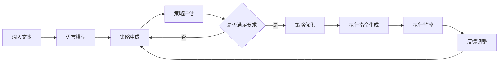

# 语言模型在复杂策略规划与执行中的应用

> 关键词：语言模型、复杂策略规划、策略执行、自然语言处理、人工智能应用

> 摘要：本文深入探讨了语言模型在复杂策略规划与执行领域的应用。首先介绍了相关背景，包括目的、预期读者、文档结构和术语表。接着阐述了核心概念及其联系，通过文本示意图和 Mermaid 流程图展示其架构。详细讲解了核心算法原理，并使用 Python 源代码进行说明。分析了相关数学模型和公式，并举例阐释。通过项目实战，展示了代码实际案例及详细解释。探讨了语言模型在复杂策略规划与执行中的实际应用场景。推荐了学习资源、开发工具框架和相关论文著作。最后总结了未来发展趋势与挑战，提供了常见问题解答和扩展阅读参考资料，旨在为读者全面呈现语言模型在该领域的应用全貌。

## 1. 背景介绍 
### 1.1 目的和范围
本文章的目的在于全面且深入地探究语言模型在复杂策略规划与执行方面的应用。随着人工智能技术的飞速发展，语言模型展现出了强大的语言理解和生成能力，其在各个领域的应用也日益广泛。复杂策略规划与执行涉及到多个环节的决策、协调和控制，对智能系统的要求较高。本文将研究语言模型如何在这些场景中发挥作用，包括策略的制定、优化以及执行过程中的实时调整等。范围涵盖了语言模型的基本原理、相关算法、数学模型，以及在不同实际场景中的具体应用案例。

### 1.2 预期读者
本文预期读者包括对人工智能、自然语言处理领域感兴趣的科研人员、工程师和开发者，他们希望深入了解语言模型在复杂策略规划与执行中的技术细节和应用方法。同时，也适合企业中负责制定业务策略、运营管理的人员，帮助他们了解如何借助语言模型提升策略规划与执行的效率和质量。此外，对于正在学习计算机科学、人工智能相关专业的学生，本文可以作为拓展知识和研究方向的参考资料。

### 1.3 文档结构概述
本文共分为十个部分。第一部分是背景介绍，为读者提供文章的整体框架和阅读指引。第二部分阐述核心概念与联系，通过文本示意图和 Mermaid 流程图清晰展示相关架构。第三部分详细讲解核心算法原理，并使用 Python 源代码进行说明。第四部分介绍数学模型和公式，并举例进行详细解释。第五部分是项目实战，包括开发环境搭建、源代码实现和代码解读。第六部分探讨实际应用场景，展示语言模型在不同领域的具体应用。第七部分推荐学习资源、开发工具框架和相关论文著作。第八部分总结未来发展趋势与挑战。第九部分是附录，提供常见问题与解答。第十部分为扩展阅读和参考资料，方便读者进一步深入研究。

### 1.4 术语表
#### 1.4.1 核心术语定义
- **语言模型**：是一种基于概率统计或深度学习技术构建的模型，用于对自然语言文本进行建模和预测。它能够学习语言的语法、语义和上下文信息，根据输入的文本生成合理的后续文本。
- **复杂策略规划**：指在面对具有多个目标、多种约束条件和不确定性因素的情况下，制定一系列合理的行动方案的过程。这些方案需要综合考虑各种因素，以实现最优的结果。
- **策略执行**：将制定好的策略转化为实际行动，并在执行过程中进行监控和调整，以确保策略目标的实现。
- **自然语言处理（NLP）**：是人工智能的一个重要领域，旨在让计算机理解、处理和生成自然语言。它涉及到多个任务，如文本分类、情感分析、机器翻译等。

#### 1.4.2 相关概念解释
- **上下文信息**：在语言处理中，上下文信息指的是文本中某个词、句子或段落周围的其他文本内容。它对于理解文本的语义和含义至关重要，语言模型可以利用上下文信息来生成更准确和合理的回答。
- **强化学习**：是一种机器学习方法，通过智能体与环境进行交互，根据环境反馈的奖励信号来学习最优的行为策略。在复杂策略规划与执行中，强化学习可以用于优化策略，使智能体在不同的环境中做出更合适的决策。
- **知识图谱**：是一种以图形结构表示知识的方法，它将实体、概念及其之间的关系以节点和边的形式呈现出来。知识图谱可以为语言模型提供丰富的背景知识，帮助其更好地理解和处理文本。

#### 1.4.3 缩略词列表
- **NLP**：Natural Language Processing（自然语言处理）
- **GPT**：Generative Pretrained Transformer（生成式预训练变换器）
- **BERT**：Bidirectional Encoder Representations from Transformers（基于变换器的双向编码器表示）

## 2. 核心概念与联系 

### 核心概念原理
语言模型的核心原理是通过对大量文本数据的学习，建立起语言的概率分布模型。它可以根据输入的文本序列预测下一个可能出现的单词或字符。在复杂策略规划与执行中，语言模型可以用于理解问题描述、生成策略方案和执行指令。

例如，当我们输入一个关于商业决策的问题时，语言模型可以分析问题的关键信息，结合其学习到的知识和经验，生成一系列可能的策略方案。这些方案可以进一步经过评估和优化，最终形成可行的执行计划。

### 架构的文本示意图
```plaintext
输入文本 -> 语言模型 -> 策略生成 -> 策略评估 -> 策略优化 -> 执行指令生成 -> 执行监控 -> 反馈调整
```
这个示意图展示了语言模型在复杂策略规划与执行中的整体架构。输入文本可以是用户提出的问题、任务描述或环境信息。语言模型对输入文本进行处理，生成初始的策略方案。策略评估模块对生成的策略进行评估，判断其可行性和有效性。策略优化模块根据评估结果对策略进行调整和优化。执行指令生成模块将优化后的策略转化为具体的执行指令。执行监控模块负责实时监控策略的执行情况，并将执行结果反馈给反馈调整模块，以便对策略进行进一步的调整。

### Mermaid 流程图

这个流程图更加直观地展示了语言模型在复杂策略规划与执行中的工作流程。从输入文本开始，经过语言模型的处理，生成策略并进行评估。如果策略不满足要求，则返回策略生成阶段重新生成。如果满足要求，则进行策略优化，生成执行指令并进行执行监控。执行过程中的反馈信息将用于调整策略，形成一个闭环的系统。

## 3. 核心算法原理 & 具体操作步骤 

### 核心算法原理
在语言模型中，常用的算法是基于深度学习的神经网络模型，如 Transformer 架构。Transformer 模型通过自注意力机制（Self-Attention Mechanism）来捕捉输入文本中不同位置之间的依赖关系，从而能够更好地处理长序列文本。

自注意力机制的核心思想是为输入序列中的每个位置分配一个权重，该权重表示该位置与其他位置的相关性。具体来说，对于输入序列中的每个位置 $i$，自注意力机制会计算其与其他位置 $j$ 的相关性得分，然后通过 Softmax 函数将这些得分转化为权重。最后，将输入序列中每个位置的特征向量根据这些权重进行加权求和，得到该位置的新特征向量。

### Python 源代码详细阐述
```python
import torch
import torch.nn as nn
import torch.nn.functional as F

class SelfAttention(nn.Module):
    def __init__(self, input_dim, output_dim):
        super(SelfAttention, self).__init__()
        self.query = nn.Linear(input_dim, output_dim)
        self.key = nn.Linear(input_dim, output_dim)
        self.value = nn.Linear(input_dim, output_dim)

    def forward(self, x):
        Q = self.query(x)
        K = self.key(x)
        V = self.value(x)

        scores = torch.matmul(Q, K.transpose(-2, -1))
        attention_weights = F.softmax(scores, dim=-1)
        output = torch.matmul(attention_weights, V)

        return output

# 示例使用
input_dim = 128
output_dim = 64
batch_size = 32
sequence_length = 10

x = torch.randn(batch_size, sequence_length, input_dim)
attention_layer = SelfAttention(input_dim, output_dim)
output = attention_layer(x)
print(output.shape)
```
### 具体操作步骤
1. **输入文本预处理**：将输入的文本进行分词、编码等处理，将其转化为模型可以接受的向量表示。
2. **模型训练**：使用大规模的文本数据集对语言模型进行训练，通过优化损失函数来调整模型的参数，使其能够更好地学习语言的规律和模式。
3. **策略生成**：将预处理后的输入文本输入到训练好的语言模型中，模型根据输入生成初始的策略方案。
4. **策略评估**：使用评估指标（如准确率、召回率、F1 值等）对生成的策略进行评估，判断其可行性和有效性。
5. **策略优化**：根据评估结果，对策略进行调整和优化。可以使用强化学习、遗传算法等方法来寻找更优的策略。
6. **执行指令生成**：将优化后的策略转化为具体的执行指令，以便实际执行。
7. **执行监控**：在策略执行过程中，实时监控执行情况，收集反馈信息。
8. **反馈调整**：根据反馈信息，对策略进行进一步的调整和优化，以确保策略目标的实现。

## 4. 数学模型和公式 & 详细讲解 & 举例说明 

### 自注意力机制的数学模型
自注意力机制的核心公式如下：

$$
\text{Attention}(Q, K, V) = \text{Softmax}\left(\frac{QK^T}{\sqrt{d_k}}\right)V
$$

其中，$Q$ 是查询矩阵，$K$ 是键矩阵，$V$ 是值矩阵，$d_k$ 是键向量的维度。

### 详细讲解
- **查询矩阵 $Q$**：由输入序列的特征向量通过一个线性变换得到，用于表示每个位置的查询信息。
- **键矩阵 $K$**：同样由输入序列的特征向量通过一个线性变换得到，用于表示每个位置的键信息。
- **值矩阵 $V$**：由输入序列的特征向量通过一个线性变换得到，用于表示每个位置的值信息。
- **相似度得分计算**：通过计算查询矩阵 $Q$ 和键矩阵 $K$ 的转置的乘积 $QK^T$，得到每个位置与其他位置的相似度得分。
- **缩放操作**：为了避免相似度得分过大，导致 Softmax 函数的梯度消失，需要对相似度得分进行缩放，除以 $\sqrt{d_k}$。
- **注意力权重计算**：通过 Softmax 函数将缩放后的相似度得分转化为注意力权重，这些权重表示每个位置对其他位置的关注程度。
- **加权求和**：将注意力权重与值矩阵 $V$ 相乘，得到每个位置的新特征向量。

### 举例说明
假设我们有一个输入序列 $x = [x_1, x_2, x_3]$，每个向量的维度为 $d = 4$。我们将输入序列通过三个线性变换分别得到查询矩阵 $Q$、键矩阵 $K$ 和值矩阵 $V$。

```python
import torch

# 输入序列
x = torch.tensor([[1, 2, 3, 4], [5, 6, 7, 8], [9, 10, 11, 12]], dtype=torch.float32)

# 线性变换参数
W_q = torch.tensor([[1, 0, 0, 0], [0, 1, 0, 0], [0, 0, 1, 0], [0, 0, 0, 1]], dtype=torch.float32)
W_k = torch.tensor([[1, 0, 0, 0], [0, 1, 0, 0], [0, 0, 1, 0], [0, 0, 0, 1]], dtype=torch.float32)
W_v = torch.tensor([[1, 0, 0, 0], [0, 1, 0, 0], [0, 0, 1, 0], [0, 0, 0, 1]], dtype=torch.float32)

# 计算查询矩阵、键矩阵和值矩阵
Q = torch.matmul(x, W_q)
K = torch.matmul(x, W_k)
V = torch.matmul(x, W_v)

# 计算相似度得分
scores = torch.matmul(Q, K.transpose(-2, -1))

# 缩放操作
d_k = Q.shape[-1]
scaled_scores = scores / torch.sqrt(torch.tensor(d_k, dtype=torch.float32))

# 计算注意力权重
attention_weights = torch.softmax(scaled_scores, dim=-1)

# 加权求和
output = torch.matmul(attention_weights, V)

print("输出结果:", output)
```
在这个例子中，我们通过手动计算展示了自注意力机制的具体过程。首先，我们定义了输入序列 $x$ 和线性变换参数 $W_q$、$W_k$、$W_v$。然后，计算了查询矩阵 $Q$、键矩阵 $K$ 和值矩阵 $V$。接着，计算了相似度得分，并进行了缩放操作。最后，通过 Softmax 函数计算了注意力权重，并进行了加权求和，得到了输出结果。

## 5. 项目实战：代码实际案例和详细解释说明 

### 5.1  开发环境搭建
#### 操作系统
推荐使用 Linux 系统，如 Ubuntu 18.04 或更高版本。也可以使用 Windows 10 或 macOS。

#### 编程语言和版本
使用 Python 3.7 或更高版本。

#### 深度学习框架
使用 PyTorch 深度学习框架，安装命令如下：
```bash
pip install torch torchvision
```

#### 其他依赖库
安装一些常用的 Python 库，如 numpy、pandas、transformers 等：
```bash
pip install numpy pandas transformers
```

### 5.2  源代码详细实现和代码解读
#### 代码实现
```python
import torch
from transformers import GPT2LMHeadModel, GPT2Tokenizer

# 加载预训练的 GPT-2 模型和分词器
tokenizer = GPT2Tokenizer.from_pretrained('gpt2')
model = GPT2LMHeadModel.from_pretrained('gpt2')

# 输入文本
input_text = "制定一个提高电商网站销售额的策略"

# 对输入文本进行编码
input_ids = tokenizer.encode(input_text, return_tensors='pt')

# 生成策略
output = model.generate(input_ids, max_length=100, num_beams=5, no_repeat_ngram_size=2, early_stopping=True)

# 解码生成的文本
generated_text = tokenizer.decode(output[0], skip_special_tokens=True)

print("生成的策略:", generated_text)
```
#### 代码解读
1. **加载预训练模型和分词器**：使用 `transformers` 库加载预训练的 GPT-2 模型和分词器。`GPT2Tokenizer` 用于将输入文本转化为模型可以接受的输入格式，`GPT2LMHeadModel` 是一个基于 GPT-2 架构的语言模型。
2. **输入文本处理**：定义输入文本 `input_text`，并使用分词器对其进行编码，得到输入的张量 `input_ids`。
3. **策略生成**：调用模型的 `generate` 方法，根据输入的 `input_ids` 生成策略文本。`max_length` 参数指定生成文本的最大长度，`num_beams` 参数指定束搜索的束数，`no_repeat_ngram_size` 参数用于避免生成重复的文本，`early_stopping` 参数用于在生成过程中提前停止。
4. **解码生成的文本**：使用分词器的 `decode` 方法将生成的张量 `output` 解码为文本，并去除特殊标记。
5. **输出结果**：打印生成的策略文本。

### 5.3  代码解读与分析
#### 优点
- **简单易用**：使用预训练的模型和 `transformers` 库可以快速实现策略生成功能，无需从头开始训练模型。
- **灵活性高**：可以通过调整 `generate` 方法的参数来控制生成文本的长度、多样性等。

#### 缺点
- **缺乏领域知识**：预训练的模型可能缺乏特定领域的知识，生成的策略可能不够专业和准确。
- **可解释性差**：语言模型生成的策略是基于概率统计的，缺乏明确的逻辑推理过程，难以解释其生成的原因。

为了克服这些缺点，可以对模型进行微调，使用领域内的数据集进行训练，或者结合知识图谱等技术来增强模型的领域知识和可解释性。

## 6. 实际应用场景 
### 商业决策
在商业领域，语言模型可以用于制定市场营销策略、产品定价策略、供应链管理策略等。例如，根据市场调研数据和竞争对手信息，语言模型可以生成针对性的市场营销方案，包括广告投放渠道、促销活动计划等。在产品定价方面，模型可以考虑成本、市场需求、竞争对手价格等因素，生成合理的价格策略。

### 医疗保健
在医疗保健领域，语言模型可以协助医生进行诊断和治疗方案的制定。例如，根据患者的症状、病史、检查结果等信息，模型可以生成可能的疾病诊断和相应的治疗建议。此外，语言模型还可以用于医疗文献的分析和挖掘，帮助医生获取最新的医学研究成果和治疗经验。

### 智能交通
在智能交通领域，语言模型可以用于交通流量预测、路线规划和交通管理策略的制定。例如，根据历史交通数据和实时路况信息，模型可以预测未来一段时间内的交通流量，为交通管理部门提供决策支持。在路线规划方面，模型可以考虑交通拥堵、道路状况等因素，为用户提供最优的出行路线。

### 教育领域
在教育领域，语言模型可以用于教学计划的制定、学习资源的推荐和学生作业的批改。例如，根据课程目标和学生的学习情况，模型可以生成个性化的教学计划，包括教学内容、教学方法和教学时间安排等。在学习资源推荐方面，模型可以根据学生的兴趣和学习需求，推荐适合的书籍、文章、视频等学习资源。

## 7. 工具和资源推荐
### 7.1 学习资源推荐
#### 7.1.1 书籍推荐
- 《深度学习》（Deep Learning）：由 Ian Goodfellow、Yoshua Bengio 和 Aaron Courville 所著，是深度学习领域的经典教材，涵盖了神经网络、卷积神经网络、循环神经网络等重要内容。
- 《自然语言处理入门》：由何晗所著，系统介绍了自然语言处理的基本概念、方法和技术，包括分词、词性标注、命名实体识别等。
- 《Python 深度学习》（Deep Learning with Python）：由 Francois Chollet 所著，通过实际案例介绍了如何使用 Python 和 Keras 框架进行深度学习模型的开发和训练。

#### 7.1.2 在线课程
- Coursera 上的 “深度学习专项课程”（Deep Learning Specialization）：由 Andrew Ng 教授授课，包括神经网络和深度学习、改善深层神经网络、结构化机器学习项目等多个课程。
- edX 上的 “自然语言处理基础”（Foundations of Natural Language Processing）：介绍了自然语言处理的基本概念、算法和应用，适合初学者学习。
- 哔哩哔哩（B 站）上有许多关于深度学习和自然语言处理的教学视频，如 “李宏毅机器学习” 等，内容生动有趣，易于理解。

#### 7.1.3 技术博客和网站
- Medium：是一个技术博客平台，上面有许多关于人工智能、自然语言处理的优质文章，作者来自世界各地的技术专家和研究者。
- arXiv：是一个预印本服务器，提供了大量的学术论文，包括人工智能、机器学习、自然语言处理等领域的最新研究成果。
- 开源中国（OSChina）：是一个中文的开源技术社区，上面有许多关于人工智能、自然语言处理的技术文章和开源项目。

### 7.2 开发工具框架推荐
#### 7.2.1 IDE和编辑器
- PyCharm：是一款专门为 Python 开发设计的集成开发环境（IDE），具有代码自动补全、调试、版本控制等功能，适合专业开发者使用。
- Jupyter Notebook：是一个交互式的开发环境，支持 Python、R 等多种编程语言，适合数据科学家和研究者进行数据分析和模型开发。
- Visual Studio Code：是一款轻量级的代码编辑器，支持多种编程语言和插件扩展，具有丰富的代码高亮、调试等功能。

#### 7.2.2 调试和性能分析工具
- TensorBoard：是 TensorFlow 框架提供的一个可视化工具，用于监控模型的训练过程、可视化模型的结构和性能指标等。
- PyTorch Profiler：是 PyTorch 框架提供的一个性能分析工具，用于分析模型的运行时间、内存使用情况等，帮助开发者优化模型的性能。
- cProfile：是 Python 标准库中的一个性能分析工具，用于分析 Python 代码的运行时间和函数调用情况。

#### 7.2.3 相关框架和库
- PyTorch：是一个开源的深度学习框架，具有动态计算图、易于使用等优点，广泛应用于自然语言处理、计算机视觉等领域。
- TensorFlow：是另一个开源的深度学习框架，具有强大的分布式训练和部署能力，被许多企业和研究机构广泛使用。
- Transformers：是 Hugging Face 公司开发的一个自然语言处理库，提供了多种预训练的语言模型，如 GPT-2、BERT 等，方便开发者快速实现自然语言处理任务。

### 7.3 相关论文著作推荐
#### 7.3.1 经典论文
- “Attention Is All You Need”：提出了 Transformer 架构，是自然语言处理领域的重要突破，为后续的语言模型发展奠定了基础。
- “BERT: Pre-training of Deep Bidirectional Transformers for Language Understanding”：介绍了 BERT 模型，通过双向预训练的方式，在多个自然语言处理任务上取得了优异的成绩。
- “Generative Pretrained Transformer 3 (GPT-3): Its Nature, Scope, Limits, and Consequences”：介绍了 GPT-3 模型，该模型具有强大的语言生成能力，引起了广泛的关注和讨论。

#### 7.3.2 最新研究成果
可以关注 arXiv 上的最新论文，以及 NeurIPS、ICML、ACL 等顶级学术会议上的研究成果。这些研究成果通常代表了自然语言处理领域的最新发展趋势和技术创新。

#### 7.3.3 应用案例分析
可以参考一些实际应用案例的分析文章，了解语言模型在不同领域的应用场景、方法和效果。例如，一些企业的技术博客会分享他们在使用语言模型解决实际问题的经验和成果。

## 8. 总结：未来发展趋势与挑战
### 未来发展趋势
#### 更强的语言理解和生成能力
未来的语言模型将不断提高其语言理解和生成能力，能够更好地处理复杂的语言结构和语义信息。例如，能够理解隐喻、幽默、讽刺等语言表达方式，生成更加自然、流畅、有逻辑的文本。

#### 多模态融合
语言模型将与图像、音频、视频等多种模态的信息进行融合，实现更加丰富和全面的信息处理。例如，在智能客服系统中，不仅可以通过文本与用户进行交互，还可以结合语音和图像信息，提供更加个性化和精准的服务。

#### 个性化和定制化
语言模型将根据用户的需求和偏好进行个性化和定制化的服务。例如，在教育领域，为不同学习水平和学习风格的学生提供个性化的学习计划和学习资源；在医疗领域，为不同患者提供个性化的诊断和治疗方案。

#### 与其他技术的深度融合
语言模型将与强化学习、知识图谱、区块链等其他技术进行深度融合，拓展其应用场景和功能。例如，结合强化学习可以实现智能决策和策略优化；结合知识图谱可以增强模型的领域知识和可解释性；结合区块链可以保障数据的安全和隐私。

### 挑战
#### 数据质量和隐私问题
语言模型的训练需要大量的数据，而数据的质量和隐私问题是一个重要的挑战。低质量的数据可能会导致模型的性能下降，而数据隐私问题则可能会引发用户的担忧和信任危机。因此，需要加强数据管理和保护，确保数据的质量和隐私安全。

#### 计算资源和能源消耗
训练大规模的语言模型需要大量的计算资源和能源消耗，这不仅增加了成本，还对环境造成了一定的压力。因此，需要研究更加高效的训练算法和硬件架构，降低计算资源和能源消耗。

#### 可解释性和可信度问题
语言模型的决策过程往往是基于概率统计的，缺乏明确的逻辑推理过程，导致其可解释性和可信度较低。在一些关键领域，如医疗、金融等，需要模型能够提供明确的解释和依据，以确保决策的可靠性和安全性。

#### 伦理和社会影响问题
语言模型的广泛应用可能会带来一些伦理和社会影响问题，如虚假信息传播、偏见和歧视等。因此，需要建立相应的伦理准则和监管机制，规范语言模型的使用，避免其带来的负面影响。

## 9. 附录：常见问题与解答
### 1. 语言模型生成的策略一定是最优的吗？
不一定。语言模型生成的策略是基于其学习到的知识和经验，以及输入的文本信息。虽然模型可以通过优化算法和大量的数据训练来提高生成策略的质量，但由于语言的复杂性和不确定性，以及实际场景中的各种因素，生成的策略不一定是最优的。在实际应用中，需要对生成的策略进行评估和优化，结合领域知识和实际情况进行调整。

### 2. 如何提高语言模型在复杂策略规划与执行中的性能？
可以从以下几个方面提高语言模型的性能：
- **数据增强**：使用更多、更优质的数据进行训练，包括领域内的数据、标注数据等。
- **模型微调**：在预训练的基础上，使用领域内的数据对模型进行微调，使其更好地适应特定的任务和场景。
- **结合其他技术**：结合强化学习、知识图谱等其他技术，增强模型的决策能力和领域知识。
- **优化算法**：使用更先进的优化算法，如 Adam、Adagrad 等，提高模型的训练效率和性能。

### 3. 语言模型在复杂策略规划与执行中存在哪些局限性？
- **缺乏领域知识**：预训练的语言模型可能缺乏特定领域的知识，导致生成的策略不够专业和准确。
- **可解释性差**：语言模型的决策过程是基于概率统计的，缺乏明确的逻辑推理过程，难以解释其生成的原因。
- **对输入的敏感性**：语言模型的输出结果可能会受到输入文本的影响，输入的微小变化可能会导致输出的较大差异。
- **处理复杂问题的能力有限**：对于一些非常复杂的策略规划问题，语言模型可能无法提供全面和准确的解决方案。

### 4. 如何评估语言模型生成的策略的质量？
可以从以下几个方面评估策略的质量：
- **可行性**：策略是否在实际场景中可行，是否符合实际情况和资源限制。
- **有效性**：策略是否能够实现预期的目标，是否能够提高效率、降低成本等。
- **创新性**：策略是否具有创新性和独特性，是否能够在竞争中脱颖而出。
- **可解释性**：策略是否能够被理解和解释，是否具有明确的逻辑推理过程。

可以使用一些评估指标和方法，如准确率、召回率、F1 值、AUC 等，结合人工评估和实际应用效果进行综合评估。

## 10. 扩展阅读 & 参考资料
### 扩展阅读
- 《人工智能：现代方法》（Artificial Intelligence: A Modern Approach）：全面介绍了人工智能的基本概念、方法和技术，是人工智能领域的经典教材。
- 《自然语言处理实战：基于 Transformers 和 PyTorch》：通过实际案例介绍了如何使用 Transformers 库和 PyTorch 框架进行自然语言处理任务的开发和实现。
- 《强化学习：原理与Python实现》：详细介绍了强化学习的基本原理、算法和应用，通过 Python 代码实现了多个强化学习算法。

### 参考资料
- Hugging Face 官方文档：https://huggingface.co/docs
- PyTorch 官方文档：https://pytorch.org/docs/stable/index.html
- TensorFlow 官方文档：https://www.tensorflow.org/api_docs
- arXiv 预印本服务器：https://arxiv.org/

作者：AI天才研究院/AI Genius Institute & 禅与计算机程序设计艺术 /Zen And The Art of Computer Programming