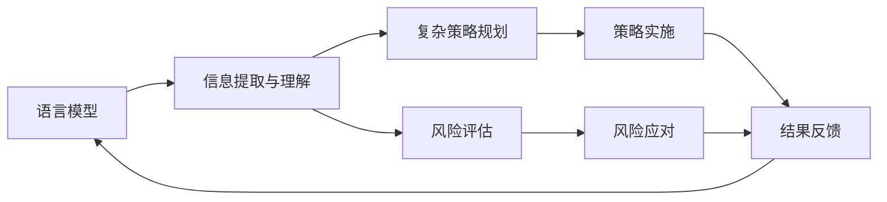

# 语言模型在复杂策略规划与风险评估中的前沿应用研究

> 关键词：语言模型、复杂策略规划、风险评估、前沿应用、自然语言处理

> 摘要：本文聚焦于语言模型在复杂策略规划与风险评估领域的前沿应用。首先介绍了相关背景，包括研究目的、预期读者等内容。接着阐述了核心概念，如语言模型的原理及与策略规划和风险评估的联系，并给出示意图和流程图。详细讲解了核心算法原理，用Python代码进行说明，同时介绍了相关数学模型和公式。通过项目实战，展示了如何运用语言模型进行复杂策略规划与风险评估的代码实现及解读。分析了实际应用场景，推荐了学习资源、开发工具框架和相关论文著作。最后总结了未来发展趋势与挑战，提供了常见问题解答及扩展阅读参考资料，旨在为该领域的研究和应用提供全面且深入的指导。

## 1. 背景介绍 
### 1.1 目的和范围
在当今复杂多变的社会经济环境中，各个领域都面临着复杂的决策问题和潜在风险。复杂策略规划需要综合考虑众多因素，权衡不同方案的利弊，以制定出最优的行动策略。而风险评估则是对可能出现的不利情况进行识别、分析和量化，为决策提供依据。语言模型作为自然语言处理领域的重要技术，具有强大的文本理解和生成能力，能够处理大量的非结构化文本信息。本研究的目的在于探索语言模型在复杂策略规划与风险评估中的前沿应用，挖掘其潜力，提高决策的科学性和准确性。

研究范围涵盖了多种类型的语言模型，如基于Transformer架构的预训练语言模型（如GPT系列、BERT等），以及它们在不同领域（如金融、医疗、交通等）的复杂策略规划与风险评估中的应用。同时，还将探讨相关的算法原理、数学模型以及实际应用案例。

### 1.2 预期读者
本文的预期读者包括从事自然语言处理、机器学习、人工智能等领域的研究人员和工程师，他们希望了解语言模型在复杂策略规划与风险评估方面的最新技术和应用案例，为自己的研究和开发工作提供参考。此外，企业中的战略规划师、风险评估专家和决策者也可以从本文中获取关于如何利用语言模型提升决策质量和风险应对能力的启示。同时，对人工智能技术感兴趣的学生和爱好者也可以通过本文初步了解该领域的前沿知识。

### 1.3 文档结构概述
本文将按照以下结构进行组织：
1. **背景介绍**：阐述研究的目的和范围、预期读者以及文档的整体结构，并介绍相关术语。
2. **核心概念与联系**：解释语言模型、复杂策略规划和风险评估的核心概念，展示它们之间的联系，并通过示意图和流程图进行说明。
3. **核心算法原理 & 具体操作步骤**：详细介绍语言模型在复杂策略规划与风险评估中所涉及的核心算法原理，并用Python代码进行具体实现和步骤说明。
4. **数学模型和公式 & 详细讲解 & 举例说明**：介绍相关的数学模型和公式，对其进行详细解释，并通过具体例子说明其应用。
5. **项目实战：代码实际案例和详细解释说明**：通过一个实际项目，展示如何搭建开发环境、实现源代码，并对代码进行解读和分析。
6. **实际应用场景**：分析语言模型在不同领域的复杂策略规划与风险评估中的实际应用场景。
7. **工具和资源推荐**：推荐学习相关知识的资源、开发工具框架以及相关的论文著作。
8. **总结：未来发展趋势与挑战**：总结语言模型在复杂策略规划与风险评估领域的未来发展趋势，并分析可能面临的挑战。
9. **附录：常见问题与解答**：解答读者在阅读过程中可能遇到的常见问题。
10. **扩展阅读 & 参考资料**：提供进一步深入学习的扩展阅读材料和参考资料。

### 1.4 术语表
#### 1.4.1 核心术语定义
- **语言模型**：是一种基于概率统计的模型，用于计算一个句子或一段文本出现的概率。它可以学习语言的语法、语义和上下文信息，从而生成自然流畅的文本或对输入的文本进行理解和处理。
- **复杂策略规划**：指在面临多个目标、多种约束条件和不确定因素的情况下，制定一系列相互关联的行动方案，以实现最优目标的过程。
- **风险评估**：对可能影响目标实现的不确定性因素进行识别、分析和评价的过程，旨在确定风险的可能性和影响程度，为风险应对提供依据。
- **预训练语言模型**：在大规模无监督文本数据上进行预训练的语言模型，学习到了丰富的语言知识和模式，可以通过微调应用于各种下游任务。
- **Transformer架构**：一种基于自注意力机制的深度学习架构，在自然语言处理领域取得了巨大成功，是许多先进语言模型的基础。

#### 1.4.2 相关概念解释
- **自注意力机制**：Transformer架构中的核心机制，它允许模型在处理序列时，根据序列中不同位置之间的相关性动态地分配注意力权重，从而更好地捕捉序列中的长距离依赖关系。
- **微调**：在预训练语言模型的基础上，使用特定任务的标注数据对模型进行进一步训练，以适应具体任务的需求。
- **非结构化文本信息**：指没有固定格式和结构的文本数据，如新闻报道、社交媒体评论、文档等，语言模型可以对其进行处理和分析。

#### 1.4.3 缩略词列表
- **GPT**：Generative Pretrained Transformer，生成式预训练Transformer
- **BERT**：Bidirectional Encoder Representations from Transformers，基于Transformer的双向编码器表示
- **NLP**：Natural Language Processing，自然语言处理
- **API**：Application Programming Interface，应用程序编程接口

## 2. 核心概念与联系 
### 核心概念原理
#### 语言模型
语言模型的基本原理是基于概率计算。给定一个词序列 $w_1, w_2, \cdots, w_n$，语言模型的目标是计算该序列出现的概率 $P(w_1, w_2, \cdots, w_n)$。根据链式法则，这个概率可以分解为：
$$P(w_1, w_2, \cdots, w_n) = \prod_{i=1}^{n} P(w_i | w_1, w_2, \cdots, w_{i-1})$$

早期的语言模型，如n-gram模型，假设当前词的出现只依赖于前 $n - 1$ 个词，即：
$$P(w_i | w_1, w_2, \cdots, w_{i-1}) \approx P(w_i | w_{i - n + 1}, \cdots, w_{i-1})$$

现代的预训练语言模型，如基于Transformer架构的模型，通过在大规模文本数据上进行无监督学习，学习到了丰富的语言知识和语义表示。这些模型通常采用编码器 - 解码器架构或仅编码器架构，利用自注意力机制捕捉序列中的长距离依赖关系。

#### 复杂策略规划
复杂策略规划涉及多个步骤和因素。首先需要明确目标，即要实现的最终结果。然后收集相关信息，包括内部资源、外部环境等。接着分析不同的可行方案，考虑每个方案的优缺点和可能的后果。最后根据评估结果选择最优方案，并制定详细的实施计划。

#### 风险评估
风险评估的过程包括风险识别、风险分析和风险评价。风险识别是找出可能影响目标实现的各种风险因素，如市场波动、政策变化等。风险分析是对识别出的风险因素进行量化分析，评估其发生的可能性和影响程度。风险评价是根据风险分析的结果，确定风险的等级，并制定相应的风险应对策略。

### 架构的文本示意图
```plaintext
            +-------------------+
            |  语言模型         |
            |  (预训练模型)     |
            +-------------------+
                   |
                   |  处理非结构化文本
                   v
            +-------------------+
            |  信息提取与理解   |
            |  (实体识别、关系抽取等) |
            +-------------------+
                   |
                   |  提供信息支持
                  / \
                 /   \
+-------------------+ +-------------------+
|  复杂策略规划    | |  风险评估         |
|  (方案制定、决策) | |  (风险识别、分析) |
+-------------------+ +-------------------+
```

### Mermaid流程图


## 3. 核心算法原理 & 具体操作步骤 
### 核心算法原理
在复杂策略规划与风险评估中，语言模型主要用于信息提取和理解。以基于BERT的实体识别和关系抽取为例，介绍核心算法原理。

BERT是一种基于Transformer编码器架构的预训练语言模型。它通过在大规模文本数据上进行掩码语言模型（Masked Language Model, MLM）和下一句预测（Next Sentence Prediction, NSP）任务的预训练，学习到了强大的语言表示能力。

在实体识别任务中，将输入文本进行分词后，输入到BERT模型中，得到每个词的上下文表示。然后在BERT的输出层添加一个分类器，对每个词进行分类，判断其是否属于某个实体类别。

在关系抽取任务中，同样将输入文本输入到BERT模型中，得到文本的表示。然后根据实体的位置信息，提取实体对的表示，并通过一个全连接层进行分类，判断实体对之间的关系类型。

### 具体操作步骤及Python代码实现
以下是使用Hugging Face的Transformers库实现基于BERT的实体识别和关系抽取的示例代码：

```python
import torch
from transformers import BertTokenizer, BertForTokenClassification, BertForSequenceClassification

# 1. 加载预训练模型和分词器
tokenizer = BertTokenizer.from_pretrained('bert-base-chinese')
# 实体识别模型
ner_model = BertForTokenClassification.from_pretrained('bert-base-chinese', num_labels=5)  # 假设5个实体类别
# 关系抽取模型
re_model = BertForSequenceClassification.from_pretrained('bert-base-chinese', num_labels=3)  # 假设3种关系类型

# 2. 输入文本处理
text = "苹果公司发布了新款iPhone。"
inputs = tokenizer(text, return_tensors='pt')

# 3. 实体识别
with torch.no_grad():
    ner_outputs = ner_model(**inputs)
    ner_logits = ner_outputs.logits
    ner_predictions = torch.argmax(ner_logits, dim=-1)
    ner_labels = [ner_model.config.id2label[label_id.item()] for label_id in ner_predictions[0]]
    print("实体识别结果:", ner_labels)

# 4. 关系抽取（假设已经识别出实体）
entity1 = "苹果公司"
entity2 = "新款iPhone"
re_text = f"{entity1} {entity2}"
re_inputs = tokenizer(re_text, return_tensors='pt')
with torch.no_grad():
    re_outputs = re_model(**re_inputs)
    re_logits = re_outputs.logits
    re_prediction = torch.argmax(re_logits, dim=-1).item()
    re_label = re_model.config.id2label[re_prediction]
    print("关系抽取结果:", re_label)
```

### 代码解释
1. **加载预训练模型和分词器**：使用`BertTokenizer`和`BertForTokenClassification`、`BertForSequenceClassification`从Hugging Face的模型库中加载预训练的BERT模型和分词器。
2. **输入文本处理**：使用分词器对输入文本进行分词，并将其转换为PyTorch张量。
3. **实体识别**：将输入文本输入到实体识别模型中，得到每个词的分类得分。通过`torch.argmax`函数找出得分最高的类别，得到实体识别结果。
4. **关系抽取**：将识别出的实体组合成新的文本，输入到关系抽取模型中，得到实体对之间的关系类型。

## 4. 数学模型和公式 & 详细讲解 & 举例说明 
### 语言模型的概率计算
如前面所述，语言模型的目标是计算词序列 $w_1, w_2, \cdots, w_n$ 出现的概率 $P(w_1, w_2, \cdots, w_n)$，根据链式法则：
$$P(w_1, w_2, \cdots, w_n) = \prod_{i=1}^{n} P(w_i | w_1, w_2, \cdots, w_{i-1})$$

以一个简单的例子来说明，假设我们有一个句子“我爱中国”，用 $w_1$ 表示“我”，$w_2$ 表示“爱”，$w_3$ 表示“中国”。那么这个句子出现的概率为：
$$P(我, 爱, 中国) = P(我) \times P(爱 | 我) \times P(中国 | 我, 爱)$$

### 自注意力机制的数学公式
自注意力机制是Transformer架构的核心。对于输入序列 $X = [x_1, x_2, \cdots, x_n]$，其中 $x_i \in \mathbb{R}^d$ 是第 $i$ 个位置的输入向量，自注意力机制的计算步骤如下：

1. 计算查询（Query）、键（Key）和值（Value）矩阵：
$$Q = XW_Q$$
$$K = XW_K$$
$$V = XW_V$$
其中 $W_Q \in \mathbb{R}^{d \times d_k}$，$W_K \in \mathbb{R}^{d \times d_k}$，$W_V \in \mathbb{R}^{d \times d_v}$ 是可学习的权重矩阵。

2. 计算注意力分数：
$$\text{Attention}(Q, K, V) = \text{softmax}\left(\frac{QK^T}{\sqrt{d_k}}\right)V$$

例如，假设输入序列 $X$ 是一个长度为 3 的向量序列，每个向量的维度为 4，即 $X \in \mathbb{R}^{3 \times 4}$。$W_Q, W_K, W_V$ 是 $4 \times 2$ 的矩阵。那么 $Q, K \in \mathbb{R}^{3 \times 2}$，$V \in \mathbb{R}^{3 \times 2}$。计算 $QK^T$ 得到一个 $3 \times 3$ 的矩阵，然后除以 $\sqrt{2}$ 并进行softmax操作，最后乘以 $V$ 得到注意力输出。

### 损失函数
在训练语言模型时，通常使用交叉熵损失函数。对于分类任务，如实体识别和关系抽取，假设模型的输出为 $y_{pred}$，真实标签为 $y_{true}$，交叉熵损失函数的公式为：
$$L = -\sum_{i=1}^{N} y_{true}^{(i)} \log(y_{pred}^{(i)})$$
其中 $N$ 是样本数量。

例如，在实体识别任务中，假设有一个样本的真实标签为 $[0, 1, 0, 0, 0]$（表示属于第 2 个类别），模型的预测输出为 $[0.1, 0.7, 0.1, 0.05, 0.05]$。那么该样本的损失为：
$$L = -(0 \times \log(0.1) + 1 \times \log(0.7) + 0 \times \log(0.1) + 0 \times \log(0.05) + 0 \times \log(0.05)) \approx 0.357$$

## 5. 项目实战：代码实际案例和详细解释说明 
### 5.1  开发环境搭建
#### 操作系统
可以选择Windows、Linux（如Ubuntu）或macOS等操作系统。建议使用Linux系统，因为它在深度学习开发中具有更好的兼容性和性能。

#### Python环境
安装Python 3.7及以上版本。可以使用Anaconda来管理Python环境，创建一个新的虚拟环境：
```bash
conda create -n lang_model_env python=3.8
conda activate lang_model_env
```

#### 安装依赖库
安装Hugging Face的Transformers库、PyTorch深度学习框架以及其他必要的库：
```bash
pip install transformers torch numpy pandas
```

### 5.2  源代码详细实现和代码解读
以下是一个使用语言模型进行金融市场风险评估的项目示例。

#### 数据准备
假设我们有一个包含金融新闻文本和对应的风险标签（高、中、低）的数据集。首先，将数据集划分为训练集和测试集：
```python
import pandas as pd
from sklearn.model_selection import train_test_split

# 读取数据
data = pd.read_csv('financial_news.csv')
texts = data['text'].tolist()
labels = data['label'].tolist()

# 划分训练集和测试集
train_texts, test_texts, train_labels, test_labels = train_test_split(texts, labels, test_size=0.2, random_state=42)
```

#### 数据预处理
使用分词器将文本转换为模型可以接受的输入格式：
```python
from transformers import BertTokenizer

tokenizer = BertTokenizer.from_pretrained('bert-base-chinese')

train_encodings = tokenizer(train_texts, truncation=True, padding=True)
test_encodings = tokenizer(test_texts, truncation=True, padding=True)
```

#### 构建数据集类
创建一个自定义的数据集类，用于将数据封装成PyTorch可以处理的格式：
```python
import torch

class FinancialNewsDataset(torch.utils.data.Dataset):
    def __init__(self, encodings, labels):
        self.encodings = encodings
        self.labels = labels

    def __getitem__(self, idx):
        item = {key: torch.tensor(val[idx]) for key, val in self.encodings.items()}
        item['labels'] = torch.tensor(self.labels[idx])
        return item

    def __len__(self):
        return len(self.labels)

train_dataset = FinancialNewsDataset(train_encodings, train_labels)
test_dataset = FinancialNewsDataset(test_encodings, test_labels)
```

#### 加载模型和训练
加载预训练的BERT模型，并进行微调训练：
```python
from transformers import BertForSequenceClassification, Trainer, TrainingArguments

model = BertForSequenceClassification.from_pretrained('bert-base-chinese', num_labels=3)

training_args = TrainingArguments(
    output_dir='./results',          # output directory
    num_train_epochs=3,              # total number of training epochs
    per_device_train_batch_size=16,  # batch size per device during training
    per_device_eval_batch_size=64,   # batch size for evaluation
    warmup_steps=500,                # number of warmup steps for learning rate scheduler
    weight_decay=0.01,               # strength of weight decay
    logging_dir='./logs',            # directory for storing logs
    logging_steps=10,
)

trainer = Trainer(
    model=model,                         # the instantiated 🤗 Transformers model to be trained
    args=training_args,                  # training arguments, defined above
    train_dataset=train_dataset,         # training dataset
    eval_dataset=test_dataset            # evaluation dataset
)

trainer.train()
```

#### 模型评估
使用训练好的模型对测试集进行评估：
```python
eval_results = trainer.evaluate()
print(eval_results)
```

### 5.3  代码解读与分析
1. **数据准备**：使用`pandas`库读取包含金融新闻文本和风险标签的CSV文件，并使用`sklearn`库的`train_test_split`函数将数据集划分为训练集和测试集。
2. **数据预处理**：使用`BertTokenizer`将文本进行分词，并进行截断和填充操作，使其长度一致。
3. **构建数据集类**：自定义`FinancialNewsDataset`类，继承自`torch.utils.data.Dataset`，用于将数据封装成PyTorch可以处理的格式。
4. **加载模型和训练**：使用`BertForSequenceClassification`加载预训练的BERT模型，并使用`Trainer`和`TrainingArguments`进行模型的微调训练。
5. **模型评估**：使用`trainer.evaluate()`函数对训练好的模型在测试集上进行评估，输出评估结果。

## 6. 实际应用场景 
### 金融领域
在金融领域，语言模型可用于复杂策略规划和风险评估。例如，投资银行可以使用语言模型分析大量的金融新闻、研究报告和公司公告，提取关键信息，如市场趋势、公司财务状况等，从而制定投资策略。同时，语言模型可以对金融市场的风险进行评估，识别潜在的风险因素，如信用风险、市场风险等。例如，通过分析债券发行文件和企业财务报表，预测债券违约的可能性。

### 医疗领域
在医疗领域，语言模型可以辅助医生进行复杂的治疗策略规划。例如，分析患者的病历、检查报告和医学文献，为医生提供治疗建议。同时，语言模型可以对医疗风险进行评估，如手术风险、药物不良反应等。例如，通过分析患者的基因数据和临床症状，预测患者对某种药物的反应。

### 交通领域
在交通领域，语言模型可用于交通规划和风险评估。例如，分析交通流量数据、气象信息和交通事故报告，制定交通疏导策略。同时，语言模型可以对交通风险进行评估，如道路安全风险、航班延误风险等。例如，通过分析机场的气象数据和航班时刻表，预测航班延误的可能性。

### 企业管理领域
在企业管理领域，语言模型可以帮助企业进行战略规划和风险评估。例如，分析市场调研数据、竞争对手信息和行业动态，制定企业的发展战略。同时，语言模型可以对企业面临的风险进行评估，如市场风险、经营风险等。例如，通过分析企业的财务报表和市场趋势，预测企业的盈利能力和偿债能力。

## 7. 工具和资源推荐
### 7.1 学习资源推荐
#### 7.1.1 书籍推荐
- 《深度学习》（Deep Learning）：由Ian Goodfellow、Yoshua Bengio和Aaron Courville所著，是深度学习领域的经典教材，涵盖了神经网络、卷积神经网络、循环神经网络等内容。
- 《自然语言处理入门》：何晗著，适合初学者入门自然语言处理，介绍了自然语言处理的基本概念、方法和技术。
- 《Python自然语言处理》（Natural Language Processing with Python）：Steven Bird、Ewan Klein和Edward Loper所著，详细介绍了使用Python进行自然语言处理的方法和工具。

#### 7.1.2 在线课程
- Coursera上的“深度学习专项课程”（Deep Learning Specialization）：由Andrew Ng教授授课，涵盖了深度学习的基础知识和应用。
- edX上的“自然语言处理基础”（Foundations of Natural Language Processing）：介绍了自然语言处理的基本概念和技术。
- Hugging Face的官方教程：提供了关于Transformer模型和自然语言处理的详细教程和示例代码。

#### 7.1.3 技术博客和网站
- Hugging Face博客：发布了关于自然语言处理和Transformer模型的最新研究成果和应用案例。
- arXiv.org：是一个预印本论文库，包含了计算机科学、物理学等领域的最新研究论文。
- Medium上的自然语言处理相关博客：有许多专业人士分享自然语言处理的技术和经验。

### 7.2 开发工具框架推荐
#### 7.2.1 IDE和编辑器
- PyCharm：是一款功能强大的Python集成开发环境，提供了代码编辑、调试、版本控制等功能。
- Jupyter Notebook：是一个交互式的开发环境，适合进行数据分析和模型实验。
- Visual Studio Code：是一款轻量级的代码编辑器，支持多种编程语言和插件扩展。

#### 7.2.2 调试和性能分析工具
- PyTorch的调试工具：如`torch.utils.bottleneck`可以帮助定位代码中的性能瓶颈。
- TensorBoard：可以用于可视化模型的训练过程和性能指标。
- NVIDIA的Nsight工具：可以用于GPU性能分析和调试。

#### 7.2.3 相关框架和库
- Hugging Face的Transformers库：提供了丰富的预训练语言模型和工具，方便进行自然语言处理任务的开发。
- PyTorch：是一个开源的深度学习框架，具有动态图和易于使用的特点。
- TensorFlow：是另一个广泛使用的深度学习框架，提供了丰富的工具和资源。

### 7.3 相关论文著作推荐
#### 7.3.1 经典论文
- “Attention Is All You Need”：提出了Transformer架构，是自然语言处理领域的重要突破。
- “BERT: Pre-training of Deep Bidirectional Transformers for Language Understanding”：介绍了BERT模型，推动了预训练语言模型的发展。
- “Generative Pretrained Transformer 3 (GPT-3): Its Nature, Scope, Limits, and Consequences”：介绍了GPT-3模型及其应用。

#### 7.3.2 最新研究成果
- 关注arXiv.org上关于自然语言处理和语言模型的最新论文，了解该领域的最新研究动态。
- 参加自然语言处理领域的顶级学术会议，如ACL（Association for Computational Linguistics）、EMNLP（Conference on Empirical Methods in Natural Language Processing）等，获取最新的研究成果。

#### 7.3.3 应用案例分析
- 阅读相关企业和研究机构发布的应用案例报告，了解语言模型在实际应用中的效果和挑战。
- 分析开源项目中的代码和文档，学习如何将语言模型应用于复杂策略规划和风险评估。

## 8. 总结：未来发展趋势与挑战
### 未来发展趋势
- **多模态融合**：未来的语言模型将不仅仅局限于处理文本信息，还将与图像、音频等多模态信息进行融合，以提供更全面的信息支持，从而在复杂策略规划和风险评估中发挥更大的作用。例如，在金融领域，结合新闻文本和股票走势图进行综合分析。
- **个性化和定制化**：根据不同用户的需求和偏好，提供个性化的策略规划和风险评估服务。例如，为不同的投资者提供适合他们风险承受能力和投资目标的投资策略。
- **强化学习与语言模型的结合**：通过强化学习算法，让语言模型能够在动态环境中不断学习和优化策略，提高决策的适应性和有效性。例如，在交通领域，根据实时交通情况动态调整交通疏导策略。
- **跨领域应用拓展**：语言模型将在更多领域得到应用，如教育、农业、能源等，为这些领域的复杂策略规划和风险评估提供新的解决方案。

### 挑战
- **数据质量和隐私问题**：语言模型的性能很大程度上依赖于高质量的数据。然而，数据的收集、标注和管理面临着诸多挑战，如数据的准确性、完整性和一致性。同时，数据隐私问题也日益受到关注，如何在保护用户隐私的前提下使用数据是一个亟待解决的问题。
- **模型可解释性**：大多数现代语言模型是基于深度学习的黑盒模型，其决策过程难以解释。在复杂策略规划和风险评估中，决策者需要了解模型的决策依据，以便做出合理的决策。因此，提高模型的可解释性是一个重要的挑战。
- **计算资源需求**：训练和运行大型语言模型需要大量的计算资源，包括高性能的GPU和大规模的存储设备。这不仅增加了成本，也限制了语言模型的广泛应用。如何降低计算资源需求，提高模型的效率是一个关键问题。
- **对抗攻击**：语言模型容易受到对抗攻击，即通过微小的输入扰动来误导模型的输出。在复杂策略规划和风险评估中，对抗攻击可能导致错误的决策，因此需要研究有效的防御机制。

## 9. 附录：常见问题与解答
### 问题1：语言模型在复杂策略规划和风险评估中的准确性如何保证？
答：保证语言模型在复杂策略规划和风险评估中的准确性需要多方面的努力。首先，要使用高质量的训练数据，包括大量的标注数据和领域相关的数据。其次，选择合适的模型架构和训练方法，如预训练 - 微调的方式。此外，还需要进行模型评估和验证，使用交叉验证、测试集等方法来评估模型的性能。最后，结合领域知识和专家经验，对模型的输出进行人工审核和调整。

### 问题2：如何选择适合的语言模型？
答：选择适合的语言模型需要考虑多个因素。首先，根据任务的需求，如文本分类、实体识别、关系抽取等，选择具有相应能力的模型。其次，考虑模型的大小和计算资源需求，对于资源有限的情况，可以选择较小的模型。此外，还可以参考模型在公开数据集上的性能表现和相关研究论文。最后，尝试不同的模型并进行比较，选择最适合的模型。

### 问题3：语言模型在处理长文本时存在哪些问题，如何解决？
答：语言模型在处理长文本时可能存在计算资源消耗大、信息丢失等问题。可以采用以下方法解决：
- **截断和分块**：将长文本截断或分块处理，然后将处理结果进行合并。
- **分层注意力机制**：使用分层注意力机制，让模型能够更好地捕捉长文本中的关键信息。
- **长序列模型**：研究和使用专门处理长序列的模型，如Longformer、BigBird等。

### 问题4：如何对语言模型进行微调以适应特定任务？
答：对语言模型进行微调的步骤如下：
1. 准备特定任务的标注数据。
2. 加载预训练的语言模型。
3. 根据任务的类型，修改模型的输出层，如添加分类器。
4. 使用特定任务的标注数据对模型进行训练，调整模型的参数。
5. 在验证集上评估模型的性能，调整训练参数，如学习率、批量大小等。
6. 在测试集上进行最终评估。

## 10. 扩展阅读 & 参考资料
### 扩展阅读
- 《人工智能：现代方法》（Artificial Intelligence: A Modern Approach）：全面介绍了人工智能的各个领域，包括自然语言处理、机器学习等。
- 《深度学习进阶：自然语言处理》：深入介绍了自然语言处理中的深度学习方法和技术。
- 《风险评估与管理》：详细介绍了风险评估的理论和方法，以及如何进行有效的风险管理。

### 参考资料
- Hugging Face官方文档：https://huggingface.co/docs
- PyTorch官方文档：https://pytorch.org/docs/stable/index.html
- TensorFlow官方文档：https://www.tensorflow.org/api_docs

作者：AI天才研究院/AI Genius Institute & 禅与计算机程序设计艺术 /Zen And The Art of Computer Programming