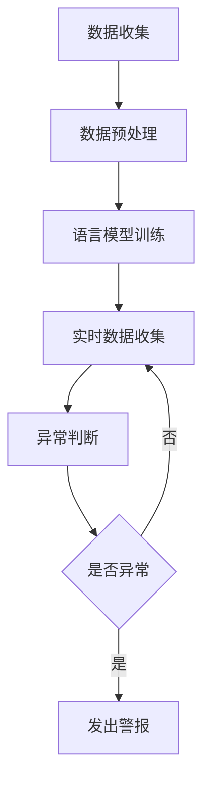

# 语言模型在复杂系统异常模式早期识别中的能力提升

> 关键词：语言模型、复杂系统、异常模式早期识别、能力提升、机器学习

> 摘要：本文聚焦于语言模型在复杂系统异常模式早期识别中的能力提升问题。首先介绍了相关背景，包括目的范围、预期读者等内容。接着阐述了核心概念与联系，通过文本示意图和Mermaid流程图展示其原理和架构。详细讲解了核心算法原理，结合Python代码进行说明，同时给出数学模型和公式并举例。通过项目实战，从开发环境搭建到源代码实现及解读进行了深入分析。探讨了实际应用场景，推荐了学习、开发相关的工具和资源，最后总结了未来发展趋势与挑战，解答了常见问题并提供了扩展阅读和参考资料，旨在为提升语言模型在复杂系统异常模式早期识别中的能力提供全面的技术指导。

## 1. 背景介绍 
### 1.1 目的和范围
在当今数字化时代，复杂系统广泛存在于各个领域，如电力系统、交通系统、金融系统等。这些系统的稳定运行对于社会的正常运转至关重要。然而，复杂系统往往具有高度的不确定性、非线性和动态性，使得异常模式的出现难以预测。早期识别复杂系统中的异常模式能够及时采取措施，避免系统故障的发生，减少损失。语言模型作为一种强大的人工智能技术，在自然语言处理等领域取得了显著的成果。本研究的目的是探索如何提升语言模型在复杂系统异常模式早期识别中的能力，范围涵盖了多种复杂系统的异常模式识别场景，包括但不限于工业生产、网络安全、医疗健康等领域。

### 1.2 预期读者
本文预期读者包括从事人工智能、机器学习、复杂系统研究的科研人员，以及在工业界从事系统监控、故障诊断等工作的工程师。对于对语言模型和复杂系统异常识别感兴趣的技术爱好者也具有一定的参考价值。

### 1.3 文档结构概述
本文将按照以下结构展开：首先介绍核心概念与联系，明确语言模型和复杂系统异常模式早期识别的相关概念和它们之间的关系；接着详细阐述核心算法原理和具体操作步骤，并使用Python代码进行说明；给出数学模型和公式，并通过举例进行详细讲解；通过项目实战展示代码的实际应用和详细解释；探讨语言模型在复杂系统异常模式早期识别中的实际应用场景；推荐相关的学习资源、开发工具框架和论文著作；最后总结未来发展趋势与挑战，解答常见问题并提供扩展阅读和参考资料。

### 1.4 术语表
#### 1.4.1 核心术语定义
- **语言模型**：是一种基于概率统计的模型，用于计算语言序列的概率分布，能够预测下一个可能出现的单词或字符。常见的语言模型有基于规则的语言模型、统计语言模型和神经网络语言模型。
- **复杂系统**：是由大量相互作用的组件组成的系统，这些组件之间的关系复杂且具有不确定性。复杂系统具有涌现性、自组织性、非线性等特点，如生态系统、社会系统等。
- **异常模式早期识别**：在复杂系统出现明显故障之前，通过对系统运行数据的分析，识别出可能导致故障的异常模式。早期识别能够为系统维护和修复提供足够的时间，减少损失。

#### 1.4.2 相关概念解释
- **机器学习**：是一门多领域交叉学科，涉及概率论、统计学、逼近论、凸分析、算法复杂度理论等多门学科。它专门研究计算机怎样模拟或实现人类的学习行为，以获取新的知识或技能，重新组织已有的知识结构使之不断改善自身的性能。
- **深度学习**：是机器学习的一个分支领域，它是一种基于对数据进行表征学习的方法。深度学习通过构建具有很多层的神经网络模型，自动从大量数据中学习到复杂的模式和特征。

#### 1.4.3 缩略词列表
- **NLP**：Natural Language Processing，自然语言处理
- **RNN**：Recurrent Neural Network，循环神经网络
- **LSTM**：Long Short-Term Memory，长短期记忆网络
- **GRU**：Gated Recurrent Unit，门控循环单元

## 2. 核心概念与联系 
### 核心概念原理
语言模型的核心原理是通过对大量文本数据的学习，建立起语言序列的概率分布模型。以神经网络语言模型为例，它通常使用多层神经网络来学习文本的特征表示和语义信息。在训练过程中，模型会不断调整参数，使得预测的下一个单词或字符的概率尽可能接近真实情况。

复杂系统异常模式早期识别的原理是通过对系统运行数据的监测和分析，发现数据中的异常模式。这些异常模式可能表现为数据的突然变化、偏离正常范围等。通过对异常模式的早期识别，可以及时采取措施，避免系统故障的发生。

### 架构的文本示意图
语言模型在复杂系统异常模式早期识别中的架构可以描述如下：首先，收集复杂系统的运行数据，包括传感器数据、日志数据等。然后，对这些数据进行预处理，如清洗、归一化等。接着，将预处理后的数据输入到语言模型中进行训练，语言模型会学习数据中的正常模式和异常模式。在实际应用中，实时收集系统运行数据，输入到训练好的语言模型中，模型会根据学习到的模式判断数据是否异常。如果发现异常，及时发出警报。

### Mermaid 流程图


## 3. 核心算法原理 & 具体操作步骤 
### 核心算法原理
在语言模型中，常用的算法有RNN、LSTM和GRU等。这里以LSTM为例进行介绍。

LSTM是一种特殊的RNN，它能够解决传统RNN在处理长序列时出现的梯度消失或梯度爆炸问题。LSTM通过引入门控机制，能够有效地控制信息的流动。LSTM单元主要由输入门、遗忘门和输出门组成。

输入门决定了当前输入信息有多少需要被添加到细胞状态中；遗忘门决定了上一时刻的细胞状态有多少需要被遗忘；输出门决定了当前细胞状态有多少需要被输出。

### Python源代码详细阐述
```python
import torch
import torch.nn as nn

class LSTMModel(nn.Module):
    def __init__(self, input_size, hidden_size, num_layers, output_size):
        super(LSTMModel, self).__init__()
        self.hidden_size = hidden_size
        self.num_layers = num_layers
        self.lstm = nn.LSTM(input_size, hidden_size, num_layers, batch_first=True)
        self.fc = nn.Linear(hidden_size, output_size)

    def forward(self, x):
        h0 = torch.zeros(self.num_layers, x.size(0), self.hidden_size).to(x.device)
        c0 = torch.zeros(self.num_layers, x.size(0), self.hidden_size).to(x.device)

        out, _ = self.lstm(x, (h0, c0))
        out = self.fc(out[:, -1, :])
        return out

# 示例使用
input_size = 10
hidden_size = 20
num_layers = 2
output_size = 1

model = LSTMModel(input_size, hidden_size, num_layers, output_size)
input_tensor = torch.randn(32, 5, input_size)  # 批量大小为32，序列长度为5
output = model(input_tensor)
print(output.shape)
```
### 具体操作步骤
1. **数据准备**：收集复杂系统的运行数据，并将其转换为适合LSTM模型输入的格式。通常需要将数据进行归一化处理，以提高模型的训练效果。
2. **模型定义**：定义LSTM模型的结构，包括输入层、LSTM层和输出层。
3. **模型训练**：使用准备好的数据对模型进行训练，通过反向传播算法不断调整模型的参数，使得模型的损失函数最小化。
4. **模型评估**：使用测试数据对训练好的模型进行评估，计算模型的准确率、召回率等指标，评估模型的性能。
5. **异常识别**：在实际应用中，实时收集系统运行数据，输入到训练好的模型中，根据模型的输出判断数据是否异常。

## 4. 数学模型和公式 & 详细讲解 & 举例说明 
### 数学模型和公式
#### LSTM单元的数学公式
遗忘门：
$$f_t = \sigma(W_f[h_{t-1}, x_t] + b_f)$$
输入门：
$$i_t = \sigma(W_i[h_{t-1}, x_t] + b_i)$$
候选细胞状态：
$$\tilde{C}_t = \tanh(W_C[h_{t-1}, x_t] + b_C)$$
细胞状态更新：
$$C_t = f_t \odot C_{t-1} + i_t \odot \tilde{C}_t$$
输出门：
$$o_t = \sigma(W_o[h_{t-1}, x_t] + b_o)$$
隐藏状态更新：
$$h_t = o_t \odot \tanh(C_t)$$

其中，$x_t$ 是当前时刻的输入，$h_{t-1}$ 是上一时刻的隐藏状态，$C_{t-1}$ 是上一时刻的细胞状态，$W$ 和 $b$ 是模型的参数，$\sigma$ 是sigmoid函数，$\tanh$ 是双曲正切函数，$\odot$ 表示逐元素相乘。

### 详细讲解
遗忘门 $f_t$ 用于控制上一时刻的细胞状态 $C_{t-1}$ 有多少需要被遗忘。输入门 $i_t$ 决定了当前输入信息 $\tilde{C}_t$ 有多少需要被添加到细胞状态中。细胞状态 $C_t$ 是通过遗忘门和输入门的组合更新得到的。输出门 $o_t$ 决定了当前细胞状态 $C_t$ 有多少需要被输出作为隐藏状态 $h_t$。

### 举例说明
假设我们有一个时间序列数据，每个时间步的输入是一个长度为3的向量。我们使用一个具有5个隐藏单元的LSTM单元来处理这个时间序列。在某个时间步 $t$，输入 $x_t = [0.1, 0.2, 0.3]$，上一时刻的隐藏状态 $h_{t-1} = [0.4, 0.5, 0.6, 0.7, 0.8]$，上一时刻的细胞状态 $C_{t-1} = [0.9, 1.0, 1.1, 1.2, 1.3]$。

首先，计算遗忘门：
$$f_t = \sigma(W_f[h_{t-1}, x_t] + b_f)$$
假设 $W_f$ 是一个 $5 \times 8$ 的矩阵，$b_f$ 是一个长度为5的向量。通过矩阵乘法和加法运算，再经过sigmoid函数，得到遗忘门的输出 $f_t$。

同理，计算输入门 $i_t$、候选细胞状态 $\tilde{C}_t$、细胞状态 $C_t$、输出门 $o_t$ 和隐藏状态 $h_t$。

## 5. 项目实战：代码实际案例和详细解释说明 
### 5.1  开发环境搭建
#### 安装Python
首先需要安装Python，建议使用Python 3.7及以上版本。可以从Python官方网站（https://www.python.org/downloads/）下载安装包进行安装。

#### 安装深度学习框架
使用PyTorch作为深度学习框架，可以通过以下命令进行安装：
```bash
pip install torch torchvision
```

#### 安装其他依赖库
还需要安装一些其他的依赖库，如numpy、pandas等，可以使用以下命令进行安装：
```bash
pip install numpy pandas
```

### 5.2  源代码详细实现和代码解读
```python
import torch
import torch.nn as nn
import numpy as np
import pandas as pd
from sklearn.preprocessing import MinMaxScaler
from torch.utils.data import Dataset, DataLoader

# 自定义数据集类
class TimeSeriesDataset(Dataset):
    def __init__(self, data, seq_length):
        self.data = data
        self.seq_length = seq_length

    def __len__(self):
        return len(self.data) - self.seq_length

    def __getitem__(self, idx):
        x = self.data[idx:idx+self.seq_length]
        y = self.data[idx+self.seq_length]
        return torch.tensor(x, dtype=torch.float32), torch.tensor(y, dtype=torch.float32)

# 定义LSTM模型
class LSTMModel(nn.Module):
    def __init__(self, input_size, hidden_size, num_layers, output_size):
        super(LSTMModel, self).__init__()
        self.hidden_size = hidden_size
        self.num_layers = num_layers
        self.lstm = nn.LSTM(input_size, hidden_size, num_layers, batch_first=True)
        self.fc = nn.Linear(hidden_size, output_size)

    def forward(self, x):
        h0 = torch.zeros(self.num_layers, x.size(0), self.hidden_size).to(x.device)
        c0 = torch.zeros(self.num_layers, x.size(0), self.hidden_size).to(x.device)

        out, _ = self.lstm(x, (h0, c0))
        out = self.fc(out[:, -1, :])
        return out

# 数据加载和预处理
def load_data(file_path, seq_length):
    data = pd.read_csv(file_path)
    data = data.values
    scaler = MinMaxScaler()
    data = scaler.fit_transform(data)
    dataset = TimeSeriesDataset(data, seq_length)
    return dataset, scaler

# 训练模型
def train_model(model, dataloader, criterion, optimizer, epochs):
    model.train()
    for epoch in range(epochs):
        total_loss = 0
        for inputs, labels in dataloader:
            optimizer.zero_grad()
            outputs = model(inputs)
            loss = criterion(outputs, labels)
            loss.backward()
            optimizer.step()
            total_loss += loss.item()
        print(f'Epoch {epoch+1}/{epochs}, Loss: {total_loss/len(dataloader)}')

# 主函数
def main():
    file_path = 'data.csv'
    seq_length = 10
    input_size = 1
    hidden_size = 20
    num_layers = 2
    output_size = 1
    batch_size = 32
    epochs = 100
    learning_rate = 0.001

    dataset, scaler = load_data(file_path, seq_length)
    dataloader = DataLoader(dataset, batch_size=batch_size, shuffle=True)

    model = LSTMModel(input_size, hidden_size, num_layers, output_size)
    criterion = nn.MSELoss()
    optimizer = torch.optim.Adam(model.parameters(), lr=learning_rate)

    train_model(model, dataloader, criterion, optimizer, epochs)

if __name__ == '__main__':
    main()
```
### 代码解读与分析
1. **自定义数据集类 `TimeSeriesDataset`**：继承自 `torch.utils.data.Dataset`，用于处理时间序列数据。`__len__` 方法返回数据集的长度，`__getitem__` 方法根据索引返回输入序列和对应的标签。
2. **LSTM模型类 `LSTMModel`**：定义了一个LSTM模型，包括LSTM层和全连接层。`forward` 方法实现了模型的前向传播过程。
3. **数据加载和预处理函数 `load_data`**：读取CSV文件中的数据，使用 `MinMaxScaler` 对数据进行归一化处理，然后创建数据集对象。
4. **训练模型函数 `train_model`**：使用给定的数据集、损失函数和优化器对模型进行训练。在每个epoch中，计算损失并进行反向传播更新模型参数。
5. **主函数 `main`**：设置各种参数，加载数据，创建模型、损失函数和优化器，然后调用 `train_model` 函数进行训练。

## 6. 实际应用场景 
### 工业生产
在工业生产中，复杂系统如生产线、化工过程等需要实时监测运行状态，以避免设备故障和生产事故。语言模型可以通过对传感器数据的分析，识别出设备的异常模式，如温度异常、压力异常等。例如，在汽车制造生产线中，通过监测机器人的运行参数，及时发现机器人的异常行为，提前进行维护，减少生产线的停机时间。

### 网络安全
在网络安全领域，复杂系统如企业网络、云计算平台等面临着各种安全威胁。语言模型可以通过对网络流量数据、日志数据的分析，识别出异常的网络行为，如黑客攻击、数据泄露等。例如，通过分析用户的登录行为模式，发现异常的登录尝试，及时采取措施保护网络安全。

### 医疗健康
在医疗健康领域，复杂系统如医院信息系统、医疗设备等需要保证稳定运行。语言模型可以通过对患者的医疗数据、设备运行数据的分析，识别出医疗过程中的异常模式，如医疗设备故障、患者病情恶化等。例如，通过监测心电图数据，及时发现患者的心脏异常情况，为医生提供决策支持。

## 7. 工具和资源推荐
### 7.1 学习资源推荐
#### 7.1.1 书籍推荐
- 《深度学习》（Deep Learning）：由Ian Goodfellow、Yoshua Bengio和Aaron Courville撰写，是深度学习领域的经典教材，涵盖了深度学习的基本原理、算法和应用。
- 《Python深度学习》（Deep Learning with Python）：由Francois Chollet撰写，介绍了如何使用Python和Keras进行深度学习开发，适合初学者。
- 《自然语言处理入门》：由何晗撰写，系统介绍了自然语言处理的基本概念、算法和应用，是学习自然语言处理的入门书籍。

#### 7.1.2 在线课程
- Coursera上的“深度学习专项课程”（Deep Learning Specialization）：由Andrew Ng教授讲授，包括深度学习的基础知识、卷积神经网络、循环神经网络等内容。
- edX上的“自然语言处理”（Natural Language Processing）：由华盛顿大学的教授讲授，介绍了自然语言处理的各种技术和应用。

#### 7.1.3 技术博客和网站
- Medium：是一个技术博客平台，有很多关于人工智能、机器学习的优秀文章。
- arXiv：是一个预印本服务器，提供了大量的学术论文，包括人工智能、机器学习等领域的最新研究成果。

### 7.2 开发工具框架推荐
#### 7.2.1 IDE和编辑器
- PyCharm：是一款专门为Python开发设计的集成开发环境，具有代码编辑、调试、版本控制等功能。
- Jupyter Notebook：是一个交互式的开发环境，适合进行数据探索、模型实验等工作。

#### 7.2.2 调试和性能分析工具
- TensorBoard：是TensorFlow提供的一个可视化工具，可以用于可视化模型的训练过程、性能指标等。
- PyTorch Profiler：是PyTorch提供的一个性能分析工具，可以帮助用户分析模型的性能瓶颈。

#### 7.2.3 相关框架和库
- PyTorch：是一个开源的深度学习框架，具有动态图、易于使用等特点。
- TensorFlow：是一个广泛使用的深度学习框架，提供了丰富的工具和库。
- NLTK：是一个自然语言处理工具包，提供了各种自然语言处理的算法和数据集。

### 7.3 相关论文著作推荐
#### 7.3.1 经典论文
- “Long Short-Term Memory”：由Sepp Hochreiter和Jürgen Schmidhuber撰写，介绍了LSTM的基本原理和结构。
- “Attention Is All You Need”：提出了Transformer模型，是自然语言处理领域的重要突破。

#### 7.3.2 最新研究成果
- 在arXiv上搜索“Language model for anomaly detection in complex systems”可以找到关于语言模型在复杂系统异常检测中的最新研究成果。

#### 7.3.3 应用案例分析
- 可以在ACM、IEEE等学术数据库中搜索相关的应用案例分析论文，了解语言模型在不同领域的实际应用情况。

## 8. 总结：未来发展趋势与挑战
### 未来发展趋势
- **多模态融合**：未来的语言模型可能会融合更多的模态信息，如图像、音频等，以提高在复杂系统异常模式早期识别中的能力。例如，在工业生产中，结合设备的图像信息和传感器数据进行异常识别。
- **自适应学习**：语言模型将具备更强的自适应学习能力，能够根据复杂系统的动态变化实时调整模型参数，提高识别的准确性和及时性。
- **可解释性增强**：随着人工智能技术的发展，对语言模型的可解释性要求越来越高。未来的语言模型将更加注重可解释性，能够向用户解释异常识别的依据和过程。

### 挑战
- **数据质量和标注**：复杂系统的运行数据往往存在噪声、缺失值等问题，数据的质量直接影响语言模型的性能。此外，异常模式的标注也比较困难，需要专业的领域知识。
- **计算资源需求**：训练和运行语言模型需要大量的计算资源，尤其是在处理大规模数据时。如何在有限的计算资源下提高模型的性能是一个挑战。
- **模型泛化能力**：复杂系统的异常模式具有多样性和不确定性，语言模型需要具备较强的泛化能力，能够识别不同类型的异常模式。

## 9. 附录：常见问题与解答
### 问题1：如何选择合适的语言模型？
解答：选择合适的语言模型需要考虑多个因素，如数据规模、问题复杂度、计算资源等。如果数据规模较小，可以选择简单的统计语言模型；如果数据规模较大且问题复杂，可以选择神经网络语言模型，如LSTM、Transformer等。

### 问题2：如何处理复杂系统数据中的噪声和缺失值？
解答：对于噪声数据，可以使用滤波算法进行处理，如均值滤波、中值滤波等。对于缺失值，可以使用插值方法进行填充，如线性插值、样条插值等。

### 问题3：如何评估语言模型在复杂系统异常模式早期识别中的性能？
解答：可以使用准确率、召回率、F1值等指标来评估模型的性能。此外，还可以使用ROC曲线、AUC值等指标来评估模型的分类能力。

## 10. 扩展阅读 & 参考资料
### 扩展阅读
- 《人工智能：现代方法》（Artificial Intelligence: A Modern Approach）：全面介绍了人工智能的各个领域，包括知识表示、推理、学习、规划等。
- 《复杂》（Complexity: A Guided Tour）：介绍了复杂系统的基本概念、理论和方法，帮助读者理解复杂系统的本质。

### 参考资料
- 相关的学术论文和研究报告，如IEEE Transactions on Neural Networks and Learning Systems、ACM Transactions on Intelligent Systems and Technology等期刊上的文章。
- 开源项目和代码库，如GitHub上的相关项目，可以参考他人的实现和经验。

作者：AI天才研究院/AI Genius Institute & 禅与计算机程序设计艺术 /Zen And The Art of Computer Programming