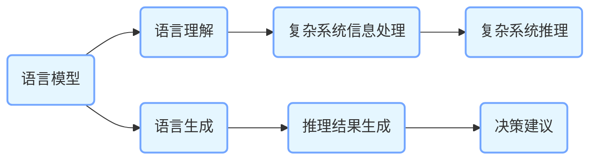

# 语言模型在复杂系统推理中的能力培养

> 关键词：语言模型、复杂系统推理、能力培养、算法原理、应用场景

> 摘要：本文聚焦于语言模型在复杂系统推理中的能力培养。首先介绍了相关背景知识，包括目的范围、预期读者等。接着阐述核心概念及联系，通过文本示意图和 Mermaid 流程图直观展示。详细讲解核心算法原理和具体操作步骤，并结合 Python 代码说明。深入探讨数学模型和公式，辅以举例加深理解。进行项目实战，从开发环境搭建到代码详细实现与解读。分析实际应用场景，推荐相关工具和资源。最后总结未来发展趋势与挑战，解答常见问题并提供扩展阅读和参考资料，旨在为提升语言模型在复杂系统推理中的能力提供全面的技术指导。

## 1. 背景介绍 
### 1.1 目的和范围
在当今数字化时代，复杂系统无处不在，如金融市场、生态系统、交通网络等。这些系统具有高度的复杂性、不确定性和动态性，对其进行准确的推理和分析是极具挑战性的任务。语言模型作为人工智能领域的重要成果，具有强大的语言理解和生成能力。本文章的目的在于探讨如何培养语言模型在复杂系统推理中的能力，以帮助其更好地处理复杂系统中的各种信息，做出准确的推理和决策。

本文章的范围涵盖了语言模型在复杂系统推理中的核心概念、算法原理、数学模型、项目实战、应用场景以及相关工具和资源等方面。通过对这些内容的深入研究，为研究人员和开发者提供全面的技术指导，推动语言模型在复杂系统推理领域的应用和发展。

### 1.2 预期读者
本文的预期读者主要包括以下几类人群：
- **人工智能研究人员**：对语言模型和复杂系统推理感兴趣，希望深入了解相关技术原理和最新研究成果的研究人员。
- **软件开发工程师**：从事人工智能、机器学习相关软件开发工作，需要将语言模型应用到复杂系统推理中的工程师。
- **数据分析人员**：负责处理复杂系统中的数据，希望借助语言模型提高数据分析和推理能力的人员。
- **高校学生**：学习计算机科学、人工智能、数学等相关专业，对语言模型和复杂系统推理有一定了解，希望进一步深入学习的学生。

### 1.3 文档结构概述
本文将按照以下结构进行组织：
- **核心概念与联系**：介绍语言模型和复杂系统推理的核心概念，以及它们之间的联系，通过文本示意图和 Mermaid 流程图进行直观展示。
- **核心算法原理 & 具体操作步骤**：详细讲解用于培养语言模型在复杂系统推理中能力的核心算法原理，并给出具体的操作步骤，同时结合 Python 代码进行说明。
- **数学模型和公式 & 详细讲解 & 举例说明**：深入探讨相关的数学模型和公式，对其进行详细讲解，并通过具体的例子加深理解。
- **项目实战：代码实际案例和详细解释说明**：通过一个实际的项目案例，介绍开发环境的搭建、源代码的详细实现和代码解读，帮助读者更好地掌握相关技术。
- **实际应用场景**：分析语言模型在复杂系统推理中的实际应用场景，展示其在不同领域的应用价值。
- **工具和资源推荐**：推荐相关的学习资源、开发工具框架和论文著作，帮助读者进一步深入学习和研究。
- **总结：未来发展趋势与挑战**：总结语言模型在复杂系统推理中的发展趋势和面临的挑战，为未来的研究和发展提供参考。
- **附录：常见问题与解答**：解答读者在学习和应用过程中常见的问题，帮助读者更好地理解和掌握相关知识。
- **扩展阅读 & 参考资料**：提供相关的扩展阅读材料和参考资料，方便读者进一步深入学习和研究。

### 1.4 术语表
#### 1.4.1 核心术语定义
- **语言模型**：是一种概率模型，用于计算一个句子或一段文本出现的概率。它可以根据给定的上下文预测下一个单词或字符的概率分布。
- **复杂系统**：是由大量相互作用的组件组成的系统，这些组件之间的关系复杂且非线性，系统具有高度的不确定性和动态性。
- **复杂系统推理**：是指在复杂系统中，根据已知的信息和规则，推导出未知信息和结论的过程。
- **能力培养**：是指通过各种方法和手段，提高语言模型在复杂系统推理中的性能和能力。

#### 1.4.2 相关概念解释
- **深度学习**：是一种基于人工神经网络的机器学习方法，通过多层神经网络对数据进行学习和表示，能够自动提取数据中的特征和模式。
- **强化学习**：是一种机器学习方法，智能体通过与环境进行交互，根据环境反馈的奖励信号来学习最优的行为策略。
- **知识图谱**：是一种语义网络，用于表示实体之间的关系和知识，能够为语言模型提供更丰富的背景知识和语义信息。

#### 1.4.3 缩略词列表
- **NLP**：Natural Language Processing，自然语言处理
- **RNN**：Recurrent Neural Network，循环神经网络
- **LSTM**：Long Short-Term Memory，长短期记忆网络
- **GRU**：Gated Recurrent Unit，门控循环单元
- **Transformer**：一种基于注意力机制的深度学习模型

## 2. 核心概念与联系 

### 语言模型的基本概念
语言模型旨在对自然语言文本的概率分布进行建模。简单来说，它能够预测给定前文下后续文本出现的可能性。例如，对于句子“今天天气很”，语言模型会根据其学习到的知识，给出“好”“晴朗”“糟糕”等不同后续词的概率。

常见的语言模型包括基于统计的 n - 元语法模型和基于深度学习的神经网络模型，如 RNN、LSTM、GRU 以及 Transformer 等。n - 元语法模型假设当前词的出现只依赖于前 n - 1 个词，通过统计语料库中词的共现频率来估计概率。而深度学习模型则能够捕捉更复杂的语义和语法信息，通过大量的数据进行训练，学习到语言的深层次表示。

### 复杂系统推理的概念
复杂系统是由众多相互关联、相互作用的组件组成的系统，其行为具有高度的非线性、不确定性和动态性。复杂系统推理就是在这样的系统中，根据已知的信息和规则，推导出未知的信息和结论。

例如，在金融市场这个复杂系统中，需要考虑宏观经济指标、公司财务状况、政策法规等众多因素，通过对这些信息的分析和推理，预测股票价格的走势。在生态系统中，需要考虑物种之间的相互关系、环境因素等，推理生态系统的稳定性和变化趋势。

### 语言模型与复杂系统推理的联系
语言模型可以为复杂系统推理提供强大的语言理解和生成能力。通过对复杂系统相关的文本信息进行处理和分析，语言模型能够提取关键信息，理解系统的状态和规则。同时，语言模型还可以生成推理结果和决策建议，帮助用户更好地理解和应对复杂系统。

例如，在医疗诊断这个复杂系统中，语言模型可以处理病历、检查报告等文本信息，提取症状、疾病史等关键信息，然后根据医学知识和规则进行推理，给出可能的诊断结果和治疗建议。

### 文本示意图
```plaintext
           语言模型
          /         \
         /           \
  语言理解         语言生成
    |                |
    |                |
复杂系统信息处理    推理结果生成
    |                |
    |                |
复杂系统推理        决策建议
```

### Mermaid 流程图


## 3. 核心算法原理 & 具体操作步骤 

### 核心算法原理
#### Transformer 模型
Transformer 是一种基于注意力机制的深度学习模型，在自然语言处理领域取得了巨大的成功。它通过多头自注意力机制，能够捕捉输入序列中不同位置之间的依赖关系，从而更好地理解文本的语义信息。

Transformer 模型主要由编码器和解码器两部分组成。编码器将输入的文本序列转换为一系列的特征向量，解码器则根据编码器的输出和之前生成的词，逐步生成输出序列。

#### 多头自注意力机制
多头自注意力机制是 Transformer 模型的核心组件之一。它将输入序列的每个位置与其他位置进行关联，计算它们之间的相似度，然后根据相似度对输入序列进行加权求和，得到每个位置的上下文表示。

具体来说，多头自注意力机制将输入序列的特征向量分别映射到查询（Query）、键（Key）和值（Value）三个空间，然后通过计算查询和键之间的点积相似度，得到注意力分数。最后，根据注意力分数对值进行加权求和，得到每个位置的上下文表示。

#### 强化学习算法
强化学习算法可以用于训练语言模型在复杂系统推理中的能力。在强化学习中，智能体通过与环境进行交互，根据环境反馈的奖励信号来学习最优的行为策略。

例如，在复杂系统推理任务中，语言模型可以作为智能体，根据当前的系统状态生成推理结果，环境根据推理结果的准确性给予奖励或惩罚。语言模型通过不断地与环境进行交互，调整自己的参数，以最大化累积奖励。

### 具体操作步骤
#### 数据准备
首先，需要收集和整理与复杂系统相关的文本数据，包括系统描述、规则、历史记录等。然后，对数据进行预处理，如分词、去除停用词、标注等。

#### 模型训练
使用准备好的数据对 Transformer 模型进行训练。可以采用有监督学习或强化学习的方法进行训练。在有监督学习中，使用标注好的数据进行训练，目标是最小化模型的预测误差。在强化学习中，定义奖励函数，根据环境反馈的奖励信号对模型进行训练。

#### 模型评估
使用测试数据集对训练好的模型进行评估。可以采用准确率、召回率、F1 值等指标来评估模型的性能。

#### 模型优化
根据评估结果，对模型进行优化。可以调整模型的超参数，如学习率、批次大小等，也可以增加训练数据或改进数据预处理方法。

### Python 代码示例
```python
import torch
import torch.nn as nn
import torch.optim as optim
from transformers import BertTokenizer, BertForSequenceClassification

# 数据准备
tokenizer = BertTokenizer.from_pretrained('bert-base-uncased')
text = "这是一个复杂系统推理的示例。"
inputs = tokenizer(text, return_tensors='pt')

# 模型定义
model = BertForSequenceClassification.from_pretrained('bert-base-uncased', num_labels=2)

# 定义损失函数和优化器
criterion = nn.CrossEntropyLoss()
optimizer = optim.Adam(model.parameters(), lr=1e-5)

# 模型训练
labels = torch.tensor([1])  # 示例标签
outputs = model(**inputs, labels=labels)
loss = outputs.loss
loss.backward()
optimizer.step()

# 模型评估
with torch.no_grad():
    outputs = model(**inputs)
    logits = outputs.logits
    predictions = torch.argmax(logits, dim=1)
    print("预测结果:", predictions.item())
```

## 4. 数学模型和公式 & 详细讲解 & 举例说明 

### 语言模型的数学模型
#### n - 元语法模型
n - 元语法模型假设当前词的出现只依赖于前 n - 1 个词。对于一个长度为 m 的句子 $w_1, w_2, \cdots, w_m$，其概率可以表示为：

$$P(w_1, w_2, \cdots, w_m) = \prod_{i=1}^{m} P(w_i | w_{i - n + 1}, \cdots, w_{i - 1})$$

其中，$P(w_i | w_{i - n + 1}, \cdots, w_{i - 1})$ 表示在给定前 n - 1 个词的条件下，词 $w_i$ 出现的概率。这个概率可以通过统计语料库中词的共现频率来估计：

$$P(w_i | w_{i - n + 1}, \cdots, w_{i - 1}) = \frac{C(w_{i - n + 1}, \cdots, w_{i - 1}, w_i)}{C(w_{i - n + 1}, \cdots, w_{i - 1})}$$

其中，$C(w_{i - n + 1}, \cdots, w_{i - 1}, w_i)$ 表示词序列 $w_{i - n + 1}, \cdots, w_{i - 1}, w_i$ 在语料库中出现的次数，$C(w_{i - n + 1}, \cdots, w_{i - 1})$ 表示词序列 $w_{i - n + 1}, \cdots, w_{i - 1}$ 在语料库中出现的次数。

#### 神经网络语言模型
神经网络语言模型通过神经网络来学习语言的概率分布。以简单的前馈神经网络语言模型为例，假设输入是前 n - 1 个词的词向量，输出是下一个词的概率分布。网络的输入层将输入的词向量拼接成一个向量，隐藏层对输入向量进行非线性变换，输出层通过 softmax 函数将隐藏层的输出转换为概率分布。

设输入的词向量为 $x_1, x_2, \cdots, x_{n - 1}$，隐藏层的输出为 $h$，输出层的输出为 $y$，则有：

$$h = \tanh(W_1 [x_1; x_2; \cdots; x_{n - 1}] + b_1)$$

$$y = \text{softmax}(W_2 h + b_2)$$

其中，$W_1$ 和 $W_2$ 是权重矩阵，$b_1$ 和 $b_2$ 是偏置向量，$\tanh$ 是双曲正切激活函数，$\text{softmax}$ 是 softmax 激活函数。

### 多头自注意力机制的数学公式
#### 注意力分数计算
在多头自注意力机制中，查询（Query）、键（Key）和值（Value）分别通过线性变换得到：

$$Q = XW^Q$$
$$K = XW^K$$
$$V = XW^V$$

其中，$X$ 是输入序列的特征向量，$W^Q$、$W^K$ 和 $W^V$ 是可学习的权重矩阵。

注意力分数通过查询和键的点积计算得到：

$$\text{Attention}(Q, K, V) = \text{softmax}\left(\frac{QK^T}{\sqrt{d_k}}\right)V$$

其中，$d_k$ 是查询和键的维度，$\sqrt{d_k}$ 是为了防止点积结果过大。

#### 多头注意力
多头注意力将输入序列的特征向量分别映射到多个子空间，然后在每个子空间中计算注意力分数，最后将多个子空间的注意力结果拼接起来并进行线性变换：

$$\text{MultiHead}(Q, K, V) = \text{Concat}(\text{head}_1, \cdots, \text{head}_h)W^O$$

其中，$\text{head}_i = \text{Attention}(QW_i^Q, KW_i^K, VW_i^V)$，$h$ 是头的数量，$W_i^Q$、$W_i^K$ 和 $W_i^V$ 是每个头的可学习权重矩阵，$W^O$ 是最终的线性变换权重矩阵。

### 强化学习的数学模型
#### 马尔可夫决策过程（MDP）
强化学习可以用马尔可夫决策过程来描述。一个马尔可夫决策过程由五元组 $(S, A, P, R, \gamma)$ 组成，其中：
- $S$ 是状态空间，表示系统的所有可能状态。
- $A$ 是动作空间，表示智能体可以采取的所有可能动作。
- $P(s' | s, a)$ 是状态转移概率，表示在状态 $s$ 下采取动作 $a$ 后转移到状态 $s'$ 的概率。
- $R(s, a, s')$ 是奖励函数，表示在状态 $s$ 下采取动作 $a$ 后转移到状态 $s'$ 所获得的奖励。
- $\gamma$ 是折扣因子，用于权衡当前奖励和未来奖励的重要性。

#### 策略和价值函数
智能体的策略 $\pi(a | s)$ 表示在状态 $s$ 下采取动作 $a$ 的概率。价值函数用于评估在某个策略下状态或状态 - 动作对的价值。

状态价值函数 $V^\pi(s)$ 表示在策略 $\pi$ 下从状态 $s$ 开始的期望累积奖励：

$$V^\pi(s) = \mathbb{E}_\pi\left[\sum_{t = 0}^{\infty} \gamma^t R(s_t, a_t, s_{t + 1}) | s_0 = s\right]$$

状态 - 动作价值函数 $Q^\pi(s, a)$ 表示在策略 $\pi$ 下从状态 $s$ 采取动作 $a$ 开始的期望累积奖励：

$$Q^\pi(s, a) = \mathbb{E}_\pi\left[\sum_{t = 0}^{\infty} \gamma^t R(s_t, a_t, s_{t + 1}) | s_0 = s, a_0 = a\right]$$

### 举例说明
#### n - 元语法模型示例
假设语料库中有以下句子：“我喜欢吃苹果”“他喜欢吃香蕉”“她喜欢吃葡萄”。对于 2 - 元语法模型，计算 $P(\text{吃} | \text{喜欢})$ 的概率。

在语料库中，“喜欢”出现了 3 次，“喜欢吃”出现了 3 次，所以 $P(\text{吃} | \text{喜欢}) = \frac{3}{3} = 1$。

#### 多头自注意力机制示例
假设输入序列的特征向量 $X$ 是一个 $4 \times 8$ 的矩阵，表示 4 个词的 8 维特征向量。查询、键和值的权重矩阵 $W^Q$、$W^K$ 和 $W^V$ 都是 $8 \times 4$ 的矩阵。头的数量 $h = 2$，每个头的权重矩阵 $W_i^Q$、$W_i^K$ 和 $W_i^V$ 都是 $8 \times 2$ 的矩阵，最终的线性变换权重矩阵 $W^O$ 是 $4 \times 8$ 的矩阵。

首先，计算查询、键和值：

$$Q = XW^Q$$
$$K = XW^K$$
$$V = XW^V$$

然后，在每个头中计算注意力分数：

$$\text{head}_1 = \text{Attention}(QW_1^Q, KW_1^K, VW_1^V)$$
$$\text{head}_2 = \text{Attention}(QW_2^Q, KW_2^K, VW_2^V)$$

最后，将两个头的注意力结果拼接起来并进行线性变换：

$$\text{MultiHead}(Q, K, V) = \text{Concat}(\text{head}_1, \text{head}_2)W^O$$

## 5. 项目实战：代码实际案例和详细解释说明 

### 5.1  开发环境搭建
#### 操作系统
建议使用 Linux 系统，如 Ubuntu 18.04 或更高版本。也可以使用 Windows 或 macOS 系统，但可能需要进行一些额外的配置。

#### Python 环境
安装 Python 3.7 或更高版本。可以使用 Anaconda 或 Miniconda 来管理 Python 环境。

#### 依赖库安装
安装以下必要的依赖库：
```bash
pip install torch transformers numpy pandas scikit-learn
```

### 5.2  源代码详细实现和代码解读
#### 数据加载和预处理
```python
import pandas as pd
from transformers import BertTokenizer

# 加载数据
data = pd.read_csv('data.csv')
texts = data['text'].tolist()
labels = data['label'].tolist()

# 初始化 tokenizer
tokenizer = BertTokenizer.from_pretrained('bert-base-uncased')

# 数据预处理
input_ids = []
attention_masks = []

for text in texts:
    encoded_dict = tokenizer.encode_plus(
                        text,                      # 输入文本
                        add_special_tokens = True, # 添加特殊标记 [CLS] 和 [SEP]
                        max_length = 128,          # 最大序列长度
                        pad_to_max_length = True,  # 填充到最大长度
                        return_attention_mask = True,   # 返回注意力掩码
                        return_tensors = 'pt',     # 返回 PyTorch 张量
                   )
    
    input_ids.append(encoded_dict['input_ids'])
    attention_masks.append(encoded_dict['attention_mask'])

# 将列表转换为张量
input_ids = torch.cat(input_ids, dim=0)
attention_masks = torch.cat(attention_masks, dim=0)
labels = torch.tensor(labels)
```
**代码解读**：
- 首先，使用 `pandas` 库加载 CSV 格式的数据文件，将文本和标签分别存储在 `texts` 和 `labels` 列表中。
- 然后，初始化 `BertTokenizer`，用于将文本转换为模型可以接受的输入格式。
- 对于每个文本，使用 `encode_plus` 方法进行编码，添加特殊标记、填充到最大长度，并返回注意力掩码。
- 最后，将编码后的输入 ID 和注意力掩码转换为 PyTorch 张量。

#### 模型定义和训练
```python
from torch.utils.data import TensorDataset, DataLoader, RandomSampler, SequentialSampler
from transformers import BertForSequenceClassification, AdamW

# 创建数据集和数据加载器
dataset = TensorDataset(input_ids, attention_masks, labels)
train_sampler = RandomSampler(dataset)
train_dataloader = DataLoader(dataset, sampler=train_sampler, batch_size=32)

# 定义模型
model = BertForSequenceClassification.from_pretrained(
    "bert-base-uncased", 
    num_labels = 2,   
    output_attentions = False, 
    output_hidden_states = False, 
)

# 定义优化器
optimizer = AdamW(model.parameters(), lr=2e-5)

# 训练模型
epochs = 4
for epoch in range(epochs):
    model.train()
    total_loss = 0
    for step, batch in enumerate(train_dataloader):
        b_input_ids = batch[0]
        b_input_mask = batch[1]
        b_labels = batch[2]

        model.zero_grad()        
        outputs = model(b_input_ids, 
                    token_type_ids=None, 
                    attention_mask=b_input_mask, 
                    labels=b_labels)
        
        loss = outputs.loss
        total_loss += loss.item()
        loss.backward()
        torch.nn.utils.clip_grad_norm_(model.parameters(), 1.0)
        optimizer.step()
    
    avg_train_loss = total_loss / len(train_dataloader)
    print(f'Epoch {epoch + 1}: Average training loss = {avg_train_loss}')
```
**代码解读**：
- 使用 `TensorDataset` 将输入 ID、注意力掩码和标签组合成一个数据集，然后使用 `RandomSampler` 和 `DataLoader` 创建训练数据加载器。
- 加载预训练的 `BertForSequenceClassification` 模型，并设置分类的类别数为 2。
- 定义 `AdamW` 优化器，用于更新模型的参数。
- 在每个训练周期中，将模型设置为训练模式，遍历训练数据加载器，计算损失并进行反向传播和参数更新。
- 最后，计算每个训练周期的平均训练损失并打印。

#### 模型评估
```python
from sklearn.metrics import accuracy_score

# 创建测试数据集和数据加载器
test_dataset = TensorDataset(input_ids, attention_masks, labels)
test_sampler = SequentialSampler(test_dataset)
test_dataloader = DataLoader(test_dataset, sampler=test_sampler, batch_size=32)

# 评估模型
model.eval()
predictions = []
true_labels = []

for batch in test_dataloader:
    b_input_ids = batch[0]
    b_input_mask = batch[1]
    b_labels = batch[2]
    
    with torch.no_grad():
        outputs = model(b_input_ids, 
                        token_type_ids=None, 
                        attention_mask=b_input_mask)
    
    logits = outputs.logits
    logits = logits.detach().cpu().numpy()
    label_ids = b_labels.to('cpu').numpy()
    
    predictions.extend(np.argmax(logits, axis=1).tolist())
    true_labels.extend(label_ids.tolist())

# 计算准确率
accuracy = accuracy_score(true_labels, predictions)
print(f'Accuracy: {accuracy}')
```
**代码解读**：
- 创建测试数据集和数据加载器，使用 `SequentialSampler` 按顺序采样。
- 将模型设置为评估模式，遍历测试数据加载器，计算模型的输出。
- 将模型的输出转换为预测标签，并将真实标签和预测标签存储在列表中。
- 最后，使用 `sklearn` 库的 `accuracy_score` 函数计算模型的准确率并打印。

### 5.3  代码解读与分析
#### 数据预处理
数据预处理是整个项目的基础，它将原始文本数据转换为模型可以接受的输入格式。在本项目中，使用 `BertTokenizer` 对文本进行编码，添加特殊标记、填充到最大长度，并返回注意力掩码。这些操作可以确保输入数据的一致性和规范性，提高模型的训练效果。

#### 模型训练
模型训练是通过优化器不断调整模型的参数，使得模型在训练数据上的损失最小化。在本项目中，使用 `AdamW` 优化器进行参数更新，并设置了学习率和训练周期。在每个训练周期中，遍历训练数据加载器，计算损失并进行反向传播和参数更新。同时，使用 `clip_grad_norm_` 函数对梯度进行裁剪，防止梯度爆炸。

#### 模型评估
模型评估是衡量模型性能的重要步骤。在本项目中，使用测试数据集对模型进行评估，计算模型的准确率。通过比较真实标签和预测标签，可以直观地了解模型的性能。

## 6. 实际应用场景 
### 金融领域
#### 股票价格预测
在金融市场中，股票价格受到众多因素的影响，如宏观经济指标、公司财务状况、政策法规等。语言模型可以处理和分析大量的金融新闻、研报等文本信息，提取关键信息和情感倾向，结合历史数据和市场趋势，对股票价格进行预测。例如，通过分析公司的财报和新闻报道，语言模型可以判断公司的业绩和发展前景，从而预测其股票价格的走势。

#### 风险评估
金融机构需要对各种风险进行评估，如信用风险、市场风险等。语言模型可以处理和分析客户的信用报告、贷款申请等文本信息，提取关键信息和风险因素，结合其他数据和模型，对客户的信用风险进行评估。例如，通过分析客户的信用历史和财务状况，语言模型可以判断客户的还款能力和违约风险，为金融机构的决策提供参考。

### 医疗领域
#### 疾病诊断
在医疗诊断中，医生需要根据患者的症状、病史、检查报告等信息进行综合分析，做出准确的诊断。语言模型可以处理和分析大量的病历、医学文献等文本信息，提取关键信息和诊断规则，结合患者的实际情况，为医生提供诊断建议。例如，通过分析患者的症状和检查报告，语言模型可以判断患者可能患有哪些疾病，为医生的诊断提供参考。

#### 药物研发
药物研发是一个复杂的过程，需要进行大量的实验和研究。语言模型可以处理和分析大量的医学文献、临床试验数据等文本信息，提取关键信息和研究成果，为药物研发提供支持。例如，通过分析药物的作用机制和临床试验结果，语言模型可以判断药物的疗效和安全性，为药物研发的决策提供参考。

### 交通领域
#### 交通流量预测
在交通领域，交通流量的预测对于交通管理和规划非常重要。语言模型可以处理和分析交通新闻、社交媒体等文本信息，提取关键信息和交通事件，结合历史数据和交通模型，对交通流量进行预测。例如，通过分析交通事故、道路施工等信息，语言模型可以判断交通流量的变化趋势，为交通管理部门的决策提供参考。

#### 智能交通系统
智能交通系统需要对交通信息进行实时处理和分析，以实现交通的优化和管理。语言模型可以处理和分析交通传感器、摄像头等设备采集的文本信息，提取关键信息和交通状态，结合其他数据和模型，为智能交通系统提供决策支持。例如，通过分析交通流量、车速等信息，语言模型可以判断交通拥堵的程度和位置，为交通信号控制和路径规划提供参考。

## 7. 工具和资源推荐
### 7.1 学习资源推荐
#### 7.1.1 书籍推荐
- 《深度学习》（Deep Learning）：由 Ian Goodfellow、Yoshua Bengio 和 Aaron Courville 合著，是深度学习领域的经典教材，全面介绍了深度学习的基本概念、算法和应用。
- 《自然语言处理入门》：由何晗著，系统介绍了自然语言处理的基本概念、算法和应用，适合初学者入门。
- 《Python 深度学习》（Deep Learning with Python）：由 Francois Chollet 著，结合 Keras 框架介绍了深度学习的基本概念和应用，适合 Python 开发者学习。

#### 7.1.2 在线课程
- Coursera 上的“深度学习专项课程”（Deep Learning Specialization）：由 Andrew Ng 教授授课，全面介绍了深度学习的基本概念、算法和应用。
- edX 上的“自然语言处理基础”（Foundations of Natural Language Processing）：由 Mark Dredze 教授授课，系统介绍了自然语言处理的基本概念、算法和应用。
- 吴恩达老师的“机器学习”课程：在 Coursera 平台上，是机器学习领域的经典课程，介绍了机器学习的基本概念、算法和应用。

#### 7.1.3 技术博客和网站
- Medium 上的 Towards Data Science：是一个专注于数据科学和机器学习的技术博客，发布了大量的高质量文章和教程。
- arXiv.org：是一个预印本服务器，提供了大量的学术论文和研究成果，涵盖了人工智能、机器学习、自然语言处理等领域。
- Hugging Face：是一个专注于自然语言处理的开源社区，提供了大量的预训练模型、数据集和工具，方便开发者进行自然语言处理任务的开发。

### 7.2 开发工具框架推荐
#### 7.2.1 IDE和编辑器
- PyCharm：是一款专门为 Python 开发设计的集成开发环境，提供了丰富的功能和工具，如代码编辑、调试、版本控制等。
- Jupyter Notebook：是一个基于网页的交互式开发环境，适合进行数据探索、模型训练和可视化等工作。
- Visual Studio Code：是一款轻量级的代码编辑器，支持多种编程语言和插件，具有丰富的扩展功能。

#### 7.2.2 调试和性能分析工具
- PyTorch Profiler：是 PyTorch 提供的性能分析工具，可以帮助开发者分析模型的训练和推理性能，找出性能瓶颈。
- TensorBoard：是 TensorFlow 提供的可视化工具，可以帮助开发者可视化模型的训练过程、损失曲线、准确率等指标。
- cProfile：是 Python 标准库中的性能分析工具，可以帮助开发者分析 Python 代码的性能，找出性能瓶颈。

#### 7.2.3 相关框架和库
- PyTorch：是一个开源的深度学习框架，具有动态图、易于使用等优点，广泛应用于自然语言处理、计算机视觉等领域。
- TensorFlow：是一个开源的深度学习框架，具有强大的分布式训练能力和丰富的工具库，广泛应用于工业界和学术界。
- Transformers：是 Hugging Face 开发的一个开源库，提供了大量的预训练模型和工具，方便开发者进行自然语言处理任务的开发。

### 7.3 相关论文著作推荐
#### 7.3.1 经典论文
- “Attention Is All You Need”：提出了 Transformer 模型，是自然语言处理领域的经典论文，为后续的研究和应用奠定了基础。
- “BERT: Pre-training of Deep Bidirectional Transformers for Language Understanding”：提出了 BERT 模型，在自然语言处理任务中取得了巨大的成功，推动了预训练模型的发展。
- “Generative Adversarial Nets”：提出了生成对抗网络（GAN），是深度学习领域的重要成果，在图像生成、文本生成等领域具有广泛的应用。

#### 7.3.2 最新研究成果
- 关注 arXiv.org 上的最新论文，了解语言模型在复杂系统推理中的最新研究成果和发展趋势。
- 参加相关的学术会议，如 ACL、EMNLP、NeurIPS 等，了解最新的研究动态和技术进展。

#### 7.3.3 应用案例分析
- 关注各大科技公司的技术博客和研究报告，了解语言模型在实际应用中的案例和经验。
- 阅读相关的书籍和论文，学习语言模型在不同领域的应用案例和分析方法。

## 8. 总结：未来发展趋势与挑战
### 未来发展趋势
#### 模型规模和性能的提升
随着计算资源的不断增加和算法的不断改进，语言模型的规模和性能将不断提升。更大规模的模型可以学习到更丰富的语言知识和语义信息，从而在复杂系统推理中表现出更好的性能。例如，GPT - 3 等大规模语言模型已经在自然语言处理任务中取得了显著的成果，未来可能会出现更大规模、更强大的语言模型。

#### 多模态融合
语言模型将与其他模态的信息进行融合，如图像、音频、视频等，以实现更全面、更准确的复杂系统推理。例如，在医疗诊断中，结合患者的病历、影像检查结果等多模态信息，可以提高诊断的准确性和可靠性。

#### 可解释性和可信赖性
随着语言模型在复杂系统推理中的应用越来越广泛，其可解释性和可信赖性将成为重要的研究方向。研究人员将致力于开发可解释的语言模型，解释模型的决策过程和推理依据，提高模型的可信赖性和透明度。

#### 个性化和自适应学习
语言模型将能够根据用户的需求和偏好进行个性化的学习和推理，提供更加个性化的服务和决策建议。例如，在金融领域，根据用户的投资目标和风险偏好，为用户提供个性化的投资建议。

### 挑战
#### 数据质量和数量
复杂系统推理需要大量的高质量数据进行训练，但数据的收集、标注和清洗是一项艰巨的任务。同时，数据的质量和数量也会影响模型的性能和泛化能力。因此，如何获取和处理高质量的数据是一个重要的挑战。

#### 计算资源和效率
大规模语言模型的训练需要大量的计算资源和时间，这对于硬件设备和计算成本提出了很高的要求。如何提高模型的训练效率和降低计算成本是一个亟待解决的问题。

#### 模型的可解释性和可信赖性
语言模型通常是一个黑盒模型，其决策过程和推理依据难以解释。在复杂系统推理中，模型的可解释性和可信赖性至关重要。如何开发可解释的语言模型，提高模型的可信赖性和透明度是一个重要的挑战。

#### 伦理和法律问题
语言模型在复杂系统推理中的应用可能会涉及到伦理和法律问题，如隐私保护、数据安全、算法偏见等。如何制定相应的伦理和法律规范，确保语言模型的合法、合规应用是一个重要的挑战。

## 9. 附录：常见问题与解答
### 问题 1：语言模型在复杂系统推理中的性能受哪些因素影响？
语言模型在复杂系统推理中的性能受多种因素影响，主要包括以下几个方面：
- **数据质量和数量**：高质量、大规模的数据可以为模型提供更丰富的信息和知识，有助于提高模型的性能。
- **模型架构和参数**：不同的模型架构和参数设置会影响模型的学习能力和表达能力，从而影响模型的性能。
- **训练方法和策略**：合理的训练方法和策略可以提高模型的训练效率和泛化能力，如使用预训练、微调等方法。
- **复杂系统的特点**：复杂系统的复杂性、不确定性和动态性会增加推理的难度，影响模型的性能。

### 问题 2：如何评估语言模型在复杂系统推理中的能力？
可以从以下几个方面评估语言模型在复杂系统推理中的能力：
- **准确率**：评估模型的推理结果与真实结果的匹配程度，常用的指标有准确率、召回率、F1 值等。
- **泛化能力**：评估模型在未见过的数据上的性能，考察模型的泛化能力。
- **可解释性**：评估模型的决策过程和推理依据是否可解释，考察模型的可解释性和透明度。
- **效率**：评估模型的推理速度和计算资源消耗，考察模型的效率。

### 问题 3：如何提高语言模型在复杂系统推理中的能力？
可以从以下几个方面提高语言模型在复杂系统推理中的能力：
- **数据增强**：通过数据增强技术，如随机替换、插入、删除等，增加训练数据的多样性和规模，提高模型的泛化能力。
- **模型融合**：将多个不同的模型进行融合，综合利用它们的优势，提高模型的性能。
- **知识注入**：将外部知识，如知识图谱、规则等，注入到语言模型中，为模型提供更丰富的背景知识和语义信息。
- **强化学习**：使用强化学习算法对语言模型进行训练，根据环境反馈的奖励信号来优化模型的决策策略，提高模型的推理能力。

### 问题 4：语言模型在复杂系统推理中可能会遇到哪些挑战？
语言模型在复杂系统推理中可能会遇到以下挑战：
- **数据不足**：复杂系统的信息通常非常复杂和多样化，难以获取足够的高质量数据进行训练。
- **语义理解困难**：复杂系统中的文本信息可能包含大量的专业术语和隐含语义，语言模型难以准确理解其含义。
- **推理过程复杂**：复杂系统的推理过程通常涉及多个步骤和多个因素的综合考虑，语言模型难以进行有效的推理。
- **不确定性和动态性**：复杂系统具有高度的不确定性和动态性，语言模型难以适应系统的变化和不确定性。

## 10. 扩展阅读 & 参考资料
### 扩展阅读
- 《人工智能：现代方法》（Artificial Intelligence: A Modern Approach）：全面介绍了人工智能的基本概念、算法和应用，是人工智能领域的经典教材。
- 《自然语言处理综论》（Speech and Language Processing）：系统介绍了自然语言处理的基本概念、算法和应用，是自然语言处理领域的权威著作。
- 《深度学习进阶：自然语言处理》（Deep Learning for Natural Language Processing）：深入介绍了深度学习在自然语言处理中的应用，适合有一定深度学习基础的读者阅读。

### 参考资料
- Goodfellow, I., Bengio, Y., & Courville, A. (2016). Deep Learning. MIT Press.
- Devlin, J., Chang, M. W., Lee, K., & Toutanova, K. (2018). BERT: Pre-training of Deep Bidirectional Transformers for Language Understanding. arXiv preprint arXiv:1810.04805.
- Vaswani, A., Shazeer, N., Parmar, N., Uszkoreit, J., Jones, L., Gomez, A. N.,... & Polosukhin, I. (2017). Attention Is All You Need. Advances in neural information processing systems, 5998-6008.

作者：AI天才研究院/AI Genius Institute & 禅与计算机程序设计艺术 /Zen And The Art of Computer Programming