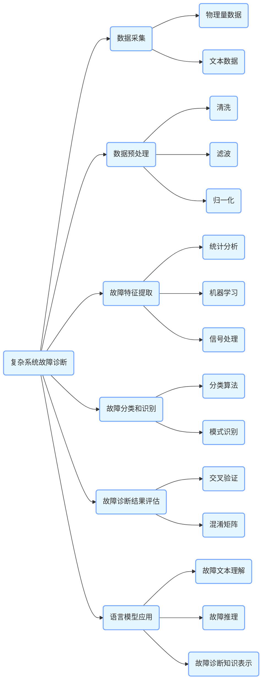

# 语言模型在复杂系统故障诊断中的应用研究

> 关键词：语言模型、复杂系统故障诊断、故障特征提取、故障推理、应用研究

> 摘要：本文聚焦于语言模型在复杂系统故障诊断中的应用。首先介绍了研究的背景、目的、预期读者等内容。详细阐述了语言模型和复杂系统故障诊断的核心概念及联系，给出了相关的文本示意图和 Mermaid 流程图。深入讲解了核心算法原理，用 Python 代码进行了详细阐述，同时给出了数学模型和公式并举例说明。通过项目实战，展示了开发环境搭建、源代码实现及代码解读。探讨了语言模型在复杂系统故障诊断中的实际应用场景，推荐了学习资源、开发工具框架以及相关论文著作。最后总结了未来发展趋势与挑战，并对常见问题进行了解答，提供了扩展阅读和参考资料，旨在为语言模型在复杂系统故障诊断领域的应用提供全面而深入的指导。

## 1. 背景介绍 
### 1.1 目的和范围
在当今科技飞速发展的时代，复杂系统如航空航天系统、电力系统、工业自动化生产线等在各个领域得到了广泛应用。这些系统具有结构复杂、部件众多、运行环境多变等特点，一旦发生故障，可能会导致严重的后果，如人员伤亡、财产损失和生产停滞等。因此，准确、高效地进行故障诊断对于保障复杂系统的安全稳定运行至关重要。

本研究的目的在于探索语言模型在复杂系统故障诊断中的应用，充分发挥语言模型强大的语义理解和知识推理能力，提高故障诊断的准确性和效率。研究范围涵盖了多种常见的复杂系统，包括但不限于工业控制系统、交通运输系统和能源供应系统等，分析语言模型在不同类型复杂系统故障诊断中的适用性和有效性。

### 1.2 预期读者
本文的预期读者主要包括从事复杂系统故障诊断研究的科研人员，他们可以从本文中获取语言模型在该领域的最新应用思路和方法，为其研究工作提供新的方向和参考。同时，对于从事复杂系统维护和管理的工程师和技术人员，本文可以帮助他们了解如何利用语言模型来提升故障诊断的能力，解决实际工作中遇到的问题。此外，对人工智能和故障诊断领域感兴趣的学生和爱好者也可以通过阅读本文，深入了解语言模型在复杂系统故障诊断中的应用原理和实践。

### 1.3 文档结构概述
本文将按照以下结构进行组织：
- 核心概念与联系：介绍语言模型和复杂系统故障诊断的基本概念，分析它们之间的联系，并通过文本示意图和 Mermaid 流程图进行直观展示。
- 核心算法原理 & 具体操作步骤：详细讲解语言模型在复杂系统故障诊断中所涉及的核心算法原理，并用 Python 源代码进行详细阐述，给出具体的操作步骤。
- 数学模型和公式 & 详细讲解 & 举例说明：建立语言模型在故障诊断中的数学模型，给出相关公式，并通过具体例子进行详细说明。
- 项目实战：代码实际案例和详细解释说明：通过一个实际的项目案例，展示如何搭建开发环境，实现源代码，并对代码进行详细解读和分析。
- 实际应用场景：探讨语言模型在复杂系统故障诊断中的实际应用场景，分析其优势和局限性。
- 工具和资源推荐：推荐学习语言模型和复杂系统故障诊断所需的资源，包括书籍、在线课程、技术博客和网站等，同时推荐相关的开发工具框架和论文著作。
- 总结：未来发展趋势与挑战：总结语言模型在复杂系统故障诊断中的应用现状，分析未来的发展趋势和面临的挑战。
- 附录：常见问题与解答：对读者可能关心的常见问题进行解答。
- 扩展阅读 & 参考资料：提供相关的扩展阅读材料和参考资料，方便读者进一步深入学习。

### 1.4 术语表
#### 1.4.1 核心术语定义
- **语言模型**：是一种基于概率统计的模型，用于描述语言的概率分布，预测给定上下文下下一个词或字符出现的概率。在本研究中，语言模型主要用于对故障描述文本进行语义理解和推理。
- **复杂系统**：指由大量相互作用的部件组成，具有高度复杂性和不确定性的系统。其复杂性体现在系统的结构、功能、行为和运行环境等多个方面。
- **故障诊断**：是指通过对系统运行状态的监测和分析，识别系统是否发生故障，并确定故障的类型、位置和原因的过程。

#### 1.4.2 相关概念解释
- **故障特征提取**：从系统的各种监测数据中提取能够反映故障状态的特征信息，这些特征可以是数值型的，也可以是文本型的。
- **故障推理**：根据提取的故障特征，利用一定的推理方法，推断出可能的故障类型和原因。

#### 1.4.3 缩略词列表
- **NLP**：Natural Language Processing，自然语言处理
- **ML**：Machine Learning，机器学习
- **DL**：Deep Learning，深度学习

## 2. 核心概念与联系 

### 语言模型的基本原理
语言模型是自然语言处理领域的核心技术之一，其主要目标是计算一个句子或文本序列的概率。常见的语言模型包括基于统计的语言模型和基于神经网络的语言模型。

基于统计的语言模型，如 n-gram 模型，通过统计语料库中相邻 n 个词出现的频率来估计语言的概率分布。例如，在一个二元语法（bigram）模型中，给定一个词序列 $w_1, w_2, \cdots, w_n$，其概率可以表示为：

$P(w_1, w_2, \cdots, w_n) = \prod_{i=1}^{n} P(w_i | w_{i-1})$

其中，$P(w_i | w_{i-1})$ 表示在词 $w_{i-1}$ 出现的条件下，词 $w_i$ 出现的概率。

基于神经网络的语言模型，如循环神经网络（RNN）、长短时记忆网络（LSTM）和 Transformer 等，通过学习语料库中的语言模式，自动提取语言的特征表示。以 Transformer 为例，它采用了多头注意力机制，能够有效地捕捉文本中的长距离依赖关系。

### 复杂系统故障诊断的流程
复杂系统故障诊断通常包括以下几个步骤：
1. **数据采集**：通过各种传感器和监测设备，采集系统的运行数据，包括温度、压力、电流、电压等物理量，以及设备的操作记录、故障报警信息等文本数据。
2. **数据预处理**：对采集到的数据进行清洗、滤波、归一化等处理，去除噪声和异常值，提高数据的质量。
3. **故障特征提取**：从预处理后的数据中提取能够反映故障状态的特征信息，可以采用统计分析、机器学习、信号处理等方法。
4. **故障分类和识别**：根据提取的故障特征，利用分类算法或模式识别方法，将故障分为不同的类型，并确定故障的位置和原因。
5. **故障诊断结果评估**：对故障诊断结果进行评估，验证诊断的准确性和可靠性，可以采用交叉验证、混淆矩阵等方法。

### 语言模型与复杂系统故障诊断的联系
语言模型在复杂系统故障诊断中具有重要的应用价值，主要体现在以下几个方面：
1. **故障文本理解**：复杂系统的故障信息通常以文本形式存在，如故障报告、操作手册、维护记录等。语言模型可以对这些文本进行语义理解，提取关键信息，为故障诊断提供支持。
2. **故障推理**：语言模型可以利用其强大的知识推理能力，根据故障特征和已知的故障知识，推断出可能的故障类型和原因。
3. **故障诊断知识表示**：语言模型可以将故障诊断知识以文本形式进行表示，方便知识的存储、管理和共享。

### 文本示意图
```plaintext
复杂系统故障诊断
|
|-- 数据采集
|   |-- 物理量数据
|   |-- 文本数据
|
|-- 数据预处理
|   |-- 清洗
|   |-- 滤波
|   |-- 归一化
|
|-- 故障特征提取
|   |-- 统计分析
|   |-- 机器学习
|   |-- 信号处理
|
|-- 故障分类和识别
|   |-- 分类算法
|   |-- 模式识别
|
|-- 故障诊断结果评估
|   |-- 交叉验证
|   |-- 混淆矩阵
|
|-- 语言模型应用
    |-- 故障文本理解
    |-- 故障推理
    |-- 故障诊断知识表示
```

### Mermaid 流程图


## 3. 核心算法原理 & 具体操作步骤 

### 基于 BERT 的故障文本分类算法原理
BERT（Bidirectional Encoder Representations from Transformers）是一种基于 Transformer 架构的预训练语言模型，它通过双向注意力机制，能够有效地捕捉文本中的上下文信息。在复杂系统故障诊断中，我们可以利用 BERT 对故障文本进行分类，判断故障的类型。

BERT 的输入是一个由词嵌入、位置嵌入和段嵌入组成的向量序列，经过多层 Transformer 编码器的处理后，输出每个词的上下文表示。我们可以取 [CLS] 标记的输出作为整个句子的表示，然后将其输入到一个全连接层中，进行分类预测。

### Python 代码实现
```python
import torch
from transformers import BertTokenizer, BertForSequenceClassification

# 加载预训练的 BERT 模型和分词器
tokenizer = BertTokenizer.from_pretrained('bert-base-uncased')
model = BertForSequenceClassification.from_pretrained('bert-base-uncased', num_labels=5)  # 假设分为 5 类故障

# 定义故障文本
fault_text = "The motor is overheating and making strange noises."

# 对文本进行分词和编码
inputs = tokenizer(fault_text, return_tensors='pt')

# 进行预测
with torch.no_grad():
    outputs = model(**inputs)

# 获取预测结果
logits = outputs.logits
predicted_class = torch.argmax(logits, dim=1).item()

print(f"Predicted fault class: {predicted_class}")
```

### 具体操作步骤
1. **数据准备**：收集和整理复杂系统的故障文本数据，并进行标注，将故障分为不同的类型。
2. **模型加载**：加载预训练的 BERT 模型和分词器，可以使用 Hugging Face 的 Transformers 库。
3. **数据预处理**：对故障文本进行分词和编码，将其转换为模型可以接受的输入格式。
4. **模型训练**：使用标注好的故障文本数据对 BERT 模型进行微调，调整模型的参数，使其适应故障分类任务。
5. **模型评估**：使用测试数据集对训练好的模型进行评估，计算模型的准确率、召回率、F1 值等指标。
6. **故障预测**：使用训练好的模型对新的故障文本进行预测，判断故障的类型。

## 4. 数学模型和公式 & 详细讲解 & 举例说明 

### 语言模型的概率计算
在语言模型中，我们通常使用概率来衡量一个句子或文本序列的可能性。以 n-gram 模型为例，给定一个词序列 $w_1, w_2, \cdots, w_n$，其概率可以表示为：

$P(w_1, w_2, \cdots, w_n) = \prod_{i=1}^{n} P(w_i | w_{i-1}, \cdots, w_{i-n+1})$

其中，$P(w_i | w_{i-1}, \cdots, w_{i-n+1})$ 表示在前面 $n-1$ 个词出现的条件下，词 $w_i$ 出现的概率。

例如，在一个二元语法（bigram）模型中，假设我们有一个句子 “The dog runs fast”，其概率可以计算为：

$P(\text{The dog runs fast}) = P(\text{The}) \times P(\text{dog} | \text{The}) \times P(\text{runs} | \text{dog}) \times P(\text{fast} | \text{runs})$

### 基于神经网络的语言模型损失函数
在基于神经网络的语言模型中，我们通常使用交叉熵损失函数来训练模型。交叉熵损失函数的定义如下：

$L = -\frac{1}{N} \sum_{i=1}^{N} \sum_{j=1}^{V} y_{ij} \log(p_{ij})$

其中，$N$ 是样本的数量，$V$ 是词汇表的大小，$y_{ij}$ 是第 $i$ 个样本中第 $j$ 个词的真实标签，$p_{ij}$ 是模型预测第 $i$ 个样本中第 $j$ 个词的概率。

例如，假设我们有一个简单的语言模型，输入是一个词序列，输出是下一个词的概率分布。给定一个样本 “The dog”，真实的下一个词是 “runs”，模型预测的概率分布为 $[0.1, 0.2, 0.3, 0.4]$，其中 “runs” 对应的索引为 3。则该样本的交叉熵损失为：

$L = -\log(0.4)$

### 故障分类的数学模型
在故障分类任务中，我们可以将其看作是一个多分类问题。假设我们有 $K$ 个故障类别，输入是一个故障文本的特征向量 $\mathbf{x}$，输出是一个概率向量 $\mathbf{p} = [p_1, p_2, \cdots, p_K]$，其中 $p_i$ 表示故障属于第 $i$ 类的概率。

我们可以使用 softmax 函数将模型的输出转换为概率分布：

$p_i = \frac{\exp(z_i)}{\sum_{j=1}^{K} \exp(z_j)}$

其中，$z_i$ 是模型的第 $i$ 个输出值。

然后，我们可以使用交叉熵损失函数来训练模型，目标是最小化预测概率分布和真实标签之间的差异。

例如，假设我们有一个三分类问题，模型的输出为 $[2, 1, 3]$，则经过 softmax 函数处理后，概率分布为：

$p_1 = \frac{\exp(2)}{\exp(2) + \exp(1) + \exp(3)} \approx 0.24$

$p_2 = \frac{\exp(1)}{\exp(2) + \exp(1) + \exp(3)} \approx 0.09$

$p_3 = \frac{\exp(3)}{\exp(2) + \exp(1) + \exp(3)} \approx 0.67$

## 5. 项目实战：代码实际案例和详细解释说明 

### 5.1  开发环境搭建
为了实现语言模型在复杂系统故障诊断中的应用，我们需要搭建一个合适的开发环境。以下是具体的步骤：

#### 安装 Python
首先，确保你已经安装了 Python 3.6 或更高版本。你可以从 Python 官方网站（https://www.python.org/downloads/）下载并安装 Python。

#### 创建虚拟环境
为了避免不同项目之间的依赖冲突，建议使用虚拟环境。你可以使用 `venv` 或 `conda` 来创建虚拟环境。以下是使用 `venv` 创建虚拟环境的示例：

```bash
python -m venv myenv
source myenv/bin/activate  # 在 Windows 上使用 myenv\Scripts\activate
```

#### 安装必要的库
在虚拟环境中，安装以下必要的库：
- `transformers`：用于加载和使用预训练的语言模型。
- `torch`：深度学习框架，支持 GPU 加速。
- `numpy`：用于数值计算。
- `pandas`：用于数据处理和分析。

```bash
pip install transformers torch numpy pandas
```

### 5.2  源代码详细实现和代码解读
以下是一个完整的代码示例，展示了如何使用 BERT 模型对复杂系统的故障文本进行分类：

```python
import torch
from torch.utils.data import Dataset, DataLoader
from transformers import BertTokenizer, BertForSequenceClassification, AdamW
import pandas as pd
from sklearn.model_selection import train_test_split

# 定义数据集类
class FaultDataset(Dataset):
    def __init__(self, texts, labels, tokenizer, max_length):
        self.texts = texts
        self.labels = labels
        self.tokenizer = tokenizer
        self.max_length = max_length

    def __len__(self):
        return len(self.texts)

    def __getitem__(self, idx):
        text = str(self.texts[idx])
        label = self.labels[idx]
        encoding = self.tokenizer.encode_plus(
            text,
            add_special_tokens=True,
            max_length=self.max_length,
            padding='max_length',
            truncation=True,
            return_tensors='pt'
        )
        return {
            'input_ids': encoding['input_ids'].flatten(),
            'attention_mask': encoding['attention_mask'].flatten(),
            'labels': torch.tensor(label, dtype=torch.long)
        }

# 加载数据
data = pd.read_csv('fault_data.csv')
texts = data['text'].tolist()
labels = data['label'].tolist()

# 划分训练集和测试集
train_texts, test_texts, train_labels, test_labels = train_test_split(texts, labels, test_size=0.2, random_state=42)

# 加载预训练的 BERT 模型和分词器
tokenizer = BertTokenizer.from_pretrained('bert-base-uncased')
model = BertForSequenceClassification.from_pretrained('bert-base-uncased', num_labels=5)  # 假设分为 5 类故障

# 创建数据集和数据加载器
max_length = 128
train_dataset = FaultDataset(train_texts, train_labels, tokenizer, max_length)
test_dataset = FaultDataset(test_texts, test_labels, tokenizer, max_length)

train_dataloader = DataLoader(train_dataset, batch_size=16, shuffle=True)
test_dataloader = DataLoader(test_dataset, batch_size=16, shuffle=False)

# 定义优化器和训练参数
optimizer = AdamW(model.parameters(), lr=2e-5)
epochs = 3

# 训练模型
device = torch.device('cuda' if torch.cuda.is_available() else 'cpu')
model.to(device)

for epoch in range(epochs):
    model.train()
    total_loss = 0
    for batch in train_dataloader:
        input_ids = batch['input_ids'].to(device)
        attention_mask = batch['attention_mask'].to(device)
        labels = batch['labels'].to(device)

        model.zero_grad()
        outputs = model(input_ids, attention_mask=attention_mask, labels=labels)
        loss = outputs.loss
        total_loss += loss.item()

        loss.backward()
        optimizer.step()

    avg_train_loss = total_loss / len(train_dataloader)
    print(f'Epoch {epoch + 1}/{epochs}, Average training loss: {avg_train_loss}')

# 评估模型
model.eval()
correct_predictions = 0
total_predictions = 0

with torch.no_grad():
    for batch in test_dataloader:
        input_ids = batch['input_ids'].to(device)
        attention_mask = batch['attention_mask'].to(device)
        labels = batch['labels'].to(device)

        outputs = model(input_ids, attention_mask=attention_mask)
        logits = outputs.logits
        predictions = torch.argmax(logits, dim=1)

        correct_predictions += (predictions == labels).sum().item()
        total_predictions += labels.size(0)

accuracy = correct_predictions / total_predictions
print(f'Test accuracy: {accuracy}')
```

### 5.3  代码解读与分析
#### 数据集类 `FaultDataset`
该类继承自 `torch.utils.data.Dataset`，用于封装故障文本数据和对应的标签。在 `__getitem__` 方法中，使用 `BertTokenizer` 对文本进行分词和编码，将其转换为模型可以接受的输入格式。

#### 数据加载
使用 `pandas` 库读取包含故障文本和标签的 CSV 文件，并将其划分为训练集和测试集。

#### 模型加载
加载预训练的 BERT 模型和分词器，并根据故障分类的类别数设置模型的输出维度。

#### 数据集和数据加载器
创建 `FaultDataset` 实例，并使用 `DataLoader` 对数据集进行批量处理，方便模型训练和评估。

#### 优化器和训练参数
使用 `AdamW` 优化器对模型的参数进行更新，设置训练的轮数为 3。

#### 模型训练
在每个训练轮次中，将模型设置为训练模式，遍历训练数据集，计算损失并进行反向传播和参数更新。

#### 模型评估
在测试数据集上对训练好的模型进行评估，计算模型的准确率。

## 6. 实际应用场景 
### 工业控制系统故障诊断
在工业控制系统中，如自动化生产线、化工过程控制系统等，设备众多，运行状态复杂。语言模型可以用于分析设备的故障报警信息、操作日志和维护记录等文本数据，快速定位故障的原因和位置。例如，当设备出现异常时，系统会自动生成故障报告，语言模型可以对报告中的文本进行分析，判断故障是由于设备硬件故障、软件程序错误还是操作人员失误引起的。

### 交通运输系统故障诊断
在交通运输系统中，如飞机、火车、汽车等交通工具，故障诊断对于保障安全至关重要。语言模型可以用于处理飞行员的故障报告、列车司机的操作记录和汽车的故障码信息等文本数据。例如，在飞机飞行过程中，机组人员会向地面报告飞机的故障情况，语言模型可以对报告进行实时分析，为地面维修人员提供准确的故障诊断结果，以便及时采取维修措施。

### 能源供应系统故障诊断
在能源供应系统中，如电力系统、石油天然气开采系统等，故障可能会导致能源供应中断，影响社会生产和生活。语言模型可以用于分析电网的故障跳闸信息、石油管道的泄漏报告和天然气井的异常数据等文本数据。例如，当电力系统发生故障时，语言模型可以对故障相关的文本信息进行分析，判断故障是由于输电线路故障、变电站设备故障还是自然灾害引起的，为电力抢修人员提供决策支持。

## 7. 工具和资源推荐
### 7.1 学习资源推荐
#### 7.1.1 书籍推荐
- 《自然语言处理入门》：作者何晗，本书系统地介绍了自然语言处理的基本概念、方法和技术，适合初学者入门。
- 《深度学习》：作者 Ian Goodfellow、Yoshua Bengio 和 Aaron Courville，本书是深度学习领域的经典著作，全面介绍了深度学习的理论和实践。
- 《Python 自然语言处理》：作者 Steven Bird、Ewan Klein 和 Edward Loper，本书结合 Python 语言，介绍了自然语言处理的各种工具和技术。

#### 7.1.2 在线课程
- Coursera 上的 “Natural Language Processing Specialization”：由斯坦福大学的教授授课，系统地介绍了自然语言处理的各个方面。
- edX 上的 “Deep Learning for Natural Language Processing”：该课程深入讲解了深度学习在自然语言处理中的应用。
- 哔哩哔哩上的一些自然语言处理相关的视频教程，适合初学者快速入门。

#### 7.1.3 技术博客和网站
- Hugging Face 官方博客：提供了关于语言模型的最新研究成果和应用案例。
- Medium 上的自然语言处理相关文章，有很多优秀的技术博客和教程。
- 开源中国、CSDN 等技术社区，有很多自然语言处理和故障诊断领域的技术文章和经验分享。

### 7.2 开发工具框架推荐
#### 7.2.1 IDE和编辑器
- PyCharm：一款专业的 Python 集成开发环境，提供了丰富的代码编辑、调试和项目管理功能。
- Jupyter Notebook：一种交互式的开发环境，适合进行数据分析和模型实验。
- Visual Studio Code：一款轻量级的代码编辑器，支持多种编程语言和插件扩展。

#### 7.2.2 调试和性能分析工具
- PyTorch Profiler：用于分析 PyTorch 模型的性能瓶颈，找出耗时的操作和内存占用情况。
- TensorBoard：一款可视化工具，用于监控模型的训练过程和性能指标。
- cProfile：Python 内置的性能分析工具，用于分析 Python 代码的执行时间和函数调用情况。

#### 7.2.3 相关框架和库
- Transformers：Hugging Face 开发的用于自然语言处理的库，提供了多种预训练的语言模型和工具。
- PyTorch：一个开源的深度学习框架，具有动态图和易于使用的特点。
- scikit-learn：一个用于机器学习的 Python 库，提供了多种分类、回归和聚类算法。

### 7.3 相关论文著作推荐
#### 7.3.1 经典论文
- “Attention Is All You Need”：提出了 Transformer 架构，为现代语言模型的发展奠定了基础。
- “BERT: Pre-training of Deep Bidirectional Transformers for Language Understanding”：介绍了 BERT 模型的原理和训练方法。
- “A Survey on Fault Diagnosis and Fault-Tolerant Techniques—Part I: Fault Diagnosis with Model-Based and Signal-Based Approaches”：对故障诊断的方法和技术进行了全面的综述。

#### 7.3.2 最新研究成果
- 关注 ACL（Association for Computational Linguistics）、EMNLP（Conference on Empirical Methods in Natural Language Processing）等自然语言处理领域的顶级会议，获取最新的研究成果。
- 在 arXiv 上搜索关于语言模型在故障诊断中的应用的预印本论文。

#### 7.3.3 应用案例分析
- 一些行业报告和技术白皮书，介绍了语言模型在工业、交通、能源等领域的实际应用案例。
- 开源项目的文档和 README 文件，了解如何将语言模型应用到具体的故障诊断项目中。

## 8. 总结：未来发展趋势与挑战
### 未来发展趋势
- **多模态融合**：未来的复杂系统故障诊断将不仅仅依赖于文本数据，还会结合图像、音频、视频等多模态数据。语言模型可以与计算机视觉、语音识别等技术相结合，实现更加全面和准确的故障诊断。
- **实时在线诊断**：随着物联网技术的发展，复杂系统可以实时产生大量的运行数据。语言模型将具备实时处理和分析这些数据的能力，实现实时在线的故障诊断，及时发现和解决潜在的故障问题。
- **知识增强的语言模型**：将领域知识融入语言模型中，提高模型对复杂系统故障的理解和推理能力。例如，结合故障诊断的专家知识和经验，构建知识图谱，为语言模型提供更丰富的语义信息。
- **自适应学习**：语言模型将具备自适应学习的能力，能够根据系统的运行状态和故障情况不断调整和优化自身的参数和结构，提高故障诊断的准确性和适应性。

### 挑战
- **数据质量和标注问题**：复杂系统的故障数据往往存在噪声、缺失值和不一致性等问题，需要进行有效的数据清洗和预处理。同时，故障数据的标注需要专业的领域知识，标注成本较高。
- **计算资源和效率问题**：语言模型通常需要大量的计算资源和时间进行训练和推理，尤其是对于大规模的复杂系统故障诊断任务。如何提高模型的计算效率，降低计算成本，是一个亟待解决的问题。
- **模型可解释性问题**：语言模型通常是黑盒模型，其决策过程和结果难以解释。在复杂系统故障诊断中，需要模型能够提供可解释的诊断结果，以便用户理解和信任。
- **跨领域知识融合问题**：复杂系统故障诊断涉及多个领域的知识，如机械工程、电气工程、计算机科学等。如何将不同领域的知识有效地融合到语言模型中，是一个具有挑战性的问题。

## 9. 附录：常见问题与解答
### 问题 1：语言模型在复杂系统故障诊断中的准确性如何保证？
答：要保证语言模型在复杂系统故障诊断中的准确性，可以从以下几个方面入手：
- **数据质量**：收集和整理高质量的故障数据，进行有效的数据清洗和预处理，去除噪声和异常值。
- **模型选择和训练**：选择合适的语言模型，并使用足够的标注数据进行训练。可以采用交叉验证等方法对模型进行评估和调优。
- **知识融合**：将领域知识融入语言模型中，提高模型对故障的理解和推理能力。例如，构建故障诊断的知识图谱，为模型提供额外的语义信息。
- **模型集成**：可以将多个不同的语言模型进行集成，综合它们的诊断结果，提高诊断的准确性。

### 问题 2：如何处理复杂系统故障诊断中的实时数据？
答：处理复杂系统故障诊断中的实时数据可以采用以下方法：
- **流式处理**：使用流式处理框架，如 Apache Kafka、Flink 等，对实时数据进行实时采集、处理和分析。
- **在线学习**：让语言模型具备在线学习的能力，能够根据实时数据不断更新和调整自身的参数和结构。
- **缓存和预计算**：对于一些常用的故障模式和特征，可以进行缓存和预计算，减少实时处理的时间开销。

### 问题 3：语言模型在复杂系统故障诊断中的可解释性如何提高？
答：提高语言模型在复杂系统故障诊断中的可解释性可以采用以下方法：
- **特征重要性分析**：分析语言模型输入特征的重要性，找出对诊断结果影响较大的特征。
- **规则提取**：从语言模型的训练结果中提取规则，将模型的决策过程转化为可解释的规则。
- **可视化**：使用可视化工具，将语言模型的诊断结果和决策过程进行可视化展示，方便用户理解。

### 问题 4：如何将语言模型应用到不同类型的复杂系统故障诊断中？
答：将语言模型应用到不同类型的复杂系统故障诊断中，可以遵循以下步骤：
- **领域知识学习**：了解目标复杂系统的结构、功能和故障模式，掌握相关的领域知识。
- **数据收集和预处理**：收集目标系统的故障数据，并进行清洗、标注和特征提取等预处理操作。
- **模型选择和调整**：根据目标系统的特点和需求，选择合适的语言模型，并对模型进行调整和优化。
- **模型训练和评估**：使用预处理后的数据对语言模型进行训练，并使用测试数据对模型进行评估。
- **应用和优化**：将训练好的模型应用到实际的故障诊断中，并根据实际反馈不断优化模型。

## 10. 扩展阅读 & 参考资料
### 扩展阅读
- 《人工智能时代的故障诊断技术》：探讨了人工智能技术在故障诊断领域的应用和发展趋势。
- 《复杂系统理论与应用》：介绍了复杂系统的基本概念、理论和方法，有助于深入理解复杂系统故障诊断的本质。
- 《自然语言处理实战》：通过实际案例介绍了自然语言处理的各种技术和应用，包括语言模型的使用。

### 参考资料
- Hugging Face 官方文档：https://huggingface.co/docs
- PyTorch 官方文档：https://pytorch.org/docs/stable/index.html
- scikit-learn 官方文档：https://scikit-learn.org/stable/documentation.html

作者：AI天才研究院/AI Genius Institute & 禅与计算机程序设计艺术 /Zen And The Art of Computer Programming