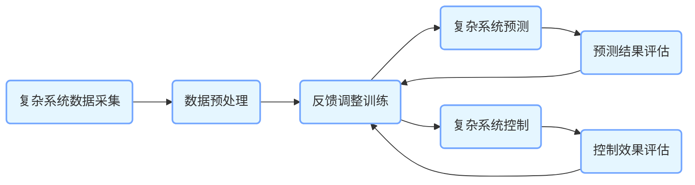

# 语言模型在复杂系统预测与控制中的应用

> 关键词：语言模型、复杂系统、预测、控制、深度学习

> 摘要：本文深入探讨了语言模型在复杂系统预测与控制中的应用。首先介绍了相关背景知识，包括目的范围、预期读者等。接着阐述了核心概念与联系，分析了语言模型在复杂系统中的作用原理。详细讲解了核心算法原理及具体操作步骤，并给出了Python代码示例。同时，对相关数学模型和公式进行了推导和举例说明。通过项目实战展示了代码的实际应用和详细解读。探讨了语言模型在不同实际场景中的应用，推荐了相关的学习资源、开发工具框架以及论文著作。最后总结了未来发展趋势与挑战，并提供了常见问题解答和扩展阅读参考资料，旨在为相关领域的研究者和从业者提供全面且深入的技术指导。

## 1. 背景介绍 
### 1.1 目的和范围
在当今科技快速发展的时代，复杂系统广泛存在于各个领域，如气象预报、交通流量管理、工业生产过程控制等。准确地对这些复杂系统进行预测和有效的控制是提高生产效率、保障系统安全稳定运行的关键。语言模型作为人工智能领域的重要成果，近年来在自然语言处理等方面取得了巨大的成功。本文章的目的在于探索语言模型在复杂系统预测与控制中的应用，研究如何利用语言模型的强大能力来解决复杂系统中的预测和控制问题。范围涵盖了语言模型的基本原理、在不同复杂系统中的应用方式、相关算法实现以及实际案例分析等方面。

### 1.2 预期读者
本文预期读者主要包括人工智能、控制科学与工程、系统科学等相关专业的研究人员和学生，他们希望深入了解语言模型在复杂系统中的应用机制和技术细节。同时，也适合从事实际工程应用的工程师，如工业自动化工程师、交通工程师等，他们可以从本文中获取将语言模型应用于实际复杂系统预测与控制的思路和方法。

### 1.3 文档结构概述
本文将按照以下结构进行组织：首先介绍相关背景知识，包括目的范围、预期读者等；接着阐述语言模型与复杂系统的核心概念及它们之间的联系；详细讲解核心算法原理及具体操作步骤，并给出Python代码示例；对相关数学模型和公式进行推导和举例说明；通过项目实战展示代码的实际应用和详细解读；探讨语言模型在不同实际场景中的应用；推荐相关的学习资源、开发工具框架以及论文著作；最后总结未来发展趋势与挑战，提供常见问题解答和扩展阅读参考资料。

### 1.4 术语表
#### 1.4.1 核心术语定义
- **语言模型**：是一种基于概率统计的模型，用于计算一个词序列出现的概率。在深度学习中，通常指基于神经网络的语言模型，如循环神经网络（RNN）、长短期记忆网络（LSTM）、Transformer等，能够学习到语言的语义和语法信息。
- **复杂系统**：是由大量相互作用的组成部分构成的系统，这些组成部分之间的关系通常是非线性的，系统的行为表现出高度的复杂性和不确定性，如生态系统、经济系统等。
- **预测**：根据历史数据和当前状态，对复杂系统未来的状态或行为进行估计和推断。
- **控制**：通过对系统的输入进行调整和干预，使系统的输出达到预期的目标。

#### 1.4.2 相关概念解释
- **深度学习**：是机器学习的一个分支，通过构建多层神经网络来学习数据的深层次特征和模式。在语言模型中，深度学习技术能够自动从大规模文本数据中学习到语言的表示和规律。
- **时间序列分析**：是一种用于分析随时间变化的数据的方法，常用于复杂系统的预测。时间序列数据通常具有自相关性和趋势性，需要采用特定的模型和算法进行处理。
- **强化学习**：是一种机器学习方法，通过智能体与环境进行交互，根据环境反馈的奖励信号来学习最优的行为策略。在复杂系统控制中，强化学习可以用于寻找最优的控制策略。

#### 1.4.3 缩略词列表
- **RNN**：Recurrent Neural Network，循环神经网络
- **LSTM**：Long Short-Term Memory，长短期记忆网络
- **GRU**：Gated Recurrent Unit，门控循环单元
- **Transformer**：一种基于注意力机制的神经网络架构
- **MLP**：Multi-Layer Perceptron，多层感知机

## 2. 核心概念与联系 

### 核心概念原理
#### 语言模型原理
语言模型的核心目标是计算一个词序列 $w_1, w_2, \cdots, w_n$ 出现的概率 $P(w_1, w_2, \cdots, w_n)$。根据链式法则，这个概率可以分解为：

$$P(w_1, w_2, \cdots, w_n) = \prod_{i=1}^{n} P(w_i | w_1, w_2, \cdots, w_{i-1})$$

早期的语言模型采用基于统计的方法，如 $n$-gram 模型，通过统计语料库中 $n$ 个词连续出现的频率来估计条件概率。在深度学习时代，神经网络语言模型得到了广泛应用。以 RNN 为例，它可以处理变长的输入序列，通过隐藏状态 $h_t$ 来捕捉序列中的上下文信息。其更新公式如下：

$$h_t = \tanh(W_{hh} h_{t-1} + W_{xh} x_t + b_h)$$

$$y_t = W_{hy} h_t + b_y$$

其中，$x_t$ 是输入的词向量，$W_{hh}$、$W_{xh}$、$W_{hy}$ 是权重矩阵，$b_h$、$b_y$ 是偏置向量，$y_t$ 是输出的词概率分布。

#### 复杂系统原理
复杂系统由大量的组成部分构成，这些部分之间存在着复杂的相互作用。复杂系统的行为往往表现出非线性、涌现性、自适应性等特点。例如，在生态系统中，不同物种之间存在着捕食、竞争、共生等关系，这些关系相互交织，使得生态系统的整体行为难以通过简单的线性模型进行描述。复杂系统的状态通常可以用一组状态变量来表示，系统的演化可以用状态方程来描述：

$$\frac{dx}{dt} = f(x, u, t)$$

其中，$x$ 是状态变量向量，$u$ 是控制输入向量，$t$ 是时间，$f$ 是描述系统动态的函数。

### 架构的文本示意图
语言模型在复杂系统预测与控制中的应用架构可以描述为：首先，从复杂系统中采集数据，这些数据可以是时间序列数据、文本数据等。然后，对采集到的数据进行预处理，如归一化、分词等。接着，将预处理后的数据输入到语言模型中进行训练，语言模型学习到数据中的模式和规律。最后，利用训练好的语言模型进行复杂系统的预测和控制。具体来说，在预测方面，语言模型根据历史数据预测系统未来的状态；在控制方面，通过优化算法寻找最优的控制输入，使得系统的输出达到预期的目标。

### Mermaid 流程图


## 3. 核心算法原理 & 具体操作步骤 

### 核心算法原理
在复杂系统预测与控制中，常用的语言模型算法有 LSTM 和 Transformer。这里以 LSTM 为例进行介绍。

LSTM 是一种特殊的 RNN，它能够有效地解决传统 RNN 中的梯度消失问题，从而更好地捕捉序列中的长距离依赖关系。LSTM 单元包含三个门：输入门 $i_t$、遗忘门 $f_t$ 和输出门 $o_t$，以及一个细胞状态 $C_t$。其计算公式如下：

$$f_t = \sigma(W_f [h_{t-1}, x_t] + b_f)$$

$$i_t = \sigma(W_i [h_{t-1}, x_t] + b_i)$$

$$\tilde{C}_t = \tanh(W_C [h_{t-1}, x_t] + b_C)$$

$$C_t = f_t \odot C_{t-1} + i_t \odot \tilde{C}_t$$

$$o_t = \sigma(W_o [h_{t-1}, x_t] + b_o)$$

$$h_t = o_t \odot \tanh(C_t)$$

其中，$\sigma$ 是 sigmoid 函数，$\odot$ 是逐元素相乘，$W_f$、$W_i$、$W_C$、$W_o$ 是权重矩阵，$b_f$、$b_i$、$b_C$、$b_o$ 是偏置向量。

### 具体操作步骤
#### 数据准备
1. 从复杂系统中采集相关数据，如时间序列数据、文本数据等。
2. 对数据进行预处理，包括数据清洗、归一化、分词等操作。例如，对于时间序列数据，可以使用 Min-Max 归一化将数据缩放到 $[0, 1]$ 区间：

```python
import numpy as np

def min_max_normalize(data):
    min_val = np.min(data)
    max_val = np.max(data)
    normalized_data = (data - min_val) / (max_val - min_val)
    return normalized_data
```

#### 模型构建
使用 Python 和 PyTorch 库构建 LSTM 模型：

```python
import torch
import torch.nn as nn

class LSTMModel(nn.Module):
    def __init__(self, input_size, hidden_size, num_layers, output_size):
        super(LSTMModel, self).__init__()
        self.hidden_size = hidden_size
        self.num_layers = num_layers
        self.lstm = nn.LSTM(input_size, hidden_size, num_layers, batch_first=True)
        self.fc = nn.Linear(hidden_size, output_size)

    def forward(self, x):
        h0 = torch.zeros(self.num_layers, x.size(0), self.hidden_size).to(x.device)
        c0 = torch.zeros(self.num_layers, x.size(0), self.hidden_size).to(x.device)
        out, _ = self.lstm(x, (h0, c0))
        out = self.fc(out[:, -1, :])
        return out
```

#### 模型训练
定义损失函数和优化器，然后进行模型训练：

```python
import torch.optim as optim

# 超参数设置
input_size = 1
hidden_size = 32
num_layers = 2
output_size = 1
learning_rate = 0.001
num_epochs = 100

# 初始化模型
model = LSTMModel(input_size, hidden_size, num_layers, output_size)

# 定义损失函数和优化器
criterion = nn.MSELoss()
optimizer = optim.Adam(model.parameters(), lr=learning_rate)

# 训练模型
for epoch in range(num_epochs):
    outputs = model(train_inputs)
    loss = criterion(outputs, train_labels)
    optimizer.zero_grad()
    loss.backward()
    optimizer.step()
    if (epoch+1) % 10 == 0:
        print(f'Epoch [{epoch+1}/{num_epochs}], Loss: {loss.item():.4f}')
```

#### 模型预测与控制
使用训练好的模型进行复杂系统的预测和控制：

```python
# 预测
test_outputs = model(test_inputs)

# 控制（简单示例，根据预测结果调整输入）
if test_outputs[0].item() > 0.5:
    control_input = 1
else:
    control_input = 0
```

## 4. 数学模型和公式 & 详细讲解 & 举例说明 

### 语言模型的数学模型
在复杂系统预测中，我们可以将语言模型看作是一个函数 $f$，它将历史数据 $x_{1:t}$ 映射到未来数据 $x_{t+1}$ 的概率分布：

$$P(x_{t+1} | x_{1:t}) = f(x_{1:t})$$

对于 LSTM 模型，它通过学习输入序列的特征来估计这个概率分布。假设输入序列为 $x_1, x_2, \cdots, x_t$，LSTM 模型的输出 $h_t$ 可以看作是对这个序列的表示。然后，通过一个全连接层将 $h_t$ 映射到输出空间，得到预测结果 $\hat{x}_{t+1}$。

### 复杂系统的数学模型
如前面所述，复杂系统的状态演化可以用状态方程 $\frac{dx}{dt} = f(x, u, t)$ 来描述。在离散时间系统中，状态方程可以表示为：

$$x_{t+1} = f(x_t, u_t, t)$$

其中，$x_t$ 是系统在时刻 $t$ 的状态，$u_t$ 是系统在时刻 $t$ 的控制输入。

### 举例说明
考虑一个简单的一阶线性离散时间系统：

$$x_{t+1} = 0.8x_t + 0.2u_t$$

其中，$x_t$ 是系统的状态，$u_t$ 是控制输入。我们的目标是使用语言模型来预测系统的未来状态，并通过控制输入 $u_t$ 使系统的状态保持在一个期望的值 $x_d$ 附近。

首先，我们可以采集系统的历史数据 $(x_1, u_1), (x_2, u_2), \cdots, (x_n, u_n)$，然后使用 LSTM 模型对这些数据进行训练。训练完成后，我们可以使用模型来预测系统的未来状态 $\hat{x}_{t+1}$。接着，根据预测结果和期望状态 $x_d$，我们可以设计一个简单的控制策略：

$$u_t = k(x_d - \hat{x}_{t+1})$$

其中，$k$ 是控制增益。通过不断地调整控制输入 $u_t$，我们可以使系统的状态逐渐接近期望状态。

## 5. 项目实战：代码实际案例和详细解释说明 

### 5.1  开发环境搭建
#### 安装 Python
首先，确保你已经安装了 Python 3.x 版本。可以从 Python 官方网站（https://www.python.org/downloads/） 下载并安装适合你操作系统的 Python 版本。

#### 安装必要的库
使用以下命令安装 PyTorch、NumPy、Matplotlib 等必要的库：

```bash
pip install torch numpy matplotlib
```

### 5.2  源代码详细实现和代码解读
#### 数据生成
我们生成一个简单的时间序列数据来模拟复杂系统的状态：

```python
import numpy as np

# 生成时间序列数据
def generate_data(n_steps):
    time = np.linspace(0, 2 * np.pi, n_steps)
    data = np.sin(time)
    return data

n_steps = 1000
data = generate_data(n_steps)
```

#### 数据预处理
将数据划分为训练集和测试集，并进行归一化处理：

```python
from sklearn.preprocessing import MinMaxScaler

# 划分训练集和测试集
train_size = int(len(data) * 0.8)
train_data = data[:train_size]
test_data = data[train_size:]

# 归一化处理
scaler = MinMaxScaler()
train_data = scaler.fit_transform(train_data.reshape(-1, 1))
test_data = scaler.transform(test_data.reshape(-1, 1))

# 准备训练数据和标签
def create_sequences(data, seq_length):
    inputs = []
    labels = []
    for i in range(len(data) - seq_length):
        inputs.append(data[i:i+seq_length])
        labels.append(data[i+seq_length])
    return np.array(inputs), np.array(labels)

seq_length = 10
train_inputs, train_labels = create_sequences(train_data, seq_length)
test_inputs, test_labels = create_sequences(test_data, seq_length)

# 转换为 PyTorch 张量
import torch

train_inputs = torch.tensor(train_inputs, dtype=torch.float32)
train_labels = torch.tensor(train_labels, dtype=torch.float32)
test_inputs = torch.tensor(test_inputs, dtype=torch.float32)
test_labels = torch.tensor(test_labels, dtype=torch.float32)
```

#### 模型构建和训练
使用前面定义的 LSTM 模型进行训练：

```python
from torch.utils.data import DataLoader, TensorDataset

# 创建数据集和数据加载器
train_dataset = TensorDataset(train_inputs, train_labels)
train_loader = DataLoader(train_dataset, batch_size=32, shuffle=True)

# 初始化模型
input_size = 1
hidden_size = 32
num_layers = 2
output_size = 1
model = LSTMModel(input_size, hidden_size, num_layers, output_size)

# 定义损失函数和优化器
criterion = nn.MSELoss()
optimizer = optim.Adam(model.parameters(), lr=0.001)

# 训练模型
num_epochs = 100
for epoch in range(num_epochs):
    for inputs, labels in train_loader:
        outputs = model(inputs)
        loss = criterion(outputs, labels)
        optimizer.zero_grad()
        loss.backward()
        optimizer.step()
    if (epoch+1) % 10 == 0:
        print(f'Epoch [{epoch+1}/{num_epochs}], Loss: {loss.item():.4f}')
```

#### 模型预测和可视化
使用训练好的模型进行预测，并将预测结果可视化：

```python
import matplotlib.pyplot as plt

# 预测
model.eval()
with torch.no_grad():
    test_outputs = model(test_inputs)

# 反归一化
test_outputs = scaler.inverse_transform(test_outputs.numpy())
test_labels = scaler.inverse_transform(test_labels.numpy())

# 可视化
plt.plot(test_labels, label='True Values')
plt.plot(test_outputs, label='Predicted Values')
plt.xlabel('Time Step')
plt.ylabel('Value')
plt.title('Time Series Prediction')
plt.legend()
plt.show()
```

### 5.3  代码解读与分析
#### 数据生成部分
通过 `generate_data` 函数生成一个正弦波时间序列数据，模拟复杂系统的状态变化。

#### 数据预处理部分
使用 `MinMaxScaler` 对数据进行归一化处理，将数据缩放到 $[0, 1]$ 区间，有助于提高模型的训练效果。然后，使用 `create_sequences` 函数将数据转换为适合 LSTM 模型输入的序列格式。

#### 模型构建和训练部分
使用 `LSTMModel` 类构建 LSTM 模型，定义损失函数为均方误差损失（MSE），优化器为 Adam 优化器。通过迭代训练数据，不断更新模型的参数，使损失函数逐渐减小。

#### 模型预测和可视化部分
使用训练好的模型对测试数据进行预测，然后将预测结果进行反归一化处理，恢复到原始数据的尺度。最后，使用 `matplotlib` 库将预测结果和真实值进行可视化，直观地展示模型的预测效果。

## 6. 实际应用场景 
### 气象预报
气象系统是一个典型的复杂系统，包含了大量的气象要素，如温度、湿度、气压、风速等。这些要素之间相互作用，使得气象系统的行为具有高度的复杂性和不确定性。语言模型可以通过学习历史气象数据中的模式和规律，对未来的气象情况进行预测。例如，将过去一段时间的气象数据作为输入，语言模型可以输出未来几天的温度、降水概率等信息，为气象预报提供支持。

### 交通流量管理
交通系统也是一个复杂系统，受到多种因素的影响，如人口密度、道路状况、时间等。语言模型可以用于预测交通流量的变化，帮助交通管理部门提前制定交通疏导策略。例如，根据历史交通流量数据和实时交通信息，语言模型可以预测未来一段时间内不同路段的交通流量，从而合理调整信号灯时长、引导车辆分流等，提高交通运行效率。

### 工业生产过程控制
在工业生产中，许多生产过程具有复杂的动态特性，如化学反应过程、机械加工过程等。语言模型可以用于对生产过程进行建模和预测，实时监测生产过程的状态，并根据预测结果调整控制参数，实现生产过程的优化控制。例如，在化工生产中，语言模型可以根据原料的输入、反应条件等信息，预测反应产物的产量和质量，从而调整反应温度、压力等参数，提高生产效率和产品质量。

### 金融市场预测
金融市场是一个高度复杂和不确定的系统，受到宏观经济因素、政策变化、投资者情绪等多种因素的影响。语言模型可以通过分析大量的金融文本数据，如新闻报道、公司公告、社交媒体评论等，挖掘其中的信息和情感倾向，对金融市场的走势进行预测。例如，预测股票价格的涨跌、汇率的波动等，为投资者提供决策参考。

## 7. 工具和资源推荐
### 7.1 学习资源推荐
#### 7.1.1 书籍推荐
- 《深度学习》（Deep Learning）：由 Ian Goodfellow、Yoshua Bengio 和 Aaron Courville 所著，是深度学习领域的经典教材，全面介绍了深度学习的基本概念、算法和应用。
- 《Python 深度学习》（Deep Learning with Python）：作者是 Francois Chollet，他也是 Keras 深度学习框架的开发者。这本书通过实际案例详细介绍了如何使用 Python 和 Keras 进行深度学习模型的开发。
- 《自然语言处理入门》：何晗著，系统介绍了自然语言处理的基本概念、算法和应用，适合初学者入门。

#### 7.1.2 在线课程
- Coursera 上的 “深度学习专项课程”（Deep Learning Specialization）：由 Andrew Ng 教授主讲，包括五门课程，涵盖了深度学习的各个方面，如神经网络基础、卷积神经网络、循环神经网络等。
- edX 上的 “自然语言处理”（Natural Language Processing）：由哥伦比亚大学的教授授课，深入介绍了自然语言处理的理论和实践。
- 哔哩哔哩（B 站）上有许多关于深度学习和自然语言处理的免费教程，适合初学者学习。

#### 7.1.3 技术博客和网站
- Medium：是一个技术博客平台，上面有许多关于深度学习、人工智能的优质文章，作者来自世界各地的技术专家和研究者。
- arXiv：是一个预印本服务器，提供了大量的学术论文，涵盖了计算机科学、物理学等多个领域，对于了解最新的研究成果非常有帮助。
- 机器之心：是一个专注于人工智能领域的科技媒体，提供了丰富的技术文章、行业动态和研究报告。

### 7.2 开发工具框架推荐
#### 7.2.1 IDE和编辑器
- PyCharm：是一款专门为 Python 开发设计的集成开发环境（IDE），具有代码编辑、调试、版本控制等功能，非常适合 Python 项目的开发。
- Jupyter Notebook：是一个基于网页的交互式开发环境，支持多种编程语言，尤其适合数据科学和机器学习项目的开发。用户可以在 Notebook 中编写代码、运行代码、查看结果，并添加文本说明，方便进行数据分析和模型开发。
- Visual Studio Code：是一款轻量级的代码编辑器，支持多种编程语言，具有丰富的插件生态系统。通过安装相关插件，可以实现代码高亮、自动补全、调试等功能，提高开发效率。

#### 7.2.2 调试和性能分析工具
- PyTorch Profiler：是 PyTorch 提供的性能分析工具，可以帮助用户分析模型的训练和推理过程中的性能瓶颈，如计算时间、内存使用等。
- TensorBoard：是 TensorFlow 提供的可视化工具，也可以与 PyTorch 结合使用。它可以实时监控模型的训练过程，如损失函数的变化、准确率的变化等，还可以可视化模型的结构和参数分布。
- cProfile：是 Python 内置的性能分析模块，可以统计程序中各个函数的调用次数和执行时间，帮助用户找出程序中的性能瓶颈。

#### 7.2.3 相关框架和库
- PyTorch：是一个开源的深度学习框架，具有动态图机制，易于使用和调试。它提供了丰富的神经网络层和优化算法，支持 GPU 加速，广泛应用于自然语言处理、计算机视觉等领域。
- TensorFlow：是另一个流行的深度学习框架，由 Google 开发。它具有静态图机制，适合大规模分布式训练。TensorFlow 提供了高级的 API，如 Keras，方便用户快速构建和训练深度学习模型。
- Hugging Face Transformers：是一个开源的自然语言处理库，提供了大量预训练的语言模型，如 BERT、GPT-2 等。用户可以直接使用这些预训练模型进行文本分类、情感分析、机器翻译等任务，也可以对模型进行微调以适应特定的任务。

### 7.3 相关论文著作推荐
#### 7.3.1 经典论文
- 《Attention Is All You Need》：提出了 Transformer 架构，是自然语言处理领域的里程碑式论文。Transformer 架构基于注意力机制，能够有效地处理序列数据，在机器翻译、文本生成等任务中取得了显著的效果。
- 《Long Short-Term Memory》：介绍了长短期记忆网络（LSTM）的原理和应用。LSTM 能够解决传统 RNN 中的梯度消失问题，在处理序列数据方面具有很好的性能。
- 《Neural Machine Translation by Jointly Learning to Align and Translate》：提出了基于注意力机制的神经机器翻译模型，为机器翻译领域带来了重大突破。

#### 7.3.2 最新研究成果
- 在 arXiv 上搜索 “Language Model for Complex System Prediction and Control” 等关键词，可以找到许多关于语言模型在复杂系统预测与控制方面的最新研究论文。这些论文涵盖了不同的应用场景和算法改进，反映了该领域的最新研究动态。
- 参加国际会议，如 NeurIPS（神经信息处理系统大会）、ICML（国际机器学习会议）、ACL（计算语言学协会年会）等，这些会议会展示该领域的最新研究成果。

#### 7.3.3 应用案例分析
- 《应用机器学习：Python 实践》（Applied Machine Learning: A Practical Guide with Python）：书中包含了许多机器学习和深度学习的应用案例，包括在复杂系统预测与控制方面的应用，通过实际案例帮助读者理解和掌握相关技术。
- 一些行业报告和研究机构的出版物也会提供语言模型在实际应用中的案例分析，如麦肯锡、波士顿咨询集团等发布的报告。

## 8. 总结：未来发展趋势与挑战
### 未来发展趋势
#### 模型融合与创新
未来，语言模型将与其他类型的模型，如物理模型、强化学习模型等进行更深入的融合。通过结合不同模型的优势，可以更好地处理复杂系统中的多源异构数据，提高预测和控制的准确性。例如，将语言模型与物理模型相结合，可以在考虑系统物理规律的同时，利用语言模型学习到的语义信息，实现更精准的预测。

#### 跨领域应用拓展
语言模型在复杂系统预测与控制中的应用将不断拓展到更多的领域，如医疗保健、能源管理、环境监测等。在医疗保健领域，语言模型可以用于疾病预测、医疗决策支持等；在能源管理领域，可以用于电力负荷预测、能源系统优化控制等。随着技术的不断进步，语言模型将为各个领域的复杂系统管理提供更有效的解决方案。

#### 预训练模型的广泛应用
预训练语言模型已经在自然语言处理领域取得了巨大的成功，未来将在复杂系统预测与控制中得到更广泛的应用。通过在大规模数据上进行预训练，语言模型可以学习到通用的语言表示和模式，然后在具体的复杂系统任务中进行微调，能够显著提高模型的性能和训练效率。

### 挑战
#### 数据质量和数量问题
复杂系统的数据往往具有高维度、噪声大、不完整等特点，数据的质量和数量会直接影响语言模型的性能。获取高质量、大规模的数据是一个挑战，同时，如何对数据进行有效的预处理和清洗，也是需要解决的问题。

#### 可解释性和可靠性问题
语言模型通常是基于深度学习的黑盒模型，其决策过程难以解释。在复杂系统预测与控制中，可解释性和可靠性是非常重要的。例如，在医疗决策和金融风险评估中，需要模型能够给出明确的解释和可靠的结果。如何提高语言模型的可解释性和可靠性是当前面临的一个重要挑战。

#### 计算资源和效率问题
训练和运行大规模的语言模型需要大量的计算资源和时间。在实际应用中，如何在有限的计算资源下提高模型的训练和推理效率，是需要解决的问题。此外，随着数据量的不断增加，如何进行高效的数据存储和处理也是一个挑战。

## 9. 附录：常见问题与解答
### 语言模型在复杂系统预测与控制中的准确性如何提高？
可以从以下几个方面提高语言模型在复杂系统预测与控制中的准确性：
- **数据质量**：确保采集到的数据准确、完整，对数据进行有效的预处理和清洗，去除噪声和异常值。
- **模型选择和调优**：选择适合复杂系统特点的语言模型，如 LSTM、Transformer 等，并对模型的超参数进行调优，如学习率、隐藏层大小等。
- **特征工程**：提取和选择与复杂系统相关的特征，将这些特征作为模型的输入，有助于提高模型的准确性。
- **模型融合**：将语言模型与其他类型的模型进行融合，结合不同模型的优势，提高预测和控制的准确性。

### 如何解决语言模型在复杂系统应用中的可解释性问题？
可以采用以下方法解决语言模型的可解释性问题：
- **特征重要性分析**：通过分析输入特征对模型输出的影响程度，确定哪些特征对预测和控制结果起到了关键作用。
- **局部解释方法**：如 LIME（Local Interpretable Model-agnostic Explanations）和 SHAP（SHapley Additive exPlanations），可以对模型的单个预测结果进行解释，说明模型做出决策的原因。
- **基于规则的解释**：将语言模型与规则引擎相结合，通过规则来解释模型的决策过程。

### 语言模型在复杂系统控制中如何设计控制策略？
设计语言模型在复杂系统控制中的策略可以参考以下步骤：
- **目标设定**：明确复杂系统的控制目标，如使系统的输出达到某个期望的值、最小化系统的误差等。
- **模型预测**：使用训练好的语言模型对复杂系统的未来状态进行预测。
- **优化算法**：根据预测结果和控制目标，使用优化算法寻找最优的控制输入。常用的优化算法有梯度下降法、遗传算法等。
- **反馈调整**：在实际控制过程中，根据系统的实际输出与预测输出的差异，对控制策略进行反馈调整，不断优化控制效果。

## 10. 扩展阅读 & 参考资料
### 扩展阅读
- 《复杂系统理论与方法》：深入介绍了复杂系统的基本概念、理论和方法，有助于读者更好地理解复杂系统的本质和特点。
- 《自然语言处理实战：基于深度学习的方法》：详细介绍了自然语言处理的各种任务和深度学习方法的应用，对于进一步学习语言模型在自然语言处理中的应用有很大帮助。
- 《强化学习实战》：介绍了强化学习的基本原理和算法，以及在不同领域的应用。强化学习可以与语言模型相结合，用于复杂系统的控制。

### 参考资料
- Goodfellow, I., Bengio, Y., & Courville, A. (2016). Deep Learning. MIT Press.
- Chollet, F. (2017). Deep Learning with Python. Manning Publications.
- Vaswani, A., Shazeer, N., Parmar, N., Uszkoreit, J., Jones, L., Gomez, A. N.,... & Polosukhin, I. (2017). Attention is all you need. In Advances in neural information processing systems (pp. 5998-6008).
- Hochreiter, S., & Schmidhuber, J. (1997). Long short-term memory. Neural computation, 9(8), 1735-1780.

作者：AI天才研究院/AI Genius Institute & 禅与计算机程序设计艺术 /Zen And The Art of Computer Programming