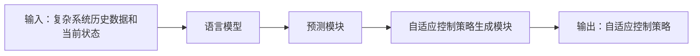

# 语言模型在复杂系统预测与自适应控制策略生成中的应用

> 关键词：语言模型；复杂系统预测；自适应控制策略；模型应用；策略生成

> 摘要：本文深入探讨了语言模型在复杂系统预测与自适应控制策略生成中的应用。首先介绍了相关背景，包括研究目的、预期读者、文档结构和术语表。接着阐述了核心概念及其联系，通过文本示意图和Mermaid流程图展示其架构。详细讲解了核心算法原理，并使用Python源代码进行说明，同时给出了数学模型和公式，辅以举例。在项目实战部分，介绍了开发环境搭建、源代码实现与解读。还探讨了实际应用场景，推荐了学习资源、开发工具框架和相关论文著作。最后总结了未来发展趋势与挑战，并给出常见问题解答和扩展阅读参考资料。

## 1. 背景介绍 
### 1.1 目的和范围
随着科技的不断发展，复杂系统在各个领域的应用越来越广泛，如工业生产、交通管理、能源系统等。对这些复杂系统进行准确预测和有效控制变得至关重要。语言模型作为人工智能领域的重要技术，具有强大的语义理解和生成能力。本研究的目的是探索语言模型在复杂系统预测与自适应控制策略生成中的应用，通过将语言模型与复杂系统相结合，提高系统预测的准确性和控制策略的适应性。研究范围涵盖了语言模型的原理、复杂系统的特点、预测方法和控制策略生成的技术，以及实际应用案例的分析。

### 1.2 预期读者
本文的预期读者包括人工智能领域的研究人员、工程师，对复杂系统控制感兴趣的学者，以及相关行业的技术人员。这些读者具备一定的计算机科学、数学和控制理论基础，希望了解语言模型在复杂系统预测与控制方面的最新进展和应用方法。

### 1.3 文档结构概述
本文将按照以下结构进行组织：首先介绍核心概念与联系，包括语言模型、复杂系统预测和自适应控制策略的基本原理和它们之间的关系；然后详细阐述核心算法原理和具体操作步骤，使用Python代码进行说明；接着给出数学模型和公式，并进行详细讲解和举例；在项目实战部分，介绍开发环境搭建、源代码实现和代码解读；之后探讨实际应用场景；推荐相关的学习资源、开发工具框架和论文著作；最后总结未来发展趋势与挑战，给出常见问题解答和扩展阅读参考资料。

### 1.4 术语表
#### 1.4.1 核心术语定义
- **语言模型**：是一种基于概率统计的模型，用于预测给定上下文下下一个单词或字符的概率分布。它可以学习语言的模式和规律，生成自然语言文本。
- **复杂系统**：由大量相互作用的组件组成，具有高度的非线性、不确定性和动态性。复杂系统的行为难以用传统的数学模型进行精确描述。
- **预测**：根据历史数据和当前状态，对复杂系统未来的行为或状态进行估计。
- **自适应控制策略**：能够根据复杂系统的实时状态和环境变化，自动调整控制参数和策略，以实现最优控制的方法。

#### 1.4.2 相关概念解释
- **语义理解**：语言模型能够理解文本的语义信息，包括单词的含义、句子的结构和上下文的关系。
- **生成能力**：语言模型可以根据输入的信息生成自然语言文本，如回答问题、生成故事等。
- **实时反馈**：在自适应控制中，系统能够实时获取反馈信息，根据这些信息调整控制策略。

#### 1.4.3 缩略词列表
- **LM**：Language Model（语言模型）
- **CS**：Complex System（复杂系统）
- **AC**：Adaptive Control（自适应控制）

## 2. 核心概念与联系 
### 核心概念原理
#### 语言模型
语言模型的基本原理是基于概率统计，通过学习大量的文本数据，建立单词或字符之间的概率关系。常见的语言模型包括n-gram模型、神经网络语言模型等。以神经网络语言模型为例，它通常使用循环神经网络（RNN）、长短期记忆网络（LSTM）或门控循环单元（GRU）等结构，将输入的文本序列映射到一个高维向量空间，然后通过全连接层输出下一个单词的概率分布。

#### 复杂系统预测
复杂系统预测的目标是根据系统的历史数据和当前状态，预测系统未来的行为或状态。由于复杂系统的非线性、不确定性和动态性，传统的预测方法往往难以取得良好的效果。因此，需要采用一些先进的技术，如机器学习、深度学习等，来挖掘系统的内在规律，提高预测的准确性。

#### 自适应控制策略生成
自适应控制策略生成是指根据复杂系统的实时状态和环境变化，自动调整控制参数和策略，以实现最优控制的过程。自适应控制策略通常需要考虑系统的动态特性、约束条件和目标函数，通过不断地学习和优化，使控制策略能够适应系统的变化。

### 架构的文本示意图
```plaintext
输入：复杂系统的历史数据和当前状态
|
V
语言模型：学习数据中的模式和规律，进行语义理解
|
V
预测模块：根据语言模型的输出，对复杂系统的未来状态进行预测
|
V
自适应控制策略生成模块：根据预测结果和系统的实时状态，生成自适应控制策略
|
V
输出：自适应控制策略
```

### Mermaid流程图


## 3. 核心算法原理 & 具体操作步骤 
### 核心算法原理
#### 语言模型算法
以基于LSTM的语言模型为例，LSTM是一种特殊的RNN结构，能够有效地处理长序列数据和解决梯度消失问题。LSTM的核心是三个门控单元：输入门、遗忘门和输出门。输入门控制新输入信息的进入，遗忘门控制上一时刻的记忆信息的保留程度，输出门控制当前时刻的输出信息。

#### 预测算法
预测算法通常基于语言模型的输出，结合一些机器学习或深度学习的方法，如回归分析、时间序列分析等，对复杂系统的未来状态进行预测。例如，可以使用线性回归模型对语言模型输出的特征进行拟合，得到预测结果。

#### 自适应控制策略生成算法
自适应控制策略生成算法根据预测结果和系统的实时状态，使用优化算法，如遗传算法、粒子群算法等，来寻找最优的控制策略。优化算法的目标是使系统的性能指标达到最优，如最小化误差、最大化效率等。

### 具体操作步骤
#### 数据预处理
- 收集复杂系统的历史数据和当前状态数据。
- 对数据进行清洗、归一化等预处理操作，以提高数据的质量和模型的训练效果。

#### 语言模型训练
- 选择合适的语言模型架构，如LSTM、GRU等。
- 使用预处理后的数据对语言模型进行训练，调整模型的参数，使其能够学习到数据中的模式和规律。

#### 预测模型训练
- 根据语言模型的输出，提取特征。
- 使用机器学习或深度学习的方法，如线性回归、神经网络等，对特征进行训练，得到预测模型。

#### 自适应控制策略生成
- 根据预测结果和系统的实时状态，定义目标函数和约束条件。
- 使用优化算法，如遗传算法、粒子群算法等，寻找最优的控制策略。

### Python源代码详细阐述
```python
import numpy as np
import tensorflow as tf
from tensorflow.keras.models import Sequential
from tensorflow.keras.layers import LSTM, Dense

# 数据预处理
def preprocess_data(data):
    # 归一化处理
    data = (data - np.mean(data)) / np.std(data)
    return data

# 构建语言模型
def build_language_model(input_shape):
    model = Sequential()
    model.add(LSTM(128, input_shape=input_shape))
    model.add(Dense(1))
    model.compile(loss='mse', optimizer='adam')
    return model

# 训练语言模型
def train_language_model(model, X_train, y_train, epochs=100):
    model.fit(X_train, y_train, epochs=epochs, batch_size=32)
    return model

# 预测模型
def predict(model, X_test):
    y_pred = model.predict(X_test)
    return y_pred

# 示例数据
data = np.random.rand(1000, 10)
X = data[:, :-1]
y = data[:, -1]

# 数据预处理
X = preprocess_data(X)
y = preprocess_data(y)

# 划分训练集和测试集
train_size = int(len(X) * 0.8)
X_train, X_test = X[:train_size], X[train_size:]
y_train, y_test = y[:train_size], y[train_size:]

# 构建语言模型
input_shape = (X_train.shape[1], 1)
model = build_language_model(input_shape)

# 训练语言模型
model = train_language_model(model, X_train, y_train)

# 预测
y_pred = predict(model, X_test)

print("预测结果：", y_pred)
```

## 4. 数学模型和公式 & 详细讲解 & 举例说明 
### 语言模型的数学模型
#### n-gram模型
n-gram模型是一种基于统计的语言模型，它假设一个单词的出现只与前面的n-1个单词有关。n-gram模型的概率计算公式为：
$$P(w_i|w_{i-1}, w_{i-2}, \cdots, w_{i-n+1}) = \frac{C(w_{i-1}, w_{i-2}, \cdots, w_{i-n+1}, w_i)}{C(w_{i-1}, w_{i-2}, \cdots, w_{i-n+1})}$$
其中，$P(w_i|w_{i-1}, w_{i-2}, \cdots, w_{i-n+1})$ 表示在给定前面n-1个单词的条件下，单词 $w_i$ 出现的概率；$C(w_{i-1}, w_{i-2}, \cdots, w_{i-n+1}, w_i)$ 表示单词序列 $(w_{i-1}, w_{i-2}, \cdots, w_{i-n+1}, w_i)$ 在训练数据中出现的次数；$C(w_{i-1}, w_{i-2}, \cdots, w_{i-n+1})$ 表示单词序列 $(w_{i-1}, w_{i-2}, \cdots, w_{i-n+1})$ 在训练数据中出现的次数。

#### 神经网络语言模型
神经网络语言模型通常使用RNN、LSTM或GRU等结构，以LSTM为例，LSTM的数学模型可以表示为：
- 遗忘门：
$$f_t = \sigma(W_f[h_{t-1}, x_t] + b_f)$$
- 输入门：
$$i_t = \sigma(W_i[h_{t-1}, x_t] + b_i)$$
$$\tilde{C}_t = \tanh(W_C[h_{t-1}, x_t] + b_C)$$
- 细胞状态更新：
$$C_t = f_t \odot C_{t-1} + i_t \odot \tilde{C}_t$$
- 输出门：
$$o_t = \sigma(W_o[h_{t-1}, x_t] + b_o)$$
$$h_t = o_t \odot \tanh(C_t)$$
其中，$x_t$ 是当前时刻的输入，$h_{t-1}$ 是上一时刻的隐藏状态，$C_{t-1}$ 是上一时刻的细胞状态，$f_t$、$i_t$、$o_t$ 分别是遗忘门、输入门和输出门的输出，$\tilde{C}_t$ 是候选细胞状态，$C_t$ 是当前时刻的细胞状态，$h_t$ 是当前时刻的隐藏状态，$W_f$、$W_i$、$W_C$、$W_o$ 是权重矩阵，$b_f$、$b_i$、$b_C$、$b_o$ 是偏置向量，$\sigma$ 是sigmoid函数，$\tanh$ 是双曲正切函数，$\odot$ 表示逐元素相乘。

### 预测模型的数学模型
#### 线性回归模型
线性回归模型是一种简单的预测模型，它假设自变量和因变量之间存在线性关系。线性回归模型的数学公式为：
$$y = \beta_0 + \beta_1x_1 + \beta_2x_2 + \cdots + \beta_nx_n + \epsilon$$
其中，$y$ 是因变量，$x_1, x_2, \cdots, x_n$ 是自变量，$\beta_0, \beta_1, \cdots, \beta_n$ 是回归系数，$\epsilon$ 是误差项。

### 自适应控制策略生成的数学模型
#### 目标函数
自适应控制策略生成的目标是使系统的性能指标达到最优，通常可以定义一个目标函数来表示系统的性能。例如，对于一个最小化误差的问题，目标函数可以表示为：
$$J(u) = \sum_{t=1}^{T} (y_t - \hat{y}_t)^2$$
其中，$J(u)$ 是目标函数，$u$ 是控制策略，$y_t$ 是系统的实际输出，$\hat{y}_t$ 是系统的预测输出，$T$ 是时间步数。

#### 约束条件
在实际应用中，控制策略通常需要满足一些约束条件，如控制变量的取值范围、系统的物理限制等。约束条件可以表示为：
$$g_i(u) \leq 0, i = 1, 2, \cdots, m$$
其中，$g_i(u)$ 是约束函数，$m$ 是约束条件的个数。

### 举例说明
假设我们要预测一个简单的时间序列数据，使用线性回归模型。已知数据如下：
| $x$ | $y$ |
| --- | --- |
| 1 | 2 |
| 2 | 4 |
| 3 | 6 |
| 4 | 8 |

我们可以使用最小二乘法来求解线性回归模型的参数 $\beta_0$ 和 $\beta_1$。最小二乘法的目标是使误差平方和最小，即：
$$\min_{\beta_0, \beta_1} \sum_{i=1}^{n} (y_i - (\beta_0 + \beta_1x_i))^2$$
对 $\beta_0$ 和 $\beta_1$ 求偏导数，并令偏导数等于0，得到：
$$\frac{\partial}{\partial \beta_0} \sum_{i=1}^{n} (y_i - (\beta_0 + \beta_1x_i))^2 = -2 \sum_{i=1}^{n} (y_i - (\beta_0 + \beta_1x_i)) = 0$$
$$\frac{\partial}{\partial \beta_1} \sum_{i=1}^{n} (y_i - (\beta_0 + \beta_1x_i))^2 = -2 \sum_{i=1}^{n} x_i(y_i - (\beta_0 + \beta_1x_i)) = 0$$
解上述方程组，得到：
$$\beta_1 = \frac{\sum_{i=1}^{n} (x_i - \bar{x})(y_i - \bar{y})}{\sum_{i=1}^{n} (x_i - \bar{x})^2}$$
$$\beta_0 = \bar{y} - \beta_1\bar{x}$$
其中，$\bar{x}$ 和 $\bar{y}$ 分别是 $x$ 和 $y$ 的均值。

将数据代入上述公式，得到：
$$\bar{x} = \frac{1 + 2 + 3 + 4}{4} = 2.5$$
$$\bar{y} = \frac{2 + 4 + 6 + 8}{4} = 5$$
$$\sum_{i=1}^{4} (x_i - \bar{x})(y_i - \bar{y}) = (1 - 2.5)(2 - 5) + (2 - 2.5)(4 - 5) + (3 - 2.5)(6 - 5) + (4 - 2.5)(8 - 5) = 10$$
$$\sum_{i=1}^{4} (x_i - \bar{x})^2 = (1 - 2.5)^2 + (2 - 2.5)^2 + (3 - 2.5)^2 + (4 - 2.5)^2 = 5$$
$$\beta_1 = \frac{10}{5} = 2$$
$$\beta_0 = 5 - 2 \times 2.5 = 0$$
因此，线性回归模型为 $y = 2x$。

## 5. 项目实战：代码实际案例和详细解释说明 
### 5.1  开发环境搭建
#### 操作系统
可以选择Windows、Linux或macOS等操作系统。建议使用Linux系统，如Ubuntu，因为它在开发和部署方面具有更好的稳定性和兼容性。

#### Python环境
安装Python 3.6及以上版本。可以使用Anaconda来管理Python环境，它提供了丰富的科学计算库和工具。

#### 依赖库安装
使用pip或conda安装以下依赖库：
- TensorFlow：用于构建和训练深度学习模型。
- NumPy：用于数值计算。
- Pandas：用于数据处理和分析。

```bash
pip install tensorflow numpy pandas
```

### 5.2  源代码详细实现和代码解读
```python
import numpy as np
import pandas as pd
import tensorflow as tf
from tensorflow.keras.models import Sequential
from tensorflow.keras.layers import LSTM, Dense
from sklearn.preprocessing import MinMaxScaler

# 数据加载和预处理
def load_and_preprocess_data(file_path):
    # 加载数据
    data = pd.read_csv(file_path)
    # 提取需要的列
    values = data.values.astype('float32')
    # 归一化处理
    scaler = MinMaxScaler(feature_range=(0, 1))
    scaled = scaler.fit_transform(values)
    return scaled, scaler

# 数据划分
def split_data(data, train_size=0.8):
    train_length = int(len(data) * train_size)
    train = data[:train_length]
    test = data[train_length:]
    return train, test

# 准备训练数据
def prepare_train_data(train, n_steps):
    X, y = [], []
    for i in range(len(train) - n_steps):
        X.append(train[i:i+n_steps])
        y.append(train[i+n_steps])
    X = np.array(X)
    y = np.array(y)
    return X, y

# 构建LSTM模型
def build_lstm_model(input_shape):
    model = Sequential()
    model.add(LSTM(50, input_shape=input_shape))
    model.add(Dense(1))
    model.compile(optimizer='adam', loss='mse')
    return model

# 训练模型
def train_model(model, X_train, y_train, epochs=50):
    model.fit(X_train, y_train, epochs=epochs, batch_size=32, verbose=1)
    return model

# 预测
def predict(model, X_test, scaler):
    y_pred = model.predict(X_test)
    # 反归一化
    y_pred = scaler.inverse_transform(y_pred)
    return y_pred

# 主函数
def main():
    file_path = 'data.csv'
    # 数据加载和预处理
    scaled, scaler = load_and_preprocess_data(file_path)
    # 数据划分
    train, test = split_data(scaled)
    # 准备训练数据
    n_steps = 3
    X_train, y_train = prepare_train_data(train, n_steps)
    # 构建LSTM模型
    input_shape = (X_train.shape[1], X_train.shape[2])
    model = build_lstm_model(input_shape)
    # 训练模型
    model = train_model(model, X_train, y_train)
    # 准备测试数据
    X_test = []
    for i in range(len(test) - n_steps):
        X_test.append(test[i:i+n_steps])
    X_test = np.array(X_test)
    # 预测
    y_pred = predict(model, X_test, scaler)
    print("预测结果：", y_pred)

if __name__ == "__main__":
    main()
```

### 5.3  代码解读与分析
#### 数据加载和预处理
`load_and_preprocess_data` 函数用于加载数据并进行归一化处理。使用 `pandas` 库读取CSV文件，将数据转换为NumPy数组，并使用 `MinMaxScaler` 进行归一化处理，将数据缩放到0到1的范围内。

#### 数据划分
`split_data` 函数将数据划分为训练集和测试集，训练集占总数据的80%。

#### 准备训练数据
`prepare_train_data` 函数将训练数据转换为适合LSTM模型输入的格式。LSTM模型需要输入三维数据，即 `(样本数, 时间步数, 特征数)`。

#### 构建LSTM模型
`build_lstm_model` 函数构建一个简单的LSTM模型，包含一个LSTM层和一个全连接层。使用 `adam` 优化器和均方误差损失函数进行编译。

#### 训练模型
`train_model` 函数使用训练数据对模型进行训练，设置训练的轮数和批次大小。

#### 预测
`predict` 函数使用训练好的模型对测试数据进行预测，并将预测结果进行反归一化处理，得到实际的预测值。

#### 主函数
`main` 函数调用上述函数，完成数据加载、预处理、模型构建、训练和预测的整个流程。

## 6. 实际应用场景 
### 工业生产
在工业生产中，复杂系统如生产线、化工过程等需要进行精确的预测和控制。语言模型可以用于分析生产数据中的文本信息，如设备故障报告、操作手册等，帮助预测设备故障和优化生产流程。自适应控制策略可以根据生产过程的实时状态，自动调整设备的运行参数，提高生产效率和产品质量。

### 交通管理
交通系统是一个典型的复杂系统，包括道路、车辆、行人等多个要素。语言模型可以用于分析交通数据中的文本信息，如交通新闻、路况报告等，帮助预测交通流量和拥堵情况。自适应控制策略可以根据实时交通状况，调整交通信号灯的时间间隔，优化交通流量。

### 能源系统
能源系统如电力系统、热力系统等需要进行精确的预测和控制，以保证能源的稳定供应和高效利用。语言模型可以用于分析能源数据中的文本信息，如能源市场报告、气象预报等，帮助预测能源需求和供应情况。自适应控制策略可以根据实时能源状况，调整能源设备的运行参数，实现能源的优化调度。

### 医疗保健
在医疗保健领域，复杂系统如疾病传播模型、医疗设备监测系统等需要进行准确的预测和控制。语言模型可以用于分析医疗数据中的文本信息，如病历、医学文献等，帮助预测疾病的发生和发展趋势。自适应控制策略可以根据患者的实时健康状况，调整治疗方案和药物剂量，提高治疗效果。

## 7. 工具和资源推荐
### 7.1 学习资源推荐
#### 7.1.1 书籍推荐
- 《深度学习》（Deep Learning）：由Ian Goodfellow、Yoshua Bengio和Aaron Courville所著，是深度学习领域的经典教材，涵盖了神经网络、卷积神经网络、循环神经网络等内容。
- 《Python深度学习》（Deep Learning with Python）：由Francois Chollet所著，介绍了如何使用Python和Keras库进行深度学习开发，适合初学者。
- 《人工智能：一种现代的方法》（Artificial Intelligence: A Modern Approach）：由Stuart Russell和Peter Norvig所著，是人工智能领域的权威教材，涵盖了搜索算法、知识表示、机器学习等内容。

#### 7.1.2 在线课程
- Coursera上的“深度学习专项课程”（Deep Learning Specialization）：由Andrew Ng教授授课，包括神经网络和深度学习、改善深层神经网络、结构化机器学习项目等课程。
- edX上的“人工智能导论”（Introduction to Artificial Intelligence）：由麻省理工学院（MIT）的Patrick H. Winston教授授课，介绍了人工智能的基本概念和方法。
- Udemy上的“Python数据科学和机器学习训练营”（Python for Data Science and Machine Learning Bootcamp）：介绍了如何使用Python进行数据科学和机器学习开发，包括数据处理、数据分析、机器学习算法等内容。

#### 7.1.3 技术博客和网站
- Medium：是一个技术博客平台，有很多关于人工智能、深度学习的优质文章。
- arXiv：是一个预印本平台，提供了大量的学术论文，包括人工智能、机器学习等领域的最新研究成果。
- Towards Data Science：是一个专注于数据科学和机器学习的技术博客，有很多实用的教程和案例。

### 7.2 开发工具框架推荐
#### 7.2.1 IDE和编辑器
- PyCharm：是一款专门为Python开发设计的集成开发环境（IDE），提供了代码编辑、调试、版本控制等功能。
- Jupyter Notebook：是一个交互式的开发环境，适合进行数据分析和机器学习实验，支持Python、R等多种编程语言。
- Visual Studio Code：是一款轻量级的代码编辑器，支持多种编程语言和插件，可用于Python开发。

#### 7.2.2 调试和性能分析工具
- TensorBoard：是TensorFlow提供的可视化工具，可用于查看模型的训练过程、损失曲线、准确率等信息。
- Py-Spy：是一个用于Python代码性能分析的工具，可以实时监测Python程序的CPU使用率和函数调用情况。
- cProfile：是Python标准库中的性能分析工具，可以分析Python程序的运行时间和函数调用次数。

#### 7.2.3 相关框架和库
- TensorFlow：是一个开源的深度学习框架，由Google开发，支持多种深度学习模型的构建和训练。
- PyTorch：是一个开源的深度学习框架，由Facebook开发，具有动态图的特点，适合快速开发和实验。
- Scikit-learn：是一个开源的机器学习库，提供了多种机器学习算法和工具，如分类、回归、聚类等。

### 7.3 相关论文著作推荐
#### 7.3.1 经典论文
- “Attention Is All You Need”：提出了Transformer架构，是自然语言处理领域的重要突破。
- “Long Short-Term Memory”：介绍了LSTM的原理和应用，是循环神经网络领域的经典论文。
- “Gradient-Based Learning Applied to Document Recognition”：介绍了卷积神经网络（CNN）在手写字符识别中的应用，是CNN领域的经典论文。

#### 7.3.2 最新研究成果
- 在arXiv上搜索“Language model in complex system prediction and adaptive control”，可以找到关于语言模型在复杂系统预测与自适应控制方面的最新研究成果。
- 在顶级学术会议如NeurIPS、ICML、ACL等上发表的相关论文，代表了该领域的最新研究动态。

#### 7.3.3 应用案例分析
- 一些知名企业和研究机构会发布关于语言模型在复杂系统预测与自适应控制方面的应用案例，如Google、Microsoft、IBM等公司的技术博客和研究报告。

## 8. 总结：未来发展趋势与挑战
### 未来发展趋势
#### 多模态融合
未来的语言模型将不仅仅局限于处理文本信息，还将与图像、音频、视频等多模态信息进行融合，以更全面地理解复杂系统。例如，在交通管理中，结合交通摄像头的图像信息和交通新闻的文本信息，提高交通预测的准确性。

#### 强化学习与语言模型的结合
强化学习可以用于优化自适应控制策略，通过与环境进行交互，不断学习最优的控制策略。将强化学习与语言模型相结合，可以使语言模型更好地适应复杂系统的动态变化，提高控制策略的适应性和智能性。

#### 边缘计算与语言模型
随着物联网的发展，越来越多的设备需要进行本地的预测和控制。边缘计算可以将语言模型部署到边缘设备上，实现实时的预测和控制，减少数据传输延迟和对云端服务器的依赖。

### 挑战
#### 数据质量和隐私问题
复杂系统的数据往往具有多样性、不确定性和高维度的特点，数据质量对模型的性能影响很大。同时，数据隐私也是一个重要的问题，如何在保护数据隐私的前提下，有效地利用数据进行模型训练，是一个亟待解决的问题。

#### 模型可解释性
语言模型通常是一个黑盒模型，其决策过程难以解释。在复杂系统预测与自适应控制中，模型的可解释性非常重要，例如在医疗保健领域，医生需要了解模型的决策依据，才能做出正确的治疗决策。

#### 计算资源和效率
训练和部署大规模的语言模型需要大量的计算资源和时间。如何提高模型的计算效率，减少计算资源的消耗，是一个挑战。

## 9. 附录：常见问题与解答
### 语言模型在复杂系统预测中的准确性如何提高？
可以通过以下方法提高语言模型在复杂系统预测中的准确性：
- 增加训练数据的数量和质量，使模型能够学习到更多的模式和规律。
- 选择合适的语言模型架构，如LSTM、GRU、Transformer等，根据具体问题进行调整和优化。
- 进行特征工程，提取有用的特征，减少噪声和冗余信息。
- 使用集成学习的方法，将多个模型的预测结果进行融合，提高预测的准确性。

### 自适应控制策略生成的优化算法有哪些？
常见的自适应控制策略生成的优化算法包括：
- 遗传算法：模拟生物进化的过程，通过选择、交叉和变异等操作，寻找最优的控制策略。
- 粒子群算法：模拟鸟群或鱼群的群体行为，通过粒子的移动和更新，寻找最优的控制策略。
- 模拟退火算法：模拟固体退火的过程，通过随机搜索和接受劣解的方式，避免陷入局部最优解，寻找全局最优的控制策略。

### 如何评估语言模型在复杂系统预测与自适应控制中的性能？
可以使用以下指标来评估语言模型在复杂系统预测与自适应控制中的性能：
- 均方误差（MSE）：用于衡量预测值与实际值之间的平均误差。
- 平均绝对误差（MAE）：用于衡量预测值与实际值之间的平均绝对误差。
- 准确率（Accuracy）：用于分类问题，衡量预测结果的正确比例。
- 控制性能指标：如系统的稳定性、响应速度、控制精度等，用于评估自适应控制策略的性能。

## 10. 扩展阅读 & 参考资料
### 扩展阅读
- 《自然语言处理入门》：介绍了自然语言处理的基本概念和方法，适合进一步学习语言模型的原理和应用。
- 《复杂系统科学导论》：介绍了复杂系统的基本概念、特点和研究方法，有助于深入理解复杂系统预测与控制的问题。
- 《深度学习实战》：通过实际案例介绍了深度学习在各个领域的应用，包括自然语言处理、计算机视觉等。

### 参考资料
- Goodfellow, I., Bengio, Y., & Courville, A. (2016). Deep Learning. MIT Press.
- Chollet, F. (2017). Deep Learning with Python. Manning Publications.
- Russell, S. J., & Norvig, P. (2009). Artificial Intelligence: A Modern Approach. Pearson Education.

作者：AI天才研究院/AI Genius Institute & 禅与计算机程序设计艺术 /Zen And The Art of Computer Programming