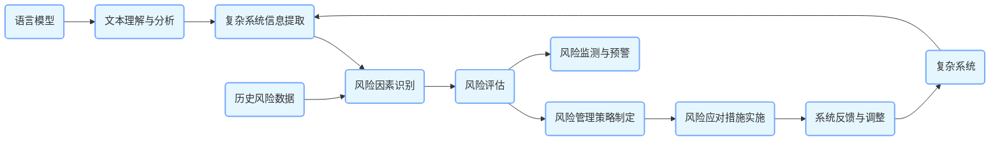

# 语言模型在复杂系统风险评估与管理中的能力

> 关键词：语言模型、复杂系统、风险评估、风险管理、自然语言处理

> 摘要：本文深入探讨了语言模型在复杂系统风险评估与管理中的能力。首先介绍了相关背景，包括研究目的、预期读者、文档结构和术语表。接着阐述了核心概念，如语言模型、复杂系统、风险评估与管理及其相互联系，并给出了相应的文本示意图和 Mermaid 流程图。详细讲解了核心算法原理和具体操作步骤，使用 Python 源代码进行说明。还介绍了相关的数学模型和公式，并举例说明。通过项目实战展示了代码的实际案例和详细解释。分析了语言模型在不同场景下的实际应用。推荐了学习资源、开发工具框架和相关论文著作。最后总结了未来发展趋势与挑战，提供了常见问题解答和扩展阅读参考资料，旨在全面剖析语言模型在复杂系统风险评估与管理中的应用潜力和局限。

## 1. 背景介绍 
### 1.1 目的和范围
在当今复杂多变的世界中，各类复杂系统如金融系统、能源系统、交通系统等面临着诸多不确定性和风险。准确评估和有效管理这些风险对于保障系统的稳定运行、避免重大损失至关重要。传统的风险评估与管理方法在处理复杂系统的海量数据、非线性关系和模糊信息时存在一定的局限性。而语言模型作为自然语言处理领域的重要技术，具有强大的文本理解、生成和推理能力。本研究的目的在于深入探讨语言模型在复杂系统风险评估与管理中的能力，明确其优势、适用范围和潜在挑战。具体范围涵盖了语言模型在不同类型复杂系统中的应用，包括但不限于金融市场风险、工业生产风险、生态环境风险等领域的风险评估与管理。

### 1.2 预期读者
本文预期读者包括从事风险评估与管理领域的专业人士，如金融分析师、风险管理专家、安全工程师等，他们可以从本文中了解语言模型在其工作中的应用潜力和实际操作方法。同时，自然语言处理和人工智能领域的研究人员和开发者也将对本文感兴趣，通过本文可以了解语言模型在跨领域应用中的挑战和机遇。此外，相关领域的学生和学者也可将本文作为学习和研究的参考资料，深入了解语言模型在复杂系统中的应用原理和实践案例。

### 1.3 文档结构概述
本文将按照以下结构进行组织：首先介绍背景知识，包括研究目的、预期读者和文档结构。接着阐述核心概念，包括语言模型、复杂系统、风险评估与管理的定义及其相互关系，并通过文本示意图和 Mermaid 流程图进行直观展示。然后详细讲解核心算法原理和具体操作步骤，使用 Python 源代码进行说明。随后介绍相关的数学模型和公式，并举例说明其在风险评估与管理中的应用。通过项目实战部分展示语言模型在实际案例中的应用，包括开发环境搭建、源代码实现和代码解读。分析语言模型在不同实际场景中的应用情况。推荐相关的学习资源、开发工具框架和论文著作。最后总结语言模型在复杂系统风险评估与管理中的未来发展趋势与挑战，提供常见问题解答和扩展阅读参考资料。

### 1.4 术语表
#### 1.4.1 核心术语定义
- **语言模型**：是一种概率模型，用于计算一个句子或文本序列出现的概率。它可以根据已有的文本数据学习语言的模式和规律，从而对未知文本进行预测和生成。常见的语言模型包括基于统计的语言模型和基于深度学习的神经网络语言模型。
- **复杂系统**：是由大量相互作用的组件组成的系统，这些组件之间的关系通常是非线性的、动态的和复杂的。复杂系统具有涌现性、自组织性和适应性等特点，如生态系统、社会系统、金融系统等。
- **风险评估**：是对可能影响系统目标实现的不确定性事件进行识别、分析和评价的过程。通过风险评估，可以确定风险的可能性和影响程度，为风险管理提供依据。
- **风险管理**：是指在识别、评估和分析风险的基础上，采取相应的措施来降低风险的过程。风险管理的目标是在保证系统正常运行的前提下，最大限度地减少风险带来的损失。

#### 1.4.2 相关概念解释
- **自然语言处理（NLP）**：是人工智能的一个重要分支，旨在让计算机能够理解、处理和生成人类语言。语言模型是自然语言处理中的关键技术之一，用于解决文本分类、情感分析、机器翻译等任务。
- **深度学习**：是一种基于人工神经网络的机器学习方法，通过构建多层神经网络来学习数据的特征和模式。深度学习在自然语言处理领域取得了显著的成果，许多先进的语言模型都是基于深度学习技术构建的。
- **不确定性**：在复杂系统中，不确定性是指由于系统的复杂性和信息的不完全性，导致对系统未来状态和事件的预测存在一定的误差和不确定性。风险通常与不确定性密切相关，不确定性越大，风险也越高。

#### 1.4.3 缩略词列表
- **NLP**：自然语言处理（Natural Language Processing）
- **RNN**：循环神经网络（Recurrent Neural Network）
- **LSTM**：长短期记忆网络（Long Short-Term Memory）
- **GRU**：门控循环单元（Gated Recurrent Unit）
- **Transformer**：一种基于注意力机制的深度学习模型架构

## 2. 核心概念与联系 
### 核心概念原理
#### 语言模型
语言模型的核心原理是根据已有的文本数据学习语言的统计规律，从而预测下一个词或字符出现的概率。早期的语言模型主要基于统计方法，如 n - 元语法模型（n - gram model）。n - 元语法模型假设一个词的出现只依赖于其前面的 n - 1 个词，通过统计语料库中 n 个词序列的出现频率来估计概率。例如，对于一个三元语法模型（trigram model），计算 $P(w_i|w_{i - 1}, w_{i - 2})$ ，即给定前两个词 $w_{i - 1}$ 和 $w_{i - 2}$ ，词 $w_i$ 出现的概率。

随着深度学习的发展，神经网络语言模型逐渐成为主流。如 RNN、LSTM、GRU 等循环神经网络模型可以处理变长的文本序列，通过在时间步上的循环连接来捕捉文本中的上下文信息。而 Transformer 模型则引入了注意力机制，能够并行处理文本序列，更好地捕捉长距离依赖关系。

#### 复杂系统
复杂系统由大量相互作用的组件组成，这些组件之间的关系是非线性的、动态的。复杂系统的行为往往具有涌现性，即系统整体的行为不能简单地由其组件的行为相加得到。例如，在金融市场中，众多投资者的交易行为相互影响，形成了复杂的市场动态，股票价格的波动不仅受到公司基本面的影响，还受到市场情绪、宏观经济环境等多种因素的综合作用。

#### 风险评估与管理
风险评估的原理是通过对系统中可能存在的风险因素进行识别、分析和评价，确定风险的可能性和影响程度。常用的风险评估方法包括定性评估和定量评估。定性评估主要基于专家的经验和判断，对风险进行等级划分；定量评估则通过建立数学模型，使用统计数据和概率方法来计算风险的数值。

风险管理则是在风险评估的基础上，采取相应的措施来降低风险。这些措施包括风险规避、风险减轻、风险转移和风险接受等。例如，在金融投资中，可以通过分散投资来降低单一资产的风险，这属于风险减轻的策略。

### 核心概念架构的文本示意图
```plaintext
+----------------+         +----------------+         +----------------------+
|    语言模型    |         |    复杂系统    |         |  风险评估与管理  |
+----------------+         +----------------+         +----------------------+
| - 统计语言模型 |         | - 组件相互作用 |         | - 风险识别        |
| - 神经网络模型 |         | - 非线性关系  |         | - 风险分析        |
|   - RNN        |         | - 动态变化    |         | - 风险评价        |
|   - LSTM       |         | - 涌现性      |         | - 风险应对策略    |
|   - GRU        |         |                |         |                    |
|   - Transformer|         |                |         |                    |
+----------------+         +----------------+         +----------------------+
          |                          |                          |
          |                          |                          |
          |                          |                          |
          +--------------------------+--------------------------+
                            相互关联与应用
```

### Mermaid 流程图


## 3. 核心算法原理 & 具体操作步骤 
### 核心算法原理
#### 基于 Transformer 的语言模型
Transformer 模型是一种基于注意力机制的深度学习模型，其核心结构包括编码器（Encoder）和解码器（Decoder）。在风险评估与管理中，我们主要关注编码器部分，用于对文本数据进行特征提取和表示。

Transformer 编码器由多个相同的层堆叠而成，每层包含多头自注意力机制（Multi - Head Self - Attention）和前馈神经网络（Feed - Forward Network）。多头自注意力机制允许模型在不同的表示子空间中关注输入序列的不同部分，从而捕捉更丰富的语义信息。前馈神经网络则对自注意力机制的输出进行非线性变换。

#### 注意力机制
注意力机制的核心思想是为输入序列中的每个元素分配一个权重，以便模型能够有选择地关注不同的元素。在自注意力机制中，输入序列的每个元素都会计算与其他元素的相关性，得到一个注意力分数，然后通过 softmax 函数将这些分数归一化，得到注意力权重。最后，将输入序列的元素按照注意力权重进行加权求和，得到输出。

### 具体操作步骤
#### 步骤 1：数据收集与预处理
首先，收集与复杂系统相关的文本数据，如新闻报道、行业报告、风险评估文档等。对收集到的数据进行预处理，包括清洗、分词、去除停用词等操作。以下是使用 Python 和 NLTK 库进行文本预处理的示例代码：
```python
import nltk
from nltk.corpus import stopwords
from nltk.tokenize import word_tokenize
import string

nltk.download('punkt')
nltk.download('stopwords')

def preprocess_text(text):
    # 转换为小写
    text = text.lower()
    # 去除标点符号
    text = text.translate(str.maketrans('', '', string.punctuation))
    # 分词
    tokens = word_tokenize(text)
    # 去除停用词
    stop_words = set(stopwords.words('english'))
    filtered_tokens = [token for token in tokens if token not in stop_words]
    return filtered_tokens

# 示例文本
text = "This is an example text for preprocessing!"
preprocessed_tokens = preprocess_text(text)
print(preprocessed_tokens)
```
#### 步骤 2：特征提取
使用预训练的 Transformer 模型（如 BERT）对预处理后的文本进行特征提取。可以使用 Hugging Face 的 Transformers 库来加载和使用预训练模型。以下是一个示例代码：
```python
from transformers import AutoTokenizer, AutoModel
import torch

# 加载预训练的 BERT 模型和分词器
tokenizer = AutoTokenizer.from_pretrained('bert-base-uncased')
model = AutoModel.from_pretrained('bert-base-uncased')

# 示例文本
text = "This is an example sentence for feature extraction."
# 分词
inputs = tokenizer(text, return_tensors='pt')
# 输入模型得到输出
outputs = model(**inputs)
# 获取最后一层的隐藏状态
last_hidden_state = outputs.last_hidden_state
print(last_hidden_state.shape)
```
#### 步骤 3：风险因素识别
使用提取的文本特征，通过机器学习或深度学习模型进行风险因素识别。例如，可以使用支持向量机（SVM）或神经网络分类器将文本分类为不同的风险类别。以下是一个使用 SVM 进行文本分类的示例代码：
```python
from sklearn.svm import SVC
from sklearn.feature_extraction.text import TfidfVectorizer
from sklearn.model_selection import train_test_split
from sklearn.metrics import accuracy_score
import pandas as pd

# 示例数据集
data = {
    'text': ['This is a high - risk situation.', 'This is a low - risk case.'],
    'label': [1, 0]
}
df = pd.DataFrame(data)

# 特征提取
vectorizer = TfidfVectorizer()
X = vectorizer.fit_transform(df['text'])
y = df['label']

# 划分训练集和测试集
X_train, X_test, y_train, y_test = train_test_split(X, y, test_size=0.2, random_state=42)

# 训练 SVM 模型
model = SVC()
model.fit(X_train, y_train)

# 预测
y_pred = model.predict(X_test)

# 评估模型
accuracy = accuracy_score(y_test, y_pred)
print(f"Accuracy: {accuracy}")
```
#### 步骤 4：风险评估
根据识别出的风险因素，使用数学模型或统计方法进行风险评估。例如，可以使用概率模型计算风险发生的可能性和影响程度。具体的数学模型将在后续章节详细介绍。
#### 步骤 5：风险管理策略制定
根据风险评估的结果，制定相应的风险管理策略。这可能涉及到风险规避、风险减轻、风险转移等措施。可以使用决策树、多目标优化等方法来辅助制定风险管理策略。

## 4. 数学模型和公式 & 详细讲解 & 举例说明 
### 风险评估的数学模型
#### 概率风险评估模型
在概率风险评估中，通常使用概率分布来描述风险事件发生的可能性和影响程度。设 $X$ 表示风险事件的损失，$P(X)$ 表示损失 $X$ 发生的概率分布。风险的期望值（Expected Value，EV）可以通过以下公式计算：
$$EV=\int_{-\infty}^{\infty}xP(x)dx$$
在离散情况下，公式可以表示为：
$$EV=\sum_{i = 1}^{n}x_iP(x_i)$$
其中，$x_i$ 是第 $i$ 种损失情况，$P(x_i)$ 是其发生的概率。

例如，在一个投资项目中，有三种可能的结果：收益 100 万元的概率为 0.2，收益 50 万元的概率为 0.5，损失 20 万元的概率为 0.3。则该投资项目的风险期望值为：
$$EV = 100\times0.2 + 50\times0.5+(- 20)\times0.3=20 + 25-6 = 39$$（万元）

#### 风险矩阵模型
风险矩阵是一种常用的定性风险评估方法，通过将风险事件的可能性和影响程度分别划分为不同的等级，构建一个矩阵来评估风险的优先级。设可能性等级为 $L$，影响程度等级为 $I$，则风险等级 $R$ 可以表示为：
$$R = f(L, I)$$
其中，$f$ 是一个函数，通常可以是简单的乘法或其他自定义的规则。例如，将可能性和影响程度都分为高、中、低三个等级，构建一个 3x3 的风险矩阵。如果可能性为高（记为 3），影响程度为中（记为 2），则风险等级为 $3\times2 = 6$。

### 基于语言模型的风险评估公式
#### 文本相似度计算
在使用语言模型进行风险评估时，经常需要计算文本之间的相似度。常用的相似度计算方法包括余弦相似度。设 $\vec{v}_1$ 和 $\vec{v}_2$ 是两个文本的向量表示，则它们的余弦相似度 $cosine\_similarity$ 可以通过以下公式计算：
$$cosine\_similarity(\vec{v}_1,\vec{v}_2)=\frac{\vec{v}_1\cdot\vec{v}_2}{\|\vec{v}_1\|\|\vec{v}_2\|}$$
其中，$\vec{v}_1\cdot\vec{v}_2$ 是向量的点积，$\|\vec{v}_1\|$ 和 $\|\vec{v}_2\|$ 分别是向量的模。

例如，假设有两个文本向量 $\vec{v}_1=(1, 2, 3)$ 和 $\vec{v}_2=(4, 5, 6)$，则它们的余弦相似度为：
$$cosine\_similarity(\vec{v}_1,\vec{v}_2)=\frac{1\times4 + 2\times5+3\times6}{\sqrt{1^2 + 2^2+3^2}\sqrt{4^2 + 5^2+6^2}}=\frac{4 + 10 + 18}{\sqrt{14}\sqrt{77}}=\frac{32}{\sqrt{1078}}\approx0.97$$

#### 风险评分计算
可以根据文本相似度和其他因素来计算风险评分。设 $S$ 是文本相似度，$W$ 是其他因素的权重向量，$\vec{F}$ 是风险特征向量，则风险评分 $Score$ 可以表示为：
$$Score = S\times\sum_{i = 1}^{n}W_iF_i$$
例如，假设文本相似度 $S = 0.8$，权重向量 $W=(0.3, 0.5, 0.2)$，风险特征向量 $\vec{F}=(2, 3, 1)$，则风险评分 $Score$ 为：
$$Score = 0.8\times(0.3\times2 + 0.5\times3+0.2\times1)=0.8\times(0.6 + 1.5+0.2)=0.8\times2.3 = 1.84$$

## 5. 项目实战：代码实际案例和详细解释说明 
### 5.1  开发环境搭建
#### 操作系统
可以选择 Linux（如 Ubuntu）、Windows 或 macOS 作为开发操作系统。本示例以 Ubuntu 20.04 为例。

#### Python 环境
安装 Python 3.7 或更高版本。可以使用以下命令安装：
```bash
sudo apt update
sudo apt install python3 python3-pip
```

#### 依赖库安装
安装项目所需的 Python 依赖库，包括 Transformers、Scikit - learn、Pandas 等。可以使用以下命令安装：
```bash
pip install transformers scikit-learn pandas torch
```

### 5.2  源代码详细实现和代码解读
以下是一个完整的项目实战代码示例，用于使用语言模型进行金融市场风险评估。

```python
import pandas as pd
from transformers import AutoTokenizer, AutoModel
import torch
from sklearn.svm import SVC
from sklearn.model_selection import train_test_split
from sklearn.metrics import accuracy_score
from sklearn.feature_extraction.text import TfidfVectorizer

# 步骤 1：数据加载与预处理
# 假设我们有一个包含新闻文本和风险标签的 CSV 文件
data = pd.read_csv('financial_news.csv')
texts = data['text'].tolist()
labels = data['label'].tolist()

# 文本预处理
def preprocess_text(text):
    text = text.lower()
    text = ''.join([c for c in text if c.isalnum() or c.isspace()])
    return text

preprocessed_texts = [preprocess_text(text) for text in texts]

# 步骤 2：特征提取
# 加载预训练的 BERT 模型和分词器
tokenizer = AutoTokenizer.from_pretrained('bert-base-uncased')
model = AutoModel.from_pretrained('bert-base-uncased')

# 定义一个函数来提取文本特征
def extract_features(texts):
    features = []
    for text in texts:
        inputs = tokenizer(text, return_tensors='pt', truncation=True, padding='max_length', max_length=128)
        with torch.no_grad():
            outputs = model(**inputs)
        # 取 [CLS] 标记的输出作为文本特征
        cls_feature = outputs.last_hidden_state[:, 0, :].numpy()[0]
        features.append(cls_feature)
    return features

bert_features = extract_features(preprocessed_texts)

# 也可以使用 TF-IDF 特征进行对比
vectorizer = TfidfVectorizer()
tfidf_features = vectorizer.fit_transform(preprocessed_texts)

# 步骤 3：模型训练与评估
# 划分训练集和测试集
X_train_bert, X_test_bert, y_train, y_test = train_test_split(bert_features, labels, test_size=0.2, random_state=42)
X_train_tfidf, X_test_tfidf, _, _ = train_test_split(tfidf_features, labels, test_size=0.2, random_state=42)

# 使用 SVM 模型进行训练
# 基于 BERT 特征的模型
svm_bert = SVC()
svm_bert.fit(X_train_bert, y_train)
y_pred_bert = svm_bert.predict(X_test_bert)
accuracy_bert = accuracy_score(y_test, y_pred_bert)

# 基于 TF-IDF 特征的模型
svm_tfidf = SVC()
svm_tfidf.fit(X_train_tfidf, y_train)
y_pred_tfidf = svm_tfidf.predict(X_test_tfidf)
accuracy_tfidf = accuracy_score(y_test, y_pred_tfidf)

print(f"Accuracy using BERT features: {accuracy_bert}")
print(f"Accuracy using TF-IDF features: {accuracy_tfidf}")
```

### 5.3  代码解读与分析
#### 数据加载与预处理
首先，使用 Pandas 库加载包含金融新闻文本和风险标签的 CSV 文件。然后定义了一个 `preprocess_text` 函数，用于将文本转换为小写并去除非字母数字和空格字符。

#### 特征提取
使用 Hugging Face 的 Transformers 库加载预训练的 BERT 模型和分词器。定义了 `extract_features` 函数，该函数将输入的文本进行分词，输入到 BERT 模型中，取 [CLS] 标记的输出作为文本特征。同时，使用 `TfidfVectorizer` 提取 TF - IDF 特征，用于对比。

#### 模型训练与评估
将提取的特征划分为训练集和测试集，使用支持向量机（SVM）模型进行训练和预测。分别计算基于 BERT 特征和 TF - IDF 特征的模型的准确率，并进行比较。通过比较可以发现，基于 BERT 特征的模型通常能够取得更好的性能，因为 BERT 模型能够捕捉到文本的语义信息。

## 6. 实际应用场景 
### 金融市场风险评估
在金融市场中，语言模型可以用于分析新闻报道、公司公告、分析师报告等文本信息，识别潜在的风险因素。例如，通过分析关于某家公司的负面新闻，可以预测该公司的股价可能下跌，从而评估投资风险。语言模型还可以用于监测市场情绪，通过分析社交媒体上的言论来判断投资者的情绪倾向，为风险管理提供参考。

### 工业生产风险评估
在工业生产领域，语言模型可以处理设备维护记录、事故报告、安全规范文档等文本数据。通过对这些文本的分析，识别设备故障的潜在风险、生产过程中的安全隐患等。例如，分析设备维护记录中频繁出现的故障描述，可以提前预测设备可能出现的问题，采取预防性维护措施，降低生产中断的风险。

### 生态环境风险评估
对于生态环境领域，语言模型可以分析环境监测报告、科研论文、政策文件等文本信息。例如，通过分析关于某一地区的污染监测报告和相关研究论文，评估该地区的生态环境风险，如土壤污染、水污染等。还可以根据政策文件的内容，预测未来环境政策的变化对企业和生态系统的影响。

### 医疗健康风险评估
在医疗健康领域，语言模型可以处理病历、医学文献、临床指南等文本数据。通过对病历的分析，识别患者的潜在健康风险，如遗传疾病、慢性疾病的发病风险等。同时，分析医学文献和临床指南，为医生提供最新的治疗方案和风险评估建议。

## 7. 工具和资源推荐
### 7.1 学习资源推荐
#### 7.1.1 书籍推荐
- 《自然语言处理入门》：这本书系统地介绍了自然语言处理的基本概念、算法和技术，适合初学者入门。
- 《深度学习》：由 Ian Goodfellow、Yoshua Bengio 和 Aaron Courville 所著，是深度学习领域的经典教材，对理解语言模型的原理有很大帮助。
- 《Python 自然语言处理》：详细介绍了如何使用 Python 进行自然语言处理任务，包括文本预处理、特征提取、模型训练等内容。

#### 7.1.2 在线课程
- Coursera 上的“Natural Language Processing Specialization”：由斯坦福大学的教授授课，涵盖了自然语言处理的多个方面，包括语言模型、文本分类、机器翻译等。
- edX 上的“Deep Learning Specialization”：该课程深入讲解了深度学习的原理和应用，对理解语言模型的底层机制很有帮助。
- 哔哩哔哩（B站）上有很多关于自然语言处理和语言模型的免费教程，适合初学者快速入门。

#### 7.1.3 技术博客和网站
- Hugging Face Blog：Hugging Face 是自然语言处理领域的知名公司，其博客上经常发布关于语言模型的最新研究成果和应用案例。
- Towards Data Science：这是一个专注于数据科学和机器学习的博客平台，有很多关于语言模型在各个领域应用的文章。
- ArXiv：是一个预印本服务器，上面可以找到很多关于自然语言处理和语言模型的最新研究论文。

### 7.2 开发工具框架推荐
#### 7.2.1 IDE和编辑器
- PyCharm：是一款专业的 Python 集成开发环境，具有代码自动补全、调试、版本控制等功能，适合开发大型 Python 项目。
- Visual Studio Code：是一款轻量级的代码编辑器，支持多种编程语言和插件扩展，对于快速开发和调试 Python 代码非常方便。
- Jupyter Notebook：是一个交互式的开发环境，适合进行数据分析、模型训练和实验。可以将代码、文本说明和可视化结果整合在一个文档中。

#### 7.2.2 调试和性能分析工具
- Py-Spy：是一个用于分析 Python 程序性能的工具，可以实时查看程序的 CPU 使用率和函数调用情况。
- TensorBoard：是 TensorFlow 提供的一个可视化工具，可用于监控模型的训练过程、查看模型的结构和性能指标。
- PDB：是 Python 自带的调试器，可以在代码中设置断点，逐行调试程序，帮助查找代码中的错误。

#### 7.2.3 相关框架和库
- Transformers：由 Hugging Face 开发的一个用于自然语言处理的库，提供了多种预训练的语言模型，如 BERT、GPT - 2 等，方便用户进行模型的加载和微调。
- Scikit - learn：是一个常用的机器学习库，提供了多种机器学习算法和工具，如分类、回归、聚类等，可用于风险评估模型的训练和评估。
- Pandas：是一个用于数据处理和分析的库，提供了高效的数据结构和数据操作方法，适合处理和清洗文本数据。

### 7.3 相关论文著作推荐
#### 7.3.1 经典论文
- “Attention Is All You Need”：这篇论文提出了 Transformer 模型，是自然语言处理领域的重要突破，为后续的语言模型发展奠定了基础。
- “BERT: Pre-training of Deep Bidirectional Transformers for Language Understanding”：介绍了 BERT 模型的预训练和微调方法，在多个自然语言处理任务上取得了优异的成绩。
- “Long Short-Term Memory”：提出了长短期记忆网络（LSTM），解决了传统循环神经网络的梯度消失问题，在处理序列数据方面表现出色。

#### 7.3.2 最新研究成果
- 可以关注 ACL（Association for Computational Linguistics）、EMNLP（Conference on Empirical Methods in Natural Language Processing）等自然语言处理领域的顶级会议，这些会议上会发布很多关于语言模型的最新研究成果。
- 也可以在 ArXiv 上搜索关于“language models in risk assessment”等关键词，获取最新的研究论文。

#### 7.3.3 应用案例分析
- 一些金融机构和科研机构会发布关于语言模型在金融风险评估、工业风险评估等领域的应用案例报告。可以通过这些报告了解语言模型在实际应用中的效果和挑战。

## 8. 总结：未来发展趋势与挑战
### 未来发展趋势
#### 模型性能提升
随着深度学习技术的不断发展，语言模型的性能将不断提升。未来的语言模型可能会具有更强的语义理解能力、推理能力和知识融合能力，能够更准确地识别复杂系统中的风险因素。

#### 多模态融合
未来的风险评估与管理可能会结合多种模态的数据，如文本、图像、视频等。语言模型可以与计算机视觉、音频处理等技术相结合，实现更全面、准确的风险评估。例如，在工业生产中，可以结合设备的图像数据和操作手册文本数据进行风险评估。

#### 可解释性增强
目前的语言模型大多是黑盒模型，其决策过程难以解释。未来的研究将更加关注语言模型的可解释性，开发出能够解释模型决策依据的方法和技术，提高风险管理的可信度和可靠性。

#### 个性化应用
不同的复杂系统具有不同的特点和风险特征，未来的语言模型将更加注重个性化应用。可以根据不同系统的需求，对语言模型进行定制化训练和优化，提高风险评估与管理的针对性和有效性。

### 挑战
#### 数据质量和数量
语言模型的性能很大程度上依赖于高质量、大规模的数据。在复杂系统风险评估与管理中，获取足够的、准确的文本数据可能是一个挑战。此外，数据的标注也需要耗费大量的人力和时间。

#### 计算资源需求
训练和使用大型语言模型需要大量的计算资源，包括高性能的 GPU 和大规模的服务器集群。这对于一些中小企业和研究机构来说可能是一个难以承受的成本。

#### 模型泛化能力
复杂系统的风险情况是不断变化的，语言模型需要具有良好的泛化能力，能够适应不同的风险场景和数据分布。如何提高模型的泛化能力，避免过拟合，是一个需要解决的问题。

#### 伦理和法律问题
语言模型的应用可能会带来一些伦理和法律问题，如数据隐私保护、算法偏见等。在使用语言模型进行风险评估与管理时，需要制定相应的伦理和法律规范，确保其合法、合规和公正。

## 9. 附录：常见问题与解答
### 问题 1：语言模型在风险评估中的准确性如何保证？
解答：可以从以下几个方面保证语言模型在风险评估中的准确性。首先，使用高质量、大规模的训练数据，数据的多样性和准确性对模型的性能有很大影响。其次，选择合适的模型架构和训练方法，如使用预训练的语言模型并进行微调。此外，进行严格的模型评估和验证，使用交叉验证、测试集等方法评估模型的性能，及时发现和解决模型的过拟合或欠拟合问题。

### 问题 2：如何处理语言模型在复杂系统中遇到的未知风险？
解答：对于未知风险，语言模型可以通过以下方式进行处理。一方面，可以不断更新和扩充训练数据，将新出现的风险情况纳入训练集中，使模型能够学习到新的风险特征。另一方面，可以结合领域知识和专家经验，对未知风险进行初步判断和分析，辅助语言模型进行决策。此外，还可以使用一些不确定性量化方法，对模型的预测结果进行不确定性估计，为风险管理提供更全面的信息。

### 问题 3：语言模型在风险评估与管理中的计算成本高吗？
解答：语言模型在风险评估与管理中的计算成本可能较高，尤其是使用大型预训练模型时。训练大型语言模型需要大量的计算资源和时间，包括高性能的 GPU 和大规模的服务器集群。在实际应用中，可以根据具体需求选择合适的模型，对于一些简单的任务，可以使用轻量级的语言模型。此外，还可以采用模型压缩、量化等技术，降低模型的计算成本。

### 问题 4：语言模型的输出结果如何与传统的风险评估方法相结合？
解答：可以将语言模型的输出结果作为传统风险评估方法的补充信息。例如，在概率风险评估中，可以将语言模型识别出的风险因素作为额外的变量纳入概率模型中，提高风险评估的准确性。在风险矩阵评估中，可以根据语言模型对风险事件的描述，调整风险事件的可能性和影响程度等级。此外，还可以使用多模型融合的方法，将语言模型与传统的机器学习模型、统计模型等相结合，综合考虑多种因素进行风险评估。

## 10. 扩展阅读 & 参考资料
### 扩展阅读
- 《人工智能：现代方法》：这本书全面介绍了人工智能的各个领域，包括自然语言处理、机器学习等，对于深入理解语言模型的背景和相关技术有很大帮助。
- 《复杂》：探讨了复杂系统的基本概念、特性和研究方法，有助于理解复杂系统的本质和风险来源。
- 《风险社会》：从社会学的角度分析了现代社会面临的各种风险，为语言模型在风险评估与管理中的应用提供了更广阔的视角。

### 参考资料
- Hugging Face 官方文档：https://huggingface.co/docs
- Scikit - learn 官方文档：https://scikit - learn.org/stable/documentation.html
- Pandas 官方文档：https://pandas.pydata.org/docs/

作者：AI天才研究院/AI Genius Institute & 禅与计算机程序设计艺术 /Zen And The Art of Computer Programming