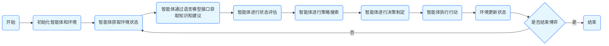

# 语言模型在多agent博弈推理中的表现优化

> 关键词：语言模型、多agent博弈推理、表现优化、算法原理、实际应用

> 摘要：本文聚焦于语言模型在多agent博弈推理中的表现优化问题。首先介绍了相关背景，包括目的范围、预期读者等。接着阐述了核心概念与联系，详细讲解了核心算法原理及具体操作步骤，并给出了数学模型和公式。通过项目实战，展示了代码实际案例及详细解释。探讨了实际应用场景，推荐了学习资源、开发工具框架和相关论文著作。最后总结了未来发展趋势与挑战，还提供了常见问题解答和扩展阅读参考资料，旨在为提升语言模型在多agent博弈推理中的性能提供全面的指导。

## 1. 背景介绍 
### 1.1 目的和范围
多agent博弈推理是一个复杂且具有挑战性的领域，涉及多个智能体在博弈环境中进行策略制定和决策。语言模型作为一种强大的人工智能工具，在自然语言处理和知识表示方面具有显著优势。本文章的目的在于深入研究如何优化语言模型在多agent博弈推理中的表现，通过对核心算法、数学模型和实际应用的探讨，为相关研究和实践提供理论支持和技术指导。范围涵盖了从基本概念的介绍到实际项目的实现，以及对未来发展趋势的展望。

### 1.2 预期读者
本文预期读者包括人工智能领域的研究人员、程序员、软件架构师以及对多agent系统和语言模型感兴趣的技术爱好者。无论是从事学术研究还是实际项目开发，读者都能从本文中获取关于语言模型在多agent博弈推理中表现优化的相关知识和技术。

### 1.3 文档结构概述
本文将按照以下结构进行阐述：首先介绍背景知识，包括目的、预期读者和文档结构。接着讲解核心概念与联系，包括语言模型和多agent博弈推理的基本原理和架构。然后详细阐述核心算法原理及具体操作步骤，并给出数学模型和公式。通过项目实战展示代码实际案例和详细解释。探讨实际应用场景，推荐学习资源、开发工具框架和相关论文著作。最后总结未来发展趋势与挑战，提供常见问题解答和扩展阅读参考资料。

### 1.4 术语表
#### 1.4.1 核心术语定义
- **语言模型**：是一种基于概率统计的模型，用于计算文本序列的概率分布，预测下一个可能出现的单词或字符。
- **多agent系统**：由多个自主的智能体组成的系统，这些智能体可以相互交互、合作或竞争，以实现共同或各自的目标。
- **博弈推理**：在博弈环境中，智能体根据自身的目标和对手的可能行动，运用推理方法制定最优策略的过程。

#### 1.4.2 相关概念解释
- **强化学习**：一种机器学习方法，智能体通过与环境进行交互，根据环境反馈的奖励信号来学习最优策略。
- **知识图谱**：一种用于表示知识的图结构，通过节点和边来表示实体和实体之间的关系。

#### 1.4.3 缩略词列表
- **NLP**：自然语言处理（Natural Language Processing）
- **RL**：强化学习（Reinforcement Learning）
- **KG**：知识图谱（Knowledge Graph）

## 2. 核心概念与联系 

### 2.1 语言模型原理
语言模型的核心目标是对自然语言文本进行建模，预测给定文本序列的概率分布。常见的语言模型包括基于统计的n-gram模型和基于深度学习的神经网络模型，如循环神经网络（RNN）、长短时记忆网络（LSTM）和Transformer等。

以Transformer为例，它采用了多头自注意力机制，能够有效地捕捉文本中的长距离依赖关系。其架构主要由编码器和解码器组成，编码器将输入的文本序列转换为特征表示，解码器根据编码器的输出生成目标文本序列。

### 2.2 多agent博弈推理原理
多agent博弈推理涉及多个智能体在博弈环境中的交互和决策。每个智能体都有自己的目标和策略，需要根据其他智能体的行动和环境信息来调整自己的策略。常见的博弈类型包括零和博弈、非零和博弈等。

在多agent博弈推理中，智能体通常需要进行状态评估、策略搜索和决策制定等过程。状态评估用于评估当前博弈状态的优劣，策略搜索用于寻找最优的行动策略，决策制定则根据评估和搜索结果选择具体的行动。

### 2.3 语言模型与多agent博弈推理的联系
语言模型可以为多agent博弈推理提供强大的知识表示和推理能力。通过对自然语言文本的理解和生成，语言模型可以帮助智能体更好地理解博弈规则、对手的意图和环境信息。同时，语言模型还可以用于生成策略建议和决策方案，提高智能体的决策质量。

例如，在一个多人策略游戏中，语言模型可以分析游戏规则和历史数据，为智能体提供策略建议。智能体可以根据这些建议制定自己的行动策略，并与其他智能体进行交互。

### 2.4 文本示意图
```plaintext
多agent博弈推理系统
|-- 智能体1
|   |-- 状态评估模块
|   |-- 策略搜索模块
|   |-- 决策制定模块
|   |-- 语言模型接口
|-- 智能体2
|   |-- 状态评估模块
|   |-- 策略搜索模块
|   |-- 决策制定模块
|   |-- 语言模型接口
|--...
|-- 环境
|   |-- 博弈规则
|   |-- 状态信息
|-- 语言模型
    |-- 知识表示
    |-- 推理能力
```

### 2.5 Mermaid流程图


## 3. 核心算法原理 & 具体操作步骤 

### 3.1 基于强化学习的语言模型优化算法
强化学习是一种用于优化智能体行为的机器学习方法，通过智能体与环境的交互，根据环境反馈的奖励信号来学习最优策略。在语言模型在多agent博弈推理中的表现优化中，可以将语言模型作为智能体的策略网络，通过强化学习来优化语言模型的参数。

#### 3.1.1 算法原理
以深度Q网络（DQN）为例，其核心思想是通过一个神经网络来近似Q值函数，Q值函数表示在某个状态下采取某个行动的预期奖励。智能体在每个时间步根据当前状态选择一个行动，环境根据行动给出奖励和下一个状态。智能体通过不断地与环境交互，更新Q值函数的参数，以最大化累计奖励。

#### 3.1.2 Python源代码实现
```python
import torch
import torch.nn as nn
import torch.optim as optim
import numpy as np

# 定义Q网络
class QNetwork(nn.Module):
    def __init__(self, input_dim, output_dim):
        super(QNetwork, self).__init__()
        self.fc1 = nn.Linear(input_dim, 64)
        self.fc2 = nn.Linear(64, 64)
        self.fc3 = nn.Linear(64, output_dim)

    def forward(self, x):
        x = torch.relu(self.fc1(x))
        x = torch.relu(self.fc2(x))
        return self.fc3(x)

# 定义DQN智能体
class DQNAgent:
    def __init__(self, input_dim, output_dim, learning_rate=0.001, gamma=0.99):
        self.q_network = QNetwork(input_dim, output_dim)
        self.optimizer = optim.Adam(self.q_network.parameters(), lr=learning_rate)
        self.gamma = gamma

    def select_action(self, state):
        state = torch.FloatTensor(state).unsqueeze(0)
        q_values = self.q_network(state)
        action = torch.argmax(q_values, dim=1).item()
        return action

    def train(self, state, action, reward, next_state, done):
        state = torch.FloatTensor(state).unsqueeze(0)
        action = torch.LongTensor([action]).unsqueeze(0)
        reward = torch.FloatTensor([reward]).unsqueeze(0)
        next_state = torch.FloatTensor(next_state).unsqueeze(0)
        done = torch.FloatTensor([done]).unsqueeze(0)

        q_values = self.q_network(state)
        q_value = q_values.gather(1, action)

        next_q_values = self.q_network(next_state)
        next_q_value = next_q_values.max(1)[0].unsqueeze(1)
        target_q_value = reward + (1 - done) * self.gamma * next_q_value

        loss = nn.MSELoss()(q_value, target_q_value)

        self.optimizer.zero_grad()
        loss.backward()
        self.optimizer.step()

# 示例使用
input_dim = 10
output_dim = 5
agent = DQNAgent(input_dim, output_dim)

state = np.random.randn(input_dim)
action = agent.select_action(state)
reward = np.random.randn()
next_state = np.random.randn(input_dim)
done = False

agent.train(state, action, reward, next_state, done)
```

### 3.2 具体操作步骤
1. **数据预处理**：将博弈环境中的状态信息和行动信息转换为适合语言模型输入的格式。例如，可以将状态信息表示为文本序列，将行动信息表示为离散的标签。
2. **模型训练**：使用强化学习算法对语言模型进行训练。在每个时间步，智能体根据当前状态选择一个行动，环境根据行动给出奖励和下一个状态。智能体根据奖励信号更新语言模型的参数，以最大化累计奖励。
3. **模型评估**：在训练过程中，定期对语言模型的性能进行评估。可以使用一些评估指标，如胜率、平均奖励等，来评估语言模型在多agent博弈推理中的表现。
4. **模型优化**：根据评估结果，对语言模型的结构和参数进行优化。可以尝试不同的网络结构、学习率和超参数，以提高语言模型的性能。

## 4. 数学模型和公式 & 详细讲解 & 举例说明 

### 4.1 强化学习中的数学模型
#### 4.1.1 马尔可夫决策过程（MDP）
马尔可夫决策过程是强化学习中的基本数学模型，由一个四元组 $(S, A, P, R)$ 表示，其中：
- $S$ 是状态空间，表示博弈环境的所有可能状态。
- $A$ 是行动空间，表示智能体可以采取的所有可能行动。
- $P(s'|s, a)$ 是状态转移概率，表示在状态 $s$ 采取行动 $a$ 后转移到状态 $s'$ 的概率。
- $R(s, a)$ 是奖励函数，表示在状态 $s$ 采取行动 $a$ 后获得的即时奖励。

#### 4.1.2 Q值函数
Q值函数 $Q(s, a)$ 表示在状态 $s$ 采取行动 $a$ 的预期累计奖励，定义为：
$$Q(s, a) = \mathbb{E}\left[\sum_{t=0}^{\infty}\gamma^t r_{t+1} \mid s_0 = s, a_0 = a\right]$$
其中，$\gamma \in [0, 1]$ 是折扣因子，用于平衡即时奖励和未来奖励的重要性。

#### 4.1.3 贝尔曼方程
Q值函数满足贝尔曼方程：
$$Q(s, a) = R(s, a) + \gamma \sum_{s' \in S} P(s'|s, a) \max_{a' \in A} Q(s', a')$$
贝尔曼方程表示当前状态的Q值等于即时奖励加上下一个状态的最大Q值的折扣和。

### 4.2 举例说明
假设有一个简单的博弈环境，状态空间 $S = \{s_1, s_2\}$，行动空间 $A = \{a_1, a_2\}$，状态转移概率和奖励函数如下：

| $s$ | $a$ | $s'$ | $P(s'|s, a)$ | $R(s, a)$ |
| --- | --- | --- | --- | --- |
| $s_1$ | $a_1$ | $s_1$ | 0.8 | 1 |
| $s_1$ | $a_1$ | $s_2$ | 0.2 | 0 |
| $s_1$ | $a_2$ | $s_1$ | 0.3 | 0 |
| $s_1$ | $a_2$ | $s_2$ | 0.7 | 2 |
| $s_2$ | $a_1$ | $s_1$ | 0.6 | 3 |
| $s_2$ | $a_1$ | $s_2$ | 0.4 | 0 |
| $s_2$ | $a_2$ | $s_1$ | 0.1 | 0 |
| $s_2$ | $a_2$ | $s_2$ | 0.9 | 1 |

假设折扣因子 $\gamma = 0.9$，初始Q值函数 $Q(s, a) = 0$。根据贝尔曼方程，可以迭代更新Q值函数：

- 第一次迭代：
  - 对于状态 $s_1$ 和行动 $a_1$：
    - $Q(s_1, a_1) = R(s_1, a_1) + \gamma \left(P(s_1|s_1, a_1) \max_{a' \in A} Q(s_1, a') + P(s_2|s_1, a_1) \max_{a' \in A} Q(s_2, a')\right)$
    - $Q(s_1, a_1) = 1 + 0.9 \times (0.8 \times 0 + 0.2 \times 0) = 1$
  - 对于状态 $s_1$ 和行动 $a_2$：
    - $Q(s_1, a_2) = R(s_1, a_2) + \gamma \left(P(s_1|s_1, a_2) \max_{a' \in A} Q(s_1, a') + P(s_2|s_1, a_2) \max_{a' \in A} Q(s_2, a')\right)$
    - $Q(s_1, a_2) = 2 + 0.9 \times (0.7 \times 0 + 0.3 \times 0) = 2$
  - 对于状态 $s_2$ 和行动 $a_1$：
    - $Q(s_2, a_1) = R(s_2, a_1) + \gamma \left(P(s_1|s_2, a_1) \max_{a' \in A} Q(s_1, a') + P(s_2|s_2, a_1) \max_{a' \in A} Q(s_2, a')\right)$
    - $Q(s_2, a_1) = 3 + 0.9 \times (0.6 \times 0 + 0.4 \times 0) = 3$
  - 对于状态 $s_2$ 和行动 $a_2$：
    - $Q(s_2, a_2) = R(s_2, a_2) + \gamma \left(P(s_1|s_2, a_2) \max_{a' \in A} Q(s_1, a') + P(s_2|s_2, a_2) \max_{a' \in A} Q(s_2, a')\right)$
    - $Q(s_2, a_2) = 1 + 0.9 \times (0.1 \times 0 + 0.9 \times 0) = 1$

经过多次迭代，Q值函数会收敛到最优值，智能体可以根据最优Q值函数选择最优行动。

## 5. 项目实战：代码实际案例和详细解释说明 

### 5.1  开发环境搭建
#### 5.1.1 安装Python
首先需要安装Python环境，建议使用Python 3.7及以上版本。可以从Python官方网站（https://www.python.org/downloads/）下载并安装。

#### 5.1.2 安装必要的库
在项目中需要使用一些Python库，如PyTorch、NumPy等。可以使用以下命令进行安装：
```sh
pip install torch numpy
```

### 5.2  源代码详细实现和代码解读
#### 5.2.1 定义博弈环境
```python
import numpy as np

class GameEnv:
    def __init__(self):
        self.state_space = [0, 1]
        self.action_space = [0, 1]
        self.state = np.random.choice(self.state_space)

    def reset(self):
        self.state = np.random.choice(self.state_space)
        return self.state

    def step(self, action):
        if self.state == 0 and action == 0:
            next_state = np.random.choice(self.state_space, p=[0.8, 0.2])
            reward = 1 if next_state == 0 else 0
        elif self.state == 0 and action == 1:
            next_state = np.random.choice(self.state_space, p=[0.3, 0.7])
            reward = 2 if next_state == 1 else 0
        elif self.state == 1 and action == 0:
            next_state = np.random.choice(self.state_space, p=[0.6, 0.4])
            reward = 3 if next_state == 0 else 0
        elif self.state == 1 and action == 1:
            next_state = np.random.choice(self.state_space, p=[0.1, 0.9])
            reward = 1 if next_state == 1 else 0

        done = False
        self.state = next_state
        return next_state, reward, done
```
**代码解读**：
- `__init__` 方法：初始化博弈环境，定义状态空间、行动空间和初始状态。
- `reset` 方法：重置环境，返回初始状态。
- `step` 方法：根据当前状态和行动，更新环境状态，返回下一个状态、奖励和是否结束的标志。

#### 5.2.2 定义DQN智能体
```python
import torch
import torch.nn as nn
import torch.optim as optim

class QNetwork(nn.Module):
    def __init__(self, input_dim, output_dim):
        super(QNetwork, self).__init__()
        self.fc1 = nn.Linear(input_dim, 64)
        self.fc2 = nn.Linear(64, 64)
        self.fc3 = nn.Linear(64, output_dim)

    def forward(self, x):
        x = torch.relu(self.fc1(x))
        x = torch.relu(self.fc2(x))
        return self.fc3(x)

class DQNAgent:
    def __init__(self, input_dim, output_dim, learning_rate=0.001, gamma=0.99):
        self.q_network = QNetwork(input_dim, output_dim)
        self.optimizer = optim.Adam(self.q_network.parameters(), lr=learning_rate)
        self.gamma = gamma

    def select_action(self, state):
        state = torch.FloatTensor(state).unsqueeze(0)
        q_values = self.q_network(state)
        action = torch.argmax(q_values, dim=1).item()
        return action

    def train(self, state, action, reward, next_state, done):
        state = torch.FloatTensor(state).unsqueeze(0)
        action = torch.LongTensor([action]).unsqueeze(0)
        reward = torch.FloatTensor([reward]).unsqueeze(0)
        next_state = torch.FloatTensor(next_state).unsqueeze(0)
        done = torch.FloatTensor([done]).unsqueeze(0)

        q_values = self.q_network(state)
        q_value = q_values.gather(1, action)

        next_q_values = self.q_network(next_state)
        next_q_value = next_q_values.max(1)[0].unsqueeze(1)
        target_q_value = reward + (1 - done) * self.gamma * next_q_value

        loss = nn.MSELoss()(q_value, target_q_value)

        self.optimizer.zero_grad()
        loss.backward()
        self.optimizer.step()
```
**代码解读**：
- `QNetwork` 类：定义Q网络，使用三层全连接神经网络。
- `DQNAgent` 类：定义DQN智能体，包括选择行动和训练方法。
  - `select_action` 方法：根据当前状态选择最优行动。
  - `train` 方法：根据当前状态、行动、奖励、下一个状态和是否结束的标志，更新Q网络的参数。

#### 5.2.3 训练智能体
```python
env = GameEnv()
input_dim = 1
output_dim = 2
agent = DQNAgent(input_dim, output_dim)

num_episodes = 1000
for episode in range(num_episodes):
    state = env.reset()
    done = False
    total_reward = 0
    while not done:
        action = agent.select_action([state])
        next_state, reward, done = env.step(action)
        agent.train([state], action, reward, [next_state], done)
        state = next_state
        total_reward += reward
    print(f"Episode {episode}: Total Reward = {total_reward}")
```
**代码解读**：
- 初始化博弈环境和DQN智能体。
- 进行多个回合的训练，每个回合中智能体与环境进行交互，根据奖励信号更新Q网络的参数。
- 打印每个回合的总奖励。

### 5.3  代码解读与分析
通过上述代码，我们实现了一个简单的多agent博弈推理环境，并使用DQN算法对语言模型（Q网络）进行优化。在训练过程中，智能体不断地与环境进行交互，根据奖励信号调整自己的策略，以最大化累计奖励。

从代码中可以看出，DQN算法的核心是Q网络的训练，通过不断地更新Q网络的参数，使得Q值函数逐渐逼近最优值。同时，使用了经验回放和目标网络等技术可以进一步提高算法的稳定性和收敛速度。

## 6. 实际应用场景 
### 6.1 游戏领域
在多人策略游戏中，如《星际争霸》、《英雄联盟》等，语言模型可以帮助智能体更好地理解游戏规则、分析对手的策略和制定自己的行动方案。通过对游戏文本信息的处理和分析，语言模型可以为智能体提供实时的策略建议，提高智能体的游戏水平。

### 6.2 金融领域
在金融市场中，多agent博弈推理可以用于模拟投资者之间的竞争和合作关系。语言模型可以帮助智能体分析金融新闻、公告和市场数据，预测市场趋势和其他投资者的行为。智能体可以根据这些信息制定投资策略，以获取最大的收益。

### 6.3 交通领域
在智能交通系统中，多个交通参与者（如车辆、行人等）可以看作是多个智能体。语言模型可以帮助交通参与者更好地理解交通规则、路况信息和其他参与者的意图。通过多agent博弈推理，交通参与者可以调整自己的行驶路线和速度，以提高交通效率和安全性。

### 6.4 医疗领域
在医疗决策中，多个医生或医疗团队可以看作是多个智能体。语言模型可以帮助医生分析患者的病历、检查报告和医学文献，提供诊断建议和治疗方案。通过多agent博弈推理，医生可以综合考虑其他医生的意见和患者的情况，做出最优的医疗决策。

## 7. 工具和资源推荐
### 7.1 学习资源推荐
#### 7.1.1 书籍推荐
- 《深度学习》（Deep Learning）：由Ian Goodfellow、Yoshua Bengio和Aaron Courville撰写，是深度学习领域的经典教材，涵盖了神经网络、卷积神经网络、循环神经网络等内容。
- 《强化学习：原理与Python实现》（Reinforcement Learning: An Introduction）：由Richard S. Sutton和Andrew G. Barto撰写，是强化学习领域的权威著作，详细介绍了强化学习的基本概念、算法和应用。
- 《自然语言处理入门》（Natural Language Processing with Python）：由Steven Bird、Ewan Klein和Edward Loper撰写，介绍了自然语言处理的基本技术和方法，包括文本处理、词性标注、命名实体识别等。

#### 7.1.2 在线课程
- Coursera上的“深度学习专项课程”（Deep Learning Specialization）：由Andrew Ng教授讲授，包括神经网络和深度学习、改善深层神经网络、结构化机器学习项目、卷积神经网络和序列模型等课程。
- Udemy上的“强化学习实战”（Reinforcement Learning A-Z™: Learn How To Build AI）：通过实际项目介绍强化学习的算法和应用，包括Q学习、深度Q网络、策略梯度等。
- edX上的“自然语言处理基础”（Foundations of Natural Language Processing）：介绍自然语言处理的基本概念和技术，包括语言模型、词向量、文本分类等。

#### 7.1.3 技术博客和网站
- Medium：有许多关于人工智能、深度学习和强化学习的技术博客文章，可以关注一些知名作者，如Andrej Karpathy、Jeremy Howard等。
- arXiv：是一个预印本平台，提供了大量的学术论文，包括人工智能领域的最新研究成果。
- Kaggle：是一个数据科学竞赛平台，有许多关于自然语言处理和强化学习的竞赛和开源代码，可以学习他人的经验和技巧。

### 7.2 开发工具框架推荐
#### 7.2.1 IDE和编辑器
- PyCharm：是一款专门为Python开发设计的集成开发环境，提供了代码编辑、调试、版本控制等功能，适合专业的Python开发者。
- Jupyter Notebook：是一个交互式的开发环境，可以在浏览器中编写和运行Python代码，支持Markdown文本和可视化，适合数据科学和机器学习的实验和教学。
- Visual Studio Code：是一款轻量级的代码编辑器，支持多种编程语言和插件，具有丰富的扩展功能，适合快速开发和调试。

#### 7.2.2 调试和性能分析工具
- TensorBoard：是TensorFlow提供的可视化工具，可以用于可视化训练过程中的损失函数、准确率等指标，帮助开发者分析模型的性能。
- PyTorch Profiler：是PyTorch提供的性能分析工具，可以用于分析模型的计算时间、内存使用等情况，帮助开发者优化模型的性能。
- cProfile：是Python内置的性能分析工具，可以用于分析Python代码的执行时间和函数调用次数，帮助开发者找出代码中的瓶颈。

#### 7.2.3 相关框架和库
- PyTorch：是一个开源的深度学习框架，提供了丰富的神经网络模块和优化算法，支持GPU加速，适合深度学习的研究和开发。
- TensorFlow：是另一个开源的深度学习框架，具有广泛的应用和社区支持，提供了高级的API和分布式训练功能，适合工业级的深度学习应用。
- OpenAI Gym：是一个开源的强化学习环境库，提供了多种经典的强化学习环境，如CartPole、MountainCar等，方便开发者进行强化学习算法的实验和验证。

### 7.3 相关论文著作推荐
#### 7.3.1 经典论文
- “Playing Atari with Deep Reinforcement Learning”：由Volodymyr Mnih等人发表，介绍了使用深度Q网络（DQN）在Atari游戏上取得了人类水平的表现，开创了深度强化学习的先河。
- “Attention Is All You Need”：由Ashish Vaswani等人发表，提出了Transformer模型，是自然语言处理领域的重要突破，被广泛应用于各种任务中。
- “Mastering the Game of Go with Deep Neural Networks and Tree Search”：由David Silver等人发表，介绍了AlphaGo使用深度神经网络和蒙特卡罗树搜索在围棋比赛中击败人类冠军，展示了人工智能在复杂博弈中的强大能力。

#### 7.3.2 最新研究成果
- 关注顶级学术会议，如NeurIPS（神经信息处理系统大会）、ICML（国际机器学习会议）、ACL（计算语言学协会年会）等，这些会议上会发表许多关于语言模型、多agent系统和博弈推理的最新研究成果。
- 关注知名学术期刊，如Journal of Artificial Intelligence Research（JAIR）、Artificial Intelligence等，这些期刊会发表经过同行评审的高质量学术论文。

#### 7.3.3 应用案例分析
- 可以参考一些实际应用案例的论文和报告，了解语言模型在多agent博弈推理中的具体应用和效果。例如，在游戏领域，可以参考OpenAI在Dota 2和《星际争霸》等游戏中的研究成果；在金融领域，可以参考一些关于量化投资和风险管理的研究论文。

## 8. 总结：未来发展趋势与挑战
### 8.1 未来发展趋势
#### 8.1.1 多模态融合
未来的语言模型在多agent博弈推理中可能会与其他模态的信息进行融合，如图像、音频等。通过多模态融合，智能体可以获取更丰富的信息，提高对博弈环境的理解和决策能力。

#### 8.1.2 元学习
元学习是一种让智能体能够快速学习新任务的技术。在多agent博弈推理中，元学习可以帮助智能体在不同的博弈环境中快速适应和学习，提高智能体的泛化能力和适应性。

#### 8.1.3 可解释性增强
随着语言模型在多agent博弈推理中的应用越来越广泛，对模型的可解释性要求也越来越高。未来的研究可能会关注如何提高语言模型的可解释性，让人类能够更好地理解模型的决策过程和结果。

### 8.2 挑战
#### 8.2.1 计算资源需求
语言模型通常需要大量的计算资源进行训练和推理，特别是在处理大规模的多agent博弈问题时，计算资源的需求会更加显著。如何在有限的计算资源下提高语言模型的性能是一个挑战。

#### 8.2.2 数据获取和标注
多agent博弈推理需要大量的高质量数据进行训练，但数据的获取和标注往往是一个困难的问题。特别是在一些复杂的博弈环境中，数据的获取和标注成本会非常高。

#### 8.2.3 策略的稳定性和鲁棒性
在多agent博弈推理中，智能体的策略需要具有稳定性和鲁棒性，能够在不同的环境和对手下保持良好的性能。但由于博弈环境的复杂性和不确定性，如何设计出稳定和鲁棒的策略是一个挑战。

## 9. 附录：常见问题与解答
### 9.1 语言模型在多agent博弈推理中的优势是什么？
语言模型在多agent博弈推理中的优势主要包括：
- 强大的知识表示和推理能力：语言模型可以对自然语言文本进行处理和分析，帮助智能体更好地理解博弈规则、对手的意图和环境信息。
- 灵活性和通用性：语言模型可以应用于不同类型的博弈环境和任务，具有较强的灵活性和通用性。
- 可扩展性：语言模型可以通过不断地训练和优化来提高性能，具有较好的可扩展性。

### 9.2 如何评估语言模型在多agent博弈推理中的表现？
可以使用以下评估指标来评估语言模型在多agent博弈推理中的表现：
- 胜率：在与其他智能体或人类对手进行博弈时，语言模型获胜的比例。
- 平均奖励：在多个回合的博弈中，语言模型获得的平均奖励。
- 策略的合理性：评估语言模型制定的策略是否合理，是否符合博弈规则和实际情况。

### 9.3 如何选择适合的强化学习算法来优化语言模型？
选择适合的强化学习算法需要考虑以下因素：
- 博弈环境的特点：不同的博弈环境具有不同的特点，如状态空间的大小、行动空间的大小、奖励函数的类型等，需要选择适合的强化学习算法。
- 计算资源的限制：一些强化学习算法需要大量的计算资源进行训练和推理，需要根据计算资源的限制选择合适的算法。
- 模型的可解释性：如果需要对模型的决策过程进行解释，需要选择具有较好可解释性的强化学习算法。

## 10. 扩展阅读 & 参考资料
### 10.1 扩展阅读
- 《人工智能：一种现代的方法》（Artificial Intelligence: A Modern Approach）：全面介绍了人工智能的基本概念、算法和应用，是人工智能领域的经典教材。
- 《深度学习实战》（Hands-On Machine Learning with Scikit-Learn, Keras, and TensorFlow）：通过实际项目介绍了深度学习的算法和应用，包括神经网络、卷积神经网络、循环神经网络等。
- 《多智能体系统：原理与编程》（Multiagent Systems: Principles and Programming）：介绍了多智能体系统的基本概念、模型和算法，包括智能体的设计、通信和协作等。

### 10.2 参考资料
- 相关学术论文和研究报告，可以从学术数据库如IEEE Xplore、ACM Digital Library等获取。
- 开源代码库，如GitHub上的相关项目，可以学习他人的代码实现和经验。
- 官方文档和教程，如PyTorch、TensorFlow等框架的官方文档和教程，可以了解框架的使用方法和功能。

作者：AI天才研究院/AI Genius Institute & 禅与计算机程序设计艺术 /Zen And The Art of Computer Programming