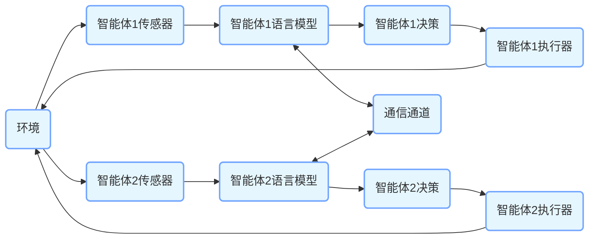

# 语言模型在多智能体协作任务中的决策能力与协调效率优化

> 关键词：语言模型、多智能体协作、决策能力、协调效率、优化

> 摘要：本文聚焦于语言模型在多智能体协作任务中的应用，深入探讨了语言模型的决策能力以及多智能体之间的协调效率问题。首先介绍了相关背景知识，包括研究目的、预期读者、文档结构和术语表。接着阐述了核心概念与联系，通过文本示意图和Mermaid流程图展示了语言模型与多智能体协作的架构。详细讲解了核心算法原理，使用Python代码进行示例。给出了相关数学模型和公式，并举例说明。通过项目实战，展示了如何搭建开发环境、实现源代码以及进行代码解读。分析了语言模型在多智能体协作中的实际应用场景。推荐了学习资源、开发工具框架和相关论文著作。最后总结了未来发展趋势与挑战，并提供了常见问题与解答以及扩展阅读和参考资料，旨在为研究和应用语言模型于多智能体协作任务提供全面的指导。

## 1. 背景介绍 
### 1.1 目的和范围
随着人工智能技术的不断发展，多智能体系统在各个领域得到了广泛应用，如机器人协作、智能交通、游戏等。语言模型作为人工智能领域的重要成果，具有强大的语言理解和生成能力。将语言模型应用于多智能体协作任务中，可以提升智能体之间的沟通和决策能力，从而提高整个协作系统的效率。

本文章的目的在于深入研究语言模型在多智能体协作任务中的决策能力和协调效率优化问题。具体范围包括语言模型在多智能体协作中的核心概念、算法原理、数学模型、实际应用案例以及相关工具和资源等方面的探讨。

### 1.2 预期读者
本文预期读者包括人工智能领域的研究人员、开发者、对多智能体系统和语言模型感兴趣的学生以及相关行业的从业者。对于希望了解语言模型在多智能体协作中应用的读者，本文将提供系统而深入的知识和实践指导。

### 1.3 文档结构概述
本文将按照以下结构进行组织：
- 核心概念与联系：介绍语言模型和多智能体协作的核心概念，以及它们之间的联系，并通过示意图和流程图进行展示。
- 核心算法原理 & 具体操作步骤：讲解语言模型在多智能体协作中的核心算法原理，使用Python代码进行详细阐述。
- 数学模型和公式 & 详细讲解 & 举例说明：给出相关的数学模型和公式，并通过具体例子进行说明。
- 项目实战：代码实际案例和详细解释说明，包括开发环境搭建、源代码实现和代码解读。
- 实际应用场景：分析语言模型在多智能体协作中的实际应用场景。
- 工具和资源推荐：推荐学习资源、开发工具框架和相关论文著作。
- 总结：未来发展趋势与挑战：总结语言模型在多智能体协作中的发展趋势和面临的挑战。
- 附录：常见问题与解答：提供常见问题的解答。
- 扩展阅读 & 参考资料：列出扩展阅读的材料和参考资料。

### 1.4 术语表
#### 1.4.1 核心术语定义
- **语言模型**：是一种基于概率统计的模型，用于预测给定文本序列的下一个词或字符的概率分布。常见的语言模型包括基于规则的语言模型、统计语言模型和神经网络语言模型。
- **多智能体系统**：由多个智能体组成的系统，每个智能体具有自主决策和行动的能力，它们之间通过通信和协作来完成共同的任务。
- **决策能力**：指智能体在面对各种情况时，能够根据自身的目标和环境信息，做出最优决策的能力。
- **协调效率**：指多智能体系统在协作过程中，能够高效地分配任务、协调行动，以达到共同目标的能力。

#### 1.4.2 相关概念解释
- **强化学习**：是一种机器学习方法，智能体通过与环境进行交互，根据环境反馈的奖励信号来学习最优策略。在多智能体协作中，强化学习可以用于智能体的决策和协调。
- **自然语言处理**：是研究如何让计算机理解和处理人类语言的技术。语言模型是自然语言处理中的重要组成部分，用于语言生成、文本分类、机器翻译等任务。

#### 1.4.3 缩略词列表
- **NLP**：Natural Language Processing，自然语言处理
- **RL**：Reinforcement Learning，强化学习
- **LLM**：Large Language Model，大语言模型

## 2. 核心概念与联系 

### 核心概念原理
语言模型在多智能体协作中扮演着重要的角色。智能体可以使用语言模型进行信息交流、知识共享和决策制定。语言模型的核心原理是基于大量的文本数据进行训练，学习语言的统计规律和语义信息。

在多智能体协作中，每个智能体可以将自己的状态、目标和观察到的环境信息通过自然语言的方式表达出来，其他智能体可以使用语言模型对这些信息进行理解和处理。同时，智能体也可以使用语言模型生成自然语言回复，进行信息反馈和协调。

### 架构的文本示意图
```plaintext
多智能体系统
|
|-- 智能体1
|   |-- 语言模型1
|   |-- 传感器（获取环境信息）
|   |-- 执行器（执行决策）
|
|-- 智能体2
|   |-- 语言模型2
|   |-- 传感器（获取环境信息）
|   |-- 执行器（执行决策）
|
|--...
|
|-- 通信通道（智能体之间的信息交流）
```

### Mermaid流程图


这个流程图展示了多智能体系统与环境的交互过程。每个智能体通过传感器获取环境信息，将其输入到语言模型中进行处理，生成决策并通过执行器执行。智能体之间通过通信通道进行信息交流，以实现协作。

## 3. 核心算法原理 & 具体操作步骤 

### 算法原理
在多智能体协作中，语言模型可以用于智能体的决策和协调。一种常见的方法是使用强化学习算法，结合语言模型进行策略学习。

具体来说，每个智能体的语言模型可以将环境信息和其他智能体的消息作为输入，生成一个动作概率分布。智能体根据这个概率分布选择一个动作执行，并根据环境反馈的奖励信号来更新语言模型的参数，以提高决策的性能。

### Python源代码示例
以下是一个简单的Python代码示例，演示了如何使用语言模型和强化学习算法进行多智能体协作：

```python
import numpy as np

# 定义一个简单的语言模型类
class LanguageModel:
    def __init__(self, num_actions):
        self.num_actions = num_actions
        self.weights = np.random.rand(num_actions)

    def predict(self, input):
        # 简单的线性模型，根据输入生成动作概率分布
        logits = np.dot(input, self.weights)
        probabilities = np.exp(logits) / np.sum(np.exp(logits))
        return probabilities

# 定义一个智能体类
class Agent:
    def __init__(self, num_actions):
        self.language_model = LanguageModel(num_actions)
        self.reward_history = []

    def choose_action(self, input):
        probabilities = self.language_model.predict(input)
        action = np.random.choice(self.language_model.num_actions, p=probabilities)
        return action

    def update(self, reward):
        self.reward_history.append(reward)
        # 简单的更新策略，根据奖励调整语言模型的权重
        if reward > 0:
            self.language_model.weights += 0.1
        else:
            self.language_model.weights -= 0.1

# 模拟多智能体协作环境
num_agents = 2
num_actions = 3
agents = [Agent(num_actions) for _ in range(num_agents)]

# 进行多次迭代
num_iterations = 10
for i in range(num_iterations):
    # 模拟环境输入
    input = np.random.rand(num_actions)
    actions = []
    for agent in agents:
        action = agent.choose_action(input)
        actions.append(action)

    # 模拟奖励
    reward = np.random.randint(-1, 2)
    for agent in agents:
        agent.update(reward)

    print(f"Iteration {i}: Actions = {actions}, Reward = {reward}")
```

### 具体操作步骤
1. **初始化语言模型和智能体**：创建语言模型和智能体对象，初始化语言模型的参数。
2. **获取环境信息**：每个智能体通过传感器获取环境信息，并将其作为输入传递给语言模型。
3. **生成动作概率分布**：语言模型根据输入生成动作概率分布。
4. **选择动作**：智能体根据动作概率分布选择一个动作执行。
5. **获取奖励**：执行动作后，智能体从环境中获取奖励信号。
6. **更新语言模型**：智能体根据奖励信号更新语言模型的参数，以提高决策的性能。
7. **重复步骤2 - 6**：进行多次迭代，直到达到终止条件。

## 4. 数学模型和公式 & 详细讲解 & 举例说明 

### 数学模型
在多智能体协作中，我们可以使用马尔可夫决策过程（MDP）来描述智能体的决策过程。马尔可夫决策过程是一个五元组 $(S, A, P, R, \gamma)$，其中：
- $S$ 是状态空间，表示环境的所有可能状态。
- $A$ 是动作空间，表示智能体可以采取的所有可能动作。
- $P(s'|s, a)$ 是状态转移概率，表示在状态 $s$ 下采取动作 $a$ 后转移到状态 $s'$ 的概率。
- $R(s, a)$ 是奖励函数，表示在状态 $s$ 下采取动作 $a$ 后获得的奖励。
- $\gamma$ 是折扣因子，用于平衡短期奖励和长期奖励。

每个智能体的目标是最大化其累积折扣奖励：
$$G_t = \sum_{k=0}^{\infty} \gamma^k R_{t+k+1}$$

### 公式详细讲解
- **状态转移概率**：$P(s'|s, a)$ 描述了环境的动态特性。在多智能体协作中，状态转移可能受到多个智能体的动作影响。
- **奖励函数**：$R(s, a)$ 定义了智能体的目标。奖励函数可以根据具体的任务进行设计，例如在机器人协作任务中，奖励可以与任务完成情况、协作效率等因素相关。
- **累积折扣奖励**：$G_t$ 考虑了未来的奖励，并通过折扣因子 $\gamma$ 对未来奖励进行衰减。$\gamma$ 的取值范围是 $[0, 1]$，$\gamma$ 越接近 1，表示智能体更注重长期奖励。

### 举例说明
假设我们有一个简单的多智能体协作任务，两个智能体需要共同搬运一个物体。状态空间 $S$ 可以表示物体的位置和智能体的位置，动作空间 $A$ 可以表示智能体的移动方向。

状态转移概率 $P(s'|s, a)$ 可以根据物理规则进行定义，例如如果智能体向前移动，那么物体和智能体的位置会相应地改变。

奖励函数 $R(s, a)$ 可以设计为：如果物体被成功搬运到目标位置，给予正奖励；如果智能体碰撞或浪费时间，给予负奖励。

假设初始状态 $s_0$，智能体采取动作 $a_0$，转移到状态 $s_1$，获得奖励 $R(s_0, a_0)$。在状态 $s_1$ 下，智能体采取动作 $a_1$，转移到状态 $s_2$，获得奖励 $R(s_1, a_1)$，以此类推。累积折扣奖励 $G_0$ 可以计算为：
$$G_0 = R(s_0, a_0) + \gamma R(s_1, a_1) + \gamma^2 R(s_2, a_2) + \cdots$$

## 5. 项目实战：代码实际案例和详细解释说明 

### 5.1  开发环境搭建
为了实现语言模型在多智能体协作任务中的应用，我们可以使用Python和一些常用的深度学习库。以下是搭建开发环境的步骤：

1. **安装Python**：建议使用Python 3.7或更高版本。可以从Python官方网站（https://www.python.org/downloads/）下载并安装。
2. **安装深度学习库**：我们可以使用PyTorch或TensorFlow等深度学习库来实现语言模型。以PyTorch为例，可以使用以下命令进行安装：
```sh
pip install torch torchvision
```
3. **安装其他依赖库**：根据具体的项目需求，可能还需要安装其他依赖库，如NumPy、Pandas等。可以使用以下命令进行安装：
```sh
pip install numpy pandas
```

### 5.2  源代码详细实现和代码解读
以下是一个更完整的Python代码示例，使用PyTorch实现一个简单的语言模型和多智能体协作系统：

```python
import torch
import torch.nn as nn
import torch.optim as optim
import numpy as np

# 定义一个简单的语言模型类
class LanguageModel(nn.Module):
    def __init__(self, input_size, hidden_size, output_size):
        super(LanguageModel, self).__init__()
        self.fc1 = nn.Linear(input_size, hidden_size)
        self.relu = nn.ReLU()
        self.fc2 = nn.Linear(hidden_size, output_size)
        self.softmax = nn.Softmax(dim=1)

    def forward(self, x):
        out = self.fc1(x)
        out = self.relu(out)
        out = self.fc2(out)
        out = self.softmax(out)
        return out

# 定义一个智能体类
class Agent:
    def __init__(self, input_size, hidden_size, output_size):
        self.language_model = LanguageModel(input_size, hidden_size, output_size)
        self.optimizer = optim.Adam(self.language_model.parameters(), lr=0.001)
        self.reward_history = []

    def choose_action(self, input):
        input = torch.FloatTensor(input).unsqueeze(0)
        probabilities = self.language_model(input)
        action = torch.multinomial(probabilities, 1).item()
        return action

    def update(self, reward):
        self.reward_history.append(reward)
        # 简单的策略梯度更新
        for param in self.language_model.parameters():
            param.grad = None
        # 这里简单模拟策略梯度更新，实际应用中需要更复杂的实现
        if reward > 0:
            for param in self.language_model.parameters():
                param.data += 0.1 * param.grad
        else:
            for param in self.language_model.parameters():
                param.data -= 0.1 * param.grad

# 模拟多智能体协作环境
num_agents = 2
input_size = 5
hidden_size = 10
output_size = 3
agents = [Agent(input_size, hidden_size, output_size) for _ in range(num_agents)]

# 进行多次迭代
num_iterations = 10
for i in range(num_iterations):
    # 模拟环境输入
    input = np.random.rand(input_size)
    actions = []
    for agent in agents:
        action = agent.choose_action(input)
        actions.append(action)

    # 模拟奖励
    reward = np.random.randint(-1, 2)
    for agent in agents:
        agent.update(reward)

    print(f"Iteration {i}: Actions = {actions}, Reward = {reward}")
```

### 代码解读与分析
- **语言模型类 `LanguageModel`**：使用PyTorch的 `nn.Module` 定义了一个简单的两层全连接神经网络。输入层接收环境信息，经过一个ReLU激活函数和一个全连接层，最后通过Softmax函数输出动作概率分布。
- **智能体类 `Agent`**：包含一个语言模型和一个优化器。`choose_action` 方法根据环境输入调用语言模型生成动作概率分布，并根据概率分布选择一个动作。`update` 方法根据奖励信号更新语言模型的参数。
- **主循环**：模拟多智能体协作环境，进行多次迭代。每次迭代中，每个智能体根据环境输入选择一个动作，执行动作后获得奖励，并更新语言模型的参数。

这个代码示例展示了如何使用语言模型和强化学习算法实现多智能体协作。在实际应用中，需要根据具体的任务进行更复杂的设计和优化。

## 6. 实际应用场景 
### 机器人协作
在机器人协作任务中，多个机器人需要共同完成一个复杂的任务，如搬运重物、探索未知环境等。语言模型可以用于机器人之间的通信和协调。每个机器人可以将自己的状态、目标和观察到的环境信息通过自然语言的方式表达出来，其他机器人可以使用语言模型对这些信息进行理解和处理，从而做出合理的决策。

例如，在一个仓库搬运任务中，机器人A发现了一个重物需要搬运，但自己无法单独完成。它可以向其他机器人发送消息：“我发现一个重物，位置是 $(x, y)$，需要协助搬运。” 其他机器人接收到消息后，使用语言模型进行理解，并根据自己的状态和任务安排，决定是否提供协助。

### 智能交通
在智能交通系统中，多个车辆和交通设施可以看作是智能体。语言模型可以用于车辆之间的通信和交通管理。车辆可以通过车联网技术与其他车辆和交通设施进行信息交流，使用语言模型生成和理解交通指令和信息。

例如，当发生交通事故时，一辆车辆可以向周围的车辆发送消息：“前方发生交通事故，请减速慢行。” 其他车辆接收到消息后，使用语言模型进行理解，并相应地调整自己的行驶速度和路线。

### 游戏领域
在多人在线游戏中，多个玩家可以看作是智能体。语言模型可以用于玩家之间的交流和协作。玩家可以通过聊天系统与其他玩家进行沟通，使用语言模型生成和理解自然语言消息。

例如，在一个团队竞技游戏中，玩家A可以向队友发送消息：“敌人在前方路口，我们一起包抄。” 队友接收到消息后，使用语言模型进行理解，并根据自己的位置和技能，制定相应的战术。

## 7. 工具和资源推荐
### 7.1 学习资源推荐
#### 7.1.1 书籍推荐
- 《人工智能：一种现代的方法》：这本书是人工智能领域的经典教材，涵盖了人工智能的各个方面，包括搜索算法、机器学习、自然语言处理等。
- 《深度学习》：由Ian Goodfellow、Yoshua Bengio和Aaron Courville撰写，是深度学习领域的权威书籍，详细介绍了深度学习的原理和应用。
- 《强化学习：原理与Python实现》：这本书系统地介绍了强化学习的基本概念、算法和应用，适合初学者入门。

#### 7.1.2 在线课程
- Coursera上的“深度学习专项课程”：由吴恩达教授授课，包括深度学习基础、卷积神经网络、循环神经网络等多个课程，是学习深度学习的优质资源。
- edX上的“强化学习”课程：由伯克利大学的Pieter Abbeel教授授课，深入讲解了强化学习的理论和实践。
- 网易云课堂上的“自然语言处理实战”课程：结合实际案例，介绍了自然语言处理的常用技术和方法。

#### 7.1.3 技术博客和网站
- arXiv：是一个预印本平台，提供了大量的学术论文，包括人工智能、机器学习、自然语言处理等领域的最新研究成果。
- Medium：是一个技术博客平台，有很多人工智能领域的专家和开发者分享他们的经验和见解。
- Towards Data Science：专注于数据科学和机器学习领域，提供了很多高质量的技术文章和教程。

### 7.2 开发工具框架推荐
#### 7.2.1 IDE和编辑器
- PyCharm：是一款专门为Python开发设计的集成开发环境，具有代码编辑、调试、版本控制等功能，适合开发Python项目。
- Jupyter Notebook：是一个交互式的开发环境，支持Python、R等多种编程语言，适合进行数据分析和模型训练。
- Visual Studio Code：是一款轻量级的代码编辑器，支持多种编程语言和插件，具有丰富的扩展功能。

#### 7.2.2 调试和性能分析工具
- TensorBoard：是TensorFlow提供的可视化工具，可以用于查看模型的训练过程、损失函数曲线、参数分布等信息。
- PyTorch Profiler：是PyTorch提供的性能分析工具，可以帮助开发者找出代码中的性能瓶颈，优化代码性能。
- cProfile：是Python标准库中的性能分析工具，可以用于分析Python代码的执行时间和函数调用关系。

#### 7.2.3 相关框架和库
- PyTorch：是一个开源的深度学习框架，具有动态图机制，易于使用和调试，广泛应用于自然语言处理、计算机视觉等领域。
- TensorFlow：是另一个开源的深度学习框架，具有强大的分布式训练能力和丰富的工具库，适合大规模的深度学习项目。
- Hugging Face Transformers：是一个开源的自然语言处理库，提供了大量的预训练语言模型，如BERT、GPT等，方便开发者进行自然语言处理任务。

### 7.3 相关论文著作推荐
#### 7.3.1 经典论文
- “Attention Is All You Need”：提出了Transformer架构，是自然语言处理领域的重要突破，为后续的大语言模型发展奠定了基础。
- “Playing Atari with Deep Reinforcement Learning”：首次将深度神经网络与强化学习相结合，用于玩Atari游戏，展示了深度强化学习的强大能力。
- “MADDPG: Multi-Agent Deep Deterministic Policy Gradient”：提出了多智能体深度确定性策略梯度算法，用于解决多智能体协作问题。

#### 7.3.2 最新研究成果
- 关注arXiv上的最新论文，搜索关键词如“language model in multi-agent systems”、“multi-agent coordination optimization”等，可以获取最新的研究成果。
- 参加人工智能领域的顶级会议，如NeurIPS、ICML、ACL等，了解最新的研究动态和趋势。

#### 7.3.3 应用案例分析
- 一些科技公司的博客和研究报告中会分享他们在多智能体协作和语言模型应用方面的实践经验和案例分析，如Google、OpenAI等公司的官方博客。

## 8. 总结：未来发展趋势与挑战
### 未来发展趋势
- **更强大的语言模型**：随着计算能力的提升和算法的不断改进，语言模型的性能将不断提高，能够处理更复杂的语言任务和多智能体协作场景。
- **多模态融合**：将语言模型与视觉、听觉等多模态信息融合，使智能体能够更好地理解和处理复杂的环境信息，提高协作效率。
- **分布式和联邦学习**：在多智能体系统中，数据通常是分布式存储的。分布式和联邦学习技术可以在保护数据隐私的前提下，实现多智能体之间的模型训练和协作。
- **与人类的协作**：未来的多智能体系统将更多地与人类进行协作，语言模型可以作为智能体与人类之间的交互接口，实现更自然、高效的沟通和协作。

### 挑战
- **决策的可解释性**：语言模型在决策过程中往往是一个黑盒，难以解释其决策的依据。在多智能体协作中，需要提高决策的可解释性，以便智能体之间能够更好地理解和协调。
- **通信效率和带宽限制**：在多智能体系统中，智能体之间的通信需要消耗大量的带宽和时间。如何在有限的通信资源下，实现高效的信息交流和协调是一个挑战。
- **环境的不确定性和动态性**：实际应用中的环境往往是不确定和动态变化的，智能体需要能够快速适应环境的变化，做出合理的决策。
- **伦理和安全问题**：随着语言模型在多智能体协作中的广泛应用，伦理和安全问题也日益凸显。例如，智能体的决策可能会对人类造成伤害，需要建立相应的伦理和安全机制。

## 9. 附录：常见问题与解答
### 问题1：语言模型在多智能体协作中的作用是什么？
答：语言模型在多智能体协作中可以用于智能体之间的信息交流、知识共享和决策制定。智能体可以使用语言模型将自己的状态、目标和观察到的环境信息通过自然语言的方式表达出来，其他智能体可以使用语言模型对这些信息进行理解和处理，从而做出合理的决策。

### 问题2：如何提高多智能体协作的协调效率？
答：可以从以下几个方面提高多智能体协作的协调效率：
- 设计合理的通信协议，确保智能体之间能够高效地交流信息。
- 使用强化学习等算法，让智能体学习最优的协作策略。
- 引入分布式和联邦学习技术，在保护数据隐私的前提下，实现多智能体之间的模型训练和协作。
- 提高语言模型的性能，使智能体能够更好地理解和处理自然语言信息。

### 问题3：语言模型在多智能体协作中面临哪些挑战？
答：语言模型在多智能体协作中面临的挑战包括决策的可解释性、通信效率和带宽限制、环境的不确定性和动态性以及伦理和安全问题等。

### 问题4：如何选择适合的语言模型和开发工具？
答：选择适合的语言模型和开发工具需要考虑以下因素：
- 任务的复杂度和需求：如果任务比较简单，可以选择一些轻量级的语言模型和开发工具；如果任务比较复杂，需要选择性能更强的语言模型和开发工具。
- 计算资源：如果计算资源有限，需要选择对计算资源要求较低的语言模型和开发工具。
- 开发经验和团队技术栈：选择团队熟悉的开发工具和框架，能够提高开发效率。

## 10. 扩展阅读 & 参考资料
### 扩展阅读
- 《多智能体系统导论》：深入介绍了多智能体系统的理论和应用，适合进一步学习多智能体协作的读者。
- 《自然语言处理入门》：系统地介绍了自然语言处理的基本概念、技术和方法，对于理解语言模型有很大帮助。
- 《强化学习实战》：通过实际案例，介绍了强化学习的应用和实现，适合想要深入学习强化学习的读者。

### 参考资料
- 本文中引用的所有论文和书籍。
- 相关的开源项目和代码库，如PyTorch、TensorFlow、Hugging Face Transformers等的官方文档和代码示例。

作者：AI天才研究院/AI Genius Institute & 禅与计算机程序设计艺术 /Zen And The Art of Computer Programming