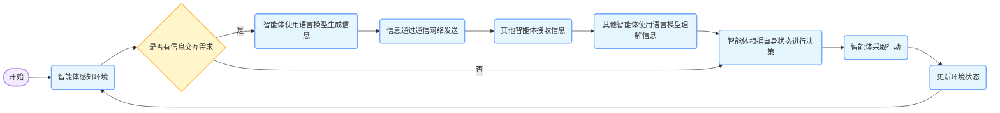

# 语言模型在多智能体协作任务中的群体智慧与集体决策优化研究

> 关键词：语言模型、多智能体协作、群体智慧、集体决策优化、人工智能

> 摘要：本文聚焦于语言模型在多智能体协作任务中的应用，深入探讨了群体智慧的形成机制以及集体决策优化的方法。首先介绍了研究的背景、目的和相关术语，接着阐述了语言模型与多智能体协作的核心概念及联系，详细讲解了核心算法原理与操作步骤，并给出了相应的数学模型和公式。通过项目实战展示了代码实现和分析，探讨了实际应用场景。最后推荐了相关工具和资源，总结了未来发展趋势与挑战，还提供了常见问题解答和参考资料。旨在为该领域的研究和实践提供全面而深入的指导。

## 1. 背景介绍 
### 1.1 目的和范围
在当今复杂多变的环境中，多智能体协作任务越来越受到关注。多智能体系统能够通过多个智能体之间的协作来完成单个智能体难以完成的复杂任务。语言模型作为人工智能领域的重要成果，具有强大的自然语言处理能力。本研究的目的在于探索如何将语言模型有效地应用于多智能体协作任务中，挖掘群体智慧，实现集体决策的优化。

研究范围涵盖了语言模型在多智能体协作中的基本原理、算法实现、数学模型分析、实际应用场景等多个方面。通过理论研究和实践验证，深入分析语言模型对多智能体协作中群体智慧形成和集体决策优化的作用机制。

### 1.2 预期读者
本文预期读者包括人工智能领域的研究人员、学者，对多智能体系统和语言模型感兴趣的程序员、软件开发者，以及相关专业的学生。对于希望深入了解语言模型在多智能体协作中应用的人士，本文提供了系统而全面的知识和技术指导。

### 1.3 文档结构概述
本文首先介绍研究的背景信息，包括目的、预期读者和文档结构等内容。接着阐述语言模型与多智能体协作的核心概念及联系，为后续研究奠定基础。然后详细讲解核心算法原理和操作步骤，给出相应的数学模型和公式。通过项目实战展示代码实现和分析，探讨实际应用场景。推荐相关工具和资源，总结未来发展趋势与挑战，最后提供常见问题解答和参考资料。

### 1.4 术语表
#### 1.4.1 核心术语定义
- **语言模型**：是一种对自然语言进行建模的概率模型，用于预测下一个词或句子的概率分布。常见的语言模型包括基于统计的语言模型和基于深度学习的语言模型，如GPT系列模型。
- **多智能体系统**：由多个智能体组成的系统，这些智能体能够感知环境、自主决策并与其他智能体进行交互，以实现共同的目标。
- **群体智慧**：指多个个体通过协作和交互所展现出的超越个体能力的智慧和创造力。在多智能体系统中，群体智慧表现为智能体之间通过信息共享和协作，做出更优的决策和行动。
- **集体决策**：指多个智能体共同参与决策过程，综合考虑各个智能体的信息和偏好，以达成最优的决策结果。

#### 1.4.2 相关概念解释
- **智能体**：具有自主性、反应性、社会性和主动性的实体，能够在环境中感知信息、做出决策并采取行动。
- **协作**：指多个智能体为了实现共同的目标，通过信息共享、协调行动等方式进行合作的过程。
- **决策优化**：指在决策过程中，通过合理的方法和策略，提高决策的质量和效率，使决策结果更加符合目标要求。

#### 1.4.3 缩略词列表
- **NLP**：Natural Language Processing，自然语言处理
- **RL**：Reinforcement Learning，强化学习
- **DNN**：Deep Neural Network，深度神经网络

## 2. 核心概念与联系 

### 语言模型原理
语言模型的基本原理是基于概率统计或深度学习方法，对自然语言进行建模。基于统计的语言模型通过计算词的共现频率来估计语言的概率分布。例如，n-gram模型假设一个词的出现只与它前面的n-1个词有关，通过统计语料库中n-gram的频率来计算语言的概率。

基于深度学习的语言模型，如Transformer架构的语言模型，通过自注意力机制来捕捉句子中词与词之间的长距离依赖关系。Transformer模型由编码器和解码器组成，编码器对输入的句子进行编码，解码器根据编码信息生成输出。

### 多智能体协作原理
多智能体协作的核心在于智能体之间的信息共享和协调行动。智能体通过感知环境获取信息，并将自己的信息与其他智能体进行交流。在协作过程中，智能体需要根据其他智能体的信息和环境状态，调整自己的行动策略，以实现共同的目标。

多智能体协作可以分为合作型协作和竞争型协作。合作型协作中，智能体的目标是一致的，它们通过合作来提高整体的性能。竞争型协作中，智能体的目标可能存在冲突，它们需要在竞争中寻求合作的机会。

### 语言模型与多智能体协作的联系
语言模型可以为多智能体协作提供自然语言处理的能力。智能体可以使用语言模型来理解和生成自然语言，从而实现更高效的信息交流。例如，智能体可以通过语言模型将自己的意图和状态以自然语言的形式表达出来，其他智能体可以使用语言模型来理解这些信息。

同时，多智能体协作也可以为语言模型的训练和优化提供更多的数据和场景。智能体在协作过程中产生的交互信息可以作为语言模型的训练数据，帮助语言模型更好地理解自然语言的语义和语用。

### 文本示意图
```plaintext
多智能体协作系统
├── 智能体1
│   ├── 感知模块
│   ├── 决策模块
│   ├── 行动模块
│   └── 语言处理模块（语言模型）
├── 智能体2
│   ├── 感知模块
│   ├── 决策模块
│   ├── 行动模块
│   └── 语言处理模块（语言模型）
└── ...
    ├── 感知模块
    ├── 决策模块
    ├── 行动模块
    └── 语言处理模块（语言模型）

智能体之间通过通信网络进行信息交互，语言模型用于信息的理解和生成。
```

### Mermaid 流程图


## 3. 核心算法原理 & 具体操作步骤 

### 基于强化学习的多智能体协作算法原理
在多智能体协作中，强化学习可以用于智能体的决策优化。强化学习的基本思想是智能体通过与环境进行交互，不断尝试不同的行动，并根据环境给予的奖励来调整自己的行动策略。

在多智能体环境中，每个智能体的奖励不仅取决于自己的行动，还可能受到其他智能体行动的影响。因此，需要设计合适的奖励函数来引导智能体的协作行为。

### Python 源代码实现
```python
import numpy as np

# 定义智能体类
class Agent:
    def __init__(self, state_size, action_size):
        self.state_size = state_size
        self.action_size = action_size
        # 初始化 Q 表
        self.q_table = np.zeros((state_size, action_size))
        # 学习率
        self.learning_rate = 0.1
        # 折扣因子
        self.discount_factor = 0.9
        # 探索率
        self.epsilon = 0.1

    def act(self, state):
        if np.random.uniform(0, 1) < self.epsilon:
            # 随机选择行动
            action = np.random.choice(self.action_size)
        else:
            # 选择 Q 值最大的行动
            action = np.argmax(self.q_table[state, :])
        return action

    def learn(self, state, action, reward, next_state):
        # 更新 Q 表
        target = reward + self.discount_factor * np.max(self.q_table[next_state, :])
        self.q_table[state, action] = (1 - self.learning_rate) * self.q_table[state, action] + self.learning_rate * target

# 定义多智能体协作环境类
class MultiAgentEnvironment:
    def __init__(self, num_agents, state_size, action_size):
        self.num_agents = num_agents
        self.state_size = state_size
        self.action_size = action_size
        self.agents = [Agent(state_size, action_size) for _ in range(num_agents)]

    def step(self, actions):
        # 模拟环境状态更新和奖励计算
        next_states = []
        rewards = []
        for i in range(self.num_agents):
            state = np.random.randint(0, self.state_size)
            next_states.append(state)
            reward = np.random.randint(-1, 2)
            rewards.append(reward)
        return next_states, rewards

    def train(self, num_episodes):
        for episode in range(num_episodes):
            states = [np.random.randint(0, self.state_size) for _ in range(self.num_agents)]
            for step in range(100):
                actions = [agent.act(state) for agent, state in zip(self.agents, states)]
                next_states, rewards = self.step(actions)
                for i in range(self.num_agents):
                    self.agents[i].learn(states[i], actions[i], rewards[i], next_states[i])
                states = next_states

# 主程序
if __name__ == "__main__":
    num_agents = 3
    state_size = 10
    action_size = 5
    env = MultiAgentEnvironment(num_agents, state_size, action_size)
    env.train(1000)
```

### 具体操作步骤
1. **初始化环境和智能体**：创建多智能体协作环境和多个智能体，初始化智能体的 Q 表。
2. **训练循环**：进行多个训练周期，每个周期包含多个时间步。
3. **智能体行动选择**：在每个时间步，智能体根据当前状态选择行动，可能采用探索或利用策略。
4. **环境交互**：智能体执行行动，环境根据行动更新状态并给出奖励。
5. **智能体学习**：智能体根据奖励和下一个状态更新自己的 Q 表。
6. **更新状态**：将下一个状态作为当前状态，继续下一个时间步。

## 4. 数学模型和公式 & 详细讲解 & 举例说明 

### Q 学习算法的数学模型
Q 学习算法是一种无模型的强化学习算法，其目标是学习一个最优的动作价值函数 $Q(s, a)$，表示在状态 $s$ 下采取动作 $a$ 的预期累积奖励。

Q 学习算法的更新公式为：
$$
Q(s_t, a_t) \leftarrow Q(s_t, a_t) + \alpha [r_{t+1} + \gamma \max_{a} Q(s_{t+1}, a) - Q(s_t, a_t)]
$$
其中：
- $s_t$ 表示时间步 $t$ 的状态。
- $a_t$ 表示时间步 $t$ 的动作。
- $r_{t+1}$ 表示时间步 $t+1$ 的奖励。
- $s_{t+1}$ 表示时间步 $t+1$ 的状态。
- $\alpha$ 是学习率，控制每次更新的步长。
- $\gamma$ 是折扣因子，用于权衡当前奖励和未来奖励的重要性。

### 详细讲解
Q 学习算法通过不断地更新 $Q$ 表来逼近最优的动作价值函数。在每个时间步，智能体根据当前状态选择一个动作，执行该动作后，环境会返回一个奖励和下一个状态。智能体根据这些信息更新 $Q$ 表，使得 $Q$ 值逐渐收敛到最优值。

学习率 $\alpha$ 决定了每次更新的步长。如果 $\alpha$ 过大，$Q$ 表的更新可能会过于剧烈，导致不稳定；如果 $\alpha$ 过小，$Q$ 表的收敛速度会很慢。

折扣因子 $\gamma$ 用于权衡当前奖励和未来奖励的重要性。$\gamma$ 越接近 1，表示智能体更注重未来的奖励；$\gamma$ 越接近 0，表示智能体更注重当前的奖励。

### 举例说明
假设一个简单的多智能体协作任务，智能体在一个二维网格环境中移动，目标是到达一个特定的位置。智能体的状态可以用其在网格中的坐标表示，动作可以是上下左右移动。

在某个时间步，智能体处于状态 $s_t = (2, 3)$，选择动作 $a_t = \text{right}$，执行该动作后，环境返回奖励 $r_{t+1} = 1$，下一个状态 $s_{t+1} = (3, 3)$。

假设当前的 $Q$ 表中 $Q(s_t, a_t) = 0.5$，学习率 $\alpha = 0.1$，折扣因子 $\gamma = 0.9$，并且 $\max_{a} Q(s_{t+1}, a) = 0.8$。

根据 Q 学习更新公式：
$$
\begin{align*}
Q(s_t, a_t) &\leftarrow Q(s_t, a_t) + \alpha [r_{t+1} + \gamma \max_{a} Q(s_{t+1}, a) - Q(s_t, a_t)]\\
&= 0.5 + 0.1 \times [1 + 0.9 \times 0.8 - 0.5]\\
&= 0.5 + 0.1 \times [1 + 0.72 - 0.5]\\
&= 0.5 + 0.1 \times 1.22\\
&= 0.5 + 0.122\\
&= 0.622
\end{align*}
$$

更新后的 $Q(s_t, a_t)$ 值为 0.622。

## 5. 项目实战：代码实际案例和详细解释说明 

### 5.1  开发环境搭建
#### 安装 Python
首先需要安装 Python 环境，建议使用 Python 3.7 及以上版本。可以从 Python 官方网站（https://www.python.org/downloads/） 下载并安装。

#### 安装依赖库
在项目中，我们使用了 `numpy` 库进行数值计算。可以使用以下命令安装：
```sh
pip install numpy
```

### 5.2  源代码详细实现和代码解读
```python
import numpy as np

# 定义智能体类
class Agent:
    def __init__(self, state_size, action_size):
        # 状态空间大小
        self.state_size = state_size
        # 动作空间大小
        self.action_size = action_size
        # 初始化 Q 表，用于存储状态-动作对的价值
        self.q_table = np.zeros((state_size, action_size))
        # 学习率，控制每次更新的步长
        self.learning_rate = 0.1
        # 折扣因子，权衡当前奖励和未来奖励
        self.discount_factor = 0.9
        # 探索率，用于在训练过程中进行探索
        self.epsilon = 0.1

    def act(self, state):
        if np.random.uniform(0, 1) < self.epsilon:
            # 以 epsilon 的概率进行随机探索
            action = np.random.choice(self.action_size)
        else:
            # 以 1 - epsilon 的概率选择 Q 值最大的动作
            action = np.argmax(self.q_table[state, :])
        return action

    def learn(self, state, action, reward, next_state):
        # 计算目标 Q 值
        target = reward + self.discount_factor * np.max(self.q_table[next_state, :])
        # 更新 Q 表
        self.q_table[state, action] = (1 - self.learning_rate) * self.q_table[state, action] + self.learning_rate * target

# 定义多智能体协作环境类
class MultiAgentEnvironment:
    def __init__(self, num_agents, state_size, action_size):
        # 智能体数量
        self.num_agents = num_agents
        # 状态空间大小
        self.state_size = state_size
        # 动作空间大小
        self.action_size = action_size
        # 创建多个智能体
        self.agents = [Agent(state_size, action_size) for _ in range(num_agents)]

    def step(self, actions):
        # 模拟环境状态更新和奖励计算
        next_states = []
        rewards = []
        for i in range(self.num_agents):
            # 随机生成下一个状态
            state = np.random.randint(0, self.state_size)
            next_states.append(state)
            # 随机生成奖励
            reward = np.random.randint(-1, 2)
            rewards.append(reward)
        return next_states, rewards

    def train(self, num_episodes):
        for episode in range(num_episodes):
            # 初始化智能体的状态
            states = [np.random.randint(0, self.state_size) for _ in range(self.num_agents)]
            for step in range(100):
                # 每个智能体选择动作
                actions = [agent.act(state) for agent, state in zip(self.agents, states)]
                # 环境根据动作更新状态并给出奖励
                next_states, rewards = self.step(actions)
                # 每个智能体进行学习
                for i in range(self.num_agents):
                    self.agents[i].learn(states[i], actions[i], rewards[i], next_states[i])
                # 更新状态
                states = next_states

# 主程序
if __name__ == "__main__":
    # 智能体数量
    num_agents = 3
    # 状态空间大小
    state_size = 10
    # 动作空间大小
    action_size = 5
    # 创建多智能体协作环境
    env = MultiAgentEnvironment(num_agents, state_size, action_size)
    # 进行训练
    env.train(1000)
```

### 5.3  代码解读与分析
#### 智能体类 `Agent`
- `__init__` 方法：初始化智能体的状态空间大小、动作空间大小、Q 表、学习率、折扣因子和探索率。
- `act` 方法：根据当前状态选择动作，以一定的概率进行随机探索，以其余概率选择 Q 值最大的动作。
- `learn` 方法：根据奖励和下一个状态更新 Q 表，实现 Q 学习算法。

#### 多智能体协作环境类 `MultiAgentEnvironment`
- `__init__` 方法：初始化智能体数量、状态空间大小、动作空间大小，并创建多个智能体。
- `step` 方法：模拟环境状态更新和奖励计算，返回下一个状态和奖励。
- `train` 方法：进行多个训练周期，每个周期包含多个时间步，在每个时间步中，智能体选择动作、环境更新状态和奖励、智能体进行学习。

#### 主程序
创建多智能体协作环境，设置智能体数量、状态空间大小和动作空间大小，然后进行训练。

## 6. 实际应用场景 
### 智能交通系统
在智能交通系统中，多个智能交通设备（如自动驾驶汽车、交通信号灯等）可以作为智能体进行协作。语言模型可以用于智能体之间的信息交流，例如自动驾驶汽车可以通过语言模型将自己的行驶状态和意图以自然语言的形式发送给其他车辆和交通信号灯。

通过多智能体协作，智能交通系统可以实现交通流量的优化、交通事故的预防等目标。例如，当某条道路发生拥堵时，自动驾驶汽车可以通过与其他车辆和交通信号灯的协作，选择最优的行驶路线，从而缓解交通压力。

### 智能电网
在智能电网中，多个发电设备、储能设备和用户设备可以作为智能体进行协作。语言模型可以用于智能体之间的信息共享和协调控制。例如，发电设备可以通过语言模型将自己的发电状态和预测信息发送给其他设备，储能设备可以根据这些信息进行充放电控制，用户设备可以根据电价信息调整自己的用电行为。

通过多智能体协作，智能电网可以实现电力资源的优化配置、提高电网的稳定性和可靠性。例如，在用电高峰期，储能设备可以释放电能，缓解电网的压力；在用电低谷期，储能设备可以储存电能，提高能源的利用效率。

### 机器人协作
在机器人协作场景中，多个机器人可以作为智能体进行协作。语言模型可以用于机器人之间的通信和任务分配。例如，机器人可以通过语言模型将自己的任务进度和需求发送给其他机器人，其他机器人可以根据这些信息进行协作和支持。

通过多智能体协作，机器人可以完成更复杂的任务，如仓库货物搬运、灾难救援等。例如，在仓库货物搬运场景中，多个机器人可以协作完成货物的搬运和存储任务，提高工作效率。

## 7. 工具和资源推荐
### 7.1 学习资源推荐
#### 7.1.1 书籍推荐
- 《人工智能：一种现代的方法》：全面介绍了人工智能的基本概念、算法和应用，是人工智能领域的经典教材。
- 《深度学习》：详细介绍了深度学习的基本原理、算法和应用，是深度学习领域的权威著作。
- 《强化学习：原理与Python实现》：系统介绍了强化学习的基本原理、算法和应用，通过Python代码实现了多个强化学习算法。

#### 7.1.2 在线课程
- Coursera 上的 “人工智能基础” 课程：由知名高校的教授授课，系统介绍了人工智能的基本概念、算法和应用。
- edX 上的 “深度学习专项课程”：由深度学习领域的专家授课，深入介绍了深度学习的基本原理、算法和应用。
- 哔哩哔哩上的 “强化学习入门教程”：由国内的专家制作，通过通俗易懂的方式介绍了强化学习的基本原理和算法。

#### 7.1.3 技术博客和网站
- Medium：是一个技术博客平台，上面有很多关于人工智能、多智能体系统和语言模型的文章。
- arXiv：是一个预印本平台，上面有很多关于人工智能领域的最新研究成果。
- 机器之心：是一个专注于人工智能领域的媒体平台，上面有很多关于人工智能的技术文章和行业动态。

### 7.2 开发工具框架推荐
#### 7.2.1 IDE和编辑器
- PyCharm：是一款专业的 Python 集成开发环境，提供了丰富的代码编辑、调试和分析功能。
- Visual Studio Code：是一款轻量级的代码编辑器，支持多种编程语言，具有丰富的插件生态系统。

#### 7.2.2 调试和性能分析工具
- pdb：是 Python 内置的调试工具，可以帮助开发者调试代码。
- cProfile：是 Python 内置的性能分析工具，可以帮助开发者分析代码的性能瓶颈。

#### 7.2.3 相关框架和库
- TensorFlow：是一个开源的深度学习框架，提供了丰富的深度学习模型和工具。
- PyTorch：是一个开源的深度学习框架，具有动态图的特点，易于使用和调试。
- OpenAI Gym：是一个开源的强化学习环境库，提供了多种强化学习环境和工具。

### 7.3 相关论文著作推荐
#### 7.3.1 经典论文
- “Attention Is All You Need”：介绍了 Transformer 架构，是自然语言处理领域的经典论文。
- “Deep Q-Networks”：介绍了深度 Q 网络（DQN）算法，是强化学习领域的经典论文。
- “Multi-Agent Systems: A Modern Approach to Distributed Artificial Intelligence”：介绍了多智能体系统的基本概念、算法和应用，是多智能体系统领域的经典著作。

#### 7.3.2 最新研究成果
- 可以通过 arXiv、ACM Digital Library、IEEE Xplore 等学术平台查找关于语言模型在多智能体协作中的最新研究成果。

#### 7.3.3 应用案例分析
- 可以通过阅读相关的技术报告和学术论文，了解语言模型在智能交通、智能电网、机器人协作等领域的应用案例和分析。

## 8. 总结：未来发展趋势与挑战
### 未来发展趋势
- **更强大的语言模型**：随着技术的不断发展，语言模型的性能将不断提高，能够处理更复杂的自然语言任务，为多智能体协作提供更强大的支持。
- **深度融合的多智能体协作**：语言模型将与多智能体协作技术深度融合，实现智能体之间更高效的信息交流和协作，提高集体决策的质量和效率。
- **跨领域应用拓展**：语言模型在多智能体协作中的应用将拓展到更多领域，如医疗、教育、金融等，为这些领域带来新的发展机遇。

### 挑战
- **通信效率问题**：在多智能体协作中，智能体之间的通信效率是一个关键问题。语言模型的处理速度和通信带宽可能会限制智能体之间的信息交流，影响协作效率。
- **安全和隐私问题**：语言模型在处理自然语言信息时，可能会涉及到用户的隐私和敏感信息。在多智能体协作中，如何保障信息的安全和隐私是一个亟待解决的问题。
- **集体决策的可解释性问题**：在多智能体协作中，集体决策的结果可能受到多个因素的影响，如何解释集体决策的过程和结果是一个挑战。

## 9. 附录：常见问题与解答
### 问题 1：语言模型在多智能体协作中主要起到什么作用？
语言模型在多智能体协作中主要起到信息理解和生成的作用。智能体可以使用语言模型来理解其他智能体发送的自然语言信息，也可以使用语言模型来生成自然语言信息进行信息交流。

### 问题 2：如何设计合适的奖励函数来引导智能体的协作行为？
设计合适的奖励函数需要考虑多智能体协作的目标和任务要求。奖励函数应该能够反映智能体的协作程度和对整体目标的贡献。例如，在合作型协作中，可以设计一个基于团队绩效的奖励函数，智能体的奖励不仅取决于自己的行动，还取决于整个团队的表现。

### 问题 3：多智能体协作中的通信机制有哪些？
多智能体协作中的通信机制包括直接通信和间接通信。直接通信是指智能体之间直接进行信息交流，如通过网络发送消息。间接通信是指智能体通过环境进行信息交流，如在环境中留下标记。

## 10. 扩展阅读 & 参考资料
- 《自然语言处理入门》
- 《多智能体系统导论》
- “Transformer-Based Language Models for Multi-Agent Communication”
- “Collective Decision-Making in Multi-Agent Systems with Language Models”

作者：AI天才研究院/AI Genius Institute & 禅与计算机程序设计艺术 /Zen And The Art of Computer Programming