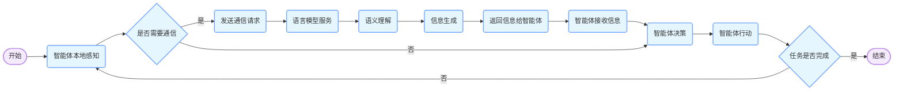

# 语言模型在多智能体协作任务中的群体智能优化研究

> 关键词：语言模型、多智能体协作、群体智能优化、强化学习、自然语言处理

> 摘要：本文聚焦于语言模型在多智能体协作任务中的群体智能优化问题。首先介绍了研究的背景、目的、预期读者以及文档结构等内容。详细阐述了语言模型、多智能体协作和群体智能优化的核心概念及其联系，给出了相应的原理和架构示意图。深入探讨了核心算法原理，通过Python代码进行详细说明，并运用数学模型和公式对算法进行解读和举例。通过项目实战展示了在多智能体协作任务中应用语言模型进行群体智能优化的具体实现过程。分析了其实际应用场景，推荐了相关的学习资源、开发工具框架以及论文著作。最后对未来发展趋势与挑战进行了总结，并给出了常见问题的解答和扩展阅读参考资料。

## 1. 背景介绍 
### 1.1 目的和范围
随着人工智能技术的不断发展，多智能体系统在许多领域得到了广泛应用，如自动驾驶、机器人协作、智能交通等。在多智能体协作任务中，如何提高群体智能，使智能体之间能够高效协作，是当前研究的热点问题。语言模型作为自然语言处理领域的重要技术，具有强大的语义理解和生成能力。本研究的目的是探索如何将语言模型应用于多智能体协作任务中，实现群体智能的优化。研究范围涵盖了语言模型的选择与应用、多智能体协作的机制设计、群体智能优化算法的研究等方面。

### 1.2 预期读者
本文的预期读者包括人工智能领域的研究人员、开发者，对多智能体系统和语言模型感兴趣的学生，以及从事相关领域应用开发的工程师。读者需要具备一定的机器学习、自然语言处理和多智能体系统的基础知识。

### 1.3 文档结构概述
本文共分为十个部分。第一部分为背景介绍，阐述了研究的目的、范围、预期读者和文档结构。第二部分介绍核心概念与联系，包括语言模型、多智能体协作和群体智能优化的原理和架构。第三部分详细讲解核心算法原理，并给出Python代码示例。第四部分运用数学模型和公式对算法进行分析，并举例说明。第五部分通过项目实战展示具体的代码实现和详细解释。第六部分分析实际应用场景。第七部分推荐相关的学习资源、开发工具框架和论文著作。第八部分总结未来发展趋势与挑战。第九部分为附录，解答常见问题。第十部分提供扩展阅读和参考资料。

### 1.4 术语表
#### 1.4.1 核心术语定义
- **语言模型**：是一种用于对自然语言进行建模的概率模型，能够预测给定上下文下下一个词出现的概率。常见的语言模型有基于统计的语言模型和基于深度学习的语言模型，如GPT、BERT等。
- **多智能体协作**：指多个智能体为了实现共同的目标，通过相互通信和协调，共同完成任务的过程。智能体可以是机器人、软件程序等。
- **群体智能优化**：是一种通过群体中个体之间的交互和协作，使整个群体的性能得到优化的方法。常见的群体智能优化算法有粒子群算法、蚁群算法等。
- **强化学习**：是一种机器学习方法，智能体通过与环境进行交互，根据环境反馈的奖励信号来学习最优的行为策略。

#### 1.4.2 相关概念解释
- **语义理解**：指计算机对自然语言文本的含义进行理解的能力，包括对词语、句子和篇章的语义分析。
- **通信协议**：是多智能体之间进行通信时遵循的规则和约定，确保信息的准确传输和理解。
- **策略梯度**：是强化学习中的一种算法，通过直接优化策略函数来最大化累积奖励。

#### 1.4.3 缩略词列表
- **GPT**：Generative Pretrained Transformer，生成式预训练变换器
- **BERT**：Bidirectional Encoder Representations from Transformers，基于变换器的双向编码器表示
- **RL**：Reinforcement Learning，强化学习
- **NLP**：Natural Language Processing，自然语言处理

## 2. 核心概念与联系 

### 核心概念原理
#### 语言模型
语言模型的核心原理是基于概率统计，通过学习大量的文本数据，估计语言中各个词序列出现的概率。以基于深度学习的语言模型为例，通常采用神经网络（如Transformer）来学习文本的特征表示。Transformer模型由多个编码器和解码器层组成，通过自注意力机制可以捕捉文本中不同位置之间的依赖关系。

#### 多智能体协作
多智能体协作的原理是智能体之间通过通信和协调，共享信息和资源，共同完成任务。智能体可以根据自身的局部信息和其他智能体的信息，做出决策并采取行动。协作的方式可以分为集中式和分布式两种，集中式协作需要一个中央控制器来协调智能体的行动，分布式协作则每个智能体自主决策。

#### 群体智能优化
群体智能优化的原理是模拟自然界中生物群体的行为，如鸟群的飞行、蚁群的觅食等。通过个体之间的交互和协作，使整个群体能够找到最优的解决方案。在多智能体协作中，群体智能优化可以用于优化智能体的协作策略，提高任务完成的效率。

### 架构的文本示意图
```plaintext
多智能体系统
|-- 智能体1
|   |-- 本地感知模块
|   |-- 决策模块
|   |-- 通信模块
|-- 智能体2
|   |-- 本地感知模块
|   |-- 决策模块
|   |-- 通信模块
|...
|-- 智能体n
|   |-- 本地感知模块
|   |-- 决策模块
|   |-- 通信模块
|
|-- 语言模型服务
|   |-- 语义理解模块
|   |-- 信息生成模块
```

### Mermaid流程图


## 3. 核心算法原理 & 具体操作步骤 

### 算法原理
在多智能体协作任务中，我们可以使用强化学习算法来优化智能体的协作策略。具体来说，我们将语言模型引入到强化学习的框架中，让智能体通过语言模型进行信息交流和协作。

智能体的状态 $s$ 包括本地感知信息和其他智能体通过语言模型传递的信息。智能体的动作 $a$ 包括物理动作和通信动作。智能体根据当前状态 $s$ 选择动作 $a$，并与环境进行交互，环境返回奖励 $r$ 和下一个状态 $s'$。智能体的目标是最大化累积奖励 $\sum_{t=0}^{T} \gamma^t r_t$，其中 $\gamma$ 是折扣因子。

我们可以使用策略梯度算法来优化智能体的策略 $\pi(a|s)$。策略梯度算法的核心思想是通过计算策略的梯度，更新策略参数 $\theta$，使得策略在当前状态下选择能够获得更高奖励的动作的概率增加。

### 具体操作步骤
1. **初始化**：初始化智能体的策略参数 $\theta$ 和语言模型的参数。
2. **智能体感知**：每个智能体通过本地感知模块获取当前的本地状态信息。
3. **通信决策**：智能体根据当前状态决定是否需要与其他智能体进行通信。如果需要通信，智能体将通信请求发送给语言模型服务。
4. **语言模型处理**：语言模型服务对通信请求进行语义理解，生成相应的信息并返回给智能体。
5. **智能体决策**：智能体根据本地状态信息和语言模型返回的信息，使用当前策略 $\pi(a|s)$ 选择动作 $a$。
6. **环境交互**：智能体执行动作 $a$，与环境进行交互，环境返回奖励 $r$ 和下一个状态 $s'$。
7. **策略更新**：根据奖励 $r$ 和状态转移，使用策略梯度算法更新智能体的策略参数 $\theta$。
8. **重复步骤2-7**，直到任务完成。

### Python源代码示例
```python
import torch
import torch.nn as nn
import torch.optim as optim
import numpy as np

# 定义智能体的策略网络
class PolicyNetwork(nn.Module):
    def __init__(self, input_dim, output_dim):
        super(PolicyNetwork, self).__init__()
        self.fc1 = nn.Linear(input_dim, 128)
        self.fc2 = nn.Linear(128, output_dim)
        self.softmax = nn.Softmax(dim=-1)

    def forward(self, x):
        x = torch.relu(self.fc1(x))
        x = self.fc2(x)
        x = self.softmax(x)
        return x

# 定义语言模型（简化示例）
class LanguageModel:
    def __init__(self):
        pass

    def process_communication(self, request):
        # 简单返回一个固定信息
        return np.array([0.1, 0.2, 0.3])

# 定义智能体类
class Agent:
    def __init__(self, input_dim, output_dim):
        self.policy_network = PolicyNetwork(input_dim, output_dim)
        self.optimizer = optim.Adam(self.policy_network.parameters(), lr=0.001)
        self.language_model = LanguageModel()

    def get_action(self, state):
        state = torch.FloatTensor(state).unsqueeze(0)
        action_probs = self.policy_network(state)
        action = torch.multinomial(action_probs, 1).item()
        return action

    def update_policy(self, states, actions, rewards):
        states = torch.FloatTensor(states)
        actions = torch.LongTensor(actions)
        rewards = torch.FloatTensor(rewards)

        action_probs = self.policy_network(states)
        log_probs = torch.log(action_probs.gather(1, actions.unsqueeze(1)).squeeze(1))
        loss = -(log_probs * rewards).mean()

        self.optimizer.zero_grad()
        loss.backward()
        self.optimizer.step()

# 模拟多智能体协作任务
def simulate_task(num_agents, num_steps):
    input_dim = 10
    output_dim = 5
    agents = [Agent(input_dim, output_dim) for _ in range(num_agents)]

    for step in range(num_steps):
        states = []
        actions = []
        rewards = []

        for agent in agents:
            # 模拟本地感知
            local_state = np.random.rand(input_dim)
            # 通信决策（简单示例，固定通信）
            need_communication = True
            if need_communication:
                communication_info = agent.language_model.process_communication(local_state)
                state = np.concatenate([local_state, communication_info])
            else:
                state = local_state
            states.append(state)

            action = agent.get_action(state)
            actions.append(action)

            # 模拟环境返回奖励
            reward = np.random.rand()
            rewards.append(reward)

        # 更新策略
        for agent in agents:
            agent.update_policy(states, actions, rewards)

    return agents

# 运行模拟
num_agents = 3
num_steps = 100
agents = simulate_task(num_agents, num_steps)
```

## 4. 数学模型和公式 & 详细讲解 & 举例说明 

### 数学模型
#### 状态空间
智能体的状态 $s$ 可以表示为 $s = [s_{local}, s_{comm}]$，其中 $s_{local}$ 是本地感知信息，$s_{comm}$ 是通过语言模型从其他智能体获取的通信信息。

#### 策略函数
智能体的策略函数 $\pi(a|s)$ 表示在状态 $s$ 下选择动作 $a$ 的概率。策略函数可以通过神经网络来近似，即 $\pi(a|s; \theta)$，其中 $\theta$ 是神经网络的参数。

#### 目标函数
智能体的目标是最大化累积奖励 $\sum_{t=0}^{T} \gamma^t r_t$，其中 $\gamma$ 是折扣因子，$r_t$ 是在时间步 $t$ 获得的奖励。策略梯度算法通过最大化目标函数 $J(\theta) = \mathbb{E}_{\tau \sim \pi(\tau; \theta)} [\sum_{t=0}^{T} \gamma^t r_t]$ 来更新策略参数 $\theta$，其中 $\tau$ 是一个轨迹，包含了状态、动作和奖励序列。

#### 策略梯度公式
策略梯度公式为 $\nabla_{\theta} J(\theta) = \mathbb{E}_{\tau \sim \pi(\tau; \theta)} [\sum_{t=0}^{T} \nabla_{\theta} \log \pi(a_t|s_t; \theta) \sum_{k=t}^{T} \gamma^{k-t} r_k]$。在实际实现中，我们可以使用蒙特卡罗方法来估计策略梯度，即 $\nabla_{\theta} J(\theta) \approx \frac{1}{N} \sum_{i=1}^{N} \sum_{t=0}^{T} \nabla_{\theta} \log \pi(a_{i,t}|s_{i,t}; \theta) \sum_{k=t}^{T} \gamma^{k-t} r_{i,k}$，其中 $N$ 是轨迹的数量。

### 详细讲解
- **状态空间**：智能体的状态包含了本地感知信息和通信信息，这样智能体可以根据全局信息做出更合理的决策。
- **策略函数**：通过神经网络来近似策略函数，使得智能体可以根据状态灵活地选择动作。
- **目标函数**：最大化累积奖励是强化学习的核心目标，折扣因子 $\gamma$ 用于平衡短期奖励和长期奖励。
- **策略梯度公式**：策略梯度算法通过计算策略的梯度，更新策略参数，使得策略在当前状态下选择能够获得更高奖励的动作的概率增加。

### 举例说明
假设我们有一个多智能体协作的搜索任务，智能体需要在一个二维地图上搜索目标。每个智能体的本地感知信息包括自己的位置和周围的障碍物信息。当智能体需要与其他智能体协作时，它可以通过语言模型发送自己的位置和搜索情况，并接收其他智能体的信息。

智能体的策略函数 $\pi(a|s)$ 可以根据当前状态 $s$ 选择不同的动作，如向前移动、向左移动、向右移动等。目标函数是最大化搜索到目标的奖励，策略梯度算法通过不断更新策略参数 $\theta$，使得智能体能够更快地找到目标。

## 5. 项目实战：代码实际案例和详细解释说明 

### 5.1  开发环境搭建
#### 安装Python
首先需要安装Python，建议使用Python 3.7及以上版本。可以从Python官方网站（https://www.python.org/downloads/） 下载并安装。

#### 安装必要的库
使用以下命令安装必要的库：
```bash
pip install torch numpy
```
`torch` 是PyTorch深度学习框架，用于构建和训练神经网络。`numpy` 是Python的数值计算库，用于处理数组和矩阵运算。

### 5.2  源代码详细实现和代码解读
```python
import torch
import torch.nn as nn
import torch.optim as optim
import numpy as np

# 定义智能体的策略网络
class PolicyNetwork(nn.Module):
    def __init__(self, input_dim, output_dim):
        super(PolicyNetwork, self).__init__()
        self.fc1 = nn.Linear(input_dim, 128)
        self.fc2 = nn.Linear(128, output_dim)
        self.softmax = nn.Softmax(dim=-1)

    def forward(self, x):
        x = torch.relu(self.fc1(x))
        x = self.fc2(x)
        x = self.softmax(x)
        return x

# 定义语言模型（简化示例）
class LanguageModel:
    def __init__(self):
        pass

    def process_communication(self, request):
        # 简单返回一个固定信息
        return np.array([0.1, 0.2, 0.3])

# 定义智能体类
class Agent:
    def __init__(self, input_dim, output_dim):
        self.policy_network = PolicyNetwork(input_dim, output_dim)
        self.optimizer = optim.Adam(self.policy_network.parameters(), lr=0.001)
        self.language_model = LanguageModel()

    def get_action(self, state):
        state = torch.FloatTensor(state).unsqueeze(0)
        action_probs = self.policy_network(state)
        action = torch.multinomial(action_probs, 1).item()
        return action

    def update_policy(self, states, actions, rewards):
        states = torch.FloatTensor(states)
        actions = torch.LongTensor(actions)
        rewards = torch.FloatTensor(rewards)

        action_probs = self.policy_network(states)
        log_probs = torch.log(action_probs.gather(1, actions.unsqueeze(1)).squeeze(1))
        loss = -(log_probs * rewards).mean()

        self.optimizer.zero_grad()
        loss.backward()
        self.optimizer.step()

# 模拟多智能体协作任务
def simulate_task(num_agents, num_steps):
    input_dim = 10
    output_dim = 5
    agents = [Agent(input_dim, output_dim) for _ in range(num_agents)]

    for step in range(num_steps):
        states = []
        actions = []
        rewards = []

        for agent in agents:
            # 模拟本地感知
            local_state = np.random.rand(input_dim)
            # 通信决策（简单示例，固定通信）
            need_communication = True
            if need_communication:
                communication_info = agent.language_model.process_communication(local_state)
                state = np.concatenate([local_state, communication_info])
            else:
                state = local_state
            states.append(state)

            action = agent.get_action(state)
            actions.append(action)

            # 模拟环境返回奖励
            reward = np.random.rand()
            rewards.append(reward)

        # 更新策略
        for agent in agents:
            agent.update_policy(states, actions, rewards)

    return agents

# 运行模拟
num_agents = 3
num_steps = 100
agents = simulate_task(num_agents, num_steps)
```

### 代码解读与分析
#### 策略网络 `PolicyNetwork`
- `__init__` 方法：初始化策略网络的结构，包括一个全连接层 `fc1` 和一个输出层 `fc2`，并使用 `Softmax` 函数将输出转换为概率分布。
- `forward` 方法：定义了前向传播过程，输入状态经过 `fc1` 层和 `ReLU` 激活函数，再经过 `fc2` 层和 `Softmax` 函数，输出动作的概率分布。

#### 语言模型 `LanguageModel`
- `__init__` 方法：初始化语言模型，这里只是一个简单的占位。
- `process_communication` 方法：处理通信请求，返回一个固定的信息。在实际应用中，这里可以使用真实的语言模型进行语义理解和信息生成。

#### 智能体类 `Agent`
- `__init__` 方法：初始化智能体的策略网络、优化器和语言模型。
- `get_action` 方法：根据当前状态选择动作，通过策略网络计算动作的概率分布，然后使用 `multinomial` 函数进行采样。
- `update_policy` 方法：根据状态、动作和奖励更新策略网络的参数，使用策略梯度算法计算损失并进行反向传播。

#### 模拟多智能体协作任务 `simulate_task`
- 初始化多个智能体。
- 在每个时间步，每个智能体进行本地感知，根据通信决策决定是否与其他智能体通信，选择动作并与环境交互，获取奖励。
- 所有智能体更新策略网络的参数。

通过这个示例，我们可以看到如何将语言模型引入到多智能体协作任务中，并使用强化学习算法优化智能体的协作策略。

## 6. 实际应用场景 
### 自动驾驶
在自动驾驶领域，多辆自动驾驶汽车可以作为智能体进行协作。每辆车通过本地传感器感知周围环境，同时可以通过语言模型与其他车辆进行通信，分享交通信息、行驶意图等。例如，当一辆车遇到前方道路拥堵时，它可以通过语言模型向周围车辆发送信息，其他车辆可以根据这些信息调整自己的行驶路线，从而实现交通流量的优化。

### 机器人协作
在工业生产和物流领域，多个机器人可以协作完成复杂的任务。每个机器人可以通过本地传感器感知工作环境和任务状态，通过语言模型与其他机器人进行协作。例如，在仓库中，多个机器人可以协作完成货物的搬运和存储任务。一个机器人发现某个区域的货物需要搬运时，它可以通过语言模型向其他机器人发送请求，其他机器人根据请求和自身状态进行响应，共同完成任务。

### 智能交通系统
智能交通系统中，交通信号灯、车辆和交通管理中心可以作为智能体进行协作。交通信号灯可以根据实时交通流量信息调整信号灯的时长，车辆可以通过语言模型与交通信号灯和交通管理中心进行通信，获取交通信息和导航建议。交通管理中心可以通过收集和分析各个智能体的信息，对整个交通系统进行优化和管理。

### 游戏领域
在多人在线游戏中，玩家可以作为智能体进行协作。每个玩家可以通过本地操作和观察获取游戏信息，通过语言模型与其他玩家进行交流和协作。例如，在团队竞技游戏中，玩家可以通过语音或文字聊天（可以使用语言模型进行处理）来制定战术、分配任务，提高团队的战斗力。

## 7. 工具和资源推荐
### 7.1 学习资源推荐
#### 7.1.1 书籍推荐
- 《人工智能：一种现代的方法》（Artificial Intelligence: A Modern Approach）：这是一本经典的人工智能教材，涵盖了人工智能的各个领域，包括多智能体系统和自然语言处理。
- 《深度学习》（Deep Learning）：由Ian Goodfellow、Yoshua Bengio和Aaron Courville撰写，详细介绍了深度学习的基本原理和方法，对理解语言模型和强化学习有很大帮助。
- 《强化学习：原理与Python实现》：这本书详细介绍了强化学习的基本概念、算法和应用，通过Python代码示例帮助读者理解和实现强化学习算法。

#### 7.1.2 在线课程
- Coursera上的“人工智能基础”（Foundations of Artificial Intelligence）课程：由哥伦比亚大学教授讲授，涵盖了人工智能的基本概念和方法，包括多智能体系统和自然语言处理。
- edX上的“深度学习微硕士”（Deep Learning MicroMasters）课程：由多个知名大学的教授联合授课，深入介绍了深度学习的理论和实践，对学习语言模型有很大帮助。
- OpenAI Gym官方文档和教程：OpenAI Gym是一个用于开发和比较强化学习算法的工具包，官方文档和教程提供了丰富的示例和讲解，帮助读者学习强化学习算法的实现。

#### 7.1.3 技术博客和网站
- Medium上的人工智能和机器学习相关博客：Medium上有很多人工智能和机器学习领域的优秀博客，作者们分享了最新的研究成果、技术应用和实践经验。
- arXiv.org：一个预印本服务器，提供了大量的人工智能和机器学习领域的研究论文，读者可以及时了解最新的研究动态。
- Hugging Face博客：Hugging Face是一家专注于自然语言处理的公司，其博客上分享了很多关于语言模型的技术文章和应用案例。

### 7.2 开发工具框架推荐
#### 7.2.1 IDE和编辑器
- PyCharm：是一款专门为Python开发设计的集成开发环境（IDE），提供了丰富的代码编辑、调试和项目管理功能，适合开发多智能体协作和语言模型相关的项目。
- Jupyter Notebook：是一个交互式的开发环境，支持Python代码的编写、运行和可视化，适合进行算法实验和数据分析。
- Visual Studio Code：是一款轻量级的代码编辑器，支持多种编程语言和插件，通过安装Python插件可以方便地进行Python开发。

#### 7.2.2 调试和性能分析工具
- PyTorch Profiler：是PyTorch框架自带的性能分析工具，可以帮助开发者分析模型的运行时间、内存使用等情况，优化模型性能。
- TensorBoard：是TensorFlow框架的可视化工具，也可以与PyTorch结合使用，用于可视化训练过程中的损失曲线、指标变化等信息。
- cProfile：是Python标准库中的性能分析工具，可以帮助开发者分析代码的运行时间和函数调用情况，找出性能瓶颈。

#### 7.2.3 相关框架和库
- PyTorch：是一个开源的深度学习框架，提供了丰富的神经网络模块和优化算法，适合构建和训练语言模型和强化学习算法。
- Hugging Face Transformers：是一个用于自然语言处理的开源库，提供了多种预训练的语言模型，如GPT、BERT等，方便开发者进行语言模型的应用开发。
- OpenAI Gym：是一个用于开发和比较强化学习算法的工具包，提供了多种环境和评估指标，帮助开发者快速实现和测试强化学习算法。

### 7.3 相关论文著作推荐
#### 7.3.1 经典论文
- “Attention Is All You Need”：介绍了Transformer模型，是现代语言模型的基础。
- “Deep Q-Networks”：提出了深度Q网络（DQN）算法，是强化学习领域的经典算法之一。
- “Multi-Agent Reinforcement Learning: A Selective Overview of Theories and Algorithms”：对多智能体强化学习的理论和算法进行了综述。

#### 7.3.2 最新研究成果
- 在NeurIPS、ICML、ACL等顶级学术会议上发表的关于语言模型和多智能体协作的研究论文，反映了该领域的最新研究动态和技术进展。
- arXiv.org上的预印本论文，很多研究团队会在上面发布最新的研究成果。

#### 7.3.3 应用案例分析
- 一些企业和研究机构发布的关于语言模型在多智能体协作任务中的应用案例分析报告，如谷歌、微软等公司的技术博客和研究报告。

## 8. 总结：未来发展趋势与挑战
### 未来发展趋势
#### 更强大的语言模型
随着深度学习技术的不断发展，语言模型的性能将不断提高。未来的语言模型将具有更强的语义理解和生成能力，能够更好地处理复杂的自然语言任务，为多智能体协作提供更准确和丰富的信息。

#### 深度融合的多智能体协作
语言模型将与多智能体系统深度融合，智能体之间的协作将更加高效和灵活。智能体可以通过语言模型进行更复杂的通信和协调，实现更高级的协作策略，解决更复杂的任务。

#### 跨领域应用拓展
语言模型在多智能体协作任务中的应用将拓展到更多领域，如医疗、金融、教育等。在医疗领域，多个医疗机器人可以通过语言模型协作完成手术等复杂任务；在金融领域，多个智能投资顾问可以通过语言模型进行信息共享和决策协作。

### 挑战
#### 计算资源需求
强大的语言模型需要大量的计算资源进行训练和推理，这对硬件设备和计算成本提出了很高的要求。如何在有限的计算资源下实现高效的语言模型应用是一个挑战。

#### 通信效率和可靠性
在多智能体协作中，智能体之间的通信效率和可靠性至关重要。语言模型的处理和通信可能会引入延迟，影响智能体的协作效率。同时，通信过程中可能会出现信息丢失或错误，需要设计可靠的通信协议和错误处理机制。

#### 伦理和安全问题
语言模型在多智能体协作中的应用可能会带来伦理和安全问题。例如，智能体可能会根据语言模型生成的错误信息做出错误的决策，导致安全事故。此外，语言模型可能会生成虚假信息或偏见信息，影响社会公平和稳定。需要建立相应的伦理和安全规范，确保语言模型在多智能体协作中的安全和可靠应用。

## 9. 附录：常见问题与解答
### 问题1：语言模型在多智能体协作中起到什么作用？
语言模型在多智能体协作中起到信息交流和协作的作用。智能体可以通过语言模型进行语义理解和信息生成，将本地信息传达给其他智能体，并理解其他智能体传达的信息。这样，智能体可以根据全局信息做出更合理的决策，提高协作效率。

### 问题2：如何选择适合的语言模型用于多智能体协作任务？
选择适合的语言模型需要考虑以下因素：
- 任务需求：根据具体的多智能体协作任务，选择具有相应能力的语言模型。例如，如果任务涉及到复杂的语义理解和生成，选择预训练的大型语言模型如GPT、BERT等。
- 计算资源：大型语言模型需要大量的计算资源进行训练和推理，如果计算资源有限，可以选择小型的语言模型或进行模型压缩。
- 数据可用性：如果有大量的特定领域数据，可以选择在这些数据上进行微调的语言模型，以提高模型在该领域的性能。

### 问题3：多智能体协作中的通信协议如何设计？
多智能体协作中的通信协议设计需要考虑以下几个方面：
- 信息格式：定义智能体之间通信的信息格式，确保信息的准确传输和理解。例如，可以使用JSON、XML等格式。
- 通信频率：根据任务的需求和智能体的状态，确定合理的通信频率。过于频繁的通信会增加通信开销，而过少的通信可能会导致信息不及时，影响协作效率。
- 错误处理：设计错误处理机制，当通信过程中出现信息丢失或错误时，能够及时进行重传或纠错。

### 问题4：如何评估语言模型在多智能体协作中的性能？
可以从以下几个方面评估语言模型在多智能体协作中的性能：
- 任务完成率：评估多智能体协作任务的完成情况，任务完成率越高，说明语言模型的应用效果越好。
- 协作效率：衡量智能体之间的协作效率，如完成任务的时间、资源利用率等。
- 信息准确性：评估语言模型生成的信息的准确性和可靠性，信息准确性越高，智能体能够做出更合理的决策。

## 10. 扩展阅读 & 参考资料
### 扩展阅读
- 《多智能体系统导论》（An Introduction to MultiAgent Systems）：深入介绍了多智能体系统的理论和方法。
- 《自然语言处理入门》：对自然语言处理的基本概念和技术进行了详细介绍。
- 《群体智能算法原理与应用》：介绍了群体智能算法的原理和应用，对理解群体智能优化有很大帮助。

### 参考资料
- 论文：“Attention Is All You Need”，作者：Ashish Vaswani等。
- 书籍：《人工智能：一种现代的方法》，作者：Stuart Russell和Peter Norvig。
- 网站：Hugging Face官方网站（https://huggingface.co/）、OpenAI官方网站（https://openai.com/）。

作者：AI天才研究院/AI Genius Institute & 禅与计算机程序设计艺术 /Zen And The Art of Computer Programming