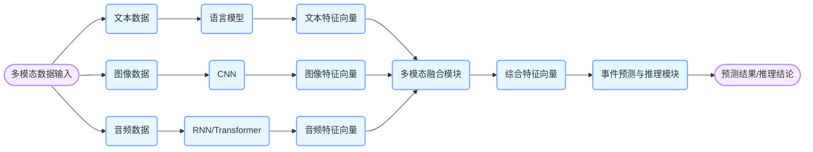

# 语言模型在多模态事件预测与推理中的创新

> 关键词：语言模型、多模态、事件预测、事件推理、创新应用

> 摘要：本文聚焦于语言模型在多模态事件预测与推理领域的创新应用。首先介绍了相关背景，包括研究目的、预期读者、文档结构和术语定义。接着阐述了核心概念，如多模态数据、事件预测与推理以及语言模型的作用和联系，并给出了原理和架构的文本示意图与 Mermaid 流程图。详细讲解了核心算法原理，通过 Python 代码进行了说明，同时介绍了相关的数学模型和公式，并举例分析。在项目实战部分，搭建了开发环境，给出了源代码实现与解读。探讨了语言模型在多模态事件预测与推理中的实际应用场景，推荐了学习资源、开发工具框架和相关论文著作。最后总结了未来发展趋势与挑战，解答了常见问题，并提供了扩展阅读和参考资料。

## 1. 背景介绍 
### 1.1 目的和范围
在当今数字化时代，数据呈现出多模态的特点，包括文本、图像、音频、视频等多种形式。多模态事件预测与推理旨在从这些丰富的多模态数据中挖掘信息，预测未来可能发生的事件，并进行合理的推理。语言模型作为自然语言处理领域的重要工具，在处理文本信息方面具有强大的能力。本研究的目的是探讨语言模型在多模态事件预测与推理中的创新应用，研究范围涵盖了语言模型与多模态数据的融合方法、核心算法、数学模型以及实际应用场景等方面。

### 1.2 预期读者
本文预期读者包括人工智能领域的研究人员、开发者、数据科学家，以及对多模态数据处理和语言模型应用感兴趣的学生和专业人士。对于希望深入了解语言模型在多模态事件预测与推理中创新应用的人群，本文将提供有价值的技术知识和实践经验。

### 1.3 文档结构概述
本文将按照以下结构进行组织：首先介绍相关背景知识，包括目的、读者和术语；接着阐述核心概念及其联系，通过文本示意图和 Mermaid 流程图展示原理和架构；详细讲解核心算法原理，并使用 Python 代码进行说明；介绍相关的数学模型和公式，并举例分析；进行项目实战，包括开发环境搭建、源代码实现与解读；探讨实际应用场景；推荐学习资源、开发工具框架和相关论文著作；总结未来发展趋势与挑战；解答常见问题；最后提供扩展阅读和参考资料。

### 1.4 术语表
#### 1.4.1 核心术语定义
- **语言模型**：是一种对自然语言进行建模的统计模型，用于预测下一个可能出现的单词或字符的概率分布。常见的语言模型有基于规则的语言模型、统计语言模型和深度学习语言模型（如 Transformer 架构的模型）。
- **多模态数据**：指包含多种不同类型数据的集合，如文本、图像、音频、视频等。这些数据模态具有不同的特征和表示方式，但它们之间可能存在一定的关联和互补性。
- **事件预测**：根据历史数据和当前状态，对未来可能发生的事件进行预测。在多模态环境下，需要综合考虑多种模态的数据信息来提高预测的准确性。
- **事件推理**：基于已知的事件信息和相关知识，通过逻辑推理和分析得出新的结论或预测未知事件的过程。在多模态事件推理中，语言模型可以结合其他模态的数据进行推理。

#### 1.4.2 相关概念解释
- **多模态融合**：将不同模态的数据进行整合和处理，以充分利用各模态数据的优势，提高系统的性能和准确性。常见的融合方法有早期融合、晚期融合和中间融合等。
- **注意力机制**：是一种在深度学习中广泛应用的机制，用于模拟人类的注意力分配。在多模态处理中，注意力机制可以帮助模型聚焦于不同模态数据中的重要部分，提高模型的表达能力。

#### 1.4.3 缩略词列表
- **NLP**：Natural Language Processing，自然语言处理
- **CNN**：Convolutional Neural Network，卷积神经网络
- **RNN**：Recurrent Neural Network，循环神经网络
- **Transformer**：一种基于注意力机制的深度学习架构，常用于自然语言处理任务
- **BERT**：Bidirectional Encoder Representations from Transformers，一种预训练的语言模型

## 2. 核心概念与联系 
### 核心概念原理
在多模态事件预测与推理中，语言模型起着关键的作用。语言模型可以处理文本信息，提取文本中的语义特征和上下文信息。多模态数据中的文本部分可以直接输入到语言模型中进行处理，同时，语言模型还可以与其他模态的数据处理模块进行融合，实现多模态信息的综合利用。

多模态数据的处理通常需要将不同模态的数据进行特征提取和表示，然后将这些特征进行融合。例如，图像数据可以使用卷积神经网络（CNN）进行特征提取，音频数据可以使用循环神经网络（RNN）或 Transformer 进行处理。语言模型则负责处理文本数据，将文本转换为向量表示。通过多模态融合技术，可以将不同模态的特征向量进行拼接、加权求和等操作，得到综合的特征表示，用于事件预测和推理。

### 架构的文本示意图
```plaintext
多模态数据输入
|-- 文本数据 --> 语言模型 --> 文本特征向量
|-- 图像数据 --> CNN --> 图像特征向量
|-- 音频数据 --> RNN/Transformer --> 音频特征向量
|
└--> 多模态融合模块 --> 综合特征向量 --> 事件预测与推理模块 --> 预测结果/推理结论
```

### Mermaid 流程图


## 3. 核心算法原理 & 具体操作步骤 
### 核心算法原理
在多模态事件预测与推理中，常用的算法包括基于深度学习的模型，如 Transformer 架构的语言模型和卷积神经网络（CNN）等。下面以基于 Transformer 的多模态融合模型为例，介绍核心算法原理。

Transformer 模型主要由编码器和解码器组成，编码器负责对输入的序列进行编码，解码器负责生成输出序列。在多模态融合中，我们可以将不同模态的数据分别进行编码，然后将编码后的特征进行融合。

具体来说，对于文本数据，我们可以使用预训练的语言模型（如 BERT）进行编码，得到文本特征向量。对于图像数据，我们可以使用 CNN 提取图像特征。然后，将文本特征向量和图像特征向量进行拼接，输入到一个全连接层进行融合。最后，将融合后的特征输入到事件预测与推理模块进行预测和推理。

### 具体操作步骤
1. **数据预处理**：对多模态数据进行清洗、标注和特征提取。对于文本数据，进行分词、去除停用词等操作；对于图像数据，进行图像缩放、归一化等操作。
2. **特征提取**：使用预训练的语言模型对文本数据进行编码，得到文本特征向量；使用 CNN 对图像数据进行特征提取，得到图像特征向量。
3. **多模态融合**：将文本特征向量和图像特征向量进行拼接，输入到一个全连接层进行融合，得到综合特征向量。
4. **事件预测与推理**：将综合特征向量输入到事件预测与推理模块，使用分类器或回归器进行预测和推理。

### Python 代码实现
```python
import torch
import torch.nn as nn
from transformers import BertModel

# 定义文本编码器
class TextEncoder(nn.Module):
    def __init__(self):
        super(TextEncoder, self).__init__()
        self.bert = BertModel.from_pretrained('bert-base-uncased')

    def forward(self, input_ids, attention_mask):
        outputs = self.bert(input_ids=input_ids, attention_mask=attention_mask)
        pooled_output = outputs.pooler_output
        return pooled_output

# 定义图像编码器
class ImageEncoder(nn.Module):
    def __init__(self):
        super(ImageEncoder, self).__init__()
        self.cnn = nn.Sequential(
            nn.Conv2d(3, 64, kernel_size=3, padding=1),
            nn.ReLU(),
            nn.MaxPool2d(2),
            nn.Conv2d(64, 128, kernel_size=3, padding=1),
            nn.ReLU(),
            nn.MaxPool2d(2),
            nn.Flatten(),
            nn.Linear(128 * 56 * 56, 256)
        )

    def forward(self, images):
        features = self.cnn(images)
        return features

# 定义多模态融合模型
class MultiModalModel(nn.Module):
    def __init__(self):
        super(MultiModalModel, self).__init__()
        self.text_encoder = TextEncoder()
        self.image_encoder = ImageEncoder()
        self.fc = nn.Linear(768 + 256, 128)
        self.classifier = nn.Linear(128, 2)

    def forward(self, input_ids, attention_mask, images):
        text_features = self.text_encoder(input_ids, attention_mask)
        image_features = self.image_encoder(images)
        combined_features = torch.cat((text_features, image_features), dim=1)
        fused_features = self.fc(combined_features)
        logits = self.classifier(fused_features)
        return logits


# 示例使用
input_ids = torch.randint(0, 1000, (4, 128))
attention_mask = torch.ones((4, 128), dtype=torch.long)
images = torch.randn(4, 3, 224, 224)

model = MultiModalModel()
output = model(input_ids, attention_mask, images)
print(output.shape)
```

## 4. 数学模型和公式 & 详细讲解 & 举例说明 
### 数学模型和公式
#### 文本编码
假设输入的文本序列为 $x = [x_1, x_2, \cdots, x_n]$，其中 $x_i$ 表示第 $i$ 个单词的词向量。使用预训练的语言模型（如 BERT）进行编码，得到文本特征向量 $h_{text}$：

$$h_{text} = \text{BERT}(x)$$

#### 图像编码
假设输入的图像为 $I$，使用卷积神经网络（CNN）进行特征提取，得到图像特征向量 $h_{image}$：

$$h_{image} = \text{CNN}(I)$$

#### 多模态融合
将文本特征向量 $h_{text}$ 和图像特征向量 $h_{image}$ 进行拼接，得到拼接后的特征向量 $h_{concat}$：

$$h_{concat} = [h_{text}; h_{image}]$$

然后，将拼接后的特征向量输入到一个全连接层进行融合，得到融合后的特征向量 $h_{fused}$：

$$h_{fused} = \text{ReLU}(W_{fused}h_{concat} + b_{fused})$$

其中 $W_{fused}$ 是全连接层的权重矩阵，$b_{fused}$ 是偏置向量。

#### 事件预测与推理
将融合后的特征向量 $h_{fused}$ 输入到分类器或回归器进行预测和推理。假设使用一个线性分类器，得到预测结果 $y$：

$$y = \text{softmax}(W_{cls}h_{fused} + b_{cls})$$

其中 $W_{cls}$ 是分类器的权重矩阵，$b_{cls}$ 是偏置向量。

### 详细讲解
- **文本编码**：预训练的语言模型（如 BERT）通过多层的 Transformer 编码器对输入的文本序列进行编码，能够捕捉文本中的语义信息和上下文信息。最终得到的文本特征向量 $h_{text}$ 是一个固定长度的向量，代表了整个文本序列的语义表示。
- **图像编码**：卷积神经网络（CNN）通过卷积层、池化层等操作对输入的图像进行特征提取，能够提取图像中的局部特征和全局特征。最终得到的图像特征向量 $h_{image}$ 是一个固定长度的向量，代表了图像的特征表示。
- **多模态融合**：将文本特征向量和图像特征向量进行拼接，然后通过一个全连接层进行融合，能够将不同模态的信息进行整合。使用 ReLU 激活函数可以增加模型的非线性表达能力。
- **事件预测与推理**：使用线性分类器对融合后的特征向量进行分类，通过 softmax 函数将输出转换为概率分布，得到预测结果。

### 举例说明
假设我们要进行一个电影评论的情感分析任务，同时考虑评论的文本内容和电影海报的图像信息。

- **文本编码**：输入的评论文本为 “This movie is really amazing!”，将其分词后输入到 BERT 模型中，得到文本特征向量 $h_{text}$。
- **图像编码**：输入的电影海报图像为一张彩色图像，将其输入到 CNN 模型中，得到图像特征向量 $h_{image}$。
- **多模态融合**：将 $h_{text}$ 和 $h_{image}$ 进行拼接，然后通过全连接层进行融合，得到融合后的特征向量 $h_{fused}$。
- **事件预测与推理**：将 $h_{fused}$ 输入到线性分类器中，通过 softmax 函数得到预测结果，如预测该评论的情感为积极。

## 5. 项目实战：代码实际案例和详细解释说明 
### 5.1  开发环境搭建
#### 操作系统
可以选择 Linux（如 Ubuntu）、Windows 或 macOS 作为开发操作系统。

#### Python 环境
建议使用 Python 3.7 及以上版本。可以使用 Anaconda 来管理 Python 环境，创建一个新的虚拟环境：

```bash
conda create -n multimodal python=3.8
conda activate multimodal
```

#### 安装依赖库
安装必要的深度学习库和工具包：

```bash
pip install torch torchvision transformers numpy pandas matplotlib
```

### 5.2  源代码详细实现和代码解读
```python
import torch
import torch.nn as nn
from transformers import BertModel
import torch.optim as optim
from torch.utils.data import Dataset, DataLoader
import pandas as pd
import numpy as np
from PIL import Image
import os

# 定义数据集类
class MultiModalDataset(Dataset):
    def __init__(self, csv_file, image_dir):
        self.data = pd.read_csv(csv_file)
        self.image_dir = image_dir

    def __len__(self):
        return len(self.data)

    def __getitem__(self, idx):
        text = self.data.iloc[idx]['text']
        image_path = os.path.join(self.image_dir, self.data.iloc[idx]['image'])
        label = self.data.iloc[idx]['label']

        # 处理文本数据
        input_ids = torch.tensor([int(x) for x in text.split()])
        attention_mask = torch.ones_like(input_ids)

        # 处理图像数据
        image = Image.open(image_path).convert('RGB')
        image = np.array(image).astype(np.float32) / 255.0
        image = torch.tensor(image).permute(2, 0, 1)

        return input_ids, attention_mask, image, label


# 定义文本编码器
class TextEncoder(nn.Module):
    def __init__(self):
        super(TextEncoder, self).__init__()
        self.bert = BertModel.from_pretrained('bert-base-uncased')

    def forward(self, input_ids, attention_mask):
        outputs = self.bert(input_ids=input_ids, attention_mask=attention_mask)
        pooled_output = outputs.pooler_output
        return pooled_output


# 定义图像编码器
class ImageEncoder(nn.Module):
    def __init__(self):
        super(ImageEncoder, self).__init__()
        self.cnn = nn.Sequential(
            nn.Conv2d(3, 64, kernel_size=3, padding=1),
            nn.ReLU(),
            nn.MaxPool2d(2),
            nn.Conv2d(64, 128, kernel_size=3, padding=1),
            nn.ReLU(),
            nn.MaxPool2d(2),
            nn.Flatten(),
            nn.Linear(128 * 56 * 56, 256)
        )

    def forward(self, images):
        features = self.cnn(images)
        return features


# 定义多模态融合模型
class MultiModalModel(nn.Module):
    def __init__(self):
        super(MultiModalModel, self).__init__()
        self.text_encoder = TextEncoder()
        self.image_encoder = ImageEncoder()
        self.fc = nn.Linear(768 + 256, 128)
        self.classifier = nn.Linear(128, 2)

    def forward(self, input_ids, attention_mask, images):
        text_features = self.text_encoder(input_ids, attention_mask)
        image_features = self.image_encoder(images)
        combined_features = torch.cat((text_features, image_features), dim=1)
        fused_features = self.fc(combined_features)
        logits = self.classifier(fused_features)
        return logits


# 训练模型
def train_model(model, train_loader, criterion, optimizer, device, epochs):
    model.train()
    for epoch in range(epochs):
        running_loss = 0.0
        for input_ids, attention_mask, images, labels in train_loader:
            input_ids = input_ids.to(device)
            attention_mask = attention_mask.to(device)
            images = images.to(device)
            labels = labels.to(device)

            optimizer.zero_grad()
            outputs = model(input_ids, attention_mask, images)
            loss = criterion(outputs, labels)
            loss.backward()
            optimizer.step()

            running_loss += loss.item()

        print(f'Epoch {epoch + 1}/{epochs}, Loss: {running_loss / len(train_loader)}')


# 主函数
if __name__ == '__main__':
    # 数据集路径
    csv_file = 'data.csv'
    image_dir = 'images'

    # 数据集和数据加载器
    dataset = MultiModalDataset(csv_file, image_dir)
    train_loader = DataLoader(dataset, batch_size=4, shuffle=True)

    # 模型、损失函数和优化器
    device = torch.device('cuda' if torch.cuda.is_available() else 'cpu')
    model = MultiModalModel().to(device)
    criterion = nn.CrossEntropyLoss()
    optimizer = optim.Adam(model.parameters(), lr=0.001)

    # 训练模型
    epochs = 10
    train_model(model, train_loader, criterion, optimizer, device, epochs)
```

### 5.3  代码解读与分析
#### 数据集类 `MultiModalDataset`
该类继承自 `torch.utils.data.Dataset`，用于加载多模态数据集。在 `__init__` 方法中，读取 CSV 文件和图像目录。在 `__getitem__` 方法中，根据索引获取文本、图像和标签，并进行相应的处理。

#### 文本编码器 `TextEncoder`
使用预训练的 BERT 模型对文本进行编码，返回文本特征向量。

#### 图像编码器 `ImageEncoder`
使用卷积神经网络（CNN）对图像进行特征提取，返回图像特征向量。

#### 多模态融合模型 `MultiModalModel`
将文本编码器和图像编码器的输出进行拼接，然后通过全连接层进行融合，最后使用线性分类器进行分类。

#### 训练函数 `train_model`
定义了模型的训练过程，包括前向传播、计算损失、反向传播和参数更新。

#### 主函数
创建数据集和数据加载器，初始化模型、损失函数和优化器，调用训练函数进行模型训练。

## 6. 实际应用场景 
### 智能安防
在智能安防领域，语言模型可以结合视频监控、门禁系统等多模态数据进行事件预测与推理。例如，通过分析监控视频中的图像和音频信息，以及门禁系统的刷卡记录和文本报警信息，预测可能发生的安全事件，如非法入侵、盗窃等。语言模型可以对报警信息进行语义理解，结合图像和音频特征进行推理，提高安防系统的预警能力。

### 医疗诊断
在医疗诊断中，多模态数据包括病历文本、医学影像（如 X 光、CT 等）和生命体征数据等。语言模型可以处理病历文本中的症状描述、诊断结果等信息，结合医学影像的特征，辅助医生进行疾病诊断和预测。例如，通过分析病历文本和 CT 图像，预测患者是否患有某种疾病，以及疾病的严重程度。

### 智能交通
在智能交通领域，多模态数据包括交通摄像头的图像、车辆传感器的数据和交通广播的文本信息等。语言模型可以对交通广播的文本信息进行分析，结合图像和传感器数据，预测交通拥堵情况、交通事故等事件。例如，通过分析交通广播中关于道路施工的信息，结合摄像头图像和车辆速度数据，预测该路段的交通拥堵程度。

### 电商推荐
在电商推荐系统中，多模态数据包括商品的文本描述、图片和用户的评论等。语言模型可以处理商品的文本描述和用户评论，提取商品的特征和用户的偏好信息，结合商品图片的视觉特征，为用户提供个性化的商品推荐。例如，通过分析用户评论中的情感倾向和商品的文本描述，结合商品图片的吸引力，推荐符合用户需求的商品。

## 7. 工具和资源推荐
### 7.1 学习资源推荐
#### 7.1.1 书籍推荐
- 《深度学习》（Deep Learning）：由 Ian Goodfellow、Yoshua Bengio 和 Aaron Courville 所著，是深度学习领域的经典教材，涵盖了深度学习的基本原理、算法和应用。
- 《自然语言处理入门》：由何晗所著，适合初学者入门自然语言处理领域，介绍了自然语言处理的基本概念、算法和工具。
- 《计算机视觉：算法与应用》（Computer Vision: Algorithms and Applications）：由 Richard Szeliski 所著，全面介绍了计算机视觉的算法和应用，包括图像特征提取、目标检测、图像分割等。

#### 7.1.2 在线课程
- Coursera 上的 “Deep Learning Specialization”：由 Andrew Ng 教授主讲，是深度学习领域的经典在线课程，涵盖了神经网络、卷积神经网络、循环神经网络等内容。
- edX 上的 “Natural Language Processing with Deep Learning”：介绍了自然语言处理中的深度学习方法，包括词嵌入、循环神经网络、Transformer 等。
- Udemy 上的 “Computer Vision A-Z™: Learn Computer Vision with Python”：通过实践项目介绍了计算机视觉的基本算法和应用。

#### 7.1.3 技术博客和网站
- arXiv.org：是一个预印本服务器，提供了大量的学术论文，涵盖了人工智能、机器学习、自然语言处理等领域的最新研究成果。
- Medium：是一个技术博客平台，有很多关于人工智能、深度学习的优秀文章。
- Towards Data Science：专注于数据科学和机器学习领域的技术博客，提供了很多实用的教程和案例。

### 7.2 开发工具框架推荐
#### 7.2.1 IDE和编辑器
- PyCharm：是一款专门为 Python 开发设计的集成开发环境（IDE），提供了代码编辑、调试、版本控制等功能。
- Jupyter Notebook：是一个交互式的开发环境，适合进行数据分析、模型训练和实验。
- Visual Studio Code：是一款轻量级的代码编辑器，支持多种编程语言和插件，可用于 Python 开发。

#### 7.2.2 调试和性能分析工具
- TensorBoard：是 TensorFlow 提供的可视化工具，可用于监控模型的训练过程、查看模型的结构和性能指标。
- PyTorch Profiler：是 PyTorch 提供的性能分析工具，可用于分析模型的运行时间、内存使用情况等。
- NVIDIA Nsight Systems：是 NVIDIA 提供的性能分析工具，可用于分析 GPU 加速的深度学习模型的性能。

#### 7.2.3 相关框架和库
- PyTorch：是一个开源的深度学习框架，提供了丰富的神经网络层和优化算法，易于使用和扩展。
- TensorFlow：是一个广泛使用的深度学习框架，具有强大的分布式训练和部署能力。
- Transformers：是 Hugging Face 开发的自然语言处理库，提供了多种预训练的语言模型，如 BERT、GPT 等。
- OpenCV：是一个开源的计算机视觉库，提供了多种图像处理和计算机视觉算法。

### 7.3 相关论文著作推荐
#### 7.3.1 经典论文
- “Attention Is All You Need”：提出了 Transformer 架构，是自然语言处理领域的重要突破。
- “BERT: Pre-training of Deep Bidirectional Transformers for Language Understanding”：介绍了 BERT 模型，通过预训练和微调的方式在多个自然语言处理任务上取得了优异的成绩。
- “ImageNet Classification with Deep Convolutional Neural Networks”：介绍了 AlexNet 模型，开创了深度学习在计算机视觉领域的应用。

#### 7.3.2 最新研究成果
- 关注 arXiv.org 上的最新论文，了解语言模型在多模态事件预测与推理领域的最新研究进展。
- 参加相关的学术会议，如 ACL（Association for Computational Linguistics）、CVPR（Computer Vision and Pattern Recognition）等，获取最新的研究成果。

#### 7.3.3 应用案例分析
- 可以参考一些实际应用案例的论文，了解语言模型在智能安防、医疗诊断、智能交通等领域的具体应用和效果。

## 8. 总结：未来发展趋势与挑战
### 未来发展趋势
- **更强大的多模态融合方法**：未来将开发出更加高效和准确的多模态融合方法，能够更好地整合不同模态的数据信息，提高事件预测与推理的准确性。
- **跨模态迁移学习**：通过跨模态迁移学习，将在一个模态上学习到的知识迁移到其他模态上，减少数据标注的工作量，提高模型的泛化能力。
- **与知识图谱的结合**：将语言模型与知识图谱相结合，利用知识图谱中的结构化知识来增强语言模型的推理能力，提高事件预测与推理的可解释性。
- **实时处理能力的提升**：随着硬件技术的发展，语言模型在多模态事件预测与推理中的实时处理能力将得到提升，能够应用于更多实时性要求较高的场景。

### 挑战
- **数据质量和标注问题**：多模态数据的质量和标注是一个挑战，不同模态的数据可能存在噪声、缺失值等问题，而且标注多模态数据需要耗费大量的人力和时间。
- **计算资源需求**：语言模型和多模态处理需要大量的计算资源，尤其是在处理大规模数据和复杂模型时，计算成本较高。
- **模型可解释性**：深度学习模型的可解释性是一个长期存在的问题，在多模态事件预测与推理中，需要提高模型的可解释性，以便用户理解模型的决策过程。
- **跨模态语义理解**：不同模态的数据具有不同的语义表示方式，如何实现跨模态的语义理解是一个挑战，需要开发更加有效的语义对齐方法。

## 9. 附录：常见问题与解答
### 1. 如何选择合适的多模态融合方法？
选择合适的多模态融合方法需要考虑数据的特点、任务的需求和模型的复杂度等因素。早期融合方法简单直接，适用于数据模态之间相关性较强的情况；晚期融合方法可以保留各模态数据的独立性，适用于数据模态之间相关性较弱的情况；中间融合方法则结合了早期融合和晚期融合的优点。可以通过实验比较不同融合方法的性能，选择最优的方法。

### 2. 预训练的语言模型在多模态任务中如何使用？
预训练的语言模型可以用于文本特征提取，将文本输入到预训练的语言模型中，得到文本的特征向量。然后将这些特征向量与其他模态的特征向量进行融合。在使用预训练的语言模型时，可以根据任务的需求对模型进行微调，以提高模型在特定任务上的性能。

### 3. 如何处理多模态数据中的缺失值？
处理多模态数据中的缺失值可以采用以下方法：对于文本数据，可以使用填充词或删除缺失值的样本；对于图像数据，可以使用插值方法或生成对抗网络（GAN）来填充缺失的像素；对于音频数据，可以使用插值或生成模型来填充缺失的音频片段。

### 4. 如何评估多模态事件预测与推理模型的性能？
可以使用多种评估指标来评估多模态事件预测与推理模型的性能，如准确率、召回率、F1 值、均方误差等。对于分类任务，通常使用准确率、召回率和 F1 值来评估模型的性能；对于回归任务，通常使用均方误差来评估模型的性能。此外，还可以使用交叉验证等方法来评估模型的泛化能力。

## 10. 扩展阅读 & 参考资料
### 扩展阅读
- 《人工智能：现代方法》（Artificial Intelligence: A Modern Approach）：全面介绍了人工智能的基本概念、算法和应用，是人工智能领域的经典教材。
- 《多模态机器学习：原理与应用》（Multimodal Machine Learning: Principles and Applications）：专门介绍了多模态机器学习的原理、方法和应用。
- 《深度学习实战》（Deep Learning in Practice）：通过实际项目介绍了深度学习的应用和实践技巧。

### 参考资料
- Hugging Face 官方文档：https://huggingface.co/docs
- PyTorch 官方文档：https://pytorch.org/docs/stable/index.html
- TensorFlow 官方文档：https://www.tensorflow.org/api_docs
- OpenCV 官方文档：https://docs.opencv.org/master/

作者：AI天才研究院/AI Genius Institute & 禅与计算机程序设计艺术 /Zen And The Art of Computer Programming