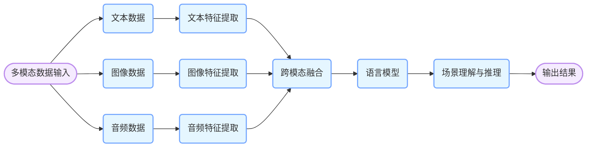

# 语言模型在多模态场景理解与推理中的进展

> 关键词：语言模型、多模态场景、理解与推理、进展、跨模态融合

> 摘要：本文聚焦于语言模型在多模态场景理解与推理中的进展。随着人工智能技术的不断发展，多模态数据处理成为研究热点。语言模型在多模态场景中的应用旨在实现对不同类型数据（如图像、文本、音频等）的综合理解与推理。文章详细介绍了相关核心概念、算法原理、数学模型，通过项目实战展示代码实现及解读，探讨实际应用场景，推荐学习资源、开发工具和相关论文，最后总结未来发展趋势与挑战，并提供常见问题解答和参考资料，有助于读者全面了解语言模型在多模态领域的最新动态和技术要点。

## 1. 背景介绍 
### 1.1 目的和范围
在当今数字化时代，数据呈现出多样化的形式，单一模态的数据已经难以满足复杂场景下的理解和推理需求。多模态数据包含了更丰富的信息，例如在一个场景中，图像可以展示物体的外观，文本可以描述相关的事件，音频可以传达声音信息等。语言模型在多模态场景理解与推理中的应用，其目的在于整合这些不同模态的数据，实现更准确、更深入的场景理解和智能推理。

本文章的范围涵盖了语言模型在多模态场景中的核心概念、算法原理、数学模型、实际应用案例等方面。通过对这些内容的详细阐述，旨在为读者提供一个全面而深入的视角，了解语言模型在多模态领域的发展现状和未来趋势。

### 1.2 预期读者
本文预期读者主要包括人工智能领域的研究人员、开发者、学生以及对多模态技术感兴趣的专业人士。对于研究人员来说，文章可以提供最新的研究进展和思路；对于开发者，有助于他们在实际项目中应用相关技术；对于学生，能够帮助他们建立起对语言模型和多模态技术的系统认知；对于其他专业人士，可以作为了解这一前沿领域的参考资料。

### 1.3 文档结构概述
本文将按照以下结构进行组织：首先介绍背景知识，包括目的、预期读者和文档结构概述等；接着阐述核心概念与联系，通过文本示意图和 Mermaid 流程图展示多模态场景中各元素的关系；然后详细讲解核心算法原理和具体操作步骤，并使用 Python 源代码进行说明；随后介绍数学模型和公式，并举例说明其应用；通过项目实战展示代码实现和详细解释；探讨实际应用场景；推荐相关的学习资源、开发工具和论文著作；总结未来发展趋势与挑战；提供常见问题解答；最后列出扩展阅读和参考资料。

### 1.4 术语表
#### 1.4.1 核心术语定义
- **语言模型**：是一种基于概率统计的模型，用于预测文本序列中每个词出现的概率。它可以学习到语言的语法、语义等信息，在自然语言处理任务中有着广泛的应用。
- **多模态**：指的是包含多种不同模态数据的情况，常见的模态有文本、图像、音频、视频等。多模态数据可以提供更丰富的信息，有助于更全面地理解场景。
- **场景理解**：是指对特定场景中的各种元素、关系和事件进行分析和解读，以获得对该场景的整体认知。在多模态场景中，需要综合考虑不同模态的数据来实现更准确的场景理解。
- **推理**：是指基于已知信息，通过一定的逻辑规则和方法得出新的结论或判断的过程。在多模态场景中，推理可以利用不同模态的数据之间的关联来进行。
- **跨模态融合**：是指将不同模态的数据进行整合和处理，以充分发挥各模态数据的优势，提高对多模态场景的理解和推理能力。

#### 1.4.2 相关概念解释
- **特征提取**：是指从原始数据中提取出具有代表性的特征的过程。在多模态场景中，不同模态的数据需要采用不同的特征提取方法，例如图像可以使用卷积神经网络提取特征，文本可以使用词嵌入等方法。
- **注意力机制**：是一种模拟人类注意力分配的机制，它可以自动地关注输入数据中的重要部分，从而提高模型的性能。在多模态场景中，注意力机制可以用于处理不同模态数据之间的关联。
- **端到端模型**：是指一种直接从输入数据到输出结果的模型，中间不需要进行复杂的人工特征工程。在多模态场景中，端到端模型可以直接处理不同模态的数据，实现场景理解和推理的一体化。

#### 1.4.3 缩略词列表
- **NLP**：Natural Language Processing，自然语言处理
- **CNN**：Convolutional Neural Network，卷积神经网络
- **RNN**：Recurrent Neural Network，循环神经网络
- **Transformer**：一种基于注意力机制的神经网络架构
- **BERT**：Bidirectional Encoder Representations from Transformers，一种预训练的语言模型

## 2. 核心概念与联系 
在多模态场景理解与推理中，涉及到多个核心概念，它们之间相互关联，共同构成了一个复杂的系统。下面通过文本示意图和 Mermaid 流程图来展示这些概念之间的关系。

### 文本示意图
多模态场景主要包含三种常见的模态：文本、图像和音频。语言模型在其中起着核心的作用，它需要与不同模态的数据进行交互和融合。

- 文本模态：包含自然语言文本信息，如描述、对话等。语言模型可以直接对文本进行处理，理解其中的语义和语法信息。
- 图像模态：通过视觉信息展示场景中的物体、场景布局等。需要使用计算机视觉技术（如 CNN）提取图像特征，然后将这些特征与语言模型进行融合。
- 音频模态：包含声音信息，如语音、环境声音等。需要使用音频处理技术提取音频特征，再与语言模型进行融合。

跨模态融合是实现多模态场景理解与推理的关键步骤，它将不同模态的数据特征进行整合，使得语言模型能够综合利用各模态的信息进行场景理解和推理。

### Mermaid 流程图


该流程图展示了多模态场景理解与推理的整体流程：首先输入多模态数据，包括文本、图像和音频；然后分别对不同模态的数据进行特征提取；接着将提取的特征进行跨模态融合；融合后的特征输入到语言模型中；最后语言模型进行场景理解与推理，并输出结果。

## 3. 核心算法原理 & 具体操作步骤 
### 核心算法原理
在多模态场景理解与推理中，常用的算法包括基于深度学习的方法，如卷积神经网络（CNN）、循环神经网络（RNN）、Transformer 等。下面以 Transformer 为例，介绍其核心算法原理。

Transformer 是一种基于注意力机制的神经网络架构，它由编码器和解码器组成。编码器负责对输入序列进行编码，解码器负责根据编码器的输出生成输出序列。

#### 注意力机制
注意力机制是 Transformer 的核心组成部分，它可以计算输入序列中每个元素与其他元素之间的相关性。具体来说，对于输入序列 $X = [x_1, x_2,..., x_n]$，注意力机制的计算过程如下：

1. 计算查询（Query）、键（Key）和值（Value）矩阵：
   给定输入序列 $X$，通过线性变换得到查询矩阵 $Q$、键矩阵 $K$ 和值矩阵 $V$：
   $Q = XW_Q$
   $K = XW_K$
   $V = XW_V$
   其中 $W_Q$、$W_K$ 和 $W_V$ 是可学习的权重矩阵。

2. 计算注意力分数：
   注意力分数表示每个元素与其他元素之间的相关性，计算公式为：
   $Attention(Q, K, V) = softmax(\frac{QK^T}{\sqrt{d_k}})V$
   其中 $d_k$ 是键矩阵 $K$ 的维度。

#### 多头注意力机制
为了让模型能够捕捉到不同方面的相关性，Transformer 采用了多头注意力机制。多头注意力机制将注意力计算过程重复多次，每次使用不同的权重矩阵 $W_Q$、$W_K$ 和 $W_V$，然后将所有注意力结果拼接起来并进行线性变换。

#### 编码器和解码器
编码器由多个相同的编码层组成，每个编码层包含多头注意力机制和前馈神经网络。解码器由多个相同的解码层组成，每个解码层包含多头注意力机制、编码器 - 解码器注意力机制和前馈神经网络。

### 具体操作步骤
下面使用 Python 代码详细阐述如何使用 Transformer 进行文本处理的具体操作步骤。

```python
import torch
import torch.nn as nn
import torch.nn.functional as F

# 定义多头注意力机制
class MultiHeadAttention(nn.Module):
    def __init__(self, d_model, num_heads):
        super(MultiHeadAttention, self).__init__()
        assert d_model % num_heads == 0, "d_model must be divisible by num_heads"

        self.d_model = d_model
        self.num_heads = num_heads
        self.d_k = d_model // num_heads

        self.W_q = nn.Linear(d_model, d_model)
        self.W_k = nn.Linear(d_model, d_model)
        self.W_v = nn.Linear(d_model, d_model)
        self.W_o = nn.Linear(d_model, d_model)

    def scaled_dot_product_attention(self, Q, K, V, mask=None):
        attn_scores = torch.matmul(Q, K.transpose(-2, -1)) / torch.sqrt(torch.tensor(self.d_k, dtype=torch.float32))
        if mask is not None:
            attn_scores = attn_scores.masked_fill(mask == 0, -1e9)
        attn_probs = F.softmax(attn_scores, dim=-1)
        output = torch.matmul(attn_probs, V)
        return output

    def split_heads(self, x):
        batch_size, seq_length, d_model = x.size()
        return x.view(batch_size, seq_length, self.num_heads, self.d_k).transpose(1, 2)

    def combine_heads(self, x):
        batch_size, num_heads, seq_length, d_k = x.size()
        return x.transpose(1, 2).contiguous().view(batch_size, seq_length, self.d_model)

    def forward(self, Q, K, V, mask=None):
        Q = self.split_heads(self.W_q(Q))
        K = self.split_heads(self.W_k(K))
        V = self.split_heads(self.W_v(V))

        attn_output = self.scaled_dot_product_attention(Q, K, V, mask)
        output = self.W_o(self.combine_heads(attn_output))
        return output

# 定义前馈神经网络
class PositionwiseFeedForward(nn.Module):
    def __init__(self, d_model, d_ff):
        super(PositionwiseFeedForward, self).__init__()
        self.fc1 = nn.Linear(d_model, d_ff)
        self.fc2 = nn.Linear(d_ff, d_model)
        self.relu = nn.ReLU()

    def forward(self, x):
        return self.fc2(self.relu(self.fc1(x)))

# 定义编码层
class EncoderLayer(nn.Module):
    def __init__(self, d_model, num_heads, d_ff, dropout):
        super(EncoderLayer, self).__init__()
        self.self_attn = MultiHeadAttention(d_model, num_heads)
        self.feed_forward = PositionwiseFeedForward(d_model, d_ff)
        self.norm1 = nn.LayerNorm(d_model)
        self.norm2 = nn.LayerNorm(d_model)
        self.dropout = nn.Dropout(dropout)

    def forward(self, x, mask):
        attn_output = self.self_attn(x, x, x, mask)
        x = self.norm1(x + self.dropout(attn_output))
        ff_output = self.feed_forward(x)
        x = self.norm2(x + self.dropout(ff_output))
        return x

# 定义编码器
class Encoder(nn.Module):
    def __init__(self, num_layers, d_model, num_heads, d_ff, dropout):
        super(Encoder, self).__init__()
        self.layers = nn.ModuleList([EncoderLayer(d_model, num_heads, d_ff, dropout) for _ in range(num_layers)])

    def forward(self, x, mask):
        for layer in self.layers:
            x = layer(x, mask)
        return x

# 示例使用
if __name__ == "__main__":
    # 初始化参数
    d_model = 512
    num_heads = 8
    d_ff = 2048
    num_layers = 6
    dropout = 0.1

    # 创建编码器
    encoder = Encoder(num_layers, d_model, num_heads, d_ff, dropout)

    # 输入数据
    batch_size = 32
    seq_length = 10
    input_tensor = torch.randn(batch_size, seq_length, d_model)
    mask = torch.ones(batch_size, 1, seq_length)

    # 前向传播
    output = encoder(input_tensor, mask)
    print("Output shape:", output.shape)
```

### 代码解释
1. **MultiHeadAttention 类**：实现了多头注意力机制，包括计算查询、键和值矩阵，计算注意力分数，以及多头拼接和线性变换。
2. **PositionwiseFeedForward 类**：实现了前馈神经网络，包含两个线性层和一个 ReLU 激活函数。
3. **EncoderLayer 类**：定义了编码器的一层，包含多头注意力机制和前馈神经网络，以及层归一化和 dropout 操作。
4. **Encoder 类**：定义了整个编码器，由多个编码层组成。
5. **示例使用**：初始化编码器，创建输入数据和掩码，进行前向传播并输出结果。

## 4. 数学模型和公式 & 详细讲解 & 举例说明 
### 数学模型和公式
#### 注意力机制公式
如前面所述，注意力机制的计算公式为：
$$Attention(Q, K, V) = softmax(\frac{QK^T}{\sqrt{d_k}})V$$
其中 $Q$ 是查询矩阵，$K$ 是键矩阵，$V$ 是值矩阵，$d_k$ 是键矩阵的维度。

#### 多头注意力机制公式
多头注意力机制的计算公式为：
$$MultiHead(Q, K, V) = Concat(head_1,..., head_h)W^O$$
其中 $head_i = Attention(QW^Q_i, KW^K_i, VW^V_i)$，$W^Q_i$、$W^K_i$ 和 $W^V_i$ 是第 $i$ 个头的权重矩阵，$W^O$ 是用于拼接后线性变换的权重矩阵。

#### 前馈神经网络公式
前馈神经网络的计算公式为：
$$FFN(x) = max(0, xW_1 + b_1)W_2 + b_2$$
其中 $W_1$ 和 $W_2$ 是线性层的权重矩阵，$b_1$ 和 $b_2$ 是偏置向量。

### 详细讲解
#### 注意力机制
注意力机制的核心思想是根据查询向量 $Q$ 与键向量 $K$ 的相似度来分配值向量 $V$ 的权重。通过计算 $QK^T$ 得到每个查询向量与所有键向量的相似度得分，然后除以 $\sqrt{d_k}$ 进行缩放，以避免内积值过大导致梯度消失或爆炸。最后使用 softmax 函数将得分转换为概率分布，用于加权求和得到注意力输出。

#### 多头注意力机制
多头注意力机制通过多个不同的头来捕捉输入序列的不同方面的相关性。每个头使用不同的权重矩阵进行注意力计算，然后将所有头的结果拼接起来并进行线性变换，这样可以增加模型的表达能力。

#### 前馈神经网络
前馈神经网络在编码器和解码器中起到进一步处理特征的作用。它由两个线性层和一个 ReLU 激活函数组成，通过非线性变换可以学习到更复杂的特征表示。

### 举例说明
假设我们有一个输入序列 $X = [x_1, x_2, x_3]$，每个元素的维度为 $d = 4$。我们将使用一个简单的注意力机制来计算输出。

首先，我们定义查询、键和值矩阵的权重矩阵：
$W_Q = \begin{bmatrix}
1 & 0 & 0 & 0 \\
0 & 1 & 0 & 0 \\
0 & 0 & 1 & 0 \\
0 & 0 & 0 & 1
\end{bmatrix}$
$W_K = \begin{bmatrix}
1 & 0 & 0 & 0 \\
0 & 1 & 0 & 0 \\
0 & 0 & 1 & 0 \\
0 & 0 & 0 & 1
\end{bmatrix}$
$W_V = \begin{bmatrix}
1 & 0 & 0 & 0 \\
0 & 1 & 0 & 0 \\
0 & 0 & 1 & 0 \\
0 & 0 & 0 & 1
\end{bmatrix}$

计算查询、键和值矩阵：
$Q = XW_Q = X$
$K = XW_K = X$
$V = XW_V = X$

假设 $X = \begin{bmatrix}
1 & 2 & 3 & 4 \\
5 & 6 & 7 & 8 \\
9 & 10 & 11 & 12
\end{bmatrix}$

计算注意力分数：
$QK^T = \begin{bmatrix}
1 & 2 & 3 & 4 \\
5 & 6 & 7 & 8 \\
9 & 10 & 11 & 12
\end{bmatrix} \begin{bmatrix}
1 & 5 & 9 \\
2 & 6 & 10 \\
3 & 7 & 11 \\
4 & 8 & 12
\end{bmatrix} = \begin{bmatrix}
30 & 70 & 110 \\
70 & 174 & 278 \\
110 & 278 & 446
\end{bmatrix}$

假设 $d_k = 4$，则 $\sqrt{d_k} = 2$，缩放后的注意力分数为：
$\frac{QK^T}{\sqrt{d_k}} = \begin{bmatrix}
15 & 35 & 55 \\
35 & 87 & 139 \\
55 & 139 & 223
\end{bmatrix}$

使用 softmax 函数计算注意力概率：
$softmax(\frac{QK^T}{\sqrt{d_k}}) = \begin{bmatrix}
0.000 & 0.002 & 0.998 \\
0.000 & 0.012 & 0.988 \\
0.000 & 0.007 & 0.993
\end{bmatrix}$

计算注意力输出：
$Attention(Q, K, V) = softmax(\frac{QK^T}{\sqrt{d_k}})V = \begin{bmatrix}
0.000 & 0.002 & 0.998 \\
0.000 & 0.012 & 0.988 \\
0.000 & 0.007 & 0.993
\end{bmatrix} \begin{bmatrix}
1 & 2 & 3 & 4 \\
5 & 6 & 7 & 8 \\
9 & 10 & 11 & 12
\end{bmatrix} = \begin{bmatrix}
8.984 & 9.980 & 10.976 & 11.972 \\
8.904 & 9.888 & 10.872 & 11.856 \\
8.932 & 9.926 & 10.920 & 11.914
\end{bmatrix}$

这个例子展示了注意力机制的具体计算过程，通过注意力机制，模型可以根据输入序列中元素之间的相关性来加权求和，从而得到更有意义的输出。

## 5. 项目实战：代码实际案例和详细解释说明 
### 5.1  开发环境搭建
#### 安装 Python
首先，确保你已经安装了 Python 3.6 或更高版本。你可以从 Python 官方网站（https://www.python.org/downloads/）下载并安装 Python。

#### 创建虚拟环境
为了避免不同项目之间的依赖冲突，建议使用虚拟环境。可以使用 `venv` 模块创建虚拟环境：
```bash
python -m venv myenv
```
激活虚拟环境：
- 在 Windows 上：
```bash
myenv\Scripts\activate
```
- 在 Linux 或 macOS 上：
```bash
source myenv/bin/activate
```

#### 安装依赖库
在虚拟环境中安装所需的依赖库，主要包括 `torch`、`torchvision` 等：
```bash
pip install torch torchvision
```

### 5.2  源代码详细实现和代码解读
下面我们实现一个简单的多模态场景理解与推理的项目，结合图像和文本数据。我们将使用预训练的 ResNet 模型提取图像特征，使用 BERT 模型提取文本特征，然后将两种特征进行融合，最后使用一个全连接层进行分类。

```python
import torch
import torch.nn as nn
import torchvision.models as models
from transformers import BertModel, BertTokenizer

# 定义多模态模型
class MultiModalModel(nn.Module):
    def __init__(self, num_classes):
        super(MultiModalModel, self).__init__()
        # 图像特征提取器
        self.image_model = models.resnet18(pretrained=True)
        num_ftrs = self.image_model.fc.in_features
        self.image_model.fc = nn.Identity()  # 去掉最后一层全连接层

        # 文本特征提取器
        self.text_model = BertModel.from_pretrained('bert-base-uncased')
        self.tokenizer = BertTokenizer.from_pretrained('bert-base-uncased')

        # 融合层
        self.fc1 = nn.Linear(num_ftrs + 768, 512)
        self.relu = nn.ReLU()
        self.fc2 = nn.Linear(512, num_classes)

    def forward(self, images, texts):
        # 提取图像特征
        image_features = self.image_model(images)

        # 提取文本特征
        inputs = self.tokenizer(texts, return_tensors='pt', padding=True, truncation=True)
        outputs = self.text_model(**inputs)
        text_features = outputs.pooler_output

        # 融合特征
        combined_features = torch.cat((image_features, text_features), dim=1)

        # 全连接层
        x = self.fc1(combined_features)
        x = self.relu(x)
        x = self.fc2(x)
        return x

# 示例使用
if __name__ == "__main__":
    # 初始化模型
    num_classes = 10
    model = MultiModalModel(num_classes)

    # 输入数据
    batch_size = 4
    image_size = (3, 224, 224)
    images = torch.randn(batch_size, *image_size)
    texts = ["This is a sample text", "Another sample text", "Text for testing", "One more text"]

    # 前向传播
    outputs = model(images, texts)
    print("Output shape:", outputs.shape)
```

### 5.3  代码解读与分析
#### 模型定义
- `MultiModalModel` 类继承自 `nn.Module`，定义了一个多模态模型。
  - `image_model`：使用预训练的 ResNet18 模型作为图像特征提取器，去掉最后一层全连接层，以便获取特征向量。
  - `text_model`：使用预训练的 BERT 模型作为文本特征提取器，使用 `BertTokenizer` 对文本进行分词。
  - `fc1` 和 `fc2`：定义了两个全连接层，用于融合特征并进行分类。

#### 前向传播
- 首先，使用 `image_model` 提取图像特征。
- 然后，使用 `tokenizer` 对文本进行分词，输入到 `text_model` 中提取文本特征。
- 接着，将图像特征和文本特征拼接起来，得到融合特征。
- 最后，将融合特征输入到全连接层中进行分类。

#### 示例使用
- 初始化模型，设置分类类别数为 10。
- 创建随机图像数据和文本数据。
- 进行前向传播，输出分类结果的形状。

通过这个项目实战，我们展示了如何结合图像和文本数据进行多模态场景理解与推理，以及如何实现一个简单的多模态模型。

## 6. 实际应用场景 
### 智能客服
在智能客服场景中，用户可能会通过文本、图像或语音等多种方式提出问题。语言模型在多模态场景理解与推理中的应用可以帮助智能客服更准确地理解用户的意图。例如，用户在咨询一款产品时，可能会发送产品的图片并描述一些问题，智能客服可以结合图像和文本信息，准确地了解用户的需求，并提供更合适的解决方案。

### 自动驾驶
在自动驾驶领域，车辆需要感知周围的环境，包括视觉信息（如道路、交通标志、其他车辆等）、音频信息（如警报声、喇叭声等）。语言模型可以与计算机视觉和音频处理技术相结合，实现对多模态环境信息的理解和推理。例如，当车辆检测到前方有交通事故的图像和警报声时，语言模型可以根据这些信息推理出当前的危险情况，并指导车辆采取相应的措施。

### 医疗诊断
在医疗诊断中，医生通常需要综合考虑患者的病历（文本信息）、医学影像（如图像信息）等多种数据。语言模型在多模态场景中的应用可以帮助医生更全面地分析患者的病情。例如，通过结合患者的病历描述和X光片图像，语言模型可以辅助医生进行疾病的诊断和预测。

### 智能家居
在智能家居系统中，用户可以通过语音指令、手机应用（文本输入）等方式控制家居设备。同时，智能家居设备也可以收集环境信息，如温度、湿度、光线等（传感器数据）。语言模型可以整合这些多模态信息，实现更智能的家居控制。例如，当用户通过语音指令要求调节温度时，语言模型可以结合当前的环境温度信息，自动调整空调的温度设置。

### 教育领域
在教育领域，多模态学习资源可以提供更丰富的学习体验。例如，在线课程可以包含视频、文本、音频等多种形式的内容。语言模型可以帮助学生更好地理解这些多模态学习资源。例如，当学生在观看视频课程时遇到疑问，可以通过文本输入问题，语言模型可以结合视频内容和文本问题进行解答，提供更个性化的学习支持。

## 7. 工具和资源推荐
### 7.1 学习资源推荐
#### 7.1.1 书籍推荐
- 《深度学习》（Deep Learning）：由 Ian Goodfellow、Yoshua Bengio 和 Aaron Courville 所著，是深度学习领域的经典教材，涵盖了神经网络、卷积神经网络、循环神经网络等基础知识，对于理解语言模型和多模态技术的底层原理非常有帮助。
- 《自然语言处理入门》：由何晗所著，这本书系统地介绍了自然语言处理的基本概念、方法和技术，包括词法分析、句法分析、语义理解等内容，适合初学者入门。
- 《计算机视觉：算法与应用》（Computer Vision: Algorithms and Applications）：由 Richard Szeliski 所著，详细介绍了计算机视觉的各种算法和应用，如图像处理、特征提取、目标检测等，对于理解多模态场景中的图像模态处理非常有帮助。

#### 7.1.2 在线课程
- Coursera 上的“深度学习专项课程”（Deep Learning Specialization）：由 Andrew Ng 教授授课，包括五门课程，涵盖了深度学习的各个方面，如神经网络基础、卷积神经网络、循环神经网络等，是学习深度学习的优质课程。
- edX 上的“自然语言处理”（Natural Language Processing）：由哥伦比亚大学教授授课，系统地介绍了自然语言处理的理论和实践，包括词向量、语言模型、文本分类等内容。
- Udemy 上的“计算机视觉 A-Z：使用 OpenCV 和深度学习构建项目”（Computer Vision A-Z™: Build Modern Computer Vision Apps with Python）：通过实际项目介绍计算机视觉的应用，使用 OpenCV 和深度学习框架，适合初学者快速上手。

#### 7.1.3 技术博客和网站
- Medium：是一个技术博客平台，有很多关于人工智能、深度学习、自然语言处理等领域的优质文章，作者包括行业专家和研究人员，可以及时了解最新的技术动态和研究成果。
- arXiv：是一个预印本数据库，收录了大量的学术论文，包括计算机科学、人工智能等领域的最新研究成果。可以在上面搜索关于语言模型和多模态技术的最新论文。
- Towards Data Science：是一个专注于数据科学和机器学习的博客平台，有很多关于技术原理、实践经验和案例分析的文章，对于学习和应用多模态技术有很大的帮助。

### 7.2 开发工具框架推荐
#### 7.2.1 IDE和编辑器
- PyCharm：是一款专门为 Python 开发设计的集成开发环境（IDE），具有强大的代码编辑、调试、代码分析等功能，支持多种 Python 框架和库，非常适合开发多模态项目。
- Jupyter Notebook：是一个交互式的开发环境，可以将代码、文本、图像等内容整合在一个文档中，方便进行数据探索、模型开发和结果展示，常用于深度学习和数据科学项目。
- Visual Studio Code：是一款轻量级的代码编辑器，支持多种编程语言和插件扩展，具有丰富的代码编辑和调试功能，适合快速开发和调试多模态项目。

#### 7.2.2 调试和性能分析工具
- TensorBoard：是 TensorFlow 提供的一个可视化工具，可以用于可视化模型的训练过程、损失函数变化、模型结构等信息，帮助开发者调试和优化模型。
- PyTorch Profiler：是 PyTorch 提供的一个性能分析工具，可以用于分析模型的运行时间、内存使用情况等，帮助开发者找出模型的性能瓶颈。
- NVIDIA Nsight Systems：是 NVIDIA 提供的一个性能分析工具，专门用于分析 GPU 加速的应用程序，可以帮助开发者优化模型在 GPU 上的性能。

#### 7.2.3 相关框架和库
- PyTorch：是一个开源的深度学习框架，具有动态图机制，易于使用和调试，支持多种深度学习模型和算法，在自然语言处理和计算机视觉领域有广泛的应用。
- TensorFlow：是一个广泛使用的开源深度学习框架，具有强大的分布式训练和部署能力，提供了丰富的工具和库，适合大规模的深度学习项目。
- Transformers：是 Hugging Face 开发的一个开源库，提供了多种预训练的语言模型，如 BERT、GPT 等，方便开发者快速使用和微调这些模型。
- OpenCV：是一个开源的计算机视觉库，提供了丰富的图像处理和计算机视觉算法，如图像滤波、特征提取、目标检测等，可用于处理多模态场景中的图像数据。

### 7.3 相关论文著作推荐
#### 7.3.1 经典论文
- “Attention Is All You Need”：提出了 Transformer 架构，是自然语言处理领域的经典论文，为后续的语言模型发展奠定了基础。
- “BERT: Pre-training of Deep Bidirectional Transformers for Language Understanding”：介绍了 BERT 模型，通过预训练和微调的方式在多个自然语言处理任务中取得了优异的成绩。
- “Show, Attend and Tell: Neural Image Caption Generation with Visual Attention”：提出了一种基于注意力机制的图像描述生成方法，将图像和文本信息进行了有效的融合。

#### 7.3.2 最新研究成果
- 可以关注每年的计算机科学顶级会议，如 NeurIPS（神经信息处理系统大会）、ICML（国际机器学习会议）、ACL（计算语言学协会年会）等，这些会议上会发表很多关于语言模型和多模态技术的最新研究成果。
- 一些知名的学术期刊，如 Journal of Artificial Intelligence Research（JAIR）、Artificial Intelligence 等，也会刊登相关领域的高质量研究论文。

#### 7.3.3 应用案例分析
- 可以参考一些实际应用案例的论文，如在医疗、自动驾驶、智能客服等领域的多模态技术应用案例。这些论文通常会详细介绍应用场景、模型架构、实验结果等内容，对于实际项目的开发有很大的借鉴意义。

## 8. 总结：未来发展趋势与挑战
### 未来发展趋势
#### 更强大的多模态预训练模型
随着计算资源的不断增加和算法的不断改进，未来将会出现更强大的多模态预训练模型。这些模型将能够学习到更丰富的多模态信息，在各种多模态任务中取得更好的性能。例如，可能会出现同时融合图像、文本、音频、视频等多种模态的大规模预训练模型。

#### 跨模态知识迁移
跨模态知识迁移是指将一种模态的知识迁移到另一种模态中，以提高模型的泛化能力和学习效率。未来的研究将更加关注跨模态知识迁移的方法和技术，使得模型能够更好地利用不同模态之间的关联信息。例如，在图像生成任务中，可以利用文本描述中的语义信息来指导图像的生成。

#### 多模态交互与协作
随着人工智能技术的发展，人机交互和协作将越来越多地涉及到多模态信息。未来的系统将能够更好地理解和处理人类的多模态输入，如语音、手势、表情等，并以多模态的方式进行输出，提供更加自然和高效的交互体验。例如，智能机器人可以通过语音、图像等多种方式与人类进行交流和协作。

#### 应用领域的拓展
语言模型在多模态场景理解与推理中的应用将不断拓展到更多的领域，如金融、农业、娱乐等。在金融领域，可以结合文本新闻、市场数据、公司财报等多模态信息进行风险评估和投资决策；在农业领域，可以利用卫星图像、气象数据、传感器数据等多模态信息进行作物生长监测和病虫害预警。

### 挑战
#### 数据融合与对齐
不同模态的数据具有不同的特征和分布，如何有效地将它们进行融合和对齐是一个挑战。例如，图像和文本数据的特征空间差异很大，需要设计合适的方法来将它们映射到同一个特征空间中，以便进行有效的融合和处理。

#### 计算资源和效率
训练和推理多模态模型通常需要大量的计算资源和时间。随着模型规模的不断增大和数据量的不断增加，计算资源和效率的问题将变得更加突出。需要研究更高效的算法和硬件架构，以提高多模态模型的训练和推理效率。

#### 语义理解和推理能力
虽然现有的语言模型在多模态场景中取得了一定的进展，但它们的语义理解和推理能力仍然有限。在复杂的多模态场景中，模型可能无法准确地理解和推理出其中的语义信息。需要进一步研究和开发更强大的语义理解和推理方法，提高模型的智能水平。

#### 数据隐私和安全
多模态数据通常包含大量的个人隐私信息，如图像、音频等。在处理和应用这些数据时，需要确保数据的隐私和安全。同时，多模态模型也容易受到攻击，如对抗样本攻击等，需要研究相应的防御机制，提高模型的安全性。

## 9. 附录：常见问题与解答
### 问题 1：多模态数据的特征提取有哪些常用方法？
答：不同模态的数据有不同的特征提取方法。对于图像数据，常用的方法包括卷积神经网络（CNN），如 ResNet、VGG 等；对于文本数据，常用的方法包括词嵌入（如 Word2Vec、GloVe）、预训练语言模型（如 BERT、GPT）等；对于音频数据，常用的方法包括梅尔频率倒谱系数（MFCC）、卷积神经网络等。

### 问题 2：如何评估多模态模型的性能？
答：评估多模态模型的性能可以根据具体的任务选择合适的评估指标。例如，在分类任务中，可以使用准确率、召回率、F1 值等指标；在回归任务中，可以使用均方误差（MSE）、平均绝对误差（MAE）等指标。此外，还可以使用一些多模态特定的评估指标，如跨模态检索的准确率、图像描述生成的 BLEU 分数等。

### 问题 3：多模态模型的训练过程中需要注意哪些问题？
答：在多模态模型的训练过程中，需要注意以下几个问题：
1. 数据预处理：不同模态的数据需要进行不同的预处理，如图像的缩放、归一化，文本的分词、编码等。
2. 模型架构设计：需要根据具体的任务和数据特点设计合适的模型架构，确保不同模态的数据能够有效地融合。
3. 损失函数选择：需要选择合适的损失函数来优化模型的性能，如交叉熵损失、均方误差损失等。
4. 训练参数调整：需要调整合适的训练参数，如学习率、批量大小、训练轮数等，以确保模型能够收敛到最优解。

### 问题 4：如何解决多模态数据中的数据不平衡问题？
答：解决多模态数据中的数据不平衡问题可以采用以下方法：
1. 数据增强：对于少数类样本，可以采用数据增强的方法增加样本数量，如图像的旋转、翻转，文本的同义词替换等。
2. 重采样：可以采用重采样的方法，如过采样（如 SMOTE）、欠采样等，来平衡不同类别的样本数量。
3. 损失函数调整：可以调整损失函数，如使用加权交叉熵损失，对少数类样本赋予更高的权重，以提高模型对少数类样本的关注。

### 问题 5：多模态模型在实际应用中面临哪些挑战？
答：多模态模型在实际应用中面临以下挑战：
1. 数据获取和标注：多模态数据的获取和标注通常比较困难，需要耗费大量的时间和人力。
2. 计算资源和效率：训练和推理多模态模型需要大量的计算资源和时间，在实际应用中可能会受到硬件条件的限制。
3. 模型可解释性：多模态模型通常比较复杂，其决策过程难以解释，在一些对可解释性要求较高的应用场景中可能会受到限制。
4. 数据隐私和安全：多模态数据通常包含大量的个人隐私信息，在处理和应用这些数据时需要确保数据的隐私和安全。

## 10. 扩展阅读 & 参考资料
### 扩展阅读
- 《人工智能：现代方法》（Artificial Intelligence: A Modern Approach）：全面介绍了人工智能的各个领域，包括知识表示、推理、机器学习、自然语言处理等，对于深入理解人工智能和多模态技术的背景知识非常有帮助。
- 《深度学习实战》（Deep Learning in Practice）：通过实际案例介绍了深度学习在各个领域的应用，包括图像识别、语音识别、自然语言处理等，适合有一定基础的读者进一步学习和实践。
- 《多模态机器学习：原理与应用》（Multimodal Machine Learning: Principles and Applications）：专门介绍了多模态机器学习的理论和方法，包括多模态数据的处理、融合和分析等内容，是多模态领域的专业书籍。

### 参考资料
1. Vaswani, A., Shazeer, N., Parmar, N., Uszkoreit, J., Jones, L., Gomez, A. N.,... & Polosukhin, I. (2017). Attention is all you need. In Advances in neural information processing systems (pp. 5998-6008).
2. Devlin, J., Chang, M. W., Lee, K., & Toutanova, K. (2018). Bert: Pre-training of deep bidirectional transformers for language understanding. arXiv preprint arXiv:1810.04805.
3. Xu, K., Ba, J. L., Kiros, R., Cho, K., Courville, A., Salakhudinov, R.,... & Bengio, Y. (2015). Show, attend and tell: Neural image caption generation with visual attention. In International conference on machine learning (pp. 2048-2057).

作者：AI天才研究院/AI Genius Institute & 禅与计算机程序设计艺术 /Zen And The Art of Computer Programming