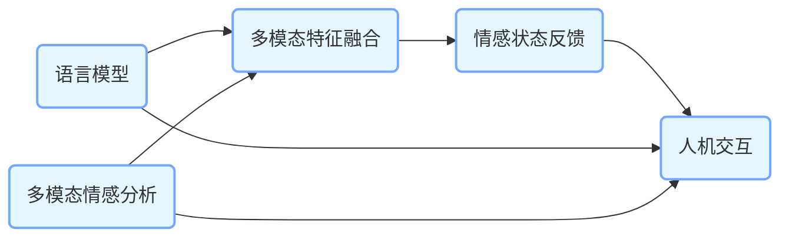

# 语言模型在多模态情感分析与人机交互优化中的研究

> 关键词：语言模型、多模态情感分析、人机交互、优化、深度学习

> 摘要：本文聚焦于语言模型在多模态情感分析与人机交互优化中的研究。多模态情感分析结合了多种模态的数据来更准确地理解人类情感，而语言模型在其中发挥着关键作用。通过对语言模型原理、多模态数据融合方法以及人机交互机制的深入探讨，阐述了如何利用语言模型提升多模态情感分析的准确性，并将其应用于优化人机交互体验。文章详细介绍了相关核心概念、算法原理、数学模型，给出了项目实战案例，分析了实际应用场景，推荐了相关工具和资源，最后总结了未来发展趋势与挑战，旨在为该领域的研究和实践提供全面且深入的参考。

## 1. 背景介绍 
### 1.1 目的和范围
本研究的目的在于深入探究语言模型在多模态情感分析与人机交互优化中的应用和价值。随着人工智能技术的发展，人机交互的需求日益增长，准确理解人类情感对于提升人机交互的质量至关重要。多模态情感分析能够综合利用文本、语音、图像等多种模态的数据，更全面地捕捉人类情感信息。语言模型作为处理文本信息的强大工具，在多模态情感分析中具有重要作用。本研究的范围涵盖了语言模型的基本原理、多模态情感分析的方法和技术、语言模型在人机交互中的应用以及相关的优化策略。

### 1.2 预期读者
本文预期读者包括人工智能、自然语言处理、人机交互等领域的研究人员、工程师和学生。对于希望深入了解语言模型在多模态情感分析和人机交互中应用的专业人士，本文提供了系统的理论知识和实践案例；对于相关专业的学生，本文有助于他们拓宽知识面，了解该领域的前沿技术和研究方向。

### 1.3 文档结构概述
本文首先介绍了研究的背景和相关术语，然后阐述了核心概念及其联系，包括语言模型、多模态情感分析和人机交互的原理和架构。接着详细讲解了核心算法原理和具体操作步骤，并给出了相应的Python源代码。之后介绍了数学模型和公式，并通过举例进行说明。在项目实战部分，提供了开发环境搭建的步骤、源代码实现和代码解读。随后分析了实际应用场景，推荐了相关的工具和资源。最后总结了未来发展趋势与挑战，并给出了常见问题的解答和扩展阅读参考资料。

### 1.4 术语表
#### 1.4.1 核心术语定义
- **语言模型**：是一种对自然语言进行建模的概率模型，用于预测文本序列中每个词出现的概率。它可以学习语言的统计规律和语义信息，在自然语言处理任务中具有广泛应用。
- **多模态情感分析**：综合利用多种模态的数据（如文本、语音、图像等）来识别和分析人类情感的技术。通过融合不同模态的信息，可以更准确地理解人类情感状态。
- **人机交互**：研究人与计算机之间信息交换和互动的技术和方法。旨在设计出更加自然、高效、舒适的人机交互界面和系统。
- **深度学习**：是一类基于人工神经网络的机器学习方法，通过多层神经网络自动学习数据的特征和模式，在图像识别、语音识别、自然语言处理等领域取得了显著的成果。

#### 1.4.2 相关概念解释
- **模态**：指信息的呈现形式，如文本、语音、图像、视频等。在多模态情感分析中，不同模态的数据包含了不同方面的情感信息。
- **情感分类**：将人类情感划分为不同的类别，如高兴、悲伤、愤怒、惊讶等。多模态情感分析的一个重要任务就是对输入的多模态数据进行情感分类。
- **特征融合**：将不同模态的数据特征进行合并和整合的过程。在多模态情感分析中，特征融合是提高情感分析准确性的关键步骤。

#### 1.4.3 缩略词列表
- **NLP**：Natural Language Processing，自然语言处理
- **CNN**：Convolutional Neural Network，卷积神经网络
- **RNN**：Recurrent Neural Network，循环神经网络
- **LSTM**：Long Short-Term Memory，长短期记忆网络
- **GRU**：Gated Recurrent Unit，门控循环单元

## 2. 核心概念与联系 

### 2.1 语言模型原理
语言模型的基本目标是计算一个文本序列的概率。给定一个文本序列 $w_1, w_2, \cdots, w_n$，语言模型要计算 $P(w_1, w_2, \cdots, w_n)$ 的值。根据链式法则，$P(w_1, w_2, \cdots, w_n) = \prod_{i=1}^{n} P(w_i | w_1, w_2, \cdots, w_{i-1})$。

传统的语言模型，如n-gram模型，假设一个词的出现只与它前面的 $n-1$ 个词有关。例如，对于一个二元语法（bigram）模型，$P(w_i | w_1, w_2, \cdots, w_{i-1}) \approx P(w_i | w_{i-1})$。

现代的语言模型，如基于深度学习的Transformer架构，能够更好地捕捉文本中的长距离依赖关系。Transformer通过自注意力机制（Self-Attention）来计算每个词与其他词之间的相关性，从而更好地理解文本的语义信息。

### 2.2 多模态情感分析原理
多模态情感分析的核心思想是综合利用多种模态的数据来更准确地分析人类情感。不同模态的数据包含了不同方面的情感信息，例如文本中可能包含明确的情感表达词汇，语音的语调、语速等可以反映情感的强度和类型，图像中的面部表情可以直观地显示出人的情感状态。

多模态情感分析的一般流程包括数据采集、特征提取、特征融合和情感分类。首先，从不同的数据源中采集文本、语音、图像等多模态数据；然后，对每种模态的数据进行特征提取，得到各自的特征表示；接着，将不同模态的特征进行融合，得到综合的特征表示；最后，利用融合后的特征进行情感分类，确定输入数据所表达的情感类别。

### 2.3 人机交互原理
人机交互的目标是实现人与计算机之间自然、高效、舒适的信息交换和互动。人机交互系统通常包括输入设备、处理模块和输出设备。用户通过输入设备（如键盘、鼠标、触摸屏等）向计算机输入信息，处理模块对输入信息进行分析和处理，然后通过输出设备（如显示器、扬声器等）向用户输出反馈信息。

良好的人机交互设计需要考虑用户的需求、认知能力和行为习惯。例如，在设计人机交互界面时，要遵循简洁、直观、易用的原则，使用户能够轻松地完成各种操作。同时，人机交互系统还应该能够根据用户的情感状态进行自适应调整，提高用户的满意度和体验感。

### 2.4 核心概念的联系
语言模型在多模态情感分析中起着重要作用。在文本模态的情感分析中，语言模型可以用于理解文本的语义信息，提取文本中的情感特征。在多模态特征融合过程中，语言模型生成的文本特征可以与其他模态的特征进行融合，提高情感分析的准确性。

多模态情感分析的结果可以为人机交互提供重要的参考信息。人机交互系统可以根据用户的情感状态调整交互策略，例如在用户高兴时提供更加积极的反馈，在用户悲伤时给予安慰和支持。语言模型可以帮助人机交互系统更好地理解用户的语言输入，从而实现更加自然和智能的交互。

### 2.5 文本示意图
```plaintext
+---------------------+           +---------------------+           +---------------------+
|      语言模型       |           |    多模态情感分析   |           |      人机交互       |
+---------------------+           +---------------------+           +---------------------+
| - 计算文本序列概率  |           | - 多模态数据采集    |           | - 输入设备          |
| - 捕捉长距离依赖    |           | - 特征提取          |           | - 处理模块          |
| - 理解文本语义      |           | - 特征融合          |           | - 输出设备          |
| - 生成文本特征      |           | - 情感分类          |           | - 自适应调整        |
+---------------------+           +---------------------+           +---------------------+
          |                             |                             |
          |                             |                             |
          |                             |                             |
          v                             v                             v
+---------------------+           +---------------------+           +---------------------+
|    多模态特征融合   |           |    情感状态反馈     |           |    自然智能交互     |
+---------------------+           +---------------------+           +---------------------+
```

### 2.6 Mermaid流程图


## 3. 核心算法原理 & 具体操作步骤 

### 3.1 语言模型算法原理
以Transformer架构为例，Transformer由编码器（Encoder）和解码器（Decoder）组成。编码器负责对输入的文本进行特征提取和编码，解码器则根据编码器的输出生成目标文本。

#### 3.1.1 自注意力机制
自注意力机制是Transformer的核心组件之一，它可以计算每个词与其他词之间的相关性。给定输入序列 $X = [x_1, x_2, \cdots, x_n]$，首先将每个词 $x_i$ 映射到三个向量：查询向量 $q_i$、键向量 $k_i$ 和值向量 $v_i$。

$q_i = W_q x_i$
$k_i = W_k x_i$
$v_i = W_v x_i$

其中，$W_q$、$W_k$ 和 $W_v$ 是可学习的权重矩阵。

然后，计算每个词的注意力分数：

$a_{ij} = \frac{q_i^T k_j}{\sqrt{d_k}}$

其中，$d_k$ 是键向量的维度。

最后，通过softmax函数将注意力分数归一化，得到注意力权重：

$\alpha_{ij} = \frac{\exp(a_{ij})}{\sum_{k=1}^{n} \exp(a_{ik})}$

并计算每个词的加权和：

$y_i = \sum_{j=1}^{n} \alpha_{ij} v_j$

#### 3.1.2 多头注意力机制
为了捕捉不同类型的相关性，Transformer使用了多头注意力机制。多头注意力机制将自注意力机制重复多次，每次使用不同的权重矩阵 $W_q$、$W_k$ 和 $W_v$，然后将所有头的输出拼接起来，再通过一个线性变换得到最终的输出。

#### 3.1.3 前馈神经网络
在每个编码器和解码器层中，还包含一个前馈神经网络（Feed-Forward Neural Network，FFN）。FFN由两个线性层和一个非线性激活函数（通常是ReLU）组成。

$FFN(x) = W_2 \max(0, W_1 x + b_1) + b_2$

### 3.2 多模态情感分析算法原理
#### 3.2.1 特征提取
对于文本模态，可以使用预训练的语言模型（如BERT）来提取文本特征。对于语音模态，可以使用卷积神经网络（CNN）或循环神经网络（RNN）来提取语音特征。对于图像模态，可以使用卷积神经网络（如ResNet）来提取图像特征。

#### 3.2.2 特征融合
常见的特征融合方法包括早期融合、晚期融合和中间融合。早期融合是在特征提取之前将不同模态的数据进行合并，然后一起进行特征提取。晚期融合是在特征提取之后将不同模态的特征进行合并，然后进行情感分类。中间融合是在特征提取的过程中进行部分融合。

#### 3.2.3 情感分类
可以使用全连接神经网络、支持向量机（SVM）等分类器对融合后的特征进行情感分类。

### 3.3 具体操作步骤
#### 3.3.1 数据预处理
- 对于文本数据，进行分词、去除停用词、词嵌入等处理。
- 对于语音数据，进行语音信号的预处理，如降噪、特征提取（如MFCC）等。
- 对于图像数据，进行图像的预处理，如缩放、裁剪、归一化等。

#### 3.3.2 特征提取
- 使用预训练的语言模型提取文本特征。
- 使用CNN或RNN提取语音特征。
- 使用ResNet等卷积神经网络提取图像特征。

#### 3.3.3 特征融合
选择合适的特征融合方法，将不同模态的特征进行融合。

#### 3.3.4 情感分类
使用分类器对融合后的特征进行情感分类。

### 3.4 Python源代码实现
```python
import torch
import torch.nn as nn
from transformers import BertModel

# 定义文本特征提取模型
class TextFeatureExtractor(nn.Module):
    def __init__(self):
        super(TextFeatureExtractor, self).__init__()
        self.bert = BertModel.from_pretrained('bert-base-uncased')

    def forward(self, input_ids, attention_mask):
        outputs = self.bert(input_ids=input_ids, attention_mask=attention_mask)
        pooled_output = outputs.pooler_output
        return pooled_output

# 定义语音特征提取模型（简单示例）
class AudioFeatureExtractor(nn.Module):
    def __init__(self):
        super(AudioFeatureExtractor, self).__init__()
        self.conv1 = nn.Conv1d(in_channels=1, out_channels=16, kernel_size=3)
        self.pool1 = nn.MaxPool1d(kernel_size=2)
        self.fc1 = nn.Linear(16 * 50, 128)

    def forward(self, audio):
        x = self.conv1(audio)
        x = torch.relu(x)
        x = self.pool1(x)
        x = x.view(-1, 16 * 50)
        x = self.fc1(x)
        return x

# 定义图像特征提取模型（简单示例）
class ImageFeatureExtractor(nn.Module):
    def __init__(self):
        super(ImageFeatureExtractor, self).__init__()
        self.conv1 = nn.Conv2d(in_channels=3, out_channels=16, kernel_size=3)
        self.pool1 = nn.MaxPool2d(kernel_size=2)
        self.fc1 = nn.Linear(16 * 15 * 15, 128)

    def forward(self, image):
        x = self.conv1(image)
        x = torch.relu(x)
        x = self.pool1(x)
        x = x.view(-1, 16 * 15 * 15)
        x = self.fc1(x)
        return x

# 定义特征融合模型
class FeatureFusionModel(nn.Module):
    def __init__(self):
        super(FeatureFusionModel, self).__init__()
        self.fc1 = nn.Linear(128 + 128 + 768, 256)
        self.fc2 = nn.Linear(256, 3)  # 假设情感分类为3类

    def forward(self, text_feature, audio_feature, image_feature):
        fused_feature = torch.cat((text_feature, audio_feature, image_feature), dim=1)
        x = self.fc1(fused_feature)
        x = torch.relu(x)
        x = self.fc2(x)
        return x

# 示例使用
text_extractor = TextFeatureExtractor()
audio_extractor = AudioFeatureExtractor()
image_extractor = ImageFeatureExtractor()
fusion_model = FeatureFusionModel()

# 模拟输入数据
input_ids = torch.randint(0, 1000, (1, 128))
attention_mask = torch.ones((1, 128))
audio = torch.randn(1, 1, 100)
image = torch.randn(1, 3, 32, 32)

# 提取特征
text_feature = text_extractor(input_ids, attention_mask)
audio_feature = audio_extractor(audio)
image_feature = image_extractor(image)

# 特征融合和情感分类
output = fusion_model(text_feature, audio_feature, image_feature)
print(output)
```

## 4. 数学模型和公式 & 详细讲解 & 举例说明 

### 4.1 语言模型的数学模型
#### 4.1.1 n-gram模型
n-gram模型假设一个词的出现只与它前面的 $n-1$ 个词有关。对于一个n-gram模型，计算 $P(w_i | w_1, w_2, \cdots, w_{i-1})$ 的公式为：

$P(w_i | w_{i-n+1}, \cdots, w_{i-1}) = \frac{C(w_{i-n+1}, \cdots, w_{i-1}, w_i)}{C(w_{i-n+1}, \cdots, w_{i-1})}$

其中，$C(w_{i-n+1}, \cdots, w_{i-1}, w_i)$ 表示 $w_{i-n+1}, \cdots, w