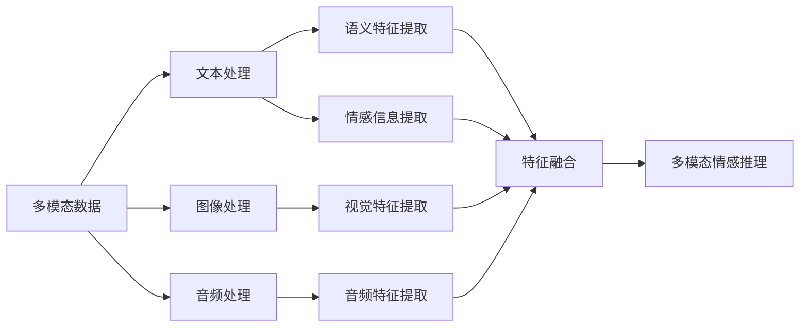

# 语言模型在多模态情感推理中的能力提升

> 关键词：语言模型、多模态、情感推理、能力提升、人工智能

> 摘要：本文聚焦于语言模型在多模态情感推理中的能力提升这一关键问题。首先介绍了多模态情感推理的背景，包括其目的、预期读者等。详细阐述了语言模型及多模态情感推理的核心概念与联系，通过清晰的文本示意图和 Mermaid 流程图进行展示。深入讲解了相关核心算法原理，用 Python 源代码具体阐述操作步骤，同时给出数学模型和公式并举例说明。通过项目实战展示了代码实现和详细解读，探讨了实际应用场景。推荐了相关的学习资源、开发工具框架和论文著作。最后总结了未来发展趋势与挑战，并提供常见问题解答和扩展阅读参考资料，旨在全面深入地探讨如何提升语言模型在多模态情感推理中的能力。

## 1. 背景介绍 
### 1.1 目的和范围
多模态情感推理在当今人工智能领域具有重要意义。随着社交媒体、智能客服、智能医疗等应用场景的不断拓展，人们对于理解和处理多模态数据中蕴含的情感信息需求日益增长。语言模型作为人工智能的核心技术之一，在文本处理方面取得了显著成就。然而，在多模态情感推理场景下，单一的语言信息往往不足以准确捕捉情感，需要结合图像、音频等多种模态信息。本研究的目的在于探索如何提升语言模型在多模态情感推理中的能力，从而更准确地理解和分析人类的情感状态。

研究范围涵盖了多模态情感推理的基本概念、相关的核心算法、数学模型，以及实际应用场景等方面。同时，通过项目实战展示具体的代码实现和应用过程，为读者提供全面的技术指导。

### 1.2 预期读者
本文预期读者包括人工智能领域的研究人员、程序员、软件架构师、对多模态情感推理感兴趣的技术爱好者等。对于希望深入了解语言模型在多模态情感推理中应用的专业人士，本文提供了详细的技术原理和实现方法；对于初学者，也能通过通俗易懂的解释和示例代码，初步掌握相关知识和技能。

### 1.3 文档结构概述
本文将按照以下结构进行阐述：首先介绍多模态情感推理的背景知识，包括目的、预期读者和文档结构概述等；接着详细讲解语言模型和多模态情感推理的核心概念与联系，通过文本示意图和 Mermaid 流程图进行直观展示；然后深入探讨核心算法原理，用 Python 源代码详细阐述具体操作步骤；随后给出数学模型和公式，并进行详细讲解和举例说明；通过项目实战展示代码实现和详细解读；探讨实际应用场景；推荐相关的学习资源、开发工具框架和论文著作；最后总结未来发展趋势与挑战，提供常见问题解答和扩展阅读参考资料。

### 1.4 术语表
#### 1.4.1 核心术语定义
- **语言模型**：是一种对语言进行建模的概率模型，用于预测文本序列中下一个词出现的概率。常见的语言模型有基于统计的 n - 元语法模型、基于神经网络的循环神经网络（RNN）、长短期记忆网络（LSTM）、门控循环单元（GRU）以及Transformer 架构的语言模型等。
- **多模态**：指的是融合多种不同类型的数据模态，如文本、图像、音频、视频等。在多模态情感推理中，通过综合不同模态的数据来更全面地理解情感信息。
- **情感推理**：是指从给定的数据中推断出情感状态的过程。情感状态可以分为积极、消极、中性等类别，也可以用更细致的情感维度进行描述，如喜悦、悲伤、愤怒、恐惧等。

#### 1.4.2 相关概念解释
- **特征融合**：在多模态处理中，将不同模态的数据特征进行合并或交互的过程。常见的特征融合方法有早期融合、晚期融合和混合融合等。
- **注意力机制**：是一种在深度学习中广泛应用的技术，用于自动关注输入数据中的重要部分。在多模态情感推理中，注意力机制可以帮助模型更好地捕捉不同模态数据之间的关联和重要信息。

#### 1.4.3 缩略词列表
- **RNN**：Recurrent Neural Network，循环神经网络
- **LSTM**：Long Short - Term Memory，长短期记忆网络
- **GRU**：Gated Recurrent Unit，门控循环单元
- **CNN**：Convolutional Neural Network，卷积神经网络
- **Transformer**：一种基于自注意力机制的深度学习架构

## 2. 核心概念与联系 

### 语言模型
语言模型是自然语言处理中的重要组成部分，其主要任务是对语言的概率分布进行建模。早期的语言模型基于统计方法，如 n - 元语法模型，通过统计文本中 n 个连续词出现的频率来估计语言的概率分布。然而，这种方法存在数据稀疏和长距离依赖等问题。

随着深度学习的发展，基于神经网络的语言模型逐渐成为主流。RNN 及其变体 LSTM 和 GRU 能够处理序列数据，通过循环结构捕捉文本中的上下文信息。Transformer 架构的出现，引入了自注意力机制，能够并行处理输入序列，大大提高了模型的训练效率和性能。

### 多模态情感推理
多模态情感推理是指利用多种模态的数据（如文本、图像、音频等）来推断情感状态的过程。不同模态的数据包含了不同方面的情感信息，例如文本可以表达具体的语义内容，图像可以展示面部表情和场景信息，音频可以传达语调、语速等情感线索。通过融合多种模态的数据，可以更全面、准确地理解情感信息。

### 核心概念的联系
语言模型在多模态情感推理中起着重要作用。一方面，语言模型可以处理文本模态的数据，提取文本中的语义特征和情感信息。另一方面，语言模型可以与其他模态的处理模型进行融合，共同完成多模态情感推理任务。例如，在图像 - 文本多模态情感推理中，语言模型可以对图像的文本描述进行处理，同时与图像特征进行融合，从而提高情感推理的准确性。

### 文本示意图
```plaintext
多模态数据（文本、图像、音频）
    |
    |-- 文本处理（语言模型）
    |       |
    |       |-- 语义特征提取
    |       |-- 情感信息提取
    |
    |-- 图像处理（CNN等）
    |       |
    |       |-- 视觉特征提取
    |
    |-- 音频处理（RNN等）
    |       |
    |       |-- 音频特征提取
    |
    |-- 特征融合
            |
            |-- 多模态情感推理
```

### Mermaid 流程图


## 3. 核心算法原理 & 具体操作步骤 

### 基于 Transformer 的语言模型处理文本模态
Transformer 是一种基于自注意力机制的深度学习架构，其核心组件包括多头自注意力机制和前馈神经网络。以下是一个简单的基于 PyTorch 实现的 Transformer 语言模型处理文本模态的示例代码：

```python
import torch
import torch.nn as nn
import torch.nn.functional as F

# 定义多头自注意力机制
class MultiHeadAttention(nn.Module):
    def __init__(self, d_model, num_heads):
        super(MultiHeadAttention, self).__init__()
        assert d_model % num_heads == 0, "d_model must be divisible by num_heads"

        self.d_model = d_model
        self.num_heads = num_heads
        self.d_k = d_model // num_heads

        self.W_q = nn.Linear(d_model, d_model)
        self.W_k = nn.Linear(d_model, d_model)
        self.W_v = nn.Linear(d_model, d_model)
        self.W_o = nn.Linear(d_model, d_model)

    def scaled_dot_product_attention(self, Q, K, V, mask=None):
        attn_scores = torch.matmul(Q, K.transpose(-2, -1)) / torch.sqrt(torch.tensor(self.d_k, dtype=torch.float32))
        if mask is not None:
            attn_scores = attn_scores.masked_fill(mask == 0, -1e9)
        attn_probs = F.softmax(attn_scores, dim=-1)
        output = torch.matmul(attn_probs, V)
        return output

    def split_heads(self, x):
        batch_size, seq_length, d_model = x.size()
        return x.view(batch_size, seq_length, self.num_heads, self.d_k).transpose(1, 2)

    def combine_heads(self, x):
        batch_size, num_heads, seq_length, d_k = x.size()
        return x.transpose(1, 2).contiguous().view(batch_size, seq_length, self.d_model)

    def forward(self, Q, K, V, mask=None):
        Q = self.split_heads(self.W_q(Q))
        K = self.split_heads(self.W_k(K))
        V = self.split_heads(self.W_v(V))

        attn_output = self.scaled_dot_product_attention(Q, K, V, mask)
        output = self.W_o(self.combine_heads(attn_output))
        return output

# 定义前馈神经网络
class PositionwiseFeedForward(nn.Module):
    def __init__(self, d_model, d_ff):
        super(PositionwiseFeedForward, self).__init__()
        self.fc1 = nn.Linear(d_model, d_ff)
        self.fc2 = nn.Linear(d_ff, d_model)
        self.relu = nn.ReLU()

    def forward(self, x):
        return self.fc2(self.relu(self.fc1(x)))

# 定义 Transformer 编码器层
class EncoderLayer(nn.Module):
    def __init__(self, d_model, num_heads, d_ff, dropout):
        super(EncoderLayer, self).__init__()
        self.self_attn = MultiHeadAttention(d_model, num_heads)
        self.feed_forward = PositionwiseFeedForward(d_model, d_ff)
        self.norm1 = nn.LayerNorm(d_model)
        self.norm2 = nn.LayerNorm(d_model)
        self.dropout = nn.Dropout(dropout)

    def forward(self, x, mask):
        attn_output = self.self_attn(x, x, x, mask)
        x = self.norm1(x + self.dropout(attn_output))
        ff_output = self.feed_forward(x)
        x = self.norm2(x + self.dropout(ff_output))
        return x

# 定义 Transformer 编码器
class TransformerEncoder(nn.Module):
    def __init__(self, num_layers, d_model, num_heads, d_ff, dropout):
        super(TransformerEncoder, self).__init__()
        self.layers = nn.ModuleList([EncoderLayer(d_model, num_heads, d_ff, dropout) for _ in range(num_layers)])

    def forward(self, x, mask):
        for layer in self.layers:
            x = layer(x, mask)
        return x

# 示例使用
d_model = 512
num_heads = 8
d_ff = 2048
num_layers = 6
dropout = 0.1

encoder = TransformerEncoder(num_layers, d_model, num_heads, d_ff, dropout)
input_tensor = torch.randn(32, 10, d_model)  # 批量大小为 32，序列长度为 10
mask = torch.ones(32, 1, 10)
output = encoder(input_tensor, mask)
print(output.shape)
```

### 多模态特征融合
在多模态情感推理中，需要将不同模态的特征进行融合。常见的融合方法有早期融合、晚期融合和混合融合。以下是一个简单的晚期融合示例代码：

```python
import torch
import torch.nn as nn

# 定义文本特征提取器（假设是一个预训练的 Transformer 模型）
class TextFeatureExtractor(nn.Module):
    def __init__(self):
        super(TextFeatureExtractor, self).__init__()
        # 这里可以替换为实际的预训练模型
        self.fc = nn.Linear(100, 512)

    def forward(self, text):
        return self.fc(text)

# 定义图像特征提取器（假设是一个预训练的 CNN 模型）
class ImageFeatureExtractor(nn.Module):
    def __init__(self):
        super(ImageFeatureExtractor, self).__init__()
        # 这里可以替换为实际的预训练模型
        self.fc = nn.Linear(2048, 512)

    def forward(self, image):
        return self.fc(image)

# 定义多模态情感推理模型（晚期融合）
class MultiModalSentimentModel(nn.Module):
    def __init__(self):
        super(MultiModalSentimentModel, self).__init__()
        self.text_extractor = TextFeatureExtractor()
        self.image_extractor = ImageFeatureExtractor()
        self.fc = nn.Linear(1024, 3)  # 假设情感类别有 3 类

    def forward(self, text, image):
        text_features = self.text_extractor(text)
        image_features = self.image_extractor(image)
        combined_features = torch.cat((text_features, image_features), dim=1)
        output = self.fc(combined_features)
        return output

# 示例使用
text_input = torch.randn(32, 100)
image_input = torch.randn(32, 2048)
model = MultiModalSentimentModel()
output = model(text_input, image_input)
print(output.shape)
```

### 具体操作步骤
1. **数据预处理**：对多模态数据（文本、图像、音频等）进行预处理，包括文本的分词、图像的缩放和归一化、音频的特征提取等。
2. **特征提取**：使用相应的模型（如语言模型、CNN、RNN 等）对不同模态的数据进行特征提取。
3. **特征融合**：选择合适的融合方法（如早期融合、晚期融合、混合融合等）将不同模态的特征进行融合。
4. **情感推理**：使用融合后的特征进行情感推理，可以使用分类器（如全连接层）对情感类别进行预测。
5. **模型训练**：使用标注好的多模态情感数据集对模型进行训练，优化模型的参数。
6. **模型评估**：使用测试数据集对训练好的模型进行评估，计算准确率、召回率、F1 值等指标。

## 4. 数学模型和公式 & 详细讲解 & 举例说明 

### 语言模型的数学基础
语言模型的目标是计算给定文本序列 $x = [x_1, x_2, \cdots, x_T]$ 的概率 $P(x)$。根据链式法则，$P(x)$ 可以分解为：

$$P(x) = P(x_1)P(x_2|x_1)P(x_3|x_1, x_2)\cdots P(x_T|x_1, x_2, \cdots, x_{T - 1})$$

在 n - 元语法模型中，假设当前词 $x_t$ 只依赖于前面的 $n - 1$ 个词，即：

$$P(x_t|x_1, x_2, \cdots, x_{t - 1}) \approx P(x_t|x_{t - n + 1}, x_{t - n + 2}, \cdots, x_{t - 1})$$

对于基于神经网络的语言模型，通常使用最大似然估计来训练模型。假设训练数据集为 $D = \{x^{(1)}, x^{(2)}, \cdots, x^{(N)}\}$，模型的参数为 $\theta$，则目标是最大化对数似然函数：

$$\mathcal{L}(\theta) = \sum_{i = 1}^{N}\log P(x^{(i)}|\theta)$$

### 多头自注意力机制的数学公式
在多头自注意力机制中，输入序列 $X \in \mathbb{R}^{L \times d}$，其中 $L$ 是序列长度，$d$ 是特征维度。首先，通过线性变换得到查询矩阵 $Q$、键矩阵 $K$ 和值矩阵 $V$：

$$Q = XW_Q, \quad K = XW_K, \quad V = XW_V$$

其中 $W_Q, W_K, W_V \in \mathbb{R}^{d \times d}$ 是可学习的参数矩阵。然后，计算注意力分数：

$$\text{Attention}(Q, K, V) = \text{softmax}\left(\frac{QK^T}{\sqrt{d_k}}\right)V$$

其中 $d_k$ 是查询和键的维度。多头自注意力机制将输入划分为多个头，每个头独立计算注意力，最后将结果拼接并通过一个线性变换得到最终输出：

$$\text{MultiHead}(Q, K, V) = \text{Concat}(\text{head}_1, \text{head}_2, \cdots, \text{head}_h)W_O$$

其中 $\text{head}_i = \text{Attention}(QW_{Q_i}, KW_{K_i}, VW_{V_i})$，$W_{Q_i}, W_{K_i}, W_{V_i} \in \mathbb{R}^{d \times d_k}$，$W_O \in \mathbb{R}^{hd_k \times d}$。

### 举例说明
假设输入序列 $X = \begin{bmatrix}1 & 2 \\ 3 & 4 \\ 5 & 6\end{bmatrix}$，$d = 2$，$h = 2$，$d_k = 1$。

首先，计算 $Q, K, V$：

$$W_Q = \begin{bmatrix}0.1 & 0.2 \\ 0.3 & 0.4\end{bmatrix}, \quad W_K = \begin{bmatrix}0.5 & 0.6 \\ 0.7 & 0.8\end{bmatrix}, \quad W_V = \begin{bmatrix}0.9 & 1.0 \\ 1.1 & 1.2\end{bmatrix}$$

$$Q = XW_Q = \begin{bmatrix}1\times0.1 + 2\times0.3 & 1\times0.2 + 2\times0.4 \\ 3\times0.1 + 4\times0.3 & 3\times0.2 + 4\times0.4 \\ 5\times0.1 + 6\times0.3 & 5\times0.2 + 6\times0.4\end{bmatrix} = \begin{bmatrix}0.7 & 1.0 \\ 1.5 & 2.2 \\ 2.3 & 3.4\end{bmatrix}$$

$$K = XW_K = \begin{bmatrix}1\times0.5 + 2\times0.7 & 1\times0.6 + 2\times0.8 \\ 3\times0.5 + 4\times0.7 & 3\times0.6 + 4\times0.8 \\ 5\times0.5 + 6\times0.7 & 5\times0.6 + 6\times0.8\end{bmatrix} = \begin{bmatrix}1.9 & 2.2 \\ 4.3 & 5.0 \\ 6.7 & 7.8\end{bmatrix}$$

$$V = XW_V = \begin{bmatrix}1\times0.9 + 2\times1.1 & 1\times1.0 + 2\times1.2 \\ 3\times0.9 + 4\times1.1 & 3\times1.0 + 4\times1.2 \\ 5\times0.9 + 6\times1.1 & 5\times1.0 + 6\times1.2\end{bmatrix} = \begin{bmatrix}3.1 & 3.4 \\ 7.1 & 7.8 \\ 11.1 & 12.2\end{bmatrix}$$

然后，计算注意力分数：

$$\text{Attention}(Q, K, V) = \text{softmax}\left(\frac{QK^T}{\sqrt{d_k}}\right)V$$

这里省略具体计算过程，最终可以得到注意力输出。

### 多模态特征融合的数学表示
在晚期融合中，假设文本特征 $f_t \in \mathbb{R}^{d_t}$，图像特征 $f_i \in \mathbb{R}^{d_i}$，将它们拼接得到融合特征 $f_f \in \mathbb{R}^{d_t + d_i}$：

$$f_f = [f_t; f_i]$$

然后，通过一个线性变换得到最终的情感预测：

$$\hat{y} = Wf_f + b$$

其中 $W \in \mathbb{R}^{C \times (d_t + d_i)}$，$b \in \mathbb{R}^{C}$，$C$ 是情感类别的数量。

## 5. 项目实战：代码实际案例和详细解释说明 

### 5.1  开发环境搭建
- **操作系统**：推荐使用 Linux 系统，如 Ubuntu 18.04 或更高版本，也可以使用 Windows 10 或 macOS。
- **Python 版本**：推荐使用 Python 3.7 或更高版本。
- **深度学习框架**：使用 PyTorch 作为深度学习框架，安装命令如下：
```bash
pip install torch torchvision
```
- **其他依赖库**：安装 numpy、pandas、matplotlib 等常用库：
```bash
pip install numpy pandas matplotlib
```

### 5.2  源代码详细实现和代码解读
以下是一个完整的多模态情感推理项目示例，包括数据加载、特征提取、特征融合、模型训练和评估等步骤。

```python
import torch
import torch.nn as nn
import torch.optim as optim
from torch.utils.data import Dataset, DataLoader
import numpy as np
import pandas as pd

# 定义多模态数据集类
class MultiModalDataset(Dataset):
    def __init__(self, text_data, image_data, labels):
        self.text_data = text_data
        self.image_data = image_data
        self.labels = labels

    def __len__(self):
        return len(self.labels)

    def __getitem__(self, idx):
        text = self.text_data[idx]
        image = self.image_data[idx]
        label = self.labels[idx]
        return text, image, label

# 定义文本特征提取器
class TextFeatureExtractor(nn.Module):
    def __init__(self):
        super(TextFeatureExtractor, self).__init__()
        self.fc = nn.Linear(100, 512)

    def forward(self, text):
        return self.fc(text)

# 定义图像特征提取器
class ImageFeatureExtractor(nn.Module):
    def __init__(self):
        super(ImageFeatureExtractor, self).__init__()
        self.fc = nn.Linear(2048, 512)

    def forward(self, image):
        return self.fc(image)

# 定义多模态情感推理模型（晚期融合）
class MultiModalSentimentModel(nn.Module):
    def __init__(self):
        super(MultiModalSentimentModel, self).__init__()
        self.text_extractor = TextFeatureExtractor()
        self.image_extractor = ImageFeatureExtractor()
        self.fc = nn.Linear(1024, 3)  # 假设情感类别有 3 类

    def forward(self, text, image):
        text_features = self.text_extractor(text)
        image_features = self.image_extractor(image)
        combined_features = torch.cat((text_features, image_features), dim=1)
        output = self.fc(combined_features)
        return output

# 生成示例数据
text_data = np.random.randn(100, 100)
image_data = np.random.randn(100, 2048)
labels = np.random.randint(0, 3, 100)

# 划分训练集和测试集
train_size = int(0.8 * len(text_data))
train_text = text_data[:train_size]
train_image = image_data[:train_size]
train_labels = labels[:train_size]
test_text = text_data[train_size:]
test_image = image_data[train_size:]
test_labels = labels[train_size:]

# 创建数据集和数据加载器
train_dataset = MultiModalDataset(train_text, train_image, train_labels)
train_loader = DataLoader(train_dataset, batch_size=32, shuffle=True)
test_dataset = MultiModalDataset(test_text, test_image, test_labels)
test_loader = DataLoader(test_dataset, batch_size=32, shuffle=False)

# 初始化模型、损失函数和优化器
model = MultiModalSentimentModel()
criterion = nn.CrossEntropyLoss()
optimizer = optim.Adam(model.parameters(), lr=0.001)

# 训练模型
num_epochs = 10
for epoch in range(num_epochs):
    model.train()
    running_loss = 0.0
    for text, image, labels in train_loader:
        text = torch.FloatTensor(text)
        image = torch.FloatTensor(image)
        labels = torch.LongTensor(labels)

        optimizer.zero_grad()
        outputs = model(text, image)
        loss = criterion(outputs, labels)
        loss.backward()
        optimizer.step()

        running_loss += loss.item()

    print(f'Epoch {epoch + 1}/{num_epochs}, Loss: {running_loss / len(train_loader)}')

# 评估模型
model.eval()
correct = 0
total = 0
with torch.no_grad():
    for text, image, labels in test_loader:
        text = torch.FloatTensor(text)
        image = torch.FloatTensor(image)
        labels = torch.LongTensor(labels)

        outputs = model(text, image)
        _, predicted = torch.max(outputs.data, 1)
        total += labels.size(0)
        correct += (predicted == labels).sum().item()

print(f'Accuracy: {100 * correct / total}%')
```

### 5.3  代码解读与分析
1. **数据集类**：`MultiModalDataset` 类继承自 `torch.utils.data.Dataset`，用于加载多模态数据。`__len__` 方法返回数据集的长度，`__getitem__` 方法返回一个样本的文本、图像和标签。
2. **特征提取器**：`TextFeatureExtractor` 和 `ImageFeatureExtractor` 类分别用于提取文本和图像的特征。这里使用简单的全连接层进行特征提取，实际应用中可以替换为预训练的模型。
3. **多模态情感推理模型**：`MultiModalSentimentModel` 类使用晚期融合的方法将文本和图像特征进行融合，然后通过全连接层进行情感预测。
4. **数据加载和预处理**：生成示例数据并划分为训练集和测试集，创建数据集和数据加载器。
5. **模型训练**：使用交叉熵损失函数和 Adam 优化器进行模型训练，训练过程中不断更新模型的参数。
6. **模型评估**：在测试集上评估模型的准确率，使用 `torch.max` 函数获取预测结果。

## 6. 实际应用场景 
### 社交媒体分析
在社交媒体平台上，用户发布的内容通常包含文本、图像和表情等多种模态信息。通过多模态情感推理技术，可以更准确地分析用户的情感状态，了解用户对产品、事件或话题的态度。例如，品牌可以通过分析用户在社交媒体上的多模态反馈，及时调整营销策略，提高用户满意度。

### 智能客服
智能客服系统可以结合用户的文本提问、语音语调以及表情等多模态信息，更准确地理解用户的情感需求。当用户情绪激动时，智能客服可以及时调整回应策略，提供更贴心的服务，提高用户体验。

### 智能医疗
在智能医疗领域，多模态情感推理可以用于评估患者的心理状态。例如，通过分析患者的文本描述、面部表情和语音语调等信息，医生可以更全面地了解患者的情绪状态，提供更个性化的治疗方案。

### 视频内容分析
对于视频内容，多模态情感推理可以分析视频中的文本字幕、人物表情和音频等信息，判断视频的情感倾向。这在视频推荐、内容审核等方面具有重要应用价值。

## 7. 工具和资源推荐
### 7.1 学习资源推荐
#### 7.1.1 书籍推荐
- 《深度学习》（Deep Learning）：由 Ian Goodfellow、Yoshua Bengio 和 Aaron Courville 所著，是深度学习领域的经典教材，涵盖了神经网络、卷积神经网络、循环神经网络等基础知识。
- 《自然语言处理入门》：介绍了自然语言处理的基本概念和方法，包括语言模型、词法分析、句法分析、语义理解等内容。
- 《计算机视觉：算法与应用》：全面介绍了计算机视觉的基本算法和应用，包括图像特征提取、目标检测、图像分类等。

#### 7.1.2 在线课程
- Coursera 上的 “深度学习专项课程”（Deep Learning Specialization）：由 Andrew Ng 教授授课，涵盖了深度学习的基础知识和应用，包括神经网络、卷积神经网络、循环神经网络等。
- edX 上的 “自然语言处理基础”（Foundations of Natural Language Processing）：介绍了自然语言处理的基本概念和方法，包括语言模型、词法分析、句法分析等。
- Udemy 上的 “计算机视觉 A-Z：动手实战深度学习”（Computer Vision A-Z™: Hands-On Artificial Intelligence）：通过实际项目介绍计算机视觉的基本算法和应用，包括图像特征提取、目标检测、图像分类等。

#### 7.1.3 技术博客和网站
- Medium：有许多关于人工智能、深度学习、自然语言处理等领域的技术博客文章，可以关注相关的作者和主题。
- arXiv：提供了大量的学术论文预印本，涵盖了人工智能、机器学习、计算机视觉等领域的最新研究成果。
- Towards Data Science：专注于数据科学、机器学习、人工智能等领域的技术文章和案例分享。

### 7.2 开发工具框架推荐
#### 7.2.1 IDE和编辑器
- PyCharm：是一款专业的 Python 集成开发环境，提供了代码编辑、调试、版本控制等功能，适合开发深度学习项目。
- Visual Studio Code：是一款轻量级的代码编辑器，支持多种编程语言和插件，具有丰富的扩展功能，适合快速开发和调试。

#### 7.2.2 调试和性能分析工具
- PyTorch Profiler：是 PyTorch 提供的性能分析工具，可以帮助用户分析模型的运行时间、内存使用等情况，优化模型性能。
- TensorBoard：是 TensorFlow 提供的可视化工具，也可以与 PyTorch 结合使用，用于可视化模型的训练过程、损失曲线、准确率等指标。

#### 7.2.3 相关框架和库
- PyTorch：是一个开源的深度学习框架，提供了丰富的神经网络模块和工具，支持 GPU 加速，适合开发深度学习项目。
- Hugging Face Transformers：是一个用于自然语言处理的开源库，提供了预训练的语言模型和相关工具，方便用户进行文本处理和情感分析。
- OpenCV：是一个开源的计算机视觉库，提供了丰富的图像和视频处理算法，适合开发计算机视觉项目。

### 7.3 相关论文著作推荐
#### 7.3.1 经典论文
- “Attention Is All You Need”：介绍了 Transformer 架构，提出了自注意力机制，是自然语言处理领域的经典论文。
- “Convolutional Neural Networks for Sentence Classification”：提出了使用卷积神经网络进行文本分类的方法，为文本情感分析提供了新的思路。
- “Deep Residual Learning for Image Recognition”：提出了残差网络（ResNet），解决了深度神经网络训练中的梯度消失问题，在计算机视觉领域取得了显著成果。

#### 7.3.2 最新研究成果
- 关注顶级学术会议如 NeurIPS、ICML、ACL、CVPR 等的最新论文，了解多模态情感推理领域的最新研究进展。
- 可以在 arXiv 上搜索相关的预印本论文，获取最新的研究成果。

#### 7.3.3 应用案例分析
- 一些知名企业的技术博客会分享多模态情感推理在实际应用中的案例和经验，可以参考学习。
- 学术论文中也会有一些实际应用案例的分析，可以从中了解多模态情感推理在不同领域的应用方法和效果。

## 8. 总结：未来发展趋势与挑战
### 未来发展趋势
- **多模态融合技术的不断创新**：未来将出现更多高效、灵活的多模态融合方法，能够更好地捕捉不同模态数据之间的关联和互补信息，提高多模态情感推理的准确性和可靠性。
- **跨领域应用的拓展**：多模态情感推理将在更多领域得到应用，如智能家居、自动驾驶、虚拟现实等，为人们的生活和工作带来更多便利和创新。
- **与其他技术的融合**：多模态情感推理将与知识图谱、强化学习、生成对抗网络等技术相结合，进一步提升模型的性能和智能水平。
- **大规模预训练模型的应用**：随着大规模预训练模型的不断发展，将其应用于多模态情感推理中，可以充分利用预训练模型的知识和能力，提高模型的泛化能力和学习效率。

### 挑战
- **数据标注和获取**：多模态数据的标注和获取是一个具有挑战性的任务，需要耗费大量的人力、物力和时间。同时，不同模态数据之间的同步和对齐也是一个难题。
- **计算资源和效率**：多模态情感推理模型通常比较复杂，需要大量的计算资源和时间进行训练和推理。如何提高模型的计算效率，降低计算成本，是一个亟待解决的问题。
- **模型可解释性**：深度学习模型通常是黑盒模型，难以解释其决策过程和依据。在多模态情感推理中，如何提高模型的可解释性，让用户更好地理解模型的输出结果，是一个重要的研究方向。
- **伦理和隐私问题**：多模态数据中包含了大量的个人信息和隐私数据，如何保护用户的隐私和数据安全，避免数据泄露和滥用，是一个需要关注的伦理问题。

## 9. 附录：常见问题与解答
### 问题 1：多模态情感推理中，如何选择合适的特征融合方法？
答：选择合适的特征融合方法需要考虑数据的特点、模型的结构和任务的需求等因素。早期融合方法简单直接，能够在特征提取阶段就将不同模态的数据进行融合，但可能会导致信息丢失。晚期融合方法在特征提取后进行融合，保留了各模态的信息，但可能会增加模型的复杂度。混合融合方法结合了早期融合和晚期融合的优点，可以根据具体情况进行选择。

### 问题 2：如何处理多模态数据中的缺失值？
答：处理多模态数据中的缺失值可以采用以下方法：删除缺失值所在的样本，但这可能会导致数据量减少；使用均值、中位数等统计量填充缺失值；使用机器学习模型（如回归模型、决策树等）预测缺失值；对于某些模态的缺失，可以采用多模态补全算法进行处理。

### 问题 3：多模态情感推理模型的训练时间较长，如何提高训练效率？
答：可以采用以下方法提高训练效率：使用 GPU 加速训练，充分利用 GPU 的并行计算能力；采用分布式训练，将训练任务分配到多个 GPU 或多个计算节点上进行并行训练；优化模型结构，减少模型的参数数量；使用数据增强技术，增加训练数据的多样性，提高模型的泛化能力。

### 问题 4：如何评估多模态情感推理模型的性能？
答：可以使用准确率、召回率、F1 值、AUC 等指标评估模型的分类性能。对于回归任务，可以使用均方误差（MSE）、平均绝对误差（MAE）等指标评估模型的预测性能。此外，还可以使用交叉验证、留一法等方法评估模型的稳定性和泛化能力。

## 10. 扩展阅读 & 参考资料
- Goodfellow, I., Bengio, Y., & Courville, A. (2016). Deep Learning. MIT Press.
- Jurafsky, D., & Martin, J. H. (2020). Speech and Language Processing. Pearson.
- Szeliski, R. (2010). Computer Vision: Algorithms and Applications. Springer.
- Vaswani, A., Shazeer, N., Parmar, N., Uszkoreit, J., Jones, L., Gomez, A. N., ... & Polosukhin, I. (2017). Attention is all you need. In Advances in neural information processing systems (pp. 5998 - 6008).
- Kim, Y. (2014). Convolutional neural networks for sentence classification. arXiv preprint arXiv:1408.5882.
- He, K., Zhang, X., Ren, S., & Sun, J. (2016). Deep residual learning for image recognition. In Proceedings of the IEEE conference on computer vision and pattern recognition (pp. 770 - 778).

作者：AI天才研究院/AI Genius Institute & 禅与计算机程序设计艺术 /Zen And The Art of Computer Programming