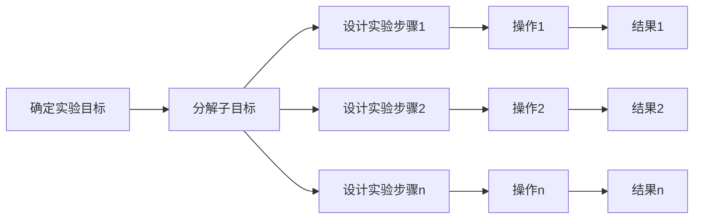

# 语言模型在多步骤实验设计中的能力

> 关键词：语言模型、多步骤实验设计、实验规划、算法原理、实际应用

> 摘要：本文深入探讨了语言模型在多步骤实验设计中的能力。首先介绍了研究的背景和目的，包括对预期读者和文档结构的说明，以及相关术语的定义。接着阐述了语言模型和多步骤实验设计的核心概念及它们之间的联系，并给出了相应的文本示意图和Mermaid流程图。详细讲解了核心算法原理，用Python代码进行了说明，同时给出了数学模型和公式并举例解释。通过项目实战展示了代码的实际案例和详细解读。分析了语言模型在多步骤实验设计中的实际应用场景，推荐了相关的学习资源、开发工具框架和论文著作。最后总结了未来的发展趋势与挑战，提供了常见问题的解答和扩展阅读的参考资料。

## 1. 背景介绍 
### 1.1 目的和范围
在当今的科研、工程和商业等众多领域，多步骤实验设计是推动创新和解决问题的关键手段。然而，设计一个高效、科学的多步骤实验往往面临诸多挑战，如实验步骤的合理规划、资源的有效分配、变量的精确控制等。语言模型作为一种强大的人工智能技术，近年来取得了显著的发展。其具备理解自然语言、生成文本的能力，为解决多步骤实验设计中的难题提供了新的思路和方法。

本文的目的在于全面探讨语言模型在多步骤实验设计中的能力，研究其如何辅助实验人员进行实验规划、优化实验方案、预测实验结果等。具体范围涵盖了语言模型的核心概念、算法原理、数学模型，以及在实际项目中的应用案例，同时分析其未来的发展趋势和面临的挑战。

### 1.2 预期读者
本文的预期读者主要包括科研工作者，他们可以借助语言模型优化自己的实验设计，提高科研效率和成果质量；工程技术人员，在产品研发和测试过程中利用语言模型进行多步骤实验设计，提升产品性能；人工智能领域的研究者，关注语言模型的新应用场景和发展方向；以及对实验设计和人工智能感兴趣的学生和爱好者，通过本文了解相关领域的前沿知识。

### 1.3 文档结构概述
本文将按照以下结构进行阐述：首先介绍核心概念，解释语言模型和多步骤实验设计的原理，并说明它们之间的联系；接着详细讲解核心算法原理，用Python代码展示具体实现步骤；给出相关的数学模型和公式，并举例说明其应用；通过项目实战，介绍开发环境搭建、源代码实现和代码解读；分析语言模型在多步骤实验设计中的实际应用场景；推荐学习资源、开发工具框架和相关论文著作；最后总结未来发展趋势与挑战，解答常见问题，并提供扩展阅读的参考资料。

### 1.4 术语表
#### 1.4.1 核心术语定义
- **语言模型**：是一种基于统计学和机器学习的模型，用于预测给定上下文下下一个单词或字符的概率分布。它通过对大量文本数据的学习，能够理解语言的模式和规律，生成自然流畅的文本。
- **多步骤实验设计**：是指包含多个连续步骤的实验方案设计，每个步骤可能有不同的操作、条件和目标。多步骤实验设计需要综合考虑实验的整体目标、步骤之间的逻辑关系、资源的合理利用等因素。
- **实验规划**：是多步骤实验设计的重要环节，包括确定实验的目标、选择合适的实验方法、安排实验步骤的顺序和时间等。
- **实验优化**：通过调整实验参数、改进实验流程等方式，提高实验的效率、准确性和可靠性。

#### 1.4.2 相关概念解释
- **自然语言处理（NLP）**：是人工智能的一个重要领域，研究如何让计算机理解、处理和生成自然语言。语言模型是自然语言处理中的核心技术之一。
- **机器学习**：是一门多领域交叉学科，涉及概率论、统计学、逼近论、凸分析、算法复杂度理论等多门学科。它专门研究计算机怎样模拟或实现人类的学习行为，以获取新的知识或技能，重新组织已有的知识结构使之不断改善自身的性能。
- **深度学习**：是机器学习的一个分支领域，它基于人工神经网络，通过构建具有多个层次的神经网络模型，自动从大量数据中学习特征和模式。

#### 1.4.3 缩略词列表
- **NLP**：Natural Language Processing（自然语言处理）
- **ML**：Machine Learning（机器学习）
- **DL**：Deep Learning（深度学习）

## 2. 核心概念与联系 

### 语言模型原理
语言模型的核心目标是根据给定的上下文预测下一个单词的概率。以基于神经网络的语言模型为例，它通常由输入层、隐藏层和输出层组成。输入层接收上下文单词的表示，隐藏层对输入信息进行非线性变换，输出层输出每个单词的概率分布。

文本示意图：
语言模型接收输入的上下文文本，经过内部的神经网络处理，输出下一个单词的概率分布。输入的上下文文本可以是一个句子、段落或更长的文本序列。神经网络通过对大量文本数据的学习，调整自身的参数，以提高预测的准确性。

Mermaid流程图：


### 多步骤实验设计原理
多步骤实验设计需要明确实验的目标，然后将目标分解为多个具体的步骤。每个步骤都有明确的操作、条件和预期结果。在设计过程中，需要考虑步骤之间的依赖关系、资源的限制以及实验的整体效率。

文本示意图：
多步骤实验设计从确定实验目标开始，将目标分解为多个子目标，每个子目标对应一个实验步骤。每个步骤包含具体的操作、所需的资源和预期的结果。步骤之间通过逻辑关系连接，形成一个完整的实验流程。

Mermaid流程图：


### 语言模型与多步骤实验设计的联系
语言模型可以为多步骤实验设计提供重要的支持。它可以理解实验人员用自然语言描述的实验目标和条件，生成合理的实验步骤和方案。例如，实验人员可以输入“设计一个关于新材料性能测试的多步骤实验”，语言模型可以根据自身的知识和学习经验，生成详细的实验步骤，包括样品制备、测试方法、数据分析等。

同时，语言模型还可以对实验方案进行优化和评估。它可以分析实验步骤之间的逻辑关系，检查是否存在不合理的地方；还可以根据实验的历史数据和相关研究，预测实验结果，为实验人员提供参考。

## 3. 核心算法原理 & 具体操作步骤 

### 基于Transformer的语言模型原理
Transformer是一种基于注意力机制的深度学习模型，在语言处理任务中取得了巨大的成功。其核心结构包括编码器和解码器。编码器将输入的文本序列转换为一系列的特征表示，解码器根据编码器的输出和之前生成的单词，生成下一个单词。

以下是一个简化的Transformer编码器层的Python代码实现：
```python
import torch
import torch.nn as nn
import torch.nn.functional as F

class MultiHeadAttention(nn.Module):
    def __init__(self, embed_size, num_heads):
        super(MultiHeadAttention, self).__init__()
        self.embed_size = embed_size
        self.num_heads = num_heads
        self.head_dim = embed_size // num_heads

        assert (
            self.head_dim * num_heads == embed_size
        ), "Embedding size needs to be divisible by number of heads"

        self.values = nn.Linear(self.head_dim, self.head_dim, bias=False)
        self.keys = nn.Linear(self.head_dim, self.head_dim, bias=False)
        self.queries = nn.Linear(self.head_dim, self.head_dim, bias=False)
        self.fc_out = nn.Linear(num_heads * self.head_dim, embed_size)

    def forward(self, values, keys, query, mask):
        N = query.shape[0]
        value_len, key_len, query_len = values.shape[1], keys.shape[1], query.shape[1]

        # Split the embedding into self.num_heads different pieces
        values = values.reshape(N, value_len, self.num_heads, self.head_dim)
        keys = keys.reshape(N, key_len, self.num_heads, self.head_dim)
        queries = query.reshape(N, query_len, self.num_heads, self.head_dim)

        values = self.values(values)
        keys = self.keys(keys)
        queries = self.queries(queries)

        # Scaled dot-product attention
        energy = torch.einsum("nqhd,nkhd->nhqk", [queries, keys])
        if mask is not None:
            energy = energy.masked_fill(mask == 0, float("-1e20"))

        attention = torch.softmax(energy / (self.embed_size ** (1 / 2)), dim=3)

        out = torch.einsum("nhql,nlhd->nqhd", [attention, values]).reshape(
            N, query_len, self.num_heads * self.head_dim
        )

        out = self.fc_out(out)
        return out


class TransformerEncoderLayer(nn.Module):
    def __init__(self, embed_size, num_heads, dropout, forward_expansion):
        super(TransformerEncoderLayer, self).__init__()
        self.attention = MultiHeadAttention(embed_size, num_heads)
        self.norm1 = nn.LayerNorm(embed_size)
        self.norm2 = nn.LayerNorm(embed_size)

        self.feed_forward = nn.Sequential(
            nn.Linear(embed_size, forward_expansion * embed_size),
            nn.ReLU(),
            nn.Linear(forward_expansion * embed_size, embed_size),
        )

        self.dropout = nn.Dropout(dropout)

    def forward(self, value, key, query, mask):
        attention = self.attention(value, key, query, mask)

        # Add skip connection, run through normalization and dropout
        x = self.dropout(self.norm1(attention + query))
        forward = self.feed_forward(x)
        out = self.dropout(self.norm2(forward + x))
        return out


```

### 语言模型在多步骤实验设计中的具体操作步骤
1. **输入实验描述**：实验人员用自然语言描述实验的目标、条件和要求，如“设计一个验证某种药物对癌症细胞抑制效果的多步骤实验，实验材料有癌细胞培养皿、药物样本、显微镜等”。
2. **语言模型处理**：语言模型接收输入的实验描述，通过内部的神经网络进行处理。首先对输入的文本进行分词、词性标注等预处理操作，然后将处理后的文本输入到Transformer编码器中，得到文本的特征表示。
3. **实验步骤生成**：解码器根据编码器的输出和之前生成的实验步骤，预测下一个实验步骤。通过不断迭代，生成完整的实验步骤序列。
4. **实验方案优化**：语言模型对生成的实验方案进行分析和评估，检查步骤之间的逻辑关系、资源的分配是否合理等。如果发现问题，对实验方案进行调整和优化。
5. **输出实验方案**：将优化后的实验方案以自然语言的形式输出给实验人员。

## 4. 数学模型和公式 & 详细讲解 & 举例说明 

### 语言模型的数学模型
语言模型的核心是计算给定上下文 $C$ 下下一个单词 $w$ 的概率 $P(w|C)$。常见的语言模型使用链式法则将联合概率分解为条件概率的乘积：

$$P(w_1, w_2, \cdots, w_n) = \prod_{i=1}^{n} P(w_i|w_1, w_2, \cdots, w_{i-1})$$

在实际应用中，为了简化计算，通常采用 $n$-gram 模型或神经网络模型。$n$-gram 模型假设一个单词的概率只依赖于它前面的 $n-1$ 个单词，即：

$$P(w_i|w_1, w_2, \cdots, w_{i-1}) \approx P(w_i|w_{i-(n-1)}, \cdots, w_{i-1})$$

神经网络语言模型则通过神经网络来学习单词之间的复杂关系，如 Transformer 模型。Transformer 模型中的注意力机制可以用以下公式表示：

$$Attention(Q, K, V) = softmax(\frac{QK^T}{\sqrt{d_k}})V$$

其中，$Q$ 是查询矩阵，$K$ 是键矩阵，$V$ 是值矩阵，$d_k$ 是键的维度。

### 多步骤实验设计的数学模型
多步骤实验设计可以看作是一个优化问题，目标是在满足一定约束条件下，最大化实验的收益或最小化实验的成本。设实验的步骤集合为 $S = \{s_1, s_2, \cdots, s_m\}$，每个步骤 $s_i$ 有对应的操作 $o_i$、资源需求 $r_i$ 和预期收益 $u_i$。实验的总资源限制为 $R$。

则多步骤实验设计的优化问题可以表示为：

$$\max \sum_{i=1}^{m} x_i u_i$$

$$\text{s.t.} \sum_{i=1}^{m} x_i r_i \leq R$$

$$x_i \in \{0, 1\}, i = 1, 2, \cdots, m$$

其中，$x_i$ 是一个二进制变量，表示是否选择步骤 $s_i$。

### 举例说明
假设我们要设计一个简单的化学实验，目标是合成某种化合物。实验步骤包括准备原料、加热反应、分离产物等。每个步骤需要一定的时间和试剂资源，并且有不同的成功率。

设步骤 1：准备原料，时间成本为 1 小时，试剂成本为 10 元，成功率为 0.9；步骤 2：加热反应，时间成本为 2 小时，试剂成本为 20 元，成功率为 0.8；步骤 3：分离产物，时间成本为 1 小时，试剂成本为 15 元，成功率为 0.7。

总时间限制为 4 小时，总试剂成本限制为 35 元。我们可以将这个问题表示为上述的优化问题，通过求解该问题，得到最优的实验步骤组合。

## 5. 项目实战：代码实际案例和详细解释说明 

### 5.1  开发环境搭建
为了实现语言模型在多步骤实验设计中的应用，我们可以使用Python和一些常见的深度学习库。以下是搭建开发环境的步骤：
1. **安装Python**：建议安装Python 3.7及以上版本。可以从Python官方网站（https://www.python.org/downloads/）下载并安装。
2. **安装深度学习库**：使用pip命令安装必要的库，如PyTorch、Transformers等。
```bash
pip install torch
pip install transformers
```
3. **安装其他辅助库**：根据具体需求，安装一些辅助库，如NumPy、Pandas等。
```bash
pip install numpy pandas
```

### 5.2  源代码详细实现和代码解读
以下是一个简单的代码示例，使用Hugging Face的Transformers库来生成多步骤实验设计方案：
```python
from transformers import pipeline

# 加载预训练的语言模型
generator = pipeline('text-generation', model='gpt2')

# 输入实验描述
experiment_description = "设计一个验证某种新肥料对植物生长影响的多步骤实验，实验材料有花盆、土壤、植物种子、新肥料、普通肥料等"

# 生成实验方案
output = generator(experiment_description, max_length=500, num_return_sequences=1)

# 输出实验方案
print(output[0]['generated_text'])


```
代码解读：
1. **加载预训练的语言模型**：使用`pipeline`函数从Hugging Face的模型库中加载预训练的GPT-2语言模型。
2. **输入实验描述**：定义一个字符串变量`experiment_description`，描述实验的目标和条件。
3. **生成实验方案**：调用`generator`函数，输入实验描述，设置生成文本的最大长度为500，返回一个实验方案。
4. **输出实验方案**：打印生成的实验方案。

### 5.3  代码解读与分析
上述代码通过调用预训练的语言模型，快速生成了一个多步骤实验设计方案。然而，这种方法也存在一些局限性。例如，生成的方案可能不够准确和详细，需要实验人员进行进一步的修改和完善。

为了提高生成方案的质量，可以考虑以下几点：
1. **微调语言模型**：使用特定领域的实验数据对预训练的语言模型进行微调，使其更好地适应多步骤实验设计的任务。
2. **结合规则和约束**：在生成过程中，加入一些实验设计的规则和约束，如步骤的先后顺序、资源的限制等，以保证生成的方案的合理性。
3. **人工干预和验证**：实验人员对生成的方案进行人工检查和验证，根据自己的专业知识进行调整和优化。

## 6. 实际应用场景 
### 科研领域
在科研领域，语言模型可以帮助科研人员设计复杂的实验方案。例如，在生物学研究中，设计一个基因编辑实验需要考虑多个步骤，如选择合适的基因编辑工具、设计实验样本、进行数据分析等。语言模型可以根据科研人员的需求，生成详细的实验步骤和方案，提高实验设计的效率和准确性。

### 工程领域
在工程领域，语言模型可用于产品研发和测试的多步骤实验设计。例如，在汽车制造中，进行发动机性能测试需要设计一系列的实验步骤，包括不同工况下的测试、数据分析和优化。语言模型可以根据产品的特点和测试要求，生成合理的实验方案，减少实验的成本和时间。

### 商业领域
在商业领域，语言模型可以应用于市场调研和产品推广的实验设计。例如，设计一个市场调研实验，需要确定调研的对象、方法、问卷内容等多个步骤。语言模型可以根据市场的需求和企业的目标，生成有效的实验方案，帮助企业更好地了解市场和客户需求。

## 7. 工具和资源推荐
### 7.1 学习资源推荐
#### 7.1.1 书籍推荐
- 《深度学习》（Deep Learning）：由Ian Goodfellow、Yoshua Bengio和Aaron Courville所著，是深度学习领域的经典教材，详细介绍了深度学习的基本原理和方法。
- 《自然语言处理入门》（Natural Language Processing with Python）：由Steven Bird、Ewan Klein和Edward Loper所著，适合初学者学习自然语言处理的基础知识和实践技巧。
- 《动手学深度学习》（Dive into Deep Learning）：由李沐等所著，提供了丰富的代码示例和实践项目，帮助读者快速掌握深度学习的应用。

#### 7.1.2 在线课程
- Coursera上的“深度学习专项课程”（Deep Learning Specialization）：由Andrew Ng教授授课，系统介绍了深度学习的各个方面，包括神经网络、卷积神经网络、循环神经网络等。
- edX上的“自然语言处理基础”（Foundations of Natural Language Processing）：讲解了自然语言处理的基本概念和方法，包括词法分析、句法分析、语义分析等。
- 哔哩哔哩上的“机器学习教程”：有很多优质的机器学习和深度学习教程，适合初学者和进阶者学习。

#### 7.1.3 技术博客和网站
- Hugging Face博客（https://huggingface.co/blog）：提供了关于自然语言处理和深度学习的最新研究成果和技术应用。
- Towards Data Science（https://towardsdatascience.com/）：是一个数据科学和人工智能领域的博客平台，有很多高质量的技术文章和案例分析。
- arXiv（https://arxiv.org/）：是一个预印本数据库，收录了大量的学术论文，包括自然语言处理、深度学习等领域的最新研究成果。

### 7.2 开发工具框架推荐
#### 7.2.1 IDE和编辑器
- PyCharm：是一款专门为Python开发设计的集成开发环境，提供了丰富的代码编辑、调试和项目管理功能。
- Jupyter Notebook：是一个交互式的开发环境，适合进行数据分析、模型训练和实验验证。用户可以在浏览器中编写和运行代码，同时可以插入文本、图片和公式等。
- Visual Studio Code：是一款轻量级的代码编辑器，支持多种编程语言和插件扩展。可以通过安装Python扩展来进行Python开发。

#### 7.2.2 调试和性能分析工具
- TensorBoard：是TensorFlow提供的一个可视化工具，可以用于监控模型的训练过程、可视化模型的结构和性能指标等。
- PyTorch Profiler：是PyTorch提供的性能分析工具，可以帮助用户分析模型的运行时间、内存使用情况等，找出性能瓶颈。
- cProfile：是Python标准库中的一个性能分析工具，可以对Python代码进行性能分析，找出耗时较长的函数和代码段。

#### 7.2.3 相关框架和库
- PyTorch：是一个开源的深度学习框架，提供了丰富的神经网络层和优化算法，支持GPU加速，广泛应用于自然语言处理、计算机视觉等领域。
- TensorFlow：是另一个流行的深度学习框架，具有高度的灵活性和可扩展性，提供了丰富的工具和库，适用于大规模的深度学习应用。
- Transformers：是Hugging Face开发的一个自然语言处理库，提供了大量的预训练语言模型和工具，方便用户进行文本生成、文本分类、问答系统等任务。

### 7.3 相关论文著作推荐
#### 7.3.1 经典论文
- “Attention Is All You Need”：提出了Transformer模型，是自然语言处理领域的里程碑式论文，为后续的语言模型发展奠定了基础。
- “BERT: Pre-training of Deep Bidirectional Transformers for Language Understanding”：介绍了BERT模型，通过预训练和微调的方式，在多个自然语言处理任务中取得了优异的成绩。
- “Generative Adversarial Nets”：提出了生成对抗网络（GAN）的概念，为生成式模型的发展提供了新的思路。

#### 7.3.2 最新研究成果
- 关注顶级学术会议如ACL（Association for Computational Linguistics）、EMNLP（Conference on Empirical Methods in Natural Language Processing）、NeurIPS（Conference on Neural Information Processing Systems）等的最新论文，了解语言模型和多步骤实验设计领域的最新研究动态。
- 关注知名科研机构和学者的研究成果，如OpenAI、Google Research、Facebook AI Research等发布的论文和报告。

#### 7.3.3 应用案例分析
- 阅读相关领域的应用案例分析文章，了解语言模型在实际项目中的应用方法和效果。例如，在医疗、金融、教育等领域的应用案例，学习如何将语言模型应用于多步骤实验设计和解决实际问题。

## 8. 总结：未来发展趋势与挑战
### 未来发展趋势
- **模型性能提升**：随着深度学习技术的不断发展，语言模型的性能将不断提升。未来的语言模型将能够更好地理解复杂的自然语言，生成更加准确、详细和合理的多步骤实验设计方案。
- **多模态融合**：将语言模型与图像、音频等多模态数据相结合，实现更加全面和丰富的实验设计。例如，在设计一个生物实验时，可以结合显微镜图像和实验描述，生成更准确的实验方案。
- **个性化定制**：根据实验人员的专业背景、实验历史和偏好，为其提供个性化的实验设计方案。语言模型可以学习实验人员的习惯和需求，不断优化生成的方案。
- **与其他技术集成**：将语言模型与机器人技术、自动化实验设备等相结合，实现实验的自动化设计和执行。例如，语言模型生成实验方案后，机器人可以自动执行实验步骤，提高实验的效率和准确性。

### 挑战
- **数据质量和数量**：语言模型的性能依赖于大量高质量的训练数据。在多步骤实验设计领域，获取丰富、准确的实验数据是一个挑战。同时，数据的标注和清洗也需要耗费大量的人力和时间。
- **知识表示和推理**：多步骤实验设计需要综合运用领域知识和逻辑推理。目前的语言模型在知识表示和推理能力方面还存在不足，难以处理复杂的实验设计问题。
- **可解释性和可靠性**：语言模型的决策过程往往是黑盒的，难以解释其生成实验方案的依据。在实际应用中，实验人员需要了解方案的可靠性和合理性，因此提高语言模型的可解释性是一个重要的挑战。
- **伦理和法律问题**：随着语言模型在多步骤实验设计中的广泛应用，可能会引发一些伦理和法律问题。例如，实验方案的责任归属、数据隐私保护等问题需要得到妥善解决。

## 9. 附录：常见问题与解答
### 问题1：语言模型生成的实验方案一定准确吗？
解答：语言模型生成的实验方案不一定完全准确。虽然语言模型可以根据大量的文本数据学习到一定的知识和模式，但它仍然存在一定的局限性。生成的方案可能存在逻辑错误、不符合实际情况等问题。因此，实验人员需要对生成的方案进行人工检查和验证，根据自己的专业知识进行调整和优化。

### 问题2：如何提高语言模型在多步骤实验设计中的性能？
解答：可以从以下几个方面提高语言模型的性能：
1. **使用高质量的训练数据**：收集和整理领域内的实验数据，对语言模型进行有针对性的训练。
2. **微调预训练模型**：使用特定领域的实验数据对预训练的语言模型进行微调，使其更好地适应多步骤实验设计的任务。
3. **结合规则和约束**：在生成过程中，加入一些实验设计的规则和约束，如步骤的先后顺序、资源的限制等，以保证生成的方案的合理性。
4. **集成其他技术**：将语言模型与知识图谱、推理引擎等技术相结合，提高其知识表示和推理能力。

### 问题3：语言模型在多步骤实验设计中的应用有哪些限制？
解答：语言模型在多步骤实验设计中的应用存在以下限制：
1. **缺乏实际经验**：语言模型是基于文本数据进行学习的，缺乏实际的实验经验。在处理一些复杂的实验设计问题时，可能无法考虑到实际操作中的细节和问题。
2. **知识更新不及时**：科学技术不断发展，新的实验方法和技术不断涌现。语言模型的知识更新可能不及时，无法提供最新的实验设计方案。
3. **对输入的依赖**：语言模型的性能很大程度上依赖于输入的实验描述。如果输入的描述不准确或不完整，生成的方案可能也会存在问题。

## 10. 扩展阅读 & 参考资料
### 扩展阅读
- 《人工智能：现代方法》（Artificial Intelligence: A Modern Approach）：全面介绍了人工智能的各个领域，包括知识表示、推理、机器学习、自然语言处理等，适合深入学习人工智能的原理和方法。
- 《数据挖掘：概念与技术》（Data Mining: Concepts and Techniques）：介绍了数据挖掘的基本概念、算法和应用，对于理解语言模型的训练数据和数据分析有很大帮助。
- 《计算语言学》（Computational Linguistics）：深入探讨了自然语言处理的理论和技术，包括句法分析、语义理解、语用分析等方面的内容。

### 参考资料
- Hugging Face官方文档（https://huggingface.co/docs）：提供了关于Transformers库的详细文档和使用示例。
- PyTorch官方文档（https://pytorch.org/docs/stable/index.html）：是PyTorch框架的官方文档，包含了丰富的API文档和教程。
- TensorFlow官方文档（https://www.tensorflow.org/api_docs）：提供了TensorFlow框架的详细文档和使用指南。

作者：AI天才研究院/AI Genius Institute & 禅与计算机程序设计艺术 /Zen And The Art of Computer Programming