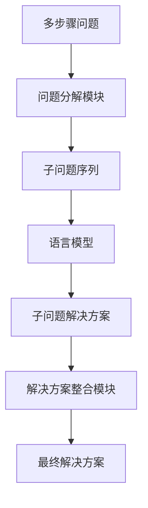

# 语言模型在多步骤问题分解与解决中的能力

> 关键词：语言模型、多步骤问题分解、问题解决、自然语言处理、推理能力

> 摘要：本文深入探讨了语言模型在多步骤问题分解与解决中的能力。首先介绍了相关背景，包括研究目的、预期读者等内容。接着阐述了核心概念与联系，通过文本示意图和Mermaid流程图直观展示。详细讲解了核心算法原理，并给出Python源代码示例。同时，对涉及的数学模型和公式进行了详细说明和举例。在项目实战部分，提供了开发环境搭建、源代码实现与解读。分析了语言模型在多步骤问题解决中的实际应用场景，推荐了学习资源、开发工具框架以及相关论文著作。最后总结了未来发展趋势与挑战，解答了常见问题并给出扩展阅读和参考资料，旨在全面剖析语言模型在多步骤问题处理方面的能力。

## 1. 背景介绍 
### 1.1 目的和范围
在当今数字化时代，自然语言处理技术取得了显著进展，语言模型作为其中的核心技术之一，正逐渐成为解决复杂问题的重要工具。本研究的目的在于深入探究语言模型在多步骤问题分解与解决中的能力，评估其在不同领域和场景下的表现，并分析其优势与局限性。范围涵盖了常见的语言模型，如GPT系列、BERT等，以及多种类型的多步骤问题，包括数学推理、逻辑分析、任务规划等。

### 1.2 预期读者
本文预期读者包括自然语言处理领域的研究人员、开发者、对人工智能技术感兴趣的学者以及相关行业的从业者。通过阅读本文，读者可以了解语言模型在多步骤问题解决中的应用现状和发展趋势，获取相关的技术知识和实践经验，为进一步的研究和开发提供参考。

### 1.3 文档结构概述
本文共分为十个部分。第一部分为背景介绍，阐述研究的目的、范围、预期读者和文档结构。第二部分介绍核心概念与联系，包括语言模型、多步骤问题分解等概念的定义和相互关系。第三部分讲解核心算法原理，并给出具体的操作步骤和Python源代码。第四部分介绍数学模型和公式，通过详细讲解和举例说明语言模型在多步骤问题解决中的数学基础。第五部分为项目实战，包括开发环境搭建、源代码实现和代码解读。第六部分分析实际应用场景，展示语言模型在不同领域的应用案例。第七部分推荐学习资源、开发工具框架和相关论文著作。第八部分总结未来发展趋势与挑战。第九部分为附录，解答常见问题。第十部分提供扩展阅读和参考资料。

### 1.4 术语表
#### 1.4.1 核心术语定义
- **语言模型**：是一种基于概率统计的模型，用于预测文本序列中每个词出现的概率。通过学习大量的文本数据，语言模型可以生成自然流畅的文本，并在各种自然语言处理任务中发挥重要作用。
- **多步骤问题分解**：将一个复杂的问题分解为多个简单的子问题，按照一定的顺序逐步解决这些子问题，最终得到原问题的解决方案。
- **问题解决**：指的是通过一系列的操作和推理，找到满足问题要求的解决方案的过程。

#### 1.4.2 相关概念解释
- **自然语言处理**：是人工智能领域的一个重要分支，旨在让计算机理解、处理和生成人类语言。语言模型是自然语言处理中的核心技术之一。
- **推理能力**：语言模型在处理多步骤问题时，需要具备一定的推理能力，能够根据已知信息推导出新的结论。

#### 1.4.3 缩略词列表
- **NLP**：Natural Language Processing，自然语言处理
- **GPT**：Generative Pretrained Transformer，生成式预训练变换器
- **BERT**：Bidirectional Encoder Representations from Transformers，基于变换器的双向编码器表示

## 2. 核心概念与联系 

### 核心概念原理
#### 语言模型
语言模型的核心原理是基于概率统计，通过学习大量的文本数据，计算文本序列中每个词出现的概率。常见的语言模型包括基于规则的模型、统计语言模型和神经网络语言模型。近年来，基于Transformer架构的预训练语言模型取得了显著的成果，如GPT和BERT。这些模型通过在大规模语料上进行无监督学习，学习到了丰富的语言知识和语义信息，能够生成高质量的文本。

#### 多步骤问题分解
多步骤问题分解是一种解决复杂问题的有效方法。其原理是将一个复杂的问题拆分成多个简单的子问题，每个子问题都比原问题更容易解决。通过逐步解决这些子问题，可以最终得到原问题的解决方案。在多步骤问题分解过程中，需要考虑子问题之间的依赖关系和顺序，确保每个子问题的解决不会影响其他子问题的求解。

### 架构的文本示意图
```plaintext
多步骤问题 --> 问题分解模块 --> 子问题序列
子问题序列 --> 语言模型 --> 子问题解决方案
子问题解决方案 --> 解决方案整合模块 --> 最终解决方案
```

### Mermaid流程图


## 3. 核心算法原理 & 具体操作步骤 

### 核心算法原理
在使用语言模型解决多步骤问题时，主要涉及到以下几个核心算法：
- **问题分解算法**：将多步骤问题分解为多个子问题。可以使用规则匹配、机器学习等方法实现。例如，可以根据问题的关键词和语法结构，将问题拆分成多个具有明确目标的子问题。
- **子问题求解算法**：使用语言模型对每个子问题进行求解。语言模型可以根据输入的子问题，生成相应的解决方案。在生成解决方案时，语言模型会考虑问题的上下文信息和自身学习到的语言知识。
- **解决方案整合算法**：将每个子问题的解决方案整合为最终的解决方案。需要考虑子问题之间的依赖关系和逻辑顺序，确保最终解决方案的正确性和完整性。

### 具体操作步骤
#### 步骤1：问题输入
接收用户输入的多步骤问题。

#### 步骤2：问题分解
使用问题分解算法将多步骤问题分解为多个子问题。可以使用以下Python代码示例：
```python
import re

def decompose_problem(problem):
    # 简单示例：根据逗号和句号分割问题
    sub_problems = re.split(r'[,.]', problem)
    sub_problems = [sub.strip() for sub in sub_problems if sub.strip()]
    return sub_problems

# 示例问题
problem = "先计算2加3的和，然后将结果乘以5，最后减去10。"
sub_problems = decompose_problem(problem)
print("子问题列表:", sub_problems)
```

#### 步骤3：子问题求解
使用语言模型对每个子问题进行求解。可以使用Hugging Face的Transformers库加载预训练的语言模型，以下是一个简单的示例：
```python
from transformers import AutoTokenizer, AutoModelForCausalLM

# 加载模型和分词器
tokenizer = AutoTokenizer.from_pretrained("gpt2")
model = AutoModelForCausalLM.from_pretrained("gpt2")

def solve_sub_problem(sub_problem):
    input_ids = tokenizer.encode(sub_problem, return_tensors='pt')
    output = model.generate(input_ids, max_length=100, num_beams=5, no_repeat_ngram_size=2, early_stopping=True)
    solution = tokenizer.decode(output[0], skip_special_tokens=True)
    return solution

# 求解每个子问题
sub_solutions = []
for sub_problem in sub_problems:
    solution = solve_sub_problem(sub_problem)
    sub_solutions.append(solution)
    print(f"子问题: {sub_problem}, 解决方案: {solution}")
```

#### 步骤4：解决方案整合
将每个子问题的解决方案整合为最终的解决方案。以下是一个简单的示例：
```python
def integrate_solutions(sub_solutions):
    final_solution = " ".join(sub_solutions)
    return final_solution

final_solution = integrate_solutions(sub_solutions)
print("最终解决方案:", final_solution)
```

## 4. 数学模型和公式 & 详细讲解 & 举例说明 

### 语言模型的数学基础
语言模型的核心是计算文本序列的概率。给定一个文本序列 $w_1, w_2, \cdots, w_n$，语言模型的目标是计算 $P(w_1, w_2, \cdots, w_n)$。根据链式法则，有：

$$P(w_1, w_2, \cdots, w_n) = \prod_{i=1}^{n} P(w_i | w_1, w_2, \cdots, w_{i-1})$$

其中，$P(w_i | w_1, w_2, \cdots, w_{i-1})$ 表示在已知前面 $i-1$ 个词的情况下，第 $i$ 个词出现的概率。

### n-gram语言模型
n-gram语言模型是一种简单的统计语言模型，它假设一个词的出现只依赖于前面的 $n-1$ 个词。因此，$P(w_i | w_1, w_2, \cdots, w_{i-1})$ 可以近似为 $P(w_i | w_{i-(n-1)}, \cdots, w_{i-1})$。

对于一个二元（$n=2$）语言模型，有：

$$P(w_i | w_{i-1}) = \frac{C(w_{i-1}, w_i)}{C(w_{i-1})}$$

其中，$C(w_{i-1}, w_i)$ 表示词对 $(w_{i-1}, w_i)$ 在训练数据中出现的次数，$C(w_{i-1})$ 表示词 $w_{i-1}$ 在训练数据中出现的次数。

### 举例说明
假设我们有一个简单的训练数据：“I love natural language processing”。对于二元语言模型，我们可以计算以下概率：

- $P(love | I) = \frac{C(I, love)}{C(I)} = \frac{1}{1} = 1$
- $P(natural | love) = \frac{C(love, natural)}{C(love)} = \frac{1}{1} = 1$

### 基于神经网络的语言模型
基于神经网络的语言模型，如Transformer架构的语言模型，通过神经网络学习文本序列的概率分布。以GPT为例，它使用了自注意力机制来捕捉文本序列中的长距离依赖关系。

假设输入的文本序列为 $x_1, x_2, \cdots, x_n$，经过嵌入层将每个词转换为向量表示 $e_1, e_2, \cdots, e_n$。然后，通过多层Transformer块进行特征提取，得到最终的隐藏状态 $h_1, h_2, \cdots, h_n$。最后，通过一个线性层将隐藏状态映射到词汇表上，得到每个词的概率分布。

具体来说，对于第 $i$ 个词的概率分布 $P(w_i | w_1, w_2, \cdots, w_{i-1})$，可以通过以下公式计算：

$$P(w_i | w_1, w_2, \cdots, w_{i-1}) = \text{softmax}(W h_i + b)$$

其中，$W$ 是线性层的权重矩阵，$b$ 是偏置向量。

## 5. 项目实战：代码实际案例和详细解释说明 

### 5.1  开发环境搭建
#### 安装Python
首先，确保你已经安装了Python 3.6或更高版本。可以从Python官方网站（https://www.python.org/downloads/）下载并安装。

#### 创建虚拟环境
为了避免不同项目之间的依赖冲突，建议使用虚拟环境。可以使用以下命令创建和激活虚拟环境：
```bash
# 创建虚拟环境
python -m venv myenv

# 激活虚拟环境（Windows）
myenv\Scripts\activate

# 激活虚拟环境（Linux/Mac）
source myenv/bin/activate
```

#### 安装依赖库
在虚拟环境中安装所需的依赖库，包括Hugging Face的Transformers库：
```bash
pip install transformers
```

### 5.2  源代码详细实现和代码解读
以下是一个完整的Python代码示例，用于使用语言模型解决一个多步骤数学问题：
```python
import re
from transformers import AutoTokenizer, AutoModelForCausalLM

# 加载模型和分词器
tokenizer = AutoTokenizer.from_pretrained("gpt2")
model = AutoModelForCausalLM.from_pretrained("gpt2")

def decompose_problem(problem):
    # 简单示例：根据逗号和句号分割问题
    sub_problems = re.split(r'[,.]', problem)
    sub_problems = [sub.strip() for sub in sub_problems if sub.strip()]
    return sub_problems

def solve_sub_problem(sub_problem):
    input_ids = tokenizer.encode(sub_problem, return_tensors='pt')
    output = model.generate(input_ids, max_length=100, num_beams=5, no_repeat_ngram_size=2, early_stopping=True)
    solution = tokenizer.decode(output[0], skip_special_tokens=True)
    return solution

def integrate_solutions(sub_solutions):
    final_solution = " ".join(sub_solutions)
    return final_solution

# 示例问题
problem = "先计算2加3的和，然后将结果乘以5，最后减去10。"

# 步骤1：问题分解
sub_problems = decompose_problem(problem)
print("子问题列表:", sub_problems)

# 步骤2：子问题求解
sub_solutions = []
for sub_problem in sub_problems:
    solution = solve_sub_problem(sub_problem)
    sub_solutions.append(solution)
    print(f"子问题: {sub_problem}, 解决方案: {solution}")

# 步骤3：解决方案整合
final_solution = integrate_solutions(sub_solutions)
print("最终解决方案:", final_solution)
```

### 5.3  代码解读与分析
#### 问题分解部分
`decompose_problem` 函数使用正则表达式将输入的问题按照逗号和句号进行分割，得到多个子问题。这种方法简单直观，但对于复杂的问题可能不够准确。在实际应用中，可以使用更复杂的自然语言处理技术，如语义分析和句法分析，来实现更精确的问题分解。

#### 子问题求解部分
`solve_sub_problem` 函数使用Hugging Face的Transformers库加载预训练的GPT-2模型，对每个子问题进行求解。具体步骤包括：
1. 使用分词器将子问题编码为输入ID。
2. 使用模型生成解决方案的输出ID。
3. 使用分词器将输出ID解码为文本。

#### 解决方案整合部分
`integrate_solutions` 函数将每个子问题的解决方案简单地拼接在一起，得到最终的解决方案。在实际应用中，可能需要根据子问题之间的依赖关系和逻辑顺序，对解决方案进行更复杂的整合。

## 6. 实际应用场景 
### 数学问题解决
语言模型可以用于解决各种数学问题，如代数、几何、微积分等。通过将复杂的数学问题分解为多个简单的子问题，语言模型可以逐步求解并得到最终答案。例如，对于一个求解方程的问题，语言模型可以先将方程化简，然后使用相应的求解方法得到方程的解。

### 任务规划
在任务规划领域，语言模型可以帮助用户制定详细的任务计划。用户可以输入一个总体目标，语言模型将其分解为多个具体的子任务，并确定每个子任务的执行顺序和所需资源。例如，在项目管理中，语言模型可以根据项目的目标和约束条件，生成详细的项目计划和进度安排。

### 逻辑推理
语言模型可以进行逻辑推理，解决各种逻辑问题，如谜题、推理游戏等。通过对问题进行分析和分解，语言模型可以逐步推导并得出结论。例如，在侦探推理游戏中，语言模型可以根据案件的线索和证据，推理出嫌疑人的身份和作案过程。

### 智能客服
在智能客服领域，语言模型可以处理用户提出的复杂问题。通过将用户的问题分解为多个子问题，语言模型可以更准确地理解用户的意图，并提供详细的解决方案。例如，当用户咨询关于产品使用和售后的问题时，语言模型可以先了解用户的具体需求，然后提供相应的操作指南和解决方案。

## 7. 工具和资源推荐
### 7.1 学习资源推荐
#### 7.1.1 书籍推荐
- 《自然语言处理入门》：这本书适合初学者，系统地介绍了自然语言处理的基本概念、算法和应用。
- 《深度学习》：详细讲解了深度学习的理论和方法，包括神经网络、卷积神经网络、循环神经网络等，对于理解语言模型的原理有很大帮助。
- 《Python自然语言处理实战》：通过实际案例介绍了如何使用Python进行自然语言处理，包括文本预处理、词法分析、句法分析等。

#### 7.1.2 在线课程
- Coursera上的“Natural Language Processing Specialization”：由顶尖大学的教授授课，系统地介绍了自然语言处理的各个方面，包括语言模型、文本分类、机器翻译等。
- edX上的“Deep Learning for Natural Language Processing”：深入讲解了深度学习在自然语言处理中的应用，包括Transformer架构、预训练语言模型等。

#### 7.1.3 技术博客和网站
- Hugging Face Blog：提供了关于自然语言处理和语言模型的最新研究成果和技术动态。
- Towards Data Science：有很多关于自然语言处理和人工智能的高质量文章，涵盖了从基础概念到前沿研究的各个方面。

### 7.2 开发工具框架推荐
#### 7.2.1 IDE和编辑器
- PyCharm：功能强大的Python集成开发环境，提供了代码编辑、调试、版本控制等功能，适合开发Python项目。
- Jupyter Notebook：交互式的开发环境，适合进行数据探索、模型训练和结果展示。

#### 7.2.2 调试和性能分析工具
- TensorBoard：用于可视化深度学习模型的训练过程和性能指标，帮助开发者监控模型的训练情况。
- Py-Spy：用于分析Python代码的性能瓶颈，找出耗时的函数和代码段。

#### 7.2.3 相关框架和库
- Hugging Face Transformers：提供了各种预训练的语言模型和工具，方便开发者进行自然语言处理任务的开发。
- NLTK（Natural Language Toolkit）：一个流行的Python自然语言处理库，提供了丰富的工具和数据集，用于文本处理、词法分析、句法分析等。

### 7.3 相关论文著作推荐
#### 7.3.1 经典论文
- “Attention Is All You Need”：提出了Transformer架构，为现代语言模型的发展奠定了基础。
- “BERT: Pre-training of Deep Bidirectional Transformers for Language Understanding”：介绍了BERT模型，开创了预训练语言模型的先河。

#### 7.3.2 最新研究成果
- 关注顶级学术会议如ACL（Association for Computational Linguistics）、EMNLP（Conference on Empirical Methods in Natural Language Processing）等，了解语言模型在多步骤问题解决方面的最新研究进展。

#### 7.3.3 应用案例分析
- 可以参考一些实际应用案例的论文，了解语言模型在不同领域的应用方法和效果，如医疗领域的疾病诊断、金融领域的风险评估等。

## 8. 总结：未来发展趋势与挑战
### 未来发展趋势
#### 模型能力提升
随着技术的不断进步，语言模型的能力将不断提升。未来的语言模型将能够更好地理解和处理复杂的自然语言，具备更强的推理能力和问题解决能力。例如，能够处理更复杂的多步骤问题，提供更准确和详细的解决方案。

#### 跨领域应用拓展
语言模型将在更多领域得到广泛应用，如医疗、教育、金融等。通过与不同领域的专业知识相结合，语言模型可以为这些领域提供更智能的决策支持和服务。例如，在医疗领域，语言模型可以辅助医生进行疾病诊断和治疗方案制定。

#### 与其他技术融合
语言模型将与其他人工智能技术，如计算机视觉、知识图谱等进行深度融合。通过多模态信息的处理和利用，语言模型可以提供更全面和准确的信息，解决更复杂的问题。例如，在智能客服中，结合计算机视觉技术可以实现图像识别和视频分析，提供更丰富的服务。

### 挑战
#### 数据质量和数量
语言模型的性能高度依赖于训练数据的质量和数量。获取大规模、高质量的标注数据是一个挑战，特别是在一些特定领域。此外，数据的隐私和安全问题也需要得到重视。

#### 推理能力和可解释性
虽然语言模型在生成文本方面取得了很大进展，但在推理能力和可解释性方面仍存在不足。语言模型往往只能给出结果，而无法解释其推理过程。提高语言模型的推理能力和可解释性是未来研究的重要方向。

#### 对抗攻击和鲁棒性
语言模型容易受到对抗攻击，即通过对输入文本进行微小的修改，使模型产生错误的输出。提高语言模型的鲁棒性，抵抗对抗攻击是一个亟待解决的问题。

## 9. 附录：常见问题与解答
### 问题1：语言模型在多步骤问题分解中是否总是准确的？
解答：不是。目前的语言模型在多步骤问题分解中存在一定的局限性。简单的问题分解方法，如基于规则的分割，可能无法处理复杂的问题。更复杂的自然语言处理技术虽然可以提高分解的准确性，但仍然不能保证100%的准确率。此外，语言模型的理解能力和推理能力也会影响问题分解的准确性。

### 问题2：如何选择合适的语言模型来解决多步骤问题？
解答：选择合适的语言模型需要考虑多个因素。首先，要根据问题的类型和难度选择模型的规模和复杂度。对于简单的问题，可以选择较小的模型；对于复杂的问题，可能需要选择较大的预训练模型。其次，要考虑模型的训练数据和适用领域。不同的模型在不同的领域可能有不同的表现。最后，还需要考虑模型的计算资源需求和部署成本。

### 问题3：语言模型在解决多步骤问题时的效率如何？
解答：语言模型的效率受到多个因素的影响，包括模型的规模、输入的长度和计算资源等。较大的模型通常需要更多的计算资源和时间来进行推理。此外，输入的长度也会影响推理的效率，较长的输入需要更多的计算时间。在实际应用中，可以通过优化模型结构、使用高效的计算设备等方法来提高语言模型的效率。

## 10. 扩展阅读 & 参考资料
### 扩展阅读
- 《人工智能：现代方法》：全面介绍了人工智能的各个方面，包括自然语言处理、机器学习、知识表示等。
- 《动手学深度学习》：通过实际案例和代码实现，详细介绍了深度学习的理论和实践。

### 参考资料
- Hugging Face官方文档：https://huggingface.co/docs
- NLTK官方文档：https://www.nltk.org/
- ACL、EMNLP等学术会议论文集

作者：AI天才研究院/AI Genius Institute & 禅与计算机程序设计艺术 /Zen And The Art of Computer Programming