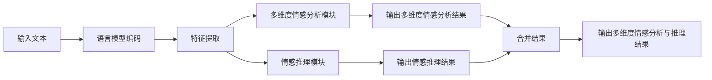

# 语言模型在多维度情感分析与推理中的表现

> 关键词：语言模型、多维度情感分析、情感推理、自然语言处理、深度学习

> 摘要：本文深入探讨了语言模型在多维度情感分析与推理中的表现。首先介绍了相关背景，包括目的、预期读者、文档结构和术语表。接着阐述了核心概念与联系，给出了原理和架构的文本示意图及 Mermaid 流程图。详细讲解了核心算法原理和具体操作步骤，并结合 Python 代码进行说明。同时，介绍了相关的数学模型和公式，并举例说明。通过项目实战，展示了代码实际案例及详细解释。分析了语言模型在多维度情感分析与推理中的实际应用场景，推荐了学习资源、开发工具框架和相关论文著作。最后总结了未来发展趋势与挑战，并提供了常见问题解答和扩展阅读参考资料。

## 1. 背景介绍 
### 1.1 目的和范围
在当今信息爆炸的时代，大量的文本数据蕴含着丰富的情感信息。多维度情感分析与推理旨在从文本中准确识别和理解不同层面的情感倾向，这对于企业了解客户反馈、舆情监测、社交媒体分析等领域具有重要意义。语言模型作为自然语言处理领域的核心技术之一，其在多维度情感分析与推理中的表现备受关注。本文的目的是全面评估语言模型在这一任务中的性能，分析其优势和不足，并探讨未来的发展方向。

本文的范围涵盖了语言模型在多维度情感分析与推理中的基本概念、算法原理、数学模型、实际应用案例以及相关的工具和资源。

### 1.2 预期读者
本文的预期读者包括自然语言处理领域的研究人员、开发者、对情感分析和语言模型感兴趣的技术爱好者，以及希望利用语言模型进行多维度情感分析与推理的企业和机构。

### 1.3 文档结构概述
本文将按照以下结构进行组织：
1. 背景介绍：介绍文章的目的、预期读者、文档结构和术语表。
2. 核心概念与联系：阐述多维度情感分析与推理的核心概念，给出原理和架构的文本示意图及 Mermaid 流程图。
3. 核心算法原理 & 具体操作步骤：详细讲解语言模型在多维度情感分析与推理中的核心算法原理，并结合 Python 代码进行说明。
4. 数学模型和公式 & 详细讲解 & 举例说明：介绍相关的数学模型和公式，并举例说明其应用。
5. 项目实战：代码实际案例和详细解释说明：通过实际项目案例，展示语言模型在多维度情感分析与推理中的代码实现和详细解释。
6. 实际应用场景：分析语言模型在多维度情感分析与推理中的实际应用场景。
7. 工具和资源推荐：推荐学习资源、开发工具框架和相关论文著作。
8. 总结：未来发展趋势与挑战：总结语言模型在多维度情感分析与推理中的未来发展趋势和面临的挑战。
9. 附录：常见问题与解答：提供常见问题的解答。
10. 扩展阅读 & 参考资料：提供扩展阅读和参考资料。

### 1.4 术语表
#### 1.4.1 核心术语定义
- **语言模型**：是一种对语言进行建模的概率模型，用于预测文本序列中下一个词出现的概率。常见的语言模型包括基于统计的语言模型和基于深度学习的语言模型，如 BERT、GPT 等。
- **多维度情感分析**：不仅仅考虑文本的整体情感倾向（如积极、消极、中性），还从多个维度（如情感强度、情感类别、情感对象等）对文本中的情感信息进行分析。
- **情感推理**：根据文本中的信息和上下文，推断出隐含的情感信息和情感关系。

#### 1.4.2 相关概念解释
- **自然语言处理（NLP）**：是计算机科学和人工智能领域的一个重要分支，旨在让计算机理解和处理人类语言。多维度情感分析与推理是自然语言处理的一个重要应用领域。
- **深度学习**：是一种基于人工神经网络的机器学习方法，在自然语言处理领域取得了显著的成果。语言模型通常基于深度学习技术构建。

#### 1.4.3 缩略词列表
- **BERT**：Bidirectional Encoder Representations from Transformers，一种基于 Transformer 架构的预训练语言模型。
- **GPT**：Generative Pretrained Transformer，一种基于 Transformer 架构的生成式预训练语言模型。
- **NLP**：Natural Language Processing，自然语言处理。

## 2. 核心概念与联系 

### 核心概念原理
多维度情感分析与推理的核心目标是从文本中提取丰富的情感信息，并进行深入的分析和推理。语言模型在这一过程中起到了关键作用。语言模型通过学习大量的文本数据，能够理解语言的语义和语法结构，从而为情感分析和推理提供基础。

在多维度情感分析中，语言模型可以帮助识别文本中的情感词、情感短语和情感句子，并分析它们的情感倾向和强度。同时，语言模型还可以考虑文本的上下文信息，从而更准确地判断情感的维度和对象。

在情感推理方面，语言模型可以根据文本中的信息和逻辑关系，推断出隐含的情感信息。例如，通过分析文本中的因果关系、对比关系等，语言模型可以推断出作者的真实情感和态度。

### 架构的文本示意图
```plaintext
输入文本 -> 语言模型编码 -> 特征提取 -> 多维度情感分析模块 -> 情感推理模块 -> 输出多维度情感分析与推理结果
```

### Mermaid 流程图


## 3. 核心算法原理 & 具体操作步骤 

### 核心算法原理
在多维度情感分析与推理中，常用的语言模型包括 BERT 和 GPT 等。下面以 BERT 为例，介绍其核心算法原理。

BERT 是一种基于 Transformer 架构的预训练语言模型，它采用了双向注意力机制，能够同时考虑文本的前后文信息。BERT 的训练过程分为两个阶段：预训练和微调。

在预训练阶段，BERT 在大规模无监督文本数据上进行训练，学习语言的通用表示。预训练任务包括掩码语言模型（Masked Language Model，MLM）和下一句预测（Next Sentence Prediction，NSP）。

在微调阶段，BERT 在特定的任务数据集上进行微调，以适应具体的任务需求。在多维度情感分析与推理任务中，我们可以在 BERT 的基础上添加全连接层，将 BERT 的输出映射到情感标签空间。

### 具体操作步骤
以下是使用 Python 和 PyTorch 实现基于 BERT 的多维度情感分析与推理的具体步骤：

```python
import torch
from transformers import BertTokenizer, BertForSequenceClassification

# 1. 加载预训练的 BERT 模型和分词器
tokenizer = BertTokenizer.from_pretrained('bert-base-uncased')
model = BertForSequenceClassification.from_pretrained('bert-base-uncased', num_labels=3)  # 假设分为积极、消极、中性三类

# 2. 准备输入文本
text = "This movie is really amazing!"
inputs = tokenizer(text, return_tensors='pt')

# 3. 进行情感分析
with torch.no_grad():
    outputs = model(**inputs)
    logits = outputs.logits
    predictions = torch.argmax(logits, dim=1)

# 4. 输出结果
label_map = {0: '消极', 1: '中性', 2: '积极'}
result = label_map[predictions.item()]
print(f"文本情感倾向: {result}")
```

### 代码解释
1. **加载预训练的 BERT 模型和分词器**：使用 `transformers` 库加载预训练的 BERT 模型和分词器。
2. **准备输入文本**：使用分词器将输入文本转换为模型可以接受的输入格式。
3. **进行情感分析**：在无梯度模式下，将输入文本传入模型，得到模型的输出。通过 `torch.argmax` 函数获取预测的情感标签。
4. **输出结果**：将预测的标签映射为具体的情感类别，并输出结果。

## 4. 数学模型和公式 & 详细讲解 & 举例说明 

### 数学模型和公式
在基于 BERT 的多维度情感分析与推理中，主要涉及以下数学模型和公式。

#### 1. 掩码语言模型（MLM）
在 MLM 任务中，输入文本中的一部分词被随机掩码，模型的目标是预测这些掩码词。设输入文本为 $X = [x_1, x_2, \cdots, x_n]$，掩码后的文本为 $\tilde{X} = [\tilde{x}_1, \tilde{x}_2, \cdots, \tilde{x}_n]$，其中 $\tilde{x}_i$ 可能是掩码词。模型的输出是每个位置的词预测概率分布 $P = [P_1, P_2, \cdots, P_n]$，其中 $P_i$ 是第 $i$ 个位置的词预测概率分布。

MLM 的损失函数通常使用交叉熵损失：
$$
L_{MLM} = - \sum_{i \in M} \log P_i(y_i)
$$
其中 $M$ 是掩码位置的集合，$y_i$ 是第 $i$ 个位置的真实词。

#### 2. 下一句预测（NSP）
在 NSP 任务中，模型的输入是两个句子 $A$ 和 $B$，模型的目标是预测 $B$ 是否是 $A$ 的下一句。设输入为 $(A, B)$，模型的输出是一个二分类概率分布 $P_{NSP}$，表示 $B$ 是 $A$ 的下一句的概率。

NSP 的损失函数同样使用交叉熵损失：
$$
L_{NSP} = - y \log P_{NSP} - (1 - y) \log (1 - P_{NSP})
$$
其中 $y$ 是真实标签，$y = 1$ 表示 $B$ 是 $A$ 的下一句，$y = 0$ 表示 $B$ 不是 $A$ 的下一句。

#### 3. 微调阶段的损失函数
在微调阶段，模型的目标是将输入文本分类到不同的情感类别中。设输入文本为 $X$，模型的输出是一个概率分布 $P_{class}$，表示文本属于每个情感类别的概率。

微调阶段的损失函数同样使用交叉熵损失：
$$
L_{class} = - \sum_{i = 1}^{C} y_i \log P_{class}(i)
$$
其中 $C$ 是情感类别的数量，$y_i$ 是真实标签的第 $i$ 个分量，$y_i = 1$ 表示文本属于第 $i$ 个情感类别，$y_i = 0$ 表示文本不属于第 $i$ 个情感类别。

### 详细讲解
- **掩码语言模型（MLM）**：MLM 任务通过随机掩码输入文本中的一部分词，迫使模型学习上下文信息，从而提高模型的语言理解能力。在训练过程中，模型需要根据上下文信息预测掩码词，这使得模型能够捕捉到语言的语义和语法结构。
- **下一句预测（NSP）**：NSP 任务用于学习句子之间的逻辑关系。通过判断两个句子是否是连续的，模型能够理解句子之间的连贯性和关联性。
- **微调阶段的损失函数**：在微调阶段，模型在特定的任务数据集上进行训练，通过最小化交叉熵损失，将输入文本分类到不同的情感类别中。

### 举例说明
假设我们有一个输入文本 "This movie is really amazing!"，在 MLM 任务中，我们可能会随机掩码 "amazing" 这个词，模型需要根据上下文信息预测出 "amazing" 这个词。在 NSP 任务中，我们可能会将这个句子和另一个句子 "I really enjoyed watching it." 组合在一起，模型需要判断第二个句子是否是第一个句子的下一句。在微调阶段，我们将这个文本输入到模型中，模型需要将其分类到积极、消极或中性情感类别中。

## 5. 项目实战：代码实际案例和详细解释说明 

### 5.1  开发环境搭建
#### 安装 Python
首先，确保你已经安装了 Python 3.6 或更高版本。你可以从 Python 官方网站（https://www.python.org/downloads/） 下载并安装 Python。

#### 创建虚拟环境
为了避免不同项目之间的依赖冲突，建议使用虚拟环境。可以使用 `venv` 模块创建虚拟环境：
```bash
python -m venv myenv
```
激活虚拟环境：
- 在 Windows 上：
```bash
myenv\Scripts\activate
```
- 在 Linux 或 macOS 上：
```bash
source myenv/bin/activate
```

#### 安装依赖库
在虚拟环境中安装所需的依赖库，包括 `torch` 和 `transformers`：
```bash
pip install torch transformers
```

### 5.2  源代码详细实现和代码解读
以下是一个完整的基于 BERT 的多维度情感分析与推理的代码示例：

```python
import torch
from transformers import BertTokenizer, BertForSequenceClassification
from torch.utils.data import DataLoader, Dataset
from sklearn.model_selection import train_test_split
import pandas as pd

# 定义数据集类
class SentimentDataset(Dataset):
    def __init__(self, texts, labels, tokenizer, max_length):
        self.texts = texts
        self.labels = labels
        self.tokenizer = tokenizer
        self.max_length = max_length

    def __len__(self):
        return len(self.texts)

    def __getitem__(self, idx):
        text = str(self.texts[idx])
        label = self.labels[idx]
        encoding = self.tokenizer.encode_plus(
            text,
            add_special_tokens=True,
            max_length=self.max_length,
            padding='max_length',
            truncation=True,
            return_tensors='pt'
        )
        return {
            'input_ids': encoding['input_ids'].flatten(),
            'attention_mask': encoding['attention_mask'].flatten(),
            'labels': torch.tensor(label, dtype=torch.long)
        }

# 加载数据集
data = pd.read_csv('sentiment_data.csv')
texts = data['text'].tolist()
labels = data['label'].tolist()

# 划分训练集和测试集
train_texts, test_texts, train_labels, test_labels = train_test_split(texts, labels, test_size=0.2, random_state=42)

# 初始化分词器和模型
tokenizer = BertTokenizer.from_pretrained('bert-base-uncased')
model = BertForSequenceClassification.from_pretrained('bert-base-uncased', num_labels=3)

# 创建数据集和数据加载器
max_length = 128
train_dataset = SentimentDataset(train_texts, train_labels, tokenizer, max_length)
test_dataset = SentimentDataset(test_texts, test_labels, tokenizer, max_length)

train_dataloader = DataLoader(train_dataset, batch_size=16, shuffle=True)
test_dataloader = DataLoader(test_dataset, batch_size=16, shuffle=False)

# 定义训练参数
device = torch.device('cuda' if torch.cuda.is_available() else 'cpu')
model.to(device)

optimizer = torch.optim.AdamW(model.parameters(), lr=2e-5)
num_epochs = 3

# 训练模型
for epoch in range(num_epochs):
    model.train()
    total_loss = 0
    for batch in train_dataloader:
        input_ids = batch['input_ids'].to(device)
        attention_mask = batch['attention_mask'].to(device)
        labels = batch['labels'].to(device)

        optimizer.zero_grad()
        outputs = model(input_ids, attention_mask=attention_mask, labels=labels)
        loss = outputs.loss
        total_loss += loss.item()

        loss.backward()
        optimizer.step()

    print(f'Epoch {epoch + 1}/{num_epochs}, Loss: {total_loss / len(train_dataloader)}')

# 评估模型
model.eval()
correct_predictions = 0
total_predictions = 0

with torch.no_grad():
    for batch in test_dataloader:
        input_ids = batch['input_ids'].to(device)
        attention_mask = batch['attention_mask'].to(device)
        labels = batch['labels'].to(device)

        outputs = model(input_ids, attention_mask=attention_mask)
        logits = outputs.logits
        predictions = torch.argmax(logits, dim=1)

        correct_predictions += (predictions == labels).sum().item()
        total_predictions += labels.size(0)

accuracy = correct_predictions / total_predictions
print(f'Test Accuracy: {accuracy}')
```

### 代码解读与分析
#### 数据集类 `SentimentDataset`
- `__init__` 方法：初始化数据集，包括文本数据、标签数据、分词器和最大长度。
- `__len__` 方法：返回数据集的长度。
- `__getitem__` 方法：根据索引获取数据集中的一个样本，将文本进行分词和编码，并返回输入 ID、注意力掩码和标签。

#### 数据加载与划分
- 使用 `pandas` 库加载数据集，并将文本和标签分别存储在列表中。
- 使用 `train_test_split` 函数将数据集划分为训练集和测试集。

#### 模型初始化
- 加载预训练的 BERT 分词器和模型，并根据任务需求设置情感类别的数量。

#### 数据集和数据加载器
- 创建 `SentimentDataset` 实例，并使用 `DataLoader` 进行数据加载。

#### 训练参数设置
- 选择设备（CPU 或 GPU），并将模型移动到相应的设备上。
- 定义优化器和训练轮数。

#### 模型训练
- 在每个训练轮次中，将模型设置为训练模式，遍历训练数据加载器，计算损失并进行反向传播和参数更新。

#### 模型评估
- 将模型设置为评估模式，遍历测试数据加载器，计算预测结果并统计准确率。

## 6. 实际应用场景 
### 客户反馈分析
企业可以利用语言模型进行多维度情感分析与推理，对客户的反馈信息进行深入分析。通过了解客户的情感倾向和需求，企业可以及时调整产品和服务，提高客户满意度。例如，在电商平台上，对用户的商品评价进行情感分析，了解用户对商品的满意度和意见，以便改进商品质量和营销策略。

### 舆情监测
在社交媒体和新闻媒体中，大量的文本信息反映了公众的情绪和态度。通过语言模型进行多维度情感分析与推理，可以实时监测舆情动态，及时发现潜在的危机和热点话题。政府和企业可以根据舆情分析结果，制定相应的应对策略，引导舆论走向。

### 市场调研
在市场调研中，语言模型可以帮助分析消费者的情感和需求。通过对社交媒体、论坛等渠道的文本数据进行分析，了解消费者对不同产品和品牌的看法和评价，为企业的市场决策提供依据。

### 智能客服
在智能客服系统中，语言模型可以用于理解用户的情感和意图，提供更加个性化和人性化的服务。通过对用户的问题进行情感分析，智能客服可以根据用户的情绪状态调整回复策略，提高用户体验。

## 7. 工具和资源推荐
### 7.1 学习资源推荐
#### 7.1.1 书籍推荐
- 《自然语言处理入门》：介绍了自然语言处理的基本概念、算法和技术，适合初学者入门。
- 《深度学习》：详细讲解了深度学习的原理和方法，包括神经网络、卷积神经网络、循环神经网络等，对于理解语言模型的原理有很大帮助。
- 《基于深度学习的自然语言处理》：介绍了深度学习在自然语言处理中的应用，包括词向量、语言模型、情感分析等。

#### 7.1.2 在线课程
- Coursera 上的 “Natural Language Processing Specialization”：由斯坦福大学教授授课，系统地介绍了自然语言处理的各个方面。
- edX 上的 “Deep Learning for Natural Language Processing”：深入讲解了深度学习在自然语言处理中的应用。
- 吴恩达的 “DeepLearning.AI TensorFlow Developer Professional Certificate”：介绍了 TensorFlow 框架的使用，对于实现语言模型和情感分析有很大帮助。

#### 7.1.3 技术博客和网站
- Hugging Face Blog：提供了关于语言模型和自然语言处理的最新研究成果和技术文章。
- Medium 上的 “Towards Data Science”：有很多关于自然语言处理和机器学习的优质文章。
- 机器之心：关注人工智能领域的最新动态和技术发展，提供了很多有价值的信息。

### 7.2 开发工具框架推荐
#### 7.2.1 IDE和编辑器
- PyCharm：一款专业的 Python 集成开发环境，提供了丰富的代码编辑、调试和版本控制功能。
- Jupyter Notebook：一种交互式的开发环境，适合进行数据分析和模型实验。
- Visual Studio Code：一款轻量级的代码编辑器，支持多种编程语言和插件扩展。

#### 7.2.2 调试和性能分析工具
- TensorBoard：用于可视化深度学习模型的训练过程和性能指标。
- PyTorch Profiler：可以帮助分析 PyTorch 模型的性能瓶颈，优化代码效率。
- cProfile：Python 内置的性能分析工具，可以分析代码的运行时间和函数调用次数。

#### 7.2.3 相关框架和库
- Transformers：Hugging Face 开发的一个强大的自然语言处理库，提供了多种预训练的语言模型和工具。
- PyTorch：一个开源的深度学习框架，广泛应用于自然语言处理和计算机视觉领域。
- TensorFlow：Google 开发的深度学习框架，具有丰富的工具和资源。

### 7.3 相关论文著作推荐
#### 7.3.1 经典论文
- “Attention Is All You Need”：介绍了 Transformer 架构，是现代语言模型的基础。
- “BERT: Pre-training of Deep Bidirectional Transformers for Language Understanding”：提出了 BERT 模型，在自然语言处理领域取得了显著的成果。
- “Generative Pretrained Transformer 3 (GPT-3): Its Nature, Scope, Limits, and Consequences”：介绍了 GPT-3 模型的特点和应用。

#### 7.3.2 最新研究成果
- 关注 ACL（Association for Computational Linguistics）、EMNLP（Conference on Empirical Methods in Natural Language Processing）等自然语言处理领域的顶级会议，了解最新的研究成果。
- 查阅 arXiv 上的相关论文，获取最新的技术进展。

#### 7.3.3 应用案例分析
- 可以参考一些企业和机构发布的关于语言模型在多维度情感分析与推理中的应用案例，了解实际应用中的经验和挑战。

## 8. 总结：未来发展趋势与挑战
### 未来发展趋势
- **多模态融合**：将语言模型与图像、音频等多模态数据进行融合，实现更加全面和准确的情感分析与推理。例如，结合视频中的语音和表情信息，更准确地判断人物的情感状态。
- **个性化情感分析**：根据用户的个人信息和历史行为，为用户提供个性化的情感分析服务。例如，针对不同年龄、性别、兴趣爱好的用户，采用不同的情感分析模型和策略。
- **低资源语言的情感分析**：目前的语言模型主要集中在英语等少数高资源语言上，未来将逐渐关注低资源语言的情感分析，扩大情感分析的应用范围。
- **实时情感分析**：随着实时数据的不断增加，对实时情感分析的需求也越来越大。未来的语言模型将具备更高的实时处理能力，能够及时分析和反馈情感信息。

### 挑战
- **情感理解的复杂性**：情感是一种复杂的心理现象，受到文化、语境、个人经历等多种因素的影响。语言模型在理解和分析情感时，仍然面临着很大的挑战。
- **数据质量和标注成本**：高质量的标注数据是训练语言模型的关键，但数据标注的成本较高，且容易受到标注者主观因素的影响。如何获取高质量的标注数据是一个亟待解决的问题。
- **模型的可解释性**：目前的语言模型大多是基于深度学习的黑盒模型，缺乏可解释性。在一些对解释性要求较高的应用场景中，如医疗、法律等领域，模型的可解释性是一个重要的挑战。
- **计算资源的需求**：训练和运行大型语言模型需要大量的计算资源，这对于一些小型企业和研究机构来说是一个很大的挑战。如何降低模型的计算成本，提高模型的效率是未来的研究方向之一。

## 9. 附录：常见问题与解答
### 问题 1：如何选择合适的语言模型进行多维度情感分析与推理？
解答：选择合适的语言模型需要考虑多个因素，如任务的复杂度、数据的规模和特点、计算资源的限制等。对于一般的情感分析任务，BERT 等预训练语言模型已经取得了很好的效果。如果任务对生成能力有较高要求，可以考虑使用 GPT 等生成式语言模型。

### 问题 2：如何处理数据中的噪声和错误标注？
解答：可以采用数据清洗和数据增强的方法处理数据中的噪声和错误标注。数据清洗可以去除重复数据、无效数据和异常数据。数据增强可以通过随机替换、插入、删除等操作增加数据的多样性，提高模型的鲁棒性。

### 问题 3：如何评估语言模型在多维度情感分析与推理中的性能？
解答：可以使用准确率、召回率、F1 值等指标评估模型的性能。此外，还可以使用混淆矩阵、ROC 曲线等可视化工具直观地展示模型的性能。在实际应用中，还需要考虑模型的可解释性、实时性等因素。

### 问题 4：如何提高语言模型在多维度情感分析与推理中的性能？
解答：可以从以下几个方面提高模型的性能：
- 使用更多的训练数据，提高模型的泛化能力。
- 调整模型的超参数，如学习率、批次大小等。
- 采用更复杂的模型架构，如结合多种模型进行集成学习。
- 进行数据增强和特征工程，提高数据的质量和特征的表达能力。

## 10. 扩展阅读 & 参考资料
### 扩展阅读
- 《人工智能：现代方法》：全面介绍了人工智能的基本概念、算法和应用，对于理解自然语言处理和语言模型的背景有很大帮助。
- 《自然语言处理实战：基于Scikit - learn、Keras和TensorFlow》：通过实际案例介绍了自然语言处理的应用和实现方法。
- 《Python自然语言处理》：介绍了使用 Python 进行自然语言处理的工具和技术。

### 参考资料
- Hugging Face 官方文档：https://huggingface.co/docs
- PyTorch 官方文档：https://pytorch.org/docs/stable/index.html
- TensorFlow 官方文档：https://www.tensorflow.org/api_docs

作者：AI天才研究院/AI Genius Institute & 禅与计算机程序设计艺术 /Zen And The Art of Computer Programming