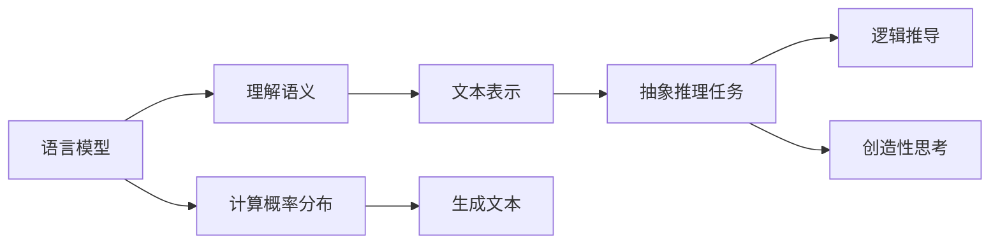

# 语言模型在抽象推理任务中的表现优化

> 关键词：语言模型、抽象推理任务、表现优化、自然语言处理、深度学习

> 摘要：本文聚焦于语言模型在抽象推理任务中的表现优化。随着自然语言处理技术的发展，语言模型在多种任务中展现出强大能力，但在抽象推理任务中仍面临诸多挑战。文章首先介绍相关背景知识，包括目的范围、预期读者等。接着阐述语言模型和抽象推理任务的核心概念与联系，深入剖析核心算法原理并给出具体操作步骤，通过数学模型和公式详细讲解推理过程。以实际项目案例展示代码实现和解读，探讨语言模型在不同场景下的应用。推荐相关学习资源、开发工具框架和论文著作，最后总结未来发展趋势与挑战，解答常见问题并提供扩展阅读和参考资料，旨在为提升语言模型在抽象推理任务中的性能提供全面而深入的指导。

## 1. 背景介绍 
### 1.1 目的和范围
随着人工智能技术的飞速发展，语言模型在自然语言处理领域取得了显著进展。然而，语言模型在处理抽象推理任务时，往往难以达到令人满意的效果。抽象推理任务要求模型能够理解复杂的语义关系、进行逻辑推导和创造性思考。本文章的目的在于深入探讨如何优化语言模型在抽象推理任务中的表现，通过对相关理论、算法和实践的研究，为研究者和开发者提供有价值的参考。

本文章的范围涵盖语言模型的基本原理、抽象推理任务的特点和挑战、优化语言模型的核心算法和技术，以及实际应用案例和未来发展趋势等方面。通过全面而系统的研究，希望能够为提升语言模型在抽象推理任务中的性能提供有效的解决方案。

### 1.2 预期读者
本文预期读者包括自然语言处理领域的研究者、人工智能开发者、对语言模型和抽象推理任务感兴趣的技术爱好者，以及相关专业的学生。对于研究者，本文提供了前沿的研究思路和方法；对于开发者，本文给出了具体的技术实现和优化方案；对于技术爱好者和学生，本文则有助于他们深入理解语言模型和抽象推理任务的相关知识。

### 1.3 文档结构概述
本文共分为十个部分。第一部分为背景介绍，包括目的和范围、预期读者、文档结构概述和术语表；第二部分阐述语言模型和抽象推理任务的核心概念与联系，并给出相应的示意图和流程图；第三部分详细讲解核心算法原理和具体操作步骤，同时提供Python源代码；第四部分介绍数学模型和公式，并进行详细讲解和举例说明；第五部分通过项目实战展示代码实际案例和详细解释说明；第六部分探讨语言模型在抽象推理任务中的实际应用场景；第七部分推荐相关的学习资源、开发工具框架和论文著作；第八部分总结未来发展趋势与挑战；第九部分为附录，解答常见问题；第十部分提供扩展阅读和参考资料。

### 1.4 术语表
#### 1.4.1 核心术语定义
- **语言模型**：是一种对自然语言进行建模的概率模型，用于预测给定上下文下下一个词或字符出现的概率。
- **抽象推理任务**：指需要理解复杂语义关系、进行逻辑推导和创造性思考的自然语言处理任务，如文本推理、问答系统中的复杂问题解答等。
- **表现优化**：通过各种技术和方法提高语言模型在特定任务中的性能，如准确率、召回率、F1值等。

#### 1.4.2 相关概念解释
- **自然语言处理**：是人工智能的一个重要领域，研究如何让计算机理解和处理人类语言，包括文本分类、情感分析、机器翻译等任务。
- **深度学习**：是一种基于人工神经网络的机器学习方法，通过构建多层神经网络来学习数据的复杂特征和模式。

#### 1.4.3 缩略词列表
- **NLP**：Natural Language Processing，自然语言处理
- **LM**：Language Model，语言模型
- **RNN**：Recurrent Neural Network，循环神经网络
- **LSTM**：Long Short - Term Memory，长短期记忆网络
- **GRU**：Gated Recurrent Unit，门控循环单元
- **Transformer**：一种基于自注意力机制的深度学习模型架构

## 2. 核心概念与联系 

### 语言模型的核心概念
语言模型的主要目标是计算一个句子或文本序列的概率。给定一个文本序列 $w_1, w_2, \cdots, w_n$，语言模型的任务是估计 $P(w_1, w_2, \cdots, w_n)$ 的值。通常，根据链式法则，$P(w_1, w_2, \cdots, w_n)=\prod_{i = 1}^{n}P(w_i|w_1, \cdots, w_{i - 1})$。

早期的语言模型，如 $n$ - 元语法模型，假设当前词的出现只依赖于前面的 $n - 1$ 个词，即 $P(w_i|w_1, \cdots, w_{i - 1})\approx P(w_i|w_{i - n + 1}, \cdots, w_{i - 1})$。这种模型简单但存在数据稀疏和长距离依赖问题。

随着深度学习的发展，基于神经网络的语言模型逐渐成为主流。如RNN、LSTM、GRU等循环神经网络模型，能够处理序列数据，但在处理长序列时仍然存在梯度消失或梯度爆炸的问题。而Transformer模型通过自注意力机制，能够有效地捕捉序列中的长距离依赖关系，成为当前最先进的语言模型架构之一。

### 抽象推理任务的核心概念
抽象推理任务要求模型能够从文本中提取关键信息，理解语义关系，并进行逻辑推导和创造性思考。例如，在问答系统中，对于一个复杂的问题，模型需要理解问题的含义，从知识库中检索相关信息，并进行推理和整合，以给出准确的答案。

抽象推理任务通常具有以下特点：
1. **语义复杂性**：文本中包含丰富的语义信息，需要模型能够理解和处理。
2. **逻辑关系**：存在各种逻辑关系，如因果关系、条件关系、比较关系等，模型需要能够识别和推理这些关系。
3. **创造性**：有些任务需要模型进行创造性思考，如生成新的观点或解决方案。

### 语言模型与抽象推理任务的联系
语言模型是处理抽象推理任务的基础。一个好的语言模型能够更好地理解文本的语义，从而为抽象推理提供更准确的信息。例如，在文本推理任务中，语言模型可以用于计算前提和结论之间的语义相似度，帮助判断推理的合理性。

同时，抽象推理任务也对语言模型提出了更高的要求。传统的语言模型主要关注语言的概率分布，而抽象推理任务需要模型具备更深入的语义理解和逻辑推理能力。因此，需要对语言模型进行优化，以提高其在抽象推理任务中的表现。

### 文本示意图
```plaintext
              语言模型
               |   |
               |   | 理解语义
               |   v
               |  文本表示
               |   |
               |   | 提供信息
               v   v
         抽象推理任务
```

### Mermaid 流程图


## 3. 核心算法原理 & 具体操作步骤 

### 基于 Transformer 的语言模型原理
Transformer 模型由编码器和解码器组成，其核心是自注意力机制。自注意力机制允许模型在处理每个位置的输入时，能够关注到序列中的其他位置，从而捕捉长距离依赖关系。

自注意力机制的计算过程如下：
1. 对于输入序列 $X=[x_1, x_2, \cdots, x_n]$，首先将每个输入向量 $x_i$ 分别与三个可学习的矩阵 $W_Q$、$W_K$ 和 $W_V$ 相乘，得到查询向量 $q_i$、键向量 $k_i$ 和值向量 $v_i$：
   - $q_i = x_iW_Q$
   - $k_i = x_iW_K$
   - $v_i = x_iW_V$
2. 计算注意力分数：对于每个查询向量 $q_i$，计算它与所有键向量 $k_j$ 的点积，然后除以 $\sqrt{d_k}$（$d_k$ 是键向量的维度），并通过 softmax 函数得到注意力权重：
   - $a_{ij}=\frac{\exp(q_i\cdot k_j/\sqrt{d_k})}{\sum_{l = 1}^{n}\exp(q_i\cdot k_l/\sqrt{d_k})}$
3. 计算加权和：将注意力权重 $a_{ij}$ 与值向量 $v_j$ 相乘并求和，得到自注意力输出 $z_i$：
   - $z_i=\sum_{j = 1}^{n}a_{ij}v_j$

多头自注意力机制是将自注意力机制重复多次，每个头关注不同的信息，然后将多个头的输出拼接起来并通过一个线性变换得到最终的输出。

### 具体操作步骤
1. **数据预处理**：将文本数据进行分词、标记化等处理，将其转换为模型可以接受的输入格式。
2. **模型构建**：使用深度学习框架（如 PyTorch 或 TensorFlow）构建基于 Transformer 的语言模型。
3. **训练模型**：使用大规模的文本数据对模型进行训练，优化模型的参数。
4. **微调模型**：在特定的抽象推理任务数据集上对预训练的语言模型进行微调，使其适应任务的需求。
5. **评估模型**：使用评估指标（如准确率、召回率、F1值等）对模型在抽象推理任务上的性能进行评估。

### Python 源代码实现
以下是一个使用 PyTorch 实现简单的自注意力机制的示例代码：
```python
import torch
import torch.nn as nn
import torch.nn.functional as F

class SelfAttention(nn.Module):
    def __init__(self, input_dim, d_k, d_v):
        super(SelfAttention, self).__init__()
        self.W_Q = nn.Linear(input_dim, d_k)
        self.W_K = nn.Linear(input_dim, d_k)
        self.W_V = nn.Linear(input_dim, d_v)

    def forward(self, x):
        q = self.W_Q(x)
        k = self.W_K(x)
        v = self.W_V(x)

        attn_scores = torch.matmul(q, k.transpose(-2, -1)) / torch.sqrt(torch.tensor(q.size(-1), dtype=torch.float32))
        attn_weights = F.softmax(attn_scores, dim=-1)
        output = torch.matmul(attn_weights, v)
        return output

# 示例使用
input_dim = 128
d_k = 64
d_v = 64
batch_size = 32
seq_length = 10

x = torch.randn(batch_size, seq_length, input_dim)
self_attn = SelfAttention(input_dim, d_k, d_v)
output = self_attn(x)
print(output.shape)
```

## 4. 数学模型和公式 & 详细讲解 & 举例说明 

### 语言模型的数学模型
语言模型的目标是估计文本序列的概率 $P(w_1, w_2, \cdots, w_n)$。如前面所述，根据链式法则有 $P(w_1, w_2, \cdots, w_n)=\prod_{i = 1}^{n}P(w_i|w_1, \cdots, w_{i - 1})$。

在 $n$ - 元语法模型中，假设 $P(w_i|w_1, \cdots, w_{i - 1})\approx P(w_i|w_{i - n + 1}, \cdots, w_{i - 1})$，则可以通过统计语料库中 $n$ - 元组的出现频率来估计概率：
$$P(w_i|w_{i - n + 1}, \cdots, w_{i - 1})=\frac{C(w_{i - n + 1}, \cdots, w_{i})}{C(w_{i - n + 1}, \cdots, w_{i - 1})}$$
其中 $C(\cdot)$ 表示语料库中相应 $n$ - 元组的出现次数。

### 自注意力机制的数学公式
自注意力机制的计算过程可以用以下公式表示：

1. **查询、键、值向量的计算**：
   - 设输入向量 $x\in\mathbb{R}^{d_{in}}$，查询矩阵 $W_Q\in\mathbb{R}^{d_{in}\times d_k}$，键矩阵 $W_K\in\mathbb{R}^{d_{in}\times d_k}$，值矩阵 $W_V\in\mathbb{R}^{d_{in}\times d_v}$，则：
     - $q = xW_Q\in\mathbb{R}^{d_k}$
     - $k = xW_K\in\mathbb{R}^{d_k}$
     - $v = xW_V\in\mathbb{R}^{d_v}$
2. **注意力分数的计算**：
   - 对于查询向量 $q$ 和键向量 $k$，注意力分数 $a$ 为：
     - $a=\frac{q\cdot k}{\sqrt{d_k}}$
   - 对于一个序列 $X=[x_1, x_2, \cdots, x_n]$，注意力分数矩阵 $A\in\mathbb{R}^{n\times n}$ 的元素 $A_{ij}$ 为：
     - $A_{ij}=\frac{q_i\cdot k_j}{\sqrt{d_k}}$
3. **注意力权重的计算**：
   - 通过 softmax 函数将注意力分数转换为注意力权重：
     - $w_{ij}=\frac{\exp(A_{ij})}{\sum_{l = 1}^{n}\exp(A_{il})}$
4. **自注意力输出的计算**：
   - 自注意力输出 $z\in\mathbb{R}^{d_v}$ 为：
     - $z=\sum_{j = 1}^{n}w_{ij}v_j$

### 详细讲解
- **$n$ - 元语法模型**：$n$ - 元语法模型的优点是简单易实现，计算效率高。但它的局限性在于假设当前词只依赖于前面的 $n - 1$ 个词，忽略了长距离的语义关系，并且在处理低频 $n$ - 元组时会出现数据稀疏问题。
- **自注意力机制**：自注意力机制通过计算查询向量和键向量的相似度来确定每个位置的重要性，从而实现对序列中不同位置的关注。除以 $\sqrt{d_k}$ 是为了防止点积结果过大，导致 softmax 函数的梯度消失。多头自注意力机制通过多个头关注不同的信息，增强了模型的表达能力。

### 举例说明
假设我们有一个输入序列 $X = [x_1, x_2, x_3]$，其中 $x_i\in\mathbb{R}^{4}$，$d_k = d_v = 2$。

1. **计算查询、键、值向量**：
   - 设 $W_Q=\begin{bmatrix}1 & 0\\0 & 1\\0 & 0\\0 & 0\end{bmatrix}$，$W_K=\begin{bmatrix}0 & 0\\0 & 0\\1 & 0\\0 & 1\end{bmatrix}$，$W_V=\begin{bmatrix}1 & 0\\0 & 1\\0 & 0\\0 & 0\end{bmatrix}$。
   - 对于 $x_1=\begin{bmatrix}1\\2\\3\\4\end{bmatrix}$，$q_1 = x_1W_Q=\begin{bmatrix}1\\2\end{bmatrix}$，$k_1 = x_1W_K=\begin{bmatrix}3\\4\end{bmatrix}$，$v_1 = x_1W_V=\begin{bmatrix}1\\2\end{bmatrix}$。
   - 同理计算 $q_2$，$k_2$，$v_2$ 和 $q_3$，$k_3$，$v_3$。
2. **计算注意力分数**：
   - 以 $q_1$ 为例，$A_{11}=\frac{q_1\cdot k_1}{\sqrt{2}}=\frac{1\times3 + 2\times4}{\sqrt{2}}=\frac{11}{\sqrt{2}}$，$A_{12}=\frac{q_1\cdot k_2}{\sqrt{2}}$，$A_{13}=\frac{q_1\cdot k_3}{\sqrt{2}}$。
3. **计算注意力权重**：
   - $w_{11}=\frac{\exp(A_{11})}{\exp(A_{11})+\exp(A_{12})+\exp(A_{13})}$，$w_{12}=\frac{\exp(A_{12})}{\exp(A_{11})+\exp(A_{12})+\exp(A_{13})}$，$w_{13}=\frac{\exp(A_{13})}{\exp(A_{11})+\exp(A_{12})+\exp(A_{13})}$。
4. **计算自注意力输出**：
   - $z_1 = w_{11}v_1+w_{12}v_2 + w_{13}v_3$。

## 5. 项目实战：代码实际案例和详细解释说明 

### 5.1  开发环境搭建
1. **安装 Python**：建议使用 Python 3.7 及以上版本。可以从 Python 官方网站（https://www.python.org/downloads/）下载并安装。
2. **安装深度学习框架**：本文使用 PyTorch 作为深度学习框架。可以根据自己的 CUDA 版本和操作系统，从 PyTorch 官方网站（https://pytorch.org/get-started/locally/）选择合适的安装命令进行安装。例如，对于没有 CUDA 支持的 CPU 