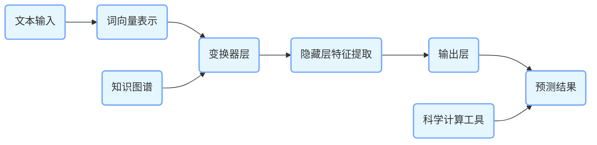

# 语言模型在抽象数学概念推理与理论物理创新中的突破性研究

> 关键词：语言模型、抽象数学概念推理、理论物理创新、自然语言处理、深度学习、科学计算、知识图谱

> 摘要：本文聚焦于语言模型在抽象数学概念推理与理论物理创新领域的突破性研究。首先介绍了相关背景，包括研究的目的、范围、预期读者等内容。接着深入探讨语言模型的核心概念与联系，通过文本示意图和 Mermaid 流程图清晰展示其原理和架构。详细阐述核心算法原理，结合 Python 代码进行说明，同时给出数学模型和公式并举例讲解。通过项目实战，展示代码实际案例并进行详细解释。分析了语言模型在实际应用场景中的作用，推荐了相关的工具和资源。最后总结语言模型在该领域的未来发展趋势与挑战，解答常见问题并提供扩展阅读和参考资料，旨在全面揭示语言模型在推动抽象数学与理论物理发展方面的巨大潜力。

## 1. 背景介绍 
### 1.1 目的和范围
在当今科学研究的前沿领域，抽象数学概念推理和理论物理创新面临着诸多挑战。传统的研究方法在处理复杂的数学和物理问题时往往效率较低，且难以发现隐藏在海量知识中的潜在联系。语言模型作为自然语言处理领域的重要成果，具有强大的文本理解和生成能力。本研究的目的在于探索语言模型在抽象数学概念推理与理论物理创新中的应用，挖掘其为科学研究带来的新机遇和突破。

研究范围涵盖了多种类型的语言模型，如基于深度学习的预训练语言模型（如 BERT、GPT 系列等），以及它们在数学推理、物理理论构建、科学知识发现等方面的应用。同时，也关注语言模型与其他技术（如知识图谱、科学计算工具等）的融合，以实现更高效、更准确的科学研究辅助。

### 1.2 预期读者
本文的预期读者包括数学、物理领域的科研工作者，他们可以从文中了解到语言模型在其研究领域的潜在应用，为解决复杂问题提供新的思路和方法。计算机科学领域的研究人员和开发者也能从中获得启发，进一步探索语言模型在科学计算和知识处理方面的优化和创新。此外，对科学研究和人工智能技术感兴趣的学生和爱好者也可以通过本文了解相关前沿知识。

### 1.3 文档结构概述
本文将按照以下结构进行阐述：首先介绍背景信息，包括研究目的、范围、预期读者等。接着深入探讨语言模型的核心概念与联系，通过文本示意图和 Mermaid 流程图展示其原理和架构。详细讲解核心算法原理，并结合 Python 代码进行说明，同时给出数学模型和公式并举例讲解。通过项目实战，展示代码实际案例并进行详细解释。分析语言模型在实际应用场景中的作用，推荐相关的工具和资源。最后总结语言模型在该领域的未来发展趋势与挑战，解答常见问题并提供扩展阅读和参考资料。

### 1.4 术语表
#### 1.4.1 核心术语定义
- **语言模型**：是一种对语言概率分布进行建模的模型，它可以根据给定的文本序列预测下一个词或字符出现的概率。在自然语言处理中，语言模型用于语言生成、文本理解、机器翻译等任务。
- **抽象数学概念推理**：指在数学领域中，基于抽象的数学概念和规则，通过逻辑推理得出新的结论或解决数学问题的过程。
- **理论物理创新**：在理论物理研究中，通过提出新的理论、模型或假设，对物理现象进行更深入的解释和预测，推动物理学的发展。
- **预训练语言模型**：是一种在大规模无监督文本数据上进行预训练的语言模型，通过学习语言的通用特征，能够在多种自然语言处理任务中取得较好的效果。

#### 1.4.2 相关概念解释
- **自然语言处理**：是计算机科学与语言学的交叉领域，旨在让计算机理解、处理和生成自然语言。它包括文本分类、信息提取、机器翻译、问答系统等多个任务。
- **深度学习**：是一种基于人工神经网络的机器学习方法，通过构建多层神经网络来学习数据的复杂特征和模式。在语言模型中，深度学习被广泛应用于训练模型以提高其性能。
- **知识图谱**：是一种用图结构表示知识的方法，将实体（如概念、事物等）和它们之间的关系表示为节点和边。知识图谱可以为语言模型提供结构化的知识支持，帮助其更好地理解和推理。

#### 1.4.3 缩略词列表
- **BERT**：Bidirectional Encoder Representations from Transformers，基于变换器的双向编码器表示
- **GPT**：Generative Pretrained Transformer，生成式预训练变换器

## 2. 核心概念与联系 
### 核心概念原理
语言模型的核心原理是基于概率统计和机器学习的方法，对语言的结构和规律进行建模。传统的语言模型，如 n - 元语法模型，通过统计文本中相邻 n 个词的共现频率来估计下一个词的概率。例如，在二元语法模型中，根据前一个词来预测下一个词的概率。

现代的预训练语言模型，如 BERT 和 GPT 系列，采用了深度学习中的变换器（Transformer）架构。变换器架构通过自注意力机制（Self - Attention Mechanism）来捕捉文本中不同位置的词之间的依赖关系，从而更好地理解文本的语义和上下文信息。

在抽象数学概念推理中，语言模型可以将数学概念和命题表示为文本序列，通过学习大量的数学文献和教材，掌握数学语言的结构和推理规则。例如，它可以理解数学公式的语法和语义，根据已知的数学定理和条件进行推理，得出新的结论。

在理论物理创新方面，语言模型可以处理物理理论的描述和解释，挖掘物理概念之间的潜在联系。它可以帮助物理学家整理和分析大量的实验数据和理论文献，提出新的物理假设和模型。

### 架构的文本示意图
语言模型的基本架构可以分为输入层、隐藏层和输出层。输入层接收文本序列作为输入，将其转换为适合模型处理的表示形式，如词向量。隐藏层是模型的核心部分，通过多层神经网络对输入进行处理和变换，学习文本的特征和模式。输出层根据隐藏层的输出，生成预测结果，如预测下一个词或对文本进行分类。

在应用于抽象数学概念推理和理论物理创新时，还需要结合知识图谱和科学计算工具。知识图谱提供结构化的知识支持，帮助语言模型更好地理解数学和物理概念之间的关系。科学计算工具可以进行数值计算和模拟，验证语言模型推理得出的结论。

### Mermaid 流程图


## 3. 核心算法原理 & 具体操作步骤 
### 核心算法原理
以 BERT 为例，其核心算法基于变换器架构。变换器由编码器和解码器组成，BERT 主要使用编码器部分。编码器由多个相同的层堆叠而成，每层包含多头自注意力机制（Multi - Head Self - Attention）和前馈神经网络（Feed - Forward Neural Network）。

多头自注意力机制允许模型在不同的表示子空间中并行地关注输入序列的不同部分。对于输入的词向量序列 $\mathbf{X} = [\mathbf{x}_1, \mathbf{x}_2, \cdots, \mathbf{x}_n]$，自注意力机制计算每个词与其他词之间的相关性，得到加权和作为该词的新表示。具体计算步骤如下：

1. 计算查询（Query）、键（Key）和值（Value）矩阵：
   - $\mathbf{Q} = \mathbf{X} \mathbf{W}^Q$
   - $\mathbf{K} = \mathbf{X} \mathbf{W}^K$
   - $\mathbf{V} = \mathbf{X} \mathbf{W}^V$
   其中 $\mathbf{W}^Q$, $\mathbf{W}^K$, $\mathbf{W}^V$ 是可学习的权重矩阵。

2. 计算注意力分数：
   - $\mathbf{Attention}(\mathbf{Q}, \mathbf{K}, \mathbf{V}) = \text{softmax}\left(\frac{\mathbf{Q} \mathbf{K}^T}{\sqrt{d_k}}\right) \mathbf{V}$
   其中 $d_k$ 是查询和键向量的维度。

3. 多头自注意力：
   - 将自注意力机制重复 $h$ 次，得到 $h$ 个不同的注意力输出，然后将它们拼接起来并通过一个线性变换得到最终的输出。

前馈神经网络对多头自注意力的输出进行进一步的变换，增加模型的非线性能力。

### Python 代码实现
```python
import torch
import torch.nn as nn
import torch.nn.functional as F

class ScaledDotProductAttention(nn.Module):
    def __init__(self, d_k):
        super(ScaledDotProductAttention, self).__init__()
        self.d_k = d_k

    def forward(self, q, k, v):
        attn_scores = torch.matmul(q, k.transpose(-2, -1)) / torch.sqrt(torch.tensor(self.d_k, dtype=torch.float32))
        attn_probs = F.softmax(attn_scores, dim=-1)
        output = torch.matmul(attn_probs, v)
        return output

class MultiHeadAttention(nn.Module):
    def __init__(self, d_model, num_heads):
        super(MultiHeadAttention, self).__init__()
        assert d_model % num_heads == 0, "d_model must be divisible by num_heads"

        self.d_model = d_model
        self.num_heads = num_heads
        self.d_k = d_model // num_heads

        self.W_q = nn.Linear(d_model, d_model)
        self.W_k = nn.Linear(d_model, d_model)
        self.W_v = nn.Linear(d_model, d_model)
        self.W_o = nn.Linear(d_model, d_model)

        self.attention = ScaledDotProductAttention(self.d_k)

    def forward(self, q, k, v):
        batch_size = q.size(0)

        Q = self.W_q(q).view(batch_size, -1, self.num_heads, self.d_k).transpose(1, 2)
        K = self.W_k(k).view(batch_size, -1, self.num_heads, self.d_k).transpose(1, 2)
        V = self.W_v(v).view(batch_size, -1, self.num_heads, self.d_k).transpose(1, 2)

        attn_output = self.attention(Q, K, V)
        attn_output = attn_output.transpose(1, 2).contiguous().view(batch_size, -1, self.d_model)
        output = self.W_o(attn_output)
        return output

class PositionwiseFeedForward(nn.Module):
    def __init__(self, d_model, d_ff):
        super(PositionwiseFeedForward, self).__init__()
        self.fc1 = nn.Linear(d_model, d_ff)
        self.fc2 = nn.Linear(d_ff, d_model)
        self.relu = nn.ReLU()

    def forward(self, x):
        return self.fc2(self.relu(self.fc1(x)))

class EncoderLayer(nn.Module):
    def __init__(self, d_model, num_heads, d_ff):
        super(EncoderLayer, self).__init__()
        self.self_attn = MultiHeadAttention(d_model, num_heads)
        self.feed_forward = PositionwiseFeedForward(d_model, d_ff)
        self.norm1 = nn.LayerNorm(d_model)
        self.norm2 = nn.LayerNorm(d_model)

    def forward(self, x):
        attn_output = self.self_attn(x, x, x)
        x = self.norm1(x + attn_output)
        ff_output = self.feed_forward(x)
        x = self.norm2(x + ff_output)
        return x

class BERTEncoder(nn.Module):
    def __init__(self, num_layers, d_model, num_heads, d_ff):
        super(BERTEncoder, self).__init__()
        self.layers = nn.ModuleList([EncoderLayer(d_model, num_heads, d_ff) for _ in range(num_layers)])

    def forward(self, x):
        for layer in self.layers:
            x = layer(x)
        return x
```

### 具体操作步骤
1. **数据预处理**：将数学和物理文本数据进行清洗、分词等处理，转换为适合模型输入的格式。
2. **模型训练**：使用大规模的文本数据对 BERT 模型进行预训练，调整模型的参数以最小化损失函数。
3. **微调**：在特定的数学推理或物理创新任务上对预训练模型进行微调，使其适应具体的任务需求。
4. **推理和应用**：使用训练好的模型进行抽象数学概念推理和理论物理创新相关的任务，如文本生成、问题回答等。

## 4. 数学模型和公式 & 详细讲解 & 举例说明 
### 语言模型的数学基础
语言模型的目标是估计文本序列的概率分布 $P(w_1, w_2, \cdots, w_n)$，其中 $w_i$ 表示文本中的第 $i$ 个词。根据链式法则，这个概率可以分解为：
$$P(w_1, w_2, \cdots, w_n) = \prod_{i = 1}^{n} P(w_i | w_1, w_2, \cdots, w_{i - 1})$$

在 n - 元语法模型中，为了简化计算，假设第 $i$ 个词的概率只依赖于前 $n - 1$ 个词，即：
$$P(w_i | w_1, w_2, \cdots, w_{i - 1}) \approx P(w_i | w_{i - n + 1}, \cdots, w_{i - 1})$$

例如，在二元语法模型中，$n = 2$，则有：
$$P(w_i | w_1, w_2, \cdots, w_{i - 1}) \approx P(w_i | w_{i - 1})$$

### 深度学习语言模型的损失函数
在训练深度学习语言模型时，通常使用交叉熵损失函数来衡量模型预测的概率分布与真实概率分布之间的差异。对于一个文本序列 $\mathbf{w} = [w_1, w_2, \cdots, w_n]$，其交叉熵损失函数定义为：
$$L(\theta) = - \sum_{i = 1}^{n} \log P(w_i | w_1, w_2, \cdots, w_{i - 1}; \theta)$$
其中 $\theta$ 是模型的参数。

### 举例说明
假设我们有一个简单的文本序列 “the cat is on the mat”，使用二元语法模型来估计其概率。首先，我们需要统计训练数据中各个词对的出现频率。假设在训练数据中，“the cat” 出现了 10 次，“cat is” 出现了 8 次，“is on” 出现了 6 次，“on the” 出现了 7 次，“the mat” 出现了 5 次，而 “the” 出现了 20 次，“cat” 出现了 15 次，“is” 出现了 12 次，“on” 出现了 10 次。

则 $P(\text{cat} | \text{the})=\frac{10}{20}=0.5$，$P(\text{is} | \text{cat})=\frac{8}{15}\approx0.53$，$P(\text{on} | \text{is})=\frac{6}{12}=0.5$，$P(\text{the} | \text{on})=\frac{7}{10}=0.7$，$P(\text{mat} | \text{the})=\frac{5}{20}=0.25$。

那么文本序列 “the cat is on the mat” 的概率为：
$$P(\text{the cat is on the mat}) = P(\text{the}) \times P(\text{cat} | \text{the}) \times P(\text{is} | \text{cat}) \times P(\text{on} | \text{is}) \times P(\text{the} | \text{on}) \times P(\text{mat} | \text{the})$$

假设 $P(\text{the}) = 0.2$，则：
$$P(\text{the cat is on the mat})=0.2\times0.5\times0.53\times0.5\times0.7\times0.25\approx0.0046$$

## 5. 项目实战：代码实际案例和详细解释说明 
### 5.1  开发环境搭建
1. **安装 Python**：建议使用 Python 3.7 及以上版本。可以从 Python 官方网站（https://www.python.org/downloads/）下载并安装。
2. **安装深度学习框架**：使用 PyTorch 作为深度学习框架。可以通过以下命令安装：
```bash
pip install torch torchvision
```
3. **安装其他依赖库**：安装必要的自然语言处理库，如 `transformers`、`numpy`、`pandas` 