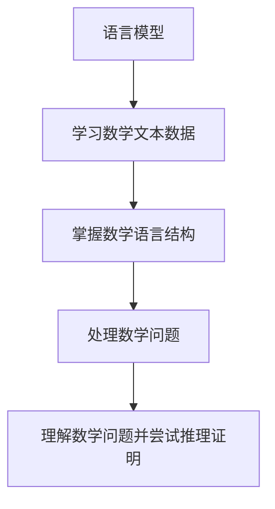

# 语言模型在抽象数学概念推理与证明中的表现

> 关键词：语言模型、抽象数学概念、推理、证明、自然语言处理、人工智能

> 摘要：本文聚焦于语言模型在抽象数学概念推理与证明中的表现。随着人工智能技术的飞速发展，语言模型在自然语言处理领域取得了显著成就，其在数学推理与证明方面的应用也备受关注。文章首先介绍相关背景，包括目的、预期读者等内容；接着阐述语言模型和抽象数学概念的核心原理与联系；深入分析核心算法原理并给出具体操作步骤；探讨相关数学模型和公式；通过项目实战展示代码实现与解读；介绍实际应用场景；推荐相关工具和资源；最后总结语言模型在该领域的未来发展趋势与挑战，同时提供常见问题解答及参考资料，旨在全面深入地研究语言模型在抽象数学概念推理与证明中的作用和效果。

## 1. 背景介绍 
### 1.1 目的和范围
本研究的主要目的在于全面评估语言模型在抽象数学概念推理与证明过程中的表现。通过对语言模型的算法原理、数学模型以及实际应用案例的分析，深入了解其在处理复杂数学问题时的优势与不足。研究范围涵盖了多种常见的语言模型，如基于Transformer架构的GPT系列模型等，以及不同难度层次的抽象数学概念，包括代数、几何、数论等多个数学分支中的概念和定理的推理与证明。

### 1.2 预期读者
本文预期读者包括计算机科学领域的研究人员、人工智能开发者、数学教育工作者以及对数学与人工智能交叉领域感兴趣的爱好者。对于计算机科学研究人员和开发者，本文提供了语言模型在数学推理应用方面的技术细节和实践经验；对于数学教育工作者，有助于了解如何借助语言模型辅助数学教学；对于爱好者，则能提供一个全面了解语言模型在数学领域应用的窗口。

### 1.3 文档结构概述
本文将按照以下结构展开：首先介绍相关背景知识，包括目的、读者和文档结构等；接着阐述语言模型和抽象数学概念的核心概念与联系，通过示意图和流程图进行展示；然后深入探讨核心算法原理并给出具体操作步骤，同时结合Python代码进行说明；之后介绍相关的数学模型和公式，并举例说明；通过项目实战展示代码实现和详细解读；介绍语言模型在抽象数学概念推理与证明中的实际应用场景；推荐相关的学习资源、开发工具框架和论文著作；最后总结未来发展趋势与挑战，提供常见问题解答和参考资料。

### 1.4 术语表
#### 1.4.1 核心术语定义
- **语言模型**：是一种基于概率统计的模型，用于计算语言序列的概率分布，能够预测下一个词或字符出现的可能性。在自然语言处理中，语言模型可以生成自然语言文本，理解语言的语义和语法结构。
- **抽象数学概念**：是对具体数学对象和现象进行概括和提炼后得到的一般性概念，如集合、函数、向量空间等。这些概念不依赖于具体的实例，具有高度的概括性和普遍性。
- **推理**：是从已知的事实和前提中得出新结论的思维过程。在数学中，推理是根据数学公理、定理和定义，通过逻辑推导得出新的数学结论。
- **证明**：是一种严格的推理过程，用于确定某个数学命题的真实性。证明需要依据已有的数学知识和逻辑规则，通过一系列的推导和论证来得出结论。

#### 1.4.2 相关概念解释
- **自然语言处理（NLP）**：是计算机科学与语言学的交叉领域，旨在让计算机能够理解、处理和生成自然语言。语言模型是自然语言处理中的重要工具，用于实现文本生成、机器翻译、问答系统等任务。
- **深度学习**：是一种基于人工神经网络的机器学习方法，通过构建多层神经网络来学习数据的特征和模式。在语言模型中，深度学习技术被广泛应用，如Transformer架构的语言模型就是基于深度学习的方法。

#### 1.4.3 缩略词列表
- **NLP**：Natural Language Processing（自然语言处理）
- **GPT**：Generative Pretrained Transformer（生成式预训练Transformer）

## 2. 核心概念与联系 
### 语言模型原理
语言模型的核心目标是学习语言的概率分布，即给定一个词序列，预测下一个词出现的概率。常见的语言模型基于深度学习中的神经网络架构，如循环神经网络（RNN）、长短期记忆网络（LSTM）和Transformer等。

Transformer架构是当前最流行的语言模型架构之一，它通过自注意力机制（Self-Attention）来捕捉输入序列中不同位置之间的依赖关系。自注意力机制的原理是为输入序列中的每个位置分配一个权重，然后根据这些权重对序列进行加权求和，从而得到每个位置的表示。

### 抽象数学概念推理与证明原理
抽象数学概念的推理与证明是基于数学的公理、定理和定义进行逻辑推导的过程。在推理过程中，需要根据已知条件和数学规则，逐步推导出新的结论。证明则是一种更严格的推理过程，需要提供充分的证据和逻辑论证来支持结论的真实性。

### 语言模型与抽象数学概念推理与证明的联系
语言模型可以将数学问题以自然语言的形式进行处理，通过学习大量的数学文本数据，语言模型可以掌握数学语言的语法和语义结构，从而能够理解数学问题并尝试进行推理和证明。例如，语言模型可以读取数学命题的描述，然后根据所学的知识进行逻辑推导，生成相应的证明步骤。

### 文本示意图
```plaintext
           语言模型
              |
              | 学习数学文本数据
              v
        掌握数学语言结构
              |
              | 处理数学问题
              v
  理解数学问题并尝试推理证明
```

### Mermaid流程图


## 3. 核心算法原理 & 具体操作步骤 
### 核心算法原理
以基于Transformer架构的语言模型为例，其核心算法包括以下几个部分：

#### 词嵌入（Word Embedding）
将输入的文本中的每个词转换为一个低维的向量表示，使得语义相近的词在向量空间中距离较近。

```python
import torch
import torch.nn as nn

# 定义词嵌入层
vocab_size = 10000
embedding_dim = 256
embedding = nn.Embedding(vocab_size, embedding_dim)

# 示例输入
input_ids = torch.tensor([[1, 2, 3, 4]])
embedded = embedding(input_ids)
print(embedded.shape)  # 输出: torch.Size([1, 4, 256])
```

#### 自注意力机制（Self-Attention）
自注意力机制用于计算输入序列中不同位置之间的依赖关系。具体步骤如下：
1. 计算查询（Query）、键（Key）和值（Value）矩阵。
2. 计算注意力分数（Attention Scores）。
3. 对注意力分数进行归一化处理，得到注意力权重（Attention Weights）。
4. 根据注意力权重对值矩阵进行加权求和，得到输出。

```python
class SelfAttention(nn.Module):
    def __init__(self, input_dim, heads):
        super(SelfAttention, self).__init__()
        self.input_dim = input_dim
        self.heads = heads
        self.head_dim = input_dim // heads

        assert (
            self.head_dim * heads == input_dim
        ), "Input dimension needs to be divisible by heads"

        self.values = nn.Linear(self.head_dim, self.head_dim, bias=False)
        self.keys = nn.Linear(self.head_dim, self.head_dim, bias=False)
        self.queries = nn.Linear(self.head_dim, self.head_dim, bias=False)
        self.fc_out = nn.Linear(heads * self.head_dim, input_dim)

    def forward(self, values, keys, query, mask):
        N = query.shape[0]
        value_len, key_len, query_len = values.shape[1], keys.shape[1], query.shape[1]

        # Split the embedding into self.heads different pieces
        values = values.reshape(N, value_len, self.heads, self.head_dim)
        keys = keys.reshape(N, key_len, self.heads, self.head_dim)
        queries = query.reshape(N, query_len, self.heads, self.head_dim)

        values = self.values(values)
        keys = self.keys(keys)
        queries = self.queries(queries)

        # Scaled dot-product attention
        energy = torch.einsum("nqhd,nkhd->nhqk", [queries, keys])
        if mask is not None:
            energy = energy.masked_fill(mask == 0, float("-1e20"))

        attention = torch.softmax(energy / (self.input_dim ** (1 / 2)), dim=3)

        out = torch.einsum("nhql,nlhd->nqhd", [attention, values]).reshape(
            N, query_len, self.heads * self.head_dim
        )

        out = self.fc_out(out)
        return out
```

#### 前馈神经网络（Feed-Forward Neural Network）
在前馈神经网络中，对自注意力机制的输出进行非线性变换，以增加模型的表达能力。

```python
class PositionwiseFeedForward(nn.Module):
    def __init__(self, input_dim, ff_dim):
        super(PositionwiseFeedForward, self).__init__()
        self.fc1 = nn.Linear(input_dim, ff_dim)
        self.fc2 = nn.Linear(ff_dim, input_dim)
        self.relu = nn.ReLU()

    def forward(self, x):
        return self.fc2(self.relu(self.fc1(x)))
```

#### 编码器层（Encoder Layer）
将自注意力机制和前馈神经网络组合在一起，形成编码器层。

```python
class EncoderLayer(nn.Module):
    def __init__(self, input_dim, heads, ff_dim, dropout=0.1):
        super(EncoderLayer, self).__init__()
        self.norm1 = nn.LayerNorm(input_dim)
        self.norm2 = nn.LayerNorm(input_dim)
        self.attention = SelfAttention(input_dim, heads)
        self.feed_forward = PositionwiseFeedForward(input_dim, ff_dim)
        self.dropout = nn.Dropout(dropout)

    def forward(self, x, mask):
        attn_output = self.attention(x, x, x, mask)
        x = self.norm1(x + self.dropout(attn_output))
        ff_output = self.feed_forward(x)
        x = self.norm2(x + self.dropout(ff_output))
        return x
```

### 具体操作步骤
1. **数据预处理**：将数学文本数据进行清洗、分词等处理，转换为适合语言模型输入的格式。
2. **模型训练**：使用预处理后的数据对语言模型进行训练，通过优化目标函数（如交叉熵损失函数）来调整模型的参数。
3. **推理与证明**：将待解决的数学问题输入到训练好的语言模型中，模型根据所学知识进行推理和证明，输出相应的结果。

```python
# 示例：训练语言模型
import torch.optim as optim

# 定义模型
input_dim = 256
heads = 8
ff_dim = 512
num_layers = 6
model = nn.ModuleList([EncoderLayer(input_dim, heads, ff_dim) for _ in range(num_layers)])

# 定义损失函数和优化器
criterion = nn.CrossEntropyLoss()
optimizer = optim.Adam(model.parameters(), lr=0.001)

# 训练循环
num_epochs = 10
for epoch in range(num_epochs):
    # 假设 inputs 和 targets 是预处理后的输入和目标数据
    inputs = torch.randn(10, 20, input_dim)
    targets = torch.randint(0, 10000, (10, 20))

    optimizer.zero_grad()
    outputs = inputs
    for layer in model:
        outputs = layer(outputs, mask=None)
    loss = criterion(outputs.view(-1, vocab_size), targets.view(-1))
    loss.backward()
    optimizer.step()
    print(f'Epoch {epoch + 1}/{num_epochs}, Loss: {loss.item()}')
```

## 4. 数学模型和公式 & 详细讲解 & 举例说明 
### 词嵌入的数学模型
词嵌入的目标是将每个词 $w$ 映射到一个低维向量 $\mathbf{e}_w \in \mathbb{R}^{d}$ 中，其中 $d$ 是嵌入维度。可以通过一个嵌入矩阵 $\mathbf{E} \in \mathbb{R}^{V \times d}$ 来实现，其中 $V$ 是词汇表的大小。对于一个词的索引 $i$，其嵌入向量为 $\mathbf{e}_i = \mathbf{E}[i, :]$。

### 自注意力机制的数学模型
#### 查询、键和值矩阵的计算
给定输入序列 $\mathbf{X} = [\mathbf{x}_1, \mathbf{x}_2, \cdots, \mathbf{x}_n] \in \mathbb{R}^{n \times d}$，其中 $n$ 是序列长度，$d$ 是输入维度。通过线性变换计算查询、键和值矩阵：
$$
\mathbf{Q} = \mathbf{X} \mathbf{W}^Q \quad \mathbf{K} = \mathbf{X} \mathbf{W}^K \quad \mathbf{V} = \mathbf{X} \mathbf{W}^V
$$
其中 $\mathbf{W}^Q, \mathbf{W}^K, \mathbf{W}^V \in \mathbb{R}^{d \times d}$ 是可学习的权重矩阵。

#### 注意力分数的计算
注意力分数 $\mathbf{E} \in \mathbb{R}^{n \times n}$ 定义为：
$$
\mathbf{E}_{ij} = \frac{\mathbf{q}_i^T \mathbf{k}_j}{\sqrt{d}}
$$
其中 $\mathbf{q}_i$ 和 $\mathbf{k}_j$ 分别是查询矩阵 $\mathbf{Q}$ 和键矩阵 $\mathbf{K}$ 的第 $i$ 行和第 $j$ 行。

#### 注意力权重的计算
注意力权重 $\mathbf{A} \in \mathbb{R}^{n \times n}$ 通过对注意力分数进行 softmax 操作得到：
$$
\mathbf{A}_{ij} = \frac{\exp(\mathbf{E}_{ij})}{\sum_{k=1}^{n} \exp(\mathbf{E}_{ik})}
$$

#### 输出的计算
自注意力机制的输出 $\mathbf{Z} \in \mathbb{R}^{n \times d}$ 为：
$$
\mathbf{Z} = \mathbf{A} \mathbf{V}
$$

### 举例说明
假设输入序列 $\mathbf{X} = \begin{bmatrix} 1 & 2 \\ 3 & 4 \\ 5 & 6 \end{bmatrix}$，嵌入维度 $d = 2$，词汇表大小 $V = 10$。

#### 词嵌入
嵌入矩阵 $\mathbf{E} \in \mathbb{R}^{10 \times 2}$ 可以随机初始化。假设 $\mathbf{E} = \begin{bmatrix} 0.1 & 0.2 \\ 0.3 & 0.4 \\ \cdots \\ 0.9 & 1.0 \end{bmatrix}$，对于输入序列中的词索引，通过 $\mathbf{E}$ 得到相应的嵌入向量。

#### 自注意力机制
假设 $\mathbf{W}^Q = \begin{bmatrix} 0.1 & 0.2 \\ 0.3 & 0.4 \end{bmatrix}$，$\mathbf{W}^K = \begin{bmatrix} 0.5 & 0.6 \\ 0.7 & 0.8 \end{bmatrix}$，$\mathbf{W}^V = \begin{bmatrix} 0.9 & 1.0 \\ 1.1 & 1.2 \end{bmatrix}$。

计算查询矩阵 $\mathbf{Q} = \mathbf{X} \mathbf{W}^Q = \begin{bmatrix} 1 & 2 \\ 3 & 4 \\ 5 & 6 \end{bmatrix} \begin{bmatrix} 0.1 & 0.2 \\ 0.3 & 0.4 \end{bmatrix} = \begin{bmatrix} 0.7 & 1.0 \\ 1.5 & 2.2 \\ 2.3 & 3.4 \end{bmatrix}$

键矩阵 $\mathbf{K} = \mathbf{X} \mathbf{W}^K = \begin{bmatrix} 1 & 2 \\ 3 & 4 \\ 5 & 6 \end{bmatrix} \begin{bmatrix} 0.5 & 0.6 \\ 0.7 & 0.8 \end{bmatrix} = \begin{bmatrix} 1.9 & 2.2 \\ 4.3 & 5.0 \\ 6.7 & 7.8 \end{bmatrix}$

值矩阵 $\mathbf{V} = \mathbf{X} \mathbf{W}^V = \begin{bmatrix} 1 & 2 \\ 3 & 4 \\ 5 & 6 \end{bmatrix} \begin{bmatrix} 0.9 & 1.0 \\ 1.1 & 1.2 \end{bmatrix} = \begin{bmatrix} 3.1 & 3.4 \\ 7.1 & 8.2 \\ 11.1 & 12.4 \end{bmatrix}$

注意力分数 $\mathbf{E} = \begin{bmatrix} \frac{\mathbf{q}_1^T \mathbf{k}_1}{\sqrt{2}} & \frac{\mathbf{q}_1^T \mathbf{k}_2}{\sqrt{2}} & \frac{\mathbf{q}_1^T \mathbf{k}_3}{\sqrt{2}} \\ \frac{\mathbf{q}_2^T \mathbf{k}_1}{\sqrt{2}} & \frac{\mathbf{q}_2^T \mathbf{k}_2}{\sqrt{2}} & \frac{\mathbf{q}_2^T \mathbf{k}_3}{\sqrt{2}} \\ \frac{\mathbf{q}_3^T \mathbf{k}_1}{\sqrt{2}} & \frac{\mathbf{q}_3^T \mathbf{k}_2}{\sqrt{2}} & \frac{\mathbf{q}_3^T \mathbf{k}_3}{\sqrt{2}} \end{bmatrix}$

注意力权重 $\mathbf{A} = \text{softmax}(\mathbf{E})$

输出 $\mathbf{Z} = \mathbf{A} \mathbf{V}$

## 5. 项目实战：代码实际案例和详细解释说明 
### 5.1  开发环境搭建
#### 操作系统
可以选择Linux（如Ubuntu）、Windows或macOS作为开发环境。

#### Python环境
安装Python 3.7及以上版本。可以使用Anaconda或Miniconda来管理Python环境。

#### 依赖库安装
安装以下必要的Python库：
```bash
pip install torch numpy transformers
```

### 5.2  源代码详细实现和代码解读
以下是一个使用Hugging Face的Transformers库进行数学推理的简单示例：

```python
from transformers import AutoTokenizer, AutoModelForCausalLM

# 加载预训练的语言模型和分词器
tokenizer = AutoTokenizer.from_pretrained("gpt2")
model = AutoModelForCausalLM.from_pretrained("gpt2")

# 定义数学问题
math_problem = "证明：对于任意正整数 n，n^2 - n 是偶数。"

# 对问题进行分词
input_ids = tokenizer.encode(math_problem, return_tensors='pt')

# 生成推理和证明
output = model.generate(input_ids, max_length=200, num_return_sequences=1)

# 解码输出
generated_text = tokenizer.decode(output[0], skip_special_tokens=True)
print(generated_text)
```

### 5.3  代码解读与分析
1. **加载预训练模型和分词器**：使用 `AutoTokenizer` 和 `AutoModelForCausalLM` 从Hugging Face的模型库中加载预训练的GPT-2模型和对应的分词器。
2. **定义数学问题**：将需要推理和证明的数学问题存储在 `math_problem` 变量中。
3. **分词**：使用分词器将数学问题转换为模型可以接受的输入ID序列。
4. **生成推理和证明**：调用模型的 `generate` 方法，生成推理和证明的文本。`max_length` 参数指定生成文本的最大长度，`num_return_sequences` 参数指定生成的文本序列数量。
5. **解码输出**：使用分词器将模型生成的ID序列解码为自然语言文本，并打印输出。

需要注意的是，这个示例只是一个简单的演示，实际应用中可能需要对模型进行微调，以提高其在数学推理和证明任务中的性能。

## 6. 实际应用场景 
### 数学教育
语言模型可以作为数学教育的辅助工具，帮助学生理解抽象的数学概念和定理。例如，学生在学习数学证明时，可以输入相关的问题，语言模型可以生成详细的证明步骤和解释，帮助学生更好地掌握证明方法。

### 数学研究
在数学研究中，语言模型可以帮助数学家快速查找相关的文献和资料，提供思路和启发。例如，当数学家遇到一个新的数学问题时，可以使用语言模型生成可能的证明思路和方向。

### 智能数学助手
开发智能数学助手应用程序，用户可以通过自然语言与助手交互，提出数学问题，助手可以利用语言模型进行推理和证明，并给出相应的答案和解释。

### 自动数学证明系统
将语言模型与自动推理技术相结合，构建自动数学证明系统。该系统可以自动处理数学命题，进行推理和证明，提高数学证明的效率和准确性。

## 7. 工具和资源推荐
### 7.1 学习资源推荐
#### 7.1.1 书籍推荐
- 《深度学习》（Deep Learning）：由Ian Goodfellow、Yoshua Bengio和Aaron Courville合著，是深度学习领域的经典教材，介绍了深度学习的基本原理和算法。
- 《自然语言处理入门》（Natural Language Processing with Python）：由Steven Bird、Ewan Klein和Edward Loper合著，介绍了自然语言处理的基本概念和方法，以及如何使用Python进行自然语言处理。
- 《数学分析原理》（Principles of Mathematical Analysis）：由Walter Rudin著，是数学分析领域的经典教材，介绍了数学分析的基本概念和理论。

#### 7.1.2 在线课程
- Coursera上的“深度学习专项课程”（Deep Learning Specialization）：由Andrew Ng教授主讲，介绍了深度学习的基本原理和应用。
- edX上的“自然语言处理”（Natural Language Processing）：由Columbia University开设，介绍了自然语言处理的基本概念和算法。
- Khan Academy上的“数学课程”：提供了从基础数学到高等数学的全面课程，适合不同水平的学习者。

#### 7.1.3 技术博客和网站
- Hugging Face的博客（https://huggingface.co/blog）：提供了关于自然语言处理和深度学习的最新研究成果和技术分享。
- arXiv（https://arxiv.org/）：是一个预印本平台，提供了大量的学术论文，包括数学、计算机科学等领域的研究成果。
- MathOverflow（https://mathoverflow.net/）：是一个数学研究人员交流的平台，提供了关于数学问题的讨论和解答。

### 7.2 开发工具框架推荐
#### 7.2.1 IDE和编辑器
- PyCharm：是一款专业的Python集成开发环境，提供了丰富的代码编辑、调试和项目管理功能。
- Visual Studio Code：是一款轻量级的代码编辑器，支持多种编程语言，具有丰富的插件生态系统。

#### 7.2.2 调试和性能分析工具
- PyTorch Profiler：是PyTorch提供的性能分析工具，可以帮助开发者分析模型的性能瓶颈。
- TensorBoard：是TensorFlow提供的可视化工具，可以帮助开发者可视化模型的训练过程和性能指标。

#### 7.2.3 相关框架和库
- Hugging Face Transformers：提供了多种预训练的语言模型和相关工具，方便开发者进行自然语言处理任务。
- PyTorch：是一个开源的深度学习框架，提供了丰富的深度学习算法和工具。
- SymPy：是一个Python的符号计算库，可以用于数学表达式的符号计算和推理。

### 7.3 相关论文著作推荐
#### 7.3.1 经典论文
- “Attention Is All You Need”：介绍了Transformer架构，是自然语言处理领域的经典论文。
- “BERT: Pre-training of Deep Bidirectional Transformers for Language Understanding”：介绍了BERT模型，是预训练语言模型的重要突破。

#### 7.3.2 最新研究成果
- 关注arXiv上关于语言模型在数学推理和证明方面的最新研究论文，了解该领域的最新进展。

#### 7.3.3 应用案例分析
- 可以参考相关的学术会议论文和技术报告，了解语言模型在数学教育、数学研究等领域的实际应用案例。

## 8. 总结：未来发展趋势与挑战
### 未来发展趋势
- **模型性能提升**：随着深度学习技术的不断发展，语言模型的性能将不断提升，能够处理更复杂的数学问题和更深入的推理证明。
- **多模态融合**：将语言模型与图像、符号等多模态信息融合，能够更好地理解和处理数学问题，提高推理和证明的准确性。
- **个性化服务**：根据用户的需求和水平，提供个性化的数学推理和证明服务，满足不同用户的学习和研究需求。

### 挑战
- **数学知识表示**：如何将抽象的数学知识有效地表示为语言模型能够理解的形式，是一个挑战。
- **逻辑推理能力**：语言模型在逻辑推理方面还存在一定的局限性，需要进一步提高其逻辑推理能力，以准确地进行数学推理和证明。
- **数据质量和数量**：高质量的数学文本数据是训练语言模型的关键，但目前可用的数学文本数据存在质量和数量不足的问题。

## 9. 附录：常见问题与解答
### 语言模型在数学推理和证明中的准确性如何？
目前语言模型在数学推理和证明中的准确性还存在一定的局限性。虽然语言模型可以学习到一些数学知识和推理模式，但对于复杂的数学问题，可能会出现推理错误或证明不严谨的情况。

### 如何提高语言模型在数学推理和证明中的性能？
可以通过以下方法提高语言模型的性能：
- **数据增强**：收集更多高质量的数学文本数据，包括数学教材、学术论文等，进行数据增强。
- **模型微调**：在特定的数学数据集上对预训练的语言模型进行微调，使其更好地适应数学推理和证明任务。
- **结合其他技术**：将语言模型与自动推理技术、符号计算技术等相结合，提高推理和证明的准确性。

### 语言模型能否完全替代人类进行数学推理和证明？
目前语言模型还不能完全替代人类进行数学推理和证明。虽然语言模型可以提供一些思路和帮助，但数学推理和证明需要人类的创造力、逻辑思维和直觉，这些是语言模型目前还无法具备的。

## 10. 扩展阅读 & 参考资料
- Goodfellow, I., Bengio, Y., & Courville, A. (2016). Deep Learning. MIT Press.
- Bird, S., Klein, E., & Loper, E. (2009). Natural Language Processing with Python. O'Reilly Media.
- Rudin, W. (1976). Principles of Mathematical Analysis. McGraw-Hill.
- Vaswani, A., Shazeer, N., Parmar, N., Uszkoreit, J., Jones, L., Gomez, A. N., ... & Polosukhin, I. (2017). Attention is all you need. Advances in neural information processing systems, 5998-6008.
- Devlin, J., Chang, M. W., Lee, K., & Toutanova, K. (2018). Bert: Pre-training of deep bidirectional transformers for language understanding. arXiv preprint arXiv:1810.04805.

作者：AI天才研究院/AI Genius Institute & 禅与计算机程序设计艺术 /Zen And The Art of Computer Programming