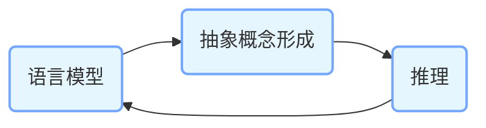

# 语言模型在抽象概念形成与推理中的表现

> 关键词：语言模型、抽象概念形成、推理、自然语言处理、认知能力

> 摘要：本文深入探讨了语言模型在抽象概念形成与推理中的表现。首先介绍了研究的背景、目的、预期读者、文档结构和相关术语。接着阐述了核心概念及联系，包括语言模型、抽象概念形成和推理的原理，并给出了相应的架构示意图和流程图。详细讲解了核心算法原理，用 Python 代码进行了具体阐述，同时给出了相关的数学模型和公式，并举例说明。通过项目实战，展示了代码的实际案例并进行详细解释。分析了语言模型在不同实际应用场景中的表现，推荐了学习资源、开发工具框架和相关论文著作。最后总结了语言模型在抽象概念形成与推理方面的未来发展趋势与挑战，还提供了常见问题解答和扩展阅读参考资料。

## 1. 背景介绍 
### 1.1 目的和范围
语言模型作为自然语言处理领域的核心技术之一，近年来取得了巨大的发展。其在各种自然语言处理任务中都有广泛的应用，如文本生成、机器翻译、问答系统等。然而，语言模型在抽象概念形成与推理方面的能力仍有待深入研究。本研究的目的在于全面评估语言模型在抽象概念形成与推理中的表现，分析其优势与不足，为进一步提升语言模型的认知能力提供理论支持和实践指导。研究范围涵盖了常见的语言模型架构，如 Transformer 及其变体，以及多种抽象概念和推理任务，包括逻辑推理、类比推理、概念泛化等。

### 1.2 预期读者
本文预期读者包括自然语言处理领域的研究人员、工程师、研究生，以及对人工智能和语言模型感兴趣的技术爱好者。对于研究人员，本文提供了深入的理论分析和最新的研究进展；对于工程师，本文给出了具体的代码实现和开发建议；对于技术爱好者，本文以通俗易懂的方式介绍了语言模型在抽象概念形成与推理中的基本原理和应用场景。

### 1.3 文档结构概述
本文将按照以下结构展开：首先介绍相关的核心概念，包括语言模型、抽象概念形成和推理的定义和原理，并给出它们之间的联系；接着详细讲解核心算法原理，并用 Python 代码进行具体实现；然后给出相关的数学模型和公式，通过实例进行说明；通过项目实战，展示如何在实际中应用语言模型进行抽象概念形成与推理；分析语言模型在不同实际应用场景中的表现；推荐相关的学习资源、开发工具框架和论文著作；最后总结语言模型在抽象概念形成与推理方面的未来发展趋势与挑战，并提供常见问题解答和扩展阅读参考资料。

### 1.4 术语表
#### 1.4.1 核心术语定义
- **语言模型**：一种基于概率统计或深度学习的模型，用于预测给定文本序列的下一个词或字符的概率分布。常见的语言模型包括基于规则的模型、统计语言模型和神经网络语言模型。
- **抽象概念形成**：指从具体的实例中提取出具有一般性、概括性的概念的过程。例如，从苹果、香蕉、橙子等具体水果中抽象出“水果”这一概念。
- **推理**：指根据已知的信息和规则，推导出新的结论或信息的过程。推理可以分为演绎推理、归纳推理和类比推理等不同类型。
- **Transformer**：一种基于注意力机制的深度学习架构，广泛应用于自然语言处理任务中。Transformer 架构由编码器和解码器组成，能够有效地处理长序列文本。
- **BERT**：一种基于 Transformer 编码器的预训练语言模型，通过在大规模文本数据上进行无监督学习，学习到了丰富的语言知识和语义表示。

#### 1.4.2 相关概念解释
- **自然语言处理（NLP）**：研究如何让计算机理解和处理人类语言的技术领域。自然语言处理包括文本分类、情感分析、机器翻译、问答系统等多个任务。
- **深度学习**：一种基于人工神经网络的机器学习方法，通过构建多层神经网络来学习数据的特征和模式。深度学习在图像识别、语音识别、自然语言处理等领域取得了显著的成果。
- **预训练模型**：在大规模无监督数据上进行训练得到的模型。预训练模型可以学习到通用的语言知识和语义表示，然后在具体的任务上进行微调，以提高模型的性能。

#### 1.4.3 缩略词列表
- **NLP**：Natural Language Processing（自然语言处理）
- **LM**：Language Model（语言模型）
- **RNN**：Recurrent Neural Network（循环神经网络）
- **LSTM**：Long Short-Term Memory（长短期记忆网络）
- **GRU**：Gated Recurrent Unit（门控循环单元）
- **Transformer**：Transformer 架构
- **BERT**：Bidirectional Encoder Representations from Transformers（基于 Transformer 的双向编码器表示）
- **GPT**：Generative Pretrained Transformer（生成式预训练 Transformer）

## 2. 核心概念与联系 

### 2.1 语言模型
语言模型的主要目标是对自然语言文本的概率分布进行建模。给定一个文本序列 $x_1, x_2, \cdots, x_n$，语言模型的任务是估计 $P(x_1, x_2, \cdots, x_n)$ 的概率。在实际应用中，通常使用链式法则将联合概率分解为条件概率的乘积：

$$P(x_1, x_2, \cdots, x_n) = \prod_{i=1}^{n} P(x_i | x_1, x_2, \cdots, x_{i-1})$$

早期的语言模型主要基于统计方法，如 n-gram 模型。n-gram 模型假设当前词的出现只依赖于前 $n-1$ 个词，因此可以通过统计语料库中 $n$ 元组的出现频率来估计条件概率。然而，n-gram 模型存在数据稀疏性和长距离依赖问题，难以处理复杂的语言结构。

近年来，基于神经网络的语言模型取得了巨大的成功。其中，Transformer 架构及其变体成为了主流的语言模型架构。Transformer 架构通过自注意力机制，能够有效地捕捉文本序列中的长距离依赖关系，从而提高语言模型的性能。

### 2.2 抽象概念形成
抽象概念形成是人类认知的重要能力之一。在自然语言处理中，抽象概念形成可以理解为从具体的文本实例中提取出具有一般性、概括性的概念表示。例如，给定一系列描述水果的文本，如“苹果是一种甜的水果”、“香蕉是一种黄色的水果”，语言模型需要能够抽象出“水果”这一概念，并理解其与具体水果实例之间的关系。

抽象概念形成的过程通常涉及到特征提取、聚类和泛化等步骤。语言模型可以通过学习文本的语义表示，提取出与抽象概念相关的特征，然后将具有相似特征的文本实例聚类到一起，形成抽象概念的类别。最后，语言模型可以通过泛化，将新的文本实例归类到已有的抽象概念类别中。

### 2.3 推理
推理是根据已知的信息和规则，推导出新的结论或信息的过程。在自然语言处理中，推理可以分为多种类型，如演绎推理、归纳推理和类比推理等。

- **演绎推理**：从一般性的前提出发，通过逻辑规则推导出具体的结论。例如，已知“所有的水果都含有维生素 C”和“苹果是一种水果”，可以推导出“苹果含有维生素 C”。
- **归纳推理**：从具体的实例中总结出一般性的规律或结论。例如，通过观察多个水果都含有维生素 C，可以归纳出“所有的水果都含有维生素 C”。
- **类比推理**：根据两个或多个事物之间的相似性，推导出它们在其他方面也可能相似的结论。例如，已知苹果和橙子都是水果，苹果含有维生素 C，可以类比推导出橙子也可能含有维生素 C。

### 2.4 核心概念的联系
语言模型是实现抽象概念形成与推理的基础。通过学习大规模的文本数据，语言模型可以学习到丰富的语言知识和语义表示，从而为抽象概念形成和推理提供支持。抽象概念形成是推理的前提，只有先形成了抽象概念，才能进行基于这些概念的推理。推理则可以进一步验证和完善抽象概念，提高语言模型的认知能力。

以下是核心概念联系的 Mermaid 流程图：



## 3. 核心算法原理 & 具体操作步骤 

### 3.1 基于 Transformer 的语言模型原理
Transformer 架构由编码器和解码器组成，其中编码器用于对输入的文本序列进行编码，解码器用于生成输出的文本序列。在语言模型任务中，通常只使用编码器部分。

Transformer 编码器由多个相同的层组成，每层包含多头自注意力机制和前馈神经网络。多头自注意力机制允许模型在不同的表示子空间中关注输入序列的不同部分，从而捕捉到更丰富的信息。前馈神经网络则用于对自注意力机制的输出进行非线性变换。

以下是 Transformer 编码器的 Python 代码实现：

```python
import torch
import torch.nn as nn
import torch.nn.functional as F

class MultiHeadAttention(nn.Module):
    def __init__(self, d_model, num_heads):
        super(MultiHeadAttention, self).__init__()
        self.d_model = d_model
        self.num_heads = num_heads
        self.d_k = d_model // num_heads

        self.W_q = nn.Linear(d_model, d_model)
        self.W_k = nn.Linear(d_model, d_model)
        self.W_v = nn.Linear(d_model, d_model)
        self.W_o = nn.Linear(d_model, d_model)

    def scaled_dot_product_attention(self, Q, K, V, mask=None):
        attn_scores = torch.matmul(Q, K.transpose(-2, -1)) / torch.sqrt(torch.tensor(self.d_k, dtype=torch.float32))
        if mask is not None:
            attn_scores = attn_scores.masked_fill(mask == 0, -1e9)
        attn_probs = F.softmax(attn_scores, dim=-1)
        output = torch.matmul(attn_probs, V)
        return output

    def split_heads(self, x):
        batch_size, seq_length, d_model = x.size()
        return x.view(batch_size, seq_length, self.num_heads, self.d_k).transpose(1, 2)

    def combine_heads(self, x):
        batch_size, num_heads, seq_length, d_k = x.size()
        return x.transpose(1, 2).contiguous().view(batch_size, seq_length, self.d_model)

    def forward(self, Q, K, V, mask=None):
        Q = self.split_heads(self.W_q(Q))
        K = self.split_heads(self.W_k(K))
        V = self.split_heads(self.W_v(V))

        attn_output = self.scaled_dot_product_attention(Q, K, V, mask)
        output = self.W_o(self.combine_heads(attn_output))
        return output

class PositionwiseFeedForward(nn.Module):
    def __init__(self, d_model, d_ff):
        super(PositionwiseFeedForward, self).__init__()
        self.fc1 = nn.Linear(d_model, d_ff)
        self.fc2 = nn.Linear(d_ff, d_model)
        self.relu = nn.ReLU()

    def forward(self, x):
        return self.fc2(self.relu(self.fc1(x)))

class EncoderLayer(nn.Module):
    def __init__(self, d_model, num_heads, d_ff, dropout):
        super(EncoderLayer, self).__init__()
        self.self_attn = MultiHeadAttention(d_model, num_heads)
        self.feed_forward = PositionwiseFeedForward(d_model, d_ff)
        self.norm1 = nn.LayerNorm(d_model)
        self.norm2 = nn.LayerNorm(d_model)
        self.dropout = nn.Dropout(dropout)

    def forward(self, x, mask):
        attn_output = self.self_attn(x, x, x, mask)
        x = self.norm1(x + self.dropout(attn_output))
        ff_output = self.feed_forward(x)
        x = self.norm2(x + self.dropout(ff_output))
        return x

class TransformerEncoder(nn.Module):
    def __init__(self, num_layers, d_model, num_heads, d_ff, dropout):
        super(TransformerEncoder, self).__init__()
        self.layers = nn.ModuleList([EncoderLayer(d_model, num_heads, d_ff, dropout) for _ in range(num_layers)])

    def forward(self, x, mask):
        for layer in self.layers:
            x = layer(x, mask)
        return x
```

### 3.2 抽象概念形成的算法步骤
抽象概念形成的过程可以分为以下几个步骤：

1. **数据预处理**：对输入的文本数据进行清洗、分词等预处理操作，将文本转换为适合语言模型处理的格式。
2. **特征提取**：使用语言模型对预处理后的文本进行编码，提取出文本的语义特征。
3. **聚类**：使用聚类算法（如 K-Means 聚类）对提取的特征进行聚类，将具有相似特征的文本实例聚类到一起。
4. **概念标注**：为每个聚类结果标注一个抽象概念名称，形成抽象概念类别。

以下是抽象概念形成的 Python 代码示例：

```python
import torch
from sklearn.cluster import KMeans

# 假设已经有一个训练好的语言模型 encoder
encoder = TransformerEncoder(num_layers=6, d_model=512, num_heads=8, d_ff=2048, dropout=0.1)

# 输入文本数据
texts = ["苹果是一种甜的水果", "香蕉是一种黄色的水果", "汽车是一种交通工具", "自行车是一种环保的交通工具"]

# 数据预处理
tokenized_texts = [text.split() for text in texts]

# 特征提取
input_ids = []
for tokens in tokenized_texts:
    # 这里简单假设每个词对应一个整数 ID
    input_id = [hash(token) % 1000 for token in tokens]
    input_ids.append(input_id)

input_ids = torch.tensor(input_ids)
with torch.no_grad():
    features = encoder(input_ids, mask=None)
    features = features.mean(dim=1).numpy()

# 聚类
kmeans = KMeans(n_clusters=2)
labels = kmeans.fit_predict(features)

# 概念标注
concepts = {0: "水果", 1: "交通工具"}
for i, text in enumerate(texts):
    print(f"文本: {text}, 所属概念: {concepts[labels[i]]}")
```

### 3.3 推理的算法步骤
推理的过程可以根据不同的推理类型采用不同的算法。以下以演绎推理为例，介绍推理的算法步骤：

1. **前提表示**：使用语言模型对前提信息进行编码，将前提信息转换为向量表示。
2. **规则匹配**：根据已知的推理规则，将前提信息与规则进行匹配，找出适用的规则。
3. **结论推导**：根据匹配的规则，从前提信息中推导出结论信息。

以下是演绎推理的 Python 代码示例：

```python
# 假设已经有一个训练好的语言模型 encoder
encoder = TransformerEncoder(num_layers=6, d_model=512, num_heads=8, d_ff=2048, dropout=0.1)

# 前提信息
premise1 = "所有的水果都含有维生素 C"
premise2 = "苹果是一种水果"

# 前提表示
tokenized_premise1 = premise1.split()
tokenized_premise2 = premise2.split()

input_id1 = [hash(token) % 1000 for token in tokenized_premise1]
input_id2 = [hash(token) % 1000 for token in tokenized_premise2]

input_id1 = torch.tensor([input_id1])
input_id2 = torch.tensor([input_id2])

with torch.no_grad():
    feature1 = encoder(input_id1, mask=None).mean(dim=1).numpy()
    feature2 = encoder(input_id2, mask=None).mean(dim=1).numpy()

# 规则匹配和结论推导（这里简单模拟）
if "水果" in premise2 and "含有维生素 C" in premise1:
    conclusion = "苹果含有维生素 C"
    print(f"结论: {conclusion}")
```

## 4. 数学模型和公式 & 详细讲解 & 举例说明 

### 4.1 语言模型的数学模型
语言模型的目标是估计文本序列 $x_1, x_2, \cdots, x_n$ 的概率 $P(x_1, x_2, \cdots, x_n)$。如前面所述，通常使用链式法则将联合概率分解为条件概率的乘积：

$$P(x_1, x_2, \cdots, x_n) = \prod_{i=1}^{n} P(x_i | x_1, x_2, \cdots, x_{i-1})$$

在神经网络语言模型中，条件概率 $P(x_i | x_1, x_2, \cdots, x_{i-1})$ 通常通过一个神经网络来建模。例如，在基于 Transformer 的语言模型中，输入的文本序列首先经过嵌入层转换为词向量表示，然后经过多个 Transformer 编码器层进行特征提取，最后通过一个全连接层和 softmax 函数输出下一个词的概率分布。

设输入的文本序列为 $x = [x_1, x_2, \cdots, x_n]$，经过嵌入层和 Transformer 编码器层后得到的特征表示为 $h = [h_1, h_2, \cdots, h_n]$。则下一个词 $x_{i+1}$ 的条件概率可以表示为：

$$P(x_{i+1} | x_1, x_2, \cdots, x_i) = \text{softmax}(W h_i + b)$$

其中 $W$ 是全连接层的权重矩阵，$b$ 是偏置向量。

### 4.2 抽象概念形成的数学模型
抽象概念形成的过程可以看作是一个聚类问题。给定一组文本实例 $X = \{x_1, x_2, \cdots, x_m\}$，每个文本实例 $x_i$ 经过语言模型编码后得到特征向量 $h_i$。聚类的目标是将这些特征向量划分为 $k$ 个类别 $C = \{C_1, C_2, \cdots, C_k\}$，使得同一类别内的特征向量相似度高，不同类别之间的特征向量相似度低。

常用的聚类算法如 K-Means 聚类，其目标是最小化每个样本到其所属类别中心的距离之和：

$$\min_{C, \mu} \sum_{i=1}^{m} \min_{j=1}^{k} \|h_i - \mu_j\|^2$$

其中 $\mu_j$ 是第 $j$ 个类别的中心。

### 4.3 推理的数学模型
推理的数学模型根据不同的推理类型有所不同。以演绎推理为例，演绎推理通常基于逻辑规则进行。假设前提信息可以表示为逻辑命题 $P_1, P_2, \cdots, P_n$，推理规则可以表示为 $R$，结论信息可以表示为 $Q$。则演绎推理的过程可以表示为：

$$(P_1 \land P_2 \land \cdots \land P_n) \land R \Rightarrow Q$$

例如，前提信息 $P_1$ 为“所有的水果都含有维生素 C”，$P_2$ 为“苹果是一种水果”，推理规则 $R$ 为“如果一个事物属于水果类别，那么它含有维生素 C”，则可以推导出结论 $Q$ 为“苹果含有维生素 C”。

### 4.4 举例说明
#### 语言模型
假设我们有一个简单的文本序列 “I love apples”，语言模型的任务是估计 $P(\text{I}, \text{love}, \text{apples})$ 的概率。根据链式法则：

$$P(\text{I}, \text{love}, \text{apples}) = P(\text{I}) \times P(\text{love} | \text{I}) \times P(\text{apples} | \text{I}, \text{love})$$

在基于 Transformer 的语言模型中，输入 “I love apples” 经过嵌入层和 Transformer 编码器层后得到特征表示，然后通过全连接层和 softmax 函数输出每个词的概率分布。例如，$P(\text{apples} | \text{I}, \text{love})$ 可以通过计算得到。

#### 抽象概念形成
假设有以下文本实例：

- “苹果是一种甜的水果”
- “香蕉是一种黄色的水果”
- “汽车是一种交通工具”
- “自行车是一种环保的交通工具”

经过语言模型编码后，得到这些文本实例的特征向量。使用 K-Means 聚类算法将这些特征向量划分为两个类别，分别对应“水果”和“交通工具”这两个抽象概念。

#### 推理
已知前提信息：

- $P_1$：所有的鸟类都会飞
- $P_2$：麻雀是一种鸟类

根据演绎推理规则，可以推导出结论：

- $Q$：麻雀会飞

## 5. 项目实战：代码实际案例和详细解释说明 

### 5.1  开发环境搭建
#### 5.1.1 安装 Python
首先需要安装 Python 环境，建议使用 Python 3.7 及以上版本。可以从 Python 官方网站（https://www.python.org/downloads/）下载并安装。

#### 5.1.2 安装 PyTorch
PyTorch 是一个流行的深度学习框架，用于构建和训练神经网络。可以根据自己的操作系统和 CUDA 版本选择合适的安装方式。例如，在 Linux 系统上，可以使用以下命令安装：

```bash
pip install torch torchvision
```

#### 5.1.3 安装其他依赖库
还需要安装一些其他的依赖库，如 NumPy、Scikit-learn 等。可以使用以下命令安装：

```bash
pip install numpy scikit-learn
```

### 5.2  源代码详细实现和代码解读
#### 5.2.1 语言模型的实现
以下是一个基于 PyTorch 实现的简单语言模型示例：

```python
import torch
import torch.nn as nn
import torch.optim as optim

# 定义语言模型
class SimpleLanguageModel(nn.Module):
    def __init__(self, vocab_size, embedding_dim, hidden_dim):
        super(SimpleLanguageModel, self).__init__()
        self.embedding = nn.Embedding(vocab_size, embedding_dim)
        self.rnn = nn.RNN(embedding_dim, hidden_dim, batch_first=True)
        self.fc = nn.Linear(hidden_dim, vocab_size)

    def forward(self, input_ids):
        embedded = self.embedding(input_ids)
        output, _ = self.rnn(embedded)
        logits = self.fc(output)
        return logits

# 初始化模型
vocab_size = 1000
embedding_dim = 128
hidden_dim = 256
model = SimpleLanguageModel(vocab_size, embedding_dim, hidden_dim)

# 定义损失函数和优化器
criterion = nn.CrossEntropyLoss()
optimizer = optim.Adam(model.parameters(), lr=0.001)

# 模拟训练数据
input_ids = torch.randint(0, vocab_size, (32, 10))
target_ids = torch.randint(0, vocab_size, (32, 10))

# 训练模型
for epoch in range(10):
    optimizer.zero_grad()
    logits = model(input_ids)
    logits = logits.view(-1, vocab_size)
    target_ids = target_ids.view(-1)
    loss = criterion(logits, target_ids)
    loss.backward()
    optimizer.step()
    print(f'Epoch {epoch+1}, Loss: {loss.item()}')
```

**代码解读**：
- `SimpleLanguageModel` 类定义了一个简单的语言模型，包括嵌入层、RNN 层和全连接层。
- `forward` 方法定义了模型的前向传播过程，输入是文本的整数 ID 序列，输出是每个位置的词的概率分布。
- `criterion` 是交叉熵损失函数，用于计算模型的损失。
- `optimizer` 是 Adam 优化器，用于更新模型的参数。
- 在训练过程中，首先将输入和目标数据传递给模型，计算损失，然后进行反向传播和参数更新。

#### 5.2.2 抽象概念形成的实现
以下是一个使用 K-Means 聚类实现抽象概念形成的示例：

```python
import torch
import numpy as np
from sklearn.cluster import KMeans

# 假设已经有一个训练好的语言模型 encoder
encoder = SimpleLanguageModel(vocab_size, embedding_dim, hidden_dim)

# 输入文本数据
texts = ["苹果是一种甜的水果", "香蕉是一种黄色的水果", "汽车是一种交通工具", "自行车是一种环保的交通工具"]

# 数据预处理
tokenized_texts = [text.split() for text in texts]

# 特征提取
input_ids = []
for tokens in tokenized_texts:
    input_id = [hash(token) % vocab_size for token in tokens]
    input_ids.append(input_id)

input_ids = torch.tensor(input_ids)
with torch.no_grad():
    logits = encoder(input_ids)
    features = logits.mean(dim=1).numpy()

# 聚类
kmeans = KMeans(n_clusters=2)
labels = kmeans.fit_predict(features)

# 概念标注
concepts = {0: "水果", 1: "交通工具"}
for i, text in enumerate(texts):
    print(f"文本: {text}, 所属概念: {concepts[labels[i]]}")
```

**代码解读**：
- 首先使用训练好的语言模型对输入的文本数据进行编码，提取出文本的特征向量。
- 然后使用 K-Means 聚类算法将特征向量划分为两个类别。
- 最后为每个类别标注一个抽象概念名称，并输出每个文本所属的抽象概念。

#### 5.2.3 推理的实现
以下是一个简单的演绎推理示例：

```python
# 假设已经有一个训练好的语言模型 encoder
encoder = SimpleLanguageModel(vocab_size, embedding_dim, hidden_dim)

# 前提信息
premise1 = "所有的水果都含有维生素 C"
premise2 = "苹果是一种水果"

# 前提表示
tokenized_premise1 = premise1.split()
tokenized_premise2 = premise2.split()

input_id1 = [hash(token) % vocab_size for token in tokenized_premise1]
input_id2 = [hash(token) % vocab_size for token in tokenized_premise2]

input_id1 = torch.tensor([input_id1])
input_id2 = torch.tensor([input_id2])

with torch.no_grad():
    feature1 = encoder(input_id1).mean(dim=1).numpy()
    feature2 = encoder(input_id2).mean(dim=1).numpy()

# 规则匹配和结论推导（这里简单模拟）
if "水果" in premise2 and "含有维生素 C" in premise1:
    conclusion = "苹果含有维生素 C"
    print(f"结论: {conclusion}")
```

**代码解读**：
- 首先使用训练好的语言模型对前提信息进行编码，得到前提信息的特征向量。
- 然后根据简单的规则匹配，判断是否可以推导出结论。
- 如果可以推导出结论，则输出结论信息。

### 5.3  代码解读与分析
#### 5.3.1 语言模型代码分析
- 优点：简单易懂，适合初学者入门。使用 RNN 可以处理序列数据，能够捕捉到文本的上下文信息。
- 缺点：RNN 存在梯度消失和梯度爆炸问题，难以处理长序列数据。

#### 5.3.2 抽象概念形成代码分析
- 优点：使用 K-Means 聚类算法简单高效，能够快速将文本实例划分为不同的类别。
- 缺点：K-Means 聚类算法需要预先指定聚类的数量，对于复杂的数据集可能效果不佳。

#### 5.3.3 推理代码分析
- 优点：简单直观，能够处理简单的演绎推理任务。
- 缺点：规则匹配方法过于简单，对于复杂的推理任务可能无法准确推导结论。

## 6. 实际应用场景 
### 6.1 智能问答系统
在智能问答系统中，语言模型需要能够理解用户的问题，形成抽象概念，并进行推理以给出准确的答案。例如，当用户问“苹果是否含有维生素 C”时，智能问答系统可以根据预定义的知识（如“所有的水果都含有维生素 C”和“苹果是一种水果”）进行推理，得出“苹果含有维生素 C”的答案。

### 6.2 信息检索
在信息检索中，语言模型可以用于对文档进行抽象概念提取和推理，从而提高检索的准确性。例如，当用户搜索“水果相关的健康知识”时，信息检索系统可以使用语言模型将文档中的文本抽象为“水果”和“健康知识”等概念，并根据这些概念进行推理，筛选出与用户需求相关的文档。

### 6.3 自动文本摘要
在自动文本摘要中，语言模型可以用于理解文本的主要内容，形成抽象概念，并进行推理以生成简洁的摘要。例如，对于一篇关于水果营养价值的文章，语言模型可以抽象出“水果”、“营养价值”等概念，并根据这些概念推理出文章的主要观点，生成摘要。

### 6.4 智能客服
在智能客服中，语言模型可以用于理解用户的问题，形成抽象概念，并进行推理以提供准确的解决方案。例如，当用户反馈“苹果手机屏幕出现问题”时，智能客服可以根据“苹果手机”和“屏幕问题”等抽象概念，推理出可能的解决方案，如建议用户联系售后维修。

## 7. 工具和资源推荐
### 7.1 学习资源推荐
#### 7.1.1 书籍推荐
- 《自然语言处理入门》：作者何晗，本书全面介绍了自然语言处理的基础知识和常用技术，适合初学者入门。
- 《深度学习》：作者 Ian Goodfellow、Yoshua Bengio 和 Aaron Courville，本书是深度学习领域的经典教材，涵盖了深度学习的理论、算法和应用。
- 《Python 自然语言处理》：作者 Steven Bird、Ewan Klein 和 Edward Loper，本书介绍了如何使用 Python 进行自然语言处理，包括文本处理、分类、聚类等技术。

#### 7.1.2 在线课程
- Coursera 上的“自然语言处理专项课程”：由斯坦福大学的教授授课，涵盖了自然语言处理的各个方面，包括语言模型、机器翻译、问答系统等。
- edX 上的“深度学习微硕士项目”：包含了深度学习的多个课程，其中包括自然语言处理相关的课程，适合深入学习深度学习和自然语言处理技术。
- 吴恩达的“机器学习”和“深度学习”课程：在 Coursera 上免费开放，是学习机器学习和深度学习的经典课程。

#### 7.1.3 技术博客和网站
- arXiv：一个预印本服务器，提供了大量的最新学术论文，包括自然语言处理领域的研究成果。
- Medium：一个技术博客平台，有很多自然语言处理领域的专家分享他们的经验和见解。
- Hugging Face：一个专注于自然语言处理的开源社区，提供了大量的预训练模型和工具。

### 7.2 开发工具框架推荐
#### 7.2.1 IDE和编辑器
- PyCharm：一款功能强大的 Python 集成开发环境，提供了代码编辑、调试、版本控制等功能，适合开发大型的 Python 项目。
- Jupyter Notebook：一个交互式的笔记本环境，适合进行数据分析和模型实验。可以方便地编写代码、运行代码块、展示结果。
- Visual Studio Code：一款轻量级的代码编辑器，支持多种编程语言和插件扩展。可以通过安装 Python 扩展来进行 Python 开发。

#### 7.2.2 调试和性能分析工具
- PyTorch Profiler：PyTorch 提供的性能分析工具，可以帮助用户分析模型的运行时间、内存使用等情况，找出性能瓶颈。
- TensorBoard：TensorFlow 提供的可视化工具，也可以用于 PyTorch 模型的可视化。可以查看模型的训练过程、损失曲线、梯度分布等信息。
- cProfile：Python 内置的性能分析工具，可以分析 Python 代码的运行时间和函数调用情况。

#### 7.2.3 相关框架和库
- PyTorch：一个开源的深度学习框架，提供了丰富的神经网络层和优化器，支持 GPU 加速。
- TensorFlow：另一个流行的深度学习框架，具有强大的分布式训练和模型部署能力。
- Transformers：Hugging Face 开发的自然语言处理库，提供了大量的预训练模型，如 BERT、GPT 等，可以方便地进行模型微调。
- NLTK：一个流行的自然语言处理库，提供了丰富的文本处理工具和语料库，适合进行自然语言处理的基础研究。

### 7.3 相关论文著作推荐
#### 7.3.1 经典论文
- “Attention Is All You Need”：提出了 Transformer 架构，是自然语言处理领域的里程碑论文。
- “BERT: Pre-training of Deep Bidirectional Transformers for Language Understanding”：介绍了 BERT 模型，开创了预训练语言模型的先河。
- “Generative Pretrained Transformer 3 (GPT-3): Its Nature, Scope, Limits, and Consequences”：介绍了 GPT-3 模型，展示了大规模语言模型的强大能力。

#### 7.3.2 最新研究成果
- 关注 arXiv 上的最新论文，了解自然语言处理领域的最新研究进展，如语言模型在多模态任务、常识推理等方面的研究。

#### 7.3.3 应用案例分析
- 可以在 ACM SIGKDD、NeurIPS、ACL 等学术会议的论文集中找到语言模型在实际应用中的案例分析，学习如何将语言模型应用到不同的领域。

## 8. 总结：未来发展趋势与挑战
### 8.1 未来发展趋势
#### 8.1.1 大规模预训练模型的持续发展
随着计算资源的不断提升，大规模预训练模型将继续发展。模型的参数规模将不断增大，能够学习到更丰富的语言知识和语义表示。同时，预训练模型的训练数据也将更加多样化，包括多模态数据，如文本、图像、音频等，以提高模型的泛化能力和认知能力。

#### 8.1.2 多模态融合
未来的语言模型将不仅仅局限于处理文本数据，而是会与图像、音频等多模态数据进行融合。例如，在智能问答系统中，用户可以通过语音或图像提出问题，语言模型需要能够理解多模态信息，并进行推理和回答。

#### 8.1.3 可解释性和可信赖性
随着语言模型在越来越多的关键领域得到应用，如医疗、金融等，模型的可解释性和可信赖性将变得越来越重要。未来的研究将致力于开发能够解释模型决策过程的方法，以及提高模型的鲁棒性和可靠性。

#### 8.1.4 强化学习与语言模型的结合
强化学习可以为语言模型提供更有效的学习机制，通过与环境进行交互，不断优化模型的决策。未来的语言模型可能会结合强化学习，以更好地完成具有明确目标的任务，如对话系统中的目标导向对话。

### 8.2 挑战
#### 8.2.1 数据质量和隐私问题
大规模预训练模型需要大量的训练数据，数据的质量和隐私问题成为了一个挑战。低质量的数据可能会影响模型的性能，而隐私问题则需要在数据收集和使用过程中得到妥善解决。

#### 8.2.2 计算资源和能源消耗
训练大规模预训练模型需要巨大的计算资源和能源消耗，这不仅增加了成本，还对环境造成了压力。如何在有限的计算资源下提高模型的训练效率，减少能源消耗，是一个亟待解决的问题。

#### 8.2.3 推理能力的提升
虽然语言模型在某些推理任务上取得了一定的进展，但与人类的推理能力相比，仍存在较大的差距。如何进一步提升语言模型的推理能力，特别是在复杂的逻辑推理、常识推理等方面，是未来的研究重点。

#### 8.2.4 模型的泛化能力
语言模型在训练数据上往往表现良好，但在面对未见过的数据或新的任务时，泛化能力可能会受到挑战。如何提高模型的泛化能力，使其能够在不同的场景和任务中都能表现出良好的性能，是一个重要的问题。

## 9. 附录：常见问题与解答
### 9.1 语言模型在抽象概念形成方面存在哪些局限性？
语言模型在抽象概念形成方面的局限性主要包括：
- 数据依赖性：语言模型的抽象概念形成能力很大程度上依赖于训练数据的质量和多样性。如果训练数据中缺乏某些抽象概念的实例，模型可能无法准确形成这些概念。
- 语义理解深度：语言模型虽然能够学习到文本的语义表示，但对于一些复杂的抽象概念，其语义理解深度可能不够。例如，对于一些哲学、科学领域的抽象概念，模型可能难以真正理解其内涵。
- 缺乏先验知识：语言模型通常是基于数据驱动的，缺乏人类的先验知识和常识。在抽象概念形成过程中，这些先验知识和常识可能是非常重要的。

### 9.2 如何评估语言模型在推理任务中的性能？
评估语言模型在推理任务中的性能可以从以下几个方面进行：
- 准确率：计算模型在推理任务中得出正确结论的比例。例如，在演绎推理任务中，统计模型正确推导出结论的样本数占总样本数的比例。
- F1 值：综合考虑精确率和召回率的指标，用于评估模型在推理任务中的综合性能。
- 推理速度：评估模型进行推理的速度，特别是在实时应用场景中，推理速度是一个重要的指标。
- 推理复杂度：分析模型能够处理的推理任务的复杂度，例如，模型是否能够处理多层嵌套的逻辑推理。

### 9.3 语言模型在多模态融合方面面临哪些挑战？
语言模型在多模态融合方面面临的挑战主要包括：
- 数据对齐：不同模态的数据具有不同的特征和表示方式，如何将它们进行有效的对齐和融合是一个挑战。例如，如何将图像中的视觉信息与文本中的语义信息进行对齐。
- 模型架构设计：需要设计合适的模型架构来处理多模态数据，既要考虑不同模态数据的特点，又要保证模型的性能和效率。
- 语义理解一致性：不同模态的数据可能表达相同或相关的语义信息，如何保证模型在融合过程中对这些语义信息的理解一致是一个问题。

### 9.4 如何提高语言模型的可解释性？
提高语言模型的可解释性可以从以下几个方面入手：
- 特征重要性分析：分析模型在推理过程中各个特征的重要性，例如，通过注意力机制可视化，了解模型在处理文本时关注的重点部分。
- 规则提取：从模型的决策过程中提取可解释的规则，例如，通过决策树等方法将模型的决策过程转换为可理解的规则。
- 基于示例的解释：提供具体的示例来解释模型的决策，例如，给出模型做出某个决策所依据的文本片段或实例。

## 10. 扩展阅读 & 参考资料
### 10.1 扩展阅读
- 《人工智能：现代方法》：全面介绍了人工智能的各个领域，包括自然语言处理、机器学习、知识表示与推理等。
- 《深度学习进阶：自然语言处理》：深入介绍了自然语言处理中的深度学习技术，包括语言模型、机器翻译、问答系统等。
- 《自然语言处理实战：基于 Transformers 和 PyTorch》：通过实际项目案例，介绍了如何使用 Transformers 库和 PyTorch 进行自然语言处理任务的开发。

### 10.2 参考资料
- Vaswani, A., Shazeer, N., Parmar, N., Uszkoreit, J., Jones, L., Gomez, A. N.,... & Polosukhin, I. (2017). Attention is all you need. Advances in neural information processing systems, 5998-6008.
- Devlin, J., Chang, M. W., Lee, K., & Toutanova, K. (2018). Bert: Pre-training of deep bidirectional transformers for language understanding. arXiv preprint arXiv:1810.04805.
- Brown, T. B., Mann, B., Ryder, N., Subbiah, M., Kaplan, J., Dhariwal, P.,... & Amodei, D. (2020). Language models are few-shot learners. Advances in neural information processing systems, 1877-1901.

作者：AI天才研究院/AI Genius Institute & 禅与计算机程序设计艺术 /Zen And The Art of Computer Programming