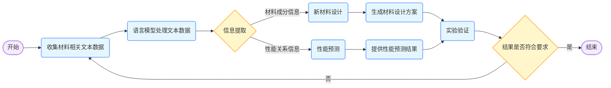

# 语言模型在新材料设计与性能预测中的应用

> 关键词：语言模型、新材料设计、性能预测、材料科学、人工智能

> 摘要：本文聚焦于语言模型在新材料设计与性能预测领域的应用。首先介绍了研究的背景、目的、预期读者和文档结构，解释了相关术语。接着阐述了语言模型、新材料设计和性能预测的核心概念及其联系，给出了文本示意图和 Mermaid 流程图。详细讲解了语言模型用于新材料设计与性能预测的核心算法原理，并使用 Python 代码进行说明。介绍了相关的数学模型和公式，且举例解释。通过项目实战，展示了开发环境搭建、源代码实现与解读。分析了语言模型在实际应用中的场景，推荐了学习资源、开发工具框架和相关论文著作。最后总结了未来发展趋势与挑战，解答了常见问题并提供扩展阅读与参考资料。

## 1. 背景介绍 
### 1.1 目的和范围
随着科技的飞速发展，新材料的研发对于推动各个领域的进步至关重要。传统的新材料设计与性能预测方法往往依赖于大量的实验和复杂的理论计算，耗时且成本高昂。语言模型作为人工智能领域的重要成果，具有强大的文本理解和生成能力。本研究的目的在于探索语言模型在新材料设计与性能预测中的应用，通过利用语言模型处理材料相关的文本数据，挖掘潜在的材料特性和性能关系，为新材料的研发提供新的思路和方法。研究范围涵盖了语言模型在材料成分设计、结构预测、性能评估等方面的应用。

### 1.2 预期读者
本文的预期读者包括材料科学领域的研究人员、工程师，他们希望借助语言模型的力量来加速新材料的研发过程；人工智能领域的从业者，对将语言模型应用于跨学科领域感兴趣；以及相关专业的学生，希望了解语言模型在实际应用中的具体案例。

### 1.3 文档结构概述
本文首先介绍相关背景知识，包括目的、预期读者和文档结构。接着阐述核心概念及其联系，通过示意图和流程图展示。然后详细讲解核心算法原理和具体操作步骤，使用 Python 代码进行说明。介绍相关数学模型和公式，并举例解释。通过项目实战展示代码实现和解读。分析实际应用场景，推荐学习资源、开发工具框架和相关论文著作。最后总结未来发展趋势与挑战，解答常见问题并提供扩展阅读与参考资料。

### 1.4 术语表
#### 1.4.1 核心术语定义
- **语言模型**：是一种基于概率统计的模型，用于预测一个词序列的概率分布，能够根据输入的文本生成合理的后续文本。
- **新材料设计**：指研发具有新的性能、结构或功能的材料的过程，包括材料成分、结构的设计等。
- **性能预测**：根据材料的成分、结构等信息，预测材料的各种性能，如力学性能、热性能等。

#### 1.4.2 相关概念解释
- **材料基因组计划**：旨在通过整合计算、实验和数据等手段，加速新材料的研发过程，类似于人类基因组计划对生物学的推动。
- **自然语言处理（NLP）**：是人工智能的一个分支，研究如何让计算机理解和处理人类语言，语言模型是 NLP 的重要工具之一。

#### 1.4.3 缩略词列表
- **NLP**：Natural Language Processing（自然语言处理）
- **GPT**：Generative Pretrained Transformer（生成式预训练变换器）

## 2. 核心概念与联系 

### 核心概念原理
#### 语言模型
语言模型的基本原理是基于概率统计，通过对大量文本数据的学习，建立词与词之间的概率关系。以传统的 n-gram 语言模型为例，它假设一个词的出现只与前 n-1 个词有关。例如，在一个 2-gram（二元语法）模型中，一个词 $w_i$ 出现的概率 $P(w_i)$ 可以表示为：
$P(w_i|w_{i-1}) = \frac{C(w_{i-1}, w_i)}{C(w_{i-1})}$
其中 $C(w_{i-1}, w_i)$ 是词对 $(w_{i-1}, w_i)$ 在训练数据中出现的次数，$C(w_{i-1})$ 是词 $w_{i-1}$ 出现的次数。

现代的深度学习语言模型，如 Transformer 架构的模型，通过自注意力机制能够更好地捕捉文本中的长距离依赖关系。自注意力机制允许模型在处理每个词时，关注输入序列中的其他词，从而更好地理解文本的上下文。

#### 新材料设计
新材料设计的核心是根据所需的性能要求，设计材料的成分和结构。这需要考虑材料的原子组成、化学键类型、晶体结构等因素。例如，在设计高强度合金时，需要选择合适的金属元素，并控制它们的比例和分布，以形成有利的晶体结构和强化相。

#### 性能预测
性能预测是基于材料的成分、结构等信息，通过理论模型、实验数据或机器学习方法来预测材料的各种性能。例如，通过量子力学计算可以预测材料的电子结构和光学性能；通过机器学习模型可以根据材料的化学成分预测其力学性能。

### 架构的文本示意图
```plaintext
语言模型
|
|-- 处理材料相关文本数据
|   |-- 提取材料成分、结构等信息
|   |-- 挖掘潜在的性能关系
|
|-- 与新材料设计交互
|   |-- 根据文本信息生成可能的材料设计方案
|
|-- 与性能预测交互
|   |-- 利用文本信息辅助性能预测模型
|   |-- 提供更准确的性能预测结果
```

### Mermaid 流程图


## 3. 核心算法原理 & 具体操作步骤 

### 核心算法原理
以基于 Transformer 的语言模型为例，其核心算法原理主要包括多头自注意力机制和前馈神经网络。

#### 多头自注意力机制
多头自注意力机制允许模型在不同的表示子空间中关注输入序列的不同部分。对于输入序列 $X = [x_1, x_2,..., x_n]$，首先将每个输入向量 $x_i$ 分别投影到查询（Query）、键（Key）和值（Value）空间，得到 $Q = [q_1, q_2,..., q_n]$，$K = [k_1, k_2,..., k_n]$ 和 $V = [v_1, v_2,..., v_n]$。

然后计算注意力分数：
$Attention(Q, K, V) = softmax(\frac{QK^T}{\sqrt{d_k}})V$
其中 $d_k$ 是查询和键向量的维度。

多头自注意力机制将多个注意力头的输出拼接起来，再进行一次线性变换：
$MultiHead(Q, K, V) = Concat(head_1, head_2,..., head_h)W^O$
其中 $head_i = Attention(QW_i^Q, KW_i^K, VW_i^V)$，$W_i^Q$，$W_i^K$，$W_i^V$ 和 $W^O$ 是可学习的参数矩阵。

#### 前馈神经网络
多头自注意力机制的输出经过一个前馈神经网络，包括两个线性层和一个非线性激活函数（通常是 ReLU）：
$FFN(x) = max(0, xW_1 + b_1)W_2 + b_2$
其中 $W_1$，$W_2$ 是权重矩阵，$b_1$，$b_2$ 是偏置向量。

### 具体操作步骤
#### 数据预处理
收集材料相关的文本数据，如学术论文、实验报告等。对文本数据进行清洗，去除噪声和无关信息，如标点符号、停用词等。将文本数据进行分词处理，将其转换为词序列。

#### 模型训练
使用预训练的语言模型作为基础，如 BERT 或 GPT。在材料相关的文本数据上进行微调，调整模型的参数以适应材料领域的语言特点。

#### 信息提取
使用训练好的语言模型对新的材料文本进行处理，提取材料的成分、结构、性能等信息。可以通过设计特定的任务，如命名实体识别（NER）来提取关键信息。

#### 新材料设计与性能预测
根据提取的信息，结合材料科学的知识和算法，生成可能的新材料设计方案，并预测材料的性能。

### Python 源代码示例
```python
import torch
from transformers import BertTokenizer, BertForSequenceClassification

# 加载预训练的 BERT 模型和分词器
tokenizer = BertTokenizer.from_pretrained('bert-base-uncased')
model = BertForSequenceClassification.from_pretrained('bert-base-uncased')

# 定义输入文本
text = "This material is composed of iron and carbon, and it has high strength."

# 对文本进行分词处理
inputs = tokenizer(text, return_tensors='pt')

# 模型推理
outputs = model(**inputs)

# 获取预测结果
logits = outputs.logits
predicted_class = torch.argmax(logits, dim=1).item()

print(f"Predicted class: {predicted_class}")
```

## 4. 数学模型和公式 & 详细讲解 & 举例说明 

### 语言模型的概率公式
如前面提到的 n-gram 语言模型，一个句子 $S = w_1, w_2,..., w_m$ 的概率可以表示为：
$P(S) = P(w_1, w_2,..., w_m) = \prod_{i=1}^{m} P(w_i|w_{i-1},..., w_{i-n+1})$
例如，在一个 2-gram 模型中，句子 “The dog runs” 的概率为：
$P(The dog runs) = P(The)P(dog|The)P(runs|dog)$

### 自注意力机制的数学公式
前面已经介绍了自注意力机制的基本公式：
$Attention(Q, K, V) = softmax(\frac{QK^T}{\sqrt{d_k}})V$
其中 $Q$ 是查询矩阵，$K$ 是键矩阵，$V$ 是值矩阵。

假设我们有一个输入序列 $X = [x_1, x_2, x_3]$，每个输入向量的维度为 $d = 4$。我们将其投影到查询、键和值空间，得到 $Q$，$K$ 和 $V$，维度均为 $3 \times 4$。

$Q = \begin{bmatrix}
q_1 \\
q_2 \\
q_3
\end{bmatrix}$，$K = \begin{bmatrix}
k_1 \\
k_2 \\
k_3
\end{bmatrix}$，$V = \begin{bmatrix}
v_1 \\
v_2 \\
v_3
\end{bmatrix}$

首先计算 $QK^T$：
$QK^T = \begin{bmatrix}
q_1 \cdot k_1 & q_1 \cdot k_2 & q_1 \cdot k_3 \\
q_2 \cdot k_1 & q_2 \cdot k_2 & q_2 \cdot k_3 \\
q_3 \cdot k_1 & q_3 \cdot k_2 & q_3 \cdot k_3
\end{bmatrix}$

然后除以 $\sqrt{d_k}$ 并应用 softmax 函数：
$softmax(\frac{QK^T}{\sqrt{d_k}}) = \begin{bmatrix}
\frac{e^{\frac{q_1 \cdot k_1}{\sqrt{d_k}}}}{\sum_{j=1}^{3} e^{\frac{q_1 \cdot k_j}{\sqrt{d_k}}}} & \frac{e^{\frac{q_1 \cdot k_2}{\sqrt{d_k}}}}{\sum_{j=1}^{3} e^{\frac{q_1 \cdot k_j}{\sqrt{d_k}}}} & \frac{e^{\frac{q_1 \cdot k_3}{\sqrt{d_k}}}}{\sum_{j=1}^{3} e^{\frac{q_1 \cdot k_j}{\sqrt{d_k}}}} \\
\frac{e^{\frac{q_2 \cdot k_1}{\sqrt{d_k}}}}{\sum_{j=1}^{3} e^{\frac{q_2 \cdot k_j}{\sqrt{d_k}}}} & \frac{e^{\frac{q_2 \cdot k_2}{\sqrt{d_k}}}}{\sum_{j=1}^{3} e^{\frac{q_2 \cdot k_j}{\sqrt{d_k}}}} & \frac{e^{\frac{q_2 \cdot k_3}{\sqrt{d_k}}}}{\sum_{j=1}^{3} e^{\frac{q_2 \cdot k_j}{\sqrt{d_k}}}} \\
\frac{e^{\frac{q_3 \cdot k_1}{\sqrt{d_k}}}}{\sum_{j=1}^{3} e^{\frac{q_3 \cdot k_j}{\sqrt{d_k}}}} & \frac{e^{\frac{q_3 \cdot k_2}{\sqrt{d_k}}}}{\sum_{j=1}^{3} e^{\frac{q_3 \cdot k_j}{\sqrt{d_k}}}} & \frac{e^{\frac{q_3 \cdot k_3}{\sqrt{d_k}}}}{\sum_{j=1}^{3} e^{\frac{q_3 \cdot k_j}{\sqrt{d_k}}}}
\end{bmatrix}$

最后乘以 $V$ 得到注意力输出：
$Attention(Q, K, V) = softmax(\frac{QK^T}{\sqrt{d_k}})V$

### 性能预测的数学模型
在性能预测中，我们可以使用线性回归模型来预测材料的性能。假设我们有 $n$ 个材料样本，每个样本有 $m$ 个特征 $x_{i1}, x_{i2},..., x_{im}$，对应的性能值为 $y_i$。线性回归模型可以表示为：
$y_i = \beta_0 + \beta_1 x_{i1} + \beta_2 x_{i2} +... + \beta_m x_{im} + \epsilon_i$
其中 $\beta_0, \beta_1,..., \beta_m$ 是模型的参数，$\epsilon_i$ 是误差项。

我们可以使用最小二乘法来估计模型的参数，使得误差平方和最小：
$min \sum_{i=1}^{n} (y_i - (\beta_0 + \beta_1 x_{i1} + \beta_2 x_{i2} +... + \beta_m x_{im}))^2$

例如，我们要根据材料的碳含量和合金元素含量来预测材料的强度。假设我们有以下数据：
| 碳含量 ($x_1$) | 合金元素含量 ($x_2$) | 强度 ($y$) |
| --- | --- | --- |
| 0.1 | 0.2 | 500 |
| 0.2 | 0.3 | 600 |
| 0.3 | 0.4 | 700 |

我们可以使用 Python 的 `scikit-learn` 库来实现线性回归模型：
```python
import numpy as np
from sklearn.linear_model import LinearRegression

# 定义特征和目标值
X = np.array([[0.1, 0.2], [0.2, 0.3], [0.3, 0.4]])
y = np.array([500, 600, 700])

# 创建线性回归模型
model = LinearRegression()

# 训练模型
model.fit(X, y)

# 预测新样本的强度
new_X = np.array([[0.4, 0.5]])
predicted_y = model.predict(new_X)

print(f"Predicted strength: {predicted_y[0]}")
```

## 5. 项目实战：代码实际案例和详细解释说明 

### 5.1  开发环境搭建
#### 安装 Python
首先需要安装 Python 环境，建议使用 Python 3.7 及以上版本。可以从 Python 官方网站（https://www.python.org/downloads/）下载并安装。

#### 安装必要的库
使用 `pip` 安装所需的库，包括 `transformers`、`torch`、`scikit-learn` 等：
```sh
pip install transformers torch scikit-learn
```

### 5.2  源代码详细实现和代码解读
以下是一个完整的项目示例，使用语言模型进行材料性能预测。

```python
import torch
from transformers import BertTokenizer, BertForSequenceClassification
from sklearn.model_selection import train_test_split
from sklearn.metrics import accuracy_score
import pandas as pd

# 加载预训练的 BERT 模型和分词器
tokenizer = BertTokenizer.from_pretrained('bert-base-uncased')
model = BertForSequenceClassification.from_pretrained('bert-base-uncased', num_labels=2)

# 加载数据集
data = pd.read_csv('material_data.csv')
texts = data['text'].tolist()
labels = data['label'].tolist()

# 对文本进行分词处理
inputs = tokenizer(texts, padding=True, truncation=True, return_tensors='pt')
labels = torch.tensor(labels)

# 划分训练集和测试集
train_inputs, test_inputs, train_labels, test_labels = train_test_split(inputs['input_ids'], labels, test_size=0.2, random_state=42)
train_attention_mask = inputs['attention_mask'][:len(train_inputs)]
test_attention_mask = inputs['attention_mask'][len(train_inputs):]

# 定义训练参数
optimizer = torch.optim.AdamW(model.parameters(), lr=2e-5)
epochs = 3

# 训练模型
for epoch in range(epochs):
    model.train()
    optimizer.zero_grad()
    outputs = model(train_inputs, attention_mask=train_attention_mask, labels=train_labels)
    loss = outputs.loss
    loss.backward()
    optimizer.step()
    print(f'Epoch {epoch+1}/{epochs}, Loss: {loss.item()}')

# 模型评估
model.eval()
with torch.no_grad():
    outputs = model(test_inputs, attention_mask=test_attention_mask)
    logits = outputs.logits
    predicted_labels = torch.argmax(logits, dim=1)
    accuracy = accuracy_score(test_labels, predicted_labels)
    print(f'Test Accuracy: {accuracy}')
```

### 代码解读与分析
#### 数据加载和预处理
- 使用 `pandas` 库加载包含材料文本和标签的 CSV 文件。
- 使用 `BertTokenizer` 对文本进行分词处理，将其转换为模型可以接受的输入格式。

#### 模型训练
- 使用预训练的 `BertForSequenceClassification` 模型进行微调。
- 定义优化器和训练轮数，使用交叉熵损失函数进行训练。

#### 模型评估
- 在测试集上进行模型评估，计算准确率。

通过这个项目示例，我们可以看到如何使用语言模型进行材料性能预测的基本流程。

## 6. 实际应用场景 
### 材料成分设计
语言模型可以分析大量的材料研究文献，提取不同元素组合与材料性能之间的关系。例如，在设计新型合金时，语言模型可以根据文献中关于各种合金元素对强度、韧性等性能影响的描述，为研究人员提供可能的元素组合方案，从而加速新材料的研发过程。

### 材料结构预测
材料的结构对其性能有着重要影响。语言模型可以处理材料结构相关的文本信息，如晶体结构、分子结构等。通过学习大量的结构描述和对应的性能数据，语言模型可以预测新的材料结构，并评估其可能的性能。例如，在研究新型半导体材料时，语言模型可以根据已知的半导体结构和性能关系，预测具有特定性能的新结构。

### 性能快速评估
在材料研发过程中，需要对材料的性能进行评估。传统的实验方法耗时且成本高。语言模型可以根据材料的成分、结构等信息，快速预测材料的性能。例如，对于一种新的陶瓷材料，语言模型可以根据其化学成分和制备工艺的描述，预测其硬度、热导率等性能，为材料的筛选和优化提供参考。

### 辅助材料专利分析
在材料领域，专利是重要的技术资源。语言模型可以对大量的材料专利进行分析，提取关键技术信息、创新点和潜在的应用领域。这有助于企业和研究机构了解行业动态，发现新的研发方向，避免专利侵权等问题。

## 7. 工具和资源推荐
### 7.1 学习资源推荐
#### 7.1.1 书籍推荐
- 《自然语言处理入门》：介绍了自然语言处理的基本概念、算法和技术，适合初学者入门。
- 《深度学习》：全面介绍了深度学习的理论和实践，包括神经网络、卷积神经网络、循环神经网络等。
- 《材料科学基础》：系统阐述了材料科学的基本原理和知识，对于理解材料设计和性能预测有重要帮助。

#### 7.1.2 在线课程
- Coursera 上的“Natural Language Processing Specialization”：由顶尖高校的教授授课，涵盖了自然语言处理的各个方面。
- edX 上的“Deep Learning for Everyone”：适合初学者了解深度学习的基本概念和应用。
- 中国大学 MOOC 上的“材料科学基础”：国内高校的优质课程，讲解详细易懂。

#### 7.1.3 技术博客和网站
- Medium：有很多关于自然语言处理和材料科学的技术博客，作者来自不同的领域，分享了很多实践经验和最新研究成果。
- arXiv：一个预印本数据库，包含了大量的学术论文，其中有很多关于语言模型和材料科学交叉领域的研究。
- 材料人网：专注于材料科学领域的资讯和技术交流，提供了丰富的材料研究动态和技术文章。

### 7.2 开发工具框架推荐
#### 7.2.1 IDE和编辑器
- PyCharm：一款专业的 Python 集成开发环境，具有强大的代码编辑、调试和项目管理功能。
- Jupyter Notebook：交互式的开发环境，适合进行数据探索、模型训练和结果展示。
- Visual Studio Code：轻量级的代码编辑器，支持多种编程语言和插件，可用于快速开发和调试。

#### 7.2.2 调试和性能分析工具
- TensorBoard：用于可视化深度学习模型的训练过程和性能指标，帮助开发者监控模型的训练情况。
- Py-Spy：一个性能分析工具，可以分析 Python 程序的性能瓶颈，找出耗时的代码段。
- Debugpy：Python 的调试器，可用于在 IDE 中进行代码调试。

#### 7.2.3 相关框架和库
- Transformers：Hugging Face 开发的一个强大的自然语言处理框架，提供了各种预训练的语言模型和工具，方便进行语言模型的开发和应用。
- PyTorch：一个开源的深度学习框架，具有动态图和易于使用的特点，广泛应用于自然语言处理和材料科学领域。
- Scikit-learn：一个机器学习库，提供了丰富的机器学习算法和工具，可用于材料性能预测等任务。

### 7.3 相关论文著作推荐
#### 7.3.1 经典论文
- “Attention Is All You Need”：介绍了 Transformer 架构，是现代语言模型的基础。
- “BERT: Pre-training of Deep Bidirectional Transformers for Language Understanding”：提出了 BERT 模型，开启了预训练语言模型的新时代。
- “Materials Genome Initiative for Global Competitiveness”：阐述了材料基因组计划的理念和目标，对材料科学的发展产生了深远影响。

#### 7.3.2 最新研究成果
- 在 arXiv 和顶级学术期刊（如 Nature、Science、Advanced Materials 等）上搜索关于语言模型在材料设计与性能预测方面的最新研究论文，了解该领域的前沿动态。

#### 7.3.3 应用案例分析
- 一些行业报告和研究机构的出版物中会有语言模型在材料领域的应用案例分析，通过学习这些案例可以了解实际应用中的问题和解决方案。

## 8. 总结：未来发展趋势与挑战
### 未来发展趋势
#### 多模态融合
未来的语言模型将与图像、视频等多模态数据进行融合，以更全面地理解材料的信息。例如，结合材料的微观结构图像和相关的文本描述，更准确地预测材料的性能。

#### 强化学习与语言模型结合
强化学习可以让语言模型在与环境的交互中不断学习和优化，从而更好地指导新材料的设计。例如，通过强化学习算法，让语言模型在搜索材料设计空间时更加高效。

#### 跨学科合作加强
语言模型在新材料设计与性能预测中的应用需要材料科学、计算机科学、数学等多学科的合作。未来，跨学科的研究团队将更加普遍，推动该领域的快速发展。

### 挑战
#### 数据质量和数量
语言模型的性能很大程度上依赖于数据的质量和数量。在材料领域，高质量的数据往往比较稀缺，且数据的标注成本较高。如何获取更多、更准确的材料相关数据是一个挑战。

#### 模型解释性
深度学习语言模型通常是黑盒模型，其决策过程难以解释。在材料设计和性能预测中，研究人员需要了解模型的决策依据，以便做出合理的判断。提高模型的解释性是当前需要解决的问题之一。

#### 计算资源需求
训练和运行大型语言模型需要大量的计算资源，包括 GPU 和内存。对于一些小型研究机构和企业来说，可能难以承担这样的计算成本。如何降低计算资源需求也是一个挑战。

## 9. 附录：常见问题与解答
### 问题 1：语言模型能否完全替代传统的材料实验？
答：不能。语言模型可以为材料设计和性能预测提供有价值的参考，但目前还不能完全替代传统的材料实验。材料实验可以验证模型的预测结果，并且可以发现一些模型无法预测的新现象和新性能。

### 问题 2：如何选择合适的语言模型用于材料设计与性能预测？
答：可以根据具体的任务和数据情况选择合适的语言模型。如果数据量较小，可以选择预训练的模型进行微调；如果数据量较大，可以考虑自己训练模型。同时，还需要考虑模型的复杂度和计算资源的限制。

### 问题 3：语言模型在处理材料领域的专业术语时是否存在困难？
答：在一定程度上存在困难。材料领域有很多专业术语，这些术语的含义和用法可能比较特殊。语言模型需要经过专门的训练和调整，才能更好地处理这些专业术语。可以使用领域内的专业语料库对模型进行微调，以提高模型对专业术语的理解能力。

## 10. 扩展阅读 & 参考资料
### 扩展阅读
- 《人工智能与材料科学》：深入探讨了人工智能在材料科学各个方面的应用，包括新材料设计、性能预测等。
- 《材料信息学》：介绍了材料信息学的理论和方法，以及如何利用数据和算法加速材料研发。

### 参考资料
- Hugging Face 官方文档：https://huggingface.co/docs
- PyTorch 官方文档：https://pytorch.org/docs/stable/index.html
- Scikit-learn 官方文档：https://scikit-learn.org/stable/documentation.html

作者：AI天才研究院/AI Genius Institute & 禅与计算机程序设计艺术 /Zen And The Art of Computer Programming