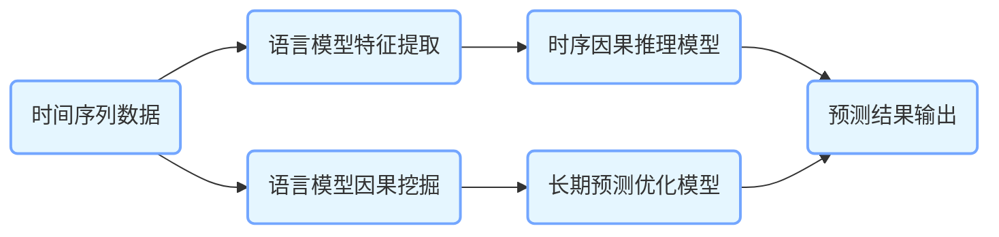

# 语言模型在时序因果推理与长期预测优化中的突破

> 关键词：语言模型、时序因果推理、长期预测优化、因果关系挖掘、时间序列分析

> 摘要：本文聚焦于语言模型在时序因果推理与长期预测优化方面的突破。首先介绍了相关背景知识，包括研究目的、预期读者、文档结构和术语定义。接着阐述了核心概念，如时序因果推理和长期预测优化的原理，并给出了相应的架构示意图和流程图。详细讲解了核心算法原理，通过Python代码进行了示例。对涉及的数学模型和公式进行了深入剖析，并举例说明。通过项目实战展示了代码的实际应用和详细解读。探讨了语言模型在多个实际场景中的应用，推荐了相关的学习资源、开发工具和论文著作。最后总结了未来发展趋势与挑战，解答了常见问题，并提供了扩展阅读和参考资料，旨在为读者全面呈现语言模型在该领域的重要进展和应用潜力。

## 1. 背景介绍 
### 1.1 目的和范围
在当今的大数据时代，时间序列数据无处不在，涵盖了金融、气象、医疗、工业等众多领域。对这些时间序列数据进行有效的分析和预测具有重要的现实意义。时序因果推理旨在挖掘时间序列数据中变量之间的因果关系，而长期预测优化则是在因果关系的基础上，提高对未来较长时间内事件发展趋势的预测准确性。语言模型作为近年来人工智能领域的重要突破，具有强大的语言理解和生成能力。本研究的目的在于探索语言模型在时序因果推理与长期预测优化中的应用，挖掘其潜力，为解决实际问题提供新的思路和方法。

本研究的范围主要包括：深入研究语言模型的基本原理和特点，分析其在处理时间序列数据时的优势；探讨时序因果推理和长期预测优化的核心概念和方法；通过理论分析和实验验证，研究如何将语言模型应用于时序因果推理和长期预测优化中；评估语言模型在实际应用中的性能和效果，并提出相应的改进策略。

### 1.2 预期读者
本文的预期读者包括：人工智能领域的研究人员，他们可以从本文中获取语言模型在时序因果推理与长期预测优化方面的最新研究进展和技术方法，为其进一步的研究提供参考；数据科学家和分析师，他们可以学习如何利用语言模型来处理和分析时间序列数据，提高预测的准确性和可靠性；相关行业的从业者，如金融分析师、气象预报员、医疗专家等，他们可以了解语言模型在各自领域中的应用潜力，为实际工作提供新的解决方案；对人工智能和时间序列分析感兴趣的学生和爱好者，他们可以通过本文初步了解相关领域的知识和技术。

### 1.3 文档结构概述
本文将按照以下结构进行组织：
- 核心概念与联系：介绍时序因果推理和长期预测优化的核心概念，以及它们与语言模型之间的联系，并给出相应的架构示意图和流程图。
- 核心算法原理 & 具体操作步骤：详细讲解将语言模型应用于时序因果推理和长期预测优化的核心算法原理，并通过Python代码进行示例。
- 数学模型和公式 & 详细讲解 & 举例说明：对涉及的数学模型和公式进行深入剖析，并通过具体的例子进行说明。
- 项目实战：代码实际案例和详细解释说明：通过一个实际的项目案例，展示如何使用语言模型进行时序因果推理和长期预测优化，并对代码进行详细的解读和分析。
- 实际应用场景：探讨语言模型在不同领域中的实际应用场景。
- 工具和资源推荐：推荐相关的学习资源、开发工具和论文著作。
- 总结：未来发展趋势与挑战：总结语言模型在时序因果推理与长期预测优化中的发展趋势和面临的挑战。
- 附录：常见问题与解答：解答读者在阅读过程中可能遇到的常见问题。
- 扩展阅读 & 参考资料：提供相关的扩展阅读材料和参考资料。

### 1.4 术语表
#### 1.4.1 核心术语定义
- **语言模型**：是一种基于概率统计的模型，用于预测给定上下文下下一个词或符号出现的概率。它可以学习语言的语法、语义和语用信息，从而生成自然流畅的文本。
- **时序因果推理**：是指在时间序列数据中，分析变量之间的因果关系。即确定一个变量的变化是否会导致另一个变量的变化，以及这种因果关系的方向和强度。
- **长期预测优化**：是指在对时间序列数据进行预测时，通过优化预测方法和模型，提高对未来较长时间内事件发展趋势的预测准确性。
- **时间序列数据**：是指按照时间顺序排列的一系列观测值。这些观测值可以是连续的，也可以是离散的，通常反映了某个系统或现象随时间的变化情况。
- **因果关系**：是指一个事件（原因）的发生导致另一个事件（结果）的发生。在时序因果推理中，因果关系通常具有时间先后顺序，即原因事件发生在结果事件之前。

#### 1.4.2 相关概念解释
- **自回归模型**：是一种常用的时间序列预测模型，它基于历史数据来预测未来的值。自回归模型假设当前时刻的值与过去若干时刻的值之间存在线性关系。
- **注意力机制**：是一种在深度学习中广泛应用的机制，它可以自动地关注输入序列中的重要部分，从而提高模型的性能。在语言模型中，注意力机制可以帮助模型更好地理解上下文信息。
- **Transformer架构**：是一种基于注意力机制的深度学习架构，它在自然语言处理领域取得了巨大的成功。Transformer架构具有并行计算的优势，可以处理长序列数据。

#### 1.4.3 缩略词列表
- **LM**：Language Model，语言模型
- **TCI**：Temporal Causal Inference，时序因果推理
- **LPO**：Long - term Prediction Optimization，长期预测优化
- **AR**：Autoregressive，自回归
- **RNN**：Recurrent Neural Network，循环神经网络
- **LSTM**：Long Short - Term Memory，长短期记忆网络
- **GRU**：Gated Recurrent Unit，门控循环单元
- **Transformer**：Transformer架构

## 2. 核心概念与联系 
### 2.1 时序因果推理的核心概念
时序因果推理旨在从时间序列数据中识别变量之间的因果关系。与传统的相关性分析不同，因果关系强调的是一种因果效应，即一个变量的变化会直接导致另一个变量的变化。在时间序列数据中，因果关系通常具有时间先后顺序，原因事件发生在结果事件之前。

例如，在金融领域，股票价格的变化可能受到多种因素的影响，如公司业绩、宏观经济环境、政策变化等。通过时序因果推理，我们可以分析这些因素与股票价格之间的因果关系，从而更好地理解股票价格的波动机制。

### 2.2 长期预测优化的核心概念
长期预测优化是指在对时间序列数据进行预测时，通过优化预测方法和模型，提高对未来较长时间内事件发展趋势的预测准确性。传统的时间序列预测方法，如自回归模型、移动平均模型等，在处理短期预测问题时表现较好，但在长期预测方面存在一定的局限性。

长期预测优化需要考虑更多的因素，如数据的趋势、季节性、周期性等，同时还需要处理数据中的噪声和不确定性。通过引入新的技术和方法，如深度学习、机器学习等，可以提高长期预测的准确性和可靠性。

### 2.3 语言模型与时序因果推理、长期预测优化的联系
语言模型具有强大的语言理解和生成能力，它可以学习语言的语法、语义和语用信息。在时序因果推理和长期预测优化中，语言模型可以发挥以下作用：
- **特征提取**：语言模型可以将时间序列数据转换为文本表示，从而提取数据中的语义信息。这些语义信息可以作为特征输入到时序因果推理和长期预测模型中，提高模型的性能。
- **因果关系挖掘**：语言模型可以学习文本中的因果关系模式，从而帮助挖掘时间序列数据中变量之间的因果关系。例如，通过分析新闻报道、社交媒体数据等文本信息，语言模型可以发现一些潜在的因果关系。
- **预测生成**：语言模型可以根据历史数据生成未来的预测结果。通过对大量时间序列数据的学习，语言模型可以掌握数据的变化规律，从而生成准确的预测。

### 2.4 核心概念架构的文本示意图
```plaintext
                          ┌─────────────────────┐
                          │    时间序列数据     │
                          └─────────────────────┘
                                   │
                                   ▼
┌─────────────────────┐     ┌─────────────────────┐
│  语言模型特征提取  │     │  语言模型因果挖掘  │
└─────────────────────┘     └─────────────────────┘
           │                         │
           ▼                         ▼
┌─────────────────────┐     ┌─────────────────────┐
│  时序因果推理模型  │     │  长期预测优化模型  │
└─────────────────────┘     └─────────────────────┘
                                   │
                                   ▼
                          ┌─────────────────────┐
                          │    预测结果输出     │
                          └─────────────────────┘
```

### 2.5 Mermaid流程图


## 3. 核心算法原理 & 具体操作步骤 
### 3.1 语言模型的基本原理
语言模型的基本任务是预测给定上下文下下一个词或符号出现的概率。常见的语言模型包括基于统计的语言模型和基于深度学习的语言模型。

基于深度学习的语言模型，如Transformer架构的语言模型，通过多层的注意力机制和前馈神经网络来学习语言的表示。以GPT（Generative Pretrained Transformer）为例，它是一种基于Transformer解码器架构的语言模型。

GPT的输入是一系列的词向量，通过多层的Transformer解码器层进行处理。每个Transformer解码器层包含多头注意力机制和前馈神经网络。多头注意力机制可以让模型同时关注输入序列的不同部分，从而捕捉到更丰富的上下文信息。

### 3.2 将语言模型应用于时序因果推理的算法原理
#### 3.2.1 数据预处理
首先，将时间序列数据转换为文本序列。例如，对于股票价格时间序列数据，可以将每个时间点的价格和相关的指标（如成交量、涨跌幅等）转换为一个文本描述，如“在时间点t，股票价格为p，成交量为v，涨跌幅为r”。

#### 3.2.2 特征提取
使用预训练的语言模型对转换后的文本序列进行特征提取。将文本输入到语言模型中，获取模型最后一层的隐藏状态作为文本的特征表示。

```python
import torch
from transformers import AutoTokenizer, AutoModel

# 加载预训练的语言模型和分词器
tokenizer = AutoTokenizer.from_pretrained('bert-base-uncased')
model = AutoModel.from_pretrained('bert-base-uncased')

# 示例时间序列文本
time_series_text = "在时间点t，股票价格为p，成交量为v，涨跌幅为r"

# 对文本进行分词
inputs = tokenizer(time_series_text, return_tensors='pt')

# 获取模型的输出
outputs = model(**inputs)

# 获取最后一层的隐藏状态作为特征
features = outputs.last_hidden_state
```

#### 3.2.3 因果关系挖掘
使用提取的特征训练因果推理模型。常见的因果推理模型包括格兰杰因果检验、结构因果模型等。以格兰杰因果检验为例，它通过比较一个变量的历史值对另一个变量的预测能力来判断因果关系。

```python
import numpy as np
import statsmodels.api as sm
from statsmodels.tsa.stattools import grangercausalitytests

# 假设我们有两个时间序列特征 x 和 y
x = np.random.randn(100)
y = np.random.randn(100)

# 进行格兰杰因果检验
maxlag = 2
test = 'ssr_chi2test'
results = grangercausalitytests(np.column_stack([y, x]), maxlag, verbose=False)

# 输出检验结果
for lag in range(1, maxlag + 1):
    p_value = results[lag][0][test][1]
    print(f'Lag {lag}: p-value = {p_value}')
```

### 3.3 将语言模型应用于长期预测优化的算法原理
#### 3.3.1 数据预处理
同样，将时间序列数据转换为文本序列，并进行分词和编码。

#### 3.3.2 特征提取
使用预训练的语言模型提取特征。

#### 3.3.3 预测模型训练
使用提取的特征训练长期预测模型。可以使用循环神经网络（RNN）、长短期记忆网络（LSTM）、门控循环单元（GRU）等模型。以下是一个使用LSTM进行长期预测的示例代码：

```python
import torch
import torch.nn as nn
import numpy as np

# 定义LSTM模型
class LSTMModel(nn.Module):
    def __init__(self, input_size, hidden_size, output_size):
        super(LSTMModel, self).__init__()
        self.lstm = nn.LSTM(input_size, hidden_size, batch_first=True)
        self.fc = nn.Linear(hidden_size, output_size)

    def forward(self, x):
        out, _ = self.lstm(x)
        out = self.fc(out[:, -1, :])
        return out

# 示例数据
input_size = 10
hidden_size = 20
output_size = 1
sequence_length = 5
batch_size = 32

# 生成随机输入数据
x = torch.randn(batch_size, sequence_length, input_size)
y = torch.randn(batch_size, output_size)

# 初始化模型
model = LSTMModel(input_size, hidden_size, output_size)

# 定义损失函数和优化器
criterion = nn.MSELoss()
optimizer = torch.optim.Adam(model.parameters(), lr=0.001)

# 训练模型
num_epochs = 100
for epoch in range(num_epochs):
    outputs = model(x)
    loss = criterion(outputs, y)

    optimizer.zero_grad()
    loss.backward()
    optimizer.step()

    if (epoch + 1) % 10 == 0:
        print(f'Epoch [{epoch+1}/{num_epochs}], Loss: {loss.item():.4f}')
```

### 3.4 具体操作步骤总结
1. **数据收集**：收集相关的时间序列数据。
2. **数据预处理**：将时间序列数据转换为文本序列，并进行分词和编码。
3. **特征提取**：使用预训练的语言模型提取文本序列的特征。
4. **因果关系挖掘**：使用提取的特征训练因果推理模型，挖掘变量之间的因果关系。
5. **预测模型训练**：使用提取的特征训练长期预测模型，优化预测结果。
6. **模型评估**：使用测试数据对训练好的模型进行评估，评估指标可以包括均方误差（MSE）、平均绝对误差（MAE）等。
7. **模型优化**：根据评估结果对模型进行优化，调整模型的参数和结构。

## 4. 数学模型和公式 & 详细讲解 & 举例说明 
### 4.1 语言模型的数学模型
语言模型的目标是计算给定上下文 $C$ 下下一个词 $w$ 出现的概率 $P(w|C)$。对于基于统计的语言模型，通常使用 $n$ - gram 模型来估计这个概率。

$n$ - gram 模型假设一个词的出现只依赖于它前面的 $n - 1$ 个词。对于一个句子 $w_1, w_2, \cdots, w_m$，其概率可以表示为：

$$P(w_1, w_2, \cdots, w_m) = \prod_{i = 1}^{m} P(w_i|w_{i - n + 1}, \cdots, w_{i - 1})$$

例如，对于一个三元组（trigram）模型（$n = 3$），句子“the dog runs”的概率可以表示为：

$$P(\text{the dog runs}) = P(\text{the}) \times P(\text{dog}|\text{the}) \times P(\text{runs}|\text{the dog})$$

基于深度学习的语言模型，如Transformer架构的语言模型，通过神经网络来学习语言的表示。以Transformer解码器为例，其输入是一系列的词向量 $x_1, x_2, \cdots, x_n$，经过多层的Transformer解码器层处理后，输出每个位置的词概率分布。

Transformer解码器的核心是多头注意力机制，其计算公式如下：

**查询（Query）、键（Key）和值（Value）的计算**：

$$Q = XW^Q, K = XW^K, V = XW^V$$

其中 $X$ 是输入的词向量矩阵，$W^Q$、$W^K$ 和 $W^V$ 是可学习的权重矩阵。

**注意力分数的计算**：

$$\text{Attention}(Q, K, V) = \text{softmax}\left(\frac{QK^T}{\sqrt{d_k}}\right)V$$

其中 $d_k$ 是查询和键的维度。

**多头注意力的计算**：

$$\text{MultiHead}(Q, K, V) = \text{Concat}(\text{head}_1, \cdots, \text{head}_h)W^O$$

其中 $\text{head}_i = \text{Attention}(QW_i^Q, KW_i^K, VW_i^V)$，$W_i^Q$、$W_i^K$、$W_i^V$ 和 $W^O$ 是可学习的权重矩阵。

### 4.2 时序因果推理的数学模型
#### 4.2.1 格兰杰因果检验
格兰杰因果检验的基本思想是，如果一个变量 $X$ 的历史值能够提高对另一个变量 $Y$ 的预测能力，那么就认为 $X$ 是 $Y$ 的格兰杰原因。

假设我们有两个时间序列 $X_t$ 和 $Y_t$，格兰杰因果检验通过比较以下两个回归模型的拟合优度来判断因果关系：

**模型1：仅使用 $Y$ 的历史值预测 $Y$**

$$Y_t = \sum_{i = 1}^{p} \alpha_i Y_{t - i}+\epsilon_{1t}$$

**模型2：使用 $Y$ 和 $X$ 的历史值预测 $Y$**

$$Y_t = \sum_{i = 1}^{p} \alpha_i Y_{t - i}+\sum_{j = 1}^{q} \beta_j X_{t - j}+\epsilon_{2t}$$

其中 $p$ 和 $q$ 是滞后阶数，$\epsilon_{1t}$ 和 $\epsilon_{2t}$ 是误差项。

通过计算 $F$ 统计量来检验 $\beta_1 = \beta_2 = \cdots = \beta_q = 0$ 的原假设：

$$F=\frac{(SSE_1 - SSE_2)/q}{SSE_2/(n - p - q - 1)}$$

其中 $SSE_1$ 和 $SSE_2$ 分别是模型1和模型2的残差平方和，$n$ 是样本数量。

如果 $F$ 统计量大于临界值，则拒绝原假设，认为 $X$ 是 $Y$ 的格兰杰原因。

#### 4.2.2 结构因果模型
结构因果模型（SCM）使用有向无环图（DAG）来表示变量之间的因果关系。每个节点表示一个变量，每条有向边表示一个因果关系。

SCM 可以用一组结构方程来表示。例如，对于一个包含三个变量 $X$、$Y$ 和 $Z$ 的 SCM，其结构方程可以表示为：

$$X = f_X(U_X)$$
$$Y = f_Y(X, U_Y)$$
$$Z = f_Z(X, Y, U_Z)$$

其中 $U_X$、$U_Y$ 和 $U_Z$ 是外生变量，$f_X$、$f_Y$ 和 $f_Z$ 是函数。

通过干预（intervention）操作，可以计算因果效应。例如，要计算 $X$ 对 $Y$ 的因果效应，可以通过固定 $X$ 的值，观察 $Y$ 的变化。

### 4.3 长期预测优化的数学模型
#### 4.3.1 自回归模型
自回归模型（AR）假设当前时刻的值与过去若干时刻的值之间存在线性关系。对于一个 $p$ 阶自回归模型（$AR(p)$），其数学表达式为：

$$y_t = c+\sum_{i = 1}^{p} \varphi_i y_{t - i}+\epsilon_t$$

其中 $y_t$ 是当前时刻的值，$c$ 是常数项，$\varphi_i$ 是自回归系数，$\epsilon_t$ 是误差项。

#### 4.3.2 LSTM 模型
LSTM 模型是一种特殊的循环神经网络，它通过门控机制来解决传统 RNN 的梯度消失问题。LSTM 单元的计算公式如下：

**输入门（Input Gate）**：

$$i_t=\sigma(W_{ii}x_t + W_{hi}h_{t - 1}+b_i)$$

**遗忘门（Forget Gate）**：

$$f_t=\sigma(W_{if}x_t + W_{hf}h_{t - 1}+b_f)$$

**细胞状态更新**：

$$\tilde{C}_t=\tanh(W_{ic}x_t + W_{hc}h_{t - 1}+b_c)$$
$$C_t = f_t \odot C_{t - 1}+i_t \odot \tilde{C}_t$$

**输出门（Output Gate）**：

$$o_t=\sigma(W_{io}x_t + W_{ho}h_{t - 1}+b_o)$$
$$h_t = o_t \odot \tanh(C_t)$$

其中 $x_t$ 是输入，$h_{t - 1}$ 是上一时刻的隐藏状态，$C_{t - 1}$ 是上一时刻的细胞状态，$\sigma$ 是 sigmoid 函数，$\tanh$ 是双曲正切函数，$W$ 是权重矩阵，$b$ 是偏置向量，$\odot$ 表示逐元素相乘。

### 4.4 举例说明
#### 4.4.1 语言模型的例子
假设我们有一个简单的文本序列“the dog runs”，使用 $n$ - gram 模型（$n = 2$）来计算其概率。假设我们有一个训练语料库，统计得到以下概率：

$P(\text{the}) = 0.1$，$P(\text{dog}|\text{the}) = 0.2$，$P(\text{runs}|\text{dog}) = 0.3$

则句子“the dog runs”的概率为：

$$P(\text{the dog runs}) = P(\text{the}) \times P(\text{dog}|\text{the}) \times P(\text{runs}|\text{dog}) = 0.1\times0.2\times0.3 = 0.006$$

#### 4.4.2 时序因果推理的例子
假设我们有两个时间序列 $X_t$ 和 $Y_t$，数据如下：

| $t$ | $X_t$ | $Y_t$ |
| --- | --- | --- |
| 1 | 1 | 2 |
| 2 | 2 | 3 |
| 3 | 3 | 4 |
| 4 | 4 | 5 |
| 5 | 5 | 6 |

我们使用格兰杰因果检验来判断 $X$ 是否是 $Y$ 的格兰杰原因。假设滞后阶数 $p = q = 1$。

首先，拟合模型1：$Y_t=\alpha_1 Y_{t - 1}+\epsilon_{1t}$，得到残差平方和 $SSE_1$。

然后，拟合模型2：$Y_t=\alpha_1 Y_{t - 1}+\beta_1 X_{t - 1}+\epsilon_{2t}$，得到残差平方和 $SSE_2$。

假设计算得到 $SSE_1 = 0.5$，$SSE_2 = 0.1$，样本数量 $n = 5$。

则 $F$ 统计量为：

$$F=\frac{(SSE_1 - SSE_2)/1}{SSE_2/(5 - 1 - 1 - 1)}=\frac{(0.5 - 0.1)/1}{0.1/(2)} = 8$$

假设临界值为 $3.84$，由于 $F = 8>3.84$，则拒绝原假设，认为 $X$ 是 $Y$ 的格兰杰原因。

#### 4.4.3 长期预测优化的例子
假设我们有一个时间序列 $y_t$，使用 $AR(1)$ 模型进行预测。已知 $y_{t - 1}=10$，自回归系数 $\varphi_1 = 0.8$，常数项 $c = 1$。

则预测值 $y_t$ 为：

$$y_t=c+\varphi_1 y_{t - 1}=1 + 0.8\times10 = 9$$


## 5. 项目实战：代码实际案例和详细解释说明 
### 5.1 开发环境搭建
#### 5.1.1 安装Python
首先，确保你已经安装了Python。建议使用Python 3.7及以上版本。你可以从Python官方网站（https://www.python.org/downloads/）下载并安装Python。

#### 5.1.2 创建虚拟环境
为了避免不同项目之间的依赖冲突，建议使用虚拟环境。可以使用 `venv` 或 `conda` 来创建虚拟环境。

使用 `venv` 创建虚拟环境的命令如下：

```bash
python -m venv myenv
```

激活虚拟环境：

- 在Windows上：

```bash
myenv\Scripts\activate
```

- 在Linux或Mac上：

```bash
source myenv/bin/activate
```

#### 5.1.3 安装必要的库
在虚拟环境中安装必要的库，包括 `torch`、`transformers`、`statsmodels` 等。

```bash
pip install torch transformers statsmodels numpy pandas matplotlib
```

### 5.2 源代码详细实现和代码解读
#### 5.2.1 数据准备
我们使用一个简单的股票价格时间序列数据作为示例。首先，生成一些随机的股票价格数据。

```python
import numpy as np
import pandas as pd

# 生成随机的股票价格数据
np.random.seed(0)
n = 100
prices = np.cumprod(1 + np.random.randn(n) * 0.01)

# 创建DataFrame
data = pd.DataFrame({'price': prices})

# 将数据转换为文本序列
text_sequences = []
for i in range(len(data)):
    text = f'在时间点 {i}, 股票价格为 {data["price"][i]:.2f}'
    text_sequences.append(text)

print(text_sequences[:5])
```

**代码解读**：
- 首先，使用 `numpy` 生成随机的股票价格数据。
- 然后，将数据存储在 `pandas` 的 `DataFrame` 中。
- 最后，将每个时间点的股票价格信息转换为文本序列。

#### 5.2.2 特征提取
使用预训练的语言模型（如BERT）提取文本序列的特征。

```python
import torch
from transformers import AutoTokenizer, AutoModel

# 加载预训练的语言模型和分词器
tokenizer = AutoTokenizer.from_pretrained('bert-base-uncased')
model = AutoModel.from_pretrained('bert-base-uncased')

# 对文本序列进行分词和编码
inputs = tokenizer(text_sequences, padding=True, truncation=True, return_tensors='pt')

# 获取模型的输出
with torch.no_grad():
    outputs = model(**inputs)

# 获取最后一层的隐藏状态作为特征
features = outputs.last_hidden_state.mean(dim=1).numpy()

print(features.shape)
```

**代码解读**：
- 加载预训练的BERT模型和分词器。
- 使用分词器对文本序列进行分词和编码，得到输入张量。
- 将输入张量输入到BERT模型中，获取模型的输出。
- 取最后一层隐藏状态的平均值作为文本序列的特征表示。

#### 5.2.3 时序因果推理
使用格兰杰因果检验进行时序因果推理。

```python
import statsmodels.api as sm
from statsmodels.tsa.stattools import grangercausalitytests

# 假设我们有两个特征列
x = features[:, 0]
y = features[:, 1]

# 进行格兰杰因果检验
maxlag = 2
test = 'ssr_chi2test'
results = grangercausalitytests(np.column_stack([y, x]), maxlag, verbose=False)

# 输出检验结果
for lag in range(1, maxlag + 1):
    p_value = results[lag][0][test][1]
    print(f'Lag {lag}: p-value = {p_value}')
```

**代码解读**：
- 选择两个特征列作为时间序列数据。
- 使用 `statsmodels` 库的 `grangercausalitytests` 函数进行格兰杰因果检验。
- 输出不同滞后阶数下的 $p$ 值。

#### 5.2.4 长期预测优化
使用LSTM模型进行长期预测。

```python
import torch
import torch.nn as nn
import numpy as np

# 定义LSTM模型
class LSTMModel(nn.Module):
    def __init__(self, input_size, hidden_size, output_size):
        super(LSTMModel, self).__init__()
        self.lstm = nn.LSTM(input_size, hidden_size, batch_first=True)
        self.fc = nn.Linear(hidden_size, output_size)

    def forward(self, x):
        out, _ = self.lstm(x)
        out = self.fc(out[:, -1, :])
        return out

# 准备训练数据
sequence_length = 10
X = []
y = []
for i in range(len(features) - sequence_length):
    X.append(features[i:i + sequence_length])
    y.append(features[i + sequence_length, 0])

X = np.array(X)
y = np.array(y)

# 转换为张量
X = torch.tensor(X, dtype=torch.float32)
y = torch.tensor(y, dtype=torch.float32).unsqueeze(1)

# 初始化模型
input_size = X.shape[2]
hidden_size = 20
output_size = 1
model = LSTMModel(input_size, hidden_size, output_size)

# 定义损失函数和优化器
criterion = nn.MSELoss()
optimizer = torch.optim.Adam(model.parameters(), lr=0.001)

# 训练模型
num_epochs = 100
for epoch in range(num_epochs):
    outputs = model(X)
    loss = criterion(outputs, y)

    optimizer.zero_grad()
    loss.backward()
    optimizer.step()

    if (epoch + 1) % 10 == 0:
        print(f'Epoch [{epoch+1}/{num_epochs}], Loss: {loss.item():.4f}')
```

**代码解读**：
- 定义LSTM模型，包含一个LSTM层和一个全连接层。
- 准备训练数据，将特征数据转换为适合LSTM模型输入的序列数据。
- 将数据转换为张量，并初始化模型、损失函数和优化器。
- 训练模型，使用均方误差损失函数和Adam优化器。
- 每10个epoch输出一次损失值。

### 5.3 代码解读与分析
#### 5.3.1 数据处理
在数据处理阶段，我们将时间序列数据转换为文本序列，这是为了方便使用语言模型进行特征提取。通过将数值数据转换为文本描述，可以利用语言模型强大的语义理解能力来挖掘数据中的信息。

#### 5.3.2 特征提取
使用预训练的语言模型提取特征可以大大提高特征的质量。预训练的语言模型在大规模文本数据上进行了训练，能够学习到丰富的语言知识和语义信息。通过将文本序列输入到语言模型中，我们可以获取到文本的高级特征表示。

#### 5.3.3 时序因果推理
格兰杰因果检验是一种常用的时序因果推理方法。通过比较不同模型的拟合优度，我们可以判断一个变量是否是另一个变量的格兰杰原因。在代码中，我们使用 `statsmodels` 库提供的函数进行格兰杰因果检验，通过输出的 $p$ 值来判断因果关系的显著性。

#### 5.3.4 长期预测优化
LSTM模型是一种适合处理时间序列数据的深度学习模型。它通过门控机制能够有效地捕捉时间序列数据中的长期依赖关系。在代码中，我们定义了一个简单的LSTM模型，并使用均方误差损失函数和Adam优化器进行训练。通过不断迭代训练，模型可以学习到数据的变化规律，从而提高长期预测的准确性。

## 6. 实际应用场景 
### 6.1 金融领域
在金融领域，语言模型在时序因果推理与长期预测优化方面有广泛的应用。
- **股票价格预测**：通过分析新闻报道、公司公告、社交媒体等文本信息，结合股票价格的时间序列数据，语言模型可以挖掘出影响股票价格的因果因素，如公司业绩、行业动态、宏观经济政策等。然后，利用这些因果关系和历史数据进行长期预测，帮助投资者做出更明智的投资决策。
- **风险管理**：语言模型可以分析金融市场中的各种风险因素，如信用风险、市场风险、流动性风险等。通过对新闻、报告等文本的分析，识别潜在的风险事件，并预测其对金融市场的影响。同时，结合时间序列数据，进行风险的长期预测和优化管理，帮助金融机构制定合理的风险管理策略。

### 6.2 气象领域
- **气象预报**：气象数据是典型的时间序列数据，语言模型可以将气象观测数据、卫星云图等信息转换为文本描述，然后提取其中的语义特征。通过分析这些特征之间的因果关系，语言模型可以提高气象预报的准确性和可靠性。例如，预测降雨、台风等天气事件的发生时间、强度和路径。
- **气候变化研究**：语言模型可以分析大量的气象数据和相关的科学文献，挖掘气候变化的因果机制。通过对历史数据的学习和长期预测，帮助科学家更好地理解气候变化的趋势和影响，为应对气候变化提供决策支持。

### 6.3 医疗领域
- **疾病预测**：语言模型可以结合患者的病历、诊断报告、基因数据等文本信息和时间序列的医疗数据，如生命体征、检验结果等，挖掘疾病发生和发展的因果关系。通过长期预测，提前预警疾病的发生风险，帮助医生制定个性化的治疗方案。
- **医疗资源管理**：通过分析医院的门诊量、住院人数、手术数量等时间序列数据，结合医疗政策、社会事件等文本信息，语言模型可以预测医疗资源的需求趋势。这有助于医院合理安排医疗资源，提高医疗服务的效率和质量。

### 6.4 工业领域
- **设备故障预测**：在工业生产中，设备的运行状态数据是时间序列数据。语言模型可以分析设备的维护记录、故障报告等文本信息，结合设备的传感器数据，挖掘设备故障的因果因素。通过长期预测，提前发现设备的潜在故障，及时进行维护和维修，减少停机时间和生产损失。
- **生产计划优化**：语言模型可以分析市场需求、原材料供应、生产工艺等文本信息和时间序列的生产数据，挖掘它们之间的因果关系。通过长期预测，优化生产计划，提高生产效率和产品质量。

## 7. 工具和资源推荐
### 7.1 学习资源推荐
#### 7.1.1 书籍推荐
- 《深度学习》（Deep Learning）：由Ian Goodfellow、Yoshua Bengio和Aaron Courville所著，是深度学习领域的经典教材，涵盖了神经网络、卷积神经网络、循环神经网络等内容，对理解语言模型和时间序列分析的基本原理有很大帮助。
- 《时间序列分析：预测与控制》（Time Series Analysis: Forecasting and Control）：由George E. P. Box、Gwilym M. Jenkins和Gregory C. Reinsel所著，是时间序列分析领域的权威书籍，详细介绍了时间序列的建模、预测和控制方法。
- 《自然语言处理入门》（Natural Language Processing with Python）：由Steven Bird、Ewan Klein和Edward Loper所著，是自然语言处理领域的入门书籍，介绍了使用Python进行自然语言处理的基本技术和方法，包括分词、词性标注、命名实体识别等。

#### 7.1.2 在线课程
- Coursera上的“深度学习专项课程”（Deep Learning Specialization）：由Andrew Ng教授授课，包括神经网络和深度学习、改善深层神经网络、结构化机器学习项目、卷积神经网络、序列模型等五门课程，对深度学习的各个方面进行了系统的讲解。
- edX上的“时间序列分析与预测”（Time Series Analysis and Forecasting）：由Columbia University提供，介绍了时间序列分析的基本概念、模型和方法，以及如何使用Python进行时间序列预测。
- 哔哩哔哩上的“自然语言处理入门教程”：有很多博主分享的自然语言处理入门教程，内容涵盖了语言模型、文本分类、情感分析等方面，适合初学者学习。

#### 7.1.3 技术博客和网站
- Medium：是一个技术博客平台，有很多关于人工智能、深度学习、自然语言处理等领域的优质文章。可以关注一些知名博主，如Sebastian Ruder、Jay Alammar等，获取最新的技术动态和研究成果。
- arXiv：是一个预印本平台，提供了大量的学术论文。可以搜索关于语言模型、时序因果推理、长期预测优化等方面的论文，了解最新的研究进展。
- Hugging Face Blog：Hugging Face是一个专注于自然语言处理的开源社区，其博客上有很多关于语言模型的使用、优化和应用的文章，对学习和实践有很大的帮助。

### 7.2 开发工具框架推荐
#### 7.2.1 IDE和编辑器
- PyCharm：是一款专门为Python开发设计的集成开发环境（IDE），具有代码编辑、调试、版本控制等功能，支持多种Python库和框架，适合开发大型的Python项目。
- Jupyter Notebook：是一个基于Web的交互式计算环境，支持Python、R等多种编程语言。可以在浏览器中编写代码、运行代码、展示结果，非常适合进行数据分析和模型实验。
- Visual Studio Code：是一款轻量级的代码编辑器，具有丰富的插件和扩展功能。支持Python开发，并且可以与Git等版本控制系统集成，方便团队协作开发。

#### 7.2.2 调试和性能分析工具
- PyTorch Profiler：是PyTorch提供的性能分析工具，可以帮助开发者分析模型的运行时间、内存使用情况等，找出性能瓶颈，优化模型性能。
- TensorBoard：是TensorFlow提供的可视化工具，也可以与PyTorch集成使用。可以可视化模型的训练过程、损失曲线、准确率等指标，帮助开发者监控模型的训练状态。
- cProfile：是Python标准库中的性能分析工具，可以分析Python代码的运行时间和函数调用情况，找出代码中的性能瓶颈。

#### 7.2.3 相关框架和库
- PyTorch：是一个开源的深度学习框架，具有动态图的特点，易于使用和调试。提供了丰富的神经网络层和优化器，支持GPU加速，广泛应用于自然语言处理、计算机视觉等领域。
- TensorFlow：是另一个开源的深度学习框架，具有静态图的特点，适合大规模分布式训练。提供了高级的API和工具，如Keras，方便开发者快速搭建和训练模型。
- Transformers：是Hugging Face开发的一个自然语言处理库，提供了多种预训练的语言模型，如BERT、GPT、XLNet等，以及相应的工具和接口，方便开发者使用和微调这些模型。
- Statsmodels：是一个Python库，提供了多种统计模型和方法，包括时间序列分析、回归分析、假设检验等。可以用于时序因果推理和长期预测优化中的统计分析。

### 7.3 相关论文著作推荐
#### 7.3.1 经典论文
- “Attention Is All You Need”：介绍了Transformer架构，是自然语言处理领域的经典论文。Transformer架构通过多头注意力机制，有效地解决了传统循环神经网络在处理长序列数据时的问题，为语言模型的发展奠定了基础。
- “Learning Representations by Back-propagating Errors”：是神经网络领域的经典论文，介绍了反向传播算法，使得神经网络的训练变得可行。反向传播算法是深度学习中最基本的训练算法之一。
- “Granger Causality Tests: A Review of Recent Theoretical and Empirical Developments”：对格兰杰因果检验进行了全面的综述，介绍了格兰杰因果检验的基本原理、扩展方法和应用场景。

#### 7.3.2 最新研究成果
- “GPT-3: Language Models are Few-Shot Learners”：介绍了GPT - 3模型，展示了语言模型在少样本学习方面的强大能力。GPT - 3模型具有1750亿个参数，在多个自然语言处理任务中取得了优异的成绩。
- “Causal Discovery with Reinforcement Learning”：提出了一种基于强化学习的因果发现方法，通过强化学习代理在因果图空间中进行搜索，提高了因果发现的效率和准确性。
- “Long - Term Forecasting with Temporal Fusion Transformers”：介绍了Temporal Fusion Transformers（TFT）模型，用于时间序列数据的长期预测。TFT模型结合了Transformer架构和门控机制，能够有效地捕捉时间序列数据中的长期依赖关系和季节性特征。

#### 7.3.3 应用案例分析
- “Applying Language Models to Financial Forecasting”：介绍了如何将语言模型应用于金融预测，通过分析新闻文本和社交媒体数据，挖掘影响金融市场的因果因素，提高金融预测的准确性。
- “Using Language Models for Weather Forecasting”：探讨了语言模型在气象预报中的应用，通过将气象数据转换为文本信息，利用语言模型的语义理解能力，提高气象预报的可靠性。
- “Medical Diagnosis and Prediction with Language Models”：展示了语言模型在医疗诊断和预测中的应用，通过分析患者的病历和诊断报告，挖掘疾病的因果关系，帮助医生进行准确的诊断和预测。

## 8. 总结：未来发展趋势与挑战
### 8.1 未来发展趋势
#### 8.1.1 模型融合与创新
未来，语言模型将与其他模型（如因果模型、深度学习模型等）进行更深入的融合。例如，将语言模型的语义理解能力与因果模型的因果推理能力相结合，开发出更强大的时序因果推理和长期预测模型。同时，研究人员也会不断探索新的模型架构和算法，提高模型的性能和效率。

#### 8.1.2 多模态数据处理
随着数据类型的不断丰富，未来的模型将能够处理多模态数据，包括文本、图像、音频、视频等。例如，在气象预报中，除了分析气象数据的文本信息，还可以结合卫星云图、雷达图像等多模态数据，提高预报的准确性。语言模型将在多模态数据的融合和处理中发挥重要作用。

#### 8.1.3 跨领域应用拓展
语言模型在时序因果推理与长期预测优化方面的应用将不断拓展到更多的领域。除了金融、气象、医疗、工业等领域，还将应用于交通、能源、教育等领域。通过解决不同领域的实际问题，推动各行业的数字化