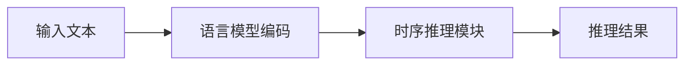

# 语言模型在时序推理任务中的优化方法

> 关键词：语言模型、时序推理任务、优化方法、深度学习、自然语言处理

> 摘要：本文聚焦于语言模型在时序推理任务中的优化方法。首先介绍了研究的背景、目的和范围，明确预期读者和文档结构。接着阐述了语言模型和时序推理任务的核心概念及联系，给出了原理和架构的示意图与流程图。详细讲解了核心算法原理，用Python代码进行说明，并分析了相关数学模型和公式。通过项目实战展示了代码的实际应用和解读。探讨了该技术在多个实际场景中的应用，推荐了学习资源、开发工具框架以及相关论文著作。最后总结了未来发展趋势与挑战，还提供了常见问题解答和扩展阅读参考资料，旨在为提升语言模型在时序推理任务中的性能提供全面的技术指导。

## 1. 背景介绍 
### 1.1 目的和范围
随着自然语言处理技术的不断发展，语言模型在各种任务中取得了显著的成果。然而，在时序推理任务中，语言模型仍然面临着诸多挑战，如对时间顺序的理解不准确、对时序信息的利用不充分等。本研究的目的在于探索有效的优化方法，提高语言模型在时序推理任务中的性能。研究范围涵盖了常见的语言模型架构，如Transformer系列模型，以及多种时序推理任务，包括事件顺序判断、时间跨度预测等。

### 1.2 预期读者
本文预期读者包括自然语言处理领域的研究人员、深度学习工程师、对语言模型和时序推理感兴趣的学生等。无论是希望深入了解相关技术原理的学术研究者，还是致力于将其应用于实际项目的工程师，都能从本文中获取有价值的信息。

### 1.3 文档结构概述
本文共分为十个部分。第一部分为背景介绍，阐述研究的目的、范围、预期读者和文档结构。第二部分介绍语言模型和时序推理任务的核心概念及联系，并给出相应的示意图和流程图。第三部分详细讲解核心算法原理，并使用Python代码进行说明。第四部分分析相关的数学模型和公式，并举例说明。第五部分通过项目实战展示代码的实际应用和详细解读。第六部分探讨语言模型在时序推理任务中的实际应用场景。第七部分推荐学习资源、开发工具框架以及相关论文著作。第八部分总结未来发展趋势与挑战。第九部分为附录，提供常见问题解答。第十部分列出扩展阅读和参考资料。

### 1.4 术语表
#### 1.4.1 核心术语定义
- **语言模型**：一种基于概率统计的模型，用于预测给定文本序列的下一个词或字符的概率分布。在深度学习中，通常指基于神经网络的语言模型，如循环神经网络（RNN）、长短期记忆网络（LSTM）、Transformer等。
- **时序推理任务**：涉及对时间顺序、时间间隔、事件先后关系等时间相关信息进行推理和判断的任务。例如，判断两个事件的先后顺序、预测事件发生的时间等。
- **优化方法**：为了提高语言模型在时序推理任务中的性能而采用的各种技术和策略，包括模型架构改进、训练方法优化、数据增强等。

#### 1.4.2 相关概念解释
- **时间戳**：用于表示某个事件发生的具体时间点的数值或字符串。在时序推理任务中，时间戳是重要的输入信息。
- **事件序列**：由一系列按时间顺序排列的事件组成的序列。语言模型需要对事件序列进行处理和分析，以完成时序推理任务。
- **注意力机制**：一种在神经网络中用于自动关注输入序列中不同部分的机制。在语言模型中，注意力机制可以帮助模型更好地捕捉文本中的重要信息和上下文关系。

#### 1.4.3 缩略词列表
- **RNN**：Recurrent Neural Network，循环神经网络
- **LSTM**：Long Short-Term Memory，长短期记忆网络
- **GRU**：Gated Recurrent Unit，门控循环单元
- **Transformer**：一种基于注意力机制的深度学习模型架构
- **BERT**：Bidirectional Encoder Representations from Transformers，基于Transformer的双向编码器表示模型

## 2. 核心概念与联系 

### 语言模型原理
语言模型的核心目标是学习语言的概率分布，即给定一个输入文本序列 $x_1, x_2, \cdots, x_n$，预测下一个词 $x_{n+1}$ 的概率 $P(x_{n+1}|x_1, x_2, \cdots, x_n)$。传统的语言模型如n-gram模型，通过统计语料库中n个连续词出现的频率来估计概率。而现代的深度学习语言模型，如Transformer系列模型，则通过神经网络自动学习语言的特征和模式。

Transformer模型是一种基于注意力机制的架构，它由多个编码器和解码器层组成。编码器层通过多头注意力机制对输入序列进行特征提取和表示学习，解码器层则根据编码器的输出生成目标序列。

### 时序推理任务原理
时序推理任务主要关注事件的时间顺序和时间关系。在处理时序推理任务时，需要将文本中的时间信息和事件信息进行提取和分析。例如，对于文本“小明早上8点出门，下午3点回家”，需要提取出“早上8点”和“下午3点”两个时间戳，以及“出门”和“回家”两个事件，并判断它们的先后顺序。

### 核心概念联系
语言模型为时序推理任务提供了文本理解和特征表示的基础。通过语言模型，可以将文本中的时间信息和事件信息进行编码，转化为向量表示。然后，基于这些向量表示，可以设计专门的时序推理模块，对事件的时间顺序和时间关系进行推理和判断。

### 文本示意图
```plaintext
输入文本 -> 语言模型编码 -> 时序推理模块 -> 推理结果
```

### Mermaid流程图


## 3. 核心算法原理 & 具体操作步骤 

### 基于Transformer的语言模型编码
在时序推理任务中，通常使用预训练的Transformer模型（如BERT）对输入文本进行编码。以下是使用Python和Hugging Face的`transformers`库进行文本编码的示例代码：

```python
from transformers import BertTokenizer, BertModel

# 加载预训练的BERT模型和分词器
tokenizer = BertTokenizer.from_pretrained('bert-base-uncased')
model = BertModel.from_pretrained('bert-base-uncased')

# 输入文本
text = "小明早上8点出门，下午3点回家"

# 分词
inputs = tokenizer(text, return_tensors='pt')

# 编码
outputs = model(**inputs)

# 获取最后一层的隐藏状态
last_hidden_state = outputs.last_hidden_state
print(last_hidden_state.shape)
```

### 时序推理模块设计
在得到语言模型的编码输出后，需要设计专门的时序推理模块来完成具体的推理任务。例如，对于事件顺序判断任务，可以使用一个全连接层将编码输出映射到一个二元分类器：

```python
import torch
import torch.nn as nn

class TemporalReasoningModule(nn.Module):
    def __init__(self, input_dim):
        super(TemporalReasoningModule, self).__init__()
        self.fc = nn.Linear(input_dim, 2)  # 二元分类器

    def forward(self, x):
        # 对编码输出进行池化操作，例如取均值
        pooled_output = torch.mean(x, dim=1)
        logits = self.fc(pooled_output)
        return logits

# 初始化时序推理模块
input_dim = last_hidden_state.shape[-1]
temporal_module = TemporalReasoningModule(input_dim)

# 进行推理
logits = temporal_module(last_hidden_state)
print(logits.shape)
```

### 具体操作步骤
1. **数据预处理**：对输入的文本数据进行清洗、分词等预处理操作，将其转换为适合语言模型输入的格式。
2. **语言模型编码**：使用预训练的语言模型对预处理后的文本进行编码，得到文本的向量表示。
3. **时序推理模块设计**：根据具体的时序推理任务，设计相应的时序推理模块，如全连接层、循环神经网络等。
4. **模型训练**：使用标注好的训练数据对语言模型和时序推理模块进行联合训练，优化模型的参数。
5. **模型评估**：使用测试数据对训练好的模型进行评估，计算模型的准确率、召回率等指标。

## 4. 数学模型和公式 & 详细讲解 & 举例说明 

### 语言模型的概率公式
语言模型的目标是学习语言的概率分布 $P(x_1, x_2, \cdots, x_n)$。根据链式法则，可以将其分解为条件概率的乘积：

$$P(x_1, x_2, \cdots, x_n) = \prod_{i=1}^{n} P(x_i|x_1, x_2, \cdots, x_{i-1})$$

例如，对于一个简单的三元语言模型，预测下一个词 $x_3$ 的概率可以表示为：

$$P(x_3|x_1, x_2) = \frac{C(x_1, x_2, x_3)}{C(x_1, x_2)}$$

其中，$C(x_1, x_2, x_3)$ 表示三元组 $(x_1, x_2, x_3)$ 在语料库中出现的次数，$C(x_1, x_2)$ 表示二元组 $(x_1, x_2)$ 在语料库中出现的次数。

### Transformer模型的注意力机制公式
Transformer模型中的多头注意力机制由多个并行的注意力头组成。每个注意力头的计算过程如下：

1. **线性变换**：将输入的查询（Query）、键（Key）和值（Value）分别进行线性变换：

$$Q = XW^Q, K = XW^K, V = XW^V$$

其中，$X$ 是输入序列的嵌入表示，$W^Q$、$W^K$ 和 $W^V$ 是可学习的权重矩阵。

2. **注意力分数计算**：计算查询和键之间的注意力分数：

$$Attention(Q, K, V) = \text{softmax}(\frac{QK^T}{\sqrt{d_k}})V$$

其中，$d_k$ 是键的维度，$\text{softmax}$ 函数用于将注意力分数归一化到 $[0, 1]$ 之间。

3. **多头注意力合并**：将多个注意力头的输出进行拼接，并进行线性变换：

$$MultiHead(Q, K, V) = \text{Concat}(head_1, head_2, \cdots, head_h)W^O$$

其中，$h$ 是注意力头的数量，$W^O$ 是可学习的权重矩阵。

### 时序推理模块的损失函数
对于事件顺序判断任务，通常使用交叉熵损失函数来训练模型：

$$L = -\sum_{i=1}^{N} [y_i \log(p_i) + (1 - y_i) \log(1 - p_i)]$$

其中，$N$ 是样本数量，$y_i$ 是真实标签（0或1），$p_i$ 是模型预测的概率。

### 举例说明
假设我们有一个简单的事件顺序判断任务，输入文本为“事件A发生在事件B之前”，真实标签为1（表示事件A先发生）。经过语言模型编码和时序推理模块处理后，模型输出的概率为 $p = 0.8$。则交叉熵损失为：

$$L = -[1 \times \log(0.8) + (1 - 1) \times \log(1 - 0.8)] \approx 0.223$$

## 5. 项目实战：代码实际案例和详细解释说明 

### 5.1  开发环境搭建
1. **安装Python**：建议使用Python 3.7及以上版本。
2. **安装必要的库**：使用`pip`安装`transformers`、`torch`等库：

```sh
pip install transformers torch
```

### 5.2  源代码详细实现和代码解读
以下是一个完整的事件顺序判断任务的代码示例：

```python
import torch
import torch.nn as nn
from transformers import BertTokenizer, BertModel
from torch.utils.data import Dataset, DataLoader
from sklearn.model_selection import train_test_split

# 定义数据集类
class TemporalDataset(Dataset):
    def __init__(self, texts, labels, tokenizer, max_length):
        self.texts = texts
        self.labels = labels
        self.tokenizer = tokenizer
        self.max_length = max_length

    def __len__(self):
        return len(self.texts)

    def __getitem__(self, idx):
        text = self.texts[idx]
        label = self.labels[idx]
        inputs = self.tokenizer(text, return_tensors='pt', padding='max_length', truncation=True, max_length=self.max_length)
        input_ids = inputs['input_ids'].squeeze()
        attention_mask = inputs['attention_mask'].squeeze()
        return {
            'input_ids': input_ids,
            'attention_mask': attention_mask,
            'labels': torch.tensor(label, dtype=torch.long)
        }

# 定义模型类
class TemporalReasoningModel(nn.Module):
    def __init__(self, bert_model_name):
        super(TemporalReasoningModel, self).__init__()
        self.bert = BertModel.from_pretrained(bert_model_name)
        self.fc = nn.Linear(self.bert.config.hidden_size, 2)

    def forward(self, input_ids, attention_mask):
        outputs = self.bert(input_ids=input_ids, attention_mask=attention_mask)
        pooled_output = outputs.pooler_output
        logits = self.fc(pooled_output)
        return logits

# 训练函数
def train(model, dataloader, optimizer, criterion, device):
    model.train()
    total_loss = 0
    for batch in dataloader:
        input_ids = batch['input_ids'].to(device)
        attention_mask = batch['attention_mask'].to(device)
        labels = batch['labels'].to(device)

        optimizer.zero_grad()
        logits = model(input_ids, attention_mask)
        loss = criterion(logits, labels)
        loss.backward()
        optimizer.step()
        total_loss += loss.item()
    return total_loss / len(dataloader)

# 评估函数
def evaluate(model, dataloader, criterion, device):
    model.eval()
    total_loss = 0
    correct = 0
    total = 0
    with torch.no_grad():
        for batch in dataloader:
            input_ids = batch['input_ids'].to(device)
            attention_mask = batch['attention_mask'].to(device)
            labels = batch['labels'].to(device)

            logits = model(input_ids, attention_mask)
            loss = criterion(logits, labels)
            total_loss += loss.item()

            _, predicted = torch.max(logits, 1)
            total += labels.size(0)
            correct += (predicted == labels).sum().item()
    accuracy = correct / total
    return total_loss / len(dataloader), accuracy

# 主函数
def main():
    # 示例数据
    texts = [
        "事件A发生在事件B之前",
        "事件B发生在事件A之后",
        "事件A和事件B同时发生"
    ]
    labels = [1, 1, 0]

    # 划分训练集和测试集
    train_texts, test_texts, train_labels, test_labels = train_test_split(texts, labels, test_size=0.2, random_state=42)

    # 初始化分词器和模型
    tokenizer = BertTokenizer.from_pretrained('bert-base-uncased')
    model = TemporalReasoningModel('bert-base-uncased')

    # 数据集和数据加载器
    train_dataset = TemporalDataset(train_texts, train_labels, tokenizer, max_length=128)
    test_dataset = TemporalDataset(test_texts, test_labels, tokenizer, max_length=128)
    train_dataloader = DataLoader(train_dataset, batch_size=2, shuffle=True)
    test_dataloader = DataLoader(test_dataset, batch_size=2, shuffle=False)

    # 设备和优化器
    device = torch.device('cuda' if torch.cuda.is_available() else 'cpu')
    model.to(device)
    optimizer = torch.optim.Adam(model.parameters(), lr=2e-5)
    criterion = nn.CrossEntropyLoss()

    # 训练模型
    num_epochs = 3
    for epoch in range(num_epochs):
        train_loss = train(model, train_dataloader, optimizer, criterion, device)
        test_loss, test_accuracy = evaluate(model, test_dataloader, criterion, device)
        print(f'Epoch {epoch+1}/{num_epochs}, Train Loss: {train_loss:.4f}, Test Loss: {test_loss:.4f}, Test Accuracy: {test_accuracy:.4f}')

if __name__ == "__main__":
    main()
```

### 5.3  代码解读与分析
1. **数据集类`TemporalDataset`**：用于封装文本数据和标签，并进行分词和编码操作。通过`__getitem__`方法返回每个样本的输入ID、注意力掩码和标签。
2. **模型类`TemporalReasoningModel`**：继承自`nn.Module`，包含一个预训练的BERT模型和一个全连接层。`forward`方法实现了模型的前向传播过程。
3. **训练函数`train`**：在训练过程中，将输入数据传入模型，计算损失并进行反向传播和参数更新。
4. **评估函数`evaluate`**：在评估过程中，使用测试数据计算模型的损失和准确率。
5. **主函数`main`**：完成数据的划分、模型的初始化、数据集和数据加载器的创建、设备和优化器的设置，以及模型的训练和评估。

## 6. 实际应用场景 
### 智能客服
在智能客服系统中，用户的提问可能涉及到事件的时间顺序和时间关系。例如，用户可能会问“我上周提交的申请什么时候能处理完”，语言模型需要能够理解“上周”这个时间信息，并结合其他相关信息进行推理和回答。通过优化语言模型在时序推理任务中的性能，可以提高智能客服的回答准确性和效率。

### 新闻事件分析
在新闻领域，需要对大量的新闻事件进行分析和处理。语言模型可以用于判断新闻事件的先后顺序、挖掘事件之间的因果关系等。例如，对于一系列关于某一重大事件的新闻报道，语言模型可以帮助分析事件的发展脉络和演变过程。

### 医疗记录分析
在医疗领域，患者的医疗记录包含了大量的时间相关信息，如就诊时间、检查时间、治疗时间等。语言模型可以用于分析这些时间信息，帮助医生更好地了解患者的病情发展和治疗过程。例如，判断某种治疗方法的效果是否与治疗时间有关。

### 金融风险预测
在金融领域，市场数据和交易记录都具有时间序列特征。语言模型可以用于分析金融文本数据中的时间信息，预测金融市场的走势和风险。例如，通过分析财经新闻中的时间敏感信息，预测股票价格的波动。

## 7. 工具和资源推荐
### 7.1 学习资源推荐
#### 7.1.1 书籍推荐
- 《深度学习》（Deep Learning）：由Ian Goodfellow、Yoshua Bengio和Aaron Courville所著，是深度学习领域的经典教材，涵盖了神经网络、卷积神经网络、循环神经网络等多种模型和算法。
- 《自然语言处理入门》（Natural Language Processing with Python）：介绍了使用Python进行自然语言处理的基础知识和技术，包括文本处理、分词、词性标注、命名实体识别等。
- 《Attention Is All You Need》：Transformer模型的原始论文，详细介绍了Transformer的架构和原理。

#### 7.1.2 在线课程
- Coursera上的“Deep Learning Specialization”：由Andrew Ng教授主讲的深度学习专项课程，包括神经网络基础、卷积神经网络、循环神经网络等多个模块。
- edX上的“Natural Language Processing with Deep Learning”：介绍了自然语言处理中的深度学习方法，包括语言模型、机器翻译、情感分析等。
- Hugging Face的官方文档和教程：提供了丰富的关于Transformer模型和自然语言处理的学习资源，包括代码示例和实战项目。

#### 7.1.3 技术博客和网站
- Medium上的Towards Data Science：汇集了大量关于数据科学、机器学习和深度学习的技术文章和教程。
- arXiv.org：提供了最新的学术论文和研究成果，涵盖了自然语言处理、人工智能等多个领域。
- 开源中国（OSChina）：国内知名的开源技术社区，提供了丰富的技术文章和开源项目。

### 7.2 开发工具框架推荐
#### 7.2.1 IDE和编辑器
- PyCharm：一款功能强大的Python集成开发环境，提供了代码编辑、调试、版本控制等多种功能。
- Jupyter Notebook：一种交互式的开发环境，适合进行数据探索和模型实验。
- Visual Studio Code：一款轻量级的代码编辑器，支持多种编程语言和插件扩展。

#### 7.2.2 调试和性能分析工具
- PyTorch Profiler：PyTorch提供的性能分析工具，可以帮助开发者分析模型的运行时间和内存使用情况。
- TensorBoard：TensorFlow提供的可视化工具，也可以用于PyTorch模型的训练过程可视化和性能分析。
- cProfile：Python内置的性能分析工具，可以帮助开发者找出代码中的性能瓶颈。

#### 7.2.3 相关框架和库
- Transformers：Hugging Face开发的用于自然语言处理的库，提供了多种预训练的语言模型和工具，方便开发者进行模型的加载、微调等操作。
- PyTorch：一个开源的深度学习框架，具有动态图、易于使用等特点，广泛应用于自然语言处理、计算机视觉等领域。
- SpaCy：一个用于自然语言处理的Python库，提供了快速的分词、词性标注、命名实体识别等功能。

### 7.3 相关论文著作推荐
#### 7.3.1 经典论文
- “A Neural Probabilistic Language Model”：提出了基于神经网络的语言模型，为现代深度学习语言模型的发展奠定了基础。
- “Long Short-Term Memory”：介绍了长短期记忆网络（LSTM）的原理和应用，解决了传统循环神经网络中的梯度消失和梯度爆炸问题。
- “BERT: Pre-training of Deep Bidirectional Transformers for Language Understanding”：提出了BERT模型，通过双向预训练的方式在多个自然语言处理任务中取得了显著的成果。

#### 7.3.2 最新研究成果
- 关注ACL（Association for Computational Linguistics）、EMNLP（Conference on Empirical Methods in Natural Language Processing）等自然语言处理领域的顶级会议，获取最新的研究成果和技术进展。
- 关注arXiv.org上的相关研究论文，了解语言模型在时序推理任务中的最新优化方法和应用。

#### 7.3.3 应用案例分析
- 一些知名的科技公司和研究机构会发布关于语言模型在实际应用中的案例分析报告，如Google、Facebook、Microsoft等。可以通过他们的官方博客和研究报告了解相关应用案例。

## 8. 总结：未来发展趋势与挑战
### 未来发展趋势
- **多模态融合**：将语言模型与视觉、音频等多模态信息进行融合，以更好地处理包含多种模态信息的时序推理任务。例如，在视频分析中，结合视频中的图像和语音信息进行事件顺序判断和时间预测。
- **强化学习与语言模型的结合**：使用强化学习方法优化语言模型在时序推理任务中的决策过程，提高模型的自适应能力和推理效率。例如，通过奖励机制引导模型在不同的时间点做出最优的推理决策。
- **知识增强的语言模型**：将外部知识融入到语言模型中，提高模型对时间和事件的理解能力。例如，使用知识图谱为语言模型提供额外的时间和事件关系信息。

### 挑战
- **数据稀缺**：时序推理任务需要大量的标注数据，但标注时间相关信息的成本较高，导致可用的标注数据相对稀缺。如何在数据稀缺的情况下提高模型的性能是一个挑战。
- **复杂的时间语义理解**：自然语言中的时间语义非常复杂，存在多种表达方式和歧义。语言模型需要具备更强的语义理解能力，才能准确地处理时序推理任务。
- **计算资源需求**：现代的语言模型通常规模较大，训练和推理过程需要大量的计算资源。如何在有限的计算资源下提高模型的效率和性能是一个亟待解决的问题。

## 9. 附录：常见问题与解答
### 问题1：如何处理文本中的时间表达歧义？
答：可以采用以下方法处理时间表达歧义：
- **上下文信息利用**：结合文本的上下文信息，推断时间表达的具体含义。例如，“明天”这个词在不同的上下文中可能指代不同的日期。
- **规则匹配**：定义一些时间表达的规则，通过规则匹配来消除歧义。例如，对于“上个月”，可以根据当前日期计算出具体的月份。
- **机器学习方法**：使用机器学习模型对时间表达进行分类和识别，提高对歧义时间表达的处理能力。

### 问题2：如何提高语言模型在时序推理任务中的泛化能力？
答：可以从以下几个方面提高语言模型的泛化能力：
- **数据增强**：通过对训练数据进行变换和扩充，增加数据的多样性，提高模型对不同数据的适应能力。例如，对时间信息进行随机替换、修改等操作。
- **正则化方法**：使用正则化方法（如L1、L2正则化）对模型的参数进行约束，防止模型过拟合。
- **多任务学习**：将时序推理任务与其他相关任务进行联合学习，让模型学习到更丰富的特征和模式，提高泛化能力。

### 问题3：如何评估语言模型在时序推理任务中的性能？
答：可以使用以下指标评估语言模型在时序推理任务中的性能：
- **准确率**：预测正确的样本数占总样本数的比例，反映模型的整体预测能力。
- **召回率**：预测正确的正样本数占实际正样本数的比例，反映模型对正样本的识别能力。
- **F1值**：准确率和召回率的调和平均数，综合考虑了模型的准确率和召回率。
- **均方误差（MSE）**：对于时间跨度预测等回归任务，可以使用均方误差来评估模型的预测精度。

## 10. 扩展阅读 & 参考资料
- 《自然语言处理综论》（Speech and Language Processing）：由Daniel Jurafsky和James H. Martin所著，全面介绍了自然语言处理的理论和技术。
- 《深度学习实战》（Deep Learning in Practice）：结合实际案例介绍了深度学习在各个领域的应用，包括自然语言处理、计算机视觉等。
- “Temporal Knowledge Graph Completion via Time-Aware Transformer”：关于时序知识图谱补全的研究论文，介绍了一种基于时间感知Transformer的方法。
- Hugging Face官方文档：https://huggingface.co/docs/transformers/index
- PyTorch官方文档：https://pytorch.org/docs/stable/index.html

作者：AI天才研究院/AI Genius Institute & 禅与计算机程序设计艺术 /Zen And The Art of Computer Programming