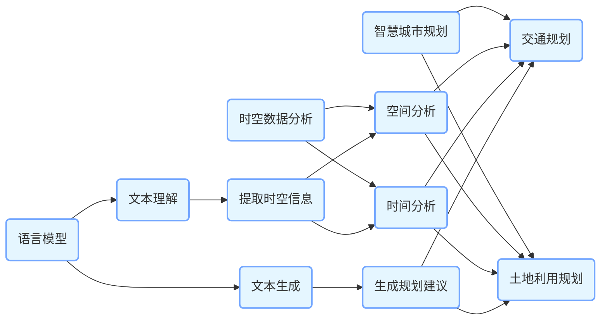

# 语言模型在时空数据分析与智慧城市规划中的应用研究

> 关键词：语言模型、时空数据分析、智慧城市规划、自然语言处理、地理信息系统

> 摘要：本文深入探讨了语言模型在时空数据分析与智慧城市规划中的应用。首先介绍了研究的背景、目的、预期读者等信息。接着阐述了语言模型、时空数据分析和智慧城市规划的核心概念及其联系，给出了相应的原理和架构示意图。详细讲解了核心算法原理及具体操作步骤，通过Python代码进行说明。引入了相关的数学模型和公式，并举例说明。通过项目实战展示了语言模型在实际中的应用，包括开发环境搭建、源代码实现和解读。分析了语言模型在智慧城市规划中的实际应用场景，推荐了学习资源、开发工具框架和相关论文著作。最后总结了未来发展趋势与挑战，解答了常见问题，并提供了扩展阅读和参考资料。

## 1. 背景介绍 
### 1.1 目的和范围
本研究的目的在于探索语言模型在时空数据分析与智慧城市规划领域的应用潜力和价值。随着城市化进程的加速，城市面临着人口增长、资源分配不均、交通拥堵等诸多挑战。智慧城市规划旨在利用先进的信息技术解决这些问题，提高城市的运行效率和居民的生活质量。时空数据分析能够揭示城市中各种现象的时空分布和变化规律，为智慧城市规划提供重要依据。而语言模型作为自然语言处理领域的重要技术，具有强大的文本理解和生成能力。将语言模型应用于时空数据分析与智慧城市规划，可以帮助我们更好地处理和分析与城市相关的文本信息，挖掘其中蕴含的时空知识，为城市规划决策提供更全面、准确的支持。

本研究的范围涵盖了语言模型在时空数据分析的各个环节，如数据预处理、特征提取、模式识别等，以及在智慧城市规划的多个方面，如交通规划、土地利用规划、公共服务设施布局等的应用。

### 1.2 预期读者
本文的预期读者包括从事智慧城市规划、地理信息科学、自然语言处理等领域的研究人员、工程师和决策者。对于希望了解语言模型在跨领域应用的学生和爱好者也具有一定的参考价值。

### 1.3 文档结构概述
本文将按照以下结构进行组织：首先介绍相关背景信息，包括目的、预期读者和文档结构概述等。接着阐述语言模型、时空数据分析和智慧城市规划的核心概念及其联系，给出原理和架构示意图。然后详细讲解核心算法原理及具体操作步骤，通过Python代码进行说明。引入相关的数学模型和公式，并举例说明。通过项目实战展示语言模型在实际中的应用，包括开发环境搭建、源代码实现和解读。分析语言模型在智慧城市规划中的实际应用场景，推荐学习资源、开发工具框架和相关论文著作。最后总结未来发展趋势与挑战，解答常见问题，并提供扩展阅读和参考资料。

### 1.4 术语表
#### 1.4.1 核心术语定义
- **语言模型**：是一种基于概率统计或深度学习的模型，用于预测给定文本序列中下一个词的概率分布，能够对自然语言进行理解和生成。
- **时空数据分析**：是对具有时间和空间属性的数据进行收集、处理、分析和可视化的过程，旨在揭示数据中的时空模式和规律。
- **智慧城市规划**：是运用先进的信息技术，对城市的基础设施、资源、环境等进行全面规划和管理，以提高城市的运行效率和居民的生活质量。
- **自然语言处理**：是研究如何让计算机理解和处理人类自然语言的技术领域，包括文本分类、信息抽取、机器翻译等任务。
- **地理信息系统（GIS）**：是一种用于采集、存储、管理、分析和展示地理空间数据的系统。

#### 1.4.2 相关概念解释
- **文本嵌入**：将文本转换为向量表示的过程，以便计算机能够处理和分析文本。
- **时空特征**：反映数据在时间和空间上的特征，如时间序列、空间位置、空间分布等。
- **城市语义**：城市中各种实体和现象的语义信息，如建筑类型、土地用途、交通流量等。

#### 1.4.3 缩略词列表
- **NLP**：自然语言处理（Natural Language Processing）
- **GIS**：地理信息系统（Geographic Information System）
- **BERT**：双向编码器表示来自变换器（Bidirectional Encoder Representations from Transformers）

## 2. 核心概念与联系 

### 2.1 核心概念原理
#### 2.1.1 语言模型原理
语言模型的基本原理是根据给定的文本序列预测下一个词的概率分布。传统的语言模型基于统计方法，如n-gram模型，通过统计语料库中词的共现频率来计算概率。近年来，基于深度学习的语言模型取得了巨大的成功，如Transformer架构的语言模型（如BERT、GPT等）。这些模型通过多层的自注意力机制，能够捕捉文本中的长距离依赖关系，从而更准确地理解文本的语义。

以BERT为例，它是一种预训练的双向语言模型。BERT的训练过程包括两个任务：掩码语言模型（Masked Language Model，MLM）和下一句预测（Next Sentence Prediction，NSP）。在MLM任务中，输入的文本中一部分词被随机掩码，模型需要预测这些掩码词。在NSP任务中，模型需要判断两个句子是否在原始文本中是连续的。通过这两个任务的训练，BERT能够学习到丰富的语言知识。

#### 2.1.2 时空数据分析原理
时空数据分析的核心是处理和分析具有时间和空间属性的数据。常见的时空数据包括地理信息数据、传感器数据、社交媒体数据等。时空数据分析的方法包括空间统计分析、时间序列分析、时空建模等。

空间统计分析用于研究数据在空间上的分布和相关性，如空间自相关分析、空间插值等。时间序列分析用于分析数据随时间的变化趋势，如趋势分析、季节性分析等。时空建模则是将时间和空间因素结合起来，建立能够描述时空现象的模型，如时空回归模型、时空克里金模型等。

#### 2.1.3 智慧城市规划原理
智慧城市规划的目标是利用信息技术实现城市的可持续发展和高效运行。其原理包括数据驱动的决策、智能化的管理和服务、以及城市各部门之间的协同合作。

数据驱动的决策是指通过收集和分析城市中的各种数据，如交通流量、能源消耗、人口分布等，为城市规划提供科学依据。智能化的管理和服务则是利用人工智能、物联网等技术，实现城市基础设施的自动化管理和个性化的公共服务。城市各部门之间的协同合作则是打破部门壁垒，实现信息共享和资源整合，提高城市管理的效率。

### 2.2 核心概念架构示意图


### 2.3 核心概念联系
语言模型与时空数据分析的联系在于，语言模型可以用于处理和分析与时空数据相关的文本信息。例如，社交媒体数据中包含了大量的关于城市活动和事件的文本描述，通过语言模型可以提取其中的时空信息，如地点、时间等，为时空数据分析提供补充。

时空数据分析为智慧城市规划提供了重要的基础数据和分析方法。通过对城市中的时空数据进行分析，可以了解城市的运行状况和发展趋势，为城市规划决策提供科学依据。

语言模型在智慧城市规划中的应用主要体现在生成规划建议和辅助决策方面。通过对城市相关的文本信息进行理解和分析，语言模型可以生成关于交通规划、土地利用规划等方面的建议，为城市规划者提供参考。

## 3. 核心算法原理 & 具体操作步骤 

### 3.1 核心算法原理
#### 3.1.1 语言模型算法原理
以BERT为例，其核心算法基于Transformer架构。Transformer架构主要由编码器和解码器组成，BERT只使用了编码器部分。编码器由多个相同的层堆叠而成，每层包含多头自注意力机制和前馈神经网络。

多头自注意力机制允许模型在不同的表示子空间中并行地关注输入序列的不同部分，从而捕捉文本中的长距离依赖关系。前馈神经网络则对自注意力机制的输出进行非线性变换，进一步提取特征。

在训练过程中，BERT通过最大化掩码语言模型和下一句预测任务的损失函数来学习语言知识。在推理阶段，输入的文本经过BERT编码后得到一系列的向量表示，可以用于各种自然语言处理任务，如文本分类、信息抽取等。

#### 3.1.2 时空数据分析算法原理
时空数据分析涉及多种算法，这里以时空克里金模型为例进行介绍。时空克里金模型是一种用于时空插值的方法，它结合了空间克里金和时间序列分析的思想。

时空克里金模型的基本原理是基于时空协方差函数来估计未知点的数值。时空协方差函数描述了数据在时间和空间上的相关性。通过对已知点的数据进行分析，估计时空协方差函数的参数，然后利用这些参数对未知点进行插值。

### 3.2 具体操作步骤
#### 3.2.1 语言模型操作步骤
1. **数据预处理**：收集与城市相关的文本数据，如新闻报道、社交媒体帖子等。对数据进行清洗、分词等预处理操作。
2. **模型加载**：使用预训练的BERT模型，可以从Hugging Face的Transformers库中加载。
3. **文本编码**：将预处理后的文本输入到BERT模型中，得到文本的向量表示。
4. **任务特定处理**：根据具体的任务，如信息抽取、文本分类等，对编码后的向量进行进一步处理。例如，在信息抽取任务中，可以使用一个全连接层将向量映射到标签空间，然后通过softmax函数得到每个标签的概率。

以下是一个使用Python和Transformers库实现文本编码的示例代码：
```python
from transformers import BertTokenizer, BertModel

# 加载预训练的BERT模型和分词器
tokenizer = BertTokenizer.from_pretrained('bert-base-uncased')
model = BertModel.from_pretrained('bert-base-uncased')

# 待编码的文本
text = "There is a traffic jam near the city center."

# 对文本进行分词
inputs = tokenizer(text, return_tensors='pt')

# 将分词后的文本输入到BERT模型中
outputs = model(**inputs)

# 获取文本的向量表示
embeddings = outputs.last_hidden_state
print(embeddings.shape)
```

#### 3.2.2 时空数据分析操作步骤
1. **数据收集**：收集具有时间和空间属性的数据，如地理信息数据、传感器数据等。
2. **数据预处理**：对数据进行清洗、归一化等预处理操作，去除噪声和异常值。
3. **时空协方差函数估计**：根据数据的特点选择合适的时空协方差函数，如指数协方差函数、高斯协方差函数等。使用最大似然估计等方法估计协方差函数的参数。
4. **时空插值**：利用估计得到的时空协方差函数对未知点进行插值，得到未知点的数值估计。

以下是一个简单的时空克里金插值的Python示例代码（使用`pykrige`库）：
```python
import numpy as np
from pykrige.ok3d import OrdinaryKriging3D

# 已知点的时空坐标和数值
x = np.array([1, 2, 3, 4, 5])
y = np.array([1, 2, 3, 4, 5])
z = np.array([1, 2, 3, 4, 5])
values = np.array([10, 20, 30, 40, 50])

# 未知点的时空坐标
xi = np.array([2.5])
yi = np.array([2.5])
zi = np.array([2.5])

# 创建普通克里金3D对象
ok3d = OrdinaryKriging3D(x, y, z, values, variogram_model='linear')

# 进行插值
zinterp, sigmasq = ok3d.execute('points', xi, yi, zi)
print(zinterp)
```

## 4. 数学模型和公式 & 详细讲解 & 举例说明 

### 4.1 语言模型数学模型和公式
#### 4.1.1 掩码语言模型损失函数
在掩码语言模型任务中，给定一个输入序列 $x = [x_1, x_2, \cdots, x_n]$，其中一部分词被随机掩码。设掩码位置的集合为 $M$，模型需要预测这些掩码位置的词。

损失函数可以定义为交叉熵损失：
$$L_{MLM} = -\frac{1}{|M|}\sum_{i \in M}\log P(x_i|x_{1:i - 1}, x_{i + 1:n})$$
其中，$P(x_i|x_{1:i - 1}, x_{i + 1:n})$ 是模型预测掩码位置 $i$ 处词 $x_i$ 的概率。

#### 4.1.2 下一句预测损失函数
在下一句预测任务中，给定两个句子 $A$ 和 $B$，模型需要判断 $B$ 是否是 $A$ 的下一句。设 $y$ 是真实标签（$y = 1$ 表示 $B$ 是 $A$ 的下一句，$y = 0$ 表示不是），$P(y|A, B)$ 是模型预测的概率。

损失函数可以定义为二元交叉熵损失：
$$L_{NSP} = -[y\log P(y|A, B) + (1 - y)\log(1 - P(y|A, B))]$$

BERT的总损失函数为：
$$L = L_{MLM} + L_{NSP}$$

### 4.2 时空数据分析数学模型和公式
#### 4.2.1 时空协方差函数
时空协方差函数描述了数据在时间和空间上的相关性。常见的时空协方差函数有指数协方差函数和高斯协方差函数。

指数协方差函数的公式为：
$$C(h_s, h_t) = \sigma^2\exp\left(-\frac{\|h_s\|}{\theta_s}-\frac{|h_t|}{\theta_t}\right)$$
其中，$h_s$ 是空间距离向量，$h_t$ 是时间距离，$\sigma^2$ 是方差，$\theta_s$ 和 $\theta_t$ 分别是空间和时间的尺度参数。

高斯协方差函数的公式为：
$$C(h_s, h_t) = \sigma^2\exp\left(-\frac{\|h_s\|^2}{\theta_s^2}-\frac{h_t^2}{\theta_t^2}\right)$$

#### 4.2.2 时空克里金插值公式
设已知点的时空坐标为 $(x_i, y_i, t_i)$，对应的数值为 $z_i$，$i = 1, 2, \cdots, n$。未知点的时空坐标为 $(x_0, y_0, t_0)$。

时空克里金插值的公式为：
$$\hat{z}(x_0, y_0, t_0) = \sum_{i = 1}^{n}\lambda_i z_i$$
其中，$\lambda_i$ 是权重系数，通过求解以下方程组得到：
$$\begin{cases}
\sum_{j = 1}^{n}\lambda_j C((x_i, y_i, t_i), (x_j, y_j, t_j)) + \mu = C((x_i, y_i, t_i), (x_0, y_0, t_0)) & i = 1, 2, \cdots, n \\
\sum_{i = 1}^{n}\lambda_i = 1
\end{cases}$$
其中，$C$ 是时空协方差函数，$\mu$ 是拉格朗日乘子。

### 4.3 举例说明
#### 4.3.1 语言模型举例
假设我们有一个文本分类任务，要判断一条新闻报道是否与城市交通相关。我们可以使用BERT模型进行文本编码，然后通过一个全连接层进行分类。

以下是一个简单的Python代码示例：
```python
import torch
import torch.nn as nn
from transformers import BertTokenizer, BertModel

# 加载预训练的BERT模型和分词器
tokenizer = BertTokenizer.from_pretrained('bert-base-uncased')
bert_model = BertModel.from_pretrained('bert-base-uncased')

# 定义分类模型
class TextClassifier(nn.Module):
    def __init__(self):
        super(TextClassifier, self).__init__()
        self.bert = bert_model
        self.fc = nn.Linear(768, 2)  # 二分类

    def forward(self, input_ids, attention_mask):
        outputs = self.bert(input_ids=input_ids, attention_mask=attention_mask)
        pooled_output = outputs.pooler_output
        logits = self.fc(pooled_output)
        return logits

# 创建分类模型实例
model = TextClassifier()

# 待分类的文本
text = "The traffic in the city is getting worse."

# 对文本进行分词
inputs = tokenizer(text, return_tensors='pt')

# 前向传播
logits = model(inputs['input_ids'], inputs['attention_mask'])
probabilities = torch.softmax(logits, dim=1)
print(probabilities)
```

#### 4.3.2 时空数据分析举例
假设我们有一些气象站的气温数据，每个气象站有经纬度和观测时间信息。我们要使用时空克里金模型对某个未知地点和时间的气温进行插值。

以下是一个简单的Python代码示例：
```python
import numpy as np
from pykrige.ok3d import OrdinaryKriging3D

# 已知点的时空坐标和气温值
x = np.array([1, 2, 3, 4, 5])
y = np.array([1, 2, 3, 4, 5])
z = np.array([1, 2, 3, 4, 5])
temperatures = np.array([20, 22, 25, 23, 21])

# 未知点的时空坐标
xi = np.array([2.5])
yi = np.array([2.5])
zi = np.array([2.5])

# 创建普通克里金3D对象
ok3d = OrdinaryKriging3D(x, y, z, temperatures, variogram_model='exponential')

# 进行插值
zinterp, sigmasq = ok3d.execute('points', xi, yi, zi)
print("Interpolated temperature:", zinterp)
```

## 5. 项目实战：代码实际案例和详细解释说明 

### 5.1  开发环境搭建
#### 5.1.1 安装Python
首先需要安装Python，建议使用Python 3.7及以上版本。可以从Python官方网站（https://www.python.org/downloads/）下载并安装。

#### 5.1.2 创建虚拟环境
为了避免不同项目之间的依赖冲突，建议使用虚拟环境。可以使用`venv`或`conda`来创建虚拟环境。

使用`venv`创建虚拟环境的命令如下：
```bash
python -m venv myenv
```
激活虚拟环境：
```bash
# Windows
myenv\Scripts\activate

# Linux/Mac
source myenv/bin/activate
```

#### 5.1.3 安装依赖库
在虚拟环境中安装所需的依赖库，包括`transformers`、`torch`、`pykrige`等。可以使用`pip`进行安装：
```bash
pip install transformers torch pykrige numpy pandas matplotlib
```

### 5.2  源代码详细实现和代码解读
#### 5.2.1 语言模型在信息抽取中的应用
以下是一个使用BERT模型进行城市事件信息抽取的代码示例：
```python
import torch
from transformers import BertTokenizer, BertForTokenClassification

# 加载预训练的BERT模型和分词器
tokenizer = BertTokenizer.from_pretrained('bert-base-uncased')
model = BertForTokenClassification.from_pretrained('bert-base-uncased', num_labels=3)  # 假设3个标签

# 待抽取信息的文本
text = "There was a fire accident at the shopping mall yesterday."

# 对文本进行分词
inputs = tokenizer(text, return_tensors='pt')

# 前向传播
outputs = model(**inputs)
logits = outputs.logits
predictions = torch.argmax(logits, dim=2)

# 解码预测结果
predicted_labels = []
for token, label_id in zip(inputs.tokens(), predictions[0].tolist()):
    if label_id == 0:
        label = 'O'  # 非实体
    elif label_id == 1:
        label = 'B-Event'  # 事件起始
    elif label_id == 2:
        label = 'I-Event'  # 事件内部
    predicted_labels.append((token, label))

print(predicted_labels)
```
代码解读：
1. **模型加载**：使用`BertTokenizer`和`BertForTokenClassification`加载预训练的BERT模型和分词器。
2. **文本分词**：使用分词器对输入文本进行分词，得到输入的张量。
3. **前向传播**：将输入张量输入到模型中，得到预测的logits。
4. **预测结果解码**：通过`torch.argmax`函数得到每个词的预测标签，然后将标签解码为字符串形式。

#### 5.2.2 时空数据分析在城市交通流量预测中的应用
以下是一个使用时空克里金模型进行城市交通流量预测的代码示例：
```python
import numpy as np
from pykrige.ok3d import OrdinaryKriging3D

# 已知点的时空坐标和交通流量
x = np.array([1, 2, 3, 4, 5])
y = np.array([1, 2, 3, 4, 5])
z = np.array([1, 2, 3, 4, 5])
traffic_flows = np.array([100, 200, 300, 400, 500])

# 未知点的时空坐标
xi = np.array([2.5])
yi = np.array([2.5])
zi = np.array([2.5])

# 创建普通克里金3D对象
ok3d = OrdinaryKriging3D(x, y, z, traffic_flows, variogram_model='gaussian')

# 进行插值
zinterp, sigmasq = ok3d.execute('points', xi, yi, zi)
print("Predicted traffic flow:", zinterp)
```
代码解读：
1. **数据准备**：准备已知点的时空坐标和交通流量数据，以及未知点的时空坐标。
2. **创建克里金对象**：使用`OrdinaryKriging3D`创建时空克里金对象，指定协方差函数为高斯协方差函数。
3. **进行插值**：调用`execute`方法对未知点进行插值，得到预测的交通流量。

### 5.3  代码解读与分析
#### 5.3.1 语言模型代码分析
在语言模型的信息抽取代码中，使用`BertForTokenClassification`模型可以直接对输入文本中的每个词进行分类，判断其是否属于某个实体。通过修改`num_labels`参数可以调整分类的标签数量。

该代码的优点是简单易用，利用了预训练的BERT模型的强大语义理解能力。缺点是需要大量的标注数据进行微调，以提高模型的性能。

#### 5.3.2 时空数据分析代码分析
在时空数据分析的交通流量预测代码中，使用`pykrige`库的`OrdinaryKriging3D`类可以方便地实现时空克里金插值。通过选择不同的协方差函数，可以适应不同的数据特点。

该代码的优点是能够考虑数据的时空相关性，提高预测的准确性。缺点是对数据的质量和分布有一定的要求，需要进行适当的预处理。

## 6. 实际应用场景 
### 6.1 交通规划
语言模型可以用于分析社交媒体、新闻报道等文本信息，提取与交通相关的事件，如交通事故、道路施工等。时空数据分析可以对交通流量数据进行建模和预测，了解交通流量的时空分布规律。将两者结合起来，可以为交通规划提供更全面的信息。例如，根据文本信息和交通流量预测结果，合理调整交通信号灯的时间，优化公交线路的规划。

### 6.2 土地利用规划
通过语言模型分析城市发展相关的政策文件、规划报告等文本，提取土地利用的相关信息，如土地用途、开发强度等。时空数据分析可以对土地利用的历史数据进行分析，了解土地利用的变化趋势。结合两者的结果，可以制定更科学合理的土地利用规划方案，提高土地资源的利用效率。

### 6.3 公共服务设施布局
语言模型可以分析居民的需求和反馈，如通过社交媒体了解居民对公共服务设施的满意度和需求。时空数据分析可以对人口分布、交通状况等数据进行分析，确定公共服务设施的合理布局位置。例如，根据居民的需求和人口分布情况，合理规划医院、学校、公园等公共服务设施的位置和规模。

### 6.4 城市安全管理
语言模型可以用于监测城市中的安全事件，如火灾、地震等。通过分析新闻报道、社交媒体等文本信息，及时发现安全事件的发生。时空数据分析可以对安全事件的发生地点和时间进行分析，预测安全事件的发生概率和影响范围。结合两者的结果，可以制定相应的应急预案，提高城市的安全管理水平。

## 7. 工具和资源推荐
### 7.1 学习资源推荐
#### 7.1.1 书籍推荐
- 《自然语言处理入门》：介绍了自然语言处理的基本概念和方法，适合初学者。
- 《地理信息系统原理、方法和应用》：系统地介绍了地理信息系统的原理、方法和应用，是学习时空数据分析的重要参考书籍。
- 《深度学习》：深度学习领域的经典教材，介绍了深度学习的基本原理和算法。

#### 7.1.2 在线课程
- Coursera上的“Natural Language Processing Specialization”：由顶尖高校的教授授课，系统地介绍了自然语言处理的各个方面。
- edX上的“Geospatial Data Science”：提供了地理空间数据科学的相关课程，包括时空数据分析的方法和工具。
- 网易云课堂上的“深度学习实战”：通过实际案例介绍深度学习的应用，有助于提高实践能力。

#### 7.1.3 技术博客和网站
- Hugging Face的博客：提供了关于语言模型的最新研究成果和应用案例。
- GIS Lounge：是一个地理信息系统领域的技术博客，分享了许多时空数据分析的方法和技巧。
- Medium上的人工智能和机器学习相关博客：可以了解到该领域的最新动态和研究趋势。

### 7.2 开发工具框架推荐
#### 7.2.1 IDE和编辑器
- PyCharm：是一款功能强大的Python集成开发环境，提供了代码编辑、调试、版本控制等功能。
- Jupyter Notebook：适合进行数据探索和实验，支持Python、R等多种编程语言。
- Visual Studio Code：轻量级的代码编辑器，支持多种编程语言和插件扩展。

#### 7.2.2 调试和性能分析工具
- Py-Spy：可以对Python程序进行性能分析，找出性能瓶颈。
- TensorBoard：是TensorFlow的可视化工具，可以用于可视化模型的训练过程和性能指标。
- PDB：Python自带的调试器，可以用于调试Python程序。

#### 7.2.3 相关框架和库
- Transformers：Hugging Face开发的自然语言处理框架，提供了多种预训练的语言模型和工具。
- PyTorch：深度学习框架，支持动态图计算，易于使用和调试。
- GeoPandas：基于Pandas的地理空间数据处理库，提供了丰富的地理空间数据处理和分析功能。

### 7.3 相关论文著作推荐
#### 7.3.1 经典论文
- “Attention Is All You Need”：介绍了Transformer架构，是深度学习领域的经典论文。
- “BERT: Pre-training of Deep Bidirectional Transformers for Language Understanding”：提出了BERT模型，在自然语言处理领域取得了巨大的成功。
- “Geostatistics for Natural Resources Evaluation”：系统地介绍了地质统计学的理论和方法，是时空数据分析的重要参考论文。

#### 7.3.2 最新研究成果
- 关注ACM SIGKDD、IEEE Transactions on Knowledge and Data Engineering等会议和期刊，了解时空数据分析和自然语言处理领域的最新研究成果。
- 关注各大高校和研究机构的研究团队的最新论文，如斯坦福大学、麻省理工学院等。

#### 7.3.3 应用案例分析
- 一些知名企业和研究机构会发布关于语言模型在智慧城市规划中的应用案例，如IBM、Google等。可以通过他们的官方网站或研究报告了解这些应用案例。

## 8. 总结：未来发展趋势与挑战
### 8.1 未来发展趋势
#### 8.1.1 多模态融合
未来，语言模型将与图像、视频等多模态数据进行融合，以更全面地理解城市中的各种现象。例如，结合卫星图像和文本信息，对城市的土地利用变化进行更准确的监测和分析。

#### 8.1.2 强化学习与决策优化
将强化学习与语言模型和时空数据分析相结合，实现智慧城市规划的决策优化。通过不断地与环境进行交互，学习最优的规划策略，提高城市的运行效率和居民的生活质量。

#### 8.1.3 边缘计算与实时处理
随着物联网技术的发展，城市中会产生大量的实时数据。未来，语言模型和时空数据分析将向边缘计算方向发展，实现实时数据的快速处理和分析，为城市的实时决策提供支持。

### 8.2 挑战
#### 8.2.1 数据质量和隐私问题
城市数据来源广泛，数据质量参差不齐。同时，数据隐私问题也是一个重要的挑战。如何保证数据的质量和安全性，是语言模型在时空数据分析与智慧城市规划中应用的关键问题。

#### 8.2.2 模型可解释性
深度学习模型，尤其是语言模型，通常是黑盒模型，难以解释其决策过程。在智慧城市规划中，需要模型具有可解释性，以便决策者能够理解和信任模型的输出结果。

#### 8.2.3 跨领域融合的难度
语言模型、时空数据分析和智慧城市规划涉及多个领域的知识和技术，跨领域融合存在一定的难度。需要培养具有跨领域知识和技能的人才，促进不同领域之间的交流与合作。

## 9. 附录：常见问题与解答
### 9.1 语言模型在时空数据分析中的应用效果如何？
语言模型可以帮助提取与时空数据相关的文本信息，为时空数据分析提供补充。但语言模型的应用效果取决于数据的质量和模型的性能。在实际应用中，需要对数据进行预处理和模型进行微调，以提高应用效果。

### 9.2 时空克里金模型对数据有什么要求？
时空克里金模型要求数据具有一定的时空相关性，并且数据的分布要符合一定的假设，如正态分布。在使用时空克里金模型之前，需要对数据进行预处理，去除噪声和异常值，以满足模型的要求。

### 9.3 如何选择合适的语言模型和时空数据分析方法？
选择合适的语言模型和时空数据分析方法需要考虑具体的应用场景和数据特点。对于文本信息丰富的应用场景，可以选择预训练的语言模型，如BERT、GPT等。对于时空数据的分析，可以根据数据的时空相关性和分布特点选择合适的时空数据分析方法，如时空克里金模型、时空回归模型等。

### 9.4 语言模型和时空数据分析在智慧城市规划中的应用是否需要大量的计算资源？
语言模型和时空数据分析通常需要一定的计算资源，尤其是在处理大规模数据和复杂模型时。可以使用云计算平台或GPU加速来提高计算效率。同时，也可以采用模型压缩和量化等技术，减少模型的计算量和存储需求。

## 10. 扩展阅读 & 参考资料
### 10.1 扩展阅读
- 《人工智能时代的智慧城市》：介绍了人工智能在智慧城市建设中的应用和发展趋势。
- 《数据驱动的城市规划》：探讨了如何利用数据驱动的方法进行城市规划。
- 《自然语言处理进阶》：深入介绍了自然语言处理的高级技术和应用。

### 10.2 参考资料
- Hugging Face官方文档：https://huggingface.co/docs
- PyKrige官方文档：https://pykrige.readthedocs.io/en/latest/
- GeoPandas官方文档：https://geopandas.org/

作者：AI天才研究院/AI Genius Institute & 禅与计算机程序设计艺术 /Zen And The Art of Computer Programming