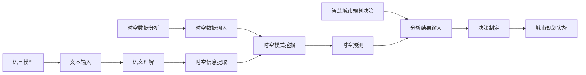

# 语言模型在时空数据分析与智慧城市规划决策中的创新研究

> 关键词：语言模型、时空数据分析、智慧城市规划决策、创新应用、数据融合

> 摘要：本文聚焦于语言模型在时空数据分析与智慧城市规划决策中的创新研究。深入探讨了语言模型的核心概念及其与时空数据分析的联系，详细阐述了相关核心算法原理和操作步骤，借助数学模型和公式揭示其内在机制。通过项目实战展示了语言模型在实际场景中的应用，分析了其在智慧城市规划决策中的具体应用场景。同时，推荐了相关的学习资源、开发工具框架和论文著作。最后对语言模型在该领域的未来发展趋势与挑战进行了总结，并解答了常见问题，提供了扩展阅读和参考资料，旨在为推动语言模型在智慧城市建设中的应用提供全面而深入的技术指导。

## 1. 背景介绍 
### 1.1 目的和范围
本研究的主要目的是探索语言模型在时空数据分析与智慧城市规划决策中的创新应用。随着城市化进程的加速，智慧城市建设成为提升城市管理效率、改善居民生活质量的重要途径。时空数据分析作为智慧城市建设的关键环节，能够挖掘城市运行过程中的时空规律和模式。而语言模型具有强大的语义理解和知识融合能力，将其引入时空数据分析和智慧城市规划决策中，有望为城市的科学规划和精准决策提供新的思路和方法。

本研究的范围涵盖了语言模型的基本原理、时空数据分析的方法和技术、智慧城市规划决策的需求和流程，以及语言模型在这些领域的具体应用案例和实践经验。

### 1.2 预期读者
本文的预期读者包括从事智慧城市研究和实践的科研人员、城市规划师、数据分析师、人工智能开发者，以及对语言模型和智慧城市建设感兴趣的技术爱好者。

### 1.3 文档结构概述
本文将按照以下结构展开：首先介绍语言模型和时空数据分析的核心概念及其联系；接着详细阐述核心算法原理和具体操作步骤，并用Python代码进行说明；然后介绍相关的数学模型和公式，并通过举例进行详细讲解；通过项目实战展示语言模型在时空数据分析和智慧城市规划决策中的实际应用；分析语言模型在智慧城市中的具体应用场景；推荐相关的学习资源、开发工具框架和论文著作；总结语言模型在该领域的未来发展趋势与挑战；解答常见问题；最后提供扩展阅读和参考资料。

### 1.4 术语表
#### 1.4.1 核心术语定义
- **语言模型**：是一种基于概率统计或深度学习的模型，用于预测给定文本序列中下一个词出现的概率，从而实现自然语言的理解和生成。
- **时空数据分析**：是指对具有时间和空间属性的数据进行收集、处理、分析和可视化的过程，旨在发现数据中的时空规律和模式。
- **智慧城市规划决策**：是指利用信息技术和数据分析手段，对城市的资源、设施、人口等进行全面评估和规划，以实现城市的可持续发展和高效运行。

#### 1.4.2 相关概念解释
- **自然语言处理（NLP）**：是人工智能的一个重要分支，主要研究如何让计算机理解和处理人类语言，包括文本分类、情感分析、机器翻译等任务。
- **地理信息系统（GIS）**：是一种用于存储、管理、分析和展示地理空间数据的技术系统，广泛应用于城市规划、资源管理、环境监测等领域。

#### 1.4.3 缩略词列表
- **NLP**：Natural Language Processing（自然语言处理）
- **GIS**：Geographic Information System（地理信息系统）
- **LLM**：Large Language Model（大语言模型）

## 2. 核心概念与联系 
### 2.1 语言模型的核心概念
语言模型是自然语言处理中的重要组成部分，其目标是学习语言的统计规律，从而能够对文本进行预测和生成。传统的语言模型基于统计方法，如n-gram模型，通过计算词序列的出现频率来估计下一个词的概率。然而，这种方法存在数据稀疏和长距离依赖的问题。

随着深度学习的发展，基于神经网络的语言模型逐渐成为主流，如循环神经网络（RNN）、长短期记忆网络（LSTM）和门控循环单元（GRU）等。这些模型能够处理变长的输入序列，并通过记忆单元来捕捉长距离依赖关系。近年来，Transformer架构的出现进一步推动了语言模型的发展，如BERT、GPT等大语言模型在各种自然语言处理任务中取得了显著的成果。

### 2.2 时空数据分析的核心概念
时空数据分析是对具有时间和空间属性的数据进行分析的过程。时空数据通常包括地理空间位置信息和时间戳，如交通流量数据、气象数据、人口迁移数据等。时空数据分析的主要任务包括时空数据的预处理、时空模式挖掘、时空预测等。

时空数据分析的方法和技术包括空间统计学、地理信息系统（GIS）、机器学习等。空间统计学用于分析空间数据的分布规律和相关性，GIS用于存储、管理和可视化地理空间数据，机器学习则用于构建时空预测模型和挖掘时空模式。

### 2.3 语言模型与时空数据分析的联系
语言模型和时空数据分析看似是两个不同的领域，但实际上它们之间存在着密切的联系。一方面，语言描述中常常包含时空信息，如“昨天在公园”“明天去机场”等。语言模型可以通过学习这些文本中的时空信息，实现对时空概念的理解和推理。另一方面，时空数据分析的结果可以用自然语言进行描述和解释，语言模型可以帮助将这些结果转化为易于理解的文本，为决策者提供直观的信息。

此外，语言模型还可以用于处理时空数据中的非结构化文本信息，如社交媒体上的地理标签和时间戳信息。通过对这些文本信息的分析，语言模型可以挖掘出用户的时空行为模式和偏好，为智慧城市规划决策提供有价值的参考。

### 2.4 核心概念原理和架构的文本示意图
```plaintext
语言模型 <---- 文本输入 ----> 语义理解 ----> 时空信息提取
                   |
                   |
                   v
时空数据分析 <---- 时空数据输入 ----> 时空模式挖掘 ----> 时空预测
                   |
                   |
                   v
智慧城市规划决策 <---- 分析结果输入 ----> 决策制定 ----> 城市规划实施
```

### 2.5 Mermaid 流程图


## 3. 核心算法原理 & 具体操作步骤 
### 3.1 语言模型的核心算法原理
以Transformer架构的语言模型为例，其核心算法原理基于自注意力机制（Self-Attention）。自注意力机制允许模型在处理每个位置的输入时，能够关注到序列中其他位置的信息，从而捕捉长距离依赖关系。

自注意力机制的计算过程如下：
1. 对于输入序列中的每个词向量，分别计算其查询向量（Query）、键向量（Key）和值向量（Value）。
2. 计算每个查询向量与所有键向量的点积，并通过softmax函数得到注意力分数。
3. 将注意力分数与对应的值向量相乘，并求和得到输出向量。

以下是自注意力机制的Python代码实现：
```python
import torch
import torch.nn as nn

class SelfAttention(nn.Module):
    def __init__(self, input_dim, output_dim):
        super(SelfAttention, self).__init__()
        self.query = nn.Linear(input_dim, output_dim)
        self.key = nn.Linear(input_dim, output_dim)
        self.value = nn.Linear(input_dim, output_dim)
        self.softmax = nn.Softmax(dim=-1)

    def forward(self, x):
        q = self.query(x)
        k = self.key(x)
        v = self.value(x)
        attn_scores = torch.matmul(q, k.transpose(-2, -1))
        attn_probs = self.softmax(attn_scores)
        output = torch.matmul(attn_probs, v)
        return output
```

### 3.2 时空数据分析的核心算法原理
时空数据分析中常用的算法包括时空聚类算法、时空回归算法等。以DBSCAN（Density-Based Spatial Clustering of Applications with Noise）时空聚类算法为例，其核心思想是基于数据点的密度来进行聚类。

DBSCAN算法的具体步骤如下：
1. 定义邻域半径$\epsilon$和最小点数$MinPts$。
2. 遍历数据集中的每个点，计算其邻域内的点数。
3. 如果某个点的邻域内点数大于等于$MinPts$，则将其标记为核心点。
4. 从一个核心点开始，将其邻域内的所有点加入到同一个聚类中，并递归地处理这些点的邻域。
5. 重复步骤4，直到所有核心点都被处理完毕。
6. 将未被标记为任何聚类的点标记为噪声点。

以下是DBSCAN算法的Python代码实现：
```python
from sklearn.cluster import DBSCAN
import numpy as np

# 生成示例数据
X = np.array([[1, 2], [2, 2], [2, 3], [8, 7], [8, 8], [25, 80]])

# 创建DBSCAN对象
db = DBSCAN(eps=3, min_samples=2).fit(X)
labels = db.labels_

print("聚类标签:", labels)
```

### 3.3 语言模型与时空数据分析的融合算法原理
将语言模型与时空数据分析融合的一种常见方法是通过多模态学习。具体来说，可以将语言信息和时空数据分别输入到不同的模型中进行处理，然后将处理后的特征进行融合，最后通过一个融合模型进行决策。

以下是一个简单的多模态融合模型的Python代码实现：
```python
import torch
import torch.nn as nn

class MultimodalModel(nn.Module):
    def __init__(self, text_input_dim, spatio_temporal_input_dim, output_dim):
        super(MultimodalModel, self).__init__()
        self.text_model = nn.Linear(text_input_dim, 128)
        self.spatio_temporal_model = nn.Linear(spatio_temporal_input_dim, 128)
        self.fusion_layer = nn.Linear(256, output_dim)
        self.relu = nn.ReLU()

    def forward(self, text_input, spatio_temporal_input):
        text_output = self.relu(self.text_model(text_input))
        spatio_temporal_output = self.relu(self.spatio_temporal_model(spatio_temporal_input))
        fusion_input = torch.cat((text_output, spatio_temporal_output), dim=1)
        output = self.fusion_layer(fusion_input)
        return output
```

### 3.4 具体操作步骤
#### 3.4.1 数据收集与预处理
- 收集语言数据和时空数据，语言数据可以来自社交媒体、新闻报道等，时空数据可以来自传感器、地理信息系统等。
- 对语言数据进行清洗、分词、词性标注等预处理操作，对时空数据进行缺失值处理、归一化等预处理操作。

#### 3.4.2 模型训练
- 分别训练语言模型和时空数据分析模型，可以使用预训练的语言模型进行微调。
- 训练多模态融合模型，将语言模型和时空数据分析模型的输出进行融合。

#### 3.4.3 模型评估与优化
- 使用测试数据集对模型进行评估，评估指标可以包括准确率、召回率、F1值等。
- 根据评估结果对模型进行优化，调整模型的参数和结构。

#### 3.4.4 应用与决策
- 将训练好的模型应用于实际的时空数据分析和智慧城市规划决策中。
- 根据模型的输出结果进行决策制定和城市规划实施。

## 4. 数学模型和公式 & 详细讲解 & 举例说明 
### 4.1 语言模型的数学模型和公式
#### 4.1.1 n-gram模型
n-gram模型是一种基于统计的语言模型，其基本思想是假设一个词的出现只依赖于其前面的$n-1$个词。n-gram模型的概率计算公式为：
$$P(w_1^m)=\prod_{i=1}^{m}P(w_i|w_{i-n+1}^{i-1})$$
其中，$w_1^m$表示一个长度为$m$的词序列，$P(w_i|w_{i-n+1}^{i-1})$表示在给定前面$n-1$个词的条件下，第$i$个词出现的概率。

例如，对于一个2-gram模型，计算句子“我爱中国”的概率为：
$$P(我爱中国)=P(我)P(爱|我)P(中|爱)P(国|中)$$

#### 4.1.2 Transformer模型
Transformer模型的核心是自注意力机制，其数学公式如下：
$$Attention(Q, K, V)=softmax(\frac{QK^T}{\sqrt{d_k}})V$$
其中，$Q$、$K$、$V$分别表示查询向量、键向量和值向量，$d_k$表示键向量的维度。

### 4.2 时空数据分析的数学模型和公式
#### 4.2.1 时空距离度量
在时空数据分析中，常用的距离度量方法包括欧几里得距离、曼哈顿距离等。对于两个时空点$(x_1, y_1, t_1)$和$(x_2, y_2, t_2)$，其欧几里得距离计算公式为：
$$d=\sqrt{(x_2 - x_1)^2 + (y_2 - y_1)^2 + (t_2 - t_1)^2}$$

#### 4.2.2 时空回归模型
时空回归模型用于分析时空数据之间的关系，常用的模型包括时空自回归模型（STAR）、时空地理加权回归模型（GTWR）等。以STAR模型为例，其数学公式为：
$$y_{it}=\rho\sum_{j=1}^{n}w_{ij}y_{jt}+\beta_0+\beta_1x_{it}+u_{it}$$
其中，$y_{it}$表示第$i$个空间单元在第$t$时刻的因变量值，$\rho$表示空间自回归系数，$w_{ij}$表示空间权重矩阵，$x_{it}$表示第$i$个空间单元在第$t$时刻的自变量值，$u_{it}$表示误差项。

### 4.3 语言模型与时空数据分析融合的数学模型和公式
在多模态融合模型中，常用的融合方法包括拼接融合、加权融合等。以拼接融合为例，假设语言特征向量为$\mathbf{x}_l$，时空特征向量为$\mathbf{x}_{st}$，则融合后的特征向量为：
$$\mathbf{x}_{fusion}=[\mathbf{x}_l; \mathbf{x}_{st}]$$
其中，$[\cdot; \cdot]$表示向量拼接操作。

### 4.4 举例说明
#### 4.4.1 语言模型的应用举例
假设我们有一个文本分类任务，需要将新闻文章分类为不同的主题。我们可以使用预训练的BERT模型进行微调，具体步骤如下：
1. 对新闻文章进行分词和编码，将其转换为BERT模型可以接受的输入格式。
2. 将编码后的输入数据输入到BERT模型中，得到输出特征。
3. 在BERT模型的输出特征上添加一个全连接层，用于进行分类。
4. 使用训练数据集对模型进行训练，调整模型的参数。
5. 使用测试数据集对模型进行评估，计算分类准确率。

#### 4.4.2 时空数据分析的应用举例
假设我们有一个城市交通流量数据，需要对交通流量进行预测。我们可以使用时空回归模型进行预测，具体步骤如下：
1. 对交通流量数据进行预处理，包括缺失值处理、归一化等。
2. 提取时空特征，如时间特征、空间特征等。
3. 构建时空回归模型，如STAR模型。
4. 使用训练数据集对模型进行训练，调整模型的参数。
5. 使用测试数据集对模型进行评估，计算预测误差。

#### 4.4.3 语言模型与时空数据分析融合的应用举例
假设我们要分析社交媒体上的用户行为模式，同时考虑用户的文本信息和时空信息。我们可以使用多模态融合模型进行分析，具体步骤如下：
1. 收集社交媒体上的用户文本数据和时空数据。
2. 对文本数据进行预处理，如分词、词性标注等，对时空数据进行预处理，如缺失值处理、归一化等。
3. 分别使用语言模型和时空数据分析模型对文本数据和时空数据进行处理，得到语言特征和时空特征。
4. 将语言特征和时空特征进行拼接融合，得到融合特征。
5. 使用融合特征进行用户行为模式分析，如聚类分析、分类分析等。

## 5. 项目实战：代码实际案例和详细解释说明 
### 5.1  开发环境搭建
#### 5.1.1 安装Python
首先需要安装Python环境，建议使用Python 3.7及以上版本。可以从Python官方网站（https://www.python.org/downloads/）下载并安装Python。

#### 5.1.2 安装必要的库
使用pip命令安装以下必要的库：
```bash
pip install torch numpy pandas scikit-learn transformers
```
其中，`torch`是PyTorch深度学习框架，`numpy`和`pandas`用于数据处理，`scikit-learn`用于机器学习算法，`transformers`用于使用预训练的语言模型。

### 5.2  源代码详细实现和代码解读
#### 5.2.1 语言模型的实现
以下是一个使用Hugging Face的`transformers`库进行文本分类的示例代码：
```python
from transformers import AutoTokenizer, AutoModelForSequenceClassification
import torch

# 加载预训练的语言模型和分词器
tokenizer = AutoTokenizer.from_pretrained('bert-base-uncased')
model = AutoModelForSequenceClassification.from_pretrained('bert-base-uncased', num_labels=2)

# 准备输入数据
text = "This is a positive sentence."
inputs = tokenizer(text, return_tensors='pt')

# 进行预测
with torch.no_grad():
    outputs = model(**inputs)
    logits = outputs.logits
    predictions = torch.argmax(logits, dim=1)

print("预测结果:", predictions.item())
```
代码解读：
- `AutoTokenizer.from_pretrained('bert-base-uncased')`：加载预训练的BERT分词器。
- `AutoModelForSequenceClassification.from_pretrained('bert-base-uncased', num_labels=2)`：加载预训练的BERT文本分类模型，设置分类类别数为2。
- `tokenizer(text, return_tensors='pt')`：对输入文本进行分词和编码，转换为PyTorch张量。
- `model(**inputs)`：将输入数据输入到模型中进行预测，得到输出结果。
- `torch.argmax(logits, dim=1)`：从输出的logits中选择概率最大的类别作为预测结果。

#### 5.2.2 时空数据分析的实现
以下是一个使用`scikit-learn`库进行DBSCAN时空聚类的示例代码：
```python
import numpy as np
from sklearn.cluster import DBSCAN

# 生成示例时空数据
X = np.array([[1, 2, 1], [2, 2, 2], [2, 3, 3], [8, 7, 4], [8, 8, 5], [25, 80, 6]])

# 创建DBSCAN对象
db = DBSCAN(eps=3, min_samples=2).fit(X)
labels = db.labels_

print("聚类标签:", labels)
```
代码解读：
- `np.array([[1, 2, 1], [2, 2, 2], [2, 3, 3], [8, 7, 4], [8, 8, 5], [25, 80, 6]])`：生成示例时空数据，每个数据点包含三个维度：空间坐标和时间信息。
- `DBSCAN(eps=3, min_samples=2).fit(X)`：创建DBSCAN对象，设置邻域半径为3，最小点数为2，并对数据进行聚类。
- `db.labels_`：获取聚类结果的标签。

#### 5.2.3 语言模型与时空数据分析融合的实现
以下是一个简单的多模态融合模型的实现代码：
```python
import torch
import torch.nn as nn

class MultimodalModel(nn.Module):
    def __init__(self, text_input_dim, spatio_temporal_input_dim, output_dim):
        super(MultimodalModel, self).__init__()
        self.text_model = nn.Linear(text_input_dim, 128)
        self.spatio_temporal_model = nn.Linear(spatio_temporal_input_dim, 128)
        self.fusion_layer = nn.Linear(256, output_dim)
        self.relu = nn.ReLU()

    def forward(self, text_input, spatio_temporal_input):
        text_output = self.relu(self.text_model(text_input))
        spatio_temporal_output = self.relu(self.spatio_temporal_model(spatio_temporal_input))
        fusion_input = torch.cat((text_output, spatio_temporal_output), dim=1)
        output = self.fusion_layer(fusion_input)
        return output

# 示例数据
text_input = torch.randn(10, 100)
spatio_temporal_input = torch.randn(10, 50)

# 创建模型
model = MultimodalModel(100, 50, 2)

# 进行前向传播
output = model(text_input, spatio_temporal_input)

print("模型输出:", output)
```
代码解读：
- `MultimodalModel`类：定义了一个多模态融合模型，包括文本模型、时空模型和融合层。
- `self.text_model = nn.Linear(text_input_dim, 128)`：定义文本模型，将输入的文本特征映射到128维的特征空间。
- `self.spatio_temporal_model = nn.Linear(spatio_temporal_input_dim, 128)`：定义时空模型，将输入的时空特征映射到128维的特征空间。
- `self.fusion_layer = nn.Linear(256, output_dim)`：定义融合层，将文本特征和时空特征拼接后映射到输出维度。
- `torch.cat((text_output, spatio_temporal_output), dim=1)`：将文本特征和时空特征在维度1上进行拼接。

### 5.3  代码解读与分析
#### 5.3.1 语言模型代码分析
在语言模型的代码中，使用了Hugging Face的`transformers`库，该库提供了丰富的预训练语言模型和分词器。通过使用预训练的模型，可以大大减少模型的训练时间和计算资源。在文本分类任务中，将输入文本进行分词和编码后输入到模型中，模型输出的logits经过softmax函数可以得到每个类别的概率，选择概率最大的类别作为预测结果。

#### 5.3.2 时空数据分析代码分析
在时空数据分析的代码中，使用了`scikit-learn`库的DBSCAN算法进行时空聚类。DBSCAN算法基于数据点的密度进行聚类，能够发现任意形状的聚类。通过设置邻域半径和最小点数，可以控制聚类的结果。

#### 5.3.3 语言模型与时空数据分析融合代码分析
在语言模型与时空数据分析融合的代码中，定义了一个简单的多模态融合模型。该模型将文本特征和时空特征分别通过线性层映射到相同的特征空间，然后将两个特征进行拼接，最后通过一个融合层进行输出。这种融合方式可以充分利用文本信息和时空信息，提高模型的性能。

## 6. 实际应用场景 
### 6.1 城市交通规划
语言模型可以分析社交媒体上的交通评论和投诉，提取用户对交通状况的评价和需求。时空数据分析可以对交通流量、拥堵情况等进行实时监测和预测。将两者结合，可以为城市交通规划提供更全面的信息。例如，根据用户的反馈和交通预测结果，合理规划公交线路、设置交通信号灯的时间等。

### 6.2 城市环境监测
语言模型可以处理环境相关的新闻报道和社交媒体信息，了解公众对环境问题的关注焦点。时空数据分析可以对空气质量、水质、噪声等环境指标进行监测和分析。通过融合两者的数据，可以及时发现环境问题的热点区域，并制定相应的治理措施。

### 6.3 城市公共安全管理
语言模型可以分析报警信息、社交媒体上的突发事件报道等，提取事件的关键信息和位置。时空数据分析可以对犯罪率、事故发生率等进行时空分析，预测潜在的安全风险。将两者结合，可以实现对城市公共安全的实时监测和预警，提高应急响应能力。

### 6.4 城市资源分配
语言模型可以了解居民对公共资源的需求和满意度，如公园、图书馆、医院等。时空数据分析可以分析资源的分布和使用情况。通过融合两者的信息，可以合理分配城市资源，提高资源的利用效率。

## 7. 工具和资源推荐
### 7.1 学习资源推荐
#### 7.1.1 书籍推荐
- 《自然语言处理入门》：作者何晗，本书全面介绍了自然语言处理的基础知识和常用算法，适合初学者入门。
- 《地理信息系统教程》：作者汤国安等，本书系统地介绍了地理信息系统的基本原理、方法和应用，是学习地理信息系统的经典教材。
- 《深度学习》：作者Ian Goodfellow等，本书是深度学习领域的权威著作，介绍了深度学习的基本概念、算法和应用。

#### 7.1.2 在线课程
- Coursera上的“Natural Language Processing Specialization”：由斯坦福大学的教授授课，全面介绍了自然语言处理的各个方面。
- edX上的“Geographic Information Systems (GIS)”：由哈佛大学的教授授课，讲解了地理信息系统的基本原理和应用。
- 吴恩达的“Deep Learning Specialization”：在Coursera上提供，是深度学习领域的经典课程。

#### 7.1.3 技术博客和网站
- Hugging Face的官方博客（https://huggingface.co/blog）：提供了关于自然语言处理和大语言模型的最新研究成果和应用案例。
- GIS Lounge（https://www.gislounge.com/）：是一个地理信息系统领域的技术博客，提供了丰富的GIS教程和案例分析。
- Towards Data Science（https://towardsdatascience.com/）：是一个数据科学和机器学习领域的技术博客，有很多关于时空数据分析和人工智能的文章。

### 7.2 开发工具框架推荐
#### 7.2.1 IDE和编辑器
- PyCharm：是一款专业的Python集成开发环境，提供了丰富的代码编辑、调试和项目管理功能。
- Jupyter Notebook：是一个交互式的开发环境，适合进行数据分析和模型实验。
- Visual Studio Code：是一款轻量级的代码编辑器，支持多种编程语言和插件扩展。

#### 7.2.2 调试和性能分析工具
- PyTorch Profiler：是PyTorch框架自带的性能分析工具，可以帮助用户分析模型的训练时间、内存使用等情况。
- TensorBoard：是TensorFlow框架的可视化工具，也可以用于PyTorch模型的可视化和性能分析。
- cProfile：是Python标准库中的性能分析工具，可以分析Python代码的运行时间和函数调用情况。

#### 7.2.3 相关框架和库
- Hugging Face Transformers：是一个流行的自然语言处理框架，提供了丰富的预训练语言模型和工具。
- GeoPandas：是一个基于Pandas的地理信息处理库，提供了方便的地理数据处理和分析功能。
- Scikit-learn：是一个常用的机器学习库，提供了各种机器学习算法和工具。

### 7.3 相关论文著作推荐
#### 7.3.1 经典论文
- “Attention Is All You Need”：介绍了Transformer架构，是自然语言处理领域的经典论文。
- “Density-Based Spatial Clustering of Applications with Noise”：提出了DBSCAN聚类算法，是时空数据分析领域的经典论文。
- “BERT: Pre-training of Deep Bidirectional Transformers for Language Understanding”：介绍了BERT模型，是自然语言处理领域的重要突破。

#### 7.3.2 最新研究成果
- 关注ACL（Association for Computational Linguistics）、SIGSPATIAL（ACM SIGSPATIAL Special Interest Group on Spatial Information Theory）等学术会议的最新研究成果，了解语言模型和时空数据分析领域的前沿动态。
- 阅读顶级学术期刊，如Journal of Artificial Intelligence Research（JAIR）、Transactions in GIS等。

#### 7.3.3 应用案例分析
- 参考一些实际的智慧城市建设项目案例，了解语言模型和时空数据分析在城市规划、交通管理、环境监测等领域的具体应用。

## 8. 总结：未来发展趋势与挑战
### 8.1 未来发展趋势
#### 8.1.1 多模态融合的深化
未来，语言模型与时空数据分析的融合将更加深入，不仅局限于简单的特征拼接，还将探索更复杂的融合方式，如基于注意力机制的融合、跨模态的知识图谱构建等。通过多模态融合，可以更全面地理解城市的运行状态，为智慧城市规划决策提供更准确的支持。

#### 8.1.2 实时处理与决策
随着物联网技术的发展，城市中产生的时空数据将越来越多，且具有实时性。语言模型和时空数据分析需要具备实时处理能力，能够及时对实时数据进行分析和处理，并为城市管理者提供实时的决策建议。

#### 8.1.3 可解释性和可信度提升
在智慧城市规划决策中，模型的可解释性和可信度至关重要。未来的研究将注重提高语言模型和时空数据分析模型的可解释性，让决策者能够理解模型的决策依据。同时，加强模型的可信度评估，确保模型的输出结果可靠。

#### 8.1.4 与其他技术的融合
语言模型和时空数据分析将与其他技术，如区块链、边缘计算等进行融合。区块链技术可以保证数据的安全性和不可篡改，边缘计算可以减少数据传输延迟，提高模型的处理效率。

### 8.2 挑战
#### 8.2.1 数据质量和隐私问题
城市中的时空数据和语言数据来源广泛，数据质量参差不齐。同时，数据中可能包含大量的个人隐私信息，如何保证数据的质量和隐私安全是一个重要的挑战。

#### 8.2.2 模型复杂度和计算资源
语言模型和时空数据分析模型通常比较复杂，需要大量的计算资源进行训练和推理。如何在有限的计算资源下提高模型的性能是一个亟待解决的问题。

#### 8.2.3 跨领域知识融合
语言模型和时空数据分析涉及到自然语言处理、地理信息科学、机器学习等多个领域的知识，如何实现跨领域知识的有效融合，培养跨领域的专业人才是一个挑战。

#### 8.2.4 标准和规范的缺失
目前，在语言模型与时空数据分析融合应用于智慧城市规划决策方面，缺乏统一的标准和规范。这导致不同的研究和应用之间难以进行比较和交流，也影响了技术的推广和应用。

## 9. 附录：常见问题与解答
### 9.1 语言模型在处理时空信息时存在哪些局限性？
语言模型在处理时空信息时，可能存在以下局限性：
- 对时空概念的理解不够准确：语言模型虽然可以学习到一些时空词汇和表达方式，但对于复杂的时空概念和关系，可能理解不够准确。
- 缺乏时空感知能力：语言模型主要基于文本进行学习，缺乏对真实世界的时空感知能力，难以处理一些需要实地观察和感知的时空信息。
- 长文本处理能力有限：当文本中包含大量的时空信息时，语言模型可能会出现信息丢失和理解偏差的问题。

### 9.2 如何评估语言模型与时空数据分析融合模型的性能？
可以从以下几个方面评估语言模型与时空数据分析融合模型的性能：
- 准确率：评估模型在分类、预测等任务中的准确率。
- 召回率：评估模型在识别正例时的召回率。
- F1值：综合考虑准确率和召回率，计算F1值。
- 时空相关性：评估模型输出结果与实际时空数据的相关性。
- 可解释性：评估模型的决策依据是否可解释。

### 9.3 语言模型和时空数据分析模型的训练数据如何获取？
语言模型的训练数据可以从以下几个方面获取：
- 公开数据集：如Wikipedia、BookCorpus等。
- 社交媒体数据：如Twitter、微博等。
- 新闻报道：可以从各大新闻网站获取。

时空数据分析模型的训练数据可以从以下几个方面获取：
- 传感器数据：如交通传感器、气象传感器等。
- 地理信息系统（GIS）数据：如地图数据、土地利用数据等。
- 政府部门和企业提供的数据：如城市规划数据、商业数据等。

### 9.4 如何解决语言模型和时空数据分析模型的计算资源问题？
可以采取以下措施解决计算资源问题：
- 模型压缩：采用模型剪枝、量化等技术，减少模型的参数数量和计算量。
- 分布式训练：使用多个计算设备进行分布式训练，提高训练效率。
- 云服务：使用云平台提供的计算资源，如AWS、Google Cloud等。
- 边缘计算：将部分计算任务放在边缘设备上进行处理，减少数据传输延迟和计算资源需求。

## 10. 扩展阅读 & 参考资料
### 10.1 扩展阅读
- 《智慧城市：大数据、物联网与云计算之应用》：介绍了智慧城市建设的相关技术和应用案例。
- 《人工智能：现代方法》：全面介绍了人工智能的基本概念、算法和应用。
- 《数据挖掘：概念与技术》：讲解了数据挖掘的基本原理和常用算法。

### 10.2 参考资料
- Hugging Face官方文档（https://huggingface.co/docs）
- Scikit-learn官方文档（https://scikit-learn.org/stable/documentation.html）
- GeoPandas官方文档（https://geopandas.org/en/stable/docs.html）

作者：AI天才研究院/AI Genius Institute & 禅与计算机程序设计艺术 /Zen And The Art of Computer Programming