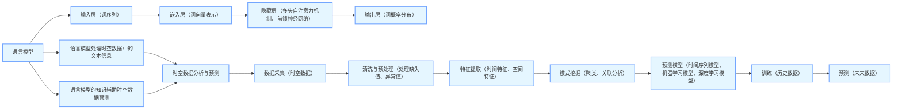

# 语言模型在时空数据分析与预测中的表现评估

> 关键词：语言模型、时空数据分析、时空数据预测、表现评估、评估指标

> 摘要：本文聚焦于语言模型在时空数据分析与预测领域的表现评估。首先介绍了研究的背景、目的、预期读者、文档结构和相关术语。接着阐述了语言模型、时空数据分析与预测的核心概念及其联系，给出了原理和架构的文本示意图与 Mermaid 流程图。详细讲解了相关核心算法原理，并用 Python 代码进行了具体实现。同时介绍了涉及的数学模型和公式，并举例说明。通过项目实战展示了开发环境搭建、源代码实现及代码解读。探讨了语言模型在时空数据分析与预测中的实际应用场景，推荐了学习资源、开发工具框架和相关论文著作。最后总结了未来发展趋势与挑战，还给出了常见问题解答和扩展阅读参考资料，旨在为深入研究语言模型在时空数据分析与预测中的应用提供全面的参考。

## 1. 背景介绍 
### 1.1 目的和范围
时空数据分析与预测在众多领域，如交通规划、气象预报、生态环境监测等，都具有至关重要的意义。随着语言模型的不断发展，其强大的语义理解和知识表示能力使其在时空数据分析与预测中展现出巨大的潜力。本研究的目的在于全面评估语言模型在时空数据分析与预测中的表现，明确其优势与不足，为进一步优化和应用提供依据。

研究范围涵盖了常见的语言模型，如基于 Transformer 架构的 GPT 系列、BERT 等，以及多种时空数据集，包括交通流量数据、气象数据等。评估内容包括语言模型在时空数据特征提取、模式识别、预测准确性等方面的表现。

### 1.2 预期读者
本文预期读者包括从事时空数据分析、机器学习、人工智能等领域的研究人员和工程师，他们希望了解语言模型在时空数据分析与预测中的应用情况和性能表现，为自己的研究和项目提供参考。同时，也适合对数据分析和预测感兴趣的学生和爱好者，帮助他们拓宽知识面，了解前沿技术。

### 1.3 文档结构概述
本文将按照以下结构展开：首先介绍核心概念与联系，包括语言模型、时空数据分析与预测的基本原理和它们之间的关联；接着详细讲解核心算法原理和具体操作步骤，并用 Python 代码进行实现；然后介绍涉及的数学模型和公式，并举例说明；通过项目实战展示语言模型在时空数据分析与预测中的具体应用；探讨实际应用场景；推荐相关的学习资源、开发工具框架和论文著作；最后总结未来发展趋势与挑战，给出常见问题解答和扩展阅读参考资料。

### 1.4 术语表
#### 1.4.1 核心术语定义
- **语言模型**：是一种基于统计学或机器学习方法，对自然语言文本进行建模的模型，用于预测下一个可能出现的单词或字符。常见的语言模型有基于规则的模型、统计语言模型和神经网络语言模型。
- **时空数据**：是指与时间和空间相关的数据，包含了地理位置信息和时间戳。例如，交通流量数据记录了不同时间点上各个路段的车流量；气象数据记录了不同地点在不同时间的气温、湿度等信息。
- **时空数据分析**：是对时空数据进行处理、挖掘和分析的过程，旨在发现数据中的时空模式、规律和趋势。常见的分析方法包括时空聚类、时空关联分析等。
- **时空数据预测**：是根据历史时空数据，对未来某个时间点或时间段内的时空数据进行预测的任务。例如，预测未来一天内某个地区的交通流量、预测未来一周内某个城市的气温变化等。

#### 1.4.2 相关概念解释
- **Transformer 架构**：是一种基于自注意力机制的神经网络架构，广泛应用于自然语言处理任务中。它通过多头自注意力机制，能够有效地捕捉输入序列中的长距离依赖关系，提高模型的性能。
- **自注意力机制**：是 Transformer 架构中的核心组件，用于计算输入序列中各个位置之间的相关性。通过自注意力机制，模型可以自动关注输入序列中的重要部分，从而更好地理解输入序列的语义信息。

#### 1.4.3 缩略词列表
- **GPT**：Generative Pretrained Transformer，生成式预训练 Transformer。
- **BERT**：Bidirectional Encoder Representations from Transformers，基于 Transformer 的双向编码器表示。

## 2. 核心概念与联系 

### 2.1 语言模型原理
语言模型的主要目标是学习语言的概率分布，即给定一个词序列，预测下一个词出现的概率。以基于神经网络的语言模型为例，常见的结构是输入一个词序列，经过嵌入层将词转换为向量表示，然后通过一系列的隐藏层进行特征提取和变换，最后通过输出层输出每个词的概率分布。

以 Transformer 架构的语言模型为例，其核心是多头自注意力机制。多头自注意力机制允许模型在不同的表示子空间中并行地关注输入序列的不同部分，从而捕捉到更丰富的语义信息。具体来说，输入序列首先通过线性变换得到查询（Query）、键（Key）和值（Value）三个向量，然后通过计算查询和键之间的相似度，得到注意力权重，最后根据注意力权重对值进行加权求和，得到输出。

### 2.2 时空数据分析与预测原理
时空数据分析主要是对时空数据进行清洗、预处理、特征提取和模式挖掘。在清洗和预处理阶段，需要处理数据中的缺失值、异常值等问题；特征提取阶段则从原始数据中提取出有意义的特征，如时间特征（小时、天、月等）、空间特征（经纬度、区域编码等）；模式挖掘阶段则通过聚类、关联分析等方法发现数据中的时空模式和规律。

时空数据预测则是在时空数据分析的基础上，利用历史数据构建预测模型，对未来的时空数据进行预测。常见的预测模型包括时间序列模型（如 ARIMA、LSTM 等）、机器学习模型（如决策树、随机森林等）和深度学习模型（如卷积神经网络、循环神经网络等）。

### 2.3 语言模型与时空数据分析与预测的联系
语言模型可以为时空数据分析与预测提供强大的语义理解和知识表示能力。一方面，语言模型可以用于对时空数据中的文本信息进行处理，如对气象数据中的天气描述、交通数据中的路况信息等进行语义分析，提取出有用的特征。另一方面，语言模型可以通过预训练学习到丰富的语言知识和世界知识，这些知识可以帮助模型更好地理解时空数据的内在规律，提高预测的准确性。

### 2.4 核心概念原理和架构的文本示意图
```plaintext
语言模型
|-- 输入层（词序列）
|   |-- 嵌入层（词向量表示）
|-- 隐藏层（多头自注意力机制、前馈神经网络）
|-- 输出层（词概率分布）

时空数据分析与预测
|-- 数据采集（时空数据）
|   |-- 清洗与预处理（处理缺失值、异常值）
|   |-- 特征提取（时间特征、空间特征）
|   |-- 模式挖掘（聚类、关联分析）
|-- 预测模型（时间序列模型、机器学习模型、深度学习模型）
|   |-- 训练（历史数据）
|   |-- 预测（未来数据）

语言模型与时空数据分析与预测的联系
|-- 语言模型处理时空数据中的文本信息
|-- 语言模型的知识辅助时空数据预测
```

### 2.5 Mermaid 流程图


## 3. 核心算法原理 & 具体操作步骤 

### 3.1 多头自注意力机制原理
多头自注意力机制是 Transformer 架构的核心，它允许模型在不同的表示子空间中并行地关注输入序列的不同部分。具体来说，对于输入序列 $\mathbf{X} = [\mathbf{x}_1, \mathbf{x}_2, \cdots, \mathbf{x}_n]$，首先通过线性变换得到查询（Query）、键（Key）和值（Value）三个矩阵：

$$
\mathbf{Q} = \mathbf{X} \mathbf{W}^Q \\
\mathbf{K} = \mathbf{X} \mathbf{W}^K \\
\mathbf{V} = \mathbf{X} \mathbf{W}^V
$$

其中，$\mathbf{W}^Q$、$\mathbf{W}^K$ 和 $\mathbf{W}^V$ 是可学习的权重矩阵。然后，计算注意力分数：

$$
\mathbf{Attention}(\mathbf{Q}, \mathbf{K}, \mathbf{V}) = \text{softmax}\left(\frac{\mathbf{Q} \mathbf{K}^T}{\sqrt{d_k}}\right) \mathbf{V}
$$

其中，$d_k$ 是查询和键向量的维度。最后，通过多头机制，将多个注意力头的输出拼接起来，并通过一个线性变换得到最终的输出：

$$
\text{MultiHead}(\mathbf{Q}, \mathbf{K}, \mathbf{V}) = \text{Concat}(\text{head}_1, \cdots, \text{head}_h) \mathbf{W}^O
$$

其中，$\text{head}_i = \mathbf{Attention}(\mathbf{Q}_i, \mathbf{K}_i, \mathbf{V}_i)$，$\mathbf{W}^O$ 是可学习的权重矩阵。

### 3.2 Python 代码实现
```python
import torch
import torch.nn as nn
import torch.nn.functional as F

class MultiHeadAttention(nn.Module):
    def __init__(self, embed_size, num_heads):
        super(MultiHeadAttention, self).__init__()
        self.embed_size = embed_size
        self.num_heads = num_heads
        self.head_dim = embed_size // num_heads

        assert (
            self.head_dim * num_heads == embed_size
        ), "Embedding size needs to be divisible by number of heads"

        self.values = nn.Linear(self.head_dim, self.head_dim, bias=False)
        self.keys = nn.Linear(self.head_dim, self.head_dim, bias=False)
        self.queries = nn.Linear(self.head_dim, self.head_dim, bias=False)
        self.fc_out = nn.Linear(num_heads * self.head_dim, embed_size)

    def forward(self, values, keys, query, mask):
        N = query.shape[0]
        value_len, key_len, query_len = values.shape[1], keys.shape[1], query.shape[1]

        # Split the embedding into self.num_heads different pieces
        values = values.reshape(N, value_len, self.num_heads, self.head_dim)
        keys = keys.reshape(N, key_len, self.num_heads, self.head_dim)
        queries = query.reshape(N, query_len, self.num_heads, self.head_dim)

        values = self.values(values)
        keys = self.keys(keys)
        queries = self.queries(queries)

        # Scaled dot-product attention
        energy = torch.einsum("nqhd,nkhd->nhqk", [queries, keys])
        if mask is not None:
            energy = energy.masked_fill(mask == 0, float("-1e20"))

        attention = torch.softmax(energy / (self.embed_size ** (1 / 2)), dim=3)

        out = torch.einsum("nhql,nlhd->nqhd", [attention, values]).reshape(
            N, query_len, self.num_heads * self.head_dim
        )

        out = self.fc_out(out)
        return out
```

### 3.3 具体操作步骤
1. **初始化模型**：创建 `MultiHeadAttention` 类的实例，指定嵌入维度和头的数量。
```python
embed_size = 512
num_heads = 8
multihead_attn = MultiHeadAttention(embed_size, num_heads)
```
2. **准备输入数据**：生成随机的输入数据，模拟查询、键和值矩阵。
```python
N = 32  # Batch size
query_len = 10
key_len = 10
value_len = 10
query = torch.randn(N, query_len, embed_size)
keys = torch.randn(N, key_len, embed_size)
values = torch.randn(N, value_len, embed_size)
mask = None
```
3. **前向传播**：调用 `forward` 方法进行前向传播，得到注意力输出。
```python
output = multihead_attn(values, keys, query, mask)
print(output.shape)
```

## 4. 数学模型和公式 & 详细讲解 & 举例说明 

### 4.1 语言模型的损失函数
在训练语言模型时，常用的损失函数是交叉熵损失函数。假设模型的输出是一个概率分布 $\mathbf{p} = [p_1, p_2, \cdots, p_V]$，其中 $V$ 是词汇表的大小，真实标签是一个 one-hot 向量 $\mathbf{y} = [y_1, y_2, \cdots, y_V]$，则交叉熵损失函数定义为：

$$
L = -\sum_{i=1}^{V} y_i \log(p_i)
$$

在实际应用中，通常使用批量数据进行训练，此时损失函数是批量数据的平均交叉熵损失：

$$
L = -\frac{1}{N} \sum_{n=1}^{N} \sum_{i=1}^{V} y_{n,i} \log(p_{n,i})
$$

其中，$N$ 是批量大小。

### 4.2 时空数据预测的评估指标
在时空数据预测中，常用的评估指标包括均方误差（MSE）、均方根误差（RMSE）、平均绝对误差（MAE）和平均绝对百分比误差（MAPE）。

- **均方误差（MSE）**：

$$
\text{MSE} = \frac{1}{n} \sum_{i=1}^{n} (y_i - \hat{y}_i)^2
$$

其中，$y_i$ 是真实值，$\hat{y}_i$ 是预测值，$n$ 是样本数量。

- **均方根误差（RMSE）**：

$$
\text{RMSE} = \sqrt{\frac{1}{n} \sum_{i=1}^{n} (y_i - \hat{y}_i)^2}
$$

- **平均绝对误差（MAE）**：

$$
\text{MAE} = \frac{1}{n} \sum_{i=1}^{n} |y_i - \hat{y}_i|
$$

- **平均绝对百分比误差（MAPE）**：

$$
\text{MAPE} = \frac{1}{n} \sum_{i=1}^{n} \left|\frac{y_i - \hat{y}_i}{y_i}\right| \times 100\%
$$

### 4.3 举例说明
假设我们有一个简单的时空数据预测任务，预测某个地区的气温。以下是一组真实值和预测值：

| 时间 | 真实值 ($y$) | 预测值 ($\hat{y}$) |
|------|--------------|---------------------|
| 1    | 20           | 21                  |
| 2    | 22           | 23                  |
| 3    | 25           | 24                  |
| 4    | 23           | 22                  |
| 5    | 21           | 20                  |

计算各评估指标：

- **MSE**：

$$
\begin{align*}
\text{MSE} &= \frac{1}{5} \times [(20 - 21)^2 + (22 - 23)^2 + (25 - 24)^2 + (23 - 22)^2 + (21 - 20)^2] \\
&= \frac{1}{5} \times (1 + 1 + 1 + 1 + 1) \\
&= 1
\end{align*}
$$

- **RMSE**：

$$
\text{RMSE} = \sqrt{1} = 1
$$

- **MAE**：

$$
\begin{align*}
\text{MAE} &= \frac{1}{5} \times (|20 - 21| + |22 - 23| + |25 - 24| + |23 - 22| + |21 - 20|) \\
&= \frac{1}{5} \times (1 + 1 + 1 + 1 + 1) \\
&= 1
\end{align*}
$$

- **MAPE**：

$$
\begin{align*}
\text{MAPE} &= \frac{1}{5} \times \left(\left|\frac{20 - 21}{20}\right| + \left|\frac{22 - 23}{22}\right| + \left|\frac{25 - 24}{25}\right| + \left|\frac{23 - 22}{23}\right| + \left|\frac{21 - 20}{21}\right|\right) \times 100\% \\
&\approx \frac{1}{5} \times (0.05 + 0.045 + 0.04 + 0.043 + 0.048) \times 100\% \\
&\approx 4.52\%
\end{align*}
$$

## 5. 项目实战：代码实际案例和详细解释说明 

### 5.1  开发环境搭建
#### 5.1.1 安装 Python
首先，确保你已经安装了 Python 3.7 或更高版本。可以从 Python 官方网站（https://www.python.org/downloads/）下载并安装适合你操作系统的 Python 版本。

#### 5.1.2 创建虚拟环境
为了避免不同项目之间的依赖冲突，建议使用虚拟环境。可以使用 `venv` 或 `conda` 来创建虚拟环境。

使用 `venv` 创建虚拟环境：
```bash
python -m venv myenv
source myenv/bin/activate  # Linux/Mac
myenv\Scripts\activate  # Windows
```

使用 `conda` 创建虚拟环境：
```bash
conda create -n myenv python=3.8
conda activate myenv
```

#### 5.1.3 安装依赖库
在虚拟环境中安装所需的依赖库，包括 `torch`、`numpy`、`pandas` 等。
```bash
pip install torch numpy pandas matplotlib scikit-learn
```

### 5.2  源代码详细实现和代码解读
#### 5.2.1 数据加载和预处理
```python
import pandas as pd
import numpy as np

# 加载数据
data = pd.read_csv('traffic_data.csv')

# 处理缺失值
data = data.fillna(method='ffill')

# 提取特征和标签
features = data[['hour', 'day_of_week', 'month']].values
labels = data['traffic_volume'].values

# 数据归一化
from sklearn.preprocessing import MinMaxScaler
scaler_features = MinMaxScaler()
scaler_labels = MinMaxScaler()
features = scaler_features.fit_transform(features)
labels = scaler_labels.fit_transform(labels.reshape(-1, 1)).flatten()

# 划分训练集和测试集
train_size = int(len(features) * 0.8)
train_features = features[:train_size]
train_labels = labels[:train_size]
test_features = features[train_size:]
test_labels = labels[train_size:]
```
代码解读：
- 首先使用 `pandas` 库加载交通流量数据。
- 处理数据中的缺失值，使用前向填充方法。
- 提取特征（小时、星期几、月份）和标签（交通流量）。
- 使用 `MinMaxScaler` 对特征和标签进行归一化处理，将数据缩放到 [0, 1] 区间。
- 按照 80:20 的比例划分训练集和测试集。

#### 5.2.2 构建语言模型
```python
import torch
import torch.nn as nn

class TrafficModel(nn.Module):
    def __init__(self, input_size, hidden_size, output_size):
        super(TrafficModel, self).__init__()
        self.fc1 = nn.Linear(input_size, hidden_size)
        self.relu = nn.ReLU()
        self.fc2 = nn.Linear(hidden_size, output_size)

    def forward(self, x):
        out = self.fc1(x)
        out = self.relu(out)
        out = self.fc2(out)
        return out

input_size = 3
hidden_size = 64
output_size = 1
model = TrafficModel(input_size, hidden_size, output_size)
```
代码解读：
- 定义一个简单的全连接神经网络模型 `TrafficModel`，包含一个输入层、一个隐藏层和一个输出层。
- 输入层的大小为特征的维度（3），隐藏层的大小为 64，输出层的大小为 1（预测的交通流量）。
- 前向传播过程中，输入数据经过第一个全连接层，然后通过 ReLU 激活函数，最后经过第二个全连接层得到输出。

#### 5.2.3 训练模型
```python
import torch.optim as optim

criterion = nn.MSELoss()
optimizer = optim.Adam(model.parameters(), lr=0.001)

num_epochs = 100
for epoch in range(num_epochs):
    inputs = torch.tensor(train_features, dtype=torch.float32)
    targets = torch.tensor(train_labels, dtype=torch.float32).unsqueeze(1)

    optimizer.zero_grad()
    outputs = model(inputs)
    loss = criterion(outputs, targets)
    loss.backward()
    optimizer.step()

    if (epoch + 1) % 10 == 0:
        print(f'Epoch [{epoch+1}/{num_epochs}], Loss: {loss.item():.4f}')
```
代码解读：
- 使用均方误差损失函数 `MSELoss` 和 Adam 优化器。
- 训练模型 100 个 epoch，每个 epoch 中，将训练数据转换为 PyTorch 张量，前向传播计算输出，计算损失，反向传播更新模型参数。
- 每 10 个 epoch 打印一次损失值。

#### 5.2.4 模型评估
```python
with torch.no_grad():
    test_inputs = torch.tensor(test_features, dtype=torch.float32)
    test_outputs = model(test_inputs)
    test_outputs = scaler_labels.inverse_transform(test_outputs.numpy())
    test_labels = scaler_labels.inverse_transform(test_labels.reshape(-1, 1))

from sklearn.metrics import mean_squared_error, mean_absolute_error

mse = mean_squared_error(test_labels, test_outputs)
mae = mean_absolute_error(test_labels, test_outputs)
print(f'MSE: {mse:.4f}, MAE: {mae:.4f}')
```
代码解读：
- 在测试集上进行预测，使用 `torch.no_grad()` 上下文管理器，避免计算梯度。
- 将预测结果和真实标签进行反归一化处理，得到原始尺度的数据。
- 使用 `sklearn.metrics` 中的 `mean_squared_error` 和 `mean_absolute_error` 计算均方误差和平均绝对误差。

### 5.3  代码解读与分析
- **数据预处理**：数据预处理是模型训练的重要步骤，包括处理缺失值、提取特征、归一化等操作。处理缺失值可以保证数据的完整性，归一化可以加速模型的收敛。
- **模型构建**：构建的全连接神经网络模型结构简单，适用于处理小规模的时空数据。可以根据实际情况调整模型的结构和参数，如增加隐藏层的数量、调整隐藏层的大小等。
- **模型训练**：使用均方误差损失函数和 Adam 优化器进行训练，通过多次迭代更新模型参数，使损失函数逐渐减小。可以根据损失值的变化情况调整学习率和训练轮数。
- **模型评估**：使用均方误差和平均绝对误差评估模型的性能，这两个指标可以直观地反映模型的预测准确性。可以根据评估结果对模型进行进一步的优化。

## 6. 实际应用场景 
### 6.1 交通流量预测
语言模型可以结合交通数据中的文本信息（如路况描述、交通事件信息等）和时空特征（如时间、地点），对未来的交通流量进行预测。例如，在高峰时段，结合社交媒体上的交通拥堵信息和历史交通流量数据，预测特定路段的交通流量，为交通管理部门提供决策支持，如调整信号灯时长、引导交通等。

### 6.2 气象预报
在气象预报中，语言模型可以处理气象数据中的文本信息，如气象报告、卫星云图的描述等。结合时空特征（如地理位置、时间），预测未来的气象状况，如气温、降水、风速等。例如，通过分析历史气象数据和气象专家的报告，预测某个地区未来一周的天气变化，为农业生产、航空运输等行业提供服务。

### 6.3 生态环境监测
对于生态环境监测数据，语言模型可以分析环境报告中的文本信息，如污染情况描述、生态系统变化等。结合时空特征（如监测地点、时间），预测生态环境的变化趋势，如水质污染程度、森林覆盖率变化等。例如，通过分析多年的水质监测数据和相关报告，预测某条河流未来一段时间的水质变化，为环境保护部门制定治理措施提供依据。

### 6.4 城市规划
在城市规划中，语言模型可以处理城市发展报告、人口统计数据中的文本信息。结合时空特征（如城市区域、时间），预测城市的发展趋势，如人口增长、土地利用变化等。例如，通过分析城市的历史发展数据和相关政策文件，预测某个城市未来十年的人口分布和土地利用情况，为城市规划部门制定规划方案提供参考。

## 7. 工具和资源推荐
### 7.1 学习资源推荐
#### 7.1.1 书籍推荐
- 《深度学习》（Deep Learning）：由 Ian Goodfellow、Yoshua Bengio 和 Aaron Courville 撰写，是深度学习领域的经典教材，涵盖了神经网络、卷积神经网络、循环神经网络等基础内容，也介绍了语言模型的相关知识。
- 《Python 深度学习》（Deep Learning with Python）：由 Francois Chollet 撰写，结合 Keras 框架，详细介绍了深度学习的基本概念和实践方法，包括语言模型的构建和训练。
- 《动手学深度学习》（Dive into Deep Learning）：由 Aston Zhang、Zachary C. Lipton、Mu Li 和 Alexander J. Smola 撰写，提供了丰富的代码示例和实验，帮助读者快速上手深度学习，包括时空数据分析和预测的相关内容。

#### 7.1.2 在线课程
- Coursera 上的 “深度学习专项课程”（Deep Learning Specialization）：由 Andrew Ng 教授授课，包括神经网络和深度学习、改善深层神经网络、结构化机器学习项目、卷积神经网络和序列模型等五门课程，对语言模型和时空数据分析有深入的讲解。
- edX 上的 “使用 PyTorch 进行深度学习”（Introduction to Deep Learning with PyTorch）：介绍了 PyTorch 框架的基本使用方法和深度学习的核心概念，包括语言模型的实现。
- 中国大学 MOOC 上的 “人工智能：模型与算法”：由上海交通大学的俞勇教授授课，涵盖了人工智能的多个领域，包括语言模型和时空数据分析的相关知识。

#### 7.1.3 技术博客和网站
- Medium：有许多深度学习和人工智能领域的博主分享最新的研究成果和实践经验，如 Towards Data Science 专栏，经常发布关于语言模型和时空数据分析的文章。
- arXiv：是一个预印本服务器，提供了大量的学术论文，包括语言模型和时空数据分析的最新研究成果。
- 机器之心：专注于人工智能领域的技术资讯和研究动态，发布了许多关于语言模型和时空数据分析的深度报道和解读。

### 7.2 开发工具框架推荐
#### 7.2.1 IDE和编辑器
- PyCharm：是一款专业的 Python 集成开发环境，提供了丰富的代码编辑、调试、版本控制等功能，适合开发深度学习项目。
- Jupyter Notebook：是一个交互式的开发环境，支持 Python、R 等多种编程语言，适合进行数据探索、模型实验和可视化。
- Visual Studio Code：是一款轻量级的代码编辑器，支持多种编程语言和插件扩展，可通过安装相关插件实现深度学习项目的开发和调试。

#### 7.2.2 调试和性能分析工具
- PyTorch Profiler：是 PyTorch 框架自带的性能分析工具，可以分析模型的计算时间、内存使用等情况，帮助优化模型性能。
- TensorBoard：是 TensorFlow 框架的可视化工具，也可以与 PyTorch 结合使用，用于可视化模型的训练过程、损失曲线、模型结构等。
- NVIDIA Nsight Systems：是一款针对 NVIDIA GPU 的性能分析工具，可以分析 GPU 的使用情况、内存带宽等，帮助优化 GPU 代码。

#### 7.2.3 相关框架和库
- PyTorch：是一个开源的深度学习框架，提供了丰富的神经网络层和优化算法，支持动态图和静态图，方便进行语言模型和时空数据分析模型的开发。
- TensorFlow：是另一个广泛使用的深度学习框架，具有强大的分布式训练和部署能力，提供了许多预训练模型和工具，可用于语言模型和时空数据分析。
- Scikit-learn：是一个机器学习库，提供了许多常用的机器学习算法和工具，如数据预处理、模型选择、评估指标等，可用于时空数据的分析和预测。

### 7.3 相关论文著作推荐
#### 7.3.1 经典论文
- “Attention Is All You Need”：提出了 Transformer 架构，为语言模型的发展带来了重大突破，是理解和应用语言模型的重要论文。
- “Long Short-Term Memory”：介绍了长短期记忆网络（LSTM），是处理序列数据的经典模型，在时空数据预测中也有广泛应用。
- “Convolutional Neural Networks for Sentence Classification”：将卷积神经网络应用于文本分类任务，为语言模型在文本处理中的应用提供了思路。

#### 7.3.2 最新研究成果
- 关注 NeurIPS、ICML、ACL 等顶级学术会议的论文，了解语言模型和时空数据分析的最新研究动态。例如，一些研究尝试将语言模型与图神经网络结合，用于处理时空图数据；还有一些研究探索了语言模型在时空数据增强方面的应用。
- 查阅相关领域的学术期刊，如 Journal of Artificial Intelligence Research、Artificial Intelligence 等，获取最新的研究成果。

#### 7.3.3 应用案例分析
- 可以参考一些实际应用案例的论文，了解语言模型在交通、气象、生态等领域的具体应用和效果评估。例如，一些论文介绍了如何使用语言模型预测交通流量，并与传统方法进行了比较；还有一些论文展示了语言模型在气象预报中的应用案例。

## 8. 总结：未来发展趋势与挑战
### 8.1 未来发展趋势
#### 8.1.1 多模态融合
未来的语言模型将更加注重与其他模态数据（如图像、视频、音频等）的融合，以更好地处理复杂的时空数据。例如，在交通流量预测中，结合交通监控视频和文本信息，提高预测的准确性。

#### 8.1.2 可解释性增强
随着语言模型在时空数据分析与预测中的应用越来越广泛，对模型可解释性的需求也越来越高。未来的研究将致力于开发可解释的语言模型，让用户更好地理解模型的决策过程和结果。

#### 8.1.3 自适应学习
语言模型将具备更强的自适应学习能力，能够根据不同的时空数据和任务自动调整模型结构和参数，提高模型的泛化能力和适应性。

#### 8.1.4 与其他技术的结合
语言模型将与其他技术（如区块链、物联网等）深度结合，为时空数据分析与预测带来新的机遇。例如，结合区块链技术保证时空数据的安全性和可信度，结合物联网技术实时采集和传输时空数据。

### 8.2 挑战
#### 8.2.1 数据质量和标注问题
时空数据往往存在数据缺失、噪声大等问题，同时数据标注的成本较高。如何提高数据质量和降低标注成本，是语言模型在时空数据分析与预测中面临的重要挑战。

#### 8.2.2 计算资源需求
语言模型通常需要大量的计算资源进行训练和推理，尤其是在处理大规模的时空数据时。如何优化模型结构和算法，降低计算资源需求，是一个亟待解决的问题。

#### 8.2.3 模型评估指标的局限性
现有的模型评估指标主要关注预测的准确性，而忽略了模型的可解释性、鲁棒性等方面。如何设计更加全面和合理的评估指标，是语言模型在时空数据分析与预测中需要解决的问题。

#### 8.2.4 隐私和安全问题
时空数据往往包含敏感信息，如个人位置信息、企业商业数据等。如何在保证模型性能的前提下，保护数据的隐私和安全，是语言模型在时空数据分析与预测中面临的重要挑战。

## 9. 附录：常见问题与解答
### 9.1 语言模型在时空数据分析与预测中的优势是什么？
语言模型具有强大的语义理解和知识表示能力，可以处理时空数据中的文本信息，提取有用的特征。同时，语言模型通过预训练学习到的丰富知识可以帮助模型更好地理解时空数据的内在规律，提高预测的准确性。

### 9.2 如何选择适合的语言模型用于时空数据分析与预测？
选择适合的语言模型需要考虑多个因素，如数据规模、任务复杂度、计算资源等。对于小规模数据和简单任务，可以选择一些轻量级的语言模型；对于大规模数据和复杂任务，可以选择基于 Transformer 架构的预训练语言模型，如 GPT、BERT 等。

### 9.3 语言模型在时空数据分析与预测中的训练时间长怎么办？
可以采取以下措施来缩短训练时间：使用更强大的计算资源，如 GPU 集群；优化模型结构，减少模型参数；采用数据增强和模型蒸馏等技术，提高数据利用率和模型效率。

### 9.4 如何评估语言模型在时空数据分析与预测中的性能？
可以使用多种评估指标，如均方误差（MSE）、均方根误差（RMSE）、平均绝对误差（MAE）、平均绝对百分比误差（MAPE）等，同时结合可视化方法，直观地观察模型的预测结果。此外，还可以考虑模型的可解释性、鲁棒性等方面的评估。

### 9.5 语言模型在时空数据分析与预测中如何处理缺失值？
可以采用以下方法处理缺失值：删除包含缺失值的数据样本；使用均值、中位数或众数填充缺失值；使用插值方法填充缺失值；使用模型预测缺失值。

## 10. 扩展阅读 & 参考资料
### 10.1 扩展阅读
- 《自然语言处理入门》：进一步了解自然语言处理的基本概念和方法，包括语言模型的训练和应用。
- 《时空数据挖掘》：深入学习时空数据挖掘的理论和技术，了解时空数据的特点和分析方法。
- 《深度学习进阶：自然语言处理》：介绍了自然语言处理领域的高级技术和应用，如预训练语言模型的微调、多模态自然语言处理等。

### 10.2 参考资料
- Goodfellow, I., Bengio, Y., & Courville, A. (2016). Deep Learning. MIT Press.
- Chollet, F. (2017). Deep Learning with Python. Manning Publications.
- Vaswani, A., Shazeer, N., Parmar, N., Uszkoreit, J., Jones, L., Gomez, A. N.,... & Polosukhin, I. (2017). Attention is all you need. Advances in neural information processing systems, 5998-6008.

作者：AI天才研究院/AI Genius Institute & 禅与计算机程序设计艺术 /Zen And The Art of Computer Programming