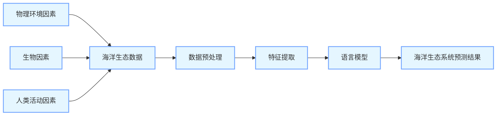

# 语言模型在海洋生态系统预测中的应用探索

> 关键词：语言模型、海洋生态系统预测、数据处理、算法原理、实际应用

> 摘要：本文深入探讨了语言模型在海洋生态系统预测中的应用。首先介绍了研究的背景、目的、预期读者、文档结构和相关术语。接着阐述了语言模型和海洋生态系统预测的核心概念及它们之间的联系，并给出了相应的文本示意图和Mermaid流程图。详细讲解了核心算法原理，用Python源代码进行了说明，同时介绍了相关的数学模型和公式，并举例说明。通过项目实战，展示了开发环境搭建、源代码实现及解读。分析了语言模型在海洋生态系统预测中的实际应用场景，推荐了学习资源、开发工具框架和相关论文著作。最后总结了未来发展趋势与挑战，还提供了常见问题解答和扩展阅读参考资料。

## 1. 背景介绍 
### 1.1 目的和范围
海洋生态系统是地球上最为复杂和重要的生态系统之一，它对于维持地球的生态平衡、提供食物资源、调节气候等方面都起着至关重要的作用。然而，由于人类活动的影响以及自然环境的变化，海洋生态系统面临着诸多挑战，如海洋污染、气候变化导致的海平面上升和水温变化、过度捕捞等。准确预测海洋生态系统的变化对于制定有效的保护和管理策略具有重要意义。

本研究的目的是探索语言模型在海洋生态系统预测中的应用，评估其在处理海洋生态数据、挖掘数据潜在信息以及进行准确预测方面的能力。研究范围涵盖了语言模型的基本原理、与海洋生态系统数据的结合方式、核心算法的实现、数学模型的构建以及在实际项目中的应用等方面。

### 1.2 预期读者
本文的预期读者包括海洋生态领域的科研人员、人工智能领域的开发者和研究人员、环境科学专业的学生以及对海洋生态保护和人工智能应用感兴趣的相关人士。对于海洋生态科研人员，本文可以提供一种新的数据分析和预测工具；对于人工智能开发者，本文展示了语言模型在跨领域的应用场景；对于学生和相关爱好者，本文可以作为了解语言模型和海洋生态系统预测的入门资料。

### 1.3 文档结构概述
本文将按照以下结构进行组织：首先介绍背景信息，包括目的、预期读者和文档结构；接着阐述语言模型和海洋生态系统预测的核心概念及其联系；详细讲解核心算法原理和具体操作步骤，并给出Python源代码；介绍相关的数学模型和公式，并举例说明；通过项目实战展示代码的实际应用和详细解释；分析语言模型在海洋生态系统预测中的实际应用场景；推荐学习资源、开发工具框架和相关论文著作；最后总结未来发展趋势与挑战，提供常见问题解答和扩展阅读参考资料。

### 1.4 术语表
#### 1.4.1 核心术语定义
- **语言模型**：是一种基于概率统计的模型，用于预测一个句子或一段文本出现的概率。在自然语言处理中，语言模型可以用于文本生成、机器翻译、语音识别等任务。在本文中，语言模型被用于处理和分析海洋生态系统的相关数据。
- **海洋生态系统**：是指在海洋中由生物群落及其生存环境共同组成的动态平衡系统，包括海洋中的各种生物（如浮游生物、鱼类、海洋哺乳动物等）以及它们所处的物理、化学环境（如海水温度、盐度、酸碱度等）。
- **海洋生态系统预测**：是指通过对海洋生态系统的历史数据和当前状态进行分析，运用一定的方法和模型，对海洋生态系统未来的变化趋势进行预测，如海洋生物数量的变化、海洋环境参数的变化等。

#### 1.4.2 相关概念解释
- **数据预处理**：在将海洋生态数据输入到语言模型之前，需要对数据进行清洗、转换、归一化等处理，以提高数据的质量和可用性。
- **特征提取**：从海洋生态数据中提取能够反映海洋生态系统特征的信息，如温度、盐度、生物多样性指数等，以便语言模型能够更好地理解和处理数据。
- **模型训练**：使用预处理后的数据对语言模型进行训练，调整模型的参数，使其能够更好地拟合数据，提高预测的准确性。

#### 1.4.3 缩略词列表
- **NLP**：Natural Language Processing，自然语言处理
- **ML**：Machine Learning，机器学习
- **DL**：Deep Learning，深度学习

## 2. 核心概念与联系 

### 语言模型原理
语言模型的核心目标是计算一个序列（通常是文本序列）的概率分布。在传统的统计语言模型中，最常用的是n-gram模型。n-gram模型假设一个词的出现只与它前面的n-1个词有关。例如，在一个二元（bigram）模型中，一个词 $w_i$ 出现的概率只取决于它前面的一个词 $w_{i-1}$，其计算公式为：

$$P(w_i|w_1, w_2, \cdots, w_{i-1}) \approx P(w_i|w_{i-1})$$

现代的深度学习语言模型，如Transformer架构的模型（如BERT、GPT等），通过多层的注意力机制来捕捉序列中的长距离依赖关系。注意力机制允许模型在处理每个位置的输入时，动态地关注序列中其他位置的信息。

### 海洋生态系统预测原理
海洋生态系统预测需要综合考虑多个因素，包括物理环境因素（如温度、盐度、光照等）、生物因素（如生物数量、种类分布等）以及人类活动因素（如捕捞强度、污染排放等）。通常的预测方法包括基于统计模型的方法（如时间序列分析、回归分析等）和基于机器学习的方法（如神经网络、决策树等）。

### 两者的联系
语言模型和海洋生态系统预测之间的联系在于可以将海洋生态数据看作是一种特殊的“语言”。海洋生态数据中的各种参数和指标可以类比为语言中的词汇，而数据的时间序列或空间分布可以类比为语言中的句子或段落。通过使用语言模型的技术和方法，可以挖掘海洋生态数据中的潜在模式和规律，从而实现更准确的海洋生态系统预测。

### 文本示意图
```plaintext
语言模型
|-- 输入：海洋生态数据（时间序列、空间分布等）
|   |-- 数据预处理（清洗、转换、归一化）
|   |-- 特征提取（温度、盐度、生物多样性等）
|-- 模型处理
|   |-- 传统n-gram模型（可选）
|   |-- 深度学习Transformer模型
|-- 输出：海洋生态系统预测结果（生物数量变化、环境参数变化等）

海洋生态系统
|-- 物理环境因素（温度、盐度、光照等）
|-- 生物因素（生物数量、种类分布等）
|-- 人类活动因素（捕捞强度、污染排放等）
```

### Mermaid流程图


## 3. 核心算法原理 & 具体操作步骤 

### 算法原理
本研究采用基于Transformer架构的语言模型进行海洋生态系统预测。Transformer架构由编码器和解码器组成，其中编码器用于对输入序列进行特征提取和表示学习，解码器用于根据编码器的输出进行预测。

Transformer的核心是多头注意力机制，它允许模型在处理每个位置的输入时，同时关注序列中不同位置的信息。多头注意力机制的计算公式如下：

$$\text{MultiHead}(Q, K, V) = \text{Concat}(\text{head}_1, \cdots, \text{head}_h)W^O$$

其中，$\text{head}_i = \text{Attention}(QW_i^Q, KW_i^K, VW_i^V)$，$\text{Attention}(Q, K, V) = \text{softmax}(\frac{QK^T}{\sqrt{d_k}})V$，$Q$、$K$、$V$ 分别是查询矩阵、键矩阵和值矩阵，$W_i^Q$、$W_i^K$、$W_i^V$ 和 $W^O$ 是可学习的参数矩阵，$d_k$ 是键的维度。

### 具体操作步骤
1. **数据收集**：收集海洋生态系统的相关数据，包括物理环境参数（如温度、盐度等）、生物数据（如生物数量、种类等）和人类活动数据（如捕捞强度等）。
2. **数据预处理**：对收集到的数据进行清洗，去除缺失值和异常值；对数据进行归一化处理，将数据映射到一个固定的范围；将数据转换为适合语言模型输入的格式，如序列数据。
3. **特征提取**：从预处理后的数据中提取能够反映海洋生态系统特征的信息，如温度变化率、生物多样性指数等。
4. **模型训练**：使用预处理和特征提取后的数据对Transformer语言模型进行训练。在训练过程中，使用交叉熵损失函数来衡量模型预测结果与真实值之间的差异，并使用优化算法（如Adam优化器）来更新模型的参数。
5. **模型评估**：使用测试数据集对训练好的模型进行评估，计算模型的准确率、召回率、均方误差等指标，评估模型的性能。
6. **预测**：使用训练好的模型对海洋生态系统的未来状态进行预测。

### Python源代码实现
```python
import torch
import torch.nn as nn
import torch.optim as optim

# 定义Transformer模型
class TransformerModel(nn.Module):
    def __init__(self, input_dim, d_model, nhead, num_layers, output_dim):
        super(TransformerModel, self).__init__()
        self.embedding = nn.Linear(input_dim, d_model)
        self.transformer_encoder = nn.TransformerEncoder(
            nn.TransformerEncoderLayer(d_model=d_model, nhead=nhead),
            num_layers=num_layers
        )
        self.fc = nn.Linear(d_model, output_dim)

    def forward(self, x):
        x = self.embedding(x)
        x = self.transformer_encoder(x)
        x = self.fc(x[:, -1, :])
        return x

# 数据预处理示例
def preprocess_data(data):
    # 假设data是一个二维数组，每行表示一个样本，每列表示一个特征
    # 归一化处理
    data = (data - data.mean(axis=0)) / data.std(axis=0)
    return data

# 模型训练示例
def train_model(model, train_data, train_labels, epochs, lr):
    criterion = nn.MSELoss()
    optimizer = optim.Adam(model.parameters(), lr=lr)

    for epoch in range(epochs):
        optimizer.zero_grad()
        outputs = model(train_data)
        loss = criterion(outputs, train_labels)
        loss.backward()
        optimizer.step()
        if (epoch + 1) % 10 == 0:
            print(f'Epoch {epoch + 1}/{epochs}, Loss: {loss.item()}')

# 示例数据
input_dim = 5  # 输入特征维度
d_model = 128
nhead = 8
num_layers = 2
output_dim = 1  # 输出维度

model = TransformerModel(input_dim, d_model, nhead, num_layers, output_dim)

# 模拟数据
train_data = torch.randn(100, 10, input_dim)  # 100个样本，每个样本长度为10，特征维度为5
train_labels = torch.randn(100, output_dim)

train_data = preprocess_data(train_data)

# 训练模型
train_model(model, train_data, train_labels, epochs=100, lr=0.001)
```

## 4. 数学模型和公式 & 详细讲解 & 举例说明 

### 数学模型
在海洋生态系统预测中，我们可以将问题建模为一个时间序列预测问题。假设我们有一个海洋生态系统的时间序列数据 $X = \{x_1, x_2, \cdots, x_T\}$，其中 $x_t$ 是一个向量，表示在时间 $t$ 时的海洋生态系统状态，包括物理环境参数、生物数据等。我们的目标是预测未来的状态 $x_{T+1}, x_{T+2}, \cdots$。

基于Transformer的语言模型可以学习到时间序列数据中的模式和规律，通过对历史数据的建模，预测未来的状态。在训练过程中，我们使用交叉熵损失函数来衡量模型预测结果与真实值之间的差异。对于一个样本 $(x_t, y_t)$，其中 $x_t$ 是输入序列，$y_t$ 是对应的真实值，交叉熵损失函数的计算公式为：

$$L = -\sum_{i=1}^{N} y_{ti} \log(p_{ti})$$

其中，$N$ 是输出的维度，$y_{ti}$ 是真实值的第 $i$ 个分量，$p_{ti}$ 是模型预测结果的第 $i$ 个分量。

### 详细讲解
在上述数学模型中，输入序列 $x_t$ 经过Transformer模型的处理后，得到一个预测结果 $\hat{y}_t$。交叉熵损失函数用于衡量 $\hat{y}_t$ 与真实值 $y_t$ 之间的差异。通过最小化损失函数，模型可以不断调整自身的参数，使得预测结果更加接近真实值。

在训练过程中，我们使用随机梯度下降（SGD）或其变种（如Adam）来更新模型的参数。具体来说，对于模型的参数 $\theta$，更新公式为：

$$\theta_{t+1} = \theta_t - \alpha \nabla L(\theta_t)$$

其中，$\alpha$ 是学习率，$\nabla L(\theta_t)$ 是损失函数关于参数 $\theta$ 的梯度。

### 举例说明
假设我们要预测海洋中某种鱼类的数量变化。我们收集了过去一段时间内的相关数据，包括海水温度、盐度、浮游生物数量等作为输入特征，而该鱼类的数量作为输出标签。

我们将这些数据进行预处理和特征提取后，输入到Transformer模型中进行训练。在训练过程中，模型会根据交叉熵损失函数来调整自身的参数，使得预测的鱼类数量与真实的鱼类数量之间的差异逐渐减小。

例如，在某个时间步 $t$，真实的鱼类数量为 $y_t = 100$，模型预测的鱼类数量为 $\hat{y}_t = 95$。通过计算交叉熵损失函数，得到一个损失值 $L$。然后，根据梯度下降算法，更新模型的参数，使得下一次预测结果更加准确。

## 5. 项目实战：代码实际案例和详细解释说明 

### 5.1  开发环境搭建
#### 安装Python
首先，确保你已经安装了Python 3.x版本。可以从Python官方网站（https://www.python.org/downloads/）下载并安装适合你操作系统的Python版本。

#### 安装必要的库
使用以下命令安装必要的Python库：
```bash
pip install torch numpy pandas scikit-learn matplotlib
```
- `torch`：用于构建和训练深度学习模型。
- `numpy`：用于数值计算。
- `pandas`：用于数据处理和分析。
- `scikit-learn`：用于数据预处理和模型评估。
- `matplotlib`：用于数据可视化。

### 5.2  源代码详细实现和代码解读
```python
import torch
import torch.nn as nn
import torch.optim as optim
import numpy as np
import pandas as pd
from sklearn.preprocessing import StandardScaler
import matplotlib.pyplot as plt

# 定义Transformer模型
class TransformerModel(nn.Module):
    def __init__(self, input_dim, d_model, nhead, num_layers, output_dim):
        super(TransformerModel, self).__init__()
        self.embedding = nn.Linear(input_dim, d_model)
        self.transformer_encoder = nn.TransformerEncoder(
            nn.TransformerEncoderLayer(d_model=d_model, nhead=nhead),
            num_layers=num_layers
        )
        self.fc = nn.Linear(d_model, output_dim)

    def forward(self, x):
        x = self.embedding(x)
        x = self.transformer_encoder(x)
        x = self.fc(x[:, -1, :])
        return x

# 数据预处理
def preprocess_data(data):
    scaler = StandardScaler()
    data = scaler.fit_transform(data)
    return data

# 准备数据集
def prepare_dataset(data, seq_length):
    X = []
    y = []
    for i in range(len(data) - seq_length):
        X.append(data[i:i+seq_length])
        y.append(data[i+seq_length])
    X = np.array(X)
    y = np.array(y)
    return torch.tensor(X, dtype=torch.float32), torch.tensor(y, dtype=torch.float32)

# 模型训练
def train_model(model, train_X, train_y, epochs, lr):
    criterion = nn.MSELoss()
    optimizer = optim.Adam(model.parameters(), lr=lr)

    for epoch in range(epochs):
        optimizer.zero_grad()
        outputs = model(train_X)
        loss = criterion(outputs, train_y)
        loss.backward()
        optimizer.step()
        if (epoch + 1) % 10 == 0:
            print(f'Epoch {epoch + 1}/{epochs}, Loss: {loss.item()}')

# 加载数据
data = pd.read_csv('ocean_ecosystem_data.csv')  # 假设数据文件名为ocean_ecosystem_data.csv
data = data.values

# 数据预处理
data = preprocess_data(data)

# 准备数据集
seq_length = 10
train_X, train_y = prepare_dataset(data, seq_length)

# 定义模型参数
input_dim = train_X.shape[-1]
d_model = 128
nhead = 8
num_layers = 2
output_dim = train_y.shape[-1]

model = TransformerModel(input_dim, d_model, nhead, num_layers, output_dim)

# 训练模型
train_model(model, train_X, train_y, epochs=100, lr=0.001)

# 预测
test_X = train_X[-1].unsqueeze(0)
prediction = model(test_X).detach().numpy()
print(f'Prediction: {prediction}')

# 可视化
plt.plot(data[:, 0], label='Actual')
plt.plot(len(data), prediction[0, 0], 'ro', label='Predicted')
plt.xlabel('Time')
plt.ylabel('Value')
plt.legend()
plt.show()
```

### 5.3  代码解读与分析
#### 数据加载和预处理
- 使用 `pandas` 库加载海洋生态系统数据文件 `ocean_ecosystem_data.csv`。
- 使用 `StandardScaler` 对数据进行归一化处理，使得数据的均值为0，标准差为1。

#### 数据集准备
- `prepare_dataset` 函数将时间序列数据转换为适合模型输入的格式。它将数据划分为输入序列和对应的目标值，其中输入序列的长度为 `seq_length`。

#### 模型定义
- `TransformerModel` 类定义了一个基于Transformer架构的模型。它包含一个线性嵌入层、一个Transformer编码器层和一个全连接层。

#### 模型训练
- `train_model` 函数使用均方误差损失函数（MSE）和Adam优化器对模型进行训练。在每个epoch中，计算模型的预测结果和损失值，并使用反向传播算法更新模型的参数。

#### 预测和可视化
- 使用训练好的模型对最后一个输入序列进行预测，并将预测结果可视化。

## 6. 实际应用场景 
### 海洋生物资源管理
语言模型可以通过对海洋生态数据的分析，预测海洋生物的数量变化和分布情况。这对于渔业资源的管理和保护具有重要意义。例如，通过预测某种鱼类的数量变化，渔业管理部门可以制定合理的捕捞配额，避免过度捕捞，保护海洋生物资源的可持续发展。

### 海洋环境监测与预警
语言模型可以实时监测海洋环境参数的变化，如海水温度、盐度、酸碱度等。当监测到异常变化时，及时发出预警，提醒相关部门采取措施应对可能的海洋灾害，如赤潮、海啸等。

### 海洋生态系统修复
在海洋生态系统修复项目中，语言模型可以预测不同修复措施的效果。例如，预测在投放人工鱼礁后，海洋生物的栖息和繁殖情况，为生态系统修复方案的制定提供科学依据。

### 气候变化对海洋生态系统的影响评估
随着全球气候变化，海洋生态系统面临着诸多挑战，如海平面上升、水温升高、海洋酸化等。语言模型可以通过分析历史数据和气候变化模型，预测气候变化对海洋生态系统的长期影响，为应对气候变化提供决策支持。

## 7. 工具和资源推荐
### 7.1 学习资源推荐
#### 7.1.1 书籍推荐
- 《深度学习》（Deep Learning）：由Ian Goodfellow、Yoshua Bengio和Aaron Courville所著，是深度学习领域的经典教材，涵盖了神经网络、卷积神经网络、循环神经网络等内容。
- 《自然语言处理入门》：帮助读者了解自然语言处理的基本概念和方法，对于理解语言模型的原理和应用有很大帮助。
- 《海洋生态学》：介绍海洋生态系统的结构、功能和动态变化，为理解海洋生态系统预测提供了必要的背景知识。

#### 7.1.2 在线课程
- Coursera上的“深度学习专项课程”（Deep Learning Specialization）：由Andrew Ng教授授课，系统地介绍了深度学习的理论和实践。
- edX上的“自然语言处理基础”（Foundations of Natural Language Processing）：讲解自然语言处理的基本技术和算法。
- 中国大学MOOC上的“海洋生态学”课程：提供了海洋生态系统的专业知识。

#### 7.1.3 技术博客和网站
- Medium：有许多关于人工智能和海洋科学的技术博客，如Towards Data Science、The AI Journal等。
- arXiv：提供了最新的学术研究论文，包括语言模型和海洋生态系统预测方面的研究。
- 中国海洋科学数据中心：提供了丰富的海洋生态数据和相关研究成果。

### 7.2 开发工具框架推荐
#### 7.2.1 IDE和编辑器
- PyCharm：是一款专业的Python集成开发环境，提供了代码编辑、调试、版本控制等功能。
- Jupyter Notebook：适合进行数据分析和模型开发，支持代码、文本和可视化的混合编写。

#### 7.2.2 调试和性能分析工具
- TensorBoard：是TensorFlow的可视化工具，可以用于监控模型的训练过程、可视化模型结构和分析性能指标。
- PyTorch Profiler：可以帮助开发者分析PyTorch模型的性能瓶颈，优化代码。

#### 7.2.3 相关框架和库
- PyTorch：是一个开源的深度学习框架，提供了丰富的深度学习模型和工具，方便进行模型开发和训练。
- Transformers：由Hugging Face开发的库，提供了预训练的Transformer模型，如BERT、GPT等，可以快速搭建语言模型。
- Pandas：用于数据处理和分析，提供了高效的数据结构和数据操作方法。

### 7.3 相关论文著作推荐
#### 7.3.1 经典论文
- “Attention Is All You Need”：介绍了Transformer架构，是现代语言模型的基础。
- “A Neural Probabilistic Language Model”：提出了神经网络语言模型的概念，为语言模型的发展奠定了基础。

#### 7.3.2 最新研究成果
- 关注顶级学术会议（如NeurIPS、ICML、ACL等）和期刊（如Journal of Artificial Intelligence Research、Journal of Marine Systems等）上的最新研究论文，了解语言模型在海洋生态系统预测中的最新应用和研究进展。

#### 7.3.3 应用案例分析
- 查找相关的研究报告和案例分析，了解语言模型在实际海洋生态系统预测项目中的应用效果和经验教训。

## 8. 总结：未来发展趋势与挑战
### 未来发展趋势
- **多模态数据融合**：未来的海洋生态系统预测将不仅仅依赖于单一类型的数据，而是会融合多种模态的数据，如卫星遥感数据、水下传感器数据、生物观测数据等。语言模型可以在多模态数据融合方面发挥重要作用，通过学习不同模态数据之间的关联，提高预测的准确性。
- **实时预测与决策支持**：随着技术的发展，语言模型将能够实现实时的海洋生态系统预测，并为决策者提供及时的决策支持。例如，在海洋灾害发生前，及时发出预警并提供应对措施建议。
- **与其他技术的融合**：语言模型将与其他技术（如物联网、大数据、云计算等）深度融合，构建更加智能的海洋生态监测和预测系统。例如，通过物联网设备实时收集海洋生态数据，利用大数据技术进行存储和管理，使用云计算进行模型训练和预测。

### 挑战
- **数据质量和可用性**：海洋生态数据往往存在数据缺失、噪声大、不完整等问题，这会影响语言模型的训练和预测效果。如何提高数据的质量和可用性是一个亟待解决的问题。
- **模型可解释性**：深度学习语言模型通常是黑盒模型，其决策过程难以解释。在海洋生态系统预测中，模型的可解释性非常重要，因为决策者需要了解模型预测的依据。如何提高语言模型的可解释性是一个挑战。
- **计算资源需求**：训练大规模的语言模型需要大量的计算资源，这对于一些研究机构和企业来说是一个挑战。如何优化模型结构和训练算法，降低计算资源需求是一个研究方向。

## 9. 附录：常见问题与解答
### 问题1：语言模型在海洋生态系统预测中的准确性如何？
语言模型的准确性受到多种因素的影响，如数据质量、模型结构、训练方法等。在实际应用中，需要通过大量的实验和验证来评估模型的准确性。一般来说，通过合理的数据预处理、模型选择和训练优化，可以取得较好的预测效果。

### 问题2：如何选择适合的语言模型进行海洋生态系统预测？
选择适合的语言模型需要考虑数据的特点、预测任务的要求和计算资源等因素。对于小规模数据和简单的预测任务，可以选择传统的统计语言模型或简单的神经网络模型；对于大规模数据和复杂的预测任务，可以选择基于Transformer架构的深度学习模型。

### 问题3：语言模型在处理海洋生态数据时需要注意什么？
在处理海洋生态数据时，需要注意数据的质量和特征。首先，要对数据进行清洗和预处理，去除缺失值和异常值；其次，要进行特征提取，选择能够反映海洋生态系统特征的信息作为模型的输入；最后，要注意数据的时间序列和空间分布特点，合理设计模型的输入结构。

### 问题4：如何评估语言模型在海洋生态系统预测中的性能？
可以使用多种指标来评估语言模型的性能，如均方误差（MSE）、均方根误差（RMSE）、平均绝对误差（MAE）、准确率、召回率等。根据具体的预测任务和数据特点，选择合适的评估指标。

## 10. 扩展阅读 & 参考资料
- Goodfellow, I., Bengio, Y., & Courville, A. (2016). Deep Learning. MIT Press.
- Mikolov, T., et al. (2010). Recurrent neural network based language model. In Proceedings of the 11th annual conference of the international speech communication association.
- Vaswani, A., et al. (2017). Attention is all you need. In Advances in neural information processing systems.
- 中国海洋科学数据中心：https://www.nmdis.org.cn/
- Hugging Face Transformers库文档：https://huggingface.co/docs/transformers/index

作者：AI天才研究院/AI Genius Institute & 禅与计算机程序设计艺术 /Zen And The Art of Computer Programming