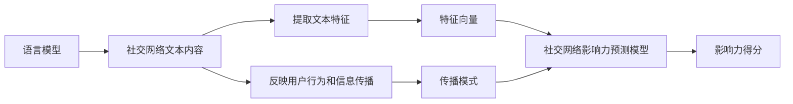

# 语言模型在社交网络影响力预测中的应用研究

> 关键词：语言模型、社交网络、影响力预测、文本分析、深度学习

> 摘要：本文聚焦于语言模型在社交网络影响力预测中的应用。首先介绍了研究的背景、目的、预期读者以及文档结构等内容。接着阐述了语言模型和社交网络影响力的核心概念及其联系，并给出相应的文本示意图和Mermaid流程图。详细讲解了核心算法原理，通过Python源代码展示具体操作步骤。深入分析了相关的数学模型和公式，并举例说明。通过项目实战，展示了代码的实际案例并进行详细解释。探讨了语言模型在社交网络影响力预测中的实际应用场景，推荐了相关的学习资源、开发工具框架以及论文著作。最后总结了未来发展趋势与挑战，并给出常见问题解答和扩展阅读参考资料，旨在为该领域的研究和实践提供全面而深入的指导。

## 1. 背景介绍 
### 1.1 目的和范围
在当今数字化时代，社交网络已经成为人们生活中不可或缺的一部分。社交网络上的信息传播迅速且广泛，个体和组织的影响力能够在短时间内得到极大的放大或缩小。准确预测社交网络中的影响力对于市场营销、舆情监测、公共政策制定等多个领域都具有重要意义。本研究的目的在于探讨如何利用语言模型来提高社交网络影响力预测的准确性和有效性。研究范围涵盖了各种主流社交网络平台，如微博、Twitter、Facebook等，以及多种类型的语言模型，包括传统的统计语言模型和基于深度学习的预训练语言模型。

### 1.2 预期读者
本文预期读者包括从事自然语言处理、机器学习、社交网络分析等领域的研究人员和学者，他们可以从本文中获取关于语言模型在社交网络影响力预测方面的最新研究进展和技术方法；同时，也适合社交网络平台的开发者和运营者，帮助他们更好地理解用户行为和信息传播规律，优化平台的推荐算法和运营策略；此外，对于市场营销人员、舆情分析师等行业从业者，本文提供了一种新的思路和工具，有助于他们更精准地进行市场推广和舆情监测。

### 1.3 文档结构概述
本文共分为十个部分。第一部分为背景介绍，阐述了研究的目的、范围、预期读者和文档结构；第二部分介绍核心概念与联系，解释语言模型和社交网络影响力的基本概念，并展示它们之间的关系；第三部分讲解核心算法原理和具体操作步骤，通过Python代码详细说明；第四部分介绍相关的数学模型和公式，并举例说明；第五部分进行项目实战，包括开发环境搭建、源代码实现和代码解读；第六部分探讨实际应用场景；第七部分推荐相关的工具和资源；第八部分总结未来发展趋势与挑战；第九部分为附录，解答常见问题；第十部分提供扩展阅读和参考资料。

### 1.4 术语表
#### 1.4.1 核心术语定义
- **语言模型**：是一种对自然语言文本进行建模的统计模型或深度学习模型，用于预测文本中单词或字符的出现概率。常见的语言模型包括n-gram模型、循环神经网络（RNN）、长短期记忆网络（LSTM）、Transformer模型等。
- **社交网络影响力**：指个体或组织在社交网络中能够影响其他用户的观点、行为和决策的能力。影响力的大小可以通过多种指标来衡量，如粉丝数量、点赞数、评论数、转发数等。
- **预训练语言模型**：是一种在大规模文本数据上进行无监督学习的语言模型，通过学习文本的通用特征和语义信息，能够在多种自然语言处理任务中取得较好的效果。常见的预训练语言模型包括BERT、GPT等。

#### 1.4.2 相关概念解释
- **文本嵌入**：是将文本转换为向量表示的过程，使得文本可以在向量空间中进行计算和分析。常见的文本嵌入方法包括词袋模型、词向量（如Word2Vec、GloVe）、基于语言模型的嵌入（如BERT嵌入）等。
- **信息传播**：指信息在社交网络中从一个节点传播到其他节点的过程。信息传播的速度和范围受到多种因素的影响，如节点的影响力、网络结构、信息内容等。
- **社交网络分析**：是对社交网络的结构、节点之间的关系以及信息传播规律进行分析的方法。社交网络分析可以帮助我们了解社交网络的特征和行为，发现关键节点和社区结构。

#### 1.4.3 缩略词列表
- **RNN**：Recurrent Neural Network，循环神经网络
- **LSTM**：Long Short-Term Memory，长短期记忆网络
- **BERT**：Bidirectional Encoder Representations from Transformers，基于Transformer的双向编码器表示
- **GPT**：Generative Pretrained Transformer，生成式预训练Transformer

## 2. 核心概念与联系 

### 语言模型原理
语言模型的核心目标是计算一个句子或文本序列的概率分布。传统的统计语言模型基于n-gram假设，即一个词的出现概率只与它前面的n-1个词有关。例如，对于一个三元语言模型（n=3），计算 $P(w_i|w_{i-1},w_{i-2})$ ，其中 $w_i$ 表示第i个词。

基于深度学习的语言模型，如RNN、LSTM和Transformer，能够更好地处理长序列依赖关系。以Transformer为例，它采用了自注意力机制，能够并行计算输入序列中每个位置的表示，从而提高了模型的训练效率和性能。

### 社交网络影响力概念
社交网络影响力可以从多个维度进行衡量。从节点层面来看，一个用户的影响力可以通过其粉丝数量、发布内容的互动量（点赞、评论、转发）等指标来评估。从信息传播层面来看，影响力可以表现为一条信息在社交网络中传播的范围和速度。

### 两者联系
语言模型可以通过对社交网络上的文本内容进行分析，提取与影响力相关的特征。例如，通过分析用户发布的文本内容的情感倾向、主题、语言风格等，可以预测该用户的影响力大小。同时，社交网络的结构信息也可以与语言模型相结合，进一步提高影响力预测的准确性。

### 文本示意图
```plaintext
语言模型 <----> 社交网络文本内容 <----> 社交网络影响力
|                   |                        |
| 提取文本特征      | 反映用户行为和信息传播 | 多种衡量指标
|                   |                        |
V                   V                        V
特征向量             传播模式               影响力得分
```

### Mermaid流程图


## 3. 核心算法原理 & 具体操作步骤 

### 算法原理
我们采用基于预训练语言模型BERT的方法来进行社交网络影响力预测。BERT能够学习到文本的深层次语义信息，通过将社交网络上的文本内容输入到BERT模型中，得到文本的向量表示。然后，将这些向量表示作为特征输入到一个全连接神经网络中，进行影响力预测。

### Python源代码实现

```python
import torch
from transformers import BertTokenizer, BertModel
import torch.nn as nn
import torch.optim as optim

# 加载预训练的BERT模型和分词器
tokenizer = BertTokenizer.from_pretrained('bert-base-uncased')
bert_model = BertModel.from_pretrained('bert-base-uncased')

# 定义影响力预测模型
class InfluencePredictionModel(nn.Module):
    def __init__(self, input_size, hidden_size, output_size):
        super(InfluencePredictionModel, self).__init__()
        self.bert = bert_model
        self.fc1 = nn.Linear(input_size, hidden_size)
        self.relu = nn.ReLU()
        self.fc2 = nn.Linear(hidden_size, output_size)

    def forward(self, input_ids, attention_mask):
        outputs = self.bert(input_ids=input_ids, attention_mask=attention_mask)
        pooled_output = outputs.pooler_output
        x = self.fc1(pooled_output)
        x = self.relu(x)
        x = self.fc2(x)
        return x

# 初始化模型
input_size = 768  # BERT模型的输出维度
hidden_size = 256
output_size = 1  # 影响力得分
model = InfluencePredictionModel(input_size, hidden_size, output_size)

# 定义损失函数和优化器
criterion = nn.MSELoss()
optimizer = optim.Adam(model.parameters(), lr=0.001)

# 示例数据
texts = ["This is a great post on social media!", "I don't like this content."]
labels = [0.8, 0.2]  # 示例影响力得分

# 数据预处理
input_ids = []
attention_masks = []
for text in texts:
    encoded_dict = tokenizer.encode_plus(
                        text,                      # 输入文本
                        add_special_tokens = True, # 添加特殊标记
                        max_length = 128,          # 最大序列长度
                        pad_to_max_length = True,
                        return_attention_mask = True,   # 返回注意力掩码
                        return_tensors = 'pt',     # 返回PyTorch张量
                   )
    input_ids.append(encoded_dict['input_ids'])
    attention_masks.append(encoded_dict['attention_mask'])

input_ids = torch.cat(input_ids, dim=0)
attention_masks = torch.cat(attention_masks, dim=0)
labels = torch.tensor(labels, dtype=torch.float32).unsqueeze(1)

# 训练模型
num_epochs = 10
for epoch in range(num_epochs):
    model.train()
    optimizer.zero_grad()
    outputs = model(input_ids, attention_masks)
    loss = criterion(outputs, labels)
    loss.backward()
    optimizer.step()
    print(f'Epoch {epoch+1}/{num_epochs}, Loss: {loss.item()}')
```

### 具体操作步骤
1. **数据收集**：从社交网络平台上收集用户的文本内容和对应的影响力指标数据。
2. **数据预处理**：使用BERT分词器对文本进行分词和编码，将文本转换为输入ID和注意力掩码。
3. **模型初始化**：加载预训练的BERT模型，并定义影响力预测模型。
4. **训练模型**：将处理后的数据输入到模型中，使用损失函数计算损失，并使用优化器更新模型参数。
5. **模型评估**：使用测试数据对训练好的模型进行评估，计算预测结果与真实值之间的误差。

## 4. 数学模型和公式 & 详细讲解 & 举例说明 

### 语言模型的概率计算
对于一个文本序列 $w_1, w_2, \cdots, w_n$ ，语言模型的目标是计算其概率 $P(w_1, w_2, \cdots, w_n)$ 。根据链式法则，有：

$$P(w_1, w_2, \cdots, w_n) = \prod_{i=1}^{n} P(w_i|w_1, w_2, \cdots, w_{i-1})$$

在n-gram模型中，假设一个词的出现概率只与它前面的n-1个词有关，即：

$$P(w_i|w_1, w_2, \cdots, w_{i-1}) \approx P(w_i|w_{i-(n-1)}, \cdots, w_{i-1})$$

例如，对于一个二元语言模型（n=2），计算 $P(w_i|w_{i-1})$ 。假设我们有一个语料库，其中包含句子 “The dog runs fast” ，我们可以统计每个词对的出现频率，来估计条件概率。

### BERT模型的输出计算
BERT模型的输入是一个经过分词和编码后的文本序列，输出是每个位置的隐藏状态和池化输出。设输入序列为 $x_1, x_2, \cdots, x_n$ ，经过BERT模型的多层Transformer编码后，得到每个位置的隐藏状态 $h_1, h_2, \cdots, h_n$ 。池化输出 $h_{pooled}$ 是第一个位置的隐藏状态经过一个线性变换和激活函数得到的：

$$h_{pooled} = \text{Activation}(W_{pooled} \cdot h_1 + b_{pooled})$$

其中 $W_{pooled}$ 是权重矩阵， $b_{pooled}$ 是偏置向量。

### 影响力预测模型的计算
影响力预测模型将BERT的池化输出作为输入，经过全连接层进行非线性变换，得到最终的影响力得分。设输入为 $h_{pooled}$ ，经过第一个全连接层的计算为：

$$z_1 = W_1 \cdot h_{pooled} + b_1$$

其中 $W_1$ 是第一个全连接层的权重矩阵， $b_1$ 是偏置向量。然后经过ReLU激活函数：

$$a_1 = \text{ReLU}(z_1)$$

最后经过第二个全连接层得到影响力得分：

$$y = W_2 \cdot a_1 + b_2$$

其中 $W_2$ 是第二个全连接层的权重矩阵， $b_2$ 是偏置向量。

### 举例说明
假设我们有一个文本 “This is a wonderful post” ，经过BERT分词器编码后得到输入ID和注意力掩码。将其输入到BERT模型中，得到池化输出 $h_{pooled}$ ，假设 $h_{pooled}$ 是一个768维的向量。然后将 $h_{pooled}$ 输入到影响力预测模型中，经过第一个全连接层的计算得到 $z_1$ ，假设 $W_1$ 是一个 $256 \times 768$ 的矩阵， $b_1$ 是一个256维的向量。经过ReLU激活函数得到 $a_1$ ，最后经过第二个全连接层得到影响力得分 $y$ ，假设 $W_2$ 是一个 $1 \times 256$ 的矩阵， $b_2$ 是一个标量。

## 5. 项目实战：代码实际案例和详细解释说明 

### 5.1  开发环境搭建
#### 安装Python
首先，确保你已经安装了Python 3.6或更高版本。可以从Python官方网站（https://www.python.org/downloads/） 下载并安装。

#### 安装依赖库
使用pip安装所需的依赖库：
```sh
pip install torch transformers
```

### 5.2  源代码详细实现和代码解读

```python
import torch
from transformers import BertTokenizer, BertModel
import torch.nn as nn
import torch.optim as optim

# 加载预训练的BERT模型和分词器
tokenizer = BertTokenizer.from_pretrained('bert-base-uncased')
bert_model = BertModel.from_pretrained('bert-base-uncased')
```
这部分代码导入了必要的库，并加载了预训练的BERT模型和分词器。 `BertTokenizer` 用于将文本转换为输入ID和注意力掩码， `BertModel` 是预训练的BERT模型。

```python
# 定义影响力预测模型
class InfluencePredictionModel(nn.Module):
    def __init__(self, input_size, hidden_size, output_size):
        super(InfluencePredictionModel, self).__init__()
        self.bert = bert_model
        self.fc1 = nn.Linear(input_size, hidden_size)
        self.relu = nn.ReLU()
        self.fc2 = nn.Linear(hidden_size, output_size)

    def forward(self, input_ids, attention_mask):
        outputs = self.bert(input_ids=input_ids, attention_mask=attention_mask)
        pooled_output = outputs.pooler_output
        x = self.fc1(pooled_output)
        x = self.relu(x)
        x = self.fc2(x)
        return x
```
这部分代码定义了影响力预测模型。 `InfluencePredictionModel` 继承自 `nn.Module` ，包含一个BERT模型和两个全连接层。 `forward` 方法定义了模型的前向传播过程，将输入的文本经过BERT模型得到池化输出，然后经过全连接层得到影响力得分。

```python
# 初始化模型
input_size = 768  # BERT模型的输出维度
hidden_size = 256
output_size = 1  # 影响力得分
model = InfluencePredictionModel(input_size, hidden_size, output_size)
```
这部分代码初始化了影响力预测模型，设置了输入维度、隐藏层维度和输出维度。

```python
# 定义损失函数和优化器
criterion = nn.MSELoss()
optimizer = optim.Adam(model.parameters(), lr=0.001)
```
这部分代码定义了损失函数和优化器。使用均方误差损失函数（MSE）来计算预测结果与真实值之间的误差，使用Adam优化器来更新模型参数。

```python
# 示例数据
texts = ["This is a great post on social media!", "I don't like this content."]
labels = [0.8, 0.2]  # 示例影响力得分

# 数据预处理
input_ids = []
attention_masks = []
for text in texts:
    encoded_dict = tokenizer.encode_plus(
                        text,                      # 输入文本
                        add_special_tokens = True, # 添加特殊标记
                        max_length = 128,          # 最大序列长度
                        pad_to_max_length = True,
                        return_attention_mask = True,   # 返回注意力掩码
                        return_tensors = 'pt',     # 返回PyTorch张量
                   )
    input_ids.append(encoded_dict['input_ids'])
    attention_masks.append(encoded_dict['attention_mask'])

input_ids = torch.cat(input_ids, dim=0)
attention_masks = torch.cat(attention_masks, dim=0)
labels = torch.tensor(labels, dtype=torch.float32).unsqueeze(1)
```
这部分代码准备了示例数据，并进行了数据预处理。使用 `BertTokenizer` 的 `encode_plus` 方法将文本转换为输入ID和注意力掩码，然后将它们拼接成张量。

```python
# 训练模型
num_epochs = 10
for epoch in range(num_epochs):
    model.train()
    optimizer.zero_grad()
    outputs = model(input_ids, attention_masks)
    loss = criterion(outputs, labels)
    loss.backward()
    optimizer.step()
    print(f'Epoch {epoch+1}/{num_epochs}, Loss: {loss.item()}')
```
这部分代码进行模型训练。在每个epoch中，将模型设置为训练模式，清空梯度，前向传播计算输出，计算损失，反向传播更新梯度，最后使用优化器更新模型参数。

### 5.3  代码解读与分析
- **数据预处理**：使用 `BertTokenizer` 对文本进行分词和编码，将文本转换为模型可以接受的输入格式。添加特殊标记和填充操作可以确保输入序列的长度一致。
- **模型结构**：影响力预测模型由BERT模型和两个全连接层组成。BERT模型用于提取文本的语义特征，全连接层用于将特征映射到影响力得分。
- **训练过程**：使用均方误差损失函数和Adam优化器进行训练。在每个epoch中，不断更新模型参数，使得预测结果与真实值之间的误差逐渐减小。

## 6. 实际应用场景 
### 市场营销
在市场营销中，企业可以利用语言模型预测社交网络上用户的影响力，从而选择合适的网红或意见领袖进行合作。通过分析网红发布的文本内容，预测其影响力大小和受众群体，提高营销活动的效果和回报率。例如，某化妆品公司可以通过语言模型分析美妆博主的社交媒体帖子，选择影响力较大且与品牌形象相符的博主进行产品推广。

### 舆情监测
政府和企业可以利用语言模型对社交网络上的舆情进行监测和分析。通过预测信息的传播影响力，及时发现潜在的危机事件和热点话题。例如，政府部门可以通过监测社交媒体上关于公共政策的讨论，了解公众的态度和意见，及时调整政策策略。

### 社交网络平台优化
社交网络平台可以利用语言模型预测用户的影响力，优化推荐算法和内容分发策略。将有影响力的用户的内容推荐给更多的用户，提高平台的用户活跃度和粘性。例如，微博平台可以根据用户的影响力和兴趣偏好，为用户推荐更有价值的内容和关注对象。

### 学术研究
在学术研究中，语言模型在社交网络影响力预测方面的应用可以帮助研究人员更好地理解信息传播规律和社会行为。例如，研究人员可以通过分析社交媒体上的学术论文讨论，预测论文的影响力和传播范围。

## 7. 工具和资源推荐
### 7.1 学习资源推荐
#### 7.1.1 书籍推荐
- 《自然语言处理入门》：这本书适合初学者，介绍了自然语言处理的基本概念、方法和技术，包括语言模型、文本分类、信息抽取等。
- 《深度学习》：由Ian Goodfellow、Yoshua Bengio和Aaron Courville撰写，是深度学习领域的经典教材，详细介绍了深度学习的理论和实践。
- 《社交网络分析：方法与应用》：全面介绍了社交网络分析的基本概念、方法和工具，包括网络结构分析、节点影响力分析等。

#### 7.1.2 在线课程
- Coursera上的“Natural Language Processing Specialization”：由斯坦福大学的教授授课，涵盖了自然语言处理的多个方面，包括语言模型、机器翻译、情感分析等。
- edX上的“Deep Learning Specialization”：由Andrew Ng教授授课，是深度学习领域的经典课程，介绍了深度学习的基本原理和应用。
- Udemy上的“Social Network Analysis in Python”：通过Python代码讲解社交网络分析的方法和技术，包括网络构建、节点分析、信息传播模拟等。

#### 7.1.3 技术博客和网站
- Hugging Face Blog：提供了关于自然语言处理和预训练语言模型的最新研究成果和技术文章。
- Towards Data Science：是一个数据科学和机器学习领域的博客平台，有很多关于语言模型和社交网络分析的优秀文章。
- ArXiv.org：是一个学术论文预印本平台，可以找到关于语言模型和社交网络影响力预测的最新研究论文。

### 7.2 开发工具框架推荐
#### 7.2.1 IDE和编辑器
- PyCharm：是一款专业的Python集成开发环境，提供了丰富的代码编辑、调试和项目管理功能。
- Jupyter Notebook：是一个交互式的开发环境，适合进行数据分析和模型实验。可以在浏览器中编写和运行Python代码，同时可以添加文本说明和可视化图表。
- Visual Studio Code：是一款轻量级的代码编辑器，支持多种编程语言和插件扩展。可以安装Python相关的插件，进行代码编辑和调试。

#### 7.2.2 调试和性能分析工具
- PyTorch Profiler：是PyTorch官方提供的性能分析工具，可以帮助开发者分析模型的训练和推理时间，找出性能瓶颈。
- TensorBoard：是TensorFlow提供的可视化工具，也可以与PyTorch结合使用。可以可视化模型的训练过程、损失曲线、梯度分布等信息。
- cProfile：是Python标准库中的性能分析工具，可以分析Python代码的运行时间和函数调用情况。

#### 7.2.3 相关框架和库
- PyTorch：是一个开源的深度学习框架，提供了丰富的神经网络层和优化器，支持GPU加速。
- Transformers：是Hugging Face开发的一个自然语言处理库，提供了多种预训练语言模型，如BERT、GPT等，方便开发者进行模型的加载和使用。
- NetworkX：是一个用于复杂网络分析的Python库，提供了多种网络结构和算法，如节点中心性计算、社区发现等。

### 7.3 相关论文著作推荐
#### 7.3.1 经典论文
- “Attention Is All You Need”：介绍了Transformer模型，是自然语言处理领域的重要突破。
- “BERT: Pre-training of Deep Bidirectional Transformers for Language Understanding”：提出了BERT模型，在多种自然语言处理任务中取得了优异的成绩。
- “The Anatomy of a Large-Scale Hypertextual Web Search Engine”：介绍了Google的PageRank算法，是网页排名和节点影响力计算的经典算法。

#### 7.3.2 最新研究成果
- 可以在ArXiv.org上搜索关于“Language Model for Social Network Influence Prediction”的最新研究论文，了解该领域的最新进展和技术方法。

#### 7.3.3 应用案例分析
- 可以参考一些企业和研究机构发布的关于语言模型在社交网络影响力预测方面的应用案例报告，了解实际应用中的问题和解决方案。

## 8. 总结：未来发展趋势与挑战
### 未来发展趋势
- **多模态融合**：未来的研究可能会将语言模型与图像、视频等多模态信息相结合，更全面地分析社交网络中的影响力。例如，在分析网红的影响力时，不仅考虑其发布的文本内容，还考虑其发布的图片和视频的质量和吸引力。
- **个性化预测**：随着用户数据的不断积累，语言模型可以实现更加个性化的影响力预测。根据用户的兴趣、偏好和历史行为，为每个用户提供更加准确的影响力预测结果。
- **实时预测**：在社交网络中，信息传播速度非常快，因此实时影响力预测将变得越来越重要。未来的语言模型需要具备实时处理和预测的能力，及时捕捉信息传播的动态变化。
- **跨平台应用**：社交网络平台众多，未来的研究可能会关注语言模型在不同社交网络平台上的通用性和适应性，实现跨平台的影响力预测。

### 挑战
- **数据质量和隐私问题**：社交网络上的数据量巨大，但数据质量参差不齐，同时还涉及到用户隐私问题。如何获取高质量的、合法合规的数据，并对数据进行有效的清洗和预处理，是一个挑战。
- **模型复杂度和计算资源**：基于深度学习的语言模型通常具有较高的复杂度，需要大量的计算资源进行训练和推理。如何优化模型结构和算法，降低计算成本，是一个亟待解决的问题。
- **影响力衡量标准的多样性**：社交网络影响力的衡量标准多种多样，不同的应用场景可能需要不同的衡量指标。如何综合考虑多种衡量标准，建立更加准确和全面的影响力预测模型，是一个挑战。
- **信息传播的不确定性**：社交网络中的信息传播受到多种因素的影响，具有很大的不确定性。如何捕捉这些不确定性，提高影响力预测的准确性和可靠性，是一个具有挑战性的问题。

## 9. 附录：常见问题与解答
### 问题1：语言模型在社交网络影响力预测中的准确性如何？
语言模型在社交网络影响力预测中的准确性受到多种因素的影响，如数据质量、模型选择、特征工程等。一般来说，基于深度学习的预训练语言模型在处理文本语义信息方面具有较好的性能，能够提高影响力预测的准确性。但要达到较高的准确性，还需要结合社交网络的结构信息和其他特征进行综合分析。

### 问题2：如何选择合适的语言模型进行社交网络影响力预测？
选择合适的语言模型需要考虑多个因素，如模型的性能、计算资源、数据规模等。对于小规模数据集和简单任务，可以选择传统的统计语言模型或轻量级的深度学习模型；对于大规模数据集和复杂任务，建议选择基于Transformer的预训练语言模型，如BERT、GPT等。

### 问题3：语言模型在社交网络影响力预测中的应用是否存在局限性？
语言模型在社交网络影响力预测中的应用存在一定的局限性。例如，语言模型只能处理文本信息，对于图像、视频等多模态信息的处理能力有限；同时，语言模型对于信息传播的动态变化和不确定性的捕捉能力还不够强。因此，在实际应用中，需要结合其他方法和技术进行综合分析。

### 问题4：如何评估语言模型在社交网络影响力预测中的性能？
可以使用多种指标来评估语言模型在社交网络影响力预测中的性能，如均方误差（MSE）、平均绝对误差（MAE）、相关系数等。这些指标可以衡量预测结果与真实值之间的误差和相关性。同时，还可以进行交叉验证和可视化分析，进一步评估模型的性能和稳定性。

## 10. 扩展阅读 & 参考资料
### 扩展阅读
- 《Python自然语言处理实战：核心技术与算法》
- 《社交网络数据挖掘与分析》
- 《深度学习进阶：自然语言处理》

### 参考资料
- Hugging Face官方文档：https://huggingface.co/docs
- PyTorch官方文档：https://pytorch.org/docs/stable/index.html
- NetworkX官方文档：https://networkx.org/documentation/stable/

作者：AI天才研究院/AI Genius Institute & 禅与计算机程序设计艺术 /Zen And The Art of Computer Programming