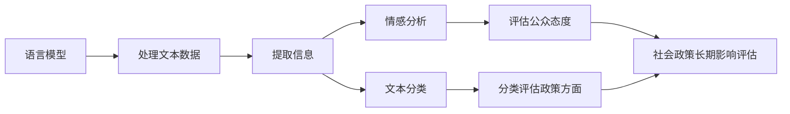

# 语言模型在社会政策长期影响评估中的应用

> 关键词：语言模型、社会政策、长期影响评估、自然语言处理、数据挖掘

> 摘要：本文聚焦于语言模型在社会政策长期影响评估中的应用。首先介绍了相关背景，包括目的范围、预期读者等。接着阐述了核心概念及联系，展示了语言模型与社会政策评估之间的关系。详细讲解了核心算法原理和具体操作步骤，结合 Python 代码进行说明。同时给出了相关的数学模型和公式，并举例说明。通过项目实战，包括开发环境搭建、源代码实现和解读，展示了如何利用语言模型进行社会政策长期影响评估。分析了实际应用场景，推荐了学习资源、开发工具框架以及相关论文著作。最后总结了未来发展趋势与挑战，并对常见问题进行了解答，提供了扩展阅读和参考资料，旨在为相关领域的研究和实践提供全面而深入的指导。

## 1. 背景介绍 
### 1.1 目的和范围
社会政策的制定和实施对于社会的稳定和发展至关重要。评估社会政策的长期影响，有助于政策制定者了解政策的实际效果，为政策的调整和优化提供依据。然而，传统的评估方法往往存在数据获取困难、评估周期长、主观性强等问题。语言模型作为一种强大的自然语言处理工具，能够处理和分析大量的文本数据，为社会政策长期影响评估提供了新的思路和方法。

本文的目的是探讨语言模型在社会政策长期影响评估中的应用，包括核心概念、算法原理、操作步骤、数学模型等方面。范围涵盖了语言模型在不同类型社会政策评估中的应用，如教育政策、医疗政策、就业政策等。

### 1.2 预期读者
本文的预期读者包括政策制定者、社会政策研究人员、自然语言处理工程师、数据科学家等。政策制定者可以通过本文了解如何利用语言模型评估社会政策的长期影响，为政策决策提供支持；社会政策研究人员可以借鉴语言模型的方法，丰富研究手段；自然语言处理工程师和数据科学家可以从技术层面深入了解语言模型在社会政策评估中的应用，开展相关的研究和开发工作。

### 1.3 文档结构概述
本文将按照以下结构进行组织：
- 核心概念与联系：介绍语言模型和社会政策长期影响评估的核心概念，以及它们之间的联系。
- 核心算法原理 & 具体操作步骤：详细讲解语言模型在社会政策评估中使用的核心算法原理，并给出具体的操作步骤，同时使用 Python 代码进行阐述。
- 数学模型和公式 & 详细讲解 & 举例说明：介绍相关的数学模型和公式，并进行详细讲解和举例说明。
- 项目实战：通过实际案例展示如何使用语言模型进行社会政策长期影响评估，包括开发环境搭建、源代码实现和代码解读。
- 实际应用场景：分析语言模型在社会政策长期影响评估中的实际应用场景。
- 工具和资源推荐：推荐相关的学习资源、开发工具框架和论文著作。
- 总结：未来发展趋势与挑战：总结语言模型在社会政策长期影响评估中的应用现状，分析未来发展趋势和面临的挑战。
- 附录：常见问题与解答：对常见问题进行解答。
- 扩展阅读 & 参考资料：提供相关的扩展阅读和参考资料。

### 1.4 术语表
#### 1.4.1 核心术语定义
- **语言模型**：是一种基于统计学或深度学习的模型，用于对自然语言进行建模和处理。它可以预测文本序列中下一个单词或字符的概率，也可以生成自然语言文本。
- **社会政策**：是指国家或政府为了实现社会公平、社会稳定和社会发展等目标，而制定和实施的一系列政策措施。
- **长期影响评估**：是指对社会政策在较长时间内产生的影响进行评估，包括政策的效果、效益、影响范围等方面。

#### 1.4.2 相关概念解释
- **自然语言处理**：是指计算机科学与语言学的交叉领域，研究如何让计算机处理和理解自然语言。自然语言处理的任务包括文本分类、情感分析、命名实体识别等。
- **数据挖掘**：是指从大量的数据中提取有价值的信息和知识的过程。数据挖掘的方法包括分类、聚类、关联规则挖掘等。

#### 1.4.3 缩略词列表
- **NLP**：Natural Language Processing，自然语言处理
- **ML**：Machine Learning，机器学习
- **DL**：Deep Learning，深度学习

## 2. 核心概念与联系 

### 语言模型的核心概念
语言模型旨在学习语言的统计规律，以预测文本序列中后续元素的概率分布。在传统方法中，如 n - 元语法模型，基于马尔可夫假设，即下一个词的出现仅依赖于前 n - 1 个词。例如，在二元语法模型（bigram model）中，一个词出现的概率只与它前面的一个词有关。

现代深度学习语言模型，如 Transformer 架构的模型（如 BERT、GPT 等），通过多层的自注意力机制来捕捉文本中的长距离依赖关系。自注意力机制允许模型在处理每个词时，动态地关注文本中其他词的信息，从而更准确地理解文本的语义和上下文。

### 社会政策长期影响评估的核心概念
社会政策长期影响评估是一个复杂的过程，旨在全面了解社会政策在较长时间跨度内对社会各个层面产生的影响。评估内容包括政策对经济、社会公平、环境、文化等方面的影响，以及政策的实施效果、效益和可持续性。评估方法通常包括定量分析和定性分析，定量分析如统计数据的收集和分析，定性分析如专家访谈、案例研究等。

### 两者的联系
语言模型在社会政策长期影响评估中具有重要的应用价值。首先，社会政策的相关信息大量以文本形式存在，如政策文件、新闻报道、公众反馈等。语言模型可以对这些文本数据进行处理和分析，提取有价值的信息，如政策的目标、实施情况、公众的态度等。其次，语言模型可以用于情感分析，了解公众对社会政策的情感倾向，为政策评估提供主观层面的信息。此外，语言模型还可以用于文本分类，将政策相关的文本分为不同的类别，便于对政策的不同方面进行评估。

### 文本示意图
```plaintext
语言模型 <----> 社会政策长期影响评估
        |               |
        | 处理分析文本  | 提供评估信息
        |               |
        v               v
文本数据（政策文件、新闻等） 评估结果（政策效果、公众态度等）
```

### Mermaid 流程图


## 3. 核心算法原理 & 具体操作步骤 

### 核心算法原理 - 以 BERT 为例
BERT（Bidirectional Encoder Representations from Transformers）是一种基于 Transformer 架构的预训练语言模型。其核心思想是通过双向的自注意力机制来学习文本的上下文表示。

在预训练阶段，BERT 采用了两种任务：掩码语言模型（Masked Language Model，MLM）和下一句预测（Next Sentence Prediction，NSP）。

#### 掩码语言模型（MLM）
在输入的文本中，随机选择一些词进行掩码（mask），然后让模型预测这些被掩码的词。例如，对于句子 “The dog is running in the park”，将 “dog” 掩码为 “[MASK]”，模型需要预测 “[MASK]” 应该是 “dog”。通过这种方式，模型可以学习到词与词之间的上下文关系。

#### 下一句预测（NSP）
给定两个句子 A 和 B，模型需要判断 B 是否是 A 的下一句。这有助于模型学习句子之间的语义关系。

### 具体操作步骤

#### 步骤 1：数据收集
收集与社会政策相关的文本数据，如政策文件、新闻报道、社交媒体评论等。可以使用网络爬虫工具来获取网页上的文本数据。

#### 步骤 2：数据预处理
对收集到的文本数据进行预处理，包括去除噪声、分词、去除停用词等。以下是使用 Python 和 NLTK 库进行数据预处理的示例代码：
```python
import nltk
from nltk.corpus import stopwords
from nltk.tokenize import word_tokenize
import string

nltk.download('punkt')
nltk.download('stopwords')

def preprocess_text(text):
    # 转换为小写
    text = text.lower()
    # 去除标点符号
    text = text.translate(str.maketrans('', '', string.punctuation))
    # 分词
    tokens = word_tokenize(text)
    # 去除停用词
    stop_words = set(stopwords.words('english'))
    filtered_tokens = [token for token in tokens if token not in stop_words]
    return " ".join(filtered_tokens)

# 示例文本
text = "The new social policy aims to improve the living standards of the poor."
preprocessed_text = preprocess_text(text)
print(preprocessed_text)
```

#### 步骤 3：加载预训练的语言模型
可以使用 Hugging Face 的 Transformers 库来加载预训练的 BERT 模型。以下是加载 BERT 模型并进行编码的示例代码：
```python
from transformers import BertTokenizer, BertModel

# 加载预训练的 BERT 模型和分词器
tokenizer = BertTokenizer.from_pretrained('bert-base-uncased')
model = BertModel.from_pretrained('bert-base-uncased')

# 对预处理后的文本进行编码
input_ids = tokenizer.encode(preprocessed_text, return_tensors='pt')
outputs = model(input_ids)
# 获取最后一层的隐藏状态
last_hidden_states = outputs.last_hidden_state
print(last_hidden_states.shape)
```

#### 步骤 4：特征提取和分析
从 BERT 模型的输出中提取特征，如句子的向量表示。可以使用这些特征进行后续的分析，如文本分类、情感分析等。以下是使用句子向量进行文本分类的示例代码：
```python
import torch
from sklearn.model_selection import train_test_split
from sklearn.linear_model import LogisticRegression
from sklearn.metrics import accuracy_score

# 假设我们有一些标签数据
labels = [1, 0, 1, 0]
# 为了简单起见，我们使用每个句子的第一个词的向量作为特征
features = last_hidden_states[:, 0, :].detach().numpy()

# 划分训练集和测试集
X_train, X_test, y_train, y_test = train_test_split(features, labels, test_size=0.2, random_state=42)

# 训练逻辑回归模型
clf = LogisticRegression()
clf.fit(X_train, y_train)

# 预测并计算准确率
y_pred = clf.predict(X_test)
accuracy = accuracy_score(y_test, y_pred)
print(f"Accuracy: {accuracy}")
```

## 4. 数学模型和公式 & 详细讲解 & 举例说明 

### 掩码语言模型（MLM）的数学模型
在掩码语言模型中，目标是最大化被掩码词的预测概率。假设输入的文本序列为 $x = [x_1, x_2, \cdots, x_n]$，其中一部分词被掩码，掩码位置集合为 $M$。模型的目标是最大化以下对数似然函数：

$$
\mathcal{L}_{MLM} = - \sum_{i \in M} \log P(x_i | x_{1:i - 1}, x_{i + 1:n})
$$

其中，$P(x_i | x_{1:i - 1}, x_{i + 1:n})$ 表示在给定上下文 $x_{1:i - 1}$ 和 $x_{i + 1:n}$ 的情况下，预测 $x_i$ 的概率。

### 下一句预测（NSP）的数学模型
下一句预测是一个二分类问题，模型需要判断两个句子是否是连续的。假设输入的两个句子为 $A$ 和 $B$，标签为 $y \in \{0, 1\}$，其中 $y = 1$ 表示 $B$ 是 $A$ 的下一句，$y = 0$ 表示 $B$ 不是 $A$ 的下一句。模型的目标是最小化交叉熵损失函数：

$$
\mathcal{L}_{NSP} = - \sum_{i = 1}^{N} [y_i \log p(y_i = 1) + (1 - y_i) \log (1 - p(y_i = 1))]
$$

其中，$N$ 是样本数量，$p(y_i = 1)$ 是模型预测第 $i$ 个样本为正类的概率。

### 举例说明
假设我们有以下文本：
```
Sentence A: "The government introduced a new social policy."
Sentence B: "It aims to reduce poverty and improve social welfare."
```
在 MLM 任务中，如果我们将 “new” 掩码，模型需要预测 “new”。在 NSP 任务中，由于 Sentence B 是 Sentence A 的合理下一句，标签 $y = 1$。模型需要学习如何根据输入的句子对预测这个标签。

## 5. 项目实战：代码实际案例和详细解释说明 

### 5.1  开发环境搭建
#### 操作系统
建议使用 Linux 或 macOS 操作系统，因为它们对 Python 和深度学习框架的支持更好。

#### Python 环境
安装 Python 3.7 或更高版本。可以使用 Anaconda 来管理 Python 环境，以下是创建和激活虚拟环境的命令：
```bash
conda create -n policy_eval python=3.8
conda activate policy_eval
```

#### 安装依赖库
安装必要的 Python 库，如 Transformers、NLTK、Scikit - learn 等：
```bash
pip install transformers nltk scikit-learn torch
```

### 5.2  源代码详细实现和代码解读
以下是一个完整的项目示例，用于对社会政策相关的新闻报道进行情感分析。

```python
import nltk
from nltk.corpus import stopwords
from nltk.tokenize import word_tokenize
import string
from transformers import AutoTokenizer, AutoModelForSequenceClassification
import torch

# 数据预处理函数
def preprocess_text(text):
    text = text.lower()
    text = text.translate(str.maketrans('', '', string.punctuation))
    tokens = word_tokenize(text)
    stop_words = set(stopwords.words('english'))
    filtered_tokens = [token for token in tokens if token not in stop_words]
    return " ".join(filtered_tokens)

# 加载预训练的情感分析模型和分词器
tokenizer = AutoTokenizer.from_pretrained('distilbert-base-uncased-finetuned-sst-2-english')
model = AutoModelForSequenceClassification.from_pretrained('distilbert-base-uncased-finetuned-sst-2-english')

# 示例新闻报道
news_text = "The new social policy has received widespread praise for its positive impact on the community."
preprocessed_text = preprocess_text(news_text)

# 对文本进行编码
inputs = tokenizer(preprocessed_text, return_tensors='pt')

# 进行情感分析
with torch.no_grad():
    outputs = model(**inputs)
    logits = outputs.logits
    predictions = torch.argmax(logits, dim=1)

# 输出结果
label_mapping = {0: 'Negative', 1: 'Positive'}
sentiment = label_mapping[predictions.item()]
print(f"Sentiment: {sentiment}")
```

### 代码解读与分析
1. **数据预处理**：`preprocess_text` 函数将输入的文本转换为小写，去除标点符号，分词并去除停用词。这有助于减少噪声，提高模型的性能。
2. **模型加载**：使用 `AutoTokenizer` 和 `AutoModelForSequenceClassification` 从 Hugging Face 的模型库中加载预训练的情感分析模型和分词器。
3. **文本编码**：使用分词器将预处理后的文本编码为模型可以接受的输入格式。
4. **情感分析**：使用 `torch.no_grad()` 上下文管理器来禁用梯度计算，以提高推理速度。模型的输出是一个逻辑值（logits），通过 `torch.argmax` 函数找到最大概率的类别。
5. **结果输出**：将预测的类别索引映射为情感标签（Positive 或 Negative）并输出。

## 6. 实际应用场景 
### 政策效果评估
语言模型可以对政策实施后的相关文本进行分析，了解政策在实际执行中的效果。例如，通过分析新闻报道、社交媒体评论等，评估政策是否达到了预期的目标，如是否提高了公众的生活质量、是否促进了经济发展等。

### 公众态度监测
实时监测公众对社会政策的态度和反馈。通过情感分析，了解公众是支持、反对还是中立，以及公众关注的政策重点和问题。这有助于政策制定者及时调整政策，提高公众的满意度。

### 政策比较分析
对不同地区或不同时期的社会政策进行比较分析。通过文本分类和主题建模，找出政策之间的异同点，为政策的优化和借鉴提供参考。

### 政策风险预警
分析文本中是否存在与政策风险相关的信息，如政策实施可能带来的负面影响、社会不稳定因素等。及时发现潜在的风险，为政策制定者提供预警。

## 7. 工具和资源推荐
### 7.1 学习资源推荐
#### 7.1.1 书籍推荐
- 《自然语言处理入门》：介绍了自然语言处理的基本概念、方法和技术，适合初学者。
- 《深度学习》：全面介绍了深度学习的理论和应用，包括语言模型的相关内容。
- 《Python 自然语言处理实战》：通过实际案例介绍了如何使用 Python 进行自然语言处理。

#### 7.1.2 在线课程
- Coursera 上的 “Natural Language Processing Specialization”：由知名教授授课，系统介绍了自然语言处理的各个方面。
- edX 上的 “Deep Learning for Natural Language Processing”：专注于深度学习在自然语言处理中的应用。

#### 7.1.3 技术博客和网站
- Hugging Face 博客：提供了关于语言模型的最新研究成果和应用案例。
- Medium 上的自然语言处理相关博客：有很多专业人士分享的经验和技巧。

### 7.2 开发工具框架推荐
#### 7.2.1 IDE和编辑器
- PyCharm：功能强大的 Python 集成开发环境，适合大型项目的开发。
- Jupyter Notebook：交互式的开发环境，适合快速验证想法和进行数据分析。

#### 7.2.2 调试和性能分析工具
- TensorBoard：用于可视化深度学习模型的训练过程和性能指标。
- Py-Spy：可以对 Python 代码进行性能分析，找出性能瓶颈。

#### 7.2.3 相关框架和库
- Transformers：Hugging Face 开发的用于自然语言处理的库，提供了丰富的预训练模型和工具。
- NLTK：自然语言处理工具包，包含了很多常用的自然语言处理任务的实现。
- SpaCy：高效的自然语言处理库，适合大规模文本处理。

### 7.3 相关论文著作推荐
#### 7.3.1 经典论文
- “Attention Is All You Need”：介绍了 Transformer 架构，是现代语言模型的基础。
- “BERT: Pre-training of Deep Bidirectional Transformers for Language Understanding”：提出了 BERT 模型，开创了预训练语言模型的新纪元。

#### 7.3.2 最新研究成果
可以关注 ACL（Association for Computational Linguistics）、EMNLP（Conference on Empirical Methods in Natural Language Processing）等会议上的最新研究成果。

#### 7.3.3 应用案例分析
一些知名的研究机构和智库会发布关于社会政策评估的研究报告，其中可能包含语言模型的应用案例。可以关注世界银行、国际货币基金组织等机构的相关报告。

## 8. 总结：未来发展趋势与挑战
### 未来发展趋势
- **多模态融合**：将语言模型与图像、音频等多模态数据相结合，更全面地评估社会政策的影响。例如，通过分析新闻报道中的图片和视频，了解政策实施的实际场景。
- **个性化评估**：根据不同的用户群体和需求，提供个性化的政策评估结果。例如，针对不同地区、不同年龄段的人群，分析政策对他们的具体影响。
- **实时评估**：实现对社会政策的实时监测和评估，及时发现政策实施过程中的问题并进行调整。
- **跨领域应用**：将语言模型在社会政策评估中的应用拓展到其他领域，如医疗、教育、环境等，促进不同领域的政策协同发展。

### 挑战
- **数据质量问题**：社会政策相关的文本数据可能存在噪声、偏差等问题，影响语言模型的性能。需要开发有效的数据清洗和预处理方法。
- **模型解释性**：深度学习语言模型通常是黑盒模型，难以解释其决策过程。在社会政策评估中，需要提高模型的解释性，以便政策制定者理解评估结果。
- **隐私和安全问题**：处理社会政策相关的文本数据可能涉及个人隐私和敏感信息，需要采取有效的隐私保护和安全措施。
- **计算资源需求**：训练和运行大型语言模型需要大量的计算资源，成本较高。需要开发更高效的算法和模型，降低计算资源的需求。

## 9. 附录：常见问题与解答
### 问题 1：语言模型在社会政策评估中的准确性如何保证？
答：可以通过以下方法保证语言模型的准确性：
- 使用高质量的训练数据，包括标注准确的文本数据和多样化的数据来源。
- 对模型进行调优，如调整超参数、进行模型融合等。
- 进行交叉验证和评估，使用不同的评估指标来评估模型的性能。

### 问题 2：如何选择适合的语言模型进行社会政策评估？
答：选择适合的语言模型需要考虑以下因素：
- 任务类型：不同的任务（如情感分析、文本分类等）可能需要不同的模型。
- 数据规模：如果数据规模较小，可以选择轻量级的预训练模型；如果数据规模较大，可以选择更复杂的模型。
- 计算资源：模型的大小和复杂度会影响计算资源的需求，需要根据实际情况选择合适的模型。

### 问题 3：语言模型能否替代传统的社会政策评估方法？
答：语言模型不能完全替代传统的社会政策评估方法。语言模型可以为评估提供新的视角和方法，但传统的评估方法如实地调研、统计分析等仍然具有重要的作用。可以将语言模型与传统方法相结合，提高评估的准确性和全面性。

## 10. 扩展阅读 & 参考资料
### 扩展阅读
- 《社会政策分析》：深入介绍了社会政策的分析方法和评估技术。
- 《自然语言处理前沿技术》：介绍了自然语言处理的最新研究成果和发展趋势。

### 参考资料
- Hugging Face 官方文档：https://huggingface.co/docs
- NLTK 官方文档：https://www.nltk.org/
- Scikit - learn 官方文档：https://scikit - learn.org/

作者：AI天才研究院/AI Genius Institute & 禅与计算机程序设计艺术 /Zen And The Art of Computer Programming