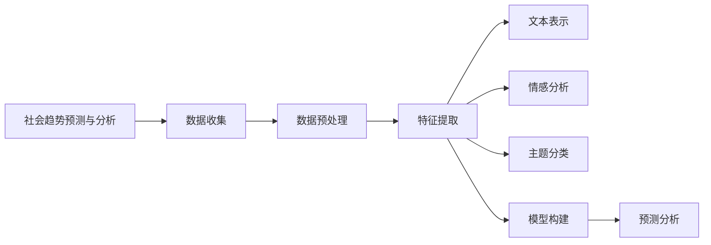

# 语言模型在社会趋势预测与分析中的应用研究

> 关键词：语言模型、社会趋势预测、社会趋势分析、自然语言处理、数据挖掘

> 摘要：本文聚焦于语言模型在社会趋势预测与分析中的应用。随着自然语言处理技术的飞速发展，语言模型展现出强大的文本理解和生成能力。通过对语言模型核心概念、算法原理、数学模型等方面的深入探讨，结合实际案例分析其在社会趋势预测与分析中的具体应用。同时，介绍了相关的工具和资源，最后对语言模型在该领域的未来发展趋势与挑战进行总结，旨在为相关研究和实践提供全面而深入的参考。

## 1. 背景介绍 
### 1.1 目的和范围
本研究的目的在于深入探究语言模型在社会趋势预测与分析领域的应用机制、效果和潜力。随着社交媒体、新闻资讯等文本数据的爆炸式增长，如何从海量的文本信息中提取有价值的社会趋势信息成为关键问题。语言模型作为自然语言处理的核心技术之一，具有强大的文本理解和生成能力，为解决这一问题提供了有效的途径。本研究将涵盖语言模型的基本原理、在社会趋势预测与分析中的具体应用场景、相关的算法和技术，以及实际案例的分析和解读。

### 1.2 预期读者
本文的预期读者包括自然语言处理领域的研究人员、数据分析师、社会学家、政策制定者以及对语言模型和社会趋势分析感兴趣的技术爱好者。对于研究人员，本文可以提供新的研究思路和方向；对于数据分析师，有助于他们掌握利用语言模型进行社会趋势分析的方法和技巧；对于社会学家和政策制定者，能为他们理解社会现象和制定政策提供数据支持和决策依据；对于技术爱好者，可帮助他们了解语言模型在实际应用中的魅力。

### 1.3 文档结构概述
本文将按照以下结构展开：首先介绍语言模型和社会趋势预测与分析的核心概念及其联系，通过文本示意图和 Mermaid 流程图进行直观展示；接着详细阐述语言模型的核心算法原理，并给出具体操作步骤，同时结合 Python 源代码进行说明；然后介绍语言模型涉及的数学模型和公式，并通过举例进行详细讲解；之后通过实际项目案例，介绍开发环境搭建、源代码实现和代码解读；再探讨语言模型在社会趋势预测与分析中的实际应用场景；推荐相关的学习资源、开发工具框架和论文著作；最后总结语言模型在该领域的未来发展趋势与挑战，并提供常见问题解答和扩展阅读参考资料。

### 1.4 术语表
#### 1.4.1 核心术语定义
- **语言模型**：是一种对自然语言文本进行建模的概率模型，用于计算文本序列的概率分布，预测下一个可能出现的词或字符。
- **社会趋势**：指在一定时期内，社会中出现的具有普遍性和倾向性的发展方向或变化态势，可通过社会现象、公众意见、消费行为等方面体现。
- **自然语言处理（NLP）**：是计算机科学与人工智能领域的一个重要分支，旨在让计算机能够理解、处理和生成人类语言。
- **文本挖掘**：从大量文本数据中发现有价值的信息和知识的过程，包括文本分类、聚类、情感分析等任务。

#### 1.4.2 相关概念解释
- **预训练语言模型**：在大规模无监督文本数据上进行预训练的语言模型，学习到通用的语言知识和模式，可通过微调应用于各种下游任务。
- **社会网络分析**：研究社会网络中个体之间的关系和互动模式，通过分析网络结构和节点特征来揭示社会现象和趋势。
- **情感分析**：对文本中表达的情感倾向进行判断和分类，如积极、消极、中性等，可用于了解公众对特定事件或话题的态度。

#### 1.4.3 缩略词列表
- **NLP**：Natural Language Processing（自然语言处理）
- **LM**：Language Model（语言模型）
- **BERT**：Bidirectional Encoder Representations from Transformers（基于变换器的双向编码器表示）
- **GPT**：Generative Pretrained Transformer（生成式预训练变换器）

## 2. 核心概念与联系 
### 语言模型核心概念
语言模型的核心目标是对自然语言文本的概率分布进行建模。给定一个文本序列 $w_1, w_2, \cdots, w_n$，语言模型要计算出该序列出现的概率 $P(w_1, w_2, \cdots, w_n)$。根据链式法则，该概率可以分解为：

$$P(w_1, w_2, \cdots, w_n) = \prod_{i=1}^{n} P(w_i | w_1, w_2, \cdots, w_{i-1})$$

早期的语言模型如 n - gram 模型，假设一个词的出现只依赖于其前 $n - 1$ 个词，即：

$$P(w_i | w_1, w_2, \cdots, w_{i-1}) \approx P(w_i | w_{i - n + 1}, \cdots, w_{i-1})$$

随着深度学习的发展，基于神经网络的语言模型如循环神经网络（RNN）、长短期记忆网络（LSTM）和变换器（Transformer）等逐渐成为主流。其中，Transformer 模型具有强大的并行计算能力和长序列处理能力，成为当前语言模型的核心架构。

### 社会趋势预测与分析核心概念
社会趋势预测与分析旨在通过对社会现象、公众意见、经济数据等多源信息的收集和分析，预测社会未来的发展方向和变化趋势。其过程通常包括数据收集、数据预处理、特征提取、模型构建和预测分析等步骤。

### 两者的联系
语言模型在社会趋势预测与分析中具有重要作用。通过对社交媒体、新闻报道、论坛评论等文本数据的处理，语言模型可以提取其中的关键信息和情感倾向，从而了解公众对特定事件或话题的关注程度和态度。此外，语言模型还可以对文本进行分类、聚类等操作，发现社会现象之间的关联和规律，为社会趋势的预测提供依据。

### 文本示意图
```plaintext
社会趋势预测与分析
|
|-- 数据收集（社交媒体、新闻等文本数据）
|
|-- 数据预处理（清洗、分词、标注等）
|
|-- 特征提取（使用语言模型）
|       |
|       |-- 文本表示（词向量、句向量等）
|       |
|       |-- 情感分析
|       |
|       |-- 主题分类
|
|-- 模型构建（机器学习、深度学习模型）
|
|-- 预测分析（趋势预测、风险评估等）
```

### Mermaid 流程图


## 3. 核心算法原理 & 具体操作步骤 
### 变换器（Transformer）算法原理
变换器（Transformer）是一种基于注意力机制的深度学习模型，由编码器和解码器组成。编码器负责将输入的文本序列转换为一系列的特征表示，解码器则根据这些特征表示生成输出序列。

#### 多头注意力机制
多头注意力机制是 Transformer 的核心组件之一，它允许模型在不同的表示子空间中并行地关注输入序列的不同部分。多头注意力机制的计算过程如下：

1. 将输入的查询（Query）、键（Key）和值（Value）分别通过线性变换得到多个头的查询、键和值。
2. 对于每个头，计算注意力分数：

$$Attention(Q, K, V) = softmax(\frac{QK^T}{\sqrt{d_k}})V$$

其中，$Q$ 是查询矩阵，$K$ 是键矩阵，$V$ 是值矩阵，$d_k$ 是键的维度。

3. 将每个头的注意力输出拼接起来，再通过一个线性变换得到最终的多头注意力输出。

#### 前馈神经网络
在多头注意力机制之后，每个位置的特征表示会通过一个前馈神经网络进行非线性变换。前馈神经网络由两个全连接层和一个激活函数（通常是 ReLU）组成。

### Python 代码实现
```python
import torch
import torch.nn as nn
import torch.nn.functional as F

class MultiHeadAttention(nn.Module):
    def __init__(self, d_model, num_heads):
        super(MultiHeadAttention, self).__init__()
        assert d_model % num_heads == 0, "d_model must be divisible by num_heads"

        self.d_model = d_model
        self.num_heads = num_heads
        self.d_k = d_model // num_heads

        self.W_q = nn.Linear(d_model, d_model)
        self.W_k = nn.Linear(d_model, d_model)
        self.W_v = nn.Linear(d_model, d_model)
        self.W_o = nn.Linear(d_model, d_model)

    def scaled_dot_product_attention(self, Q, K, V, mask=None):
        attn_scores = torch.matmul(Q, K.transpose(-2, -1)) / torch.sqrt(torch.tensor(self.d_k, dtype=torch.float32))
        if mask is not None:
            attn_scores = attn_scores.masked_fill(mask == 0, -1e9)
        attn_probs = F.softmax(attn_scores, dim=-1)
        output = torch.matmul(attn_probs, V)
        return output

    def split_heads(self, x):
        batch_size, seq_length, d_model = x.size()
        return x.view(batch_size, seq_length, self.num_heads, self.d_k).transpose(1, 2)

    def combine_heads(self, x):
        batch_size, num_heads, seq_length, d_k = x.size()
        return x.transpose(1, 2).contiguous().view(batch_size, seq_length, self.d_model)

    def forward(self, Q, K, V, mask=None):
        Q = self.split_heads(self.W_q(Q))
        K = self.split_heads(self.W_k(K))
        V = self.split_heads(self.W_v(V))

        attn_output = self.scaled_dot_product_attention(Q, K, V, mask)
        output = self.W_o(self.combine_heads(attn_output))
        return output

class PositionwiseFeedForward(nn.Module):
    def __init__(self, d_model, d_ff):
        super(PositionwiseFeedForward, self).__init__()
        self.fc1 = nn.Linear(d_model, d_ff)
        self.fc2 = nn.Linear(d_ff, d_model)
        self.relu = nn.ReLU()

    def forward(self, x):
        return self.fc2(self.relu(self.fc1(x)))

class EncoderLayer(nn.Module):
    def __init__(self, d_model, num_heads, d_ff, dropout):
        super(EncoderLayer, self).__init__()
        self.self_attn = MultiHeadAttention(d_model, num_heads)
        self.feed_forward = PositionwiseFeedForward(d_model, d_ff)
        self.norm1 = nn.LayerNorm(d_model)
        self.norm2 = nn.LayerNorm(d_model)
        self.dropout = nn.Dropout(dropout)

    def forward(self, x, mask):
        attn_output = self.self_attn(x, x, x, mask)
        x = self.norm1(x + self.dropout(attn_output))
        ff_output = self.feed_forward(x)
        x = self.norm2(x + self.dropout(ff_output))
        return x

# 示例使用
d_model = 512
num_heads = 8
d_ff = 2048
dropout = 0.1
batch_size = 32
seq_length = 10
input_tensor = torch.randn(batch_size, seq_length, d_model)
mask = torch.ones(batch_size, 1, seq_length, seq_length)

encoder_layer = EncoderLayer(d_model, num_heads, d_ff, dropout)
output = encoder_layer(input_tensor, mask)
print(output.shape)
```

### 具体操作步骤
1. **数据准备**：收集和整理用于训练语言模型的文本数据，并进行预处理，如清洗、分词、标注等。
2. **模型构建**：根据需求选择合适的语言模型架构，如 Transformer，并进行模型的初始化。
3. **模型训练**：使用预处理后的数据对模型进行训练，通过优化算法（如 Adam）最小化损失函数（如交叉熵损失）。
4. **模型评估**：使用验证集对训练好的模型进行评估，选择合适的评估指标（如准确率、召回率、F1 值等）。
5. **模型应用**：将训练好的模型应用于社会趋势预测与分析任务，如文本分类、情感分析、主题建模等。

## 4. 数学模型和公式 & 详细讲解 & 举例说明 
### 语言模型的概率公式
如前文所述，语言模型的核心是计算文本序列的概率分布。给定一个文本序列 $w_1, w_2, \cdots, w_n$，其概率可以表示为：

$$P(w_1, w_2, \cdots, w_n) = \prod_{i=1}^{n} P(w_i | w_1, w_2, \cdots, w_{i-1})$$

### n - gram 模型
n - gram 模型是一种简单的语言模型，假设一个词的出现只依赖于其前 $n - 1$ 个词。对于一个 $n$ - gram 模型，$P(w_i | w_1, w_2, \cdots, w_{i-1})$ 可以近似为 $P(w_i | w_{i - n + 1}, \cdots, w_{i-1})$。

以二元（bi - gram）模型为例，$n = 2$，则：

$$P(w_1, w_2, \cdots, w_n) \approx \prod_{i=1}^{n} P(w_i | w_{i - 1})$$

$P(w_i | w_{i - 1})$ 可以通过最大似然估计计算：

$$P(w_i | w_{i - 1}) = \frac{C(w_{i - 1}, w_i)}{C(w_{i - 1})}$$

其中，$C(w_{i - 1}, w_i)$ 是 $w_{i - 1}$ 和 $w_i$ 同时出现的次数，$C(w_{i - 1})$ 是 $w_{i - 1}$ 出现的次数。

### 举例说明
假设我们有一个文本语料库：["I love programming", "Programming is fun"]。对于二元模型，我们可以计算一些概率：

- $P(\text{love} | \text{I})$：$C(\text{I}, \text{love}) = 1$，$C(\text{I}) = 1$，所以 $P(\text{love} | \text{I}) = \frac{1}{1} = 1$。
- $P(\text{programming} | \text{love})$：$C(\text{love}, \text{programming}) = 1$，$C(\text{love}) = 1$，所以 $P(\text{programming} | \text{love}) = \frac{1}{1} = 1$。

### 变换器（Transformer）中的数学模型
#### 注意力分数计算
在多头注意力机制中，注意力分数的计算使用了缩放点积注意力公式：

$$Attention(Q, K, V) = softmax(\frac{QK^T}{\sqrt{d_k}})V$$

其中，$Q$ 是查询矩阵，$K$ 是键矩阵，$V$ 是值矩阵，$d_k$ 是键的维度。缩放因子 $\frac{1}{\sqrt{d_k}}$ 用于防止点积结果过大，导致 softmax 函数的梯度变得很小。

#### 举例说明
假设 $Q$ 是一个 $3 \times 4$ 的矩阵，$K$ 是一个 $4 \times 4$ 的矩阵，$V$ 是一个 $4 \times 3$ 的矩阵，$d_k = 4$。

```python
import torch
import torch.nn.functional as F

Q = torch.randn(3, 4)
K = torch.randn(4, 4)
V = torch.randn(4, 3)
d_k = 4

attn_scores = torch.matmul(Q, K.transpose(-2, -1)) / torch.sqrt(torch.tensor(d_k, dtype=torch.float32))
attn_probs = F.softmax(attn_scores, dim=-1)
output = torch.matmul(attn_probs, V)

print("Attention scores shape:", attn_scores.shape)
print("Attention probabilities shape:", attn_probs.shape)
print("Output shape:", output.shape)
```

## 5. 项目实战：代码实际案例和详细解释说明 
### 5.1  开发环境搭建
#### 操作系统
建议使用 Linux 系统，如 Ubuntu 18.04 或更高版本，也可以使用 macOS 或 Windows 系统。

#### Python 环境
安装 Python 3.7 或更高版本，可以使用 Anaconda 来管理 Python 环境。创建一个新的虚拟环境：

```bash
conda create -n lang_model_env python=3.8
conda activate lang_model_env
```

#### 安装依赖库
安装必要的 Python 库，如 PyTorch、Transformers、NLTK 等：

```bash
pip install torch transformers nltk pandas scikit-learn
```

### 5.2  源代码详细实现和代码解读
#### 文本分类任务示例
我们以使用预训练的 BERT 模型进行文本分类任务为例，假设我们有一个包含电影评论的数据集，需要将评论分为积极和消极两类。

```python
import torch
from torch.utils.data import Dataset, DataLoader
from transformers import BertTokenizer, BertForSequenceClassification, AdamW
from sklearn.model_selection import train_test_split
import pandas as pd

# 定义数据集类
class MovieReviewDataset(Dataset):
    def __init__(self, texts, labels, tokenizer, max_length):
        self.texts = texts
        self.labels = labels
        self.tokenizer = tokenizer
        self.max_length = max_length

    def __len__(self):
        return len(self.texts)

    def __getitem__(self, idx):
        text = str(self.texts[idx])
        label = self.labels[idx]
        encoding = self.tokenizer.encode_plus(
            text,
            add_special_tokens=True,
            max_length=self.max_length,
            padding='max_length',
            truncation=True,
            return_tensors='pt'
        )
        return {
            'input_ids': encoding['input_ids'].flatten(),
            'attention_mask': encoding['attention_mask'].flatten(),
            'labels': torch.tensor(label, dtype=torch.long)
        }

# 加载数据集
data = pd.read_csv('movie_reviews.csv')
texts = data['review'].tolist()
labels = data['sentiment'].tolist()

# 划分训练集和测试集
train_texts, test_texts, train_labels, test_labels = train_test_split(texts, labels, test_size=0.2, random_state=42)

# 加载预训练的 BERT 分词器和模型
tokenizer = BertTokenizer.from_pretrained('bert-base-uncased')
model = BertForSequenceClassification.from_pretrained('bert-base-uncased', num_labels=2)

# 创建数据集和数据加载器
max_length = 128
train_dataset = MovieReviewDataset(train_texts, train_labels, tokenizer, max_length)
test_dataset = MovieReviewDataset(test_texts, test_labels, tokenizer, max_length)

train_dataloader = DataLoader(train_dataset, batch_size=16, shuffle=True)
test_dataloader = DataLoader(test_dataset, batch_size=16, shuffle=False)

# 训练模型
device = torch.device('cuda' if torch.cuda.is_available() else 'cpu')
model.to(device)

optimizer = AdamW(model.parameters(), lr=2e-5)
num_epochs = 3

for epoch in range(num_epochs):
    model.train()
    total_loss = 0
    for batch in train_dataloader:
        input_ids = batch['input_ids'].to(device)
        attention_mask = batch['attention_mask'].to(device)
        labels = batch['labels'].to(device)

        optimizer.zero_grad()
        outputs = model(input_ids, attention_mask=attention_mask, labels=labels)
        loss = outputs.loss
        loss.backward()
        optimizer.step()
        total_loss += loss.item()

    print(f'Epoch {epoch + 1}, Loss: {total_loss / len(train_dataloader)}')

# 评估模型
model.eval()
correct_predictions = 0
total_predictions = 0

with torch.no_grad():
    for batch in test_dataloader:
        input_ids = batch['input_ids'].to(device)
        attention_mask = batch['attention_mask'].to(device)
        labels = batch['labels'].to(device)

        outputs = model(input_ids, attention_mask=attention_mask)
        logits = outputs.logits
        predictions = torch.argmax(logits, dim=1)

        correct_predictions += (predictions == labels).sum().item()
        total_predictions += labels.size(0)

accuracy = correct_predictions / total_predictions
print(f'Test Accuracy: {accuracy}')
```

### 5.3  代码解读与分析
#### 数据集类 `MovieReviewDataset`
该类继承自 `torch.utils.data.Dataset`，用于封装电影评论数据集。在 `__getitem__` 方法中，使用 BERT 分词器将文本转换为输入张量和注意力掩码，并返回相应的标签。

#### 数据加载和划分
使用 `pandas` 库加载包含电影评论和情感标签的 CSV 文件，并使用 `sklearn.model_selection.train_test_split` 函数将数据集划分为训练集和测试集。

#### 模型加载
使用 `transformers` 库加载预训练的 BERT 分词器和用于序列分类的 BERT 模型。

#### 训练过程
在每个训练周期中，将模型设置为训练模式，遍历训练数据加载器，计算损失并进行反向传播和参数更新。

#### 评估过程
在评估阶段，将模型设置为评估模式，遍历测试数据加载器，计算预测结果并统计准确率。

## 6. 实际应用场景 
### 舆情监测
语言模型可以用于监测社交媒体、新闻网站等平台上的公众舆情。通过对大量文本数据的分析，了解公众对特定事件、产品或政策的态度和看法。例如，政府部门可以利用语言模型监测公众对某项政策的反馈，及时调整政策方向；企业可以监测消费者对其产品的评价，改进产品质量和服务。

### 市场趋势预测
在金融、零售等行业，语言模型可以分析新闻报道、行业研究报告等文本信息，预测市场趋势和消费者需求。例如，金融机构可以通过分析财经新闻和社交媒体上的讨论，预测股票市场的走势；零售商可以根据消费者的评论和反馈，预测产品的销售趋势，优化库存管理。

### 社会事件预警
语言模型可以对社交媒体上的文本数据进行实时监测，发现潜在的社会事件和危机。例如，通过分析社交媒体上的话题热度和情感倾向，及时发现可能引发社会动荡的事件，提前采取措施进行干预。

### 政策制定支持
政府部门在制定政策时，可以利用语言模型分析公众的需求和意见，提高政策的科学性和合理性。例如，通过分析公众对教育、医疗、环保等领域的讨论，了解公众的关注点和期望，为政策制定提供参考。

## 7. 工具和资源推荐
### 7.1 学习资源推荐
#### 7.1.1 书籍推荐
- 《自然语言处理入门》：作者何晗，本书系统介绍了自然语言处理的基础理论和常用技术，适合初学者入门。
- 《深度学习》：作者 Ian Goodfellow、Yoshua Bengio 和 Aaron Courville，是深度学习领域的经典教材，涵盖了神经网络、卷积神经网络、循环神经网络等内容。
- 《Python 自然语言处理》：作者 Steven Bird、Ewan Klein 和 Edward Loper，详细介绍了使用 Python 进行自然语言处理的方法和工具。

#### 7.1.2 在线课程
- Coursera 上的“Natural Language Processing Specialization”：由斯坦福大学的教授授课，涵盖了自然语言处理的多个方面，包括词向量、序列模型、问答系统等。
- edX 上的“Introduction to Artificial Intelligence”：介绍了人工智能的基本概念和方法，包括自然语言处理的相关内容。
- 哔哩哔哩上的“李宏毅机器学习”：李宏毅教授的机器学习课程，其中包含了自然语言处理的讲解，讲解生动易懂。

#### 7.1.3 技术博客和网站
- Hugging Face Blog：提供了关于自然语言处理和深度学习的最新研究成果和技术文章，同时介绍了 Hugging Face 库的使用方法。
- Towards Data Science：一个数据科学和机器学习领域的博客平台，有很多关于自然语言处理的高质量文章。
- arXiv：一个预印本平台，提供了大量的学术论文，包括自然语言处理领域的最新研究成果。

### 7.2 开发工具框架推荐
#### 7.2.1 IDE和编辑器
- PyCharm：一款专业的 Python 集成开发环境，提供了代码编辑、调试、版本控制等功能，适合大规模 Python 项目的开发。
- Visual Studio Code：一款轻量级的代码编辑器，支持多种编程语言和插件扩展，可通过安装 Python 插件来进行 Python 开发。
- Jupyter Notebook：一个交互式的开发环境，适合进行数据探索、模型实验和代码演示。

#### 7.2.2 调试和性能分析工具
- PyTorch Profiler：PyTorch 自带的性能分析工具，可以帮助开发者分析模型的运行时间和内存使用情况，找出性能瓶颈。
- TensorBoard：一个可视化工具，可用于监控模型的训练过程，如损失函数的变化、准确率的变化等。
- cProfile：Python 自带的性能分析模块，可以分析 Python 代码的运行时间和函数调用次数。

#### 7.2.3 相关框架和库
- Transformers：Hugging Face 开发的一个自然语言处理库，提供了大量预训练的语言模型，如 BERT、GPT - 2 等，方便开发者进行模型的加载和微调。
- NLTK：自然语言工具包，提供了丰富的自然语言处理工具和数据集，如分词、词性标注、命名实体识别等。
- SpaCy：一个高效的自然语言处理库，提供了快速的分词、词性标注、句法分析等功能，支持多种语言。

### 7.3 相关论文著作推荐
#### 7.3.1 经典论文
- “Attention Is All You Need”：介绍了变换器（Transformer）模型，是自然语言处理领域的经典论文，开启了基于 Transformer 的语言模型时代。
- “BERT: Pre-training of Deep Bidirectional Transformers for Language Understanding”：提出了 BERT 模型，通过双向预训练学习到强大的语言表示，在多个自然语言处理任务上取得了优异的成绩。
- “Generative Pretrained Transformer 3 (GPT - 3): Language Models are Few - Shot Learners”：介绍了 GPT - 3 模型，展示了生成式预训练模型在少样本学习方面的强大能力。

#### 7.3.2 最新研究成果
- 关注 ACL（Association for Computational Linguistics）、EMNLP（Conference on Empirical Methods in Natural Language Processing）等自然语言处理领域的顶级会议，获取最新的研究成果。
- 关注 arXiv 上的自然语言处理相关论文，了解前沿的研究方向和技术。

#### 7.3.3 应用案例分析
- 可以参考一些实际应用案例的研究报告和论文，如某些企业如何利用语言模型进行舆情监测、市场趋势预测等，学习其应用方法和经验。

## 8. 总结：未来发展趋势与挑战
### 未来发展趋势
#### 多模态融合
未来的语言模型将不仅仅局限于处理文本数据，还将与图像、音频、视频等多模态数据进行融合。通过多模态信息的互补，语言模型可以更全面地理解和分析社会现象，提高社会趋势预测与分析的准确性和可靠性。

#### 知识增强
为了提高语言模型的语义理解能力和推理能力，未来的研究将更加注重知识增强。将外部知识图谱、常识知识等融入语言模型中，使模型能够更好地处理复杂的语义和逻辑关系，为社会趋势预测与分析提供更深入的洞察。

#### 个性化和定制化
随着社会的发展，不同用户对社会趋势预测与分析的需求也越来越多样化。未来的语言模型将更加注重个性化和定制化，根据用户的需求和偏好，提供针对性的预测和分析结果。

### 挑战
#### 数据质量和隐私问题
语言模型的性能高度依赖于数据的质量和规模。然而，在社会趋势预测与分析中，获取高质量的数据往往面临着数据噪声、数据偏差等问题。此外，数据隐私也是一个重要的挑战，如何在保护用户隐私的前提下，有效地利用数据进行分析是需要解决的问题。

#### 模型可解释性
大多数现代语言模型是基于深度学习的黑盒模型，其决策过程难以解释。在社会趋势预测与分析中，模型的可解释性至关重要，因为决策者需要了解模型的预测依据和风险。如何提高语言模型的可解释性是未来研究的一个重要方向。

#### 计算资源和效率
训练和运行大规模的语言模型需要大量的计算资源和时间。随着模型规模的不断增大，计算资源和效率的问题将更加突出。如何优化模型架构和算法，提高计算效率，降低计算成本，是语言模型在社会趋势预测与分析中广泛应用的关键。

## 9. 附录：常见问题与解答
### 问题 1：语言模型在社会趋势预测与分析中的准确性如何保证？
解答：保证语言模型在社会趋势预测与分析中的准确性需要从多个方面入手。首先，要确保训练数据的质量和多样性，数据应具有代表性，能够反映社会的真实情况。其次，选择合适的模型架构和训练方法，如使用预训练模型进行微调。此外，还需要进行充分的模型评估和调优，选择合适的评估指标，如准确率、召回率、F1 值等。最后，结合多源数据和多种分析方法，提高预测的准确性和可靠性。

### 问题 2：如何处理语言模型中的数据偏差问题？
解答：数据偏差可能导致语言模型的预测结果出现偏差。处理数据偏差问题可以采取以下措施：一是对数据进行清洗和预处理，去除噪声和异常数据；二是采用数据增强技术，增加数据的多样性；三是在模型训练过程中，使用加权损失函数或正则化方法，减少数据偏差的影响；四是引入外部知识和约束，提高模型的泛化能力。

### 问题 3：语言模型在处理长文本时存在哪些挑战？
解答：语言模型在处理长文本时面临着计算资源和内存消耗大、信息丢失等挑战。为了解决这些问题，可以采用分层注意力机制、滑动窗口等方法，减少计算量和内存占用；也可以使用预训练的长文本语言模型，如 Longformer、BigBird 等，提高模型对长文本的处理能力。

## 10. 扩展阅读 & 参考资料
### 扩展阅读
- 《人工智能时代的社会变迁与治理》：探讨了人工智能技术对社会的影响和挑战，以及如何进行有效的社会治理。
- 《大数据与社会发展》：介绍了大数据技术在社会各个领域的应用，以及对社会发展的推动作用。
- 《复杂网络与社会系统》：研究了复杂网络理论在社会系统中的应用，如社会网络分析、传播动力学等。

### 参考资料
- 论文：“Attention Is All You Need”，作者 Ashish Vaswani 等。
- 论文：“BERT: Pre-training of Deep Bidirectional Transformers for Language Understanding”，作者 Jacob Devlin 等。
- 书籍：《自然语言处理入门》，作者何晗。
- 网站：Hugging Face 官方文档（https://huggingface.co/docs）。
- 网站：NLTK 官方文档（https://www.nltk.org/）。

作者：AI天才研究院/AI Genius Institute & 禅与计算机程序设计艺术 /Zen And The Art of Computer Programming